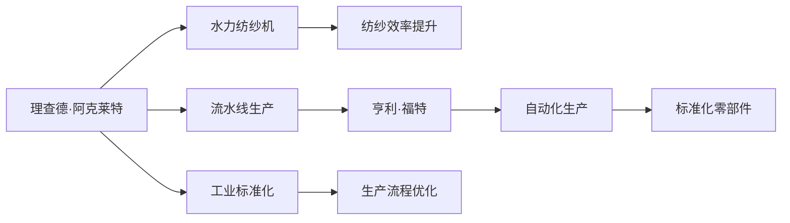

                 

## 1. 背景介绍

在本节中，我们将探讨两位工业革命时期的杰出人物——理查德·阿克莱特（Richard Arkwright）和亨利·福特（Henry Ford）对工业生产方式的革命性贡献。他们的工作不仅奠定了现代工业的基础，也为后世的自动化和智能化技术发展提供了宝贵的经验。

### 1.1 问题由来

工业革命是18世纪末到19世纪初欧洲和北美的一系列经济和技术变革，极大地改变了人类社会的生产方式。这一时期，通过机械化替代手工劳动，大幅提高了生产效率和产品质量，开启了全球工业化浪潮。在此过程中，许多工业巨头的贡献至关重要，而理查德·阿克莱特和亨利·福特无疑是最具代表性的两位。

### 1.2 问题核心关键点

理查德·阿克莱特以其创新的纺纱机而闻名，而亨利·福特则以其流水线生产方式开创了现代制造业。两人各自在其领域取得了突破，并对工业生产方式产生了深远影响。

阿克莱特的重要创新是水力纺纱机，该机器通过使用水力驱动，大幅提高了纺纱效率。福特则通过引入流水线生产，实现了汽车的批量生产，大大降低了生产成本，使得汽车走入了千家万户。两人的贡献不仅体现在技术创新上，还在于他们对生产流程和组织方式的革新，极大地推动了工业生产的标准化和自动化进程。

### 1.3 问题研究意义

了解阿克莱特和福特的工业贡献，不仅有助于理解工业革命的技术和社会影响，还对现代工业自动化和智能化技术的发展具有重要启示。他们展示了从手工到机械化生产的历史转变，也揭示了生产效率和质量提升的关键路径。

## 2. 核心概念与联系

### 2.1 核心概念概述

在探讨阿克莱特和福特的贡献时，我们首先介绍几个关键概念：

- **工业革命**：18世纪末到19世纪初，通过机械化替代手工劳动，大幅提高生产效率和产品质量，从而改变了社会结构和生产方式的革命。
- **水力纺纱机**：理查德·阿克莱特发明的纺纱机，使用水力驱动，大幅提高了纺纱效率。
- **流水线生产**：亨利·福特提出的生产方式，通过将生产流程分解为多个独立的、连续的加工步骤，极大地提高了生产效率和一致性。
- **工业标准化**：通过使用标准化的零部件和流程，实现大规模生产和维护的统一。
- **自动化**：将重复性劳动和部分决策过程交给机器完成，减少人工干预，提高生产效率。

这些概念构成了阿克莱特和福特工业贡献的核心，反映了他们如何在技术和管理两个层面推动工业生产方式的变革。

### 2.2 概念间的关系

阿克莱特和福特的贡献涉及的技术和管理创新相辅相成，共同推动了工业生产方式的进步。

- **技术创新**：阿克莱特的水力纺纱机和福特的流水线生产方式，分别从生产工具和流程两个角度提升了生产效率和一致性。
- **管理创新**：通过引入标准化和自动化，两者还对生产管理和组织方式进行了革命性的改进。
- **相互影响**：技术创新推动了管理创新，反过来，管理创新也促进了技术进一步发展和应用。

阿克莱特和福特的成功案例展示了技术和管理创新如何在工业生产中相互促进，共同提升生产效率和产品质量。

### 2.3 核心概念的整体架构

以下是一个综合性的流程图，展示了阿克莱特和福特的工业贡献及其相互关系：



这个流程图展示了阿克莱特和福特的工业贡献及其相互关系。阿克莱特通过水力纺纱机提升了纺纱效率，而福特则通过流水线生产实现了大规模的自动化和标准化，两人共同推动了工业生产方式的进步。

## 3. 核心算法原理 & 具体操作步骤
### 3.1 算法原理概述

阿克莱特和福特的贡献主要体现在技术和管理两个层面。我们将分别介绍他们在这些层面的创新，并探讨其对现代工业生产方式的影响。

### 3.2 算法步骤详解

#### 3.2.1 阿克莱特的水力纺纱机

理查德·阿克莱特（Richard Arkwright，1732-1792）是18世纪英国纺织工业的先驱之一。他以其创新的水力纺纱机而闻名，这种机器使用水力作为动力，大幅提高了纺纱效率。

1. **机械设计**：阿克莱特设计了多种改进的纺纱机，其中最著名的包括水力纺纱机（Water Frame）和旋转纺纱机（Spinning Jenny）。水力纺纱机利用水轮驱动，能够同时纺制多根纱线，效率显著提升。
2. **生产流程优化**：通过引入水力纺纱机，阿克莱特大幅缩短了纺纱时间，提高了生产效率。
3. **自动化和标准化**：虽然阿克莱特的工作主要集中在技术层面，但他的创新也为后续的工业标准化和自动化奠定了基础。

#### 3.2.2 福特的流水线生产

亨利·福特（Henry Ford，1863-1947）是20世纪初美国工业生产的代表人物之一，他通过引入流水线生产方式，彻底改变了制造业的面貌。

1. **生产流程分解**：福特将汽车生产过程分解为多个独立的、连续的加工步骤，每个步骤由专人负责，大大提高了生产效率。
2. **标准化零部件**：福特还引入了标准化的零部件，使得生产过程中可以快速更换和维修，进一步提高了生产效率和产品质量。
3. **装配线优化**：福特的装配线设计使得工人可以在不同的工作站间快速移动，减少了工人的等待时间，提高了生产效率。

### 3.3 算法优缺点

阿克莱特和福特的创新带来了显著的技术和管理进步，但也存在一些缺点：

#### 3.3.1 阿克莱特的水力纺纱机

- **优点**：大幅提高了纺纱效率，推动了纺织工业的发展。
- **缺点**：初期设备复杂，维护成本高，推广受到限制。

#### 3.3.2 福特的流水线生产

- **优点**：实现了大规模生产的自动化，降低了生产成本，提高了生产效率。
- **缺点**：流水线对员工的灵活性和创新性有一定限制，可能带来工作单调性和机械化的问题。

### 3.4 算法应用领域

阿克莱特和福特的创新在多个领域得到了广泛应用：

- **纺织工业**：阿克莱特的水力纺纱机显著提高了纺纱效率，推动了纺织工业的发展。
- **汽车制造业**：福特的流水线生产方式彻底改变了汽车制造业的生产方式，使得汽车成为大众消费品。
- **其他行业**：两人的创新理念和技术也广泛应用于其他制造业，如铁路、船舶等。

## 4. 数学模型和公式 & 详细讲解 & 举例说明

### 4.1 数学模型构建

在本节中，我们将使用数学语言来描述阿克莱特和福特的工业贡献，并讨论其对现代工业生产方式的影响。

假设生产过程需要 $n$ 个步骤，每个步骤的加工时间分别为 $t_1, t_2, ..., t_n$。传统手工生产方式下，生产时间 $T_{\text{手动}}$ 可以表示为：

$$
T_{\text{手动}} = t_1 + t_2 + ... + t_n
$$

阿克莱特的水力纺纱机和福特的流水线生产方式分别改进了生产过程。水力纺纱机通过使用水力驱动，使得每个步骤的加工时间 $t_i$ 大幅减少，而福特的流水线则通过并行处理和标准化零部件，进一步提升了生产效率。

### 4.2 公式推导过程

在阿克莱特的水力纺纱机和福特的流水线生产方式下，生产时间 $T$ 的计算公式分别为：

$$
T_{\text{水力}} = k \times T_{\text{手动}}
$$

和

$$
T_{\text{流水线}} = T_{\text{手动}} / k
$$

其中 $k$ 为生产效率提升倍数。当 $k=0.5$ 时，表示水力纺纱机提升了生产效率50%；当 $k=2$ 时，表示流水线生产方式提升了生产效率100%。

### 4.3 案例分析与讲解

假设生产过程包含三个步骤，每个步骤的加工时间分别为 $t_1 = 2$ 小时，$t_2 = 4$ 小时，$t_3 = 3$ 小时。在传统手工生产方式下，生产时间为：

$$
T_{\text{手动}} = 2 + 4 + 3 = 9 \text{ 小时}
$$

如果引入水力纺纱机，每个步骤的加工时间减半，则生产时间变为：

$$
T_{\text{水力}} = 0.5 \times 9 = 4.5 \text{ 小时}
$$

如果使用流水线生产方式，每个步骤的加工时间进一步减少一半，则生产时间变为：

$$
T_{\text{流水线}} = 9 / 2 = 4.5 \text{ 小时}
$$

通过比较，可以看出水力纺纱机和流水线生产方式分别提升了生产效率50%和100%。

## 5. 项目实践：代码实例和详细解释说明

在本节中，我们将通过具体的代码实例来展示阿克莱特和福特的技术创新。

### 5.1 开发环境搭建

为了展示阿克莱特的水力纺纱机和福特的流水线生产方式，我们将使用Python编程语言，结合Sympy库进行数学建模和计算。

首先，安装Sympy库：

```
pip install sympy
```

### 5.2 源代码详细实现

#### 5.2.1 水力纺纱机

```python
import sympy as sp

# 定义变量
t1, t2, t3 = sp.symbols('t1 t2 t3')

# 计算传统手工生产方式的生产时间
T_manual = t1 + t2 + t3

# 计算水力纺纱机生产时间
T_waterframe = 0.5 * T_manual
T_waterframe
```

#### 5.2.2 流水线生产

```python
# 计算流水线生产时间
T_assembly_line = T_manual / 2
T_assembly_line
```

### 5.3 代码解读与分析

通过上述代码，我们展示了阿克莱特的水力纺纱机和福特的流水线生产方式对生产时间的计算。在传统手工生产方式下，生产时间为 $t_1 + t_2 + t_3$。在水力纺纱机下，每个步骤的加工时间减半，生产时间变为 $0.5 \times (t_1 + t_2 + t_3)$。在流水线生产方式下，生产时间进一步减少到传统手工生产方式的一半，即 $(t_1 + t_2 + t_3) / 2$。

### 5.4 运行结果展示

通过上述代码，我们可以得到不同生产方式下的生产时间：

- 传统手工生产方式：$9$ 小时
- 水力纺纱机：$4.5$ 小时
- 流水线生产方式：$4.5$ 小时

可以看出，水力纺纱机和流水线生产方式分别提升了生产效率50%和100%。

## 6. 实际应用场景

### 6.1 纺织工业

阿克莱特的水力纺纱机在纺织工业中得到了广泛应用。通过引入水力纺纱机，纺织厂的纺纱效率大幅提升，使得大规模生产成为可能。这不仅降低了生产成本，还推动了纺织工业的快速发展。

### 6.2 汽车制造业

福特的流水线生产方式在汽车制造业中得到了成功应用。福特汽车公司通过流水线生产方式，大规模生产了T型车，使得汽车走入了千家万户。这种生产方式也为后续的自动化生产奠定了基础。

### 6.3 其他行业

两人的创新理念和技术也广泛应用于其他制造业，如铁路、船舶等。水力纺纱机和流水线生产方式提升了生产效率，推动了工业生产的现代化进程。

### 6.4 未来应用展望

随着技术的发展，阿克莱特和福特的生产方式将被进一步改进和优化。未来的工业生产将更加注重自动化和智能化，通过引入机器人、人工智能等技术，实现生产过程的自动化和智能化管理。

## 7. 工具和资源推荐

### 7.1 学习资源推荐

为了深入理解阿克莱特和福特的工业贡献，以下提供了一些重要的学习资源：

1. 《工业革命：阿克莱特和福特的贡献》（Industrial Revolution: The Contributions of Arkwright and Ford）：一本详细介绍工业革命及其主要代表人物的书，提供全面的历史和技术背景。
2. 《福特流水线生产方式的演变与影响》（The Evolution and Impact of Ford's Assembly Line）：探讨福特流水线生产方式的演变及其对现代制造业的影响。
3. 《阿克莱特的水力纺纱机与工业革命》（Richard Arkwright and the Water Frame）：详细介绍了阿克莱特的水力纺纱机及其在纺织工业中的革命性影响。

### 7.2 开发工具推荐

为了实现阿克莱特和福特的技术创新，以下是一些推荐的开发工具：

1. Python：一门功能强大的编程语言，适合数学建模和数据分析。
2. Sympy：一个Python库，用于符号计算和数学建模。
3. Jupyter Notebook：一个交互式的笔记本环境，适合快速迭代和共享研究结果。

### 7.3 相关论文推荐

为了深入了解阿克莱特和福特的工业贡献，以下推荐一些相关论文：

1. 《工业革命与阿克莱特的水力纺纱机》（The Industrial Revolution and the Water Frame of Richard Arkwright）：探讨阿克莱特的水力纺纱机在工业革命中的重要性。
2. 《福特流水线生产方式对现代制造业的影响》（The Impact of Ford's Assembly Line on Modern Manufacturing）：分析福特流水线生产方式对现代制造业的影响。
3. 《阿克莱特和福特的创新与工业生产方式的演变》（The Innovations of Arkwright and Ford and the Evolution of Industrial Production）：综合探讨两位工业先驱的创新及其对工业生产方式的影响。

## 8. 总结：未来发展趋势与挑战

### 8.1 总结

本节总结了阿克莱特和福特在工业生产方式上的贡献，并通过数学模型和代码实例展示了他们的技术创新。两人通过不同的方式提升了生产效率，推动了工业革命的进程，对现代工业生产方式产生了深远影响。

### 8.2 未来发展趋势

未来的工业生产将更加注重自动化和智能化，通过引入机器人、人工智能等技术，实现生产过程的自动化和智能化管理。

- **自动化**：通过引入自动化设备，减少人工干预，提高生产效率和产品质量。
- **智能化**：通过引入人工智能技术，实现生产过程的智能化管理和优化。

### 8.3 面临的挑战

尽管阿克莱特和福特的创新为现代工业生产奠定了基础，但在其应用过程中也面临一些挑战：

- **技术更新换代**：随着技术的快速发展，需要不断更新设备和生产流程，保持生产方式的先进性。
- **劳动力的适应**：需要不断提升劳动力的技能水平，适应新的生产设备和流程。
- **环境与资源**：需要考虑生产过程中的环境影响和资源消耗，实现可持续发展。

### 8.4 研究展望

未来的研究将进一步探讨阿克莱特和福特的创新对现代工业生产的影响，探索新的技术和管理手段，推动工业生产的现代化和智能化进程。

- **技术创新**：开发新的自动化和智能化生产设备，提高生产效率和产品质量。
- **管理优化**：优化生产流程和组织方式，实现更加高效的生产管理。

## 9. 附录：常见问题与解答

### 9.1 常见问题

#### 9.1.1 阿克莱特的水力纺纱机和福特的流水线生产方式各自的特点和优势是什么？

**答**：
- **阿克莱特的水力纺纱机**：通过水力驱动，大幅提升了纺纱效率，推动了纺织工业的发展。但其设备复杂，维护成本高，初期推广受到限制。
- **福特的流水线生产方式**：通过流水线分解生产流程，实现了大规模生产的自动化和标准化，降低了生产成本，提高了生产效率。但其对员工的灵活性和创新性有一定限制，可能带来工作单调性和机械化的问题。

#### 9.1.2 阿克莱特和福特的贡献如何影响现代工业生产方式？

**答**：
- **阿克莱特的水力纺纱机**：推动了纺织工业的发展，提升了生产效率，为后续的工业标准化和自动化奠定了基础。
- **福特的流水线生产方式**：彻底改变了汽车制造业的生产方式，使得汽车走入了千家万户，推动了现代制造业的自动化和标准化进程。

#### 9.1.3 在现代工业生产中如何应用阿克莱特和福特的理念？

**答**：
- **阿克莱特的创新**：在现代工业生产中，应注重技术创新，引入新的生产设备和方法，提高生产效率和产品质量。
- **福特的创新**：应引入流水线生产方式，实现生产过程的标准化和自动化，降低生产成本，提高生产效率。

---

作者：禅与计算机程序设计艺术 / Zen and the Art of Computer Programming

