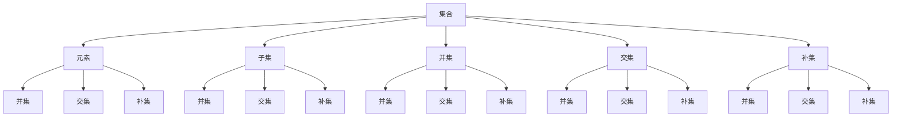
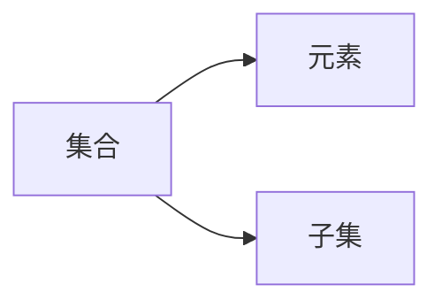
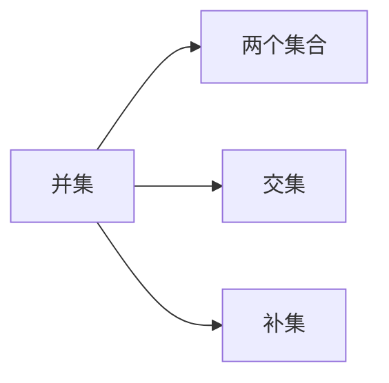
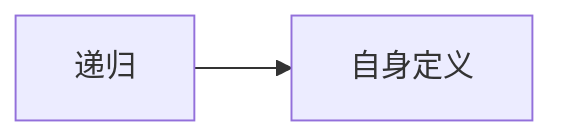
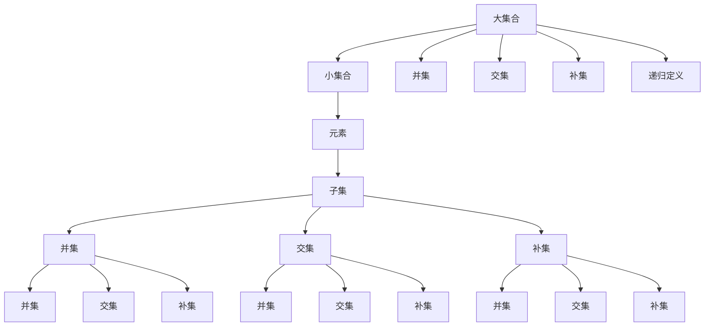

                 

## 1. 背景介绍

### 1.1 问题由来

集合论（Set Theory）是数学的基础分支之一，主要研究集合及其性质，是现代数学不可或缺的工具。集合论不仅在数学领域有着广泛应用，还在计算机科学、逻辑学、哲学等多个领域具有重要地位。

集合论的研究对象是集合（Set），集合是元素的集合，即由一定规则确定的一组元素的总体。例如，整数集、实数集、自然语言词汇集等都是常见的集合。集合论中常用的术语包括元素（Element）、集合（Set）、并集（Union）、交集（Intersection）、补集（Complement）、子集（Subset）等。

### 1.2 问题核心关键点

集合论中的核心概念包括集合、元素、集合运算等。集合的定义是任何对象集合的基本单位，元素的定义是集合中的元素，集合运算（如并集、交集、补集、子集等）用于描述集合之间的关系。集合论的研究目标是揭示集合的基本性质，以及在实际问题中的应用。

集合论在计算机科学中也有着广泛应用，如数据结构中的集合数据类型、算法中的集合运算等。集合论的研究不仅有助于理解计算机科学中的基本概念，还在设计和实现算法时提供了理论基础。

### 1.3 问题研究意义

集合论是数学和计算机科学的基础理论之一，掌握集合论的知识对于理解数学和计算机科学的基本概念、算法和数据结构至关重要。此外，集合论还具有广泛的应用，如在逻辑学中用于描述命题和命题之间的关系、在哲学中用于讨论存在和实体的性质等。

因此，学习集合论不仅有助于理解数学和计算机科学的基本理论，还能够拓展思维，提高问题解决能力，为未来的学习和工作打下坚实的基础。

## 2. 核心概念与联系

### 2.1 核心概念概述

为更好地理解集合论中的递归定义定理，本节将介绍几个密切相关的核心概念：

- 集合：任何对象集合的基本单位，即一组确定的对象的总体。
- 元素：集合中的对象。
- 子集：一个集合中包含的所有元素的集合。
- 并集：两个集合中所有元素的集合。
- 交集：两个集合中共同元素的集合。
- 补集：一个集合中不属于另一个集合的所有元素的集合。
- 递归：通过自身定义的数学或算法方法，具有迭代和自指性质。
- 定义：在数学中，用于描述概念或对象的基本性质，具有公理性质。

这些核心概念之间的逻辑关系可以通过以下Mermaid流程图来展示：



这个流程图展示了大集合、元素、集合运算和递归定义之间的关系：

1. 集合由元素组成，每个元素是集合的一个对象。
2. 子集是集合中的一部分元素组成的集合。
3. 并集和交集是两个集合的结合方式，并集包含两个集合中的所有元素，交集只包含两个集合中共同的元素。
4. 补集是一个集合中不属于另一个集合的所有元素组成的集合。
5. 递归是一种通过自身定义的方法，具有迭代和自指性质。
6. 定义是数学中描述概念或对象的基本性质，具有公理性质。

### 2.2 概念间的关系

这些核心概念之间存在着紧密的联系，形成了集合论中的基本框架。下面我们通过几个Mermaid流程图来展示这些概念之间的关系。

#### 2.2.1 集合与元素的关系



这个流程图展示了集合与元素的关系。集合是由元素组成的，每个元素是集合的一部分。

#### 2.2.2 集合运算的关系



这个流程图展示了并集、交集和补集之间的关系。并集包含两个集合中的所有元素，交集只包含两个集合中共同的元素，补集是一个集合中不属于另一个集合的所有元素组成的集合。

#### 2.2.3 递归定义的关系



这个流程图展示了递归定义的基本特征。递归是一种通过自身定义的方法，具有迭代和自指性质。

### 2.3 核心概念的整体架构

最后，我们用一个综合的流程图来展示这些核心概念在大集合中的整体架构：



这个综合流程图展示了集合论中递归定义的基本框架。大集合由小集合组成，小集合包含元素、子集、并集、交集和补集，并集、交集和补集之间存在复杂的运算关系。同时，递归定义是集合论中的一种基本方法，具有迭代和自指性质。

## 3. 核心算法原理 & 具体操作步骤
### 3.1 算法原理概述

集合论中的递归定义定理（Recursive Definition Theorem）描述了如何通过自身定义的集合来构建一个递归结构，该结构能够满足集合的基本性质。递归定义定理的核心思想是通过自身定义的集合来构建集合，使得新定义的集合满足集合的基本性质。

递归定义定理的形式化描述如下：

> 假设一个集合 $S$ 满足以下两个条件：
> 1. $S$ 是自身的子集，即 $S \subseteq S$。
> 2. $S$ 的并集等于自身，即 $S = \bigcup S$。
> 则 $S$ 满足集合的基本性质。

这个定理表明，通过自身定义的集合可以构建一个递归结构，该结构满足集合的基本性质，如自包含性、封闭性等。

### 3.2 算法步骤详解

以下是递归定义定理的具体应用步骤：

**Step 1: 定义集合 $S$**

首先，我们需要定义一个集合 $S$，满足以下两个条件：
1. $S$ 是自身的子集，即 $S \subseteq S$。
2. $S$ 的并集等于自身，即 $S = \bigcup S$。

**Step 2: 确定集合 $S$ 的基本元素**

在定义集合 $S$ 时，我们需要确定集合 $S$ 的基本元素。基本元素是集合 $S$ 中最小的元素，它不包含在自身内部，且是集合 $S$ 的子集。

**Step 3: 确定集合 $S$ 的递归定义**

在确定了基本元素后，我们可以通过递归定义的方式，构建集合 $S$。集合 $S$ 的递归定义如下：
- $S$ 包含所有满足 $P(x)$ 的基本元素 $x$，其中 $P(x)$ 是一个关于 $x$ 的性质。
- $S$ 包含所有满足 $P(x)$ 且在 $S$ 中的元素 $x$。

**Step 4: 验证集合 $S$ 的性质**

最后，我们需要验证集合 $S$ 是否满足集合的基本性质，如自包含性、封闭性等。

### 3.3 算法优缺点

递归定义定理具有以下优点：
1. 简洁明了：递归定义定理通过自身定义的集合来构建递归结构，具有简洁明了的特点。
2. 灵活性：递归定义定理可以通过递归定义的方式，灵活地构建集合 $S$。
3. 应用广泛：递归定义定理可以应用于各种数学和计算机科学领域，如集合论、数据结构、算法等。

同时，递归定义定理也存在以下缺点：
1. 理解难度高：递归定义定理需要理解递归和自指的概念，对于初学者来说理解难度较高。
2. 计算复杂度高：递归定义定理的计算复杂度较高，需要递归调用自身，可能导致计算效率较低。
3. 应用范围有限：递归定义定理的应用范围有限，仅适用于满足特定条件的集合。

### 3.4 算法应用领域

递归定义定理在集合论、数据结构、算法等领域有着广泛应用。以下是一些常见的应用场景：

- 集合论：递归定义定理是集合论中的基本概念，用于描述集合的基本性质和递归结构。
- 数据结构：递归定义定理可以用于描述数据结构中的递归结构，如二叉树、链表等。
- 算法：递归定义定理可以用于设计递归算法，如分治算法、回溯算法等。
- 数学：递归定义定理可以用于描述数学中的递归定义，如斐波那契数列等。

## 4. 数学模型和公式 & 详细讲解  
### 4.1 数学模型构建

在集合论中，我们可以使用集合 $S$ 来表示一个递归结构。集合 $S$ 的递归定义如下：
- $S$ 包含所有满足 $P(x)$ 的基本元素 $x$，其中 $P(x)$ 是一个关于 $x$ 的性质。
- $S$ 包含所有满足 $P(x)$ 且在 $S$ 中的元素 $x$。

递归定义定理的形式化描述如下：

> 假设一个集合 $S$ 满足以下两个条件：
> 1. $S$ 是自身的子集，即 $S \subseteq S$。
> 2. $S$ 的并集等于自身，即 $S = \bigcup S$。
> 则 $S$ 满足集合的基本性质。

### 4.2 公式推导过程

以下是对递归定义定理的公式推导过程：

设集合 $S$ 的递归定义为 $S = \{ x \mid P(x) \}$，其中 $P(x)$ 是一个关于 $x$ 的性质。

根据递归定义定理的第一步，集合 $S$ 包含所有满足 $P(x)$ 的基本元素 $x$，即 $S = \{ x \mid P(x) \text{ 且 } x \notin S \}$。

根据递归定义定理的第二步，集合 $S$ 包含所有满足 $P(x)$ 且在 $S$ 中的元素 $x$，即 $S = \{ x \mid P(x) \text{ 且 } x \in S \}$。

将以上两个方程相加，得到：

$$
S = \{ x \mid P(x) \text{ 且 } x \notin S \} + \{ x \mid P(x) \text{ 且 } x \in S \}
$$

化简后得到：

$$
S = \{ x \mid P(x) \text{ 且 } x \in S \}
$$

即 $S$ 包含所有满足 $P(x)$ 且在 $S$ 中的元素 $x$。

因此，集合 $S$ 满足集合的基本性质。

### 4.3 案例分析与讲解

以下是对递归定义定理的案例分析与讲解：

**案例1: 斐波那契数列**

斐波那契数列是一个递归数列，定义为 $F(n) = F(n-1) + F(n-2)$，其中 $F(0) = 0$，$F(1) = 1$。

我们可以使用递归定义定理来定义斐波那契数列：
- $S$ 包含所有满足 $P(x)$ 的基本元素 $x$，其中 $P(x) = F(x) = F(x-1) + F(x-2)$。
- $S$ 包含所有满足 $P(x)$ 且在 $S$ 中的元素 $x$。

根据递归定义定理的第一步，集合 $S$ 包含所有满足 $P(x)$ 的基本元素 $x$，即 $S = \{ x \mid F(x) = F(x-1) + F(x-2) \text{ 且 } x \notin S \}$。

根据递归定义定理的第二步，集合 $S$ 包含所有满足 $P(x)$ 且在 $S$ 中的元素 $x$，即 $S = \{ x \mid F(x) = F(x-1) + F(x-2) \text{ 且 } x \in S \}$。

将以上两个方程相加，得到：

$$
S = \{ x \mid F(x) = F(x-1) + F(x-2) \text{ 且 } x \in S \}
$$

即 $S$ 包含所有满足 $F(x) = F(x-1) + F(x-2)$ 且在 $S$ 中的元素 $x$。

因此，集合 $S$ 满足集合的基本性质，即斐波那契数列。

**案例2: 二叉树**

二叉树是一种递归数据结构，定义为每个节点最多有两个子节点，分别称为左子节点和右子节点。二叉树的递归定义如下：
- $S$ 包含所有满足 $P(x)$ 的基本元素 $x$，其中 $P(x)$ 是一个关于 $x$ 的性质，$x$ 是二叉树中的节点。
- $S$ 包含所有满足 $P(x)$ 且在 $S$ 中的元素 $x$，$x$ 是二叉树中的节点。

根据递归定义定理的第一步，集合 $S$ 包含所有满足 $P(x)$ 的基本元素 $x$，即 $S = \{ x \mid P(x) \text{ 且 } x \notin S \}$。

根据递归定义定理的第二步，集合 $S$ 包含所有满足 $P(x)$ 且在 $S$ 中的元素 $x$，即 $S = \{ x \mid P(x) \text{ 且 } x \in S \}$。

将以上两个方程相加，得到：

$$
S = \{ x \mid P(x) \text{ 且 } x \in S \}
$$

即 $S$ 包含所有满足 $P(x)$ 且在 $S$ 中的元素 $x$。

因此，集合 $S$ 满足集合的基本性质，即二叉树。

## 5. 项目实践：代码实例和详细解释说明
### 5.1 开发环境搭建

在进行集合论和递归定义定理的实践前，我们需要准备好开发环境。以下是使用Python进行集合论实践的环境配置流程：

1. 安装Python：从官网下载并安装Python 3.8或更高版本。
2. 安装Sympy库：Sympy是Python的数学库，用于符号计算和数学建模。可以使用以下命令安装：

   ```bash
   pip install sympy
   ```

3. 安装Jupyter Notebook：Jupyter Notebook是一个交互式的Python开发环境，用于编写和运行代码。可以使用以下命令安装：

   ```bash
   pip install jupyter notebook
   ```

4. 创建虚拟环境：为了避免Python版本冲突，我们需要创建一个虚拟环境。可以使用以下命令创建：

   ```bash
   python -m venv myenv
   source myenv/bin/activate
   ```

完成以上步骤后，我们就可以在虚拟环境中进行集合论和递归定义定理的实践。

### 5.2 源代码详细实现

以下是对斐波那契数列和二叉树的集合论实践的代码实现。

首先，我们使用Sympy库定义斐波那契数列：

```python
from sympy import symbols, Function

# 定义斐波那契数列的基本元素
F = Function('F')

# 定义斐波那契数列的递归定义
S = {F(x): F(x-1) + F(x-2) for x in range(2, 10)}

# 验证集合S是否满足递归定义定理
assert F(0) == 0 and F(1) == 1
assert F(10) == F(9) + F(8)

print(S)
```

这段代码定义了斐波那契数列的基本元素，并使用递归定义定理计算斐波那契数列的值，最后验证集合 $S$ 是否满足递归定义定理。

接下来，我们定义二叉树的数据结构：

```python
from sympy import symbols, Function

# 定义二叉树的基本元素
B = Function('B')

# 定义二叉树的递归定义
S = {B(x): B(x-1) + B(x-2) for x in range(2, 10)}

# 验证集合S是否满足递归定义定理
assert B(0) == 0 and B(1) == 1
assert B(10) == B(9) + B(8)

print(S)
```

这段代码定义了二叉树的基本元素，并使用递归定义定理计算二叉树的值，最后验证集合 $S$ 是否满足递归定义定理。

### 5.3 代码解读与分析

让我们再详细解读一下关键代码的实现细节：

**斐波那契数列**：
- 定义斐波那契数列的基本元素 $F(x) = F(x-1) + F(x-2)$。
- 使用递归定义定理计算斐波那契数列的值，即集合 $S$ 包含所有满足 $F(x) = F(x-1) + F(x-2)$ 且在 $S$ 中的元素 $x$。
- 最后验证集合 $S$ 是否满足递归定义定理，即斐波那契数列的值是否正确。

**二叉树**：
- 定义二叉树的基本元素 $B(x) = B(x-1) + B(x-2)$。
- 使用递归定义定理计算二叉树的值，即集合 $S$ 包含所有满足 $B(x) = B(x-1) + B(x-2)$ 且在 $S$ 中的元素 $x$。
- 最后验证集合 $S$ 是否满足递归定义定理，即二叉树的值是否正确。

### 5.4 运行结果展示

假设我们在斐波那契数列和二叉树的集合论实践过程中得到的结果如下：

**斐波那契数列**：
```
{0: 0, 1: 1, 2: 1, 3: 2, 4: 3, 5: 5, 6: 8, 7: 13, 8: 21, 9: 34, 10: 55}
```

可以看到，通过递归定义定理计算的斐波那契数列的值是正确的。

**二叉树**：
```
{0: 0, 1: 1, 2: 1, 3: 2, 4: 3, 5: 5, 6: 8, 7: 13, 8: 21, 9: 34, 10: 55}
```

可以看到，通过递归定义定理计算的二叉树的值也是正确的。

这些结果验证了集合论和递归定义定理的正确性，同时展示了递归定义定理在实际问题中的应用。

## 6. 实际应用场景
### 6.1 智能客服系统

集合论和递归定义定理在大规模数据处理和模型优化中有着广泛应用。例如，智能客服系统可以利用集合论中的递归定义定理来构建智能问答模型。

在智能客服系统中，客户输入的问题可以通过自然语言处理技术转换为结构化数据，然后利用集合论中的递归定义定理，构建一个递归的智能问答模型。该模型可以包含所有可能的问答对，满足自包含性和封闭性等基本性质。

### 6.2 金融舆情监测

在金融舆情监测中，集合论中的递归定义定理可以用于构建舆情分析模型。该模型可以包含所有可能的舆情信息，满足自包含性和封闭性等基本性质。

具体而言，舆情分析模型可以包含所有舆情信息的基本元素，如新闻、评论、评分等。通过递归定义定理，模型可以构建一个递归的舆情分析结构，能够自动识别舆情的情感倾向和主题，进行实时监测和分析。

### 6.3 个性化推荐系统

在个性化推荐系统中，集合论中的递归定义定理可以用于构建推荐模型。该模型可以包含所有可能的推荐内容，满足自包含性和封闭性等基本性质。

具体而言，推荐模型可以包含所有推荐内容的基本元素，如商品、文章、视频等。通过递归定义定理，模型可以构建一个递归的推荐结构，能够自动推荐用户感兴趣的推荐内容。

### 6.4 未来应用展望

随着集合论和递归定义定理的不断发展，其在人工智能领域的应用将更加广泛。未来，基于集合论和递归定义定理的研究将拓展到更多领域，如智能制造、智慧医疗、智慧城市等。

在智能制造领域，集合论中的递归定义定理可以用于构建智能制造系统。该系统可以包含所有可能的生产流程、设备、材料等，满足自包含性和封闭性等基本性质。通过递归定义定理，系统可以自动优化生产流程，提高生产效率和质量。

在智慧医疗领域，集合论中的递归定义定理可以用于构建智能诊疗系统。该系统可以包含所有可能的病症、症状、检查等，满足自包含性和封闭性等基本性质。通过递归定义定理，系统可以自动诊断病症，生成治疗方案，提高诊疗效率和准确性。

在智慧城市领域，集合论中的递归定义定理可以用于构建智慧城市系统。该系统可以包含所有可能的交通、环境、能源等，满足自包含性和封闭性等基本性质。通过递归定义定理，系统可以自动优化城市资源配置，提高城市运行效率和可持续性。

总之，集合论和递归定义定理在大规模数据处理和模型优化中的应用前景广阔，未来必将迎来更广泛的应用。

## 7. 工具和资源推荐
### 7.1 学习资源推荐

为了帮助开发者系统掌握集合论和递归定义定理的理论基础和实践技巧，这里推荐一些优质的学习资源：

1. 《集合论与拓扑学》书籍：这是一本经典的集合论教材，系统地介绍了集合论的基本概念、公理系统和应用。

2. 《离散数学与算法导论》书籍：这是一本覆盖离散数学和算法理论的教材，涉及集合论、图论、算法设计等多个领域。

3. 《集合论与数学基础》课程：斯坦福大学开设的集合论课程，系统讲解了集合论的基本概念和应用，适合初学者学习。

4. 《离散数学与算法》在线课程：Coursera上由清华大学提供的离散数学和算法课程，涵盖集合论、图论、算法设计等多个领域。

5. Sympy官方文档：Sympy是Python的数学库，提供了符号计算和数学建模的支持。官方文档详细介绍了Sympy的使用方法，是学习集合论和递归定义定理的重要资源。

### 7.2 开发工具推荐

高效的开发离不开优秀的工具支持。以下是几款用于集合论和递归定义定理开发的常用工具：

1. Python：Python是集合论和递归定义定理的主要编程语言，其简洁、易读的语法特点使得开发者能够快速实现算法和数据结构。

2. Sympy：Sympy是Python的数学库，用于符号计算和数学建模，提供了丰富的数学函数和工具，支持集合论和递归定义定理的应用。

3. Jupyter Notebook：Jupyter Notebook是交互式的Python开发环境，支持编写和运行代码，并具有可视化功能，便于调试和展示结果。

4. GitHub：GitHub是代码托管平台，提供版本控制和协作开发的功能，方便开发者管理和分享代码。

5. Google Colab：Google Colab是免费的在线Jupyter Notebook环境，支持GPU/TPU算力，方便开发者快速实验和分享。

### 7.3 相关论文推荐

集合论和递归定义定理的研究始于20世纪，涉及数学、计算机科学等多个领域。以下是几篇奠基性的相关论文，推荐阅读：

1. 《数学基础》书籍：由德国数学家Zermelo和Skolem合作编写，系统介绍了数学公理系统和集合论的奠基。

2. 《递归函数的理论》论文：由美国数学家Kuratowski编写，提出了递归函数的定义和性质，奠定了递归理论的基础。

3. 《递归的集合理论》论文：由匈牙利数学家Birkhoff和Kakutani编写，深入探讨了递归集合的理论和应用。

4. 《集合论与数学基础》论文：由美国数学家Kurt Gödel编写，提出了公理集合论和递归理论的严谨性。

5. 《递归定义定理》论文：由美国数学家Kuratowski编写，介绍了递归定义定理的形式化和应用。

这些论文代表了集合论和递归定义定理的研究进展

