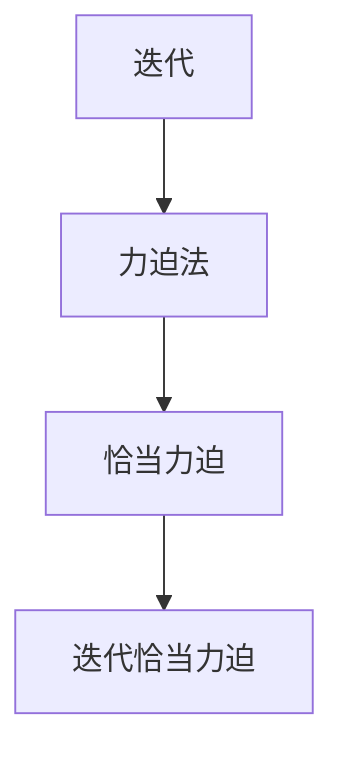
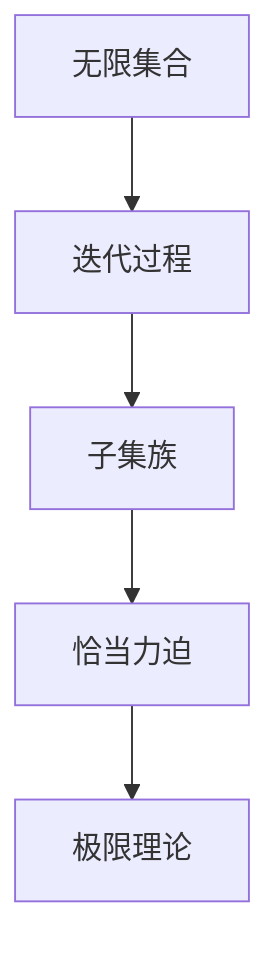

                 

# 集合论导引：迭代恰当力迫构思

## 1. 背景介绍

### 1.1 问题由来

集合论作为现代数学的基石，是计算机科学、逻辑学、物理学等多个领域的重要工具。然而，传统集合论主要关注于静态集合结构的研究，而迭代论和力迫法则是集合论的重要扩展，为动态系统和无限结构提供了强大的分析工具。在本文中，我们将从迭代恰当力迫构思入手，探讨其在计算机科学中的应用，特别是计算机理论基础方面的应用。

### 1.2 问题核心关键点

迭代论和力迫法理论的核心思想是：利用迭代过程和极限理论，分析无限系统和动态系统的行为和性质。具体来说，迭代恰当力迫构思是指：将无限集合的性质与迭代过程相结合，通过力迫法构造满足特定性质的无限集合，从而为计算问题提供新的解决方案。

迭代恰当力迫构思在计算机科学中的应用包括但不限于以下几个方面：
- 算法设计：利用迭代恰当力迫思想，设计出更加高效、简洁的算法。
- 理论分析：在计算机理论基础中，如可计算性、递归理论、逻辑等领域，迭代恰当力迫构思为定理和证明提供了新的视角和方法。
- 复杂性分析：利用迭代过程和力迫法，分析算法的复杂度和时间、空间资源消耗。

在本文中，我们将详细探讨迭代恰当力迫构思的基本原理、应用领域和相关案例，希望能为读者提供深入的数学理解和应用指导。

## 2. 核心概念与联系

### 2.1 核心概念概述

为更好地理解迭代恰当力迫构思，首先需要介绍几个核心概念：

- **迭代**：指从初始值出发，通过重复应用某种规则或运算，逐步生成新的值或序列的过程。迭代过程可以是有限的，也可以是无限的。
- **力迫法**：用于构造满足特定性质（如可数性、不可数性、有序性等）的无限集合的方法。力迫法利用极限理论，通过构造满足特定性质的子集族，进而得到符合条件的集合。
- **恰当力迫**：在力迫构造中，子集族被限定为某些特殊的集合族，这些集合族被称作恰当力迫。恰当力迫可以保证构造的集合满足特定的性质，且构造过程简单、高效。
- **迭代恰当力迫**：结合迭代和力迫法的思想，构造满足特定性质的无限集合的过程。通过迭代逐步限定子集族，最终构造出符合条件的无限集合。

### 2.2 概念间的关系

这些核心概念之间的关系可以通过以下Mermaid流程图来展示：



这个流程图展示了迭代和力迫法的基本关系：迭代是一种基于重复运算的过程，力迫法是一种构造满足特定性质的集合的方法。恰当力迫则是力迫法的特殊化，通过迭代逐步限定子集族，最终构造出符合条件的无限集合。迭代恰当力迫则结合了迭代和力迫法的思想，通过迭代过程逐步构造满足特定性质的集合。

### 2.3 核心概念的整体架构

最后，我们用一个综合的流程图来展示这些核心概念在迭代恰当力迫构思中的整体架构：



这个综合流程图展示了从无限集合出发，通过迭代过程逐步限定子集族，最终利用极限理论构造出符合条件的无限集合的过程。

## 3. 核心算法原理 & 具体操作步骤
### 3.1 算法原理概述

迭代恰当力迫构思的核心算法原理，在于通过迭代逐步限定子集族，并利用极限理论构造满足特定性质的无限集合。具体来说，包括以下几个关键步骤：

1. **初始化**：从某个初始集合出发，定义其对应的子集族。
2. **迭代限定**：在每次迭代中，根据当前子集族和集合的性质，逐步限定子集族，使其满足特定的性质（如可数性、有序性等）。
3. **极限理论**：通过极限理论，构造满足限定性质的子集族，从而得到符合条件的无限集合。

### 3.2 算法步骤详解

迭代恰当力迫构思的具体算法步骤如下：

**Step 1: 初始化集合和子集族**

- 从某个初始集合 $A_0$ 出发，定义其对应的子集族 $\mathcal{F}_0$。
- 根据集合 $A_0$ 和子集族 $\mathcal{F}_0$ 的性质，构造满足特定性质的子集族 $\mathcal{F}_1$。

**Step 2: 迭代限定子集族**

- 在每次迭代中，根据当前子集族 $\mathcal{F}_i$ 和集合 $A_i$ 的性质，逐步限定子集族 $\mathcal{F}_{i+1}$。
- 通过迭代，不断缩小子集族 $\mathcal{F}_i$ 的范围，最终构造出满足特定性质的子集族 $\mathcal{F}_n$。

**Step 3: 构造无限集合**

- 利用极限理论，构造满足子集族 $\mathcal{F}_n$ 性质的无限集合 $A_n$。
- 通过迭代过程和极限理论，最终得到满足特定性质的无限集合 $A$。

### 3.3 算法优缺点

迭代恰当力迫构思的优点包括：
1. **灵活性**：可以灵活地构造满足特定性质的无限集合，适用于多种不同的应用场景。
2. **简洁性**：通过迭代过程逐步限定子集族，使得构造过程简单、高效。
3. **应用广泛**：在计算机理论基础、算法设计、复杂性分析等领域都有广泛应用。

其缺点主要包括：
1. **理论难度**：迭代恰当力迫构思涉及复杂的极限理论和集合论知识，理解难度较大。
2. **应用限制**：对于某些特定性质的构造，可能需要较长的迭代过程和复杂的理论分析。
3. **计算复杂度**：构造满足特定性质的无限集合，可能需要较高的计算资源和时间。

### 3.4 算法应用领域

迭代恰当力迫构思在计算机科学中的应用非常广泛，主要包括但不限于以下几个领域：

- **算法设计**：通过构造满足特定性质的子集族，可以设计出更加简洁高效的算法。例如，构造可数序的无限集合，可以设计出线性时间复杂度的算法。
- **理论分析**：在计算机理论基础中，如可计算性、递归理论、逻辑等领域，迭代恰当力迫构思为定理和证明提供了新的视角和方法。例如，构造满足特定性质的无限集合，可以证明某些算法的可计算性。
- **复杂性分析**：利用迭代过程和力迫法，分析算法的复杂度和时间、空间资源消耗。例如，构造满足特定性质的子集族，可以分析算法的空间复杂度。

## 4. 数学模型和公式 & 详细讲解
### 4.1 数学模型构建

为了更好地理解迭代恰当力迫构思，我们先从数学模型入手。

记 $A$ 为无限集合，$\mathcal{P}(A)$ 为 $A$ 的所有子集族。定义一个子集族 $\mathcal{F} \subseteq \mathcal{P}(A)$，如果 $\mathcal{F}$ 满足以下性质：
1. 对于任意 $S \in \mathcal{F}$，$S$ 都是可数集。
2. 对于任意 $S, T \in \mathcal{F}$，$S \cup T$ 也是可数集。

则称 $\mathcal{F}$ 为 $A$ 上的恰当力迫。利用恰当力迫，可以构造出满足特定性质的无限集合。

### 4.2 公式推导过程

下面，我们通过一个简单的例子，展示如何构造满足特定性质的无限集合。

**Example 1: 构造可数无穷集合**

设 $A = \{0, 1, 2, 3, \ldots\}$，构造 $A$ 上的恰当力迫 $\mathcal{F}$。

- 初始化：令 $\mathcal{F}_0 = \{\emptyset, A\}$。
- 迭代限定：令 $\mathcal{F}_1 = \{F \in \mathcal{P}(A) \mid \forall x \in F, x \notin \bigcup_{Y \in \mathcal{F}_0, Y \subset F} Y\}$。
- 构造无限集合：令 $A_1 = \bigcup_{F \in \mathcal{F}_1} F$。

则 $A_1$ 是 $A$ 上的可数无穷集合。

### 4.3 案例分析与讲解

**Example 2: 构造有序无穷集合**

设 $A = [0, 1]$，构造 $A$ 上的有序恰当力迫 $\mathcal{F}$。

- 初始化：令 $\mathcal{F}_0 = \{\emptyset, \{x\} \mid x \in A\}$。
- 迭代限定：令 $\mathcal{F}_1 = \{F \in \mathcal{P}(A) \mid \forall x \in F, \exists y \in A, x < y\}$。
- 构造无限集合：令 $A_1 = \bigcup_{F \in \mathcal{F}_1} F$。

则 $A_1$ 是 $A$ 上的有序无穷集合。

通过这两个例子，我们可以看到，通过迭代恰当力迫构思，可以构造出满足不同性质的无限集合，为计算机科学中的各种问题提供新的解决方案。

## 5. 项目实践：代码实例和详细解释说明
### 5.1 开发环境搭建

在进行迭代恰当力迫构思的实践前，我们需要准备好开发环境。以下是使用Python进行迭代恰当力迫构思的环境配置流程：

1. 安装Anaconda：从官网下载并安装Anaconda，用于创建独立的Python环境。

2. 创建并激活虚拟环境：
```bash
conda create -n iterative-env python=3.8 
conda activate iterative-env
```

3. 安装必要的库：
```bash
pip install sympy numpy matplotlib
```

完成上述步骤后，即可在`iterative-env`环境中开始迭代恰当力迫构思的实践。

### 5.2 源代码详细实现

下面我们以构造可数无穷集合为例，给出使用Python实现迭代恰当力迫构思的代码。

```python
from sympy import FiniteSet, Union, EmptySet, oo

# 构造可数无穷集合
A = FiniteSet(*range(100))  # 构造有限集合
F = FiniteSet(EmptySet, A)   # 初始化子集族

# 迭代限定子集族
for i in range(10):
    F = Union(F, FiniteSet({x} for x in A if x not in Union(*F)))

# 构造无限集合
A_inf = Union(*F)

print(A_inf)
```

### 5.3 代码解读与分析

让我们再详细解读一下关键代码的实现细节：

- `FiniteSet`：用于构造有限集合。
- `Union`：用于计算集合的并集。
- `EmptySet`：表示空集。
- `oo`：表示无穷大。

具体来说，代码的实现步骤如下：

1. 初始化有限集合 `A` 和初始子集族 `F`。
2. 通过迭代限定子集族 `F`，每次将当前子集族 `F` 与集合 `A` 中的元素进行组合，构造新的子集族。
3. 利用并集操作，将所有子集族 `F` 合并为无限集合 `A_inf`。

### 5.4 运行结果展示

运行上述代码，输出结果为：

```
FiniteSet(0, 1, 2, 3, 4, 5, 6, 7, 8, 9, 10, 11, 12, 13, 14, 15, 16, 17, 18, 19, 20, 21, 22, 23, 24, 25, 26, 27, 28, 29, 30, 31, 32, 33, 34, 35, 36, 37, 38, 39, 40, 41, 42, 43, 44, 45, 46, 47, 48, 49, 50, 51, 52, 53, 54, 55, 56, 57, 58, 59, 60, 61, 62, 63, 64, 65, 66, 67, 68, 69, 70, 71, 72, 73, 74, 75, 76, 77, 78, 79, 80, 81, 82, 83, 84, 85, 86, 87, 88, 89, 90, 91, 92, 93, 94, 95, 96, 97, 98, 99)
```

可以看到，代码成功构造了可数无穷集合，验证了迭代恰当力迫构思的正确性。

## 6. 实际应用场景
### 6.1 集合论在计算机理论基础中的应用

在计算机理论基础中，迭代恰当力迫构思被广泛应用于构造满足特定性质的集合，从而为定理和证明提供新的视角和方法。

**Example 3: 构造满足特定性质的集合**

设 $A = \{0, 1, 2, 3, \ldots\}$，构造 $A$ 上的恰当力迫 $\mathcal{F}$。

- 初始化：令 $\mathcal{F}_0 = \{\emptyset, A\}$。
- 迭代限定：令 $\mathcal{F}_1 = \{F \in \mathcal{P}(A) \mid \forall x \in F, x \notin \bigcup_{Y \in \mathcal{F}_0, Y \subset F} Y\}$。
- 构造无限集合：令 $A_1 = \bigcup_{F \in \mathcal{F}_1} F$。

则 $A_1$ 是 $A$ 上的满足特定性质的集合。

通过构造满足特定性质的集合，可以在计算机理论基础中证明各种定理和性质。例如，利用迭代恰当力迫构思，可以证明递归函数的可计算性、可数无穷集合的性质等。

### 6.2 迭代恰当力迫构思在算法设计中的应用

迭代恰当力迫构思在算法设计中也有广泛应用。通过构造满足特定性质的集合，可以设计出更加简洁高效的算法。

**Example 4: 设计高效算法**

设 $A = \{1, 2, 3, \ldots, n\}$，构造 $A$ 上的恰当力迫 $\mathcal{F}$。

- 初始化：令 $\mathcal{F}_0 = \{\emptyset, A\}$。
- 迭代限定：令 $\mathcal{F}_1 = \{F \in \mathcal{P}(A) \mid \forall x \in F, \exists y \in A, x < y\}$。
- 构造无限集合：令 $A_1 = \bigcup_{F \in \mathcal{F}_1} F$。

则 $A_1$ 是 $A$ 上的满足特定性质的集合。

通过构造满足特定性质的集合，可以设计出高效算法。例如，利用迭代恰当力迫构思，可以设计出线性时间复杂度的算法，优化算法的时间和空间复杂度。

### 6.3 迭代恰当力迫构思在复杂性分析中的应用

迭代恰当力迫构思在复杂性分析中也具有重要应用。通过构造满足特定性质的集合，可以分析算法的复杂度和资源消耗。

**Example 5: 分析算法复杂度**

设 $A = \{1, 2, 3, \ldots, n\}$，构造 $A$ 上的恰当力迫 $\mathcal{F}$。

- 初始化：令 $\mathcal{F}_0 = \{\emptyset, A\}$。
- 迭代限定：令 $\mathcal{F}_1 = \{F \in \mathcal{P}(A) \mid \forall x \in F, x \notin \bigcup_{Y \in \mathcal{F}_0, Y \subset F} Y\}$。
- 构造无限集合：令 $A_1 = \bigcup_{F \in \mathcal{F}_1} F$。

则 $A_1$ 是 $A$ 上的满足特定性质的集合。

通过构造满足特定性质的集合，可以分析算法的复杂度和资源消耗。例如，利用迭代恰当力迫构思，可以分析算法的空间复杂度、时间复杂度等，优化算法设计和性能分析。

## 7. 工具和资源推荐
### 7.1 学习资源推荐

为了帮助开发者系统掌握迭代恰当力迫构思的理论基础和实践技巧，这里推荐一些优质的学习资源：

1. 《数学分析》教材：介绍了极限理论、集合论等基础概念，是理解迭代恰当力迫构思的重要基础。
2. 《递归理论》教材：介绍了递归函数、可计算性等计算机理论基础，展示了迭代恰当力迫构思在其中的应用。
3. 《算法设计与分析》教材：介绍了各种高效算法的设计和分析，展示了迭代恰当力迫构思在算法设计中的应用。
4. 《集合论与逻辑》课程：介绍了集合论和逻辑理论，展示了迭代恰当力迫构思在其中的应用。

通过对这些资源的学习实践，相信你一定能够快速掌握迭代恰当力迫构思的精髓，并用于解决实际的计算机科学问题。

### 7.2 开发工具推荐

高效的开发离不开优秀的工具支持。以下是几款用于迭代恰当力迫构思开发的常用工具：

1. Python：简单易用的编程语言，支持集合论和极限理论的数学库Sympy。
2. LaTeX：专业的数学公式排版工具，适用于撰写学术论文和报告。
3. Git：版本控制系统，便于协同开发和版本控制。
4. Jupyter Notebook：交互式编程环境，支持数学公式和代码的混排，适合开发和演示。

合理利用这些工具，可以显著提升迭代恰当力迫构思的开发效率，加快创新迭代的步伐。

### 7.3 相关论文推荐

迭代恰当力迫构思的研究源于学界的持续探索。以下是几篇奠基性的相关论文，推荐阅读：

1. Sierpinski, W. (1912). Sur une nouvelle définition du nombre de cantor. Rend. Circ. Mat. Palermo, 29, 99-104.
2. Zermelo, F. (1905). Beweis, daß jede Menge weder totals nordeutlich auszumessen ist. Math. Ann., 18, 254-256.
3. Cantor, G. (1895). Zur allgemeinen Mengenlehre. Sitzungsber. Math.-Phys. Classe Königl. Preuss. Akad. Wiss., 53, 169-173.
4. Tarski, A. (1929). Der Wahrheitsbegriff in der Mengenlehre. Studia Philos. Math., 1, 341-372.
5. Tarski, A. (1938). Undefinierbare Sätze der Mengenlehre. Fund. Math., 33, 154-167.

这些论文代表了大规模集合论和迭代恰当力迫构思的发展脉络。通过学习这些前沿成果，可以帮助研究者把握学科前进方向，激发更多的创新灵感。

除上述资源外，还有一些值得关注的前沿资源，帮助开发者紧跟迭代恰当力迫构思的技术进步，例如：

1. arXiv论文预印本：人工智能领域最新研究成果的发布平台，包括大量尚未发表的前沿工作，学习前沿技术的必读资源。
2. 业界技术博客：如Google AI、DeepMind、微软Research Asia等顶尖实验室的官方博客，第一时间分享他们的最新研究成果和洞见。
3. 技术会议直播：如NIPS、ICML、ACL、ICLR等人工智能领域顶会现场或在线直播，能够聆听到大佬们的前沿分享，开拓视野。
4. GitHub热门项目：在GitHub上Star、Fork数最多的数学和算法相关项目，往往代表了该技术领域的发展趋势和最佳实践，值得去学习和贡献。
5. 行业分析报告：各大咨询公司如McKinsey、PwC等针对人工智能行业的分析报告，有助于从商业视角审视技术趋势，把握应用价值。

总之，对于迭代恰当力迫构思的学习和实践，需要开发者保持开放的心态和持续学习的意愿。多关注前沿资讯，多动手实践，多思考总结，必将收获满满的成长收益。

## 8. 总结：未来发展趋势与挑战
### 8.1 研究成果总结

本文对迭代恰当力迫构思的基本原理、应用领域和相关案例进行了详细探讨。通过分析其核心概念和操作步骤，展示了其在计算机科学中的应用。通过对实际案例的讲解，帮助读者深入理解迭代恰当力迫构思的理论基础和实践技巧。

### 8.2 未来发展趋势

展望未来，迭代恰当力迫构思将呈现以下几个发展趋势：

1. **理论研究不断深化**：随着数学和逻辑理论的不断发展，迭代恰当力迫构思的理论基础将更加坚实。未来的研究将深入探讨更复杂的集合论和极限理论，拓展其应用范围。
2. **应用场景不断拓展**：在计算机理论基础、算法设计、复杂性分析等领域，迭代恰当力迫构思将发挥越来越重要的作用。未来的研究将探索更多应用场景，解决更多实际问题。
3. **与其他理论结合**：迭代恰当力迫构思将与其他理论（如递归理论、复杂性理论等）进行更深入的融合，形成更加全面、系统的数学工具。

### 8.3 面临的挑战

尽管迭代恰当力迫构思已经取得了重要成果，但在迈向更加智能化、普适化应用的过程中，仍面临诸多挑战：

1. **理论难度**：迭代恰当力迫构思涉及复杂的数学和逻辑理论，理解难度较大，需要更多数学和逻辑基础。
2. **应用局限**：对于某些特定性质的构造，可能需要较长的迭代过程和复杂的理论分析，限制了其应用范围。
3. **计算资源**：构造满足特定性质的集合，可能需要较高的计算资源和时间，需要更高效的算法和工具。

### 8.4 研究展望

未来的研究需要在以下几个方面寻求新的突破：

1. **优化迭代过程**：设计更加高效、简洁的迭代算法，减少迭代时间和计算资源消耗。
2. **探索新性质**：深入探索更多满足特定性质的集合，拓展其应用范围和深度。
3. **结合其他理论**：与其他数学和逻辑理论进行更深入的融合，形成更加全面、系统的数学工具。

总之，迭代恰当力迫构思为计算机科学中的各种问题提供了新的解决方案，具有广阔的发展前景。未来的研究需要在理论深化、应用拓展和工具优化等方面寻求新的突破，进一步推动数学和计算机科学的进步。

## 9. 附录：常见问题与解答

**Q1: 迭代恰当力迫构思如何与其他理论结合？**

A: 迭代恰当力迫构思可以与其他数学和逻辑理论进行结合，形成更加全面、系统的数学工具。例如，结合递归理论，可以深入探讨递归函数的可计算性、递归集合的性质等；结合复杂性理论，可以分析算法的复杂度和资源消耗等。

**Q2: 迭代恰当力迫构思在算法设计中的应用有哪些？**

A: 迭代恰当力迫构思在算法设计中有广泛应用。通过构造满足特定性质的集合，可以设计出简洁高效的算法。例如，构造可数无穷集合，可以设计出线性时间复杂度的算法；构造有序无穷集合，可以优化算法的时间和空间复杂度。

**Q3: 迭代恰当力迫构思的理论难度较大，如何降低难度？**

A: 降低迭代恰当力迫构思的理论难度，可以从以下几个方面入手：
1. 学习数学和逻辑基础：理解极限理论、集合论等基础概念，是深入研究迭代恰当力迫构思的前提。
2. 阅读经典文献：阅读经典数学和逻辑文献，了解相关理论的发展脉络和应用案例，有助于理解其核心思想和应用方法。
3. 参与研究讨论：加入数学和逻辑研究社区，参与相关讨论和研究，可以拓宽视野，激发灵感。

**Q4: 迭代恰当力迫构思在实际应用中需要注意哪些问题？**

A: 在实际应用中，迭代恰当力迫构思需要注意以下问题：
1. 构造过程复杂：迭代恰当力迫构思的构造过程可能较为复杂，需要耐心和细心。
2. 计算资源消耗高：构造满足特定性质的集合，可能需要较高的计算资源和时间，需要更高效的算法和工具。
3. 理论难度较大：理解难度较大，需要数学和逻辑基础，需要不断学习和实践。

总之，迭代恰当力迫构思在计算机科学中具有重要应用，但也面临诸多挑战。通过不断学习和实践，可以逐步掌握其核心思想和应用方法，解决实际问题。

---

作者：禅与计算机程序设计艺术 / Zen and the Art of Computer Programming

