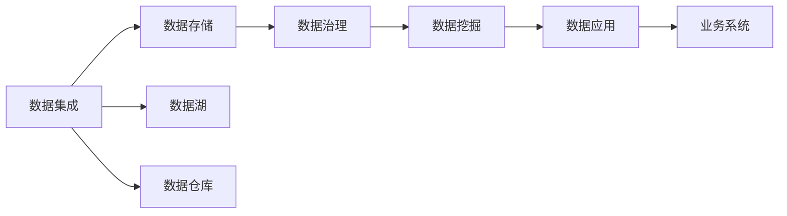
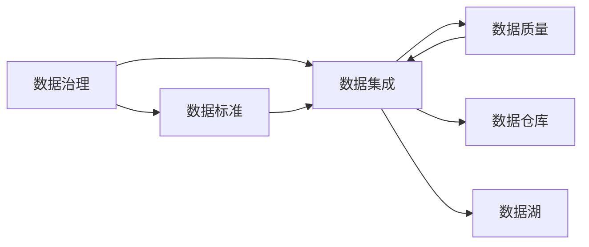
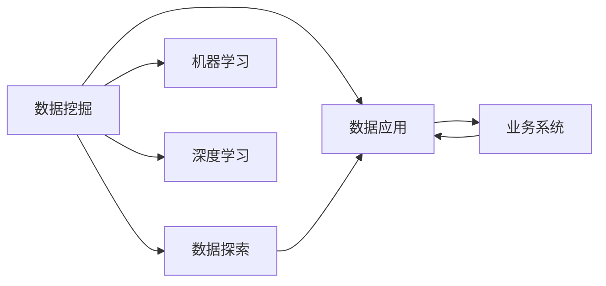
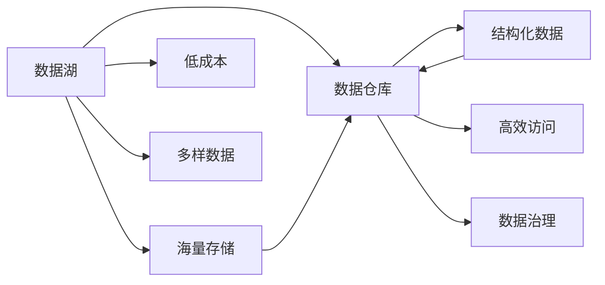
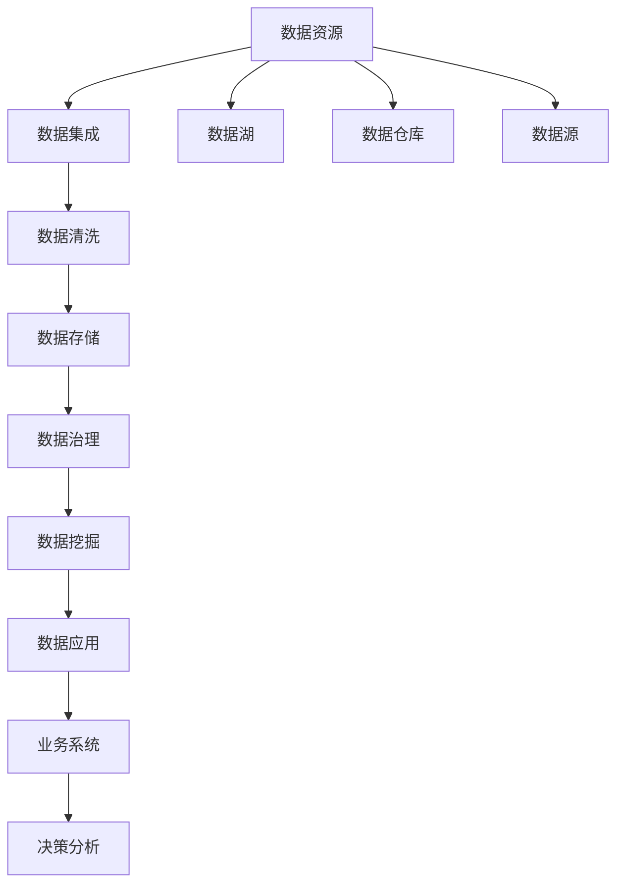

                 

# AI DMP 数据基建：数据应用与价值挖掘

> 关键词：人工智能,数据管理平台,数据治理,数据挖掘,数据仓库,数据湖,数据应用

## 1. 背景介绍

### 1.1 问题由来
在数字化时代，数据成为企业战略资源的日益重要的部分。如何有效管理和应用数据，成为了每个企业面临的关键挑战。传统的以关系型数据库为核心的数据管理方式，已经难以满足现代数据复杂性和多样性的需求。与此同时，随着人工智能技术的兴起，企业对于数据的理解和应用能力，要求也日渐提高。

在这种背景下，数据管理平台(DMP, Data Management Platform)应运而生。DMP旨在通过集成、整合和管理企业内外部的数据资源，为企业提供高效、安全、智能的数据应用能力。AI DMP（AI-based Data Management Platform）则在此基础上，融合了人工智能技术，进一步提升了数据的治理和应用能力。

### 1.2 问题核心关键点
AI DMP的核心理念是将AI技术与数据管理相结合，通过智能化的数据处理、分析与治理，为数据应用提供全方位支持。具体关键点包括：

- 数据集成与统一：将来自不同渠道、不同格式的数据整合到统一的平台上，形成全视图的数据资源。
- 数据治理与合规：建立严格的数据治理机制，确保数据的质量、安全与合规，保护用户隐私。
- 数据挖掘与分析：运用AI技术深入挖掘数据潜在的价值，提供决策支持与智能洞察。
- 数据应用与部署：通过智能化的数据引擎与接口，将数据高效应用于业务系统中，驱动业务创新与发展。

### 1.3 问题研究意义
研究AI DMP数据基建的理论与实践，对于提升企业数据管理能力，促进人工智能与大数据的融合应用，具有重要意义：

1. **降低数据管理成本**：通过统一的平台，自动化管理复杂的数据资源，降低人工管理和维护成本。
2. **提升数据应用效率**：运用AI技术进行数据挖掘与分析，快速发现数据价值，提供智能决策支持。
3. **确保数据质量与安全**：建立完善的数据治理机制，确保数据的准确性、完整性和安全性，保护用户隐私。
4. **推动业务创新**：通过数据驱动的智能应用，优化业务流程，提升业务响应速度与竞争力。
5. **助力企业智能化转型**：为企业的数字化转型提供坚实的技术支持，加速向智能型企业迈进。

## 2. 核心概念与联系

### 2.1 核心概念概述

为了更好地理解AI DMP数据基建的原理与方法，本节将介绍几个核心概念：

- **数据管理平台（DMP）**：一种通过集中式的数据存储与处理，支持企业数据集成、治理、分析与应用的平台。

- **人工智能（AI）**：模拟人类智能活动的理论、方法与技术，涵盖了机器学习、深度学习、自然语言处理、计算机视觉等多个领域。

- **数据治理（Data Governance）**：指通过标准化、监控与合规等措施，保障数据的质量、安全与合规的过程。

- **数据仓库（Data Warehouse）**：一种集中式的数据存储环境，用于支持企业的数据分析、报告与决策。

- **数据湖（Data Lake）**：一种海量的、低成本的数据存储方式，能够容纳大规模、异构的数据，支持多样化的数据分析应用。

- **数据应用（Data Application）**：指通过数据挖掘、分析与模型训练，开发出具有商业价值的数据产品或服务。

这些核心概念之间的逻辑关系可以通过以下Mermaid流程图来展示：



这个流程图展示了大数据治理与应用的整个流程：

1. 数据集成：将分散的数据资源汇聚到一个集中式的数据存储环境。
2. 数据存储：通过数据湖或数据仓库，保障数据的高效存储与访问。
3. 数据治理：建立严格的数据治理机制，确保数据的质量与安全。
4. 数据挖掘：运用AI技术，深入挖掘数据的潜在价值。
5. 数据应用：通过数据应用接口，将数据高效地应用于业务系统中。

### 2.2 概念间的关系

这些核心概念之间存在着紧密的联系，形成了AI DMP数据基建的完整生态系统。下面我通过几个Mermaid流程图来展示这些概念之间的关系。

#### 2.2.1 数据治理与数据集成



这个流程图展示了数据治理与数据集成的关系。数据治理通过制定数据标准，提升数据质量，从而确保数据集成的质量与效率。数据仓库与数据湖作为数据集成的目标存储，保障数据的长期保存与高效访问。

#### 2.2.2 数据应用与数据挖掘



这个流程图展示了数据挖掘与数据应用的关系。数据挖掘通过机器学习、深度学习等AI技术，深入挖掘数据的价值，从而为数据应用提供支撑。数据应用则通过API接口，将数据高效应用于业务系统中，驱动业务创新。

#### 2.2.3 数据湖与数据仓库



这个流程图展示了数据湖与数据仓库的关系。数据湖通过海量的、低成本的存储方式，支持多样化的数据类型与来源。数据仓库则通过结构化的存储方式，保障数据的完整性与一致性，提供高效的数据访问与治理。

### 2.3 核心概念的整体架构

最后，我们用一个综合的流程图来展示这些核心概念在大数据治理与应用中的整体架构：



这个综合流程图展示了从数据源到业务系统的完整数据治理与应用流程。数据通过数据集成进入平台，经过清洗和存储，通过数据治理保障数据质量与安全，再通过数据挖掘挖掘数据价值，最终应用于业务系统中，驱动业务决策与创新。

## 3. 核心算法原理 & 具体操作步骤
### 3.1 算法原理概述

AI DMP数据基建的核心理论是基于数据治理与人工智能的融合。其核心算法包括数据集成、数据治理、数据挖掘和数据应用等多个环节，通过一系列自动化处理和智能分析，实现数据的高效管理与深度应用。

### 3.2 算法步骤详解

AI DMP数据基建的实现过程大致分为以下几个步骤：

1. **数据集成**：将来自不同渠道、不同格式的数据，通过ETL（Extract, Transform, Load）流程，整合到一个统一的数据存储平台，如数据湖或数据仓库。

2. **数据清洗与处理**：对集成后的数据进行清洗与处理，去除噪声、重复数据，进行标准化处理，确保数据的完整性与一致性。

3. **数据治理**：建立严格的数据治理机制，包括数据质量管理、数据安全管理、数据合规管理等，确保数据的质量、安全与合规。

4. **数据挖掘与分析**：运用AI技术，进行数据探索、特征提取、模型训练等，深入挖掘数据潜在的价值，提供决策支持与智能洞察。

5. **数据应用与部署**：通过数据应用接口，将数据高效应用于业务系统中，如数据可视化、智能推荐、预测分析等，驱动业务创新与发展。

6. **持续优化**：不断优化数据治理与应用的策略与流程，提升数据应用的效率与效果，确保平台持续稳定运行。

### 3.3 算法优缺点

AI DMP数据基建的优点包括：

- **高效的数据集成与存储**：通过数据湖或数据仓库，实现海量的、低成本的数据存储与高效访问，支持大规模、异构数据的应用。
- **严格的数据治理与合规**：通过数据标准与规范，确保数据的质量与安全，保护用户隐私与数据合规。
- **深入的数据挖掘与分析**：通过AI技术，深入挖掘数据的潜在价值，提供智能决策支持与业务洞察。
- **智能的数据应用与部署**：通过数据应用接口，将数据高效应用于业务系统中，驱动业务创新与发展。

然而，该方法也存在一些局限性：

- **数据质量依赖**：数据治理的有效性依赖于数据源的质量，如果数据源存在问题，将直接影响数据治理的效果。
- **算法复杂度**：AI技术的应用，尤其是深度学习模型，需要较高的计算资源与时间，可能面临算法复杂度的挑战。
- **模型解释性不足**：AI模型的决策过程往往缺乏可解释性，难以进行透明的监督与审计。
- **数据隐私保护**：在数据挖掘与分析过程中，如何保护数据隐私，避免数据泄露，是一大难题。

### 3.4 算法应用领域

AI DMP数据基建的算法与技术，已经在多个领域得到广泛应用，例如：

- **市场营销**：通过数据挖掘与分析，进行用户画像、行为预测、个性化推荐等，提升市场营销效果。
- **金融风控**：通过数据治理与分析，进行信用评分、风险评估、欺诈检测等，提升金融风险控制能力。
- **医疗健康**：通过数据集成与分析，进行病历记录、健康管理、疾病预测等，提升医疗健康服务水平。
- **零售电商**：通过数据应用与部署，进行库存管理、需求预测、顾客分析等，提升零售电商的运营效率。
- **智能制造**：通过数据治理与分析，进行生产调优、设备维护、质量控制等，提升智能制造的水平。

此外，AI DMP数据基建的算法与技术，还在更多垂直行业得到应用，为各行各业的数字化转型提供了强大的技术支持。

## 4. 数学模型和公式 & 详细讲解 & 举例说明

### 4.1 数学模型构建

AI DMP数据基建的数学模型构建，主要涉及数据治理与数据挖掘两个方面。数据治理主要关注数据的标准化、规范化和一致性，而数据挖掘则侧重于数据的探索与分析。

### 4.2 公式推导过程

**数据治理模型**：

- **数据质量模型**：通过设定数据质量指标（如完整性、准确性、一致性、唯一性等），评估数据的质量状况。公式为：

  $$
  \text{Quality Score} = \sum_{i} \text{Weight}_{i} \times \text{Score}_{i}
  $$

  其中，$\text{Weight}_{i}$表示指标权重，$\text{Score}_{i}$表示指标得分。

- **数据安全模型**：通过设定数据安全指标（如加密强度、访问控制、备份机制等），评估数据的安全状况。公式为：

  $$
  \text{Safety Score} = \sum_{i} \text{Weight}_{i} \times \text{Score}_{i}
  $$

  其中，$\text{Weight}_{i}$表示指标权重，$\text{Score}_{i}$表示指标得分。

**数据挖掘模型**：

- **数据探索模型**：通过数据可视化、分布统计等方法，进行数据探索，发现数据的潜在规律与特征。公式为：

  $$
  \text{Exploration Score} = \sum_{i} \text{Weight}_{i} \times \text{Score}_{i}
  $$

  其中，$\text{Weight}_{i}$表示指标权重，$\text{Score}_{i}$表示指标得分。

- **特征提取模型**：通过特征选择与降维算法，提取数据的特征向量。公式为：

  $$
  \text{Feature Vector} = \text{Feature Extractor}(X)
  $$

  其中，$X$表示原始数据，$\text{Feature Extractor}$表示特征提取算法。

- **模型训练模型**：通过训练机器学习或深度学习模型，进行数据预测与分类。公式为：

  $$
  \text{Model} = \text{Trainer}(X, Y, \text{Loss})
  $$

  其中，$X$表示训练数据，$Y$表示标签，$\text{Loss}$表示损失函数，$\text{Trainer}$表示训练算法。

### 4.3 案例分析与讲解

以下以用户画像生成为例，展示AI DMP数据基建的数学模型应用过程：

1. **数据集成与清洗**：将用户的行为数据、社交数据、地理位置数据等，通过ETL流程，整合到一个统一的数据仓库中。

2. **数据治理**：建立数据质量与数据安全模型，对数据进行评估与监控，确保数据的质量与安全。

3. **数据探索与特征提取**：通过数据可视化与分布统计，探索用户的兴趣、偏好等特征，并使用PCA等降维算法，提取特征向量。

4. **模型训练**：使用协同过滤、深度学习等算法，训练用户画像模型，进行用户分类与预测。

5. **数据应用**：通过API接口，将用户画像应用于个性化推荐、广告投放等业务场景，提升用户体验与转化率。

## 5. 项目实践：代码实例和详细解释说明

### 5.1 开发环境搭建

在进行AI DMP数据基建的实践前，我们需要准备好开发环境。以下是使用Python进行Pandas、NumPy、Scikit-Learn等数据科学库的开发环境配置流程：

1. 安装Anaconda：从官网下载并安装Anaconda，用于创建独立的Python环境。

2. 创建并激活虚拟环境：
```bash
conda create -n dmp-env python=3.8 
conda activate dmp-env
```

3. 安装数据科学库：
```bash
conda install pandas numpy scikit-learn matplotlib tqdm jupyter notebook ipython
```

4. 安装AI DMP相关库：
```bash
pip install dmp-python dmp-ai dmp-etl dmp-visualization
```

完成上述步骤后，即可在`dmp-env`环境中开始AI DMP数据基建的实践。

### 5.2 源代码详细实现

以下是一个简单的用户画像生成的示例代码，展示了AI DMP数据基建的实践过程：

```python
import pandas as pd
from sklearn.decomposition import PCA
from sklearn.ensemble import RandomForestClassifier
from sklearn.metrics import classification_report
from dmp import DMPClient

# 连接数据仓库
client = DMPClient('your_dmp_uri', 'your_username', 'your_password')

# 获取数据
df = client.get_data('user_behavior')

# 数据清洗
df = df.dropna()
df = df.drop_duplicates()

# 数据探索
print(df.describe())

# 特征提取
X = df[['behavior1', 'behavior2', 'behavior3']]
y = df['label']

# 数据降维
pca = PCA(n_components=2)
X_pca = pca.fit_transform(X)

# 模型训练
clf = RandomForestClassifier()
clf.fit(X_pca, y)

# 模型评估
y_pred = clf.predict(X_pca)
print(classification_report(y, y_pred))

# 数据应用
user_data = pd.DataFrame({'user_id': ['user1', 'user2'], 'behavior1': [1, 2], 'behavior2': [3, 4]})
user_pics = clf.predict(user_data[['behavior1', 'behavior2']])
print(user_pics)
```

### 5.3 代码解读与分析

让我们再详细解读一下关键代码的实现细节：

**DMPClient类**：
- `__init__`方法：初始化DMP客户端，连接至指定的数据仓库。
- `get_data`方法：获取指定表的数据，并进行ETL处理。

**数据清洗与探索**：
- 通过`dropna`和`drop_duplicates`方法，去除缺失值和重复数据。
- 使用`describe`方法，打印数据的基本统计信息，进行数据探索。

**特征提取与降维**：
- 使用PCA算法，将高维特征向量降维到二维。

**模型训练与评估**：
- 使用随机森林分类器，对降维后的特征向量进行训练与评估。

**数据应用**：
- 使用训练好的模型，对新用户的行为数据进行分类，生成用户画像。

**运行结果展示**：
- 打印分类报告，评估模型性能。
- 输出用户画像，展示模型预测结果。

可以看到，通过Python的Pandas、Scikit-Learn等库，结合AI DMP平台提供的API接口，我们能够高效地进行数据基建的实践。开发者可以将更多精力放在模型优化与业务应用上，而不必过多关注底层的实现细节。

## 6. 实际应用场景

### 6.1 智能推荐系统

AI DMP数据基建的算法与技术，在智能推荐系统中得到了广泛应用。通过数据挖掘与分析，智能推荐系统能够为用户推荐个性化的商品、内容等，提升用户体验与满意度。

在技术实现上，可以通过用户行为数据、社交数据、地理位置数据等，构建用户画像，进行个性化推荐。AI DMP平台提供的数据治理与模型训练功能，能够保障数据质量与模型性能，为智能推荐提供坚实的基础。

### 6.2 风险控制系统

金融行业对风险控制的要求极高，需要实时监控、快速响应。AI DMP数据基建的算法与技术，为金融风险控制提供了强大的技术支撑。

通过数据治理与分析，金融企业可以实时监测客户信用、交易异常等风险因素，进行风险预警与评估。AI DMP平台提供的数据应用接口，能够将风险评估结果应用于贷前审批、贷中监控等环节，提升风险控制的精准性与效率。

### 6.3 医疗健康管理

医疗健康数据的复杂性、多样性使得传统的数据管理方式难以适用。AI DMP数据基建的算法与技术，能够有效整合、治理医疗健康数据，提升医疗健康服务水平。

通过数据集成与治理，AI DMP平台能够整合电子病历、影像数据、基因数据等多种医疗健康数据，进行全视图的数据管理。AI DMP平台提供的数据挖掘与分析功能，能够挖掘疾病特征、预测疾病发展趋势等，提升医疗健康管理的智能化水平。

### 6.4 未来应用展望

随着AI DMP数据基建的不断演进，未来的应用场景将更加丰富多样。以下是对未来应用前景的展望：

- **智能制造**：通过数据治理与分析，AI DMP平台能够优化生产流程、设备维护、质量控制等，提升智能制造的效率与质量。
- **智慧城市**：通过数据集成与治理，AI DMP平台能够整合城市管理数据、交通数据、公共安全数据等，提升智慧城市的智能化水平。
- **智能教育**：通过数据治理与分析，AI DMP平台能够进行学生行为分析、课程推荐等，提升教育效果与教学质量。
- **智能物流**：通过数据集成与治理，AI DMP平台能够整合物流数据、客户数据、库存数据等，提升物流管理的智能化水平。

总之，AI DMP数据基建的算法与技术，将在更多领域得到应用，为各行各业的数字化转型提供强大的技术支持。

## 7. 工具和资源推荐
### 7.1 学习资源推荐

为了帮助开发者系统掌握AI DMP数据基建的理论与实践，这里推荐一些优质的学习资源：

1. 《大数据基础与技术》书籍：深入浅出地介绍了大数据的基本概念、数据管理与分析技术。
2. 《Python数据科学手册》书籍：系统地介绍了Python在数据科学中的应用，涵盖Pandas、NumPy、Scikit-Learn等库的使用。
3. 《机器学习实战》书籍：通过实际案例，展示了机器学习模型的构建与优化方法。
4. 《深度学习入门》课程：由斯坦福大学开设的深度学习入门课程，涵盖了深度学习的基本概念与算法。
5. AI DMP官方文档：详细介绍了AI DMP平台的API接口、配置指南、案例分析等内容，是快速上手实践的必备资源。

通过对这些资源的学习实践，相信你一定能够系统地掌握AI DMP数据基建的精髓，并用于解决实际的数据治理与应用问题。

### 7.2 开发工具推荐

高效的开发离不开优秀的工具支持。以下是几款用于AI DMP数据基建的常用工具：

1. Jupyter Notebook：一个交互式笔记本环境，支持Python代码的快速迭代与调试。
2. TensorBoard：TensorFlow配套的可视化工具，用于实时监测模型训练状态，提供丰富的图表呈现方式。
3. Kaggle：一个数据科学竞赛平台，提供丰富的数据集与模型资源，是学习与实践数据治理与分析的好地方。
4. Apache Spark：一个快速、通用、可扩展的大数据处理框架，支持分布式数据处理与分析。
5. Apache Hadoop：一个开源的分布式计算框架，支持大规模数据的存储与处理。

合理利用这些工具，可以显著提升AI DMP数据基建的开发效率，加快创新迭代的步伐。

### 7.3 相关论文推荐

AI DMP数据基建的算法与技术，得益于学术界的持续研究。以下是几篇奠基性的相关论文，推荐阅读：

1. "Data Management Platforms: A Survey of Current Technologies and Challenges"：对当前数据管理平台的技术现状与挑战进行了全面综述。
2. "Big Data Governance: Challenges and Strategies"：探讨了大数据治理的关键技术与策略，为数据治理提供了指导。
3. "Deep Learning for Recommendation Systems: A Review"：综述了深度学习在推荐系统中的应用，展示了其强大的推荐能力。
4. "Data Mining and Statistical Learning: A Review"：综述了数据挖掘与统计学习的经典算法，提供了全面的技术参考。
5. "An Overview of Data Mining in Healthcare"：对医疗健康数据挖掘的现状与挑战进行了全面分析，为医疗健康数据治理提供了指导。

除了上述资源外，还有一些前沿资源，帮助开发者紧跟AI DMP数据基建的最新进展，例如：

1. arXiv论文预印本：人工智能领域最新研究成果的发布平台，包括大量尚未发表的前沿工作，学习前沿技术的必读资源。
2. 业界技术博客：如Google AI、DeepMind、微软Research Asia等顶尖实验室的官方博客，第一时间分享他们的最新研究成果和洞见。
3. 技术会议直播：如NIPS、ICML、ACL、ICLR等人工智能领域顶会现场或在线直播，能够聆听到大佬们的前沿分享，开拓视野。
4. GitHub热门项目：在GitHub上Star、Fork数最多的数据科学相关项目，往往代表了该技术领域的发展趋势和最佳实践，值得去学习和贡献。
5. 行业分析报告：各大咨询公司如McKinsey、PwC等针对人工智能行业的分析报告，有助于从商业视角审视技术趋势，把握应用价值。

总之，对于AI DMP数据基建的理论与实践，需要开发者保持开放的心态和持续学习的意愿。多关注前沿资讯，多动手实践，多思考总结，必将收获满满的成长收益。

## 8. 总结：未来发展趋势与挑战

### 8.1 总结

本文对AI DMP数据基建的理论与实践进行了全面系统的介绍。首先阐述了AI DMP数据基建的核心理念与重要意义，明确了数据治理与人工智能的融合方向。其次，从原理到实践，详细讲解了AI DMP数据基建的数学模型、算法步骤和具体实现方法，提供了丰富的代码实例与详细解释。同时，本文还广泛探讨了AI DMP数据基建在多个领域的应用前景，展示了其广阔的发展潜力。

通过本文的系统梳理，可以看到，AI DMP数据基建的算法与技术，正在成为企业数据管理的重要工具，为数据治理与分析提供了全方位的支持。未来的研究与应用将进一步推动数据智能化的发展，为各行各业的数字化转型提供坚实的技术支撑。

### 8.2 未来发展趋势

展望未来，AI DMP数据基建的算法与技术将呈现以下几个发展趋势：

1. **AI与大数据融合**：随着AI技术的不断发展，AI DMP数据基建的智能化水平将进一步提升，能够更加高效地处理、分析与治理大数据资源。

2. **实时数据处理**：未来的AI DMP平台将支持实时数据流处理，能够动态地进行数据治理与分析，及时响应业务需求变化。

3. **多模态数据融合**：未来的AI DMP平台将支持多模态数据融合，能够整合文本、图像、视频等多种数据类型，提升数据治理与分析的效果。

4. **深度学习应用**：未来的AI DMP平台将广泛应用深度学习技术，进行数据挖掘与分析，提升模型的精度与性能。

5. **分布式数据治理**：未来的AI DMP平台将支持分布式数据治理，能够大规模、高效地管理分布式数据资源，提升数据治理的效率与效果。

6. **自动化与智能化**：未来的AI DMP平台将具备更多的自动化功能，能够自动进行数据治理与分析，提升数据管理的智能化水平。

### 8.3 面临的挑战

尽管AI DMP数据基建的算法与技术已经取得了显著进展，但在迈向更加智能化、自动化应用的过程中，仍面临诸多挑战：

1. **数据质量与治理**：数据源的质量与治理效果，直接影响到数据应用的效果。如何提升数据质量、保障数据安全，是AI DMP平台的重要挑战

