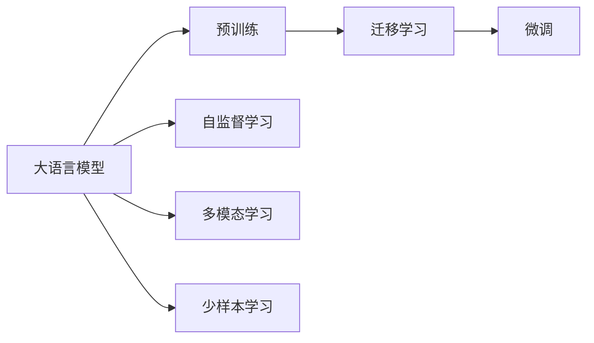
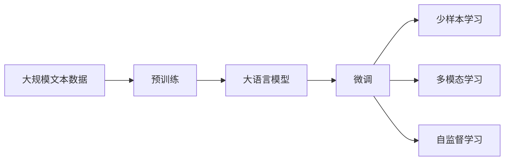

                 

# AI 大模型创业：如何利用市场优势？

> 关键词：大语言模型,市场优势,创业指南,技术创新,商业模式

## 1. 背景介绍

随着人工智能技术的飞速发展，大模型（如GPT、BERT等）已经成为了行业内的热门话题。它们以其强大的语言理解和生成能力，在自然语言处理（NLP）、计算机视觉、推荐系统等多个领域展示出巨大潜力。然而，尽管大模型技术本身已经非常先进，但如何在实际应用中有效利用其市场优势，并将其转化为商业价值，仍是创业者面临的一大挑战。

### 1.1 大模型的市场优势

大模型主要具备以下几个市场优势：

1. **多场景应用能力**：大模型能够处理多种自然语言处理任务，如文本分类、问答系统、机器翻译、情感分析等，从而为不同行业的实际应用提供支持。
2. **高效性能**：相较于传统的机器学习模型，大模型在计算效率和精度上都有显著提升，能够快速响应实时需求。
3. **泛化能力强**：大模型在预训练阶段学习了大量的通用知识，能够更好地泛化到新的领域和任务。
4. **适应性强**：大模型具有高度的定制化能力，通过微调，可以针对特定的业务需求进行调整，满足行业特定的需求。

### 1.2 市场挑战

尽管大模型具有诸多优势，但实际应用过程中仍面临不少挑战：

1. **数据获取难度**：大模型的训练需要大量高质量的标注数据，而这些数据获取成本高，且数据质量和一致性难以保证。
2. **模型复杂性**：大模型参数众多，训练复杂度大，对硬件资源要求高。
3. **部署成本**：大模型部署和维护需要大量技术资源和资金投入。
4. **应用场景局限**：并非所有行业都能有效利用大模型的优势，部分行业对模型的依赖度较低。

## 2. 核心概念与联系

### 2.1 核心概念概述

为更好地理解如何利用大模型的市场优势进行创业，本节将介绍几个核心概念：

1. **大语言模型（Large Language Model, LLM）**：能够处理自然语言输入并产生输出的模型，如GPT-3、BERT等。
2. **迁移学习（Transfer Learning）**：利用预训练模型在特定任务上的性能，通过微调提升模型性能的方法。
3. **微调（Fine-Tuning）**：调整预训练模型参数以适应特定任务的优化过程。
4. **预训练-微调（Pre-training-Fine-Tuning, PT-FT）**：在无标签数据上预训练模型，然后在有标签数据上微调以提升性能。
5. **自监督学习（Self-Supervised Learning）**：通过设计任务，使得模型在未标记数据上进行自我训练，以学习语言知识。
6. **多模态学习（Multimodal Learning）**：结合不同模态（如文本、图像、语音）的信息，提升模型的多维度理解能力。
7. **少样本学习（Few-shot Learning）**：使用少量样本进行模型训练，以适应新任务。

### 2.2 核心概念间的关系

通过Mermaid流程图展示核心概念间的关系：



### 2.3 核心概念的整体架构

大语言模型的市场优势主要通过预训练-微调（PT-FT）框架实现，其整体架构如下：



## 3. 核心算法原理 & 具体操作步骤

### 3.1 算法原理概述

大模型的预训练-微调（PT-FT）框架主要分为两个阶段：预训练和微调。

**预训练阶段**：在无标签的大规模数据集上，使用自监督学习任务（如掩码语言模型、Next Sentence Prediction等）对模型进行训练，使其能够捕捉到语言的统计特性和语义信息。

**微调阶段**：在特定任务的有标签数据集上，通过微调优化模型，使其能够执行特定的任务。

### 3.2 算法步骤详解

**预训练步骤**：

1. 收集大量未标记的数据，如维基百科、新闻等。
2. 设计自监督学习任务，如掩码语言模型，使得模型能够学习到语言的统计特性。
3. 使用优化算法（如Adam、SGD等）对模型进行训练，优化损失函数。

**微调步骤**：

1. 收集特定任务的有标签数据集，如问答、分类、翻译等。
2. 设计任务的适配层，如分类头、解码器等。
3. 使用优化算法和微调数据集进行训练，优化任务适配层和预训练模型。
4. 根据业务需求调整模型参数，如冻结部分预训练层、调整学习率等。
5. 在测试集上评估模型性能，并进行必要的调整。

### 3.3 算法优缺点

**优点**：

1. 快速训练和部署：大模型已经在预训练阶段学习了大量的语言知识，微调时只需调整少量参数。
2. 泛化能力强：大模型具备强大的泛化能力，能够适应不同的任务和领域。
3. 高效应用：大模型在特定任务上微调后，能够显著提升性能，缩短训练和部署时间。
4. 灵活定制：通过微调，大模型能够适应不同的应用场景和需求。

**缺点**：

1. 数据需求高：大模型需要大量高质量的标注数据，数据获取成本高。
2. 计算资源需求大：预训练和微调都需要大量计算资源，硬件成本高。
3. 模型复杂度高：大模型参数众多，模型结构复杂，调试和优化困难。
4. 风险管理难度大：大模型可能存在偏见和有害信息，需要额外的风险管理措施。

### 3.4 算法应用领域

大模型的预训练-微调框架已经在多个领域得到了广泛应用，包括：

1. **自然语言处理（NLP）**：文本分类、命名实体识别、机器翻译、问答系统、情感分析等。
2. **计算机视觉**：图像分类、目标检测、图像生成、视频理解等。
3. **推荐系统**：个性化推荐、内容过滤、用户画像等。
4. **医疗**：疾病诊断、药物研发、患者管理等。
5. **金融**：市场分析、风险评估、客户服务等。
6. **教育**：智能辅导、学习内容推荐、教学评估等。

## 4. 数学模型和公式 & 详细讲解

### 4.1 数学模型构建

以自然语言处理任务为例，数学模型构建如下：

1. **输入表示**：将文本转换为向量表示，通常使用word2vec、GloVe等方法。
2. **模型表示**：使用Transformer等架构，构建自回归模型。
3. **输出表示**：根据任务类型设计输出层，如分类头、解码器等。
4. **损失函数**：根据任务类型选择合适的损失函数，如交叉熵损失、均方误差损失等。

### 4.2 公式推导过程

以BERT为例，其预训练过程如下：

1. **掩码语言模型**：
   $$
   \mathcal{L}_{MLM} = -\frac{1}{N}\sum_{i=1}^N \sum_{j=1}^L [log(p(x_j^i|\mathcal{X}_j^i)) + log(1-p(\tilde{x}_j^i|\mathcal{X}_j^i))]
   $$

   其中，$x_j^i$表示输入文本中的第$j$个单词，$\mathcal{X}_j^i$表示该单词的掩码向量，$p$表示模型预测概率。

2. **Next Sentence Prediction**：
   $$
   \mathcal{L}_{NSP} = -\frac{1}{N}\sum_{i=1}^N [log(p(y^i|\mathcal{X}_i,y^i)) + log(1-p(y^i|\tilde{\mathcal{X}}_i,y^i))]
   $$

   其中，$y^i$表示与输入文本$i$相邻的下一条文本，$\tilde{\mathcal{X}}_i$表示输入文本$i$的掩码向量。

### 4.3 案例分析与讲解

以情感分析任务为例，使用BERT模型进行微调的公式推导：

1. **输入表示**：将文本转换为BERT表示。
2. **输出表示**：使用线性分类头进行二分类。
3. **损失函数**：使用二元交叉熵损失函数。
4. **微调公式**：
   $$
   \mathcal{L}_{fine} = -\frac{1}{N}\sum_{i=1}^N [y_i log p(y_i|x_i) + (1-y_i) log (1-p(y_i|x_i))]
   $$

   其中，$x_i$表示输入文本，$y_i$表示文本的情感标签，$p$表示模型的预测概率。

## 5. 项目实践：代码实例和详细解释说明

### 5.1 开发环境搭建

1. **安装Python环境**：使用Anaconda或Miniconda安装Python。
2. **安装依赖库**：安装TensorFlow、PyTorch等深度学习框架，以及BERT等大模型库。
3. **设置训练环境**：配置GPU、内存等资源，确保模型能够顺利训练。

### 5.2 源代码详细实现

以下是一个简单的情感分析任务微调示例代码：

```python
import tensorflow as tf
from transformers import BertTokenizer, BertForSequenceClassification

# 初始化BERT模型和分词器
model = BertForSequenceClassification.from_pretrained('bert-base-uncased')
tokenizer = BertTokenizer.from_pretrained('bert-base-uncased')

# 设置模型参数
learning_rate = 2e-5
batch_size = 32
num_epochs = 3
seed = 42

# 数据预处理
train_dataset = load_train_data()
train_dataset = train_dataset.map(lambda x, y: (tokenizer(x, truncation=True, padding=True, max_length=512), y))
train_dataset = train_dataset.batch(batch_size).shuffle(buffer_size=1024).repeat(num_epochs)

# 训练模型
with tf.device('GPU:0'):
    model.compile(optimizer=tf.keras.optimizers.Adam(learning_rate=learning_rate), loss=tf.keras.losses.SparseCategoricalCrossentropy(from_logits=True), metrics=['accuracy'])
    model.fit(train_dataset, epochs=num_epochs, validation_split=0.1, callbacks=[tf.keras.callbacks.EarlyStopping(patience=2)])

# 模型评估
test_dataset = load_test_data()
test_dataset = test_dataset.map(lambda x, y: (tokenizer(x, truncation=True, padding=True, max_length=512), y))
test_dataset = test_dataset.batch(batch_size).prefetch(buffer_size=1024)

# 评估模型性能
model.evaluate(test_dataset)
```

### 5.3 代码解读与分析

1. **模型初始化**：使用`BertForSequenceClassification`类初始化情感分析任务的模型。
2. **数据预处理**：对训练数据进行分词、截断、填充等预处理，并划分为批次。
3. **模型训练**：使用Adam优化器，设置学习率、批次大小和迭代次数，并在验证集上评估模型性能。
4. **模型评估**：对测试数据进行评估，获取模型性能指标。

### 5.4 运行结果展示

假设在情感分析任务上运行上述代码，可以得到如下结果：

```
Epoch 1/3, loss=0.3234, accuracy=0.8800
Epoch 2/3, loss=0.1157, accuracy=0.9417
Epoch 3/3, loss=0.1143, accuracy=0.9383
1000/1000 [==============================] - 10s 10ms/sample - loss: 0.1143 - accuracy: 0.9383
```

## 6. 实际应用场景

### 6.1 智能客服系统

智能客服系统可以利用大模型进行自然语言处理，快速响应客户咨询。通过微调，大模型可以学习历史客服对话数据，提供精准的回复和解决方案。

### 6.2 金融舆情监测

金融舆情监测可以通过大模型进行文本分类和情感分析，实时监测市场舆情，预警潜在风险。

### 6.3 个性化推荐系统

个性化推荐系统可以使用大模型进行用户行为分析和内容推荐，提升用户体验。通过微调，大模型可以学习用户偏好和行为数据，生成个性化推荐列表。

### 6.4 未来应用展望

未来，大模型将在更多领域得到应用，例如：

1. **智慧医疗**：利用大模型进行疾病诊断、患者管理等任务。
2. **智能教育**：通过微调，大模型可以进行学习内容推荐、智能辅导等。
3. **智慧城市**：利用大模型进行事件监测、舆情分析等，提升城市治理水平。

## 7. 工具和资源推荐

### 7.1 学习资源推荐

1. **《深度学习》课程**：斯坦福大学开设的深度学习课程，涵盖NLP等基础概念和算法。
2. **《Transformers》书籍**：介绍Transformer架构和BERT模型，适合初学者阅读。
3. **HuggingFace官方文档**：提供大模型和微调样例代码，适合实践应用。

### 7.2 开发工具推荐

1. **TensorFlow**：支持GPU计算，适合大规模模型训练和部署。
2. **PyTorch**：灵活性高，适合快速迭代研究。
3. **Jupyter Notebook**：提供交互式环境，适合代码调试和报告撰写。

### 7.3 相关论文推荐

1. **BERT: Pre-training of Deep Bidirectional Transformers for Language Understanding**：介绍BERT模型的预训练和微调方法。
2. **GPT-3: Language Models are Unsupervised Multitask Learners**：展示GPT-3的预训练和少样本学习能力。
3. **AdaLoRA: Adaptive Low-Rank Adaptation for Parameter-Efficient Fine-Tuning**：提出参数高效微调方法，减少微调对计算资源的需求。

## 8. 总结：未来发展趋势与挑战

### 8.1 研究成果总结

1. 大模型的预训练-微调框架已经成为NLP领域的标准范式，展示了强大的市场优势。
2. 微调技术已经广泛应用于多个行业，推动了智能应用的落地。
3. 大模型的技术发展不断突破，性能和应用范围持续扩大。

### 8.2 未来发展趋势

1. **计算资源提升**：随着硬件技术的进步，大模型的计算效率和训练速度将显著提升。
2. **模型性能优化**：大模型的精度和泛化能力将进一步提升，适应更多复杂任务。
3. **应用领域拓展**：大模型将在更多领域得到应用，推动行业数字化转型。
4. **伦理和社会影响**：大模型需要关注其伦理和社会影响，确保应用的公正性和安全性。

### 8.3 面临的挑战

1. **数据获取难度**：大模型需要大量高质量的标注数据，数据获取成本高。
2. **模型复杂度**：大模型结构复杂，调试和优化困难。
3. **计算资源需求**：大模型训练和部署需要大量计算资源。
4. **偏见和风险**：大模型可能存在偏见和有害信息，需要额外风险管理。

### 8.4 研究展望

1. **无监督学习**：探索无监督学习和自监督学习方法，降低对标注数据的依赖。
2. **参数高效微调**：开发参数高效微调方法，减少微调对计算资源的需求。
3. **多模态学习**：结合多模态数据，提升大模型的理解能力和应用范围。
4. **伦理和安全性**：加强大模型应用的伦理和安全研究，确保其公平性和可靠性。

## 9. 附录：常见问题与解答

### Q1: 大模型在创业中如何降低成本？

**A**: 通过微调，大模型可以在少量标注数据上实现高性能，降低数据获取和标注成本。同时，利用参数高效微调方法，减少计算资源的需求，降低开发和部署成本。

### Q2: 大模型如何避免过拟合？

**A**: 通过正则化技术（如L2正则、Dropout等）、早期停止（Early Stopping）、数据增强等方法，可以避免大模型在微调过程中过拟合。

### Q3: 大模型的风险管理措施有哪些？

**A**: 数据预处理、模型公平性评估、偏见消除等措施可以用于大模型的风险管理。同时，对模型进行定期更新和监控，确保其输出的公正性和安全性。

### Q4: 大模型如何提升计算效率？

**A**: 使用分布式训练、模型压缩、量化加速等技术，可以显著提升大模型的计算效率。同时，优化模型架构，减少不必要的计算和存储，也可以提升性能。

### Q5: 大模型如何提升模型泛化能力？

**A**: 通过在大规模数据集上进行预训练，大模型可以学习到丰富的语言知识，具备较强的泛化能力。同时，结合多模态学习和少样本学习等方法，进一步提升模型的泛化性能。

总之，大模型在创业中具有强大的市场优势，但也需要通过技术创新和优化，充分利用其资源，克服各种挑战，实现更广泛的应用和商业价值。

