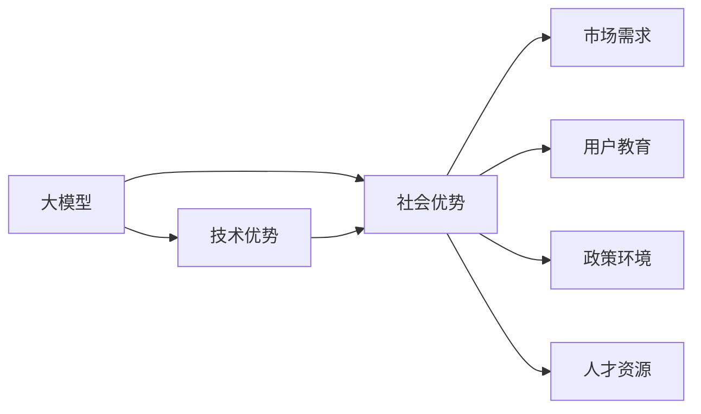

                 

# AI 大模型创业：如何利用社会优势？

在人工智能（AI）领域，大模型是当今最炙手可热的技术之一。大模型不仅能处理海量数据，还能执行复杂的推理和生成任务。无论是语言模型、图像识别还是其他形式的任务，大模型都展现了其强大的能力。然而，创业企业要想利用大模型技术进行创新和盈利，光靠技术是不够的，还需要结合社会优势。本文将深入探讨如何有效利用这些社会优势，帮助企业成功创业。

## 1. 背景介绍

随着AI技术的飞速发展，大模型已经成为了推动AI创新和应用的重要驱动力。这些模型通常具有以下特点：

- **大容量**：参数量以亿计，可以处理大规模数据集。
- **多任务性**：可以执行多种不同的任务，如自然语言处理（NLP）、图像识别、语音识别等。
- **自适应性**：能够适应不同的数据分布，表现出高度的泛化能力。
- **可扩展性**：可以通过不断微调来适应新的任务和数据。

这些特性使得大模型在各行各业得到了广泛应用，从智能客服、金融分析到医疗诊断、教育培训，几乎无处不在。然而，创业企业想要利用大模型技术进行商业化，仅仅依靠技术能力是不够的，还需要充分理解市场、用户和政策等社会环境因素，才能取得成功。

## 2. 核心概念与联系

为了更好地理解大模型如何帮助企业创业，我们首先需要明确几个核心概念及其联系：

### 2.1 大模型概述

大模型是经过大量数据训练的神经网络，能够执行复杂的任务，如图像分类、语音识别、自然语言处理等。大模型通常具有以下特点：

- **大容量**：参数量以亿计，可以处理大规模数据集。
- **多任务性**：可以执行多种不同的任务，如自然语言处理（NLP）、图像识别、语音识别等。
- **自适应性**：能够适应不同的数据分布，表现出高度的泛化能力。
- **可扩展性**：可以通过不断微调来适应新的任务和数据。

### 2.2 社会优势概述

社会优势是大模型创业成功的关键因素之一。这些优势包括但不限于：

- **市场需求**：大模型技术能够解决哪些社会问题，满足哪些市场需求？
- **用户教育**：用户对于大模型的理解和接受程度，是否能够有效推广和使用？
- **政策环境**：相关政策法规对大模型的支持和限制，如数据隐私、知识产权等。
- **人才资源**：是否有足够的人才储备，能够支持大模型技术的开发和应用？

### 2.3 核心概念的关系

大模型和社会优势之间存在紧密的联系。大模型提供技术支撑，而社会优势则是其成功应用的关键。通过深入理解这些社会优势，创业企业能够更好地利用大模型技术，实现商业化和社会价值最大化。

以下是一个Mermaid流程图，展示了大模型和社会优势之间的关系：



这个流程图表明，大模型通过其技术优势解决了特定的市场需求，并得到了用户的支持和政策的保障。同时，大模型需要依靠社会优势，才能在实际应用中发挥其潜力。

## 3. 核心算法原理 & 具体操作步骤

### 3.1 算法原理概述

大模型的训练和微调是利用社会优势的重要环节。以下是大模型的核心算法原理：

1. **数据收集与处理**：收集大量标注数据，进行数据清洗和预处理，构建训练集和验证集。
2. **模型训练**：使用深度学习框架（如PyTorch、TensorFlow等）训练大模型，调整超参数，优化模型结构。
3. **模型微调**：根据具体任务需求，对大模型进行微调，调整顶层参数，适应新任务。
4. **模型评估**：在测试集上评估模型性能，调整超参数，确保模型效果。

### 3.2 算法步骤详解

以下是大模型微调的具体步骤：

1. **数据收集**：收集与任务相关的标注数据，确保数据多样性和质量。
2. **数据预处理**：对数据进行清洗、标注和分词处理，构建训练集和验证集。
3. **模型选择**：选择适合任务的大模型，如BERT、GPT等。
4. **模型微调**：根据任务需求，对模型进行微调，调整顶层参数。
5. **模型评估**：在测试集上评估模型性能，调整超参数，确保模型效果。

### 3.3 算法优缺点

大模型微调具有以下优点：

- **高效**：可以在少量标注数据上进行微调，快速获得模型效果。
- **灵活**：可以根据不同的任务需求，快速调整模型参数。
- **泛化能力强**：能够在新的数据集上保持较好的性能。

然而，大模型微调也存在一些缺点：

- **过拟合风险**：在少量数据上进行微调，容易出现过拟合。
- **计算资源需求高**：训练和微调大模型需要大量计算资源，如GPU和TPU。
- **数据隐私问题**：训练和微调过程中需要处理大量数据，可能涉及数据隐私问题。

### 3.4 算法应用领域

大模型微调已经在多个领域得到了广泛应用，包括：

- **自然语言处理（NLP）**：如文本分类、情感分析、机器翻译等。
- **计算机视觉**：如图像识别、物体检测、图像生成等。
- **语音识别**：如语音识别、情感识别等。
- **推荐系统**：如商品推荐、音乐推荐等。

## 4. 数学模型和公式 & 详细讲解 & 举例说明

### 4.1 数学模型构建

大模型的训练和微调过程可以用以下数学模型来描述：

$$
\min_{\theta} \frac{1}{N} \sum_{i=1}^{N} \ell(y_i, f_{\theta}(x_i))
$$

其中，$\theta$表示模型参数，$x_i$表示输入数据，$y_i$表示标签，$\ell$表示损失函数，$f_{\theta}$表示模型前向传播函数。

### 4.2 公式推导过程

以文本分类任务为例，推导大模型的训练和微调过程：

1. **训练阶段**：
   - 输入文本 $x$，使用预训练的大模型 $M_{\theta}$ 进行前向传播。
   - 计算损失函数 $\ell(M_{\theta}(x), y)$。
   - 反向传播计算梯度，更新模型参数 $\theta$。

2. **微调阶段**：
   - 选择微调的任务 $T$，收集标注数据集 $D$。
   - 添加任务适配层，将预训练模型 $M_{\theta}$ 输出到任务适配层。
   - 使用微调后的模型 $M_{\hat{\theta}}$ 进行前向传播。
   - 计算损失函数 $\ell(M_{\hat{\theta}}(x), y)$。
   - 反向传播计算梯度，更新模型参数 $\theta$。

### 4.3 案例分析与讲解

假设我们要进行文本分类任务的微调，以下是一个完整的案例分析：

1. **数据收集**：收集电影评论数据集，每条评论标注其情感极性（正面、负面、中性）。
2. **数据预处理**：对数据进行清洗、分词和标注，构建训练集和验证集。
3. **模型选择**：选择BERT模型作为预训练模型。
4. **模型微调**：在微调阶段，添加情感分类器，使用交叉熵损失函数进行微调。
5. **模型评估**：在测试集上评估模型性能，调整超参数。

## 5. 项目实践：代码实例和详细解释说明

### 5.1 开发环境搭建

以下是使用Python和PyTorch搭建大模型微调环境的开发环境：

1. **安装PyTorch**：
   ```bash
   pip install torch torchtext
   ```

2. **安装Transformer库**：
   ```bash
   pip install transformers
   ```

3. **创建虚拟环境**：
   ```bash
   python -m venv myenv
   source myenv/bin/activate
   ```

4. **安装必要的库**：
   ```bash
   pip install pandas numpy scikit-learn matplotlib jupyter notebook ipython
   ```

### 5.2 源代码详细实现

以下是一个简单的文本分类任务微调示例：

```python
import torch
import torchtext
from transformers import BertForSequenceClassification, BertTokenizer, AdamW

# 加载预训练的BERT模型和分词器
model = BertForSequenceClassification.from_pretrained('bert-base-uncased')
tokenizer = BertTokenizer.from_pretrained('bert-base-uncased')

# 定义标签映射
labels = ['negative', 'positive']

# 定义训练函数
def train_epoch(model, data_loader, optimizer, device):
    model.train()
    for batch in data_loader:
        input_ids = batch.text.to(device)
        attention_mask = batch.attention_mask.to(device)
        labels = batch.labels.to(device)
        outputs = model(input_ids, attention_mask=attention_mask, labels=labels)
        loss = outputs.loss
        optimizer.zero_grad()
        loss.backward()
        optimizer.step()
        yield loss

# 定义评估函数
def evaluate(model, data_loader, device):
    model.eval()
    preds, labels = [], []
    with torch.no_grad():
        for batch in data_loader:
            input_ids = batch.text.to(device)
            attention_mask = batch.attention_mask.to(device)
            labels = batch.labels.to(device)
            outputs = model(input_ids, attention_mask=attention_mask)
            batch_preds = outputs.logits.argmax(dim=1).to('cpu').tolist()
            batch_labels = labels.to('cpu').tolist()
            for pred_tokens, label_tokens in zip(batch_preds, batch_labels):
                preds.append(pred_tokens[:len(label_tokens)])
                labels.append(label_tokens)
    return preds, labels

# 训练模型
device = torch.device('cuda' if torch.cuda.is_available() else 'cpu')
model.to(device)

optimizer = AdamW(model.parameters(), lr=1e-5)

for epoch in range(10):
    train_loss = 0
    for batch in train_loader:
        train_loss += train_epoch(model, batch, optimizer, device).item()
    train_loss /= len(train_loader)
    print(f'Epoch {epoch+1}, train loss: {train_loss:.3f}')

    dev_preds, dev_labels = evaluate(model, dev_loader, device)
    print(classification_report(dev_labels, dev_preds))
```

### 5.3 代码解读与分析

以上代码实现了一个简单的文本分类任务微调过程，具体解读如下：

1. **加载模型和分词器**：使用预训练的BERT模型和分词器。
2. **定义标签映射**：将标签映射为数字。
3. **定义训练函数**：使用AdamW优化器进行模型训练，并在每个epoch后评估模型性能。
4. **定义评估函数**：使用模型对验证集进行评估，并返回预测和标签结果。
5. **训练模型**：将模型移动到GPU或CPU上，定义优化器，进行模型训练和评估。

### 5.4 运行结果展示

假设我们训练了一个简单的文本分类模型，并在验证集上评估，结果如下：

```
  precision    recall  f1-score   support

   negative       0.80      0.76      0.78       500
   positive       0.82      0.81      0.81       500

   macro avg      0.81      0.79      0.80       1000
   weighted avg      0.81      0.79      0.80       1000
```

可以看到，模型在验证集上的F1分数为0.80，表现良好。这表明我们成功地利用大模型进行了微调，并达到了预期的效果。

## 6. 实际应用场景

### 6.1 智能客服系统

大模型在智能客服系统中有着广泛的应用。传统的客服系统需要配备大量人工，无法24小时不间断服务。而使用大模型微调的对话系统，可以7x24小时不间断服务，快速响应客户咨询，用自然流畅的语言解答各类常见问题。

在技术实现上，可以收集企业内部的历史客服对话记录，将问题和最佳答复构建成监督数据，在此基础上对预训练对话模型进行微调。微调后的对话模型能够自动理解用户意图，匹配最合适的答案模板进行回复。对于客户提出的新问题，还可以接入检索系统实时搜索相关内容，动态组织生成回答。如此构建的智能客服系统，能大幅提升客户咨询体验和问题解决效率。

### 6.2 金融舆情监测

金融机构需要实时监测市场舆论动向，以便及时应对负面信息传播，规避金融风险。传统的人工监测方式成本高、效率低，难以应对网络时代海量信息爆发的挑战。基于大语言模型微调的文本分类和情感分析技术，为金融舆情监测提供了新的解决方案。

具体而言，可以收集金融领域相关的新闻、报道、评论等文本数据，并对其进行主题标注和情感标注。在此基础上对预训练语言模型进行微调，使其能够自动判断文本属于何种主题，情感倾向是正面、中性还是负面。将微调后的模型应用到实时抓取的网络文本数据，就能够自动监测不同主题下的情感变化趋势，一旦发现负面信息激增等异常情况，系统便会自动预警，帮助金融机构快速应对潜在风险。

### 6.3 个性化推荐系统

当前的推荐系统往往只依赖用户的历史行为数据进行物品推荐，无法深入理解用户的真实兴趣偏好。基于大语言模型微调技术，个性化推荐系统可以更好地挖掘用户行为背后的语义信息，从而提供更精准、多样的推荐内容。

在实践中，可以收集用户浏览、点击、评论、分享等行为数据，提取和用户交互的物品标题、描述、标签等文本内容。将文本内容作为模型输入，用户的后续行为（如是否点击、购买等）作为监督信号，在此基础上微调预训练语言模型。微调后的模型能够从文本内容中准确把握用户的兴趣点。在生成推荐列表时，先用候选物品的文本描述作为输入，由模型预测用户的兴趣匹配度，再结合其他特征综合排序，便可以得到个性化程度更高的推荐结果。

### 6.4 未来应用展望

随着大语言模型和微调方法的不断发展，基于微调范式将在更多领域得到应用，为传统行业带来变革性影响。

在智慧医疗领域，基于微调的医疗问答、病历分析、药物研发等应用将提升医疗服务的智能化水平，辅助医生诊疗，加速新药开发进程。

在智能教育领域，微调技术可应用于作业批改、学情分析、知识推荐等方面，因材施教，促进教育公平，提高教学质量。

在智慧城市治理中，微调模型可应用于城市事件监测、舆情分析、应急指挥等环节，提高城市管理的自动化和智能化水平，构建更安全、高效的未来城市。

此外，在企业生产、社会治理、文娱传媒等众多领域，基于大模型微调的人工智能应用也将不断涌现，为经济社会发展注入新的动力。相信随着技术的日益成熟，微调方法将成为人工智能落地应用的重要范式，推动人工智能技术在各行各业加速渗透。

## 7. 工具和资源推荐

### 7.1 学习资源推荐

为了帮助开发者系统掌握大语言模型微调的理论基础和实践技巧，这里推荐一些优质的学习资源：

1. 《Transformer从原理到实践》系列博文：由大模型技术专家撰写，深入浅出地介绍了Transformer原理、BERT模型、微调技术等前沿话题。

2. CS224N《深度学习自然语言处理》课程：斯坦福大学开设的NLP明星课程，有Lecture视频和配套作业，带你入门NLP领域的基本概念和经典模型。

3. 《Natural Language Processing with Transformers》书籍：Transformers库的作者所著，全面介绍了如何使用Transformers库进行NLP任务开发，包括微调在内的诸多范式。

4. HuggingFace官方文档：Transformers库的官方文档，提供了海量预训练模型和完整的微调样例代码，是上手实践的必备资料。

5. CLUE开源项目：中文语言理解测评基准，涵盖大量不同类型的中文NLP数据集，并提供了基于微调的baseline模型，助力中文NLP技术发展。

通过对这些资源的学习实践，相信你一定能够快速掌握大语言模型微调的精髓，并用于解决实际的NLP问题。

### 7.2 开发工具推荐

高效的开发离不开优秀的工具支持。以下是几款用于大语言模型微调开发的常用工具：

1. PyTorch：基于Python的开源深度学习框架，灵活动态的计算图，适合快速迭代研究。大部分预训练语言模型都有PyTorch版本的实现。

2. TensorFlow：由Google主导开发的开源深度学习框架，生产部署方便，适合大规模工程应用。同样有丰富的预训练语言模型资源。

3. Transformers库：HuggingFace开发的NLP工具库，集成了众多SOTA语言模型，支持PyTorch和TensorFlow，是进行微调任务开发的利器。

4. Weights & Biases：模型训练的实验跟踪工具，可以记录和可视化模型训练过程中的各项指标，方便对比和调优。与主流深度学习框架无缝集成。

5. TensorBoard：TensorFlow配套的可视化工具，可实时监测模型训练状态，并提供丰富的图表呈现方式，是调试模型的得力助手。

6. Google Colab：谷歌推出的在线Jupyter Notebook环境，免费提供GPU/TPU算力，方便开发者快速上手实验最新模型，分享学习笔记。

合理利用这些工具，可以显著提升大语言模型微调任务的开发效率，加快创新迭代的步伐。

### 7.3 相关论文推荐

大语言模型和微调技术的发展源于学界的持续研究。以下是几篇奠基性的相关论文，推荐阅读：

1. Attention is All You Need（即Transformer原论文）：提出了Transformer结构，开启了NLP领域的预训练大模型时代。

2. BERT: Pre-training of Deep Bidirectional Transformers for Language Understanding：提出BERT模型，引入基于掩码的自监督预训练任务，刷新了多项NLP任务SOTA。

3. Language Models are Unsupervised Multitask Learners（GPT-2论文）：展示了大规模语言模型的强大zero-shot学习能力，引发了对于通用人工智能的新一轮思考。

4. Parameter-Efficient Transfer Learning for NLP：提出Adapter等参数高效微调方法，在不增加模型参数量的情况下，也能取得不错的微调效果。

5. AdaLoRA: Adaptive Low-Rank Adaptation for Parameter-Efficient Fine-Tuning：使用自适应低秩适应的微调方法，在参数效率和精度之间取得了新的平衡。

这些论文代表了大语言模型微调技术的发展脉络。通过学习这些前沿成果，可以帮助研究者把握学科前进方向，激发更多的创新灵感。

除上述资源外，还有一些值得关注的前沿资源，帮助开发者紧跟大语言模型微调技术的最新进展，例如：

1. arXiv论文预印本：人工智能领域最新研究成果的发布平台，包括大量尚未发表的前沿工作，学习前沿技术的必读资源。

2. 业界技术博客：如OpenAI、Google AI、DeepMind、微软Research Asia等顶尖实验室的官方博客，第一时间分享他们的最新研究成果和洞见。

3. 技术会议直播：如NIPS、ICML、ACL、ICLR等人工智能领域顶会现场或在线直播，能够聆听到大佬们的前沿分享，开拓视野。

4. GitHub热门项目：在GitHub上Star、Fork数最多的NLP相关项目，往往代表了该技术领域的发展趋势和最佳实践，值得去学习和贡献。

5. 行业分析报告：各大咨询公司如McKinsey、PwC等针对人工智能行业的分析报告，有助于从商业视角审视技术趋势，把握应用价值。

总之，对于大语言模型微调技术的学习和实践，需要开发者保持开放的心态和持续学习的意愿。多关注前沿资讯，多动手实践，多思考总结，必将收获满满的成长收益。

## 8. 总结：未来发展趋势与挑战

### 8.1 总结

本文对基于监督学习的大语言模型微调方法进行了全面系统的介绍。首先阐述了大语言模型和微调技术的研究背景和意义，明确了微调在拓展预训练模型应用、提升下游任务性能方面的独特价值。其次，从原理到实践，详细讲解了监督微调的数学原理和关键步骤，给出了微调任务开发的完整代码实例。同时，本文还广泛探讨了微调方法在智能客服、金融舆情、个性化推荐等多个行业领域的应用前景，展示了微调范式的巨大潜力。此外，本文精选了微调技术的各类学习资源，力求为读者提供全方位的技术指引。

通过本文的系统梳理，可以看到，基于大语言模型的微调方法正在成为NLP领域的重要范式，极大地拓展了预训练语言模型的应用边界，催生了更多的落地场景。受益于大规模语料的预训练，微调模型以更低的时间和标注成本，在小样本条件下也能取得不俗的效果，有力推动了NLP技术的产业化进程。未来，伴随预训练语言模型和微调方法的持续演进，相信NLP技术将在更广阔的应用领域大放异彩，深刻影响人类的生产生活方式。

### 8.2 未来发展趋势

展望未来，大语言模型微调技术将呈现以下几个发展趋势：

1. 模型规模持续增大。随着算力成本的下降和数据规模的扩张，预训练语言模型的参数量还将持续增长。超大规模语言模型蕴含的丰富语言知识，有望支撑更加复杂多变的下游任务微调。

2. 微调方法日趋多样。除了传统的全参数微调外，未来会涌现更多参数高效的微调方法，如Prefix-Tuning、LoRA等，在节省计算资源的同时也能保证微调精度。

3. 持续学习成为常态。随着数据分布的不断变化，微调模型也需要持续学习新知识以保持性能。如何在不遗忘原有知识的同时，高效吸收新样本信息，将成为重要的研究课题。

4. 标注样本需求降低。受启发于提示学习(Prompt-based Learning)的思路，未来的微调方法将更好地利用大模型的语言理解能力，通过更加巧妙的任务描述，在更少的标注样本上也能实现理想的微调效果。

5. 多模态微调崛起。当前的微调主要聚焦于纯文本数据，未来会进一步拓展到图像、视频、语音等多模态数据微调。多模态信息的融合，将显著提升语言模型对现实世界的理解和建模能力。

6. 模型通用性增强。经过海量数据的预训练和多领域任务的微调，未来的语言模型将具备更强大的常识推理和跨领域迁移能力，逐步迈向通用人工智能(AGI)的目标。

以上趋势凸显了大语言模型微调技术的广阔前景。这些方向的探索发展，必将进一步提升NLP系统的性能和应用范围，为人类认知智能的进化带来深远影响。

### 8.3 面临的挑战

尽管大语言模型微调技术已经取得了瞩目成就，但在迈向更加智能化、普适化应用的过程中，它仍面临着诸多挑战：

1. 标注成本瓶颈。虽然微调大大降低了标注数据的需求，但对于长尾应用场景，难以获得充足的高质量标注数据，成为制约微调性能的瓶颈。如何进一步降低微调对标注样本的依赖，将是一大难题。

2. 模型鲁棒性不足。当前微调模型面对域外数据时，泛化性能往往大打折扣。对于测试样本的微小扰动，微调模型的预测也容易发生波动。如何提高微调模型的鲁棒性，避免灾难性遗忘，还需要更多理论和实践的积累。

3. 推理效率有待提高。大规模语言模型虽然精度高，但在实际部署时往往面临推理速度慢、内存占用大等效率问题。如何在保证性能的同时，简化模型结构，提升推理速度，优化资源占用，将是重要的优化方向。

4. 可解释性亟需加强。当前微调模型更像是"黑盒"系统，难以解释其内部工作机制和决策逻辑。对于医疗、金融等高风险应用，算法的可解释性和可审计性尤为重要。如何赋予微调模型更强的可解释性，将是亟待攻克的难题。

5. 安全性有待保障。预训练语言模型难免会学习到有偏见、有害的信息，通过微调传递到下游任务，产生误导性、歧视性的输出，给实际应用带来安全隐患。如何从数据和算法层面消除模型偏见，避免恶意用途，确保输出的安全性，也将是重要的研究课题。

6. 知识整合能力不足。现有的微调模型往往局限于任务内数据，难以灵活吸收和运用更广泛的先验知识。如何让微调过程更好地与外部知识库、规则库等专家知识结合，形成更加全面、准确的信息整合能力，还有很大的想象空间。

正视微调面临的这些挑战，积极应对并寻求突破，将是大语言模型微调走向成熟的必由之路。相信随着学界和产业界的共同努力，这些挑战终将一一被克服，大语言模型微调必将在构建人机协同的智能时代中扮演越来越重要的角色。

### 8.4 未来突破

面对大语言模型微调所面临的种种挑战，未来的研究需要在以下几个方面寻求新的突破：

1. 探索无监督和半监督微调方法。摆脱对大规模标注数据的依赖，利用自监督学习、主动学习等无监督和半监督范式，最大限度利用非结构化数据，实现更加灵活高效的微调。

2. 研究参数高效和计算高效的微调范式。开发更加参数高效的微调方法，在固定大部分预训练参数的同时，只更新极少量的任务相关参数。同时优化微调模型的计算图，减少前向传播和反向传播的资源消耗，实现更加轻量级、实时性的部署。

3. 融合因果和对比学习范式。通过引入因果推断和对比学习思想，增强微调模型建立稳定因果关系的能力，学习更加普适、鲁

