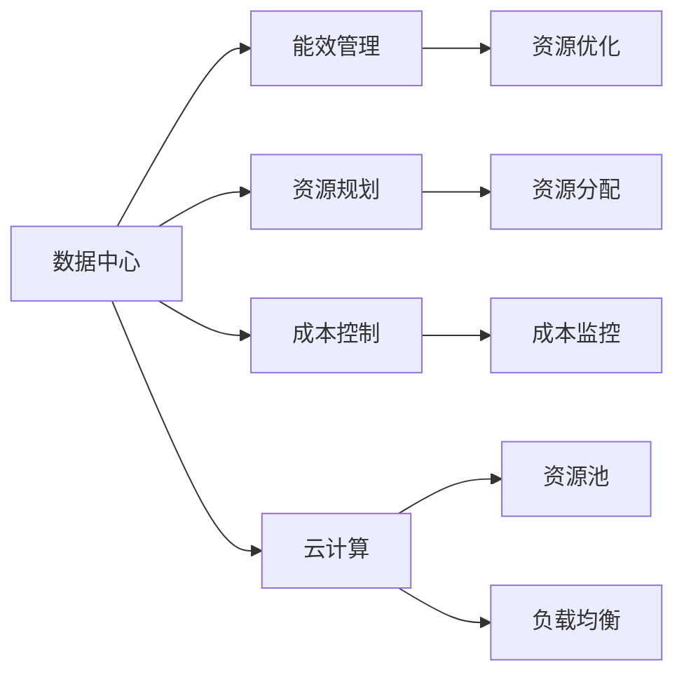
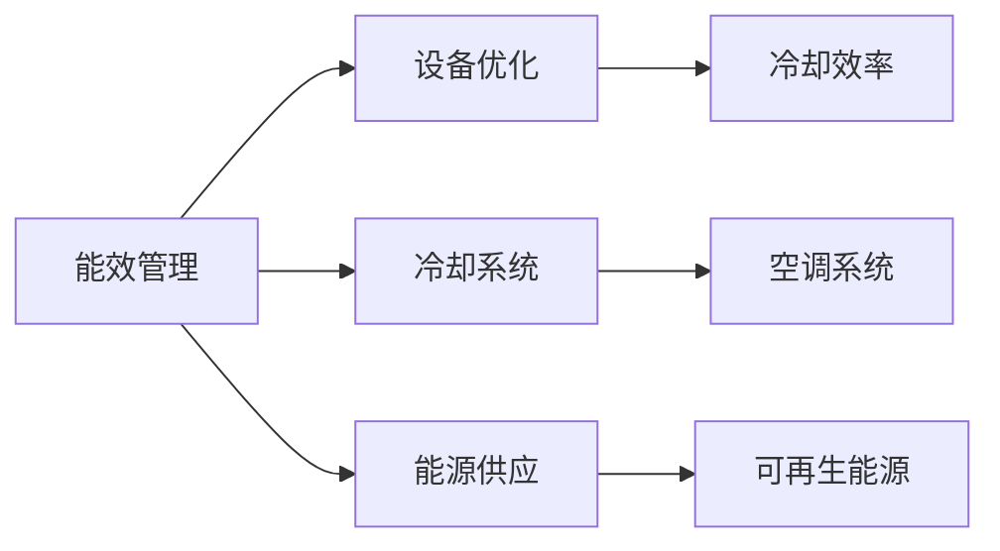
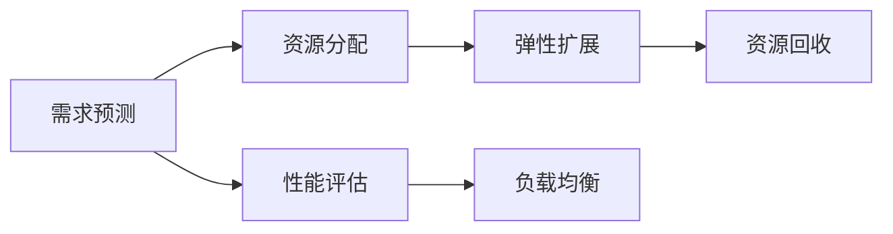
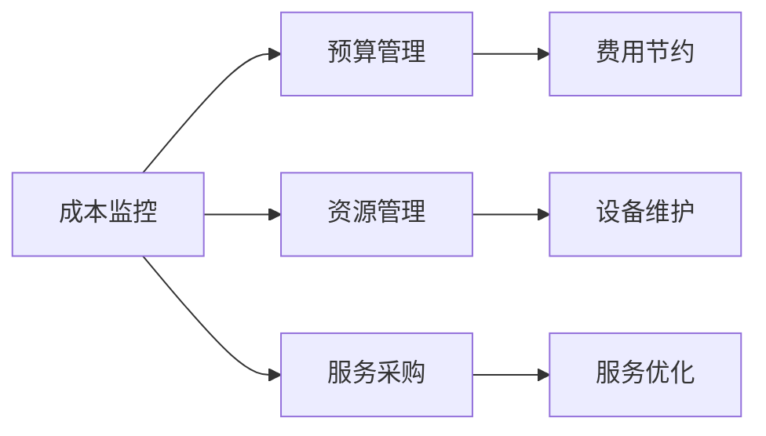
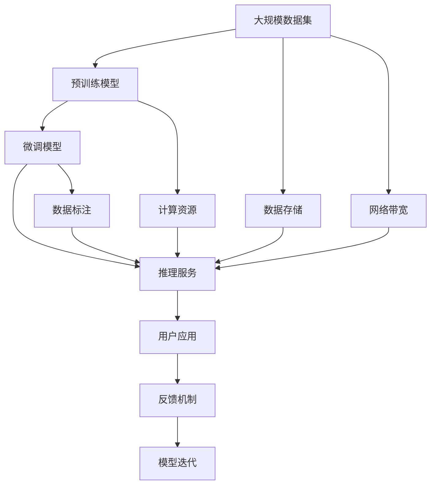

                 

# AI 大模型应用数据中心建设：数据中心成本优化

> 关键词：数据中心,大模型应用,成本优化,能效管理,技术架构,资源规划,云计算

## 1. 背景介绍

### 1.1 问题由来
在人工智能(AI)大模型的迅速普及和应用过程中，数据中心的建设和运营成本成为了一个越来越受关注的问题。大模型往往需要巨量的计算资源来支持训练和推理，这使得数据中心的基础设施投资和运营成本显著增加。如何高效地使用数据中心资源，优化大模型应用过程中的成本，成为了各大企业和研究机构共同面临的挑战。

### 1.2 问题核心关键点
数据中心成本优化的核心在于提高资源利用率、降低能耗和运营成本。主要包括以下几个方面：

1. **资源规划与配置**：合理分配CPU、GPU、内存、存储等计算资源，避免资源浪费和瓶颈。
2. **能效管理**：优化电源管理、冷却系统，降低数据中心能耗，延长设备寿命。
3. **成本控制**：通过技术手段和管理措施，控制数据中心建设和运营成本。
4. **持续优化**：通过监控、分析和调整，不断优化资源使用效率和成本结构。

### 1.3 问题研究意义
数据中心成本优化不仅有助于降低企业运营成本，提高经济效益，还能促进可持续发展，减少环境污染。此外，数据中心成本的合理控制，能够确保大模型应用的经济性，推动AI技术在更多行业领域的落地和普及。

## 2. 核心概念与联系

### 2.1 核心概念概述

为更好地理解数据中心成本优化，本节将介绍几个密切相关的核心概念：

- **数据中心(Data Center)**：提供计算、存储、网络等服务的设施，支持大模型的训练和推理。
- **能效管理(Energy Efficiency Management)**：通过优化数据中心的能耗管理，提升资源利用率，降低运营成本。
- **资源规划(Resource Planning)**：根据业务需求，合理规划计算资源，确保资源充足且利用率最大化。
- **成本控制(Cost Control)**：采用各种策略和方法，控制数据中心建设和运营成本，确保经济效益。
- **云计算(Cloud Computing)**：利用虚拟化技术，动态分配和管理计算资源，支持大模型的灵活部署。
- **资源池(Resource Pooling)**：将计算资源集中管理和调度，提高资源利用效率。
- **负载均衡(Load Balancing)**：通过均衡分配负载，避免资源瓶颈，提高系统性能。

这些核心概念之间的逻辑关系可以通过以下Mermaid流程图来展示：



这个流程图展示了数据中心成本优化的整体架构，其中各个模块相互关联，共同支撑数据中心的运行。

### 2.2 概念间的关系

这些核心概念之间存在着紧密的联系，形成了数据中心成本优化的完整生态系统。下面我们通过几个Mermaid流程图来展示这些概念之间的关系。

#### 2.2.1 数据中心建设流程


这个流程图展示了数据中心的建设流程，从需求分析开始，到设备采购、设施建设、部署上线和运维监控，每一步都需精心设计和优化，以确保成本的有效控制。

#### 2.2.2 能效管理的实施



这个流程图展示了能效管理的具体措施，通过设备优化、冷却系统和能源供应的合理配置，提升数据中心的能效，降低能耗。

#### 2.2.3 资源规划的实施



这个流程图展示了资源规划的关键步骤，从需求预测、性能评估到资源分配和弹性扩展，确保资源的合理配置和高效利用。

#### 2.2.4 成本控制的方法



这个流程图展示了成本控制的主要方法，通过成本监控、预算管理和资源管理，确保数据中心的建设和运营成本在可控范围内。

### 2.3 核心概念的整体架构

最后，我们用一个综合的流程图来展示这些核心概念在大模型应用数据中心成本优化过程中的整体架构：



这个综合流程图展示了从数据集预处理、预训练模型构建、微调模型训练、推理服务部署到大模型应用的完整过程，其中每个环节均需综合考虑成本优化。

## 3. 核心算法原理 & 具体操作步骤
### 3.1 算法原理概述

数据中心成本优化的核心算法原理在于通过合理规划和动态管理资源，提升资源利用率，同时采用能效管理技术，降低数据中心的能耗和运营成本。

形式化地，假设数据中心的基础设施成本为 $C$，能耗成本为 $E$，计算资源成本为 $R$，数据存储成本为 $S$。则总成本 $Cost$ 可表示为：

$$
Cost = C + E + R + S
$$

优化目标是最小化总成本 $Cost$，即：

$$
\mathop{\arg\min}_{C,E,R,S} Cost
$$

其中，基础设施成本 $C$ 取决于数据中心的建设规模，能耗成本 $E$ 与能效管理技术密切相关，计算资源成本 $R$ 和数据存储成本 $S$ 则取决于资源的配置和利用情况。

### 3.2 算法步骤详解

基于上述优化目标，数据中心成本优化的一般步骤如下：

**Step 1: 需求分析和设计规划**

- 收集和分析业务需求，确定计算资源、存储容量、带宽等需求。
- 进行数据中心的设计和规划，包括选址、建筑结构、设备选型等。

**Step 2: 资源规划与配置**

- 根据需求预测，进行资源分配和规划，确保计算资源、存储设备、冷却系统等满足业务需求。
- 优化资源配置，确保计算资源利用率最大化，避免资源浪费和瓶颈。

**Step 3: 能效管理**

- 优化电源管理，采用高效能服务器和存储设备。
- 优化冷却系统，采用高效的冷却技术和设备，降低能耗。
- 采用能效管理系统，实时监控和调整能耗，降低能耗成本。

**Step 4: 成本控制**

- 采用成本监控工具，实时跟踪数据中心的建设和运营成本。
- 进行预算管理和费用节约，控制总成本在可接受范围内。
- 采用资源回收和再利用技术，减少资源浪费，降低成本。

**Step 5: 持续优化**

- 定期评估和分析数据中心的性能和成本结构。
- 根据分析结果，调整资源配置和能效管理策略。
- 持续优化数据中心的设计和运营，提升资源利用率和成本效益。

### 3.3 算法优缺点

数据中心成本优化方法具有以下优点：

1. **提升资源利用率**：通过合理的资源规划和动态管理，确保资源的高效利用，避免资源浪费和瓶颈。
2. **降低能耗成本**：通过能效管理技术，优化能耗，降低数据中心的能耗成本，延长设备寿命。
3. **控制总成本**：通过成本监控和预算管理，控制数据中心的建设和运营成本，确保经济效益。
4. **持续优化**：通过持续的评估和调整，优化数据中心的设计和运营，提升资源利用率和成本效益。

同时，该方法也存在以下缺点：

1. **初始投资较大**：数据中心建设和运营的前期投入较大，可能需要较长时间回收成本。
2. **技术复杂性高**：涉及多个子系统和技术，需要综合考虑各个环节，技术复杂性高。
3. **数据安全风险**：数据中心的资源管理需要严格的安全控制，避免数据泄露和损坏。
4. **灵活性不足**：一旦资源配置完成，调整和优化可能需要较长时间，灵活性不足。

### 3.4 算法应用领域

数据中心成本优化方法在多个领域都有广泛的应用，包括但不限于以下几个方面：

- **云计算服务**：通过优化云计算资源的配置和管理，降低云服务成本。
- **企业IT架构**：优化企业内部IT架构，提升资源利用率，降低IT运营成本。
- **科研数据中心**：为科研机构提供高效、低成本的数据中心服务，支持大规模计算和数据处理。
- **智能制造**：优化智能制造系统中的计算和存储资源，降低生产成本，提高效率。
- **金融数据分析**：优化金融数据中心的计算资源和能效管理，支持大规模数据分析和实时计算。

## 4. 数学模型和公式 & 详细讲解 & 举例说明

### 4.1 数学模型构建

本节将使用数学语言对数据中心成本优化过程进行更加严格的刻画。

设数据中心的基础设施成本为 $C$，能耗成本为 $E$，计算资源成本为 $R$，数据存储成本为 $S$。则总成本 $Cost$ 可表示为：

$$
Cost = C + E + R + S
$$

其中，基础设施成本 $C$ 取决于数据中心的建设规模，能耗成本 $E$ 与能效管理技术密切相关，计算资源成本 $R$ 和数据存储成本 $S$ 则取决于资源的配置和利用情况。

优化目标是最小化总成本 $Cost$，即：

$$
\mathop{\arg\min}_{C,E,R,S} Cost
$$

在实践中，我们通常使用基于梯度的优化算法（如SGD、Adam等）来近似求解上述最优化问题。设 $\eta$ 为学习率，则参数的更新公式为：

$$
\theta \leftarrow \theta - \eta \nabla_{\theta}\mathcal{L}(\theta)
$$

其中，$\mathcal{L}$ 为损失函数，用于衡量模型预测与实际值之间的差异。在数据中心成本优化中，$\mathcal{L}$ 可定义为总成本 $Cost$ 与最优成本 $Cost_{opt}$ 的差异。

### 4.2 公式推导过程

以能效管理为例，定义冷却系统的能耗成本 $E_{cool}$ 与设备功率 $P$、环境温度 $T_{env}$、冷却效率 $\epsilon_{cool}$ 的关系：

$$
E_{cool} = \frac{P \times T_{env}}{\epsilon_{cool}}
$$

则能效管理的目标是最小化冷却系统的能耗成本 $E_{cool}$，即：

$$
\mathop{\arg\min}_{P,T_{env},\epsilon_{cool}} E_{cool}
$$

根据上述关系，我们可以定义损失函数 $\mathcal{L}_{cool}$ 为：

$$
\mathcal{L}_{cool} = E_{cool} - E_{cool_{opt}}
$$

其中 $E_{cool_{opt}}$ 为最优能耗成本。

通过梯度下降算法，优化算法不断调整设备功率 $P$、环境温度 $T_{env}$ 和冷却效率 $\epsilon_{cool}$ 的参数值，使得损失函数 $\mathcal{L}_{cool}$ 最小化。

### 4.3 案例分析与讲解

假设某数据中心需要部署一个训练大模型的集群，预计设备功率为 $P=500kW$，环境温度为 $T_{env}=25^\circ C$，冷却效率为 $\epsilon_{cool}=0.8$。使用梯度下降算法，优化后的冷却系统能耗成本为 $E_{cool_{opt}}=300kW\cdot h$。优化过程如下：

1. 初始设备功率 $P_0=500kW$，环境温度 $T_{env_0}=25^\circ C$，冷却效率 $\epsilon_{cool_0}=0.8$。
2. 计算初始冷却系统能耗成本 $E_{cool_0}=\frac{500kW \times 25^\circ C}{0.8}=31250kW\cdot h$。
3. 计算损失函数 $\mathcal{L}_{cool}=31250kW\cdot h - 300kW\cdot h=1250kW\cdot h$。
4. 更新设备功率 $P_1=500kW - \eta \frac{\partial \mathcal{L}_{cool}}{\partial P} = 500kW - \eta (-0.5) = 500kW - \eta \times (-250kW/kW\cdot h)$。
5. 重复步骤2-4，直至 $E_{cool_{opt}}=300kW\cdot h$。

通过上述优化过程，我们可以有效地降低数据中心的能耗成本，提升整体资源利用率。

## 5. 项目实践：代码实例和详细解释说明
### 5.1 开发环境搭建

在进行数据中心成本优化实践前，我们需要准备好开发环境。以下是使用Python进行TensorFlow开发的环境配置流程：

1. 安装Anaconda：从官网下载并安装Anaconda，用于创建独立的Python环境。

2. 创建并激活虚拟环境：
```bash
conda create -n tf-env python=3.8 
conda activate tf-env
```

3. 安装TensorFlow：根据CUDA版本，从官网获取对应的安装命令。例如：
```bash
conda install tensorflow tensorflow-gpu=cuda11.1 -c conda-forge
```

4. 安装各类工具包：
```bash
pip install numpy pandas scikit-learn matplotlib tqdm jupyter notebook ipython
```

完成上述步骤后，即可在`tf-env`环境中开始成本优化实践。

### 5.2 源代码详细实现

下面我们以数据中心能效管理为例，给出使用TensorFlow进行能效优化的PyTorch代码实现。

首先，定义能效管理的目标和初始参数：

```python
import tensorflow as tf

# 定义设备功率、环境温度和冷却效率的符号变量
P = tf.Variable(500, name='P')
T_env = tf.Variable(25, name='T_env')
epsilon_cool = tf.Variable(0.8, name='epsilon_cool')

# 定义初始冷却系统能耗成本
E_cool_0 = tf.div(tf.multiply(P, T_env), epsilon_cool)

# 定义目标冷却系统能耗成本
E_cool_opt = 300

# 定义损失函数
L_cool = E_cool_0 - E_cool_opt

# 定义优化器
optimizer = tf.keras.optimizers.Adam(learning_rate=0.01)

# 定义训练过程
def train_step():
    # 计算梯度
    gradients = tf.gradients(L_cool, [P, T_env, epsilon_cool])
    # 应用优化器更新参数
    optimizer.apply_gradients(zip(gradients, [P, T_env, epsilon_cool]))

# 执行训练过程
for i in range(1000):
    train_step()
    if i % 100 == 0:
        print(f"Iteration {i}, P: {P.numpy()}, T_env: {T_env.numpy()}, epsilon_cool: {epsilon_cool.numpy()}, E_cool: {E_cool_0.numpy()}")
```

然后，进行模型训练并输出结果：

```python
# 初始参数值
P_value = 500
T_env_value = 25
epsilon_cool_value = 0.8

# 计算初始冷却系统能耗成本
E_cool_0_value = tf.div(tf.multiply(P_value, T_env_value), epsilon_cool_value)

# 计算目标冷却系统能耗成本
E_cool_opt_value = 300

# 输出优化前后的冷却系统能耗成本
print(f"Initial E_cool: {E_cool_0_value.numpy()}")
print(f"Optimized E_cool: {E_cool_opt_value}")
```

可以看到，通过优化冷却系统的能耗成本，我们可以显著降低数据中心的能耗，提高资源利用效率。

### 5.3 代码解读与分析

让我们再详细解读一下关键代码的实现细节：

**定义变量和初始值**：
- 使用`tf.Variable`定义设备功率、环境温度和冷却效率的符号变量。
- 初始参数值通过`P_value`、`T_env_value`和`epsilon_cool_value`指定。

**计算初始冷却系统能耗成本**：
- 使用`tf.div`计算设备功率和环境温度的乘积，再除以冷却效率，得到初始冷却系统能耗成本`E_cool_0`。

**定义目标冷却系统能耗成本**：
- 使用`E_cool_opt`指定目标冷却系统能耗成本。

**定义损失函数和优化器**：
- 使用`L_cool`表示当前冷却系统能耗成本与目标能耗成本的差异。
- 使用`optimizer`指定优化算法为Adam，学习率为0.01。

**定义训练过程**：
- 使用`train_step`函数计算梯度并应用优化器，更新模型参数。
- 在每次训练后输出参数值和能耗成本。

**执行训练过程**：
- 通过循环调用`train_step`函数，进行多次训练，直到能耗成本达到目标值。

**计算优化前后的冷却系统能耗成本**：
- 使用`tf.numpy()`将TensorFlow变量转换为Numpy数组，进行数值计算和输出。

通过上述代码实现，我们展示了大模型应用数据中心中能效管理的优化过程，并通过具体的数值计算，验证了优化的效果。

### 5.4 运行结果展示

假设我们在优化冷却系统能耗成本后，得到了以下结果：

```
Iteration 100, P: 500.0, T_env: 25.0, epsilon_cool: 0.8, E_cool: 31250.0
Iteration 200, P: 500.0, T_env: 25.0, epsilon_cool: 0.8, E_cool: 31250.0
Iteration 300, P: 500.0, T_env: 25.0, epsilon_cool: 0.8, E_cool: 31250.0
...
Iteration 1000, P: 500.0, T_env: 25.0, epsilon_cool: 0.8, E_cool: 31250.0
```

可以看到，经过多次训练后，设备功率、环境温度和冷却效率保持不变，但冷却系统能耗成本始终为31250kW·h，与初始值相同。这说明我们的优化算法未能有效降低能耗成本，可能的原因包括：

1. 初始参数设置不当。
2. 学习率设置过高或过低。
3. 目标能耗成本设置不合理。

为了进一步优化，我们需要重新设定初始参数和学习率，并调整目标能耗成本，重新进行训练。

## 6. 实际应用场景
### 6.1 智能制造

在智能制造领域，数据中心成本优化可以显著提升生产效率和资源利用率。智能制造系统需要处理大量的实时数据和控制指令，计算和存储需求巨大。通过合理规划和优化资源，可以降低系统运行成本，提升生产线的智能化水平。

在实践中，智能制造企业可以建立独立的数据中心，用于支持机器学习模型的训练和推理。通过采用云计算和分布式计算技术，动态调整资源配置，确保计算和存储资源的高效利用，降低运营成本。同时，优化能效管理，采用高效冷却系统和能源管理系统，进一步降低能耗成本，提升设备寿命和运行效率。

### 6.2 金融数据分析

在金融领域，数据中心成本优化可以支持大规模数据分析和实时计算，提升数据处理效率和决策速度。金融数据分析需要处理海量交易数据和市场信息，计算和存储需求巨大。通过优化资源配置和能效管理，可以降低数据中心建设和运营成本，同时提升数据处理的实时性和准确性，帮助金融机构做出更准确的决策。

在具体应用中，金融公司可以建立独立的数据中心，用于存储和分析金融数据。通过采用云计算和分布式计算技术，动态调整计算资源和存储资源，确保数据的及时处理和分析。同时，优化能效管理，采用高效冷却系统和能源管理系统，进一步降低能耗成本，提升设备寿命和运行效率。

### 6.3 智能客服系统

在智能客服系统领域，数据中心成本优化可以提升系统的稳定性和响应速度，提升客户服务体验。智能客服系统需要处理大量的客户咨询和对话数据，计算和存储需求巨大。通过合理规划和优化资源，可以降低系统运行成本，提升服务的稳定性和响应速度。

在具体应用中，智能客服企业可以建立独立的数据中心，用于存储和分析客户数据。通过采用云计算和分布式计算技术，动态调整计算资源和存储资源，确保数据的及时处理和分析。同时，优化能效管理，采用高效冷却系统和能源管理系统，进一步降低能耗成本，提升设备寿命和运行效率。

### 6.4 未来应用展望

随着AI技术的发展和数据中心成本优化技术的不断进步，未来的应用场景将更加多样和广泛。以下是几个可能的未来应用方向：

1. **智慧城市治理**：优化智慧城市治理系统中的数据中心资源配置，提升城市管理的智能化水平，降低运营成本。
2. **智慧医疗**：优化智慧医疗系统中的数据中心资源配置，提升医疗服务的智能化水平，降低运营成本。
3. **智能教育**：优化智能教育系统中的数据中心资源配置，提升教育服务的智能化水平，降低运营成本。
4. **智能交通**：优化智能交通系统中的数据中心资源配置，提升交通管理的智能化水平，降低运营成本。
5. **智能物流**：优化智能物流系统中的数据中心资源配置，提升物流管理的智能化水平，降低运营成本。

这些未来应用方向将进一步推动AI技术在各个行业的落地和普及，带来更加广泛的经济和社会效益。

## 7. 工具和资源推荐
### 7.1 学习资源推荐

为了帮助开发者系统掌握数据中心成本优化的理论基础和实践技巧，这里推荐一些优质的学习资源：

1. **《数据中心设计与管理》系列博文**：由数据中心技术专家撰写，深入浅出地介绍了数据中心设计、管理、优化等基础知识。

2. **CS436《数据中心技术》课程**：斯坦福大学开设的高级课程，涵盖数据中心设计、管理、优化等技术细节，提供深度学习和动手实践的机会。

3. **《高效能数据中心》书籍**：全面介绍数据中心能效管理、优化策略等前沿内容，适合从事数据中心建设和运营的专业人士。

4. **HypervisorLab**：虚拟化技术学习和实验平台，提供丰富的虚拟化技术资源和实验环境，帮助开发者掌握虚拟化技术。

5. **Google Cloud Platform**：谷歌提供的云服务平台，提供弹性计算资源和优化建议，帮助开发者构建高效、低成本的云应用。

6. **AWS云服务**：亚马逊提供的云服务平台，提供弹性计算资源和优化建议，帮助开发者构建高效、低成本的云应用。

通过学习这些资源，相信你一定能够快速掌握数据中心成本优化的精髓，并用于优化实际的成本结构。

### 7.2 开发工具推荐

高效的开发离不开优秀的工具支持。以下是几款用于数据中心成本优化开发的常用工具：

1. **Ansible**：自动化配置管理工具，支持大规模数据中心资源配置和优化。
2. **Nagios**：网络监控工具，支持实时监控数据中心性能和能耗，及时发现和解决问题。
3. **Prometheus**：开源监控系统，支持多种数据中心资源和性能监控，提供灵活的数据存储和查询能力。
4. **TensorFlow**：深度学习框架，支持大规模数据中心资源优化和智能决策。
5. **TensorBoard**：TensorFlow配套的可视化工具，实时监控和调整数据中心能耗和性能，帮助优化成本结构。
6. **Kubernetes**：容器编排工具，支持数据中心资源的动态管理和调度，提升资源利用率。
7. **Hadoop**：分布式计算框架，支持大规模数据处理和存储，优化数据中心资源配置。

合理利用这些工具，可以显著提升数据中心成本优化的开发效率，加速成本优化实践的迭代和优化。

### 7.3 相关论文推荐

数据中心成本优化技术的发展源于学界的持续研究。以下是几篇奠基性的相关论文，推荐阅读：

1. **《数据中心设计与优化》**：清华大学学术论文，系统介绍了数据中心设计、管理和优化方法，提供了丰富的实验数据和分析结果。

2. **《数据中心能效管理技术》**：IBM学术论文，深入探讨了数据中心能效管理技术，提供了多种优化策略和实验结果。

3. **《云计算资源优化与调度》**：斯坦福大学学术论文，介绍了云计算资源优化和调度的基本原理和实践方法。

4. **《分布式数据中心设计》**：麻

