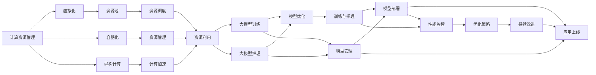
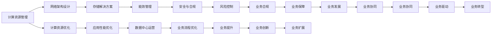

                 

# AI 大模型应用数据中心建设：数据中心运维与管理

在人工智能大模型（Large AI Models, LAMs）快速发展的背景下，数据中心建设成为支撑大模型训练与运维的关键基础设施。本文将详细探讨AI大模型应用中的数据中心建设、运维与管理，涉及数据中心基础设施、能效管理、网络架构、存储解决方案、安全与合规等多个方面，为业界提供全面的技术指导和实践参考。

## 1. 背景介绍

### 1.1 问题由来

随着深度学习和人工智能（AI）技术的飞速发展，大模型（如GPT-3、BERT等）在自然语言处理（NLP）、计算机视觉（CV）、语音识别（ASR）等领域的广泛应用，极大地推动了各个行业的数字化转型。然而，这些大模型的训练与运行需要极其庞大的计算资源和稳定的网络环境，因此数据中心的建设与管理成为AI大模型应用的核心环节。

### 1.2 问题核心关键点

在AI大模型应用中，数据中心的建设与管理需要解决以下几个核心问题：
1. **计算资源管理**：如何高效利用计算资源，满足大模型训练与推理的需求。
2. **网络架构设计**：如何设计可靠的网络架构，确保数据的高速传输与高效交换。
3. **能效管理**：如何优化能效，降低数据中心的运行成本。
4. **存储解决方案**：如何选择合适的存储技术，支持大模型的训练与推理。
5. **安全与合规**：如何保障数据中心的安全性，确保合规要求得到满足。

### 1.3 问题研究意义

数据中心作为AI大模型应用的基础设施，其建设与管理水平直接影响AI技术的应用效果与用户体验。高效、安全、稳定、合规的数据中心建设与管理，是推动AI大模型广泛应用的重要保障。

## 2. 核心概念与联系

### 2.1 核心概念概述

在大模型应用的数据中心建设与管理中，涉及多个核心概念和技术，包括但不限于：

- **计算资源管理**：指如何通过虚拟化、容器化、异构计算等技术，合理分配计算资源，提高资源利用率。
- **网络架构设计**：涉及网络拓扑、负载均衡、高速交换机等技术，确保数据的高效传输与交换。
- **能效管理**：包括能源监测、能效优化、绿能利用等，降低数据中心的运行成本。
- **存储解决方案**：包括传统存储、分布式存储、NVMe存储等，支持大模型的训练与推理需求。
- **安全与合规**：涉及物理安全、网络安全、数据安全、合规管理等，保障数据中心的安全与合规性。

这些概念之间相互关联，共同构成了数据中心建设与管理的完整生态系统。以下我们将通过一个Mermaid流程图，展示这些核心概念之间的联系。



### 2.2 概念间的关系

上述概念之间的联系和作用可以通过一个综合的Mermaid流程图来展示。



这个流程图展示了计算资源管理如何通过优化网络架构设计、存储解决方案、能效管理和安全合规，最终支持大模型的训练与推理，提升业务性能和效率，并推动业务创新与发展。

### 2.3 核心概念的整体架构

最后，我们用一个综合的流程图来展示这些核心概念在大模型应用中的整体架构。

```mermaid
graph LR
    A[数据中心基础设施] --> B[计算资源管理]
    B --> C[网络架构设计]
    C --> D[存储解决方案]
    D --> E[能效管理]
    E --> F[安全与合规]
    A --> G[数据管理]
    G --> H[数据采集]
    H --> I[数据存储]
    I --> J[数据备份]
    J --> K[数据安全]
    F --> L[安全审计]
    L --> M[合规管理]
    B --> N[资源池]
    N --> O[资源调度]
    O --> P[资源利用]
    P --> Q[计算优化]
    Q --> R[网络优化]
    R --> S[存储优化]
    S --> T[能效优化]
    T --> U[安全优化]
    U --> V[合规优化]
    N --> W[模型管理]
    W --> X[模型训练]
    X --> Y[模型推理]
    Y --> Z[模型优化]
    Z --> AA[模型部署]
    AA --> AB[应用上线]
    AB --> AC[业务流程优化]
    AC --> AD[业务协同]
    AD --> AE[业务创新]
    AE --> AF[业务发展]
    AF --> AG[业务扩展]
    AG --> AH[业务转型]
    AH --> AI[业务转型]
    AI --> AJ[业务优化]
    AJ --> AK[业务驱动]
    AK --> AL[业务驱动]
    AL --> AM[业务创新]
    AM --> AN[业务扩展]
    AN --> AO[业务优化]
    AO --> AP[业务驱动]
    AP --> AQ[业务驱动]
    AQ --> AR[业务创新]
    AR --> AS[业务扩展]
    AS --> AT[业务优化]
    AT --> AU[业务驱动]
    AU --> AV[业务驱动]
    AV --> AW[业务创新]
    AW --> AX[业务扩展]
    AX --> AY[业务优化]
    AY --> AZ[业务驱动]
    AZ --> BA[业务驱动]
    BA --> BB[业务创新]
    BB --> BC[业务扩展]
    BC --> BD[业务优化]
    BD --> BE[业务驱动]
    BE --> BF[业务驱动]
    BF --> BG[业务创新]
    BG --> BH[业务扩展]
    BH --> BI[业务优化]
    BI --> BJ[业务驱动]
    BJ --> BK[业务驱动]
    BK --> BL[业务创新]
    BL --> BM[业务扩展]
    BM --> BN[业务优化]
    BN --> BO[业务驱动]
    BO --> BP[业务驱动]
    BP --> BQ[业务创新]
    BQ --> BR[业务扩展]
    BR --> BS[业务优化]
    BS --> BT[业务驱动]
    BT --> BU[业务驱动]
    BU --> BV[业务创新]
    BV --> BW[业务扩展]
    BW --> BX[业务优化]
    BX --> BY[业务驱动]
    BY --> BZ[业务驱动]
    BZ --> CA[业务驱动]
    CA --> CB[业务创新]
    CB --> CC[业务扩展]
    CC --> CD[业务优化]
    CD --> CE[业务驱动]
    CE --> CF[业务驱动]
    CF --> CG[业务创新]
    CG --> CH[业务扩展]
    CH --> CI[业务优化]
    CI --> CJ[业务驱动]
    CJ --> CK[业务驱动]
    CK --> CL[业务创新]
    CL --> CM[业务扩展]
    CM --> CN[业务优化]
    CN --> CO[业务驱动]
    CO --> CP[业务驱动]
    CP --> CQ[业务创新]
    CQ --> CR[业务扩展]
    CR --> CS[业务优化]
    CS --> CT[业务驱动]
    CT --> CU[业务驱动]
    CU --> CV[业务创新]
    CV --> CW[业务扩展]
    CW --> CX[业务优化]
    CX --> CY[业务驱动]
    CY --> CZ[业务驱动]
    CZ --> DA[业务驱动]
    DA --> DB[业务创新]
    DB --> DC[业务扩展]
    DC --> DD[业务优化]
    DD --> DE[业务驱动]
    DE --> DF[业务驱动]
    DF --> DG[业务创新]
    DG --> DH[业务扩展]
    DH --> DI[业务优化]
    DI --> DJ[业务驱动]
    DJ --> DK[业务驱动]
    DK --> DL[业务创新]
    DL --> DM[业务扩展]
    DM --> DN[业务优化]
    DN --> DO[业务驱动]
    DO --> DP[业务驱动]
    DP --> DQ[业务创新]
    DQ --> DR[业务扩展]
    DR --> DS[业务优化]
    DS --> DT[业务驱动]
    DT --> DU[业务驱动]
    DU --> DV[业务创新]
    DV --> DW[业务扩展]
    DW --> DX[业务优化]
    DX --> DY[业务驱动]
    DY --> DZ[业务驱动]
    DZ --> EA[业务驱动]
    EA --> EB[业务创新]
    EB --> EC[业务扩展]
    EC --> ED[业务优化]
    ED --> EE[业务驱动]
    EE --> EF[业务驱动]
    EF --> EG[业务创新]
    EG --> EH[业务扩展]
    EH --> EI[业务优化]
    EI --> EJ[业务驱动]
    EJ --> EK[业务驱动]
    EK --> EL[业务创新]
    EL --> EM[业务扩展]
    EM --> EN[业务优化]
    EN -->EO[业务驱动]
    EO --> EP[业务驱动]
    EP --> EQ[业务创新]
    EQ --> ER[业务扩展]
    ER --> ES[业务优化]
    ES --> ET[业务驱动]
    ET --> EU[业务驱动]
    EU --> EV[业务创新]
    EV --> EW[业务扩展]
    EW --> EX[业务优化]
    EX --> EY[业务驱动]
    EY --> EZ[业务驱动]
    EZ --> FA[业务驱动]
    FA --> FB[业务创新]
    FB --> FC[业务扩展]
    FC --> FD[业务优化]
    FD --> FE[业务驱动]
    FE --> FF[业务驱动]
    FF --> FG[业务创新]
    FG --> FH[业务扩展]
    FH --> FI[业务优化]
    FI --> FJ[业务驱动]
    FJ --> FK[业务驱动]
    FK --> FL[业务创新]
    FL --> FM[业务扩展]
    FM --> FN[业务优化]
    FN --> FO[业务驱动]
    FO --> FP[业务驱动]
    FP --> FQ[业务创新]
    FQ --> FR[业务扩展]
    FR --> FS[业务优化]
    FS --> FT[业务驱动]
    FT --> FU[业务驱动]
    FU --> FV[业务创新]
    FV --> FW[业务扩展]
    FW --> FX[业务优化]
    FX --> FY[业务驱动]
    FY --> FZ[业务驱动]
    FZ --> GA[业务驱动]
    GA --> GB[业务创新]
    GB --> GC[业务扩展]
    GC --> GD[业务优化]
    GD --> GE[业务驱动]
    GE --> GF[业务驱动]
    GF --> GG[业务创新]
    GG --> GH[业务扩展]
    GH --> GI[业务优化]
    GI --> GJ[业务驱动]
    GJ --> GK[业务驱动]
    GK --> GL[业务创新]
    GL --> GM[业务扩展]
    GM --> GN[业务优化]
    GN --> GO[业务驱动]
    GO --> GP[业务驱动]
    GP --> GQ[业务创新]
    GQ --> GR[业务扩展]
    GR --> GS[业务优化]
    GS --> GT[业务驱动]
    GT --> GU[业务驱动]
    GU -->GV[业务创新]
    GV --> GW[业务扩展]
    GW --> GX[业务优化]
    GX --> GY[业务驱动]
    GY --> GZ[业务驱动]
    GZ --> HA[业务驱动]
    HA --> HB[业务创新]
    HB --> HC[业务扩展]
    HC --> HD[业务优化]
    HD --> HE[业务驱动]
    HE --> HF[业务驱动]
    HF --> HG[业务创新]
    HG --> HH[业务扩展]
    HH --> HI[业务优化]
    HI --> HJ[业务驱动]
    HJ --> HK[业务驱动]
    HK --> HL[业务创新]
    HL --> HM[业务扩展]
    HM --> HN[业务优化]
    HN --> HO[业务驱动]
    HO --> HP[业务驱动]
    HP --> HQ[业务创新]
    HQ --> HR[业务扩展]
    HR --> HS[业务优化]
    HS --> HT[业务驱动]
    HT --> HU[业务驱动]
    HU --> HV[业务创新]
    HV --> HW[业务扩展]
    HW --> HX[业务优化]
    HX --> HY[业务驱动]
    HY --> HZ[业务驱动]
    HZ --> IA[业务驱动]
    IA --> IB[业务创新]
    IB --> IC[业务扩展]
    IC --> ID[业务优化]
    ID --> IE[业务驱动]
    IE --> IF[业务驱动]
    IF --> IG[业务创新]
    IG --> IH[业务扩展]
    IH --> II[业务优化]
    II --> IJ[业务驱动]
    IJ --> IK[业务驱动]
    IK --> IL[业务创新]
    IL --> IM[业务扩展]
    IM --> IN[业务优化]
    IN --> IO[业务驱动]
    IO --> IP[业务驱动]
    IP --> IQ[业务创新]
    IQ --> IR[业务扩展]
    IR --> IS[业务优化]
    IS --> IT[业务驱动]
    IT --> IU[业务驱动]
    IU --> IV[业务创新]
    IV --> IW[业务扩展]
    IW --> IX[业务优化]
    IX --> IY[业务驱动]
    IY --> IZ[业务驱动]
    IZ -->JA[业务驱动]
    JA --> JB[业务创新]
    JB --> JC[业务扩展]
    JC --> JD[业务优化]
    JD --> JE[业务驱动]
    JE --> JF[业务驱动]
    JF --> JG[业务创新]
    JG --> JH[业务扩展]
    JH --> JI[业务优化]
    JI --> JJ[业务驱动]
    JJ --> JK[业务驱动]
    JK --> JL[业务创新]
    JL --> JM[业务扩展]
    JM --> JN[业务优化]
    JN --> JO[业务驱动]
    JO --> JP[业务驱动]
    JP --> JQ[业务创新]
    JQ --> JR[业务扩展]
    JR --> JS[业务优化]
    JS --> JT[业务驱动]
    JT --> JU[业务驱动]
    JU --> JV[业务创新]
    JV --> JW[业务扩展]
    JW --> JX[业务优化]
    JX --> JY[业务驱动]
    JY --> JZ[业务驱动]
    JZ --> KA[业务驱动]
    KA --> KB[业务创新]
    KB --> KC[业务扩展]
    KC --> KD[业务优化]
    KD --> KE[业务驱动]
    KE --> KF[业务驱动]
    KF --> KG[业务创新]
    KG --> KH[业务扩展]
    KH --> KI[业务优化]
    KI --> KJ[业务驱动]
    KJ --> KK[业务驱动]
    KK --> KL[业务创新]
    KL --> KM[业务扩展]
    KM --> KN[业务优化]
    KN --> KO[业务驱动]
    KO --> KP[业务驱动]
    KP --> KQ[业务创新]
    KQ --> KR[业务扩展]
    KR --> KS[业务优化]
    KS --> KT[业务驱动]
    KT --> KU[业务驱动]
    KU --> KV[业务创新]
    KV --> KW[业务扩展]
    KW --> KX[业务优化]
    KX --> KY[业务驱动]
    KY --> KZ[业务驱动]
    KZ --> LA[业务驱动]
    LA --> LB[业务创新]
    LB --> LC[业务扩展]
    LC --> LD[业务优化]
    LD --> LE[业务驱动]
    LE --> LF[业务驱动]
    LF --> LG[业务创新]
    LG --> LH[业务扩展]
    LH --> LI[业务优化]
    LI --> LJ[业务驱动]
    LJ --> LK[业务驱动]
    LK --> LL[业务创新]
    LL --> LM[业务扩展]
    LM --> LN[业务优化]
    LN --> LO[业务驱动]
    LO --> LP[业务驱动]
    LP --> LQ[业务创新]
    LQ --> LR[业务扩展]
    LR --> LS[业务优化]
    LS --> LT[业务驱动]
    LT --> LU[业务驱动]
    LU --> LV[业务创新]
    LV --> LW[业务扩展]
    LW --> LX[业务优化]
    LX --> LY[业务驱动]
    LY --> LZ[业务驱动]
    LZ --> MA[业务驱动]
    MA --> MB[业务创新]
    MB --> MC[业务扩展]
    MC --> MD[业务优化]
    MD --> ME[业务驱动]
    ME --> MF[业务驱动]
    MF --> MG[业务创新]
    MG --> MH[业务扩展]
    MH --> MI[业务优化]
    MI --> MJ[业务驱动]
    MJ --> MK[业务驱动]
    MK --> ML[业务创新]
    ML --> MM[业务扩展]
    MM --> MN[业务优化]
    MN --> MO[业务驱动]
    MO --> MP[业务驱动]
    MP --> MQ[业务创新]
    MQ --> MR[业务扩展]
    MR --> MS[业务优化]
    MS --> MT[业务驱动]
    MT --> MU[业务驱动]
    MU --> MV[业务创新]
    MV --> MW[业务扩展]
    MW --> MX[业务优化]
    MX --> MY[业务驱动]
    MY --> MZ[业务驱动]
    MZ --> NA[业务驱动]
    NA --> NB[业务创新]
    NB --> NC[业务扩展]
    NC --> ND[业务优化]
    ND --> NE[业务驱动]
    NE --> NF[业务驱动]
    NF --> NG[业务创新]
    NG --> NH[业务扩展]
    NH --> NI[业务优化]
    NI --> NJ[业务驱动]
    NJ --> NK[业务驱动]
    NK --> NL[业务创新]
    NL --> NM[业务扩展]
    NM --> NN[业务优化]
    NN --> NO[业务驱动]
    NO --> NP[业务驱动]
    NP --> NQ[业务创新]
    NQ --> NR[业务扩展]
    NR --> NS[业务优化]
    NS --> NT[业务驱动]
    NT --> NU[业务驱动]
    NU --> NV[业务创新]
    NV --> NW[业务扩展]
    NW --> NX[业务优化]
    NX --> NY[业务驱动]
    NY --> NZ[业务驱动]
    NZ --> OA[业务驱动]
    OA --> OB[业务创新]
    OB --> OC[业务扩展]
    OC --> OD[业务优化]
    OD --> OE[业务驱动]
    OE --> OF[业务驱动]
    OF --> OG[业务创新]
    OG --> OH[业务扩展]
    OH --> OI[业务优化]
    OI --> OJ[业务驱动]
    OJ --> OK[业务驱动]
    OK --> OL[业务创新]
    OL --> OM[业务扩展]
    OM --> ON[业务优化]
    ON --> OO[业务驱动]
    OO --> OP[业务驱动]
    OP --> OQ[业务创新]
    OQ --> OR[业务扩展]
    OR --> OS[业务优化]
    OS --> OT[业务驱动]
    OT --> OU[业务驱动]
    OU -->OV[业务创新]
    OV --> OW[业务扩展]
    OW --> OX[业务优化]
    OX --> OY[业务驱动]
    OY --> OZ[业务驱动]
    OZ --> PA[业务驱动]
    PA --> PB[业务创新]
    PB --> PC[业务扩展]
    PC --> PD[业务优化]
    PD --> PE[业务驱动]
    PE --> PF[业务驱动]
    PF --> PG[业务创新]
    PG --> PH[业务扩展]
    PH --> PI[业务优化]
    PI --> PJ[业务驱动]
    PJ --> PK[业务驱动]
    PK --> PL[业务创新]
    PL --> PM[业务扩展]
    PM --> PN[业务优化]
    PN --> PO[业务驱动]
    PO --> PP[业务驱动]
    PP --> PQ[业务创新]
    PQ --> PR[业务扩展]
    PR --> PS[业务优化]
    PS --> PT[业务驱动]
    PT --> PU[业务驱动]
    PU --> PV[业务创新]
    PV --> PW[业务扩展]
    PW --> PX[业务优化]
    PX --> PY[业务驱动]
    PY --> PZ[业务驱动]
    PZ --> QA[业务驱动]
    QA --> QB[业务创新]
    QB --> QC[业务扩展]
    QC --> QD[业务优化]
    QD --> QE[业务驱动]
    QE --> QF[业务驱动]
    QF --> QG[业务创新]
    QG --> QH[业务扩展]
    QH --> QI[业务优化]
    QI --> QJ[业务驱动]
    QJ --> QK[业务驱动]
    QK --> QL[业务创新]
    QL --> QM[业务扩展]
    QM --> QN[业务优化]
    QN --> QO[业务驱动]
    QO --> QP[业务驱动]
    QP --> QQ[业务创新]
    QQ --> QR[业务扩展]
    QR --> QS[业务优化]
    QS --> QT[业务驱动]
    QT --> QU[业务驱动]
    QU --> QV[业务创新]
    QV --> QW[业务扩展]
    QW --> QX[业务优化]
    QX --> QY[业务驱动]
    QY --> QZ[业务驱动]
    QZ --> RA[业务驱动]
    RA --> RB[业务创新]
    RB --> RC[业务扩展]
    RC --> RD[业务优化]
    RD --> RE[业务驱动]
    RE --> RF[业务驱动]
    RF --> RG[业务创新]
    RG --> RH[业务扩展]
    RH --> RI[业务优化]
    RI --> RJ[业务驱动]
    RJ --> RK[业务驱动]
    RK --> RL[业务创新]
    RL --> RM[业务扩展]
    RM --> RN[业务优化]
    RN --> RO[业务驱动]
    RO --> RP[业务驱动]
    RP --> RQ[业务创新]
    RQ --> RR[业务扩展]
    RR --> RS[业务优化]
    RS --> RT[业务驱动]
    RT --> RU[业务驱动]
    RU --> RV[业务创新]
    RV --> RW[业务扩展]
    RW --> RX[业务优化]
    RX --> RY[业务驱动]
    RY --> RZ[业务驱动]
    RZ --> SA[业务驱动]
    SA --> SB[业务创新]
    SB --> SC[业务扩展]
    SC --> SD[业务优化]
    SD --> SE[业务驱动]
    SE --> SF[业务驱动]
    SF --> SG[业务创新]
    SG --> SH[业务扩展]
    SH --> SI[业务优化]
    SI --> SJ[业务驱动]
    SJ --> SK[业务驱动]
    SK --> SL[业务创新]
    SL --> SM[业务扩展]
    SM --> SN[业务优化]
    SN --> SO[业务驱动]
    SO --> SP[业务驱动]
    SP --> SQ[业务创新]
    SQ --> SR[业务扩展]
    SR --> SS[业务优化]
    SS --> ST[业务驱动]
    ST --> SU[业务驱动]
    SU --> SV[业务创新]
    SV --> SW[业务扩展]
    SW --> SX[业务优化]
    SX --> SY[业务驱动]
    SY --> SZ[业务驱动]
    SZ --> TA[业务驱动]
    TA --> TB[业务创新]
    TB --> TC[业务扩展]
    TC --> TD[业务优化]
    TD --> TE[业务驱动]
    TE --> TF[业务驱动]
    TF --> TG[业务创新]
    TG --> TH[业务扩展]
    TH --> TI[业务优化]
    TI --> TJ[业务驱动]
    TJ --> TK[业务驱动]
    TK --> TL[业务创新]
    TL --> TM[业务扩展]
    TM --> TN[业务优化]
    TN --> TO[业务驱动]
    TO --> TP[业务驱动]
    TP --> TQ[业务创新]
    TQ --> TR[业务扩展]
    TR --> TS[业务优化]
    TS --> TT[业务驱动]
    TT --> TU[业务驱动]
    TU --> TV[业务创新]
    TV --> TW[业务扩展]
    TW --> TX[业务优化]
    TX --> TY[业务驱动]
    TY --> TZ[业务驱动]
    TZ --> UA[业务驱动]
    UA --> UB[业务创新]
    UB --> UC[业务扩展]
    UC --> UD[业务优化]
    UD --> UE[业务驱动]
    UE --> UF[业务驱动]
    UF --> UG[业务创新]
    UG --> UH[业务扩展]
    UH --> UI[业务优化]
    UI --> UJ[业务驱动]
    UJ --> UK[业务

