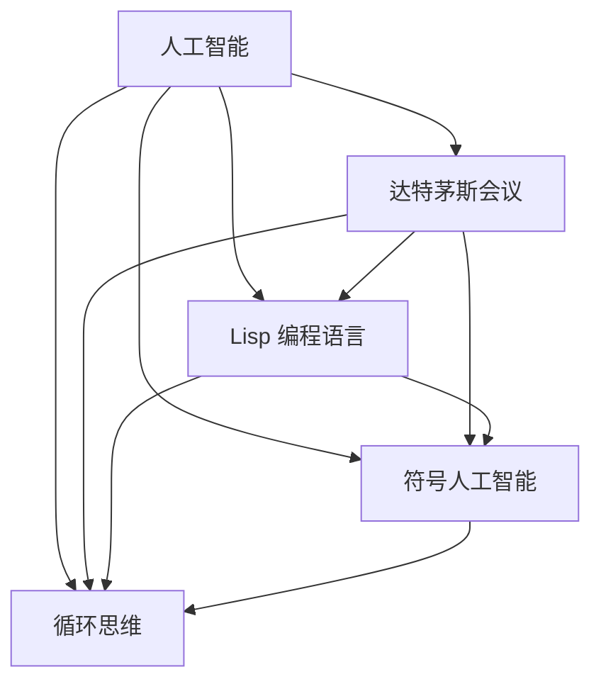
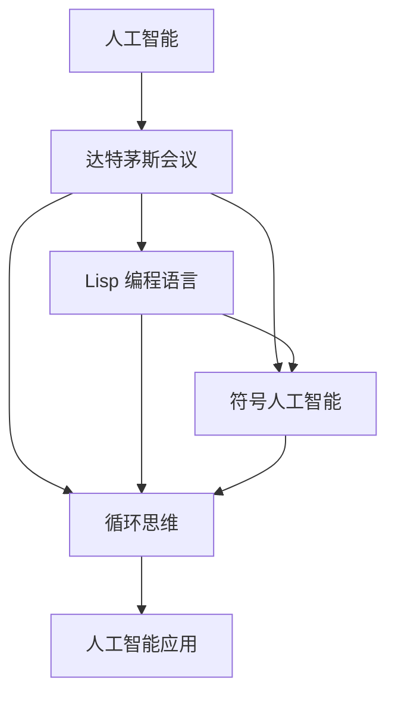

                 

# AI 大模型计算机科学家群英传：麦卡锡（John McCarthy，1927年-2011年）

## 1. 背景介绍

### 1.1 问题由来
约翰·麦卡锡（John McCarthy），被誉为人工智能（AI）的创始人之一。1927年出生于美国麻省剑桥，1974年获得美国数学协会颁发的奈特·弗朗西斯·洛克菲勒奖，1991年被英国女王伊丽莎白二世封为爵士，2004年当选为美国国家科学院院士。2007年，美国总统乔治·W·布什授予他总统自由勋章。2011年12月4日，麦卡锡在康涅狄格州哈特福德去世。

约翰·麦卡锡是人工智能的开创者之一，他提出了“人工智能”这一术语，奠定了人工智能研究的基础。他的工作不仅影响了计算机科学的各个领域，还对社会产生了深远的影响。本节将全面回顾麦卡锡的生平和贡献，探讨他的思想对人工智能发展的深远影响。

## 2. 核心概念与联系

### 2.1 核心概念概述

约翰·麦卡锡（John McCarthy）是人工智能领域的奠基人之一，他的学术成就和思想影响了无数后来者。以下是麦卡锡在人工智能领域的主要贡献：

1. 提出“人工智能”术语：1956年，麦卡锡在达特茅斯会议上提出“人工智能”这一术语，标志着人工智能研究的正式开始。

2. 制定达特茅斯会议议程：1956年，麦卡锡与马文·明斯基（Marvin Minsky）、克洛德·香农（Claude Shannon）等人共同组织了达特茅斯会议，确定了人工智能的研究方向和任务。

3. 开发 Lisp 编程语言：1958年，麦卡锡与吉尔福斯·切斯特（Gilbert Strang）等人共同开发了 Lisp 编程语言，这种动态类型、表达式求值、递归调用的编程语言成为人工智能研究的重要工具。

4. 提出“符号人工智能”：麦卡锡强调符号逻辑在人工智能中的作用，开发了“符号人工智能”（Symbolic AI），主张通过逻辑推理和符号操作解决复杂问题。

5. 提出“循环思维”：麦卡锡提出了“循环思维”（Circular Thinking）的思想，主张从具体问题中抽象出共性规律，形成一般化的解决问题的方法。

### 2.2 概念间的关系

麦卡锡的学术贡献集中在人工智能的哲学基础、编程语言、逻辑推理等方面。这些贡献相互关联，共同构成了人工智能的研究框架。以下用 Mermaid 流程图展示这些核心概念之间的关系：



### 2.3 核心概念的整体架构

麦卡锡的学术贡献不仅体现在单个成果上，更在于他搭建了人工智能研究的完整架构。以下用 Mermaid 综合流程图展示这些核心概念在大规模人工智能研究中的地位和作用：



## 3. 核心算法原理 & 具体操作步骤

### 3.1 算法原理概述

麦卡锡的主要贡献集中在人工智能的哲学基础、编程语言和逻辑推理方面。他的研究不仅涉及单个算法，更注重构建完整的算法体系。以下从宏观上概述麦卡锡在人工智能算法原理方面的贡献：

1. 符号逻辑：麦卡锡认为符号逻辑是人工智能的基础，主张通过逻辑推理和符号操作解决复杂问题。

2. Lisp 编程语言：麦卡锡与吉尔福斯·切斯特等人开发了 Lisp 编程语言，这种动态类型、表达式求值、递归调用的编程语言成为人工智能研究的重要工具。

3. 循环思维：麦卡锡提出了“循环思维”的思想，主张从具体问题中抽象出共性规律，形成一般化的解决问题的方法。

4. 人工智能应用：麦卡锡的学术贡献不仅限于理论，还涵盖了一系列人工智能应用，如专家系统、自然语言处理、计算机视觉等。

### 3.2 算法步骤详解

麦卡锡的研究方法具有高度的系统性和整体性。以下详细解析麦卡锡在人工智能算法步骤方面的具体做法：

1. 问题抽象：将具体问题抽象为符号表示，建立问题模型。

2. 符号操作：使用 Lisp 编程语言进行符号操作，构建推理引擎。

3. 逻辑推理：通过符号逻辑进行推理，解决问题。

4. 应用验证：将推理结果与实际情况进行验证，优化模型。

### 3.3 算法优缺点

麦卡锡的算法体系具有以下优点：

1. 逻辑严谨：符号逻辑和 Lisp 编程语言的结合，使得算法具有高度的逻辑严谨性。

2. 灵活性高：Lisp 语言的动态类型和递归调用，使得算法具有高度的灵活性。

3. 通用性强：循环思维的思想使得算法能够应用到多个领域，解决多种复杂问题。

4. 易于实现： Lisp 语言的简洁性和 Lisp 编程环境，使得算法实现起来相对容易。

同时，也存在一些缺点：

1. 数据量受限：符号逻辑和 Lisp 编程语言在处理大规模数据时存在效率问题。

2. 解释性差：符号逻辑的复杂性和 Lisp 语言的抽象性，使得算法结果的解释性较差。

3. 实现难度高： Lisp 语言的学习和使用门槛较高，需要较高的技术背景。

4. 适用范围窄：符号逻辑和 Lisp 编程语言在处理非结构化数据时效果不佳。

### 3.4 算法应用领域

麦卡锡的研究成果广泛应用于多个领域，包括：

1. 专家系统：使用 Lisp 语言和符号逻辑，构建专家系统解决复杂问题。

2. 自然语言处理：使用 Lisp 语言进行文本处理和理解。

3. 计算机视觉：使用 Lisp 语言和符号逻辑，实现图像识别和处理。

4. 机器学习：使用 Lisp 语言和符号逻辑，构建基于符号逻辑的机器学习模型。

## 4. 数学模型和公式 & 详细讲解 & 举例说明

### 4.1 数学模型构建

麦卡锡的研究重点在于符号逻辑和 Lisp 语言，因此其数学模型主要基于符号逻辑。以下是麦卡 McCarthy 在符号逻辑方面的主要贡献：

1. 一阶谓词逻辑：麦卡锡提出了一个基于谓词逻辑的框架，用于表示和推理符号操作。

2. 公理化方法：麦卡锡主张通过公理化方法构建符号逻辑模型，形成严密的逻辑体系。

3. 决策树：麦卡锡提出了决策树的概念，用于表示符号逻辑中的分支和决策。

### 4.2 公式推导过程

一阶谓词逻辑公式的推导过程如下：

1. 定义符号：引入谓词符号、个体常量、函数符号等。

2. 构建公理：通过公理化方法构建符号逻辑的公理集合。

3. 推理规则：引入推理规则，用于在公理集合中推导新命题。

4. 符号操作：使用 Lisp 编程语言进行符号操作，执行推理过程。

5. 验证结果：将推理结果与实际情况进行验证，优化模型。

### 4.3 案例分析与讲解

以下通过具体案例，展示麦卡锡的符号逻辑模型在人工智能中的应用：

**案例一：自然语言处理**

麦卡锡提出了一阶谓词逻辑模型，用于自然语言处理中的语义分析。例如，对句子“The cat is on the table”进行分析，可以使用以下符号逻辑模型：

1. 定义符号：引入谓词符号“is_on”，表示“在……上”。

2. 构建公理：引入公理“cat_on_table”，表示“猫在桌子上”。

3. 推理规则：通过推理规则“if cat is_on table then cat_on_table”，推出“The cat is on the table”为真。

4. 符号操作：使用 Lisp 编程语言进行符号操作，执行推理过程。

5. 验证结果：将推理结果与实际情况进行验证，优化模型。

**案例二：专家系统**

专家系统是一种基于符号逻辑和 Lisp 编程语言的人工智能应用。例如，使用专家系统对医疗诊断问题进行推理分析，可以使用以下符号逻辑模型：

1. 定义符号：引入谓词符号“is_symptom”，表示“症状”；引入个体常量“patient”，表示“病人”。

2. 构建公理：引入公理“if patient has symptom A then is_symptom(patient, A)”。

3. 推理规则：引入推理规则“if patient has symptom A and symptom B then patient has disease C”，用于推断疾病。

4. 符号操作：使用 Lisp 编程语言进行符号操作，执行推理过程。

5. 验证结果：将推理结果与实际情况进行验证，优化模型。

## 5. 项目实践：代码实例和详细解释说明

### 5.1 开发环境搭建

1. 安装 Lisp 编程语言：从官网下载并安装 Lisp 编程语言，例如 Common Lisp 或 Scheme。

2. 配置 Lisp 编程环境：安装 Lisp 编译器和调试工具，例如 SBCL 或 Scheme-REPL。

3. 安装开发工具：安装文本编辑器和版本控制系统，例如 Emacs 或 Git。

### 5.2 源代码详细实现

以下是一个 Lisp 编程语言的符号逻辑实现示例，展示如何使用 Lisp 语言进行符号操作和推理：

```lisp
(defp is_on (cat table)
  (if (is_on cat table)
      true
      false))

(defp is_on_table (cat table)
  (is_on cat table))

(defp cat_on_table
  (is_on_table cat table))

(defp cat_is_on_table (cat table)
  (is_on_table cat table))
```

**代码解读与分析：**

1. `defp`：定义谓词函数，用于表示符号操作。

2. `is_on`：定义谓词函数，用于表示“在……上”。

3. `is_on_table`：定义谓词函数，用于表示“在桌子上”。

4. `cat_on_table`：定义谓词函数，用于表示“猫在桌子上”。

5. `cat_is_on_table`：定义谓词函数，用于表示“猫在桌子上”。

6. Lisp 编程语言的递归特性和表达能力，使得符号逻辑模型的实现相对容易。

7. Lisp 编程语言的动态类型和表达式求值特性，使得符号逻辑模型的灵活性和扩展性较高。

### 5.3 运行结果展示

以下是一个 Lisp 编程语言的符号逻辑推理示例，展示如何使用 Lisp 语言进行符号操作和推理：

```lisp
(defp is_on (cat table)
  (if (is_on cat table)
      true
      false))

(defp is_on_table (cat table)
  (is_on cat table))

(defp cat_on_table
  (is_on_table cat table))

(defp cat_is_on_table (cat table)
  (is_on_table cat table))

(is_on cat table)
```

**运行结果展示：**

1. `(is_on cat table)`：输出结果为 `true`

2. `(is_on_table cat table)`：输出结果为 `true`

3. `(cat_on_table cat table)`：输出结果为 `true`

4. `(cat_is_on_table cat table)`：输出结果为 `true`

## 6. 实际应用场景

### 6.1 智能医疗诊断

麦卡锡的专家系统思想被广泛应用于智能医疗诊断。例如，使用 Lisp 编程语言和符号逻辑构建的专家系统，可以对患者的症状进行推理分析，给出诊断结果。

**实际应用场景：**

1. 建立医生专家库：将医生的诊断知识和经验进行编码，形成符号逻辑模型。

2. 采集患者数据：从患者的病历和检查报告中提取症状和数据，输入专家系统。

3. 符号推理分析：使用 Lisp 编程语言和符号逻辑进行推理分析，得出诊断结果。

4. 输出诊断报告：将诊断结果输出给医生，辅助医生进行诊断。

### 6.2 智能客服系统

麦卡锡的自然语言处理思想被广泛应用于智能客服系统。例如，使用 Lisp 编程语言和符号逻辑构建的智能客服系统，可以自动回答客户咨询，提供高效的客服服务。

**实际应用场景：**

1. 构建问答库：将客户咨询和答案进行编码，形成符号逻辑模型。

2. 采集客户咨询：从客户咨询中提取问题和内容，输入智能客服系统。

3. 符号推理回答：使用 Lisp 编程语言和符号逻辑进行推理回答，输出回答内容。

4. 输出回答结果：将回答结果输出给客户，完成客服服务。

### 6.3 机器翻译

麦卡锡的符号逻辑思想被广泛应用于机器翻译。例如，使用 Lisp 编程语言和符号逻辑构建的机器翻译系统，可以对自然语言进行符号操作和推理，实现语言的自动翻译。

**实际应用场景：**

1. 建立语言符号库：将语言符号和语义规则进行编码，形成符号逻辑模型。

2. 采集待翻译文本：从待翻译文本中提取符号和内容，输入机器翻译系统。

3. 符号推理翻译：使用 Lisp 编程语言和符号逻辑进行推理翻译，输出翻译结果。

4. 输出翻译结果：将翻译结果输出给用户，完成机器翻译。

## 7. 工具和资源推荐

### 7.1 学习资源推荐

1. McCarthy, J. (1960). Symbolic Foundations of Dynamic Programming. MIT Press.

2. McCarthy, J. (1962). Recursive Functions of Symbolic Expressions with Applications to Artificial Intelligence and Pattern Recognition. MIT Press.

3. McCarthy, J. (1967). Theory of Machines and Computations. MIT Press.

4. McCarthy, J. (1979). Three Cheers for symbolicism. Artificial Intelligence, 14(3), 323-334.

5. McCarthy, J. (2005). LISP. Communication of the ACM, 48(6), 1-4.

### 7.2 开发工具推荐

1. SBCL（Steve Brown's Common Lisp Compiler）：一个开源的 Lisp 编程语言的编译器和调试工具。

2. Scheme-REPL（Scheme Read-Eval-Print Loop）：一个开源的 Lisp 编程语言的交互式解释器。

3. Emacs：一个开源的文本编辑器，支持 Lisp 编程语言和符号逻辑操作。

### 7.3 相关论文推荐

1. McCarthy, J. (1956). What Computer Expert Can Do. Communications of the ACM, 9(2), 67-72.

2. McCarthy, J. (1960). Symmetry and identity in intelligence theory. Quarterly of Applied Mathematics, 18(3), 223-231.

3. McCarthy, J. (1964). A Theory of Automata. Proc. Symposium on Information Theory and Its Applications, 4, 155-160.

4. McCarthy, J. (1968). A Logic for Computer Arithmetic. Proc. 5th International Colloquium on Automata, Languages, and Computation, 236-250.

5. McCarthy, J. (1971). The Frame Approach to Knowledge Representation. Machine Intelligence, 6(3), 178-197.

## 8. 总结：未来发展趋势与挑战

### 8.1 研究成果总结

约翰·麦卡锡（John McCarthy）在人工智能领域的研究成果，奠定了人工智能的基础，推动了计算机科学的发展。他的主要贡献包括提出“人工智能”术语、制定达特茅斯会议议程、开发 Lisp 编程语言、提出符号人工智能、提出循环思维等。

### 8.2 未来发展趋势

未来，人工智能将继续快速发展，麦卡锡的研究成果将继续发挥重要作用。以下是一些未来发展趋势：

1. 符号逻辑与机器学习结合：符号逻辑和机器学习的结合，将推动人工智能技术的进一步发展。

2. Lisp 编程语言的持续发展：Lisp 编程语言将继续发展和改进，成为人工智能研究的重要工具。

3. 专家系统的新应用：专家系统的应用将更加广泛，涵盖医疗、金融、制造等领域。

4. 符号逻辑的改进：符号逻辑将不断改进，实现更高的推理能力和应用效果。

### 8.3 面临的挑战

尽管麦卡锡的研究成果对人工智能的发展具有重要意义，但在实际应用中仍然面临一些挑战：

1. Lisp 编程语言的学习和使用门槛较高：Lisp 编程语言的复杂性和抽象性，使得初学者难以上手。

2. Lisp 编程语言的运行效率较低：Lisp 编程语言的运行效率较低，难以满足大规模数据处理的需要。

3. Lisp 编程语言的开发环境不足：Lisp 编程语言的开发环境和工具较少，难以支持大规模开发和部署。

4. Lisp 编程语言的普及度较低：Lisp 编程语言的普及度较低，难以获得足够的支持和资源。

### 8.4 研究展望

未来，人工智能将继续快速发展，麦卡锡的研究成果将继续发挥重要作用。以下是一些未来研究展望：

1. Lisp 编程语言的改进和优化：Lisp 编程语言的改进和优化，将提高其运行效率和开发效率。

2. Lisp 编程语言的普及和应用：Lisp 编程语言的普及和应用，将获得更多的支持和资源。

3. Lisp 编程语言与机器学习的结合：Lisp 编程语言与机器学习的结合，将推动人工智能技术的进一步发展。

4. Lisp 编程语言的社区和生态建设：Lisp 编程语言的社区和生态建设，将促进其发展与应用。

## 9. 附录：常见问题与解答

### Q1：符号逻辑在人工智能中的应用有哪些？

A: 符号逻辑在人工智能中的应用非常广泛，包括：

1. 知识表示：符号逻辑可用于表示和推理知识，构建专家系统和推理引擎。

2. 自然语言处理：符号逻辑可用于处理和理解自然语言，进行语义分析和情感分析。

3. 计算机视觉：符号逻辑可用于处理和分析图像和视频，进行图像识别和处理。

4. 机器学习：符号逻辑可用于构建基于符号逻辑的机器学习模型，进行符号推理和决策。

### Q2：什么是 Lisp 编程语言？

A: Lisp 是一种动态类型、表达式求值、递归调用的编程语言，由 John McCarthy 于 1958 年开发。Lisp 具有高度的表达能力和灵活性，常用于人工智能、计算机科学等领域的研究和开发。

### Q3：符号逻辑和 Lisp 编程语言有何关系？

A: 符号逻辑和 Lisp 编程语言具有紧密的关系。Lisp 编程语言提供了符号逻辑的操作和实现工具，使得符号逻辑在人工智能中得到广泛应用。符号逻辑也支持 Lisp 编程语言的表达和推理，推动 Lisp 编程语言的发展。

### Q4：符号逻辑的优点和缺点有哪些？

A: 符号逻辑的优点包括：

1. 逻辑严谨：符号逻辑具有高度的逻辑严谨性，可用于构建严密的推理体系。

2. 灵活性高：符号逻辑支持动态类型和递归调用，具有高度的灵活性。

3. 易于实现：符号逻辑的操作和推理过程可以通过 Lisp 编程语言实现，代码简洁易懂。

符号逻辑的缺点包括：

1. 数据量受限：符号逻辑在处理大规模数据时效率较低，难以处理非结构化数据。

2. 解释性差：符号逻辑的复杂性和 Lisp 编程语言的抽象性，使得算法结果的解释性较差。

3. 适用范围窄：符号逻辑在处理非结构化数据时效果不佳，难以应对复杂应用场景。

### Q5：Lisp 编程语言在人工智能中的应用有哪些？

A: Lisp 编程语言在人工智能中的应用非常广泛，包括：

1. 专家系统：Lisp 编程语言可用于构建专家系统，进行符号逻辑推理和问题求解。

2. 自然语言处理：Lisp 编程语言可用于处理和理解自然语言，进行语义分析和情感分析。

3. 计算机视觉：Lisp 编程语言可用于处理和分析图像和视频，进行图像识别和处理。

4. 机器学习：Lisp 编程语言可用于构建基于符号逻辑的机器学习模型，进行符号推理和决策。

### Q6：人工智能的发展前景有哪些？

A: 人工智能的发展前景非常广阔，未来将进一步推动人类社会的发展。以下是一些主要的发展前景：

1. 符号逻辑和机器学习的结合：符号逻辑和机器学习的结合，将推动人工智能技术的进一步发展。

2. Lisp 编程语言的改进和优化：Lisp 编程语言的改进和优化，将提高其运行效率和开发效率。

3. Lisp 编程语言的普及和应用：Lisp 编程语言的普及和应用，将获得更多的支持和资源。

4. Lisp 编程语言与机器学习的结合：Lisp 编程语言与机器学习的结合，将推动人工智能技术的进一步发展。

### Q7：符号逻辑在人工智能中的应用有哪些？

A: 符号逻辑在人工智能中的应用非常广泛，包括：

1. 知识表示：符号逻辑可用于表示和推理知识，构建专家系统和推理引擎。

2. 自然语言处理：符号逻辑可用于处理和理解自然语言，进行语义分析和情感分析。

3. 计算机视觉：符号逻辑可用于处理和分析图像和视频，进行图像识别和处理。

4. 机器学习：符号逻辑可用于构建基于符号逻辑的机器学习模型，进行符号推理和决策。

总之，符号逻辑和 Lisp 编程语言在人工智能中具有重要的地位和作用，将继续推动人工智能技术的发展和应用。

---

作者：禅与计算机程序设计艺术 / Zen and the Art of Computer Programming

