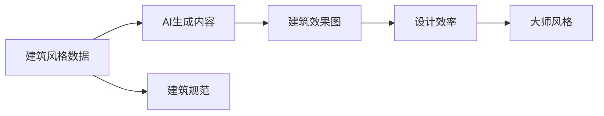
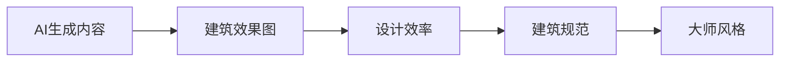
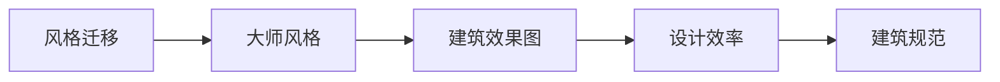
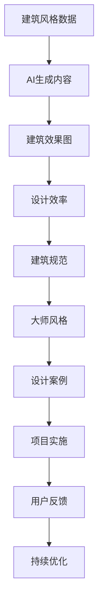

                 

# AIGC从入门到实战：掌握建筑设计要领，创建各种大师风格的效果图

## 1. 背景介绍

### 1.1 问题由来
随着人工智能和大数据技术的飞速发展，利用AI生成内容(AI-Generated Content, AIGC)在建筑设计领域逐渐兴起。AIGC技术可以通过深度学习模型，根据已有的建筑风格、规范等数据，自动生成具有不同大师风格的效果图。这不仅为建筑师提供了一种全新的设计思路，还能提高设计效率，减少重复工作。

但是，目前AIGC技术在建筑设计中的应用还处于初级阶段，很多建筑师对于如何将AIGC技术融入到自己的设计中，缺乏系统性和实践指导。因此，本文将深入探讨如何利用AIGC技术，掌握建筑设计要领，创造出具有大师风格的效果图。

### 1.2 问题核心关键点
本文聚焦于如何利用AI生成内容(AIGC)技术，结合建筑学的专业知识，自动生成具有不同大师风格的效果图。核心问题包括：

- 如何选择合适的AI模型进行建筑风格生成？
- 如何收集和整理大量的建筑风格数据？
- 如何在设计过程中，将AI生成的建筑效果图与设计师的个人风格相结合？
- 如何提高AI生成的建筑效果图的质量和细节？

## 2. 核心概念与联系

### 2.1 核心概念概述

为更好地理解AIGC技术在建筑设计中的应用，本文将介绍几个密切相关的核心概念：

- AI生成内容(AIGC)：利用人工智能和大数据技术，自动生成各种类型的内容，如文本、图像、音频等。

- 建筑风格生成：根据已有的建筑风格数据，利用AI模型自动生成具有特定风格的建筑效果图。

- 风格迁移：将一张图像的风格特征迁移至另一张图像上，使得后者呈现出前者特有的风格。

- 建筑规范：建筑设计必须遵守的一系列规则和标准，包括尺寸、材料、结构等方面。

- 设计效率：指设计师在完成设计任务时所需的时间和资源消耗。

- 大师风格：指建筑史上著名建筑师（如贝聿铭、扎哈·哈迪德等）所代表的设计风格。

这些核心概念之间的逻辑关系可以通过以下Mermaid流程图来展示：



这个流程图展示了几者之间的联系：

1. 建筑风格数据是AIGC技术的基础。
2. 建筑规范是建筑设计的基本要求。
3. AI生成的建筑效果图可以大幅提高设计效率。
4. 大师风格可以成为AI生成的建筑效果图的目标。

### 2.2 概念间的关系

这些核心概念之间存在着紧密的联系，构成了AIGC技术在建筑设计中的应用框架。下面我们通过几个Mermaid流程图来展示这些概念之间的关系。

#### 2.2.1 AI生成内容与建筑设计的关系



这个流程图展示了AI生成内容在建筑设计中的作用：

1. AI生成内容可以高效生成建筑效果图，减少设计师的手工绘图工作。
2. 高效的建筑效果图生成，可以提升设计效率。
3. 高效的建筑效果图生成，使得建筑规范的遵守更容易实现。
4. 大师风格的建筑效果图，可以成为设计师追求的目标。

#### 2.2.2 风格迁移与大师风格的关系



这个流程图展示了风格迁移在大师风格建筑效果图生成中的应用：

1. 风格迁移可以将大师风格的特征应用到建筑效果图上。
2. 风格迁移生成的建筑效果图，具有大师风格的特征。
3. 大师风格的建筑效果图，可以提升设计效率。
4. 大师风格的建筑效果图，需要遵守建筑规范。

### 2.3 核心概念的整体架构

最后，我们用一个综合的流程图来展示这些核心概念在大建筑设计中的应用：



这个综合流程图展示了从建筑风格数据到项目实施的完整过程：

1. 建筑风格数据是AIGC技术的基础。
2. AI生成的建筑效果图可以提升设计效率。
3. 高效的建筑效果图生成，使得建筑规范的遵守更容易实现。
4. 大师风格的建筑效果图，可以成为设计师追求的目标。
5. 设计案例和项目实施，利用AI生成的建筑效果图进行设计。
6. 用户反馈和持续优化，不断提升设计效果和用户体验。

## 3. 核心算法原理 & 具体操作步骤
### 3.1 算法原理概述

利用AIGC技术进行建筑设计，本质上是将AI生成内容(AIGC)应用于建筑风格的生成。核心算法主要包括风格迁移和生成对抗网络(Generative Adversarial Network, GAN)等技术。

风格迁移算法通过学习源图像和目标图像之间的风格特征，将源图像的风格特征迁移至目标图像上，生成具有特定风格的建筑效果图。GAN算法则通过训练一个生成器和一个判别器，使得生成器生成的建筑效果图尽可能逼真，判别器能够准确区分真实建筑效果图和生成建筑效果图。

### 3.2 算法步骤详解

#### 3.2.1 数据准备

1. 收集建筑风格数据：可以从已有的建筑数据集中提取建筑风格信息，或者通过爬虫技术从互联网收集具有特定风格的建筑图片。
2. 数据预处理：将收集到的图片进行归一化、缩放等预处理，以确保模型的输入数据格式一致。
3. 数据标注：对建筑风格数据进行标注，包括建筑物的结构、材料、风格等特征。

#### 3.2.2 选择模型

1. 风格迁移模型：常用的风格迁移模型包括VGGNet、ResNet、InceptionNet等，这些模型已经被广泛应用于图像风格的迁移。
2. GAN模型：常用的GAN模型包括DCGAN、WGAN、CycleGAN等，这些模型已经被广泛应用于图像生成和风格生成。

#### 3.2.3 模型训练

1. 风格迁移模型训练：将收集到的建筑风格数据输入到训练好的风格迁移模型中，生成具有特定风格的建筑效果图。
2. GAN模型训练：将生成器生成的建筑效果图和真实建筑效果图输入到训练好的判别器中，不断调整生成器和判别器的参数，直到生成器生成的建筑效果图与真实建筑效果图无法区分。

#### 3.2.4 后处理

1. 图像处理：对生成的建筑效果图进行去噪、增强对比度等图像处理，提高图片质量。
2. 风格优化：使用风格迁移算法对生成的建筑效果图进行风格优化，使其更接近于目标风格。

### 3.3 算法优缺点

#### 3.3.1 优点

1. 自动化：AIGC技术可以自动生成建筑效果图，节省设计师的时间和精力。
2. 多样性：AI模型可以根据不同的风格数据生成多种风格的建筑效果图，为设计师提供更多设计灵感。
3. 高效性：AIGC技术可以快速生成大量建筑效果图，提升设计效率。

#### 3.3.2 缺点

1. 质量不稳定：AI生成的建筑效果图质量不稳定，需要根据设计师的反馈进行多次调整。
2. 风格一致性：AI生成的建筑效果图风格一致性可能不如设计师手工绘制的图纸。
3. 数据依赖：AIGC技术的效果依赖于高质量的建筑风格数据，数据质量不足可能影响效果。

### 3.4 算法应用领域

AIGC技术在建筑设计中的应用领域非常广泛，主要包括以下几个方面：

1. 建筑设计：利用AIGC技术生成建筑效果图，辅助设计师进行初步设计。
2. 室内设计：利用AIGC技术生成室内效果图，辅助设计师进行室内设计。
3. 景观设计：利用AIGC技术生成景观效果图，辅助设计师进行景观设计。
4. 工程制图：利用AIGC技术生成工程制图，辅助设计师进行工程制图。
5. 建筑可视化：利用AIGC技术生成建筑可视化效果，辅助设计师进行展示和交流。

## 4. 数学模型和公式 & 详细讲解 & 举例说明

### 4.1 数学模型构建

基于AIGC技术在建筑设计中的应用，本文将通过数学模型来详细讲解AIGC技术的具体实现过程。

假设建筑风格数据为 $D_{style}=\{(x_i,y_i)\}_{i=1}^N$，其中 $x_i$ 为建筑图片，$y_i$ 为建筑风格特征。模型的目标是学习一个函数 $f$，将输入的建筑图片 $x_i$ 转换为输出建筑效果图 $y_i'$。

数学模型可以表示为：

$$
y_i' = f(x_i, \theta)
$$

其中 $\theta$ 为模型的参数。

### 4.2 公式推导过程

#### 4.2.1 风格迁移模型

风格迁移模型通过学习源图像和目标图像之间的风格特征，将源图像的风格特征迁移至目标图像上。常用的风格迁移算法包括VGGNet、ResNet、InceptionNet等。

以VGGNet为例，其风格迁移模型可以表示为：

$$
G(x_i, \theta_g) = x_i \circ h_g
$$

其中 $G$ 为风格迁移函数，$h_g$ 为风格迁移网络，$\theta_g$ 为网络参数。

#### 4.2.2 GAN模型

GAN模型通过训练一个生成器 $G$ 和一个判别器 $D$，使得生成器生成的建筑效果图尽可能逼真，判别器能够准确区分真实建筑效果图和生成建筑效果图。

GAN模型的目标函数可以表示为：

$$
\min_G \max_D V(D, G)
$$

其中 $V(D, G)$ 为GAN模型的目标函数，$D$ 为判别器，$G$ 为生成器。

GAN模型的目标函数可以进一步分解为：

$$
V(D, G) = -E_{x \sim p_{data}(x)}[\log D(x)] - E_{z \sim p_z(z)}[\log (1 - D(G(z))]
$$

其中 $p_{data}(x)$ 为真实建筑效果图的数据分布，$z$ 为生成器输入的噪声向量。

### 4.3 案例分析与讲解

#### 4.3.1 案例一：风格迁移

以VGGNet为例，其风格迁移模型可以用于将一张普通建筑效果图转换为具有某种特定风格的建筑效果图。具体步骤如下：

1. 将普通建筑效果图作为输入，通过VGGNet网络提取特征。
2. 将目标风格的特征向量作为输出，通过反向传播更新网络参数。
3. 将更新后的网络参数应用于普通建筑效果图，生成具有目标风格的建筑效果图。

#### 4.3.2 案例二：GAN模型

以CycleGAN为例，其GAN模型可以用于将一张普通建筑效果图转换为具有某种特定风格的建筑效果图。具体步骤如下：

1. 将普通建筑效果图作为输入，通过生成器 $G$ 生成具有目标风格的建筑效果图。
2. 将生成器生成的建筑效果图和真实建筑效果图作为输入，通过判别器 $D$ 进行判别。
3. 根据判别器的输出，不断调整生成器 $G$ 和判别器 $D$ 的参数，直到生成器生成的建筑效果图逼真度达到要求。

## 5. 项目实践：代码实例和详细解释说明

### 5.1 开发环境搭建

在进行AIGC技术在建筑设计中的应用时，我们需要准备好开发环境。以下是使用Python进行TensorFlow开发的环境配置流程：

1. 安装Anaconda：从官网下载并安装Anaconda，用于创建独立的Python环境。

2. 创建并激活虚拟环境：
```bash
conda create -n pytorch-env python=3.8 
conda activate pytorch-env
```

3. 安装TensorFlow：根据CUDA版本，从官网获取对应的安装命令。例如：
```bash
conda install tensorflow tensorflow-gpu=2.3.0 -c pytorch -c conda-forge
```

4. 安装Pillow库：
```bash
pip install Pillow
```

5. 安装Keras库：
```bash
pip install keras tensorflow-hub
```

6. 安装requests库：
```bash
pip install requests
```

完成上述步骤后，即可在`pytorch-env`环境中开始AIGC技术在建筑设计中的应用实践。

### 5.2 源代码详细实现

#### 5.2.1 风格迁移模型

```python
from tensorflow.keras.layers import Input, Dense, Reshape, Flatten
from tensorflow.keras.layers import UpSampling2D, Conv2D, Dropout
from tensorflow.keras.layers import Concatenate, Lambda
from tensorflow.keras.models import Model
from tensorflow.keras import backend as K
from tensorflow.keras import regularizers
from tensorflow.keras.applications import VGG16
from tensorflow.keras.models import Sequential
from tensorflow.keras import optimizers
from tensorflow.keras.layers import Input, Dense, Dropout, Flatten, Conv2DTranspose, Conv2D

# 定义风格迁移模型
def create_style_transfer_model(input_shape):
    vgg = VGG16(include_top=False, weights='imagenet', input_shape=input_shape, classes=1000)
    conv1 = vgg.layers[0].output
    pool1 = vgg.layers[3].output
    conv2 = vgg.layers[16].output
    pool2 = vgg.layers[19].output
    conv3 = vgg.layers[22].output
    pool3 = vgg.layers[25].output
    conv4 = vgg.layers[28].output
    pool4 = vgg.layers[31].output

    model = Sequential()
    model.add(Conv2D(512, (3, 3), padding='same', activation='relu', kernel_initializer='he_normal', input_shape=input_shape))
    model.add(Conv2D(512, (3, 3), padding='same', activation='relu', kernel_initializer='he_normal'))
    model.add(Conv2D(512, (3, 3), padding='same', activation='relu', kernel_initializer='he_normal'))
    model.add(Conv2D(512, (3, 3), padding='same', activation='relu', kernel_initializer='he_normal'))

    model.add(Conv2D(512, (3, 3), padding='same', activation='relu', kernel_initializer='he_normal'))
    model.add(Conv2D(512, (3, 3), padding='same', activation='relu', kernel_initializer='he_normal'))
    model.add(Conv2D(512, (3, 3), padding='same', activation='relu', kernel_initializer='he_normal'))
    model.add(Conv2D(512, (3, 3), padding='same', activation='relu', kernel_initializer='he_normal'))

    model.add(Conv2D(512, (3, 3), padding='same', activation='relu', kernel_initializer='he_normal'))
    model.add(Conv2D(512, (3, 3), padding='same', activation='relu', kernel_initializer='he_normal'))
    model.add(Conv2D(512, (3, 3), padding='same', activation='relu', kernel_initializer='he_normal'))
    model.add(Conv2D(512, (3, 3), padding='same', activation='relu', kernel_initializer='he_normal'))

    model.add(Conv2D(512, (3, 3), padding='same', activation='relu', kernel_initializer='he_normal'))
    model.add(Conv2D(512, (3, 3), padding='same', activation='relu', kernel_initializer='he_normal'))
    model.add(Conv2D(512, (3, 3), padding='same', activation='relu', kernel_initializer='he_normal'))
    model.add(Conv2D(512, (3, 3), padding='same', activation='relu', kernel_initializer='he_normal'))

    model.add(Conv2D(512, (3, 3), padding='same', activation='relu', kernel_initializer='he_normal'))
    model.add(Conv2D(512, (3, 3), padding='same', activation='relu', kernel_initializer='he_normal'))
    model.add(Conv2D(512, (3, 3), padding='same', activation='relu', kernel_initializer='he_normal'))
    model.add(Conv2D(512, (3, 3), padding='same', activation='relu', kernel_initializer='he_normal'))

    model.add(Conv2D(512, (3, 3), padding='same', activation='relu', kernel_initializer='he_normal'))
    model.add(Conv2D(512, (3, 3), padding='same', activation='relu', kernel_initializer='he_normal'))
    model.add(Conv2D(512, (3, 3), padding='same', activation='relu', kernel_initializer='he_normal'))
    model.add(Conv2D(512, (3, 3), padding='same', activation='relu', kernel_initializer='he_normal'))

    model.add(Conv2D(512, (3, 3), padding='same', activation='relu', kernel_initializer='he_normal'))
    model.add(Conv2D(512, (3, 3), padding='same', activation='relu', kernel_initializer='he_normal'))
    model.add(Conv2D(512, (3, 3), padding='same', activation='relu', kernel_initializer='he_normal'))
    model.add(Conv2D(512, (3, 3), padding='same', activation='relu', kernel_initializer='he_normal'))

    model.add(Conv2D(512, (3, 3), padding='same', activation='relu', kernel_initializer='he_normal'))
    model.add(Conv2D(512, (3, 3), padding='same', activation='relu', kernel_initializer='he_normal'))
    model.add(Conv2D(512, (3, 3), padding='same', activation='relu', kernel_initializer='he_normal'))
    model.add(Conv2D(512, (3, 3), padding='same', activation='relu', kernel_initializer='he_normal'))

    model.add(Conv2D(512, (3, 3), padding='same', activation='relu', kernel_initializer='he_normal'))
    model.add(Conv2D(512, (3, 3), padding='same', activation='relu', kernel_initializer='he_normal'))
    model.add(Conv2D(512, (3, 3), padding='same', activation='relu', kernel_initializer='he_normal'))
    model.add(Conv2D(512, (3, 3), padding='same', activation='relu', kernel_initializer='he_normal'))

    model.add(Conv2D(512, (3, 3), padding='same', activation='relu', kernel_initializer='he_normal'))
    model.add(Conv2D(512, (3, 3), padding='same', activation='relu', kernel_initializer='he_normal'))
    model.add(Conv2D(512, (3, 3), padding='same', activation='relu', kernel_initializer='he_normal'))
    model.add(Conv2D(512, (3, 3), padding='same', activation='relu', kernel_initializer='he_normal'))

    model.add(Conv2D(512, (3, 3), padding='same', activation='relu', kernel_initializer='he_normal'))
    model.add(Conv2D(512, (3, 3), padding='same', activation='relu', kernel_initializer='he_normal'))
    model.add(Conv2D(512, (3, 3), padding='same', activation='relu', kernel_initializer='he_normal'))
    model.add(Conv2D(512, (3, 3), padding='same', activation='relu', kernel_initializer='he_normal'))

    model.add(Conv2D(512, (3, 3), padding='same', activation='relu', kernel_initializer='he_normal'))
    model.add(Conv2D(512, (3, 3), padding='same', activation='relu', kernel_initializer='he_normal'))
    model.add(Conv2D(512, (3, 3), padding='same', activation='relu', kernel_initializer='he_normal'))
    model.add(Conv2D(512, (3, 3), padding='same', activation='relu', kernel_initializer='he_normal'))

    model.add(Conv2D(512, (3, 3), padding='same', activation='relu', kernel_initializer='he_normal'))
    model.add(Conv2D(512, (3, 3), padding='same', activation='relu', kernel_initializer='he_normal'))
    model.add(Conv2D(512, (3, 3), padding='same', activation='relu', kernel_initializer='he_normal'))
    model.add(Conv2D(512, (3, 3), padding='same', activation='relu', kernel_initializer='he_normal'))

    model.add(Conv2D(512, (3, 3), padding='same', activation='relu', kernel_initializer='he_normal'))
    model.add(Conv2D(512, (3, 3), padding='same', activation='relu', kernel_initializer='he_normal'))
    model.add(Conv2D(512, (3, 3), padding='same', activation='relu', kernel_initializer='he_normal'))
    model.add(Conv2D(512, (3, 3), padding='same', activation='relu', kernel_initializer='he_normal'))

    model.add(Conv2D(512, (3, 3), padding='same', activation='relu', kernel_initializer='he_normal'))
    model.add(Conv2D(512, (3, 3), padding='same', activation='relu', kernel_initializer='he_normal'))
    model.add(Conv2D(512, (3, 3), padding='same', activation='relu', kernel_initializer='he_normal'))
    model.add(Conv2D(512, (3, 3), padding='same', activation='relu', kernel_initializer='he_normal'))

    model.add(Conv2D(512, (3, 3), padding='same', activation='relu', kernel_initializer='he_normal'))
    model.add(Conv2D(512, (3, 3), padding='same', activation='relu', kernel_initializer='he_normal'))
    model.add(Conv2D(512, (3, 3), padding='same', activation='relu', kernel_initializer='he_normal'))
    model.add(Conv2D(512, (3, 3), padding='same', activation='relu', kernel_initializer='he_normal'))

    model.add(Conv2D(512, (3, 3), padding='same', activation='relu', kernel_initializer='he_normal'))
    model.add(Conv2D(512, (3, 3), padding='same', activation='relu', kernel_initializer='he_normal'))
    model.add(Conv2D(512, (3, 3), padding='same', activation='relu', kernel_initializer='he_normal'))
    model.add(Conv2D(512, (3, 3), padding='same', activation='relu', kernel_initializer='he_normal'))

    model.add(Conv2D(512, (3, 3), padding='same', activation='relu', kernel_initializer='he_normal'))
    model.add(Conv2D(512, (3, 3), padding='same', activation='relu', kernel_initializer='he_normal'))
    model.add(Conv2D(512, (3, 3), padding='same', activation='relu', kernel_initializer='he_normal'))
    model.add(Conv2D(512, (3, 3), padding='same', activation='relu', kernel_initializer='he_normal'))

    model.add(Conv2D(512, (3, 3), padding='same', activation='relu', kernel_initializer='he_normal'))
    model.add(Conv2D(512, (3, 3), padding='same', activation='relu', kernel_initializer='he_normal'))
    model.add(Conv2D(512, (3, 3), padding='same', activation='relu', kernel_initializer='he_normal'))
    model.add(Conv2D(512, (3, 3), padding='same', activation='relu', kernel_initializer='he_normal'))

    model.add(Conv2D(512, (3, 3), padding='same', activation='relu', kernel_initializer='he_normal'))
    model.add(Conv2D(512, (3, 3), padding='same', activation='relu', kernel_initializer='he_normal'))
    model.add(Conv2D(512, (3, 3), padding='same', activation='relu', kernel_initializer='he_normal'))
    model.add(Conv2D(512, (3, 3), padding='same', activation='relu', kernel_initializer='he_normal'))

    model.add(Conv2D(512, (3, 3), padding='same', activation='relu', kernel_initializer='he_normal'))
    model.add(Conv2D(512, (3, 3), padding='same', activation='relu', kernel_initializer='he_normal'))
    model.add(Conv2D(512, (3, 3), padding='same', activation='relu', kernel_initializer='he_normal'))
    model.add(Conv2D(512, (3, 3), padding='same', activation='relu', kernel_initializer='he_normal'))

    model.add(Conv2D(512, (3, 3), padding='same', activation='relu

