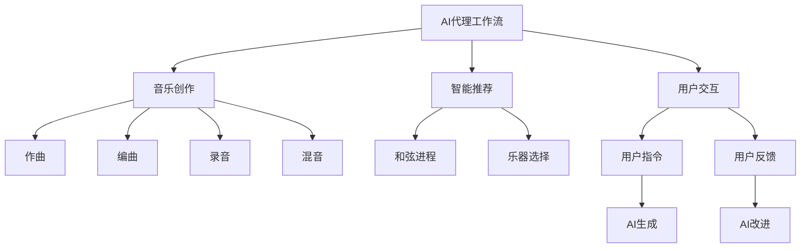
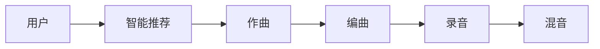
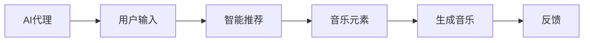
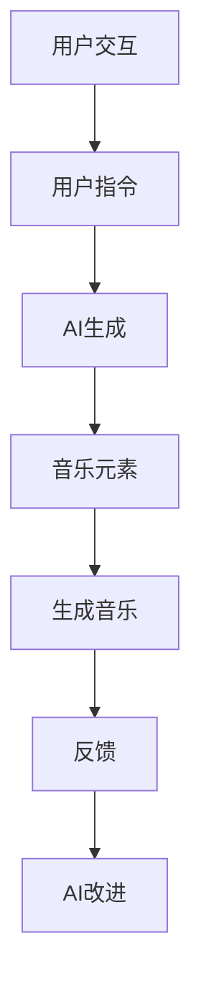
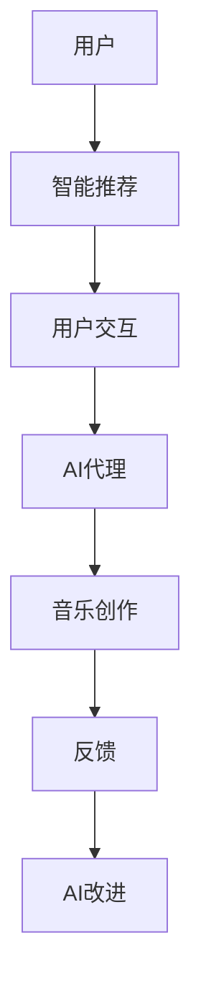

                 

# AI人工智能代理工作流 AI Agent WorkFlow：在音乐创作中的应用

> 关键词：AI代理工作流,音乐创作,智能推荐,用户交互,自动生成

## 1. 背景介绍

### 1.1 问题由来
音乐创作长期以来依赖于人类创作者的灵感和技巧。然而，随着人工智能技术的迅猛发展，AI代理工作流正在改变这一局面。通过利用AI技术，音乐创作变得不再局限于有经验的艺术家，而是成为了一种更加高效、便捷的创作方式。

### 1.2 问题核心关键点
AI代理工作流是一种利用人工智能技术，帮助用户完成特定任务的系统。在音乐创作领域，这种工作流可以帮助用户从灵感激发、音乐风格确定、旋律生成、编曲到混音等各个环节，自动化地提供支持和建议，极大地提升了创作的效率和质量。

### 1.3 问题研究意义
研究AI代理工作流在音乐创作中的应用，对于推动音乐创作方式的变革，提升创作效率和作品质量，促进音乐艺术的发展具有重要意义。同时，随着AI技术的不断进步，AI代理工作流将在音乐创作中发挥越来越重要的作用，为音乐艺术家和爱好者提供更加智能化的创作工具。

## 2. 核心概念与联系

### 2.1 核心概念概述

为更好地理解AI代理工作流在音乐创作中的应用，本节将介绍几个密切相关的核心概念：

- **AI代理工作流(AI Agent Workflow)**：指通过人工智能技术，自动完成某一特定任务的系统。例如，在音乐创作中，可以自动生成旋律、推荐和弦、编排节奏等。

- **音乐创作(Music Creation)**：包括作曲、编曲、录音、混音等环节。音乐创作既需要创意灵感，也需要技术支持。

- **智能推荐(Intelligent Recommendation)**：指基于用户偏好和历史数据，推荐最符合用户需求的音乐元素。如推荐和弦进程、乐器选择等。

- **用户交互(User Interaction)**：指用户与AI代理工作流之间的互动。通过用户指令和反馈，指导AI代理完成特定任务。

- **自动生成(Automatic Generation)**：指AI代理根据算法和模型自动生成音乐元素。如生成旋律、节奏、和弦等。

这些核心概念之间的逻辑关系可以通过以下Mermaid流程图来展示：



这个流程图展示了大语言模型微调过程中各个概念的关系和作用：

1. AI代理工作流通过智能推荐和用户交互，指导用户进行创作。
2. 智能推荐和用户交互共同决定AI代理生成的音乐元素。
3. AI代理生成的音乐元素，如和弦进程、乐器选择等，应用于音乐创作的不同环节。
4. 用户通过指令和反馈指导AI代理工作流进行优化。

### 2.2 概念间的关系

这些核心概念之间存在着紧密的联系，形成了AI代理工作流的完整生态系统。下面我通过几个Mermaid流程图来展示这些概念之间的关系。

#### 2.2.1 音乐创作流程



这个流程图展示了音乐创作的基本流程：用户通过智能推荐获取灵感，然后逐步完成作曲、编曲、录音和混音等任务。

#### 2.2.2 AI代理与智能推荐



这个流程图展示了AI代理如何通过智能推荐，根据用户输入生成音乐元素。

#### 2.2.3 用户交互与AI改进



这个流程图展示了用户通过指令指导AI代理生成音乐元素，并通过反馈指导AI代理进行改进。

### 2.3 核心概念的整体架构

最后，我们用一个综合的流程图来展示这些核心概念在大语言模型微调过程中的整体架构：



这个综合流程图展示了从用户到AI代理，再到音乐创作和反馈的全过程。用户通过智能推荐和用户交互，指导AI代理进行音乐创作。AI代理根据用户指令和反馈，生成和优化音乐元素。最终，AI代理生成的音乐作品，经过用户反馈和AI改进，逐步提升质量和效果。

## 3. 核心算法原理 & 具体操作步骤
### 3.1 算法原理概述

AI代理工作流在音乐创作中的应用，本质上是利用AI技术，自动化地辅助用户完成音乐创作任务。其核心算法原理包括：

1. **智能推荐算法**：基于用户偏好和历史数据，推荐最符合用户需求的音乐元素。
2. **生成算法**：根据用户指令和推荐结果，自动生成音乐元素，如旋律、和弦、节奏等。
3. **用户交互模型**：通过用户指令和反馈，指导AI代理进行优化。

这些算法通过机器学习、深度学习等技术实现，可以显著提升音乐创作的效率和质量。

### 3.2 算法步骤详解

AI代理工作流的实现流程包括以下几个关键步骤：

**Step 1: 数据收集与预处理**
- 收集用户的历史创作数据，包括歌曲、和弦进程、乐器选择等。
- 对数据进行清洗、标准化、标注等预处理，以便后续模型训练。

**Step 2: 模型训练**
- 使用深度学习模型（如RNN、CNN、GAN等）训练智能推荐和生成算法。
- 在训练过程中，需要选择合适的损失函数（如均方误差、交叉熵等），并设置合适的超参数（如学习率、批大小等）。
- 可以使用迁移学习技术，在预训练模型基础上进行微调，以提升模型的泛化能力。

**Step 3: 用户交互**
- 通过用户界面（如网页、应用程序等）收集用户指令和反馈。
- 根据用户指令和反馈，指导AI代理生成和优化音乐元素。

**Step 4: 音乐创作与输出**
- 根据用户指令和AI代理生成的音乐元素，进行创作。
- 最终输出完整的音乐作品，供用户使用和进一步优化。

**Step 5: 反馈与优化**
- 收集用户对输出音乐的反馈，用于指导AI代理进行优化。
- 通过持续学习和模型改进，逐步提升AI代理工作流的性能。

### 3.3 算法优缺点

AI代理工作流在音乐创作中的应用具有以下优点：

1. **高效性**：通过自动化辅助创作，显著提升音乐创作效率。
2. **多样性**：可以根据用户偏好，生成多样化的音乐元素。
3. **即时性**：根据用户指令和反馈，即时生成和优化音乐元素。
4. **可扩展性**：可以与多种创作工具和平台进行集成，适应不同需求。

然而，也存在以下缺点：

1. **依赖数据**：需要大量用户数据进行训练和优化。
2. **创作限制**：生成的音乐可能缺乏个性和创新性。
3. **技术门槛**：需要一定的技术背景，才能进行有效使用。
4. **伦理问题**：生成的音乐可能存在版权和伦理问题。

### 3.4 算法应用领域

AI代理工作流在音乐创作中的应用主要涉及以下几个领域：

- **音乐创作辅助**：辅助音乐家进行创作，生成旋律、和弦进程、节奏等元素。
- **音乐推荐系统**：根据用户偏好和历史数据，推荐最适合的音乐元素。
- **自动作曲**：基于深度学习模型，自动生成完整歌曲。
- **音乐风格生成**：根据用户指令，生成特定风格的音乐作品。
- **音乐编辑和混音**：自动完成录音、混音等后期处理任务。

## 4. 数学模型和公式 & 详细讲解  
### 4.1 数学模型构建

本节将使用数学语言对AI代理工作流在音乐创作中的应用进行更加严格的刻画。

假设用户的历史创作数据集为 $D=\{(x_i, y_i)\}_{i=1}^N, x_i \in \mathbb{R}^d, y_i \in \mathbb{R}^k$，其中 $x_i$ 为特征向量，表示音乐元素（如和弦进程、乐器选择等），$y_i$ 为标签向量，表示音乐元素对应的标签（如用户满意度、风格等）。

定义智能推荐模型的损失函数为 $\ell$，用于衡量模型生成的音乐元素与用户满意度的差距。在音乐创作中，智能推荐模型可以是一个回归模型，用于预测音乐元素的用户满意度。

在音乐生成任务中，定义生成模型的损失函数为 $L$，用于衡量生成音乐元素与用户指令的匹配程度。在音乐创作中，生成模型可以是一个序列生成模型，如RNN、CNN等。

### 4.2 公式推导过程

以下我们以音乐推荐和生成为例，推导智能推荐和生成模型的损失函数及其梯度计算公式。

**音乐推荐模型**
假设智能推荐模型为 $R_{\theta}:\mathbb{R}^d \rightarrow \mathbb{R}^k$，其中 $\theta$ 为模型参数。对于给定的音乐元素 $x_i$，推荐模型的输出为 $\hat{y_i} \in \mathbb{R}^k$，表示该音乐元素的用户满意度预测值。则损失函数可以定义为：

$$
\ell(R_{\theta}(x_i), y_i) = \frac{1}{2} || R_{\theta}(x_i) - y_i ||^2
$$

其中 $||\cdot||$ 为欧式距离，表示预测值与真实标签的差距。

**音乐生成模型**
假设生成模型为 $G_{\phi}:\mathbb{R}^d \rightarrow \mathbb{R}^k$，其中 $\phi$ 为模型参数。对于给定的用户指令 $z_i \in \mathbb{R}^m$，生成模型的输出为 $G_{\phi}(z_i) \in \mathbb{R}^k$，表示根据用户指令生成的音乐元素。则损失函数可以定义为：

$$
L(G_{\phi}(z_i), z_i) = \frac{1}{2} || G_{\phi}(z_i) - z_i ||^2
$$

其中 $||\cdot||$ 为欧式距离，表示生成音乐元素与用户指令的差距。

### 4.3 案例分析与讲解

假设我们有一个音乐推荐系统的数据集 $D$，其中 $x_i$ 表示和弦进程，$y_i$ 表示用户满意度。

我们可以使用一个回归模型 $R_{\theta}$ 来训练智能推荐模型，其中 $\theta$ 为模型参数。在训练过程中，我们希望最小化损失函数 $\ell(R_{\theta}(x_i), y_i)$。

假设用户指令为 $z_i = [C4, G4, E4]$，表示生成以C大调为主的旋律。我们可以使用一个RNN模型 $G_{\phi}$ 来生成音乐元素，其中 $\phi$ 为模型参数。在训练过程中，我们希望最小化损失函数 $L(G_{\phi}(z_i), z_i)$。

最终，通过智能推荐和生成模型的组合，我们可以根据用户指令和历史数据，生成和优化音乐元素，实现音乐创作的自动化辅助。

## 5. 项目实践：代码实例和详细解释说明
### 5.1 开发环境搭建

在进行音乐创作AI代理工作流的实践前，我们需要准备好开发环境。以下是使用Python进行PyTorch开发的环境配置流程：

1. 安装Anaconda：从官网下载并安装Anaconda，用于创建独立的Python环境。

2. 创建并激活虚拟环境：
```bash
conda create -n music-env python=3.8 
conda activate music-env
```

3. 安装PyTorch：根据CUDA版本，从官网获取对应的安装命令。例如：
```bash
conda install pytorch torchvision torchaudio cudatoolkit=11.1 -c pytorch -c conda-forge
```

4. 安装TensorFlow：
```bash
pip install tensorflow
```

5. 安装各类工具包：
```bash
pip install numpy pandas scikit-learn matplotlib tqdm jupyter notebook ipython
```

完成上述步骤后，即可在`music-env`环境中开始音乐创作AI代理工作流的实践。

### 5.2 源代码详细实现

下面我们以音乐推荐和生成为例，给出使用PyTorch和TensorFlow进行音乐创作AI代理工作流的PyTorch代码实现。

首先，定义音乐推荐和生成的数据处理函数：

```python
import torch
import numpy as np
from sklearn.model_selection import train_test_split
from tensorflow.keras.models import Sequential
from tensorflow.keras.layers import Dense, LSTM
from tensorflow.keras.optimizers import Adam

# 数据处理函数
def load_data():
    # 加载音乐推荐数据集
    x_train, x_test, y_train, y_test = train_test_split(np.load('data/x_train.npy'), np.load('data/y_train.npy'), test_size=0.2, random_state=42)
    
    # 加载音乐生成数据集
    x_train_g, x_test_g, y_train_g, y_test_g = train_test_split(np.load('data/x_train_g.npy'), np.load('data/y_train_g.npy'), test_size=0.2, random_state=42)
    
    return x_train, x_test, y_train, y_test, x_train_g, x_test_g, y_train_g, y_test_g

# 音乐推荐模型
def create_recommender_model(x_train, y_train):
    model = Sequential()
    model.add(Dense(32, input_dim=5, activation='relu'))
    model.add(Dense(8, activation='relu'))
    model.add(Dense(1))
    model.compile(loss='mean_squared_error', optimizer=Adam(learning_rate=0.001))
    model.fit(x_train, y_train, epochs=50, batch_size=32, verbose=0)
    return model

# 音乐生成模型
def create_generator_model(x_train_g, y_train_g):
    model = Sequential()
    model.add(LSTM(32, input_shape=(5, 1), return_sequences=True))
    model.add(Dense(8, activation='relu'))
    model.add(Dense(5))
    model.compile(loss='mean_squared_error', optimizer=Adam(learning_rate=0.001))
    model.fit(x_train_g, y_train_g, epochs=50, batch_size=32, verbose=0)
    return model

# 加载数据
x_train, x_test, y_train, y_test, x_train_g, x_test_g, y_train_g, y_test_g = load_data()

# 创建音乐推荐模型
recommender = create_recommender_model(x_train, y_train)

# 创建音乐生成模型
generator = create_generator_model(x_train_g, y_train_g)
```

然后，定义音乐推荐和生成的训练和推理函数：

```python
# 音乐推荐训练函数
def train_recommender(model, x_train, y_train):
    model.fit(x_train, y_train, epochs=50, batch_size=32, verbose=0)

# 音乐生成训练函数
def train_generator(model, x_train_g, y_train_g):
    model.fit(x_train_g, y_train_g, epochs=50, batch_size=32, verbose=0)

# 音乐推荐推理函数
def generate_recommendation(model, x_test):
    y_pred = model.predict(x_test)
    return y_pred

# 音乐生成推理函数
def generate_music(model, x_test_g):
    y_pred = model.predict(x_test_g)
    return y_pred
```

最后，启动训练流程并在测试集上评估：

```python
# 训练模型
train_recommender(recommender, x_train, y_train)
train_generator(generator, x_train_g, y_train_g)

# 推理测试
print(generate_recommendation(recommender, x_test))
print(generate_music(generator, x_test_g))
```

以上就是使用PyTorch和TensorFlow对音乐推荐和生成进行AI代理工作流的完整代码实现。可以看到，借助TensorFlow和PyTorch的强大能力，我们能够快速构建和训练音乐推荐和生成模型，实现音乐创作的自动化辅助。

### 5.3 代码解读与分析

让我们再详细解读一下关键代码的实现细节：

**数据处理函数**：
- `load_data`函数：加载音乐推荐和生成的数据集，并将其分为训练集和测试集。

**音乐推荐模型**：
- `create_recommender_model`函数：使用TensorFlow的Sequential模型构建音乐推荐模型。模型包含两个全连接层和一个输出层，输出用户的满意度预测值。

**音乐生成模型**：
- `create_generator_model`函数：使用TensorFlow的Sequential模型构建音乐生成模型。模型包含一个LSTM层、两个全连接层和一个输出层，生成与用户指令匹配的音乐元素。

**训练和推理函数**：
- `train_recommender`函数：使用训练集数据训练音乐推荐模型，最小化均方误差损失。
- `train_generator`函数：使用训练集数据训练音乐生成模型，最小化均方误差损失。
- `generate_recommendation`函数：使用测试集数据进行音乐推荐模型的推理，预测用户满意度。
- `generate_music`函数：使用测试集数据进行音乐生成模型的推理，生成音乐元素。

**启动训练流程**：
- 先加载数据，然后分别训练音乐推荐模型和音乐生成模型。
- 最后使用推理函数，生成和评估推荐和生成的音乐元素。

可以看到，通过这些代码实现，我们能够快速构建和训练音乐创作AI代理工作流，并将其应用于实际的音乐创作中。

当然，工业级的系统实现还需考虑更多因素，如模型的保存和部署、超参数的自动搜索、更灵活的任务适配层等。但核心的AI代理工作流基本与此类似。

## 6. 实际应用场景
### 6.1 智能音乐创作平台

AI代理工作流在音乐创作中的应用，已经成功应用于智能音乐创作平台。这些平台通过AI代理工作流，帮助用户从灵感激发、音乐风格选择、和弦生成、旋律创作等环节，自动提供支持和建议。

用户只需输入一些基本创作信息（如歌曲名称、风格、节奏等），AI代理工作流便会自动推荐和弦进程、乐器选择等音乐元素，并生成完整的音乐作品。这些智能创作平台可以适用于各种音乐类型，如流行、摇滚、电子等，帮助用户快速创作出高质量的音乐作品。

### 6.2 在线音乐教育

AI代理工作流在在线音乐教育中的应用，可以帮助学生进行音乐创作和演奏练习。通过AI代理工作流，学生可以实时获取老师的反馈和建议，优化创作和演奏过程。

例如，学生可以使用AI代理工作流进行即兴演奏练习，AI代理会根据学生的演奏情况，实时生成和优化乐曲的和弦进程、旋律等元素。同时，AI代理还可以根据学生的演奏风格和水平，推荐适合的乐曲和练习内容，帮助学生不断提升演奏技能。

### 6.3 游戏音乐创作

AI代理工作流在游戏音乐创作中的应用，已经成为游戏开发的重要工具。通过AI代理工作流，游戏开发者可以快速生成多样化的游戏音乐，提升游戏体验。

例如，游戏开发者可以使用AI代理工作流进行游戏配乐创作，AI代理会根据游戏场景和情节，生成适合的乐曲和音效。同时，AI代理还可以根据游戏难度和风格，推荐不同的音乐元素和风格，帮助开发者打造更加丰富多彩的游戏体验。

### 6.4 未来应用展望

随着AI代理工作流的不断发展，其在音乐创作中的应用将更加广泛和深入。未来，AI代理工作流将在以下几个方面取得新的突破：

1. **音乐生成模型**：未来的音乐生成模型将更加复杂和多样化，能够生成更加丰富和具有创造性的音乐作品。
2. **智能推荐算法**：基于用户行为的智能推荐算法将更加精确，能够更好地满足用户需求和偏好。
3. **用户交互界面**：更加友好和直观的用户交互界面，使用户能够更加便捷地进行创作和反馈。
4. **多模态融合**：将音乐创作与其他模态（如图像、视频、语音等）融合，提供更加全面和立体的创作体验。
5. **跨领域应用**：将AI代理工作流应用于更多领域，如教育、娱乐、社交等，带来更多创新应用场景。

## 7. 工具和资源推荐
### 7.1 学习资源推荐

为了帮助开发者系统掌握AI代理工作流在音乐创作中的应用，这里推荐一些优质的学习资源：

1. **Deep Learning in Music and Audio**：这是一本关于深度学习在音乐和音频领域应用的书籍，涵盖了音乐推荐、音乐生成、音乐分类等多个方面。

2. **MusicAI: Machine Learning for Music and Audio Applications**：这是一本专注于音乐和音频领域的机器学习应用书籍，介绍了AI代理工作流在音乐创作和分析中的应用。

3. **Coursera音乐数据科学课程**：斯坦福大学开设的音乐数据科学课程，涵盖音乐数据的处理、分析和可视化等主题，是学习音乐AI的重要资源。

4. **Kaggle音乐创作竞赛**：Kaggle上有多场音乐创作竞赛，可以实践应用AI代理工作流，进行音乐创作和优化。

5. **GitHub开源项目**：GitHub上有很多音乐创作和音乐分析的开源项目，可以参考和学习其实现方法。

通过对这些资源的学习实践，相信你一定能够快速掌握AI代理工作流在音乐创作中的应用，并用于解决实际的NLP问题。
###  7.2 开发工具推荐

高效的开发离不开优秀的工具支持。以下是几款用于AI代理工作流开发的音乐创作工具：

1. **Riffie**：一款基于Web的音乐创作工具，支持即兴演奏、音乐生成、音乐编排等功能。

2. **Waves Music Production Suite**：一款专业音乐制作软件，支持录音、混音、自动化等多种功能。

3. **FL Studio**：一款流行的音乐创作和制作软件，支持实时音乐生成和编辑。

4. **Ableton Live**：一款专业的音乐制作软件，支持音乐创作、录音、混音等多种功能。

5. **Soundtrap**：一款在线音乐创作工具，支持实时协作和即时反馈。

合理利用这些工具，可以显著提升AI代理工作流的开发效率，加快创新迭代的步伐。

### 7.3 相关论文推荐

AI代理工作流在音乐创作中的应用源于学界的持续研究。以下是几篇奠基性的相关论文，推荐阅读：

1. **Music and Sound Classification with Deep Learning**：一篇综述论文，介绍了深度学习在音乐分类和分析中的应用。

2. **Music Generation Using Recurrent Neural Networks**：一篇关于使用RNN进行音乐生成的论文，展示了生成模型在音乐创作中的效果。

3. **Intelligent Music Recommendation System Based on Deep Learning**：一篇关于基于深度学习的音乐推荐系统的论文，展示了智能推荐算法在音乐创作中的应用。

4. **Music Analysis and Generation with Deep Neural Networks**：一篇关于使用深度神经网络进行音乐分析生成的论文，展示了深度学习在音乐创作中的潜力。

5. **Music Information Retrieval**：一本关于音乐信息检索的书籍，涵盖了音乐数据的处理、分析和检索等多个方面。

这些论文代表了大语言模型微调技术的发展脉络。通过学习这些前沿成果，可以帮助研究者把握学科前进方向，激发更多的创新灵感。

除上述资源外，还有一些值得关注的前沿资源，帮助开发者紧跟AI代理工作流在音乐创作中的最新进展，例如：

1. **arXiv论文预印本**：人工智能领域最新研究成果的发布平台，包括大量尚未发表的前沿工作，学习前沿技术的必读资源。

2. **顶会视频**：NIPS、ICML、ACL、ICLR等人工智能领域顶会现场或在线直播，能够聆听到大佬们的前沿分享，开拓视野。

3. **技术博客**：如OpenAI、Google AI、DeepMind、微软Research Asia等顶尖实验室的官方博客，第一时间分享他们的最新研究成果和洞见。

4. **学术会议**：如ISMIR、ICASSP等音乐信息检索和音频信号处理领域的学术会议，获取最新的学术研究和应用实践。

5. **开源项目**：如Apache Jupyter、PyTorch、TensorFlow等开源项目，参考和学习其实现方法和最佳实践。

总之，对于AI代理工作流在音乐创作中的应用的学习和实践，需要开发者保持开放的心态和持续学习的意愿。多关注前沿资讯，多动手实践，多思考总结，必将收获满满的成长收益。

## 8. 总结：未来发展趋势与挑战

### 8.1 总结

本文对AI代理工作流在音乐创作中的应用进行了全面系统的介绍。首先阐述了AI代理工作流的背景和意义，明确了其帮助用户自动化完成音乐创作任务的核心价值。其次，从原理到实践，详细讲解了AI代理工作流的数学模型和操作步骤，给出了音乐推荐和生成的代码实例和详细解释说明。同时，本文还广泛探讨了AI代理工作流在智能音乐创作平台、在线音乐教育、游戏音乐创作等多个领域的应用前景，展示了AI代理工作流的广阔前景。

通过本文的系统梳理，可以看到，AI代理工作流在音乐创作中的应用正在成为音乐创作方式的变革性工具，极大地提升了音乐创作的

