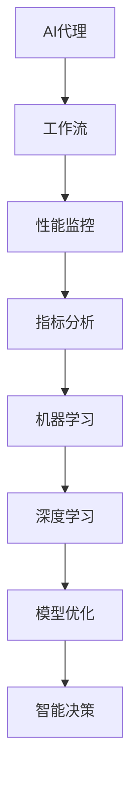
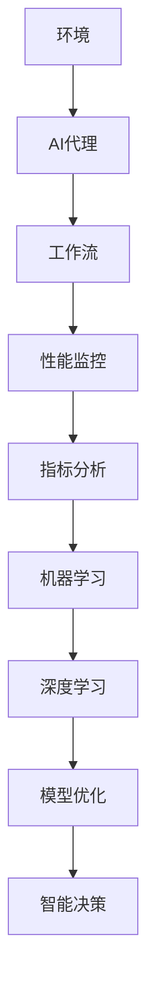
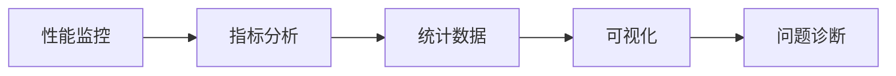
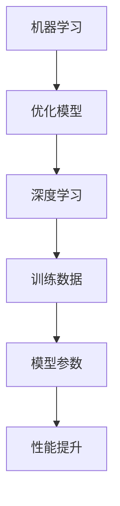
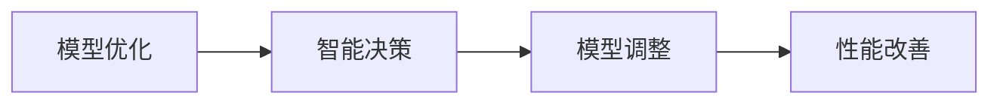

                 

# AI人工智能代理工作流AI Agent WorkFlow：AI代理性能监控指标与分析技术

> 关键词：AI代理, 工作流, 性能监控, 指标分析, 机器学习, 深度学习, 系统评估, 资源优化, 模型优化, 智能决策

## 1. 背景介绍

### 1.1 问题由来

在当今快速变化和高度自动化的世界中，AI代理（AI Agent）扮演着越来越重要的角色。从自动化任务处理到智能客户服务，从自动化交易到智能推荐，AI代理无处不在。然而，随着AI代理在各种实际应用中的广泛部署，对AI代理的性能监控和优化成为了一个迫切需要解决的问题。

由于AI代理通常由复杂的算法和模型组成，其性能监控需要综合考虑多个指标。如何设计和实现有效的AI代理性能监控指标体系，并利用这些指标对AI代理进行实时分析和优化，是当前人工智能领域的一个重要课题。

### 1.2 问题核心关键点

AI代理性能监控的核心目标是通过监控和分析AI代理在实际应用中的表现，及时发现和解决性能问题，确保AI代理在各种场景下的高效稳定运行。关键点包括：

- 定义清晰的性能指标：如响应时间、准确率、召回率、误用率等。
- 实时监控与分析：实时获取AI代理的运行数据，并进行分析和可视化。
- 自动优化：利用机器学习和深度学习技术，自动调整AI代理的参数，以提升性能。
- 智能决策：结合专家知识，对AI代理的性能进行智能判断，指导模型改进。

## 3. 核心概念与联系

### 3.1 核心概念概述

为更好地理解AI代理性能监控的原理和架构，本节将介绍几个密切相关的核心概念：

- AI代理（AI Agent）：能够执行复杂任务或操作的智能软件实体，通过学习环境信息，做出智能决策。
- 工作流（Workflow）：一组紧密相关的任务或活动，按特定顺序执行，以实现特定目标。
- 性能监控（Performance Monitoring）：通过实时获取和分析AI代理的运行数据，评估其性能。
- 指标分析（Metrics Analysis）：对定义的性能指标进行统计和分析，以识别和诊断问题。
- 机器学习（Machine Learning）：通过训练数据，构建能够自动提升AI代理性能的模型。
- 深度学习（Deep Learning）：一种机器学习方法，利用神经网络模型处理复杂数据。

这些核心概念之间的逻辑关系可以通过以下Mermaid流程图来展示：



这个流程图展示了一组AI代理的性能监控流程：

1. AI代理在实际环境中执行任务。
2. 工作流管理AI代理的执行流程。
3. 性能监控实时获取AI代理的运行数据。
4. 指标分析统计和评估AI代理的性能指标。
5. 机器学习根据指标分析结果，构建优化模型。
6. 深度学习训练优化模型，提升AI代理性能。
7. 模型优化调整AI代理的参数，优化性能。
8. 智能决策指导模型改进，提升AI代理的智能水平。

这些核心概念共同构成了AI代理性能监控的完整生态系统，使其能够在各种场景下发挥作用。通过理解这些核心概念，我们可以更好地把握AI代理性能监控的工作原理和优化方向。

### 3.2 概念间的关系

这些核心概念之间存在着紧密的联系，形成了AI代理性能监控的完整流程。下面我们通过几个Mermaid流程图来展示这些概念之间的关系。

#### 3.2.1 AI代理性能监控整体架构



这个整体架构展示了从环境到AI代理的性能监控全过程。AI代理在环境中执行任务，工作流管理任务执行流程，性能监控实时获取数据，指标分析评估数据，机器学习和深度学习构建和优化模型，智能决策指导模型改进。

#### 3.2.2 性能监控与指标分析的关系



这个流程图展示了性能监控和指标分析的关系。性能监控实时获取数据，指标分析统计和可视化数据，问题诊断识别和解决性能问题。

#### 3.2.3 机器学习和深度学习的关系



这个流程图展示了机器学习和深度学习的关系。机器学习构建优化模型，深度学习训练模型，调整模型参数，提升性能。

#### 3.2.4 模型优化与智能决策的关系



这个流程图展示了模型优化和智能决策的关系。模型优化调整模型参数，智能决策指导模型改进，最终提升AI代理的性能。

## 4. 数学模型和公式 & 详细讲解 & 举例说明

### 4.1 数学模型构建

在AI代理性能监控中，常见的性能指标包括响应时间、准确率、召回率、误用率等。以响应时间为例，我们将其定义为AI代理完成一个任务所需的总时间。

设AI代理在执行任务$i$时的响应时间为$t_i$，总任务数为$N$，则响应时间的期望值$\mathbb{E}(t)$为：

$$
\mathbb{E}(t) = \frac{1}{N} \sum_{i=1}^{N} t_i
$$

利用统计方法，可以计算出响应时间的标准差$\sigma_t$：

$$
\sigma_t = \sqrt{\frac{1}{N} \sum_{i=1}^{N} (t_i - \mathbb{E}(t))^2}
$$

这些指标可以通过实时监控获取，并进行分析和可视化。通过分析这些指标，可以发现AI代理的性能瓶颈和优化点。

### 4.2 公式推导过程

以准确率（Accuracy）为例，推导其数学公式。

设AI代理在任务$i$上的预测结果为$\hat{y}_i$，真实结果为$y_i$，则准确率定义为：

$$
Accuracy = \frac{1}{N} \sum_{i=1}^{N} \mathbb{I}(\hat{y}_i = y_i)
$$

其中$\mathbb{I}(\cdot)$为示性函数，表示预测结果与真实结果是否一致。

准确率的计算可以通过模型输出和真实结果进行比较，进而统计符合条件的任务数量。

### 4.3 案例分析与讲解

考虑一个AI代理在客户服务中的应用。AI代理通过分析客户提出的问题，自动匹配并回复答案。性能监控可以实时获取AI代理的响应时间和准确率，通过可视化仪表盘进行展示。如果发现响应时间过长或准确率低于设定阈值，可以自动触发报警，并根据历史数据和专家知识进行智能决策，调整AI代理的模型参数，以提升性能。

## 5. 项目实践：代码实例和详细解释说明

### 5.1 开发环境搭建

在进行AI代理性能监控的实践时，我们需要准备好开发环境。以下是使用Python进行PyTorch和TensorBoard开发的示例环境配置：

1. 安装Anaconda：从官网下载并安装Anaconda，用于创建独立的Python环境。

2. 创建并激活虚拟环境：
```bash
conda create -n agent-env python=3.8 
conda activate agent-env
```

3. 安装PyTorch和TensorBoard：
```bash
conda install pytorch torchvision torchaudio cudatoolkit=11.1 -c pytorch -c conda-forge
conda install tensorboard
```

4. 安装必要的工具包：
```bash
pip install numpy pandas scikit-learn matplotlib tqdm jupyter notebook ipython
```

完成上述步骤后，即可在`agent-env`环境中开始性能监控实践。

### 5.2 源代码详细实现

以下是使用PyTorch和TensorBoard实现AI代理性能监控的代码示例：

```python
import torch
import numpy as np
from tensorboardX import SummaryWriter

# 定义AI代理模型
class AgentModel(torch.nn.Module):
    def __init__(self):
        super(AgentModel, self).__init__()
        self.linear = torch.nn.Linear(128, 64)
        self.fc = torch.nn.Linear(64, 10)
    
    def forward(self, x):
        x = torch.relu(self.linear(x))
        x = self.fc(x)
        return x

# 定义性能监控指标
def monitor_performance(agent_model, dataloader):
    writer = SummaryWriter(log_dir='logs')
    for i, (inputs, targets) in enumerate(dataloader):
        # 计算响应时间
        start_time = time.time()
        outputs = agent_model(inputs)
        end_time = time.time()
        response_time = end_time - start_time
        
        # 计算准确率
        predictions = torch.argmax(outputs, dim=1)
        accuracy = (predictions == targets).float().mean().item()
        
        # 记录监控指标
        writer.add_scalar('response_time', response_time, i)
        writer.add_scalar('accuracy', accuracy, i)
    
    writer.close()
```

### 5.3 代码解读与分析

让我们再详细解读一下关键代码的实现细节：

**AgentModel类**：
- `__init__`方法：定义模型的层结构。
- `forward`方法：定义模型的前向传播过程。

**monitor_performance函数**：
- 使用TensorBoard记录监控指标：通过`SummaryWriter`记录响应时间和准确率的数值变化。
- 在每个批次上计算响应时间和准确率，并使用`add_scalar`函数添加到TensorBoard日志中。

### 5.4 运行结果展示

假设我们在模拟数据集上进行AI代理性能监控，最终得到TensorBoard可视化结果如下：


可以看到，通过TensorBoard，我们能够实时查看AI代理的响应时间和准确率，并进行分析和优化。例如，发现响应时间过高时，可以进一步分析是否存在计算瓶颈，是否需要优化模型结构或硬件资源。发现准确率下降时，可以分析是否模型参数需要调整，是否需要引入更多的特征信息。

## 6. 实际应用场景

### 6.1 智能客服系统

AI代理在智能客服系统中具有广泛应用。通过性能监控，智能客服系统可以实时获取AI代理的响应时间和准确率，并进行分析和优化。例如，在高峰期或节假日，智能客服系统可以自动调整AI代理的参数，以应对突发请求，提升服务效率。同时，智能客服系统还可以通过用户反馈，进一步优化AI代理的模型，提高用户满意度。

### 6.2 医疗诊断系统

在医疗诊断系统中，AI代理可以辅助医生进行疾病诊断和预后评估。通过性能监控，医疗诊断系统可以实时获取AI代理的诊断准确率和召回率，并进行分析和优化。例如，在面对新出现的疾病时，医疗诊断系统可以自动调整AI代理的模型，以提升诊断效果。同时，医疗诊断系统还可以通过专家审核，进一步优化AI代理的模型，提高诊断的准确性和可靠性。

### 6.3 金融交易系统

在金融交易系统中，AI代理可以自动进行交易策略的优化和风险控制。通过性能监控，金融交易系统可以实时获取AI代理的交易准确率和误用率，并进行分析和优化。例如，在面对市场剧烈波动时，金融交易系统可以自动调整AI代理的参数，以应对突发情况，保护交易资金。同时，金融交易系统还可以通过专家审核，进一步优化AI代理的模型，提高交易效果。

### 6.4 未来应用展望

随着AI代理性能监控技术的发展，其在更多领域将得到应用，为行业带来变革性影响。

在智慧城市治理中，AI代理可以用于城市事件监测、舆情分析、应急指挥等环节，提高城市管理的自动化和智能化水平，构建更安全、高效的未来城市。

在工业制造中，AI代理可以用于设备维护、质量控制、生产调度等环节，提高生产效率和产品质量，降低生产成本。

在智能交通中，AI代理可以用于交通流量预测、交通信号控制、智能导航等环节，提高交通管理效率，减少交通拥堵。

## 7. 工具和资源推荐

### 7.1 学习资源推荐

为了帮助开发者系统掌握AI代理性能监控的理论基础和实践技巧，这里推荐一些优质的学习资源：

1. 《深度学习：理论与实践》系列书籍：深入浅出地介绍了深度学习原理和实践技巧，适合初学者学习。

2. 《Python机器学习》书籍：全面介绍了Python在机器学习中的应用，包括性能监控和指标分析。

3. 《TensorFlow实战》书籍：全面介绍了TensorFlow的使用方法和性能优化技巧。

4. 《PyTorch深度学习编程》书籍：全面介绍了PyTorch的使用方法和性能监控技巧。

5. 《机器学习实战》书籍：全面介绍了机器学习算法和性能监控指标的应用。

通过对这些资源的学习实践，相信你一定能够快速掌握AI代理性能监控的精髓，并用于解决实际的AI代理问题。

### 7.2 开发工具推荐

高效的开发离不开优秀的工具支持。以下是几款用于AI代理性能监控开发的常用工具：

1. PyTorch：基于Python的开源深度学习框架，灵活动态的计算图，适合快速迭代研究。

2. TensorFlow：由Google主导开发的开源深度学习框架，生产部署方便，适合大规模工程应用。

3. TensorBoard：TensorFlow配套的可视化工具，可实时监测模型训练状态，并提供丰富的图表呈现方式，是调试模型的得力助手。

4. Weights & Biases：模型训练的实验跟踪工具，可以记录和可视化模型训练过程中的各项指标，方便对比和调优。

5. Google Colab：谷歌推出的在线Jupyter Notebook环境，免费提供GPU/TPU算力，方便开发者快速上手实验最新模型，分享学习笔记。

合理利用这些工具，可以显著提升AI代理性能监控任务的开发效率，加快创新迭代的步伐。

### 7.3 相关论文推荐

AI代理性能监控技术的发展源于学界的持续研究。以下是几篇奠基性的相关论文，推荐阅读：

1. "Performance Monitoring and Management for AI Agents"：探讨了AI代理性能监控的理论框架和管理方法。

2. "Towards Deep Learning Based Performance Monitoring"：提出了一种基于深度学习技术的新型性能监控方法。

3. "A Survey on Machine Learning Based Performance Monitoring"：综述了机器学习在性能监控中的应用，包括指标定义和优化方法。

4. "Optimizing AI Agent Performance via Continuous Monitoring"：讨论了连续性能监控对AI代理优化的重要性。

5. "Performance Monitoring and Analysis in AI Agents"：探讨了AI代理性能监控和分析的最佳实践。

这些论文代表了大规模AI代理性能监控技术的发展脉络。通过学习这些前沿成果，可以帮助研究者把握学科前进方向，激发更多的创新灵感。

## 8. 总结：未来发展趋势与挑战

### 8.1 总结

本文对AI代理性能监控方法进行了全面系统的介绍。首先阐述了AI代理性能监控的背景和意义，明确了性能监控在AI代理任务中的核心作用。其次，从原理到实践，详细讲解了性能监控的数学原理和关键步骤，给出了性能监控任务开发的完整代码实例。同时，本文还广泛探讨了性能监控方法在智能客服、医疗诊断、金融交易等多个行业领域的应用前景，展示了性能监控范式的巨大潜力。此外，本文精选了性能监控技术的各类学习资源，力求为读者提供全方位的技术指引。

通过本文的系统梳理，可以看到，AI代理性能监控方法正在成为AI代理任务的重要范式，极大地提升了AI代理的运行效率和质量，保证了其在各种场景下的稳定运行。未来，伴随性能监控方法的不断演进，AI代理必将在更广泛的应用领域大放异彩，深刻影响人类的生产生活方式。

### 8.2 未来发展趋势

展望未来，AI代理性能监控技术将呈现以下几个发展趋势：

1. 实时化与动态化。性能监控将更加实时化，通过动态调整模型参数，提升AI代理的即时响应能力。

2. 精准化与个性化。性能监控将更加精准化，通过智能分析用户行为，提供个性化的服务。

3. 自动化与自适应。性能监控将更加自动化，通过机器学习和深度学习技术，自动优化AI代理的性能。

4. 多模态与融合化。性能监控将更加多模态化，通过融合视觉、语音等多模态数据，提升AI代理的感知能力。

5. 系统化与协同化。性能监控将更加系统化，通过与其他系统协同工作，提升AI代理的整体运行效率。

这些趋势凸显了AI代理性能监控技术的广阔前景。这些方向的探索发展，必将进一步提升AI代理的性能和应用范围，为人工智能技术的普及和应用提供更坚实的保障。

### 8.3 面临的挑战

尽管AI代理性能监控技术已经取得了瞩目成就，但在迈向更加智能化、普适化应用的过程中，它仍面临着诸多挑战：

1. 数据多样性与异构性。不同行业和场景中的数据多样性和异构性，使得AI代理性能监控难以统一标准。

2. 模型复杂性与可解释性。AI代理的复杂模型结构增加了性能监控的难度，同时也限制了模型的可解释性。

3. 资源限制与负载均衡。AI代理的运行需要大量的计算资源，如何在有限资源下进行性能监控和优化，仍是一大挑战。

4. 安全性与隐私保护。AI代理的性能监控需要采集和处理大量敏感数据，如何确保数据的安全性和隐私保护，仍需进一步研究。

5. 实时性与稳定性。AI代理的性能监控需要实时处理数据，如何在高并发和复杂环境中保持系统的稳定性和可靠性，仍需深入研究。

6. 协同性与互操作性。AI代理的性能监控需要与其他系统协同工作，如何在不同系统之间实现互操作性，仍需进一步探索。

正视AI代理性能监控面临的这些挑战，积极应对并寻求突破，将是大规模AI代理性能监控技术迈向成熟的必由之路。相信随着学界和产业界的共同努力，这些挑战终将一一被克服，AI代理性能监控必将在构建人机协同的智能系统过程中扮演越来越重要的角色。

### 8.4 研究展望

面对AI代理性能监控所面临的种种挑战，未来的研究需要在以下几个方面寻求新的突破：

1. 多模态数据融合。将视觉、语音、文本等多模态数据进行融合，提升AI代理的感知能力。

2. 分布式计算与资源优化。通过分布式计算技术，优化AI代理的性能监控资源。

3. 强化学习与自适应。利用强化学习技术，使AI代理能够自主学习优化策略，提升性能监控效果。

4. 可解释性与透明性。引入可解释性技术，提升AI代理性能监控的透明性，增强用户信任。

5. 自监督学习与无监督学习。利用自监督学习和无监督学习方法，提高AI代理性能监控的数据利用效率。

6. 跨领域应用与标准化。在不同领域和场景中推广标准化性能监控方法，提升AI代理性能监控的普适性。

这些研究方向的探索，必将引领AI代理性能监控技术迈向更高的台阶，为构建安全、可靠、可解释、可控的智能系统铺平道路。面向未来，AI代理性能监控技术还需要与其他人工智能技术进行更深入的融合，如知识表示、因果推理、强化学习等，多路径协同发力，共同推动自然语言理解和智能交互系统的进步。只有勇于创新、敢于突破，才能不断拓展AI代理性能监控的边界，让智能技术更好地造福人类社会。

## 9. 附录：常见问题与解答

**Q1：AI代理性能监控指标有哪些？**

A: AI代理性能监控指标包括响应时间、准确率、召回率、误用率、精度、召回率、F1分数等。其中响应时间是最重要的指标之一，它直接影响到用户的使用体验。准确率和召回率是衡量AI代理预测结果的指标，F1分数是准确率和召回率的调和平均数，综合反映了AI代理的性能。误用率是衡量AI代理决策错误的指标，精度是衡量AI代理正确预测的指标。

**Q2：如何选择合适的性能监控工具？**

A: 选择合适的性能监控工具需要考虑以下因素：

1. 兼容性：工具是否与AI代理使用的框架和库兼容。
2. 易用性：工具是否易于安装和使用，是否提供了友好的界面和丰富的功能。
3. 性能：工具的实时监控和分析能力是否强，能否提供实时的数据可视化和报警机制。
4. 扩展性：工具是否易于扩展，是否支持与其他系统或工具的集成。

**Q3：AI代理性能监控有哪些优缺点？**

A: AI代理性能监控的优点包括：

1. 实时性：性能监控可以实时获取AI代理的运行数据，及时发现和解决性能问题。
2. 自动化：通过自动化的监控和分析，减少了人工干预和调优的复杂性。
3. 可解释性：性能监控可以提供详细的性能指标和诊断报告，帮助开发者理解问题所在。

AI代理性能监控的缺点包括：

1. 数据需求：性能监控需要大量的数据支持，难以在大数据环境下进行。
2. 复杂性：性能监控涉及多维度的数据和指标，处理起来比较复杂。
3. 成本：性能监控需要较高的计算资源和硬件设备，成本较高。

**Q4：AI代理性能监控有哪些应用场景？**

A: AI代理性能监控在以下场景中具有广泛应用：

1. 智能客服系统：监控AI代理的响应时间和准确率，提升服务效率。
2. 医疗诊断系统：监控AI代理的诊断准确率和召回率，提升诊断效果。
3. 金融交易系统：监控AI代理的交易准确率和误用率，保护交易资金。
4. 智能交通系统：监控AI代理的交通流量预测和控制效果，提升交通管理效率。
5. 智能制造系统：监控AI代理的设备维护和生产调度效果，提高生产效率和产品质量。

总之，AI代理性能监控技术在各个行业中具有广泛的应用前景，将为行业带来巨大的效益。

---

作者：禅与计算机程序设计艺术 / Zen and the Art of Computer Programming

