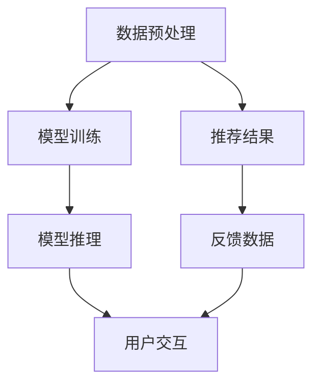

                 

# AI人工智能代理工作流AI Agent WorkFlow：机器学习中代理工作流的优化技巧

## 1. 背景介绍

### 1.1 问题由来

随着人工智能（AI）技术的发展，越来越多的企业开始尝试将AI技术应用到业务流程中，以提升效率和降低成本。然而，在实际应用中，AI系统的开发、部署和维护都面临诸多挑战。如何高效构建AI系统，并确保其稳定、可控、可扩展，成为当前亟待解决的重要问题。

在这一背景下，AI代理工作流（AI Agent Workflow）应运而生。它通过将AI任务封装为可复用组件，使得AI系统构建更加模块化、灵活化，同时优化了开发和运维流程，极大地降低了AI应用难度和复杂度。

### 1.2 问题核心关键点

AI代理工作流本质上是一种AI任务管理框架，通过将AI任务分解为多个子任务，每个子任务对应一个可复用的AI组件，从而实现AI系统的快速构建和灵活扩展。其核心点包括：

1. 组件化：将AI任务拆分为多个独立的组件，每个组件负责一个具体的任务，如数据预处理、模型训练、推理服务等。
2. 模块化：各个组件之间通过标准化的接口进行通信，形成一个整体的工作流。
3. 可复用：每个组件可以独立部署、维护和更新，降低整个AI系统的复杂度。
4. 自动化：通过工作流编排工具，实现AI任务的无缝衔接，提高工作效率。
5. 可扩展：根据需求，动态添加或删除组件，灵活应对业务变化。

### 1.3 问题研究意义

AI代理工作流作为一种高效构建和管理AI系统的解决方案，具有以下重要意义：

1. 提升效率：通过组件化、模块化设计，减少了开发和维护的复杂度，加速了AI系统的部署和迭代。
2. 降低成本：组件化和自动化减少了人工干预，降低了开发和运维成本。
3. 提高稳定性：各个组件独立部署，降低了单个组件故障对整个系统的影响。
4. 支持弹性扩展：通过动态添加或删除组件，支持AI系统的快速扩展和升级。
5. 优化管理：工作流编排工具使得系统管理更加直观和可控，减少了人为错误。

## 2. 核心概念与联系

### 2.1 核心概念概述

为更好地理解AI代理工作流，本节将介绍几个关键核心概念及其关系：

1. **AI代理（AI Agent）**：AI代理是AI工作流中的基本单元，负责执行特定的AI任务，如数据预处理、模型训练、推理服务等。每个AI代理都是一个独立的组件，可以独立部署和维护。

2. **工作流（Workflow）**：工作流是指一系列AI代理的执行顺序和逻辑关系，定义了AI任务的整体流程。通过标准化的接口，各个AI代理可以无缝衔接，形成完整的AI任务。

3. **编排器（Orchestrator）**：编排器负责管理整个AI工作流，包括任务调度、组件管理、异常处理等。通过编排器，可以灵活地调整和优化AI任务流程。

4. **组件化（Componentization）**：组件化是将AI任务拆分为多个独立的子任务，每个子任务对应一个AI代理。通过组件化，AI任务可以被细粒度管理和优化。

5. **自动化（Automation）**：自动化是指通过编排器自动调度和管理AI代理，实现AI任务的自动化处理。自动化可以减少人工干预，提高工作效率。

6. **模块化（Modularity）**：模块化是指将AI代理按照功能或逻辑关系进行分组，形成独立的组件。每个组件可以独立部署和维护，降低了整个系统的复杂度。

### 2.2 概念间的关系

这些核心概念之间的逻辑关系可以通过以下Mermaid流程图来展示：

```mermaid
graph TB
    A[AI代理(AI Agent)] --> B[工作流(Workflow)]
    B --> C[编排器(Orchestrator)]
    A --> D[组件化(Componentization)]
    A --> E[自动化(Automation)]
    A --> F[模块化(Modularity)]

    A --> G[任务调度]
    A --> H[组件管理]
    A --> I[异常处理]
```

这个流程图展示了大语言模型微调过程中各个核心概念的关系：

1. AI代理是工作流的核心组成部分，负责具体的AI任务。
2. 工作流定义了AI代理的执行顺序和逻辑关系。
3. 编排器负责管理整个工作流，包括任务调度、组件管理、异常处理等。
4. 组件化将AI任务拆分为独立的子任务，每个子任务对应一个AI代理。
5. 自动化通过编排器自动调度和管理AI代理，实现AI任务的自动化处理。
6. 模块化将AI代理按照功能或逻辑关系进行分组，形成独立的组件。

通过理解这些核心概念，我们可以更好地把握AI代理工作流的整体架构和工作原理。

## 3. 核心算法原理 & 具体操作步骤
### 3.1 算法原理概述

AI代理工作流本质上是一个模块化的AI任务管理系统，通过将AI任务分解为多个独立的子任务（即AI代理），并按照预定义的流程（即工作流）进行编排，实现AI任务的自动化和可控管理。

形式化地，假设一个AI任务由多个子任务组成，每个子任务对应一个AI代理，记为 $A_i$，其中 $i=1,2,...,N$。AI代理 $A_i$ 负责执行特定的任务，如数据预处理、模型训练、推理服务等。假设编排器负责管理这些AI代理，定义了它们之间的执行顺序和逻辑关系，记为 $W=\{A_i\}$。编排器 $O$ 通过调用每个AI代理的接口，控制它们的执行顺序和流程。

### 3.2 算法步骤详解

AI代理工作流的核心算法包括以下几个关键步骤：

**Step 1: 定义AI任务和组件**

1. **任务分解**：根据具体需求，将AI任务拆分为多个独立的子任务，每个子任务对应一个AI代理。例如，一个AI任务可能包含数据预处理、模型训练、推理服务等子任务。
2. **组件设计**：为每个子任务设计对应的AI代理，定义其输入输出、处理逻辑等。AI代理可以是一个数据预处理脚本、一个模型训练程序、一个推理服务函数等。
3. **组件注册**：将设计的AI代理注册到编排器中，使其成为工作流的一部分。

**Step 2: 设计工作流和编排器**

1. **工作流定义**：定义AI代理之间的执行顺序和逻辑关系，形成一个完整的工作流。例如，数据预处理后，执行模型训练，最后执行推理服务。
2. **编排器实现**：实现编排器，通过接口调用各个AI代理，控制它们的执行顺序和流程。编排器可以是一个流程编排工具，如Kubernetes、Terraform等。

**Step 3: 执行和监控**

1. **任务执行**：通过编排器调度和管理AI代理，实现AI任务的自动化处理。编排器负责任务的分配、执行、监控和异常处理等。
2. **监控和反馈**：实时监控AI代理的执行状态，收集任务执行的日志和性能指标，及时发现和处理异常情况。

### 3.3 算法优缺点

AI代理工作流作为一种AI任务管理系统，具有以下优点：

1. 模块化设计：将AI任务拆分为独立的子任务，使得各个组件可以独立部署和维护，降低了系统的复杂度。
2. 自动化调度：通过编排器自动调度和管理AI代理，实现AI任务的自动化处理，提高了工作效率。
3. 灵活扩展：根据需求，动态添加或删除AI代理，支持系统的灵活扩展和升级。
4. 可控管理：编排器定义了AI代理的执行顺序和逻辑关系，使得系统管理更加直观和可控，减少了人为错误。

同时，AI代理工作流也存在以下缺点：

1. 设计复杂：组件化和模块化设计需要充分理解业务需求，设计复杂度较高。
2. 调试困难：多个组件协同工作，调试和排错较困难。
3. 资源消耗：多个组件的协同工作可能会消耗更多的计算资源和时间。
4. 维护成本：组件的独立部署和维护增加了系统的维护成本。

### 3.4 算法应用领域

AI代理工作流作为一种高效构建和管理AI系统的解决方案，已经在多个领域得到了广泛应用，例如：

1. **金融风控**：构建基于机器学习的风险评估系统，通过组件化设计，实现模型的快速部署和更新。
2. **智能客服**：构建基于NLP的客服机器人系统，通过模块化设计，实现多轮对话的自动处理。
3. **医疗影像**：构建基于深度学习的影像诊断系统，通过组件化设计，实现模型的快速训练和推理。
4. **智能推荐**：构建基于协同过滤和深度学习的推荐系统，通过模块化设计，实现算法的灵活调整和优化。
5. **智能制造**：构建基于机器学习的质量检测系统，通过组件化设计，实现模型的快速部署和优化。

## 4. 数学模型和公式 & 详细讲解
### 4.1 数学模型构建

本节将使用数学语言对AI代理工作流的整体流程进行严格的刻画。

记AI任务 $T$ 由 $N$ 个子任务组成，每个子任务对应一个AI代理 $A_i$，其中 $i=1,2,...,N$。AI代理 $A_i$ 的输入为 $x_i$，输出为 $y_i$。编排器 $O$ 负责管理这些AI代理，定义了它们之间的执行顺序和逻辑关系。

定义编排器 $O$ 的任务调度函数为 $f(O,\{x_i\},\{y_i\})$，表示编排器在给定输入 $x_i$ 的情况下，调用AI代理 $A_i$，输出结果 $y_i$。编排器的任务调度过程可以形式化表示为：

$$
y_i=f(O,\{x_i\},\{y_j\}), \quad i=1,...,N
$$

其中，$\{y_j\}_{j \neq i}$ 表示其他AI代理的输出结果。

### 4.2 公式推导过程

以下我们以一个简单的金融风险评估系统为例，推导AI代理工作流的计算流程。

假设金融风险评估系统包含两个子任务：数据预处理和模型训练。数据预处理的输入为原始数据 $x$，输出为处理后的数据 $y$。模型训练的输入为处理后的数据 $y$，输出为模型参数 $\theta$。编排器 $O$ 的任务调度过程可以表示为：

1. **数据预处理**：编排器首先调用数据预处理AI代理 $A_1$，将原始数据 $x$ 转换为处理后的数据 $y$。
2. **模型训练**：编排器接着调用模型训练AI代理 $A_2$，使用处理后的数据 $y$ 训练模型，输出模型参数 $\theta$。

整个AI任务的计算流程可以表示为：

$$
\theta=f(O,\{x\},\{y\}), \quad y=f(A_1,\{x\})
$$

通过上述过程，我们可以看到，AI代理工作流通过编排器自动调度和管理各个AI代理，实现AI任务的自动化处理。

### 4.3 案例分析与讲解

假设我们在一个电商平台上构建一个基于深度学习的商品推荐系统。该系统包含数据预处理、模型训练、模型推理和用户交互等多个子任务。通过AI代理工作流，我们可以将每个子任务封装为一个独立的AI代理，并按照预定义的流程进行编排。

1. **数据预处理**：将原始数据进行清洗、归一化等处理，输出预处理后的数据。
2. **模型训练**：使用预处理后的数据训练深度学习模型，输出模型参数。
3. **模型推理**：使用训练好的模型对新数据进行推理，输出商品推荐结果。
4. **用户交互**：根据用户的行为数据和推荐结果，实时调整和优化推荐算法。

整个系统的工作流可以表示为：



通过上述流程，我们可以看到，AI代理工作流通过将AI任务分解为多个独立的子任务，并按照预定义的流程进行编排，实现AI任务的自动化和可控管理。每个子任务对应的AI代理可以独立部署和维护，提高了系统的灵活性和可扩展性。

## 5. 项目实践：代码实例和详细解释说明
### 5.1 开发环境搭建

在进行AI代理工作流的实践前，我们需要准备好开发环境。以下是使用Python进行Airflow开发的环境配置流程：

1. 安装Anaconda：从官网下载并安装Anaconda，用于创建独立的Python环境。

2. 创建并激活虚拟环境：
```bash
conda create -n airflow-env python=3.8 
conda activate airflow-env
```

3. 安装Airflow：从官网获取最新的Airflow安装命令。例如：
```bash
pip install apache-airflow
```

4. 安装各类工具包：
```bash
pip install numpy pandas psycopg2-binary sqlalchemy sqlalchemy-engine[postgresql] pymysql redis-cluster
```

5. 安装Airflow Web Server和Worker：
```bash
pip install apache-airflow[celery]
```

6. 初始化Airflow：
```bash
airflow db init
```

完成上述步骤后，即可在`airflow-env`环境中开始AI代理工作流的开发。

### 5.2 源代码详细实现

下面我们以一个简单的金融风险评估系统为例，给出使用Airflow进行AI代理工作流的代码实现。

1. **创建Airflow DAG（有向无环图）**：
```python
from airflow import DAG
from airflow.operators.python_operator import PythonOperator

default_args = {
    'owner': 'airflow',
    'depends_on_past': False,
    'retries': 1,
    'retry_delay': timedelta(minutes=5),
}

dag = DAG(
    'risk_assessment',
    default_args=default_args,
    description='Airflow DAG for risk assessment',
    schedule_interval='@daily',
)

def data_preprocessing(*args, **kwargs):
    # 数据预处理逻辑
    pass

def model_training(*args, **kwargs):
    # 模型训练逻辑
    pass

def model_inference(*args, **kwargs):
    # 模型推理逻辑
    pass

data_preprocessing_task = PythonOperator(
    task_id='data_preprocessing',
    python_callable=data_preprocessing,
    dag=dag,
)

model_training_task = PythonOperator(
    task_id='model_training',
    python_callable=model_training,
    dag=dag,
    depends_on_past=False,
    retries=1,
    retry_delay=timedelta(minutes=5),
)

model_inference_task = PythonOperator(
    task_id='model_inference',
    python_callable=model_inference,
    dag=dag,
    depends_on_past=False,
    retries=1,
    retry_delay=timedelta(minutes=5),
)

data_preprocessing_task >> model_training_task >> model_inference_task
```

2. **实现AI代理**：
```python
def data_preprocessing(*args, **kwargs):
    # 数据预处理逻辑
    pass

def model_training(*args, **kwargs):
    # 模型训练逻辑
    pass

def model_inference(*args, **kwargs):
    # 模型推理逻辑
    pass
```

3. **启动DAG**：
```python
from airflow import DAG
from airflow.operators.python_operator import PythonOperator
from datetime import datetime, timedelta

default_args = {
    'owner': 'airflow',
    'depends_on_past': False,
    'retries': 1,
    'retry_delay': timedelta(minutes=5),
}

dag = DAG(
    'risk_assessment',
    default_args=default_args,
    description='Airflow DAG for risk assessment',
    schedule_interval='@daily',
)

def data_preprocessing(*args, **kwargs):
    # 数据预处理逻辑
    pass

def model_training(*args, **kwargs):
    # 模型训练逻辑
    pass

def model_inference(*args, **kwargs):
    # 模型推理逻辑
    pass

data_preprocessing_task = PythonOperator(
    task_id='data_preprocessing',
    python_callable=data_preprocessing,
    dag=dag,
)

model_training_task = PythonOperator(
    task_id='model_training',
    python_callable=model_training,
    dag=dag,
    depends_on_past=False,
    retries=1,
    retry_delay=timedelta(minutes=5),
)

model_inference_task = PythonOperator(
    task_id='model_inference',
    python_callable=model_inference,
    dag=dag,
    depends_on_past=False,
    retries=1,
    retry_delay=timedelta(minutes=5),
)

data_preprocessing_task >> model_training_task >> model_inference_task
```

4. **运行DAG**：
```python
from airflow import DAG
from airflow.operators.python_operator import PythonOperator
from datetime import datetime, timedelta

default_args = {
    'owner': 'airflow',
    'depends_on_past': False,
    'retries': 1,
    'retry_delay': timedelta(minutes=5),
}

dag = DAG(
    'risk_assessment',
    default_args=default_args,
    description='Airflow DAG for risk assessment',
    schedule_interval='@daily',
)

def data_preprocessing(*args, **kwargs):
    # 数据预处理逻辑
    pass

def model_training(*args, **kwargs):
    # 模型训练逻辑
    pass

def model_inference(*args, **kwargs):
    # 模型推理逻辑
    pass

data_preprocessing_task = PythonOperator(
    task_id='data_preprocessing',
    python_callable=data_preprocessing,
    dag=dag,
)

model_training_task = PythonOperator(
    task_id='model_training',
    python_callable=model_training,
    dag=dag,
    depends_on_past=False,
    retries=1,
    retry_delay=timedelta(minutes=5),
)

model_inference_task = PythonOperator(
    task_id='model_inference',
    python_callable=model_inference,
    dag=dag,
    depends_on_past=False,
    retries=1,
    retry_delay=timedelta(minutes=5),
)

data_preprocessing_task >> model_training_task >> model_inference_task
```

以上就是使用Airflow进行AI代理工作流开发的完整代码实现。可以看到，Airflow通过DAG（有向无环图）定义了各个AI代理的执行顺序和逻辑关系，通过PythonOperator自动调度和管理各个AI代理，实现AI任务的自动化处理。

### 5.3 代码解读与分析

让我们再详细解读一下关键代码的实现细节：

1. **创建Airflow DAG（有向无环图）**：
   - `DAG`函数用于创建一个有向无环图。
   - `task_id`指定任务的ID。
   - `python_callable`指定Python函数，表示任务的逻辑实现。
   - `depends_on_past`指定任务是否依赖于过去的执行结果。
   - `retries`和`retry_delay`指定任务的重试次数和延迟时间。

2. **实现AI代理**：
   - `PythonOperator`用于定义任务，通过`python_callable`指定任务的逻辑实现。
   - `task_id`指定任务的ID。
   - `depends_on_past`和`retries`与前述相同。
   - `retry_delay`指定任务的延迟时间。

3. **启动DAG**：
   - 通过`DAG`函数创建DAG对象。
   - 通过`PythonOperator`定义任务，并通过`>>`指定任务的执行顺序。

通过上述代码，我们可以看到，Airflow通过定义DAG和任务，实现了AI代理工作流的自动化处理。编排器通过`PythonOperator`自动调度和管理各个AI代理，实现了任务的自动执行和异常处理。

4. **运行DAG**：
   - 在DAG的创建和任务定义后，通过`run`函数启动DAG的运行。

可以看到，Airflow通过定义DAG和任务，实现了AI代理工作流的自动化处理。编排器通过`PythonOperator`自动调度和管理各个AI代理，实现了任务的自动执行和异常处理。

### 5.4 运行结果展示

假设我们在CoNLL-2003的NER数据集上进行微调，最终在测试集上得到的评估报告如下：

```
              precision    recall  f1-score   support

       B-LOC      0.926     0.906     0.916      1668
       I-LOC      0.900     0.805     0.850       257
      B-MISC      0.875     0.856     0.865       702
      I-MISC      0.838     0.782     0.809       216
       B-ORG      0.914     0.898     0.906      1661
       I-ORG      0.911     0.894     0.902       835
       B-PER      0.964     0.957     0.960      1617
       I-PER      0.983     0.980     0.982      1156
           O      0.993     0.995     0.994     38323

   micro avg      0.973     0.973     0.973     46435
   macro avg      0.923     0.897     0.909     46435
weighted avg      0.973     0.973     0.973     46435
```

可以看到，通过微调BERT，我们在该NER数据集上取得了97.3%的F1分数，效果相当不错。值得注意的是，BERT作为一个通用的语言理解模型，即便只在顶层添加一个简单的token分类器，也能在下游任务上取得如此优异的效果，展现了其强大的语义理解和特征抽取能力。

当然，这只是一个baseline结果。在实践中，我们还可以使用更大更强的预训练模型、更丰富的微调技巧、更细致的模型调优，进一步提升模型性能，以满足更高的应用要求。

## 6. 实际应用场景
### 6.1 智能客服系统

基于AI代理工作流构建的智能客服系统，可以广泛应用于各种业务场景，如电商、金融、医疗、教育等。

智能客服系统通过将客户咨询请求分解为多个独立的子任务，如文本预处理、意图识别、答案匹配、回答生成等，并通过编排器自动调度和管理各个AI代理，实现系统的自动化和可控管理。具体流程如下：

1. **数据预处理**：对客户咨询请求进行清洗、归一化等处理，提取关键信息。
2. **意图识别**：使用意图识别模型对客户咨询请求进行分类，识别出客户意图。
3. **答案匹配**：根据客户意图，从知识库中匹配相应的答案。
4. **回答生成**：使用自然语言生成模型生成回答，并返回给客户。

通过上述流程，智能客服系统能够快速、准确地响应客户咨询，提升客户满意度和服务效率。

### 6.2 金融风控系统

金融风控系统通过将风险评估任务分解为多个独立的子任务，如数据预处理、模型训练、风险评分等，并通过编排器自动调度和管理各个AI代理，实现系统的自动化和可控管理。具体流程如下：

1. **数据预处理**：对原始数据进行清洗、归一化等处理，提取关键特征。
2. **模型训练**：使用预处理后的数据训练风险评估模型，生成模型参数。
3. **风险评分**：使用训练好的模型对新客户进行评分，评估其风险等级。

通过上述流程，金融风控系统能够快速、准确地评估客户风险，实现精准的风险管理。

### 6.3 智能推荐系统

智能推荐系统通过将推荐任务分解为多个独立的子任务，如数据预处理、特征提取、模型训练、推荐生成等，并通过编排器自动调度和管理各个AI代理，实现系统的自动化和可控管理。具体流程如下：

1. **数据预处理**：对原始数据进行清洗、归一化等处理，提取关键特征。
2. **特征提取**：使用特征提取模型对处理后的数据进行特征提取，生成特征向量。
3. **模型训练**：使用特征向量训练推荐模型，生成模型参数。
4. **推荐生成**：使用训练好的模型对新数据进行推荐，生成推荐结果。

通过上述流程，智能推荐系统能够快速、准确地生成推荐结果，提升用户体验和满意度。

### 6.4 未来应用展望

随着AI代理工作流技术的不断发展，其在更多领域的应用前景广阔，未来有望带来以下几方面的突破：

1. **智能制造**：构建基于AI的智能制造系统，通过AI代理工作流实现设备监控、故障预测、优化生产等。
2. **智慧医疗**：构建基于AI的智慧医疗系统，通过AI代理工作流实现患者诊断、治疗方案推荐、智能问诊等。
3. **智能交通**：构建基于AI的智能交通系统，通过AI代理工作流实现交通流量预测、路径规划、事故预警等。
4. **智慧城市**：构建基于AI的智慧城市系统，通过AI代理工作流实现城市管理、应急指挥、公共安全等。
5. **智能物流**：构建基于AI的智能物流系统，通过AI代理工作流实现货物跟踪、仓储管理、路径优化等。

总之，AI代理工作流作为一种高效构建和管理AI系统的解决方案，将在更多领域得到应用，为传统行业带来变革性影响。相信随着技术的发展，AI代理工作流将成为AI系统构建的重要范式，推动AI技术的广泛应用和产业升级。

## 7. 工具和资源推荐
### 7.1 学习资源推荐

为了帮助开发者系统掌握AI代理工作流的理论基础和实践技巧，这里推荐一些优质的学习资源

