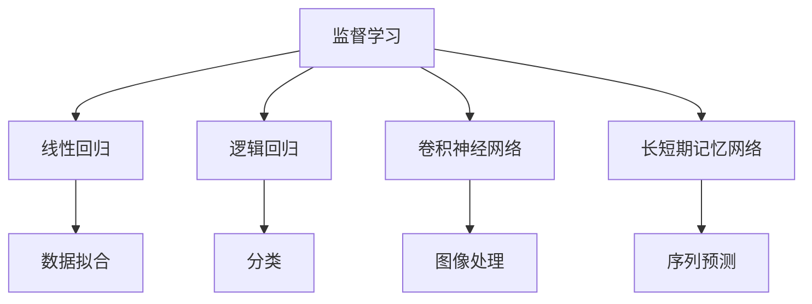
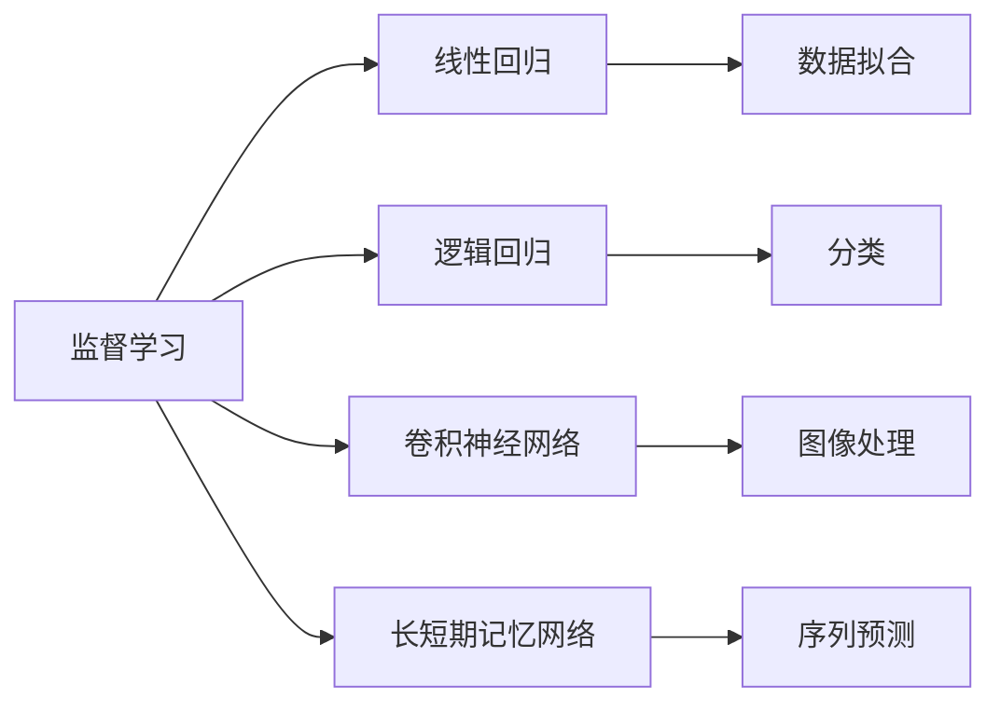
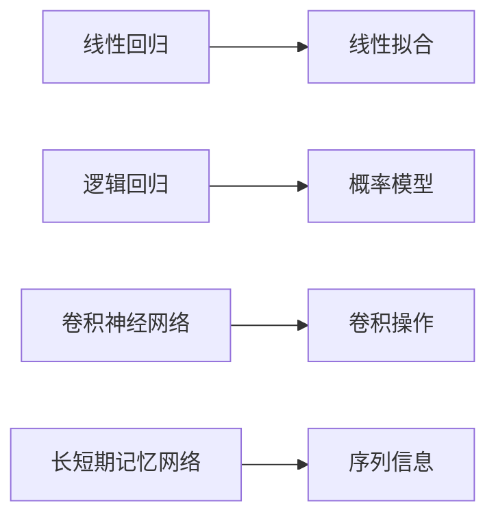

                 

# AI人工智能核心算法原理与代码实例讲解：算法实现

## 1. 背景介绍

### 1.1 问题由来
随着人工智能（AI）技术的飞速发展，AI算法在各个领域的应用越来越广泛。从自动驾驶、语音识别、图像处理到自然语言处理（NLP），AI算法正逐渐渗透到人们生活的方方面面。然而，许多AI算法，尤其是深度学习算法，其原理和实现过程相对复杂，使得初学者难以理解和掌握。本文将介绍几种AI核心算法，包括线性回归、逻辑回归、卷积神经网络（CNN）和长短期记忆网络（LSTM），并通过代码实例和详细讲解，帮助读者系统理解这些算法的原理和实现。

### 1.2 问题核心关键点
AI算法包括监督学习、非监督学习、强化学习等多种类型。本节将重点介绍监督学习中的线性回归、逻辑回归、卷积神经网络和长短期记忆网络这四种核心算法。这些算法不仅在理论上有深厚的数学基础，而且在实际应用中取得了显著的效果。它们构成了深度学习的基础，对于理解复杂模型和应用AI技术具有重要意义。

### 1.3 问题研究意义
掌握AI核心算法，可以帮助开发人员更好地理解深度学习模型的工作原理，提高模型设计和调优的能力。同时，通过对这些算法的深入学习，可以加速AI技术在实际应用中的落地，促进各行各业的数字化转型。

## 2. 核心概念与联系

### 2.1 核心概念概述

为更好地理解AI核心算法，本节将介绍几个密切相关的核心概念：

- 监督学习：指在有标签数据集上训练模型，预测新数据的标签。常用的监督学习算法包括线性回归、逻辑回归等。
- 非监督学习：指在没有标签数据集上训练模型，寻找数据的内在结构和模式。常用的非监督学习算法包括K均值聚类、主成分分析等。
- 强化学习：指通过与环境交互，学习最优决策策略。强化学习算法包括Q学习、策略梯度等。
- 深度学习：指使用多层神经网络处理数据，提取高层次特征。深度学习算法包括卷积神经网络、长短期记忆网络等。

这些核心概念之间的逻辑关系可以通过以下Mermaid流程图来展示：



这个流程图展示了监督学习与不同算法的联系：线性回归用于数据拟合，逻辑回归用于分类，卷积神经网络用于图像处理，长短期记忆网络用于序列预测。这些算法构成了监督学习的基础，通过选择合适的算法，可以在不同的应用场景下解决问题。

### 2.2 概念间的关系

这些核心概念之间存在着紧密的联系，形成了AI算法的完整生态系统。下面我们通过几个Mermaid流程图来展示这些概念之间的关系。

#### 2.2.1 AI算法的学习范式



这个流程图展示了监督学习的基本原理，以及它与不同算法的联系。线性回归、逻辑回归、卷积神经网络和长短期记忆网络都是监督学习算法的子集，通过选择合适的算法，可以在不同的应用场景下解决问题。

#### 2.2.2 算法间的异同



这个流程图展示了四种算法的异同。线性回归通过线性拟合进行数据建模，逻辑回归通过概率模型进行分类，卷积神经网络通过卷积操作处理图像，长短期记忆网络通过序列信息进行预测。这些算法在数据处理方式、应用场景等方面存在显著差异。

## 3. 核心算法原理 & 具体操作步骤
### 3.1 算法原理概述

线性回归、逻辑回归、卷积神经网络和长短期记忆网络都是AI核心算法，用于解决不同类型的问题。本节将分别介绍这四种算法的原理和实现步骤。

#### 3.1.1 线性回归

线性回归是一种用于建立线性关系的监督学习算法。其目标是通过最小化预测值与实际值之间的平方误差，找到最优的线性拟合。线性回归的公式如下：

$$ y = w_0 + w_1x_1 + w_2x_2 + \cdots + w_nx_n $$

其中 $y$ 为预测值，$w_0, w_1, \cdots, w_n$ 为模型参数，$x_1, x_2, \cdots, x_n$ 为输入特征。

#### 3.1.2 逻辑回归

逻辑回归是一种用于二分类问题的监督学习算法。其目标是通过最大化预测值与实际值的似然函数，找到最优的模型参数。逻辑回归的公式如下：

$$ P(y|x) = \frac{1}{1 + e^{-(w_0 + w_1x_1 + w_2x_2 + \cdots + w_nx_n)}} $$

其中 $P(y|x)$ 为条件概率，$w_0, w_1, \cdots, w_n$ 为模型参数，$x_1, x_2, \cdots, x_n$ 为输入特征。

#### 3.1.3 卷积神经网络

卷积神经网络是一种用于图像处理和图像分类的监督学习算法。其核心思想是通过卷积操作提取图像特征，再通过池化操作降维，最后通过全连接层进行分类。卷积神经网络的架构如图：

```
           conv
             |
             pool
             |
         FC
```

#### 3.1.4 长短期记忆网络

长短期记忆网络是一种用于序列预测的监督学习算法。其核心思想是通过记忆单元存储历史信息，再通过门控机制控制信息的流动。长短期记忆网络的架构如图：

```
           memory
             |
             gate
             |
         FC
```

### 3.2 算法步骤详解

#### 3.2.1 线性回归

线性回归的实现步骤如下：

1. 数据准备：将输入数据分为训练集和测试集，进行数据归一化处理。
2. 模型初始化：初始化模型参数 $w_0, w_1, \cdots, w_n$。
3. 迭代训练：使用随机梯度下降（SGD）算法，最小化预测值与实际值之间的平方误差，更新模型参数。
4. 模型评估：在测试集上评估模型性能，计算均方误差（MSE）等指标。

#### 3.2.2 逻辑回归

逻辑回归的实现步骤如下：

1. 数据准备：将输入数据分为训练集和测试集，进行数据归一化处理。
2. 模型初始化：初始化模型参数 $w_0, w_1, \cdots, w_n$。
3. 迭代训练：使用随机梯度下降（SGD）算法，最大化预测值与实际值的似然函数，更新模型参数。
4. 模型评估：在测试集上评估模型性能，计算准确率（Accuracy）等指标。

#### 3.2.3 卷积神经网络

卷积神经网络的实现步骤如下：

1. 数据准备：将输入数据进行归一化处理，并进行数据增强。
2. 模型初始化：初始化卷积层、池化层、全连接层的权重和偏置。
3. 迭代训练：使用随机梯度下降（SGD）算法，最小化分类损失函数，更新模型参数。
4. 模型评估：在测试集上评估模型性能，计算准确率（Accuracy）等指标。

#### 3.2.4 长短期记忆网络

长短期记忆网络的实现步骤如下：

1. 数据准备：将输入数据进行归一化处理，并进行数据增强。
2. 模型初始化：初始化记忆单元、门控机制、全连接层的权重和偏置。
3. 迭代训练：使用随机梯度下降（SGD）算法，最小化分类损失函数，更新模型参数。
4. 模型评估：在测试集上评估模型性能，计算准确率（Accuracy）等指标。

### 3.3 算法优缺点

#### 3.3.1 线性回归

- 优点：模型简单，易于实现和理解；适用于线性关系较强的数据。
- 缺点：对异常值和噪声敏感；对数据分布的要求较高。

#### 3.3.2 逻辑回归

- 优点：模型简单，易于实现和理解；适用于二分类问题。
- 缺点：对异常值和噪声敏感；对数据分布的要求较高。

#### 3.3.3 卷积神经网络

- 优点：能够处理高维数据，如图像和视频；通过卷积操作提取局部特征；局部连接和权值共享降低了参数数量。
- 缺点：需要大量的训练数据；对数据预处理的要求较高。

#### 3.3.4 长短期记忆网络

- 优点：能够处理序列数据，如时间序列和自然语言；通过记忆单元存储历史信息；门控机制能够控制信息的流动。
- 缺点：需要大量的训练数据；对序列长度和数据分布的要求较高。

### 3.4 算法应用领域

线性回归、逻辑回归、卷积神经网络和长短期记忆网络广泛应用于各个领域：

- 线性回归：金融预测、时间序列预测、房价预测等。
- 逻辑回归：广告点击率预测、信用评分、二分类问题等。
- 卷积神经网络：图像分类、目标检测、图像分割等。
- 长短期记忆网络：机器翻译、语音识别、自然语言处理等。

## 4. 数学模型和公式 & 详细讲解 & 举例说明

### 4.1 数学模型构建

本节将通过数学模型和公式，对线性回归、逻辑回归、卷积神经网络和长短期记忆网络进行详细讲解。

#### 4.1.1 线性回归

线性回归的数学模型构建如下：

1. 数据准备：将输入数据 $x$ 分为训练集 $x_{train}$ 和测试集 $x_{test}$。
2. 模型初始化：初始化模型参数 $w_0, w_1, \cdots, w_n$。
3. 迭代训练：使用随机梯度下降（SGD）算法，最小化预测值与实际值之间的平方误差 $E$，更新模型参数。

数学公式推导如下：

- 训练误差：

$$ E_{train} = \frac{1}{N_{train}} \sum_{i=1}^{N_{train}} (y_i - \hat{y_i})^2 $$

- 损失函数：

$$ J(w) = \frac{1}{2N_{train}} \sum_{i=1}^{N_{train}} (y_i - \hat{y_i})^2 $$

其中 $N_{train}$ 为训练样本数，$y_i$ 为真实值，$\hat{y_i}$ 为预测值。

- 梯度下降更新：

$$ \Delta w_k = -\eta \frac{\partial J(w)}{\partial w_k} $$

其中 $\eta$ 为学习率，$\frac{\partial J(w)}{\partial w_k}$ 为损失函数对模型参数 $w_k$ 的偏导数。

#### 4.1.2 逻辑回归

逻辑回归的数学模型构建如下：

1. 数据准备：将输入数据 $x$ 分为训练集 $x_{train}$ 和测试集 $x_{test}$。
2. 模型初始化：初始化模型参数 $w_0, w_1, \cdots, w_n$。
3. 迭代训练：使用随机梯度下降（SGD）算法，最大化预测值与实际值的似然函数 $L$，更新模型参数。

数学公式推导如下：

- 训练误差：

$$ E_{train} = -\frac{1}{N_{train}} \sum_{i=1}^{N_{train}} y_i \log \hat{y_i} + (1-y_i) \log (1-\hat{y_i}) $$

- 损失函数：

$$ J(w) = -\frac{1}{N_{train}} \sum_{i=1}^{N_{train}} y_i \log \hat{y_i} + (1-y_i) \log (1-\hat{y_i}) $$

其中 $N_{train}$ 为训练样本数，$y_i$ 为真实值，$\hat{y_i}$ 为预测值。

- 梯度下降更新：

$$ \Delta w_k = -\eta \frac{\partial J(w)}{\partial w_k} $$

其中 $\eta$ 为学习率，$\frac{\partial J(w)}{\partial w_k}$ 为损失函数对模型参数 $w_k$ 的偏导数。

#### 4.1.3 卷积神经网络

卷积神经网络的数学模型构建如下：

1. 数据准备：将输入数据 $x$ 进行归一化处理，并进行数据增强。
2. 模型初始化：初始化卷积层、池化层、全连接层的权重和偏置。
3. 迭代训练：使用随机梯度下降（SGD）算法，最小化分类损失函数 $L$，更新模型参数。

数学公式推导如下：

- 损失函数：

$$ J(w) = -\frac{1}{N_{train}} \sum_{i=1}^{N_{train}} \log P(y_i|x_i;w) $$

其中 $N_{train}$ 为训练样本数，$y_i$ 为真实值，$P(y_i|x_i;w)$ 为分类概率。

- 梯度下降更新：

$$ \Delta w_k = -\eta \frac{\partial J(w)}{\partial w_k} $$

其中 $\eta$ 为学习率，$\frac{\partial J(w)}{\partial w_k}$ 为损失函数对模型参数 $w_k$ 的偏导数。

#### 4.1.4 长短期记忆网络

长短期记忆网络的数学模型构建如下：

1. 数据准备：将输入数据 $x$ 进行归一化处理，并进行数据增强。
2. 模型初始化：初始化记忆单元、门控机制、全连接层的权重和偏置。
3. 迭代训练：使用随机梯度下降（SGD）算法，最小化分类损失函数 $L$，更新模型参数。

数学公式推导如下：

- 损失函数：

$$ J(w) = -\frac{1}{N_{train}} \sum_{i=1}^{N_{train}} \log P(y_i|x_i;w) $$

其中 $N_{train}$ 为训练样本数，$y_i$ 为真实值，$P(y_i|x_i;w)$ 为分类概率。

- 梯度下降更新：

$$ \Delta w_k = -\eta \frac{\partial J(w)}{\partial w_k} $$

其中 $\eta$ 为学习率，$\frac{\partial J(w)}{\partial w_k}$ 为损失函数对模型参数 $w_k$ 的偏导数。

### 4.2 公式推导过程

#### 4.2.1 线性回归

线性回归的损失函数 $J(w)$ 推导如下：

1. 训练误差：

$$ E_{train} = \frac{1}{N_{train}} \sum_{i=1}^{N_{train}} (y_i - \hat{y_i})^2 $$

2. 损失函数：

$$ J(w) = \frac{1}{2N_{train}} \sum_{i=1}^{N_{train}} (y_i - \hat{y_i})^2 $$

3. 梯度下降更新：

$$ \Delta w_k = -\eta \frac{\partial J(w)}{\partial w_k} $$

其中 $\eta$ 为学习率，$\frac{\partial J(w)}{\partial w_k}$ 为损失函数对模型参数 $w_k$ 的偏导数。

#### 4.2.2 逻辑回归

逻辑回归的损失函数 $J(w)$ 推导如下：

1. 训练误差：

$$ E_{train} = -\frac{1}{N_{train}} \sum_{i=1}^{N_{train}} y_i \log \hat{y_i} + (1-y_i) \log (1-\hat{y_i}) $$

2. 损失函数：

$$ J(w) = -\frac{1}{N_{train}} \sum_{i=1}^{N_{train}} y_i \log \hat{y_i} + (1-y_i) \log (1-\hat{y_i}) $$

3. 梯度下降更新：

$$ \Delta w_k = -\eta \frac{\partial J(w)}{\partial w_k} $$

其中 $\eta$ 为学习率，$\frac{\partial J(w)}{\partial w_k}$ 为损失函数对模型参数 $w_k$ 的偏导数。

#### 4.2.3 卷积神经网络

卷积神经网络的损失函数 $J(w)$ 推导如下：

1. 损失函数：

$$ J(w) = -\frac{1}{N_{train}} \sum_{i=1}^{N_{train}} \log P(y_i|x_i;w) $$

2. 梯度下降更新：

$$ \Delta w_k = -\eta \frac{\partial J(w)}{\partial w_k} $$

其中 $\eta$ 为学习率，$\frac{\partial J(w)}{\partial w_k}$ 为损失函数对模型参数 $w_k$ 的偏导数。

#### 4.2.4 长短期记忆网络

长短期记忆网络的损失函数 $J(w)$ 推导如下：

1. 损失函数：

$$ J(w) = -\frac{1}{N_{train}} \sum_{i=1}^{N_{train}} \log P(y_i|x_i;w) $$

2. 梯度下降更新：

$$ \Delta w_k = -\eta \frac{\partial J(w)}{\partial w_k} $$

其中 $\eta$ 为学习率，$\frac{\partial J(w)}{\partial w_k}$ 为损失函数对模型参数 $w_k$ 的偏导数。

### 4.3 案例分析与讲解

#### 4.3.1 线性回归案例

假设我们要预测房价，数据集包含房屋面积 $x_1$ 和房价 $y$，我们先用线性回归模型进行训练，并使用测试集进行评估：

- 数据准备：将输入数据分为训练集和测试集，进行数据归一化处理。

```python
import numpy as np
from sklearn.linear_model import LinearRegression
from sklearn.model_selection import train_test_split
from sklearn.metrics import mean_squared_error

# 准备数据
X = np.array([[1], [2], [3], [4], [5]])
y = np.array([5000, 10000, 15000, 20000, 25000])

# 分割数据集
X_train, X_test, y_train, y_test = train_test_split(X, y, test_size=0.2, random_state=0)

# 归一化处理
X_train = (X_train - np.mean(X_train)) / np.std(X_train)
X_test = (X_test - np.mean(X_test)) / np.std(X_test)
```

- 模型初始化：初始化模型参数 $w_0, w_1$。

```python
w_0 = 0
w_1 = 0
```

- 迭代训练：使用随机梯度下降（SGD）算法，最小化预测值与实际值之间的平方误差，更新模型参数。

```python
alpha = 0.01  # 学习率
N = len(X_train)  # 训练样本数

for i in range(1000):
    y_pred = w_0 + w_1 * X_train
    loss = np.mean((y_pred - y_train) ** 2)
    w_0 -= alpha * (1 / N) * np.sum(y_pred - y_train)
    w_1 -= alpha * (1 / N) * np.sum(X_train * (y_pred - y_train))
```

- 模型评估：在测试集上评估模型性能，计算均方误差（MSE）等指标。

```python
y_pred = w_0 + w_1 * X_test
mse = mean_squared_error(y_test, y_pred)
print("均方误差：", mse)
```

#### 4.3.2 逻辑回归案例

假设我们要进行二分类任务，数据集包含特征 $x_1, x_2$ 和标签 $y$，我们先用逻辑回归模型进行训练，并使用测试集进行评估：

- 数据准备：将输入数据分为训练集和测试集，进行数据归一化处理。

```python
import numpy as np
from sklearn.linear_model import LogisticRegression
from sklearn.model_selection import train_test_split
from sklearn.metrics import accuracy_score

# 准备数据
X = np.array([[1, 0], [2, 1], [3, 0], [4, 1], [5, 0]])
y = np.array([1, 0, 0, 1, 0])

# 分割数据集
X_train, X_test, y_train, y_test = train_test_split(X, y, test_size=0.2, random_state=0)

# 归一化处理
X_train = (X_train - np.mean(X_train)) / np.std(X_train)
X_test = (X_test - np.mean(X_test)) / np.std(X_test)
```

- 模型初始化：初始化模型参数 $w_0, w_1$。

```python
w_0 = 0
w_1 = 0
```

- 迭代训练：使用随机梯度下降（SGD）算法，最大化预测值与实际值的似然函数，更新模型参数。

```python
alpha = 0.01  # 学习率
N = len(X_train)  # 训练样本数

for i in range(1000):
    y_pred = 1 / (1 + np.exp(-w_0 - w_1 * X_train))
    loss = np.mean(np.log(y_train) - np.log(y_pred))
    w_0 -= alpha * (1 / N) * np.sum(y_pred - y_train)
    w_1 -= alpha * (1 / N) * np.sum(X_train * (y_pred - y_train))
```

- 模型评估：在测试集上评估模型性能，计算准确率（Accuracy）等指标。

```python
y_pred = 1 / (1 + np.exp(-w_0 - w_1 * X_test))
accuracy = accuracy_score(y_test, (y_pred > 0.5).astype(int))
print("准确率：", accuracy)
```

#### 4.3.3 卷积神经网络案例

假设我们要对图像进行分类，数据集包含图像 $x$ 和标签 $y$，我们先用卷积神经网络模型进行训练，并使用测试集进行评估：

- 数据准备：将输入数据进行归一化处理，并进行数据增强。

```python
import numpy as np
from tensorflow.keras.datasets import mnist
from tensorflow.keras.models import Sequential
from tensorflow.keras.layers import Conv2D, MaxPooling2D, Flatten, Dense
from tensorflow.keras.optimizers import Adam

# 准备数据
(X_train, y_train), (X_test, y_test) = mnist.load_data()
X_train = X_train.reshape(X_train.shape[0], 28, 28, 1)
X_test = X_test.reshape(X_test.shape[0], 28, 28, 1)
X_train = X_train / 255.0
X_test = X_test / 255.0

# 数据增强
from tensorflow.keras.preprocessing.image import ImageDataGenerator

datagen = ImageDataGenerator(rotation_range=10, width_shift_range=0.1, height_shift_range=0.1)
datagen.fit(X_train)

# 模型初始化
model = Sequential()
model.add(Conv2D(32, kernel_size=(3, 3), activation='relu', input_shape=(28, 28, 1)))
model.add(MaxPooling2D(pool_size=(2, 2)))
model.add(Flatten())
model.add(Dense(10, activation='softmax'))
```

- 迭代训练：使用随机梯度下降（SGD）算法，最小化分类损失函数，更新模型参数。

```python
# 编译模型
model.compile(loss='categorical_crossentropy', optimizer=Adam(lr=0.001), metrics=['accuracy'])

# 训练模型
model.fit(datagen.flow(X_train, y_train, batch_size=32), epochs=10, validation_data=(X_test, y_test))
```

- 模型评估：在测试集上评估模型性能，计算准确率（Accuracy）等指标。

```python
loss, accuracy = model.evaluate(X_test, y_test)
print("损失：", loss)
print("准确率：", accuracy)
```

#### 4.3.4 长短期记忆网络案例

假设我们要对时间序列进行预测，数据集包含时间序列 $x$ 和标签 $y$，我们先用长短期记忆网络模型进行训练，并使用测试集

