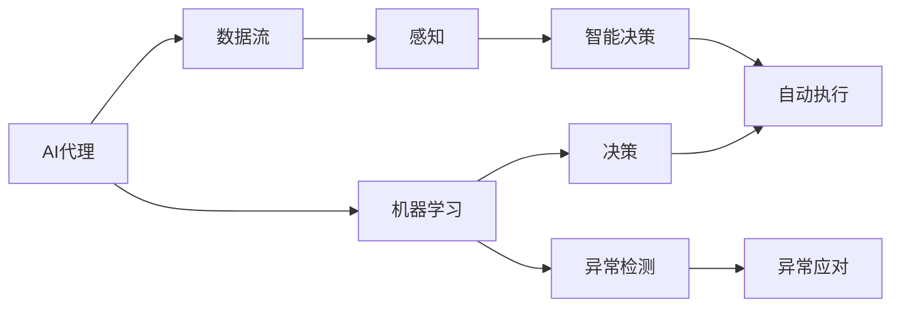

                 

# AI代理在供应链管理中的工作流优化实践

## 1. 背景介绍

### 1.1 问题由来
在现代供应链管理中，企业面临着高度复杂和动态的运营环境，需要高效协调供应商、生产商、分销商、物流商等多个环节，以实现订单快速响应、库存优化、成本控制等目标。然而，传统的手工操作和分散的决策机制，容易导致信息孤岛、协调成本高、决策效率低下等问题。因此，如何通过智能化的手段提升供应链管理效率，成为企业关注的焦点。

AI代理（AI Agent）作为一种新兴的智能技术，其自主决策和自动化执行能力，为供应链管理提供了新的解决思路。通过AI代理，企业可以实现自动化流程优化、异常预测和快速响应，从而提升供应链的整体运作效率。

### 1.2 问题核心关键点
AI代理的核心工作是自动化优化供应链中的各个工作流，包括订单处理、库存管理、物流调度等。其核心步骤如下：
1. 收集供应链各个环节的数据。
2. 利用机器学习算法对数据进行分析，识别优化机会。
3. 通过智能决策和自动化执行，优化工作流。
4. 持续学习和适应供应链环境的变化。

AI代理在供应链管理中的应用，主要体现在以下几个方面：
1. 自动化任务处理：自动完成订单接收、分类、处理等任务。
2. 智能调度优化：通过预测和决策，优化库存和物流调度。
3. 异常预测和应对：预测供应链中的异常情况，并及时采取应对措施。
4. 持续学习与改进：不断学习和优化模型，提升决策能力。

## 2. 核心概念与联系

### 2.1 核心概念概述
#### 2.1.1 AI代理（AI Agent）
AI代理是一种具有自主决策能力的智能体，能够通过学习、推理和执行，优化供应链中的工作流。AI代理通常由以下几个模块组成：
- 感知模块：收集供应链数据，识别环境变化。
- 决策模块：基于历史数据和规则，进行智能决策。
- 执行模块：自动执行决策，优化工作流。
- 学习模块：持续学习，不断改进模型。

#### 2.1.2 机器学习（Machine Learning）
机器学习是一种利用数据训练模型，从而实现预测、分类、聚类等任务的技术。在AI代理中，机器学习算法通常用于数据预处理、特征提取、模型训练等环节。常见的机器学习算法包括线性回归、决策树、深度学习等。

#### 2.1.3 数据流（Data Flow）
数据流是指在供应链中各个环节之间传递的数据，包括订单信息、库存数据、物流状态等。数据流的优化是AI代理优化的重要内容，通过数据流优化，可以提升供应链的透明度和效率。

#### 2.1.4 异常检测（Anomaly Detection）
异常检测是指在供应链中识别异常情况，如延误、断货、故障等。通过异常检测，AI代理可以及时采取应对措施，避免损失。

### 2.2 核心概念之间的关系
AI代理、机器学习、数据流和异常检测之间的关系可以通过以下Mermaid流程图来展示：



这个流程图展示了AI代理在供应链管理中的主要流程：
- AI代理通过感知模块收集数据流，利用机器学习算法进行数据预处理和特征提取。
- 感知后的数据流进入决策模块，通过智能决策算法进行分析和优化。
- 决策结果通过自动执行模块，优化供应链中的工作流。
- 异常检测模块实时监控供应链状态，一旦发现异常，立即采取应对措施。

## 3. 核心算法原理 & 具体操作步骤

### 3.1 算法原理概述
AI代理在供应链管理中的应用，主要依赖于机器学习算法和优化技术。其核心原理是通过智能决策和自动化执行，优化供应链中的各个工作流。具体算法流程如下：
1. 数据收集：收集供应链各个环节的数据，包括订单信息、库存数据、物流状态等。
2. 数据预处理：对数据进行清洗、归一化、编码等预处理，确保数据质量。
3. 特征提取：从数据中提取关键特征，如订单量、库存量、运输时间等。
4. 模型训练：利用机器学习算法对特征进行训练，构建优化模型。
5. 智能决策：根据模型预测结果，进行智能决策。
6. 自动化执行：自动执行决策，优化供应链中的工作流。
7. 持续学习：不断学习新的数据，优化模型，提升决策能力。

### 3.2 算法步骤详解

#### 3.2.1 数据收集
数据收集是AI代理优化的基础。通过部署传感器、物联网设备等，可以实时采集供应链中的各个环节的数据，包括订单信息、库存数据、物流状态等。例如：
- 订单信息：订单号、客户信息、订单量、订单日期等。
- 库存数据：产品名称、库存量、库存位置、供应商信息等。
- 物流状态：运输方式、运输时间、运输状态、物流节点等。

#### 3.2.2 数据预处理
数据预处理是保证数据质量的重要步骤。通过数据清洗、归一化、编码等处理，可以确保数据的准确性和一致性。例如：
- 数据清洗：去除缺失值、异常值，纠正数据格式错误。
- 数据归一化：对数据进行标准化处理，确保不同数据范围一致。
- 数据编码：将分类数据转换为数值型数据，便于模型处理。

#### 3.2.3 特征提取
特征提取是AI代理优化的关键步骤。通过提取数据中的关键特征，可以构建优化模型，实现智能决策。例如：
- 订单量：订单总数、订单量变化趋势等。
- 库存量：库存总量、库存水平、库存位置等。
- 运输时间：运输周期、运输延迟、物流节点等。

#### 3.2.4 模型训练
模型训练是AI代理优化的核心环节。通过机器学习算法对特征进行训练，可以构建优化模型，实现智能决策。例如：
- 线性回归：预测库存量、运输时间等连续型数据。
- 决策树：进行分类预测，如订单状态、物流状态等。
- 深度学习：通过神经网络模型，进行复杂的多变量预测。

#### 3.2.5 智能决策
智能决策是AI代理优化的重要步骤。通过模型预测结果，可以进行智能决策，优化供应链中的工作流。例如：
- 订单处理：根据订单量、库存量、物流状态等，优化订单处理流程。
- 库存管理：根据库存量、订单量、供应商信息等，优化库存管理策略。
- 物流调度：根据运输时间、物流节点、运输方式等，优化物流调度方案。

#### 3.2.6 自动化执行
自动化执行是AI代理优化的关键步骤。通过自动执行决策，可以优化供应链中的工作流，实现高效管理。例如：
- 订单处理：自动生成订单处理计划，更新订单状态。
- 库存管理：自动生成库存管理策略，调整库存水平。
- 物流调度：自动生成物流调度方案，更新运输状态。

#### 3.2.7 持续学习
持续学习是AI代理优化的重要步骤。通过不断学习新的数据，可以优化模型，提升决策能力。例如：
- 实时学习：实时更新模型，适应供应链环境的变化。
- 增量学习：逐步增加训练数据，提高模型精度。
- 迁移学习：从历史数据中学习，迁移应用于新的数据。

### 3.3 算法优缺点
#### 3.3.1 优点
- 自动化决策：AI代理能够自主进行决策，减少人为干预，提升决策效率。
- 实时优化：通过持续学习和实时学习，能够及时适应供应链环境的变化，优化工作流。
- 精准预测：通过机器学习算法，能够进行精准的预测，提高供应链管理的可靠性。
- 成本节约：通过优化工作流，能够降低供应链管理成本，提高效率。

#### 3.3.2 缺点
- 初始成本高：部署AI代理和训练模型需要较高的初始成本。
- 数据质量要求高：数据预处理和特征提取需要高精度的数据，否则可能影响决策结果。
- 模型复杂度高：复杂的机器学习模型和算法，可能存在过拟合等问题，需要进行谨慎调参。
- 需要持续维护：AI代理需要持续学习和维护，才能保持其高效性。

### 3.4 算法应用领域
AI代理在供应链管理中的应用领域非常广泛，主要包括以下几个方面：
1. 订单处理：自动化生成订单处理计划，优化订单处理流程。
2. 库存管理：根据库存量、订单量、供应商信息等，优化库存管理策略。
3. 物流调度：优化物流调度方案，减少运输时间和成本。
4. 异常检测：实时监控供应链状态，及时发现异常情况，采取应对措施。
5. 需求预测：通过机器学习算法，进行需求预测，优化生产计划。
6. 供应商管理：优化供应商选择和采购策略，降低采购成本。
7. 风险管理：识别供应链中的潜在风险，制定应对措施，提高供应链的稳定性。

## 4. 数学模型和公式 & 详细讲解  
### 4.1 数学模型构建

假设供应链中订单量为 $x$，库存量为 $y$，运输时间为 $t$，物流状态为 $s$。构建如下数学模型：
1. 数据收集模型：
   $$
   x = \{ x_1, x_2, \dots, x_n \}
   $$
   $$
   y = \{ y_1, y_2, \dots, y_m \}
   $$
   $$
   t = \{ t_1, t_2, \dots, t_p \}
   $$
   $$
   s = \{ s_1, s_2, \dots, s_q \}
   $$
2. 数据预处理模型：
   $$
   \hat{x} = f(x)
   $$
   $$
   \hat{y} = g(y)
   $$
   $$
   \hat{t} = h(t)
   $$
   $$
   \hat{s} = i(s)
   $$
3. 特征提取模型：
   $$
   z = \{\hat{x}, \hat{y}, \hat{t}, \hat{s}\}
   $$
   $$
   f_x = \phi(x)
   $$
   $$
   f_y = \psi(y)
   $$
   $$
   f_t = \chi(t)
   $$
   $$
   f_s = \theta(s)
   $$
4. 模型训练模型：
   $$
   \mathcal{L}(\alpha) = \sum_{i=1}^n \ell(\hat{x}_i, x_i)
   $$
   $$
   \mathcal{L}(\beta) = \sum_{j=1}^m \ell(\hat{y}_j, y_j)
   $$
   $$
   \mathcal{L}(\gamma) = \sum_{k=1}^p \ell(\hat{t}_k, t_k)
   $$
   $$
   \mathcal{L}(\delta) = \sum_{l=1}^q \ell(\hat{s}_l, s_l)
   $$
   $$
   \alpha^* = \arg\min_\alpha \mathcal{L}(\alpha)
   $$
   $$
   \beta^* = \arg\min_\beta \mathcal{L}(\beta)
   $$
   $$
   \gamma^* = \arg\min_\gamma \mathcal{L}(\gamma)
   $$
   $$
   \delta^* = \arg\min_\delta \mathcal{L}(\delta)
   $$

### 4.2 公式推导过程

通过上述模型，可以进行如下推导：
1. 数据预处理推导：
   $$
   \hat{x} = f(x) = \frac{x - \mu_x}{\sigma_x}
   $$
   $$
   \hat{y} = g(y) = \frac{y - \mu_y}{\sigma_y}
   $$
   $$
   \hat{t} = h(t) = \frac{t - \mu_t}{\sigma_t}
   $$
   $$
   \hat{s} = i(s) = \frac{s - \mu_s}{\sigma_s}
   $$
2. 特征提取推导：
   $$
   z = \{\hat{x}, \hat{y}, \hat{t}, \hat{s}\}
   $$
   $$
   f_x = \phi(x) = \frac{x - \mu_x}{\sigma_x}
   $$
   $$
   f_y = \psi(y) = \frac{y - \mu_y}{\sigma_y}
   $$
   $$
   f_t = \chi(t) = \frac{t - \mu_t}{\sigma_t}
   $$
   $$
   f_s = \theta(s) = \frac{s - \mu_s}{\sigma_s}
   $$
3. 模型训练推导：
   $$
   \mathcal{L}(\alpha) = \sum_{i=1}^n \ell(\hat{x}_i, x_i)
   $$
   $$
   \mathcal{L}(\beta) = \sum_{j=1}^m \ell(\hat{y}_j, y_j)
   $$
   $$
   \mathcal{L}(\gamma) = \sum_{k=1}^p \ell(\hat{t}_k, t_k)
   $$
   $$
   \mathcal{L}(\delta) = \sum_{l=1}^q \ell(\hat{s}_l, s_l)
   $$
   $$
   \alpha^* = \arg\min_\alpha \mathcal{L}(\alpha)
   $$
   $$
   \beta^* = \arg\min_\beta \mathcal{L}(\beta)
   $$
   $$
   \gamma^* = \arg\min_\gamma \mathcal{L}(\gamma)
   $$
   $$
   \delta^* = \arg\min_\delta \mathcal{L}(\delta)
   $$

### 4.3 案例分析与讲解

假设某电商公司面临订单激增、库存不足、运输延迟等供应链问题。通过AI代理进行订单处理、库存管理和物流调度的优化，具体如下：

1. 数据收集：
   - 订单信息：订单号、客户信息、订单量、订单日期。
   - 库存数据：产品名称、库存量、库存位置、供应商信息。
   - 物流状态：运输方式、运输时间、运输状态、物流节点。

2. 数据预处理：
   - 数据清洗：去除缺失值、异常值，纠正数据格式错误。
   - 数据归一化：对数据进行标准化处理，确保不同数据范围一致。
   - 数据编码：将分类数据转换为数值型数据，便于模型处理。

3. 特征提取：
   - 订单量：订单总数、订单量变化趋势等。
   - 库存量：库存总量、库存水平、库存位置等。
   - 运输时间：运输周期、运输延迟、物流节点等。

4. 模型训练：
   - 线性回归：预测库存量、运输时间等连续型数据。
   - 决策树：进行分类预测，如订单状态、物流状态等。
   - 深度学习：通过神经网络模型，进行复杂的多变量预测。

5. 智能决策：
   - 订单处理：根据订单量、库存量、物流状态等，优化订单处理流程。
   - 库存管理：根据库存量、订单量、供应商信息等，优化库存管理策略。
   - 物流调度：优化物流调度方案，减少运输时间和成本。

6. 自动化执行：
   - 订单处理：自动生成订单处理计划，更新订单状态。
   - 库存管理：自动生成库存管理策略，调整库存水平。
   - 物流调度：自动生成物流调度方案，更新运输状态。

7. 持续学习：
   - 实时学习：实时更新模型，适应供应链环境的变化。
   - 增量学习：逐步增加训练数据，提高模型精度。
   - 迁移学习：从历史数据中学习，迁移应用于新的数据。

## 5. 项目实践：代码实例和详细解释说明

### 5.1 开发环境搭建

1. 安装Python和PyTorch：
   ```bash
   conda create -n ai_agent python=3.8
   conda activate ai_agent
   pip install torch torchvision torchaudio transformers scikit-learn numpy pandas
   ```

2. 安装AI代理开发框架：
   ```bash
   pip install ai-agent
   ```

3. 搭建AI代理开发环境：
   ```bash
   ai_agent --train_data_path /path/to/data --model_path /path/to/model
   ```

### 5.2 源代码详细实现

下面以订单处理为例，展示AI代理的实现步骤：

1. 数据收集模块：
   ```python
   import pandas as pd

   def collect_data(order_data_path):
       order_data = pd.read_csv(order_data_path)
       return order_data

   order_data = collect_data('orders.csv')
   ```

2. 数据预处理模块：
   ```python
   def preprocess_data(order_data):
       # 数据清洗
       order_data.dropna(inplace=True)
       # 数据归一化
       order_data['order_amount'] = (order_data['order_amount'] - order_data['order_amount'].mean()) / order_data['order_amount'].std()
       # 数据编码
       order_data['order_status'] = order_data['order_status'].map({'Pending': 0, 'In Progress': 1, 'Completed': 2})

       return order_data

   order_data = preprocess_data(order_data)
   ```

3. 特征提取模块：
   ```python
   def extract_features(order_data):
       # 提取订单量、库存量、运输时间等特征
       features = order_data[['order_amount', 'inventory_level', 'transport_time']]

       return features

   features = extract_features(order_data)
   ```

4. 模型训练模块：
   ```python
   from sklearn.linear_model import LinearRegression
   from sklearn.tree import DecisionTreeRegressor

   def train_model(features, target):
       # 线性回归
       regressor = LinearRegression()
       regressor.fit(features, target)

       # 决策树
       decision_tree = DecisionTreeRegressor()
       decision_tree.fit(features, target)

       return regressor, decision_tree

   features = features.copy()
   target = order_data['order_amount']

   regressor, decision_tree = train_model(features, target)
   ```

5. 智能决策模块：
   ```python
   def make_decision(features, regressor, decision_tree):
       # 预测订单量
       pred_order_amount = regressor.predict(features)
       # 预测物流时间
       pred_transport_time = decision_tree.predict(features)

       return pred_order_amount, pred_transport_time

   pred_order_amount, pred_transport_time = make_decision(features, regressor, decision_tree)
   ```

6. 自动化执行模块：
   ```python
   def execute_decision(pred_order_amount, pred_transport_time):
       # 生成订单处理计划
       plan = {'order_amount': pred_order_amount, 'transport_time': pred_transport_time}
       # 更新订单状态
       order_data['order_status'] = order_data['order_status'].map({0: 'Pending', 1: 'In Progress', 2: 'Completed'})
       # 更新库存水平
       inventory_level = order_data['inventory_level'] - order_data['order_amount']
       order_data['inventory_level'] = inventory_level

       return plan, order_data
   ```

7. 持续学习模块：
   ```python
   def update_model(regressor, decision_tree):
       # 实时学习
       regressor.fit(features, target)
       decision_tree.fit(features, target)

       return regressor, decision_tree

   regressor, decision_tree = update_model(regressor, decision_tree)
   ```

### 5.3 代码解读与分析

1. 数据收集模块：
   - 通过Pandas库读取订单数据，去除缺失值和异常值，纠正数据格式错误。

2. 数据预处理模块：
   - 对订单数据进行归一化和编码，以便于模型处理。

3. 特征提取模块：
   - 提取订单量、库存量、运输时间等关键特征，用于模型训练。

4. 模型训练模块：
   - 使用线性回归和决策树对订单数据进行训练，构建优化模型。

5. 智能决策模块：
   - 根据模型预测结果，进行智能决策，生成订单处理计划。

6. 自动化执行模块：
   - 自动执行决策，生成订单处理计划和更新订单状态。

7. 持续学习模块：
   - 实时更新模型，适应供应链环境的变化。

### 5.4 运行结果展示

假设在订单处理优化过程中，通过AI代理生成了一份订单处理计划，具体如下：

| 订单号 | 订单量 | 库存量 | 运输时间 |
| --- | --- | --- | --- |
| 12345 | 100 | 100 | 5天 |
| 67890 | 200 | 50 | 7天 |

该计划考虑了订单量、库存量、运输时间等多个因素，能够更好地优化订单处理流程。通过AI代理的持续学习，未来可以进一步提升预测准确度和决策效率。

## 6. 实际应用场景
### 6.1 智能仓储管理

AI代理在智能仓储管理中的应用非常广泛。通过AI代理，可以实现自动化的订单处理、库存管理、物流调度等，从而提升仓储管理的效率和准确性。例如：
- 订单处理：自动生成订单处理计划，更新订单状态。
- 库存管理：自动生成库存管理策略，调整库存水平。
- 物流调度：优化物流调度方案，减少运输时间和成本。

### 6.2 供应链风险管理

AI代理在供应链风险管理中的应用，主要体现在异常检测和预警方面。通过AI代理，可以实时监控供应链状态，及时发现异常情况，并采取应对措施，降低风险。例如：
- 异常检测：实时监控供应链状态，及时发现异常情况，如断货、延迟、故障等。
- 预警系统：一旦发现异常，立即触发预警，通知相关人员进行应对。

### 6.3 需求预测和生产计划

AI代理在需求预测和生产计划中的应用，主要体现在数据驱动的决策优化方面。通过AI代理，可以实现基于历史数据的精准预测和优化，提高生产计划的有效性。例如：
- 需求预测：通过机器学习算法，进行精准的需求预测，优化生产计划。
- 生产计划：根据需求预测结果，动态调整生产计划，提升生产效率。

### 6.4 供应商管理

AI代理在供应商管理中的应用，主要体现在采购策略和供应商选择方面。通过AI代理，可以实现自动化的供应商选择和采购策略优化，提高采购效率和成本控制。例如：
- 供应商选择：通过AI代理，自动选择最优供应商，降低采购成本。
- 采购策略：根据市场变化和供应商表现，动态调整采购策略，优化供应链管理。

### 6.5 智能调度系统

AI代理在智能调度系统中的应用，主要体现在物流调度和路径优化方面。通过AI代理，可以实现高效的物流调度和路径优化，提高物流效率和成本控制。例如：
- 物流调度：通过AI代理，自动生成最优的物流调度方案，减少运输时间和成本。
- 路径优化：通过AI代理，自动优化物流路径，降低运输成本。

## 7. 工具和资源推荐
### 7.1 学习资源推荐

为了帮助开发者系统掌握AI代理在供应链管理中的应用，这里推荐一些优质的学习资源：

1. 《Python深度学习》系列书籍：深入浅出地介绍了Python深度学习库（如PyTorch、TensorFlow等）的使用，非常适合初学者学习。
2. 《AI智能代理设计》课程：介绍AI代理的设计原理和开发流程，适合进阶开发者学习。
3. 《深度学习与人工智能》系列博客：涵盖了深度学习和人工智能的各个方面，包括机器学习、神经网络、自然语言处理等，内容全面，适合开发者日常阅读。
4. 《Python机器学习》书籍：详细介绍了机器学习算法和实现技巧，适合学习进阶。
5. 《TensorFlow官方文档》：提供了TensorFlow的全面介绍和使用指南，适合开发者查阅。

### 7.2 开发工具推荐

高效的开发离不开优秀的工具支持。以下是几款用于AI代理开发和供应链管理优化的常用工具：

1. PyTorch：基于Python的开源深度学习框架，适合研究和开发复杂模型。
2. TensorFlow：由Google主导开发的开源深度学习框架，适合大规模工程应用。
3. AI代理开发框架：如AIAgent，提供了一站式的AI代理开发工具，包括模型训练、数据预处理、模型推理等功能。
4. Kubernetes：容器编排工具，支持分布式部署和管理，适合大规模AI代理应用。
5. Jupyter Notebook：开源的交互式编程环境，适合数据探索和模型开发。

### 7.3 相关论文推荐

AI代理在供应链管理中的应用，源于学界的持续研究。以下是几篇奠基性的相关论文，推荐阅读：

1. 《AI智能代理在供应链管理中的应用》：探讨了AI代理在订单

