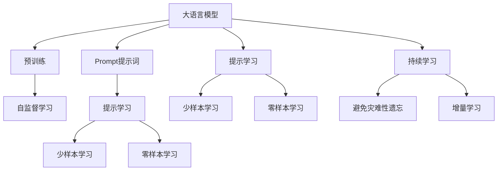
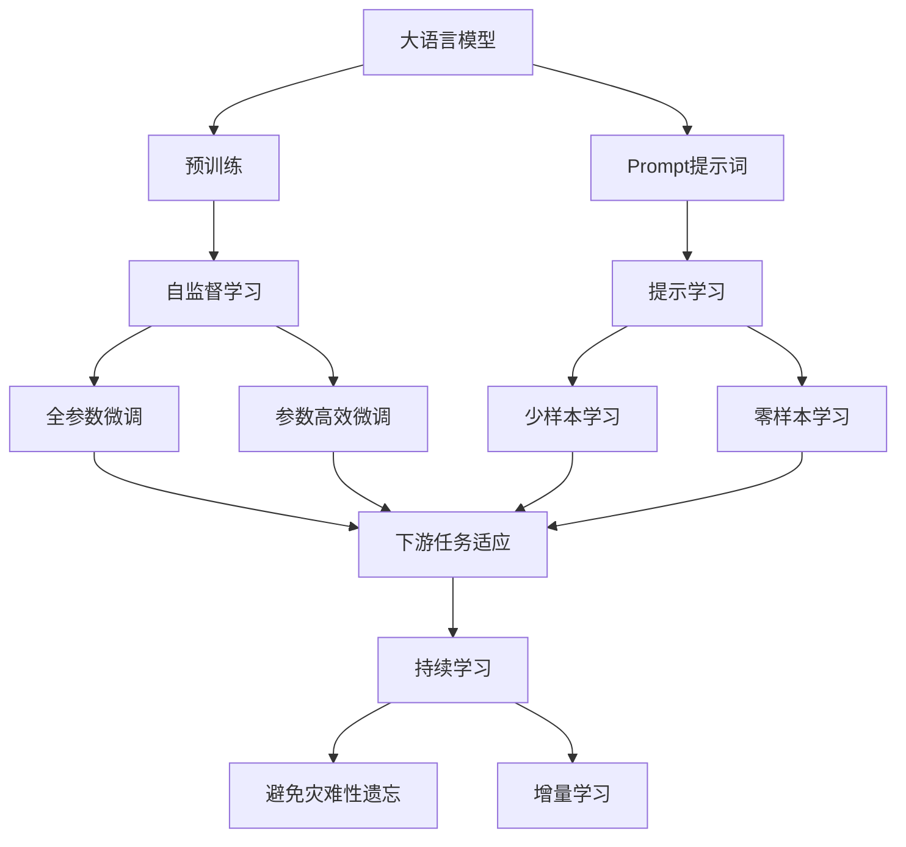
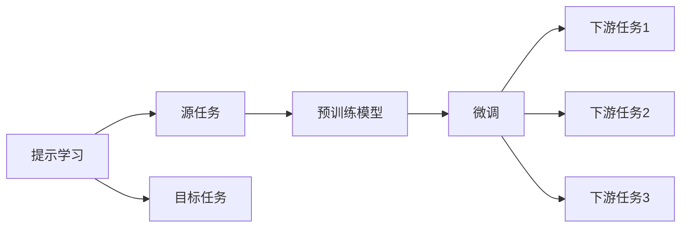
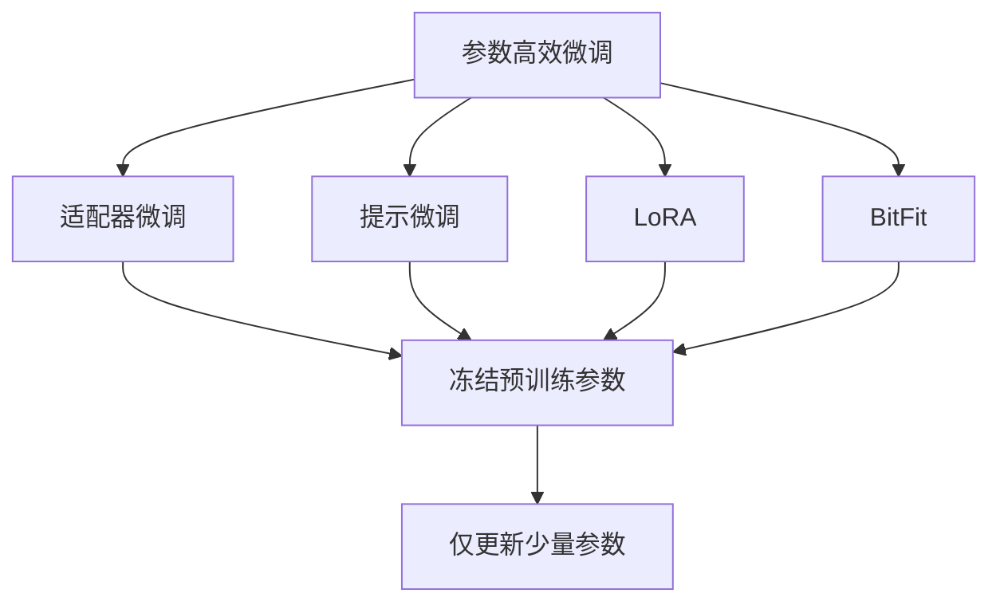
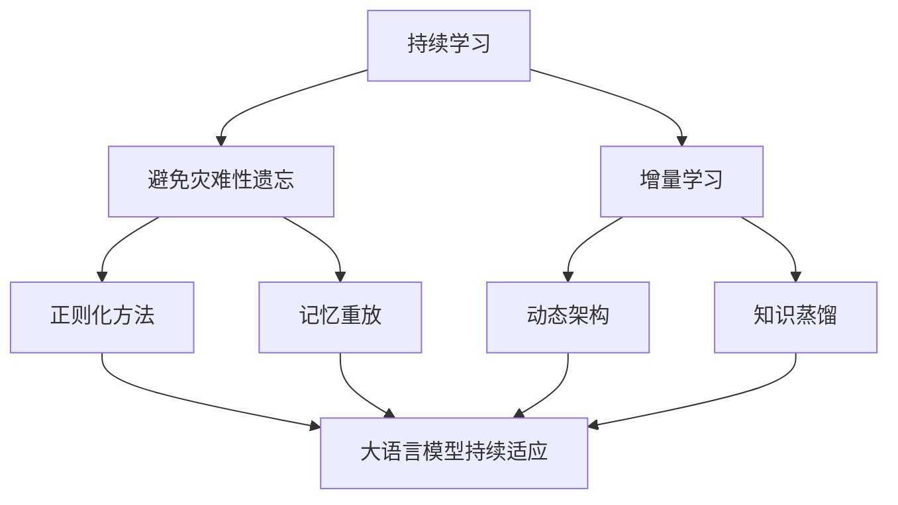
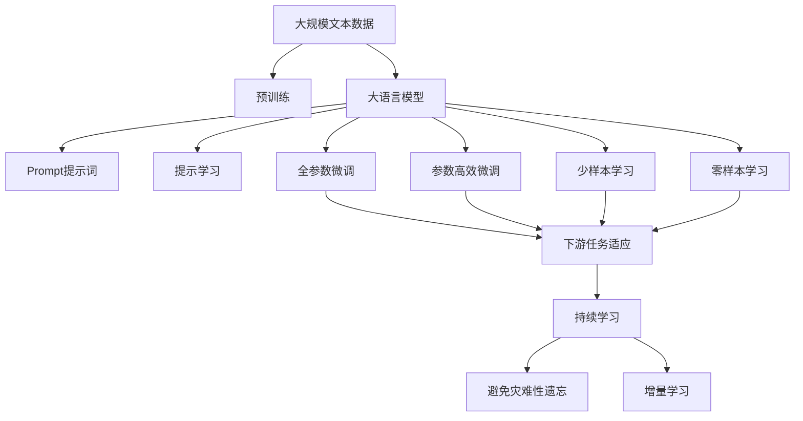

                 

# AI大模型Prompt提示词最佳实践：结合链式思维和少量示例

> 关键词：大语言模型、Prompt提示词、链式思维、提示学习、自然语言处理(NLP)

## 1. 背景介绍

### 1.1 问题由来
随着深度学习技术的飞速发展，大语言模型（Large Language Models, LLMs）在自然语言处理（Natural Language Processing, NLP）领域取得了显著进展。大模型如GPT-3、BERT等通过在大规模无标签文本数据上进行预训练，学习到了丰富的语言知识。然而，由于模型过于庞大，难以直接应用于实际任务，而且过大的模型参数增加了训练和推理的复杂性和资源消耗。

为解决这一问题，研究者们提出了Prompt提示词（Prompt Words）的方法。Prompt提示词是一种特殊的输入，用于指导大语言模型生成符合特定格式的输出。它通过在输入文本中添加特定的格式或结构，引导模型按照期望的方式推理和生成文本。Prompt提示词可以大幅提升大语言模型的性能，尤其是在小样本学习、零样本学习和少样本学习场景中，能够快速适应新任务，实现高效且准确的文本生成或推理。

Prompt提示词的应用场景非常广泛，包括文本生成、机器翻译、问答系统、摘要生成、对话系统等。它不仅可以用于简单的分类和回归任务，也可以扩展到更复杂的结构化推理和生成任务中。

### 1.2 问题核心关键点
Prompt提示词的核心思想在于通过精心的输入设计，引导大语言模型生成符合特定任务要求的输出。其关键点包括：

- **输入设计**：提示词的设计需要考虑模型的理解和推理能力，使其能够准确捕捉到任务的关键信息。
- **任务适配**：不同任务的提示词设计有所不同，需要根据任务类型和目标进行调整。
- **示例引导**：利用少量示例，帮助模型理解任务的本质，提高生成的准确性和鲁棒性。

Prompt提示词的方法在大模型微调中也得到了广泛应用，尤其是在小样本学习和零样本学习场景中，通过精心的输入设计，可以显著提高模型的性能。

### 1.3 问题研究意义
Prompt提示词在大语言模型中的应用，具有以下重要意义：

1. **降低资源消耗**：利用少量标注数据和提示词，可以快速训练出高性能的模型，降低训练和推理资源的消耗。
2. **提升模型效果**：通过精心设计的提示词，可以引导模型生成高质量的输出，适用于各种复杂的NLP任务。
3. **促进模型应用**：提示词方法使得大模型更易于部署和应用，加快了NLP技术的产业化进程。
4. **开拓新研究方向**：Prompt提示词的应用催生了提示学习、少样本学习、零样本学习等新的研究方向，丰富了NLP的研究领域。
5. **增强模型鲁棒性**：通过示例引导，模型能够更好地适应不同的数据分布和任务类型，提高模型的泛化能力和鲁棒性。

## 2. 核心概念与联系

### 2.1 核心概念概述

为了更好地理解Prompt提示词的应用，我们需要先介绍几个关键概念：

- **大语言模型（Large Language Model, LLM）**：以自回归（如GPT）或自编码（如BERT）模型为代表的大规模预训练语言模型。通过在大规模无标签文本数据上进行预训练，学习到丰富的语言知识和常识。
- **预训练（Pre-training）**：指在大规模无标签文本语料上，通过自监督学习任务训练通用语言模型的过程。常见的预训练任务包括语言模型、掩码语言模型等。
- **Prompt提示词（Prompt Words）**：输入文本中的特定格式或结构，用于引导大语言模型生成符合特定格式的输出。提示词可以包括文本、标签、示例等。
- **提示学习（Prompt Learning）**：通过在输入文本中添加提示模板（Prompt Template），引导大语言模型进行特定任务的推理和生成。可以在不更新模型参数的情况下，实现零样本或少样本学习。
- **少样本学习（Few-shot Learning）**：指在只有少量标注样本的情况下，模型能够快速适应新任务的学习方法。在大语言模型中，通常通过在输入中提供少量示例来实现，无需更新模型参数。
- **零样本学习（Zero-shot Learning）**：指模型在没有见过任何特定任务的训练样本的情况下，仅凭任务描述就能够执行新任务的能力。大语言模型通过预训练获得的广泛知识，使其能够理解任务指令并生成相应输出。
- **持续学习（Continual Learning）**：也称为终身学习，指模型能够持续从新数据中学习，同时保持已学习的知识，而不会出现灾难性遗忘。这对于保持大语言模型的时效性和适应性至关重要。

这些概念之间的逻辑关系可以通过以下Mermaid流程图来展示：



这个流程图展示了大语言模型、提示词、提示学习、少样本学习和零样本学习之间的关系：

1. 大语言模型通过预训练获得基础能力。
2. 提示学习利用提示词，在不更新模型参数的情况下，实现零样本和少样本学习。
3. 少样本学习和零样本学习分别适用于不同的数据量情况，均依赖于提示词设计。
4. 持续学习旨在使模型能够不断学习新知识，同时避免遗忘旧知识。

### 2.2 概念间的关系

这些核心概念之间存在着紧密的联系，形成了Prompt提示词的完整生态系统。下面我通过几个Mermaid流程图来展示这些概念之间的关系。

#### 2.2.1 大语言模型的学习范式



这个流程图展示了从预训练到提示学习的完整过程：

1. 大语言模型首先在大规模文本数据上进行预训练，学习通用语言知识。
2. 提示学习利用提示词，在不更新模型参数的情况下，实现少样本学习和零样本学习。
3. 全参数微调和参数高效微调方法用于在大模型上微调，适应特定任务。
4. 持续学习旨在使模型能够不断学习新知识，同时避免遗忘旧知识。

#### 2.2.2 提示学习与微调的关系



这个流程图展示了提示学习与微调的基本关系：

1. 提示学习利用提示词，在不更新模型参数的情况下，实现少样本学习和零样本学习。
2. 微调在大模型上微调，适应特定任务。
3. 提示学习与微调结合，可以实现更加灵活的NLP应用。

#### 2.2.3 参数高效微调方法



这个流程图展示了几种常见的参数高效微调方法，包括适配器微调、提示微调、LoRA和BitFit。这些方法的共同特点是冻结大部分预训练参数，只更新少量参数，从而提高微调效率。

#### 2.2.4 持续学习在大语言模型中的应用



这个流程图展示了持续学习在大语言模型中的应用。持续学习的主要目标是避免灾难性遗忘和实现增量学习。通过正则化方法、记忆重放、动态架构和知识蒸馏等技术，可以使大语言模型持续适应新的任务和数据。

### 2.3 核心概念的整体架构

最后，我们用一个综合的流程图来展示这些核心概念在大语言模型提示词微调过程中的整体架构：



这个综合流程图展示了从预训练到提示学习的完整过程。大语言模型首先在大规模文本数据上进行预训练，然后利用提示词进行提示学习，通过全参数微调和参数高效微调方法适应特定任务，并在提示学习中实现少样本学习和零样本学习。最后，通过持续学习技术，模型可以不断更新和适应新的任务和数据。

## 3. 核心算法原理 & 具体操作步骤
### 3.1 算法原理概述

Prompt提示词的应用基于大语言模型的迁移学习思想，其核心思想是：通过精心的输入设计，将大语言模型从一个任务迁移到另一个新任务，实现快速适应的效果。具体来说，提示词被用作输入文本的一部分，指导模型生成符合特定任务要求的输出。

形式化地，假设预训练模型为 $M_{\theta}$，其中 $\theta$ 为预训练得到的模型参数。给定下游任务 $T$ 的少量标注数据 $D=\{(x_i, y_i)\}_{i=1}^N, x_i \in \mathcal{X}, y_i \in \mathcal{Y}$，提示词 $P$ 被添加到输入文本 $x$ 中，生成提示输入 $P(x)$。提示学习目标是最小化以下损失函数：

$$
\mathcal{L}(P(\theta), D) = \frac{1}{N}\sum_{i=1}^N \ell(P(M_{\theta}(x_i), y_i))
$$

其中 $\ell$ 为针对任务 $T$ 设计的损失函数，用于衡量模型输出与真实标签之间的差异。常见的损失函数包括交叉熵损失、均方误差损失等。

### 3.2 算法步骤详解

基于Prompt提示词的迁移学习通常包括以下几个关键步骤：

**Step 1: 准备预训练模型和数据集**
- 选择合适的预训练语言模型 $M_{\theta}$ 作为初始化参数，如 BERT、GPT 等。
- 准备下游任务 $T$ 的少量标注数据集 $D$，划分为训练集、验证集和测试集。一般要求标注数据与预训练数据的分布不要差异过大。

**Step 2: 设计提示词和损失函数**
- 根据任务类型，设计合适的提示词 $P$。提示词可以包括文本、标签、示例等。
- 根据任务类型，选择合适的损失函数 $\ell$。分类任务通常使用交叉熵损失，回归任务使用均方误差损失等。

**Step 3: 设置微调超参数**
- 选择合适的优化算法及其参数，如 AdamW、SGD 等，设置学习率、批大小、迭代轮数等。
- 设置正则化技术及强度，包括权重衰减、Dropout、Early Stopping 等。
- 确定冻结预训练参数的策略，如仅微调顶层，或全部参数都参与微调。

**Step 4: 执行梯度训练**
- 将训练集数据分批次输入模型，前向传播计算损失函数。
- 反向传播计算参数梯度，根据设定的优化算法和学习率更新模型参数。
- 周期性在验证集上评估模型性能，根据性能指标决定是否触发 Early Stopping。
- 重复上述步骤直到满足预设的迭代轮数或 Early Stopping 条件。

**Step 5: 测试和部署**
- 在测试集上评估提示词微调后的模型 $P(M_{\hat{\theta}})$ 的性能，对比微调前后的精度提升。
- 使用微调后的模型对新样本进行推理预测，集成到实际的应用系统中。
- 持续收集新的数据，定期重新微调模型，以适应数据分布的变化。

以上是基于Prompt提示词的迁移学习的一般流程。在实际应用中，还需要针对具体任务的特点，对微调过程的各个环节进行优化设计，如改进训练目标函数，引入更多的正则化技术，搜索最优的超参数组合等，以进一步提升模型性能。

### 3.3 算法优缺点

基于Prompt提示词的迁移学习方法具有以下优点：

1. **简单高效**：只需准备少量标注数据，即可对预训练模型进行快速适配，获得较大的性能提升。
2. **通用适用**：适用于各种NLP下游任务，包括分类、匹配、生成等，设计简单的提示词即可实现微调。
3. **参数高效**：利用参数高效微调技术，在固定大部分预训练参数的情况下，仍可取得不错的提升。
4. **效果显著**：在学术界和工业界的诸多任务上，基于提示词的方法已经刷新了最先进的性能指标。

同时，该方法也存在一定的局限性：

1. **依赖标注数据**：提示词的性能很大程度上取决于标注数据的质量和数量，获取高质量标注数据的成本较高。
2. **迁移能力有限**：当目标任务与预训练数据的分布差异较大时，提示词的性能提升有限。
3. **负面效果传递**：预训练模型的固有偏见、有害信息等，可能通过提示词传递到下游任务，造成负面影响。
4. **可解释性不足**：提示词方法通常缺乏可解释性，难以对其推理逻辑进行分析和调试。

尽管存在这些局限性，但就目前而言，基于Prompt提示词的迁移学习方法仍是大语言模型应用的最主流范式。未来相关研究的重点在于如何进一步降低提示词对标注数据的依赖，提高模型的少样本学习和跨领域迁移能力，同时兼顾可解释性和伦理安全性等因素。

### 3.4 算法应用领域

基于Prompt提示词的迁移学习在NLP领域已经得到了广泛的应用，覆盖了几乎所有常见任务，例如：

- 文本分类：如情感分析、主题分类、意图识别等。通过提示词指导模型学习文本-标签映射。
- 命名实体识别：识别文本中的人名、地名、机构名等特定实体。通过提示词指导模型掌握实体边界和类型。
- 关系抽取：从文本中抽取实体之间的语义关系。通过提示词指导模型学习实体-关系三元组。
- 问答系统：对自然语言问题给出答案。将问题-答案对作为提示词，训练模型学习匹配答案。
- 机器翻译：将源语言文本翻译成目标语言。通过提示词指导模型学习语言-语言映射。
- 文本摘要：将长文本压缩成简短摘要。通过提示词指导模型抓取要点。
- 对话系统：使机器能够与人自然对话。通过提示词指导模型进行回复生成。

除了上述这些经典任务外，提示词方法也被创新性地应用到更多场景中，如可控文本生成、常识推理、代码生成、数据增强等，为NLP技术带来了全新的突破。随着预训练模型和提示词方法的不断进步，相信NLP技术将在更广阔的应用领域大放异彩。

## 4. 数学模型和公式 & 详细讲解  
### 4.1 数学模型构建

本节将使用数学语言对基于Prompt提示词的迁移学习过程进行更加严格的刻画。

记预训练语言模型为 $M_{\theta}$，其中 $\theta$ 为预训练得到的模型参数。假设提示词为 $P$，下游任务 $T$ 的训练集为 $D=\{(x_i, y_i)\}_{i=1}^N, x_i \in \mathcal{X}, y_i \in \mathcal{Y}$。

定义模型 $M_{\theta}$ 在输入 $x$ 上的输出为 $M_{\theta}(x)$，提示词 $P$ 在输入 $x$ 上的输出为 $P(x)$。提示学习目标是最小化以下损失函数：

$$
\mathcal{L}(P(\theta), D) = \frac{1}{N}\sum_{i=1}^N \ell(P(M_{\theta}(x_i), y_i))
$$

其中 $\ell$ 为针对任务 $T$ 设计的损失函数，用于衡量模型输出与真实标签之间的差异。常见的损失函数包括交叉熵损失、均方误差损失等。

### 4.2 公式推导过程

以下我们以二分类任务为例，推导交叉熵损失函数及其梯度的计算公式。

假设模型 $M_{\theta}$ 在输入 $x$ 上的输出为 $\hat{y}=M_{\theta}(x) \in [0,1]$，表示样本属于正类的概率。提示词 $P$ 在输入 $x$ 上的输出为 $P(x)$，表示提示词对模型输出的影响。真实标签 $y \in \{0,1\}$。则二分类交叉熵损失函数定义为：

$$
\ell(P(M_{\theta}(x),y) = -[y\log P(M_{\theta}(x)) + (1-y)\log (1-P(M_{\theta}(x))]
$$

将其代入提示学习目标公式，得：

$$
\mathcal{L}(P(\theta), D) = -\frac{1}{N}\sum_{i=1}^N [y_i\log P(M_{\theta}(x_i))+ (1-y_i)\log (1-P(M_{\theta}(x_i)])
$$

根据链式法则，损失函数对参数 $\theta_k$ 的梯度为：

$$
\frac{\partial \mathcal{L}(P(\theta), D)}{\partial \theta_k} = -\frac{1}{N}\sum_{i=1}^N [\frac{y_i}{P(M_{\theta}(x_i))}\frac{\partial P(M_{\theta}(x_i))}{\partial \theta_k} + \frac{1-y_i}{1-P(M_{\theta}(x_i))}\frac{\partial (1-P(M_{\theta}(x_i))}{\partial \theta_k}]
$$

其中 $\frac{\partial P(M_{\theta}(x_i))}{\partial \theta_k}$ 可进一步递归展开，利用自动微分技术完成计算。

在得到损失函数的梯度后，即可带入参数更新公式，完成模型的迭代优化。重复上述过程直至收敛，最终得到提示词微调后适应下游任务的最优模型参数 $\theta^*$。

## 5. 项目实践：代码实例和详细解释说明
### 5.1 开发环境搭建

在进行提示词微调实践前，我们需要准备好开发环境。以下是使用Python进行PyTorch开发的环境配置流程：

1. 安装Anaconda：从官网下载并安装Anaconda，用于创建独立的Python环境。

2. 创建并激活虚拟环境：
```bash
conda create -n pytorch-env python=3.8 
conda activate pytorch-env
```

3. 安装PyTorch：根据CUDA版本，从官网获取对应的安装命令。例如：
```bash
conda install pytorch torchvision torchaudio cudatoolkit=11.1 -c pytorch -c conda-forge
```

4. 安装Transformers库：
```bash
pip install transformers
```

5. 安装各类工具包：
```bash
pip install numpy pandas scikit-learn matplotlib tqdm jupyter notebook ipython
```

完成上述步骤后，即可在`pytorch-env`环境中开始提示词微调实践。

### 5.2 源代码详细实现

下面我以命名实体识别(NER)任务为例，给出使用Transformers库对BERT模型进行提示词微调的PyTorch代码实现。

首先，定义NER任务的数据处理函数：

```python
from transformers import BertTokenizer
from torch.utils.data import Dataset
import torch

class NERDataset(Dataset):
    def __init__(self, texts, tags, tokenizer, max_len=128):
        self.texts = texts
        self.tags = tags
        self.tokenizer = tokenizer
        self.max_len = max_len
        
    def __len__(self):
        return len(self.texts)
    
    def __getitem__(self, item):
        text = self.texts[item]
        tags = self.tags[item]
        
        encoding = self.tokenizer(text, return_tensors='pt', max_length=self.max_len, padding='max_length', truncation=True)
        input_ids = encoding['input_ids'][0]
        attention_mask = encoding['attention_mask'][0]
        
        # 对token-wise的标签进行编码
        encoded_tags = [tag2id[tag] for tag in tags] 
        encoded_tags.extend([tag2id['O']] * (self.max_len - len(encoded_tags)))
        labels = torch.tensor(encoded_tags, dtype=torch.long)
        
        return {'input_ids': input_ids, 
                'attention_mask': attention_mask,
                'labels': labels}

# 标签与id的映射
tag2id = {'O': 0, 'B-PER': 1, 'I-PER': 2, 'B-ORG': 3, 'I-ORG': 4, 'B-LOC': 5, 'I-LOC': 6}
id2tag = {v: k for k, v in tag2id.items()}

# 创建dataset
tokenizer = BertTokenizer.from_pretrained('bert-base-cased')

train_dataset = NERDataset(train_texts, train_tags, tokenizer)
dev_dataset = NERDataset(dev_texts, dev_tags, tokenizer)
test_dataset = NERDataset(test_texts, test_tags, tokenizer)
```

然后，定义模型和优化器：

```python
from transformers import BertForTokenClassification, AdamW

model = BertForTokenClassification.from_pretrained('bert-base-cased', num_labels=len(tag2id))

optimizer = AdamW(model.parameters(), lr=2e-5)
```

接着，定义训练和评估函数：

```python
from torch.utils.data import DataLoader
from tqdm import tqdm
from sklearn.metrics import classification_report

device = torch.device('cuda') if torch.cuda.is_available() else torch.device('cpu')
model.to(device)

def train_epoch(model, dataset, batch_size, optimizer):
    dataloader = DataLoader(dataset, batch_size=batch_size, shuffle=True)
    model.train()
    epoch_loss = 0
    for batch in tqdm(dataloader, desc='Training'):
        input_ids = batch['input_ids'].to(device)
        attention_mask = batch['attention_mask'].to(device)
        labels = batch['labels'].to(device)
        model.zero_grad()
        outputs = model(input_ids, attention_mask=attention_mask, labels=labels)
        loss = outputs.loss
        epoch_loss += loss.item()
        loss.backward()
        optimizer.step()
    return epoch_loss / len(dataloader)

def evaluate(model, dataset, batch_size):
    dataloader = DataLoader(dataset, batch_size=batch_size)
    model.eval()
    preds, labels = [], []
    with torch.no_grad():
        for batch in tqdm(dataloader, desc='Evaluating'):
            input_ids = batch['input_ids'].to(device)
            attention_mask = batch['attention_mask'].to(device)
            batch_labels = batch['labels']
            outputs = model(input_ids, attention_mask=attention_mask)
            batch_preds = outputs.logits.argmax(dim=2).to('cpu').tolist()
            batch_labels = batch_labels.to('cpu').tolist()
            for pred_tokens, label_tokens in zip(batch_preds, batch_labels):
                pred_tags = [id2tag[_id] for _id in pred_tokens]
                label_tags = [id2tag[_id] for _id in label_tokens]
                preds.append(pred_tags[:len(label_tags)])
                labels.append(label_tags)
                
    print(classification_report(labels, preds))
```

最后，启动训练流程并在测试集上评估：

```python
epochs = 5
batch_size = 16

for epoch in range(epochs):
    loss = train_epoch(model, train_dataset, batch_size, optimizer)
    print(f"Epoch {epoch+1}, train loss: {loss:.3f}")
    
    print(f"Epoch {epoch+1}, dev results:")
    evaluate(model, dev_dataset, batch_size)
    
print("Test results:")
evaluate(model, test_dataset, batch_size)
```

以上就是使用PyTorch对BERT进行命名实体识别任务提示词微调的完整代码实现。可以看到，得益于Transformers库的强大封装，我们可以用相对简洁的代码完成BERT模型的加载和微调。

### 5.3 代码解读与分析

让我们再详细解读一下关键代码的实现细节：

**NERDataset类**：
- `__init__`方法：初始化文本、标签、分词器等

