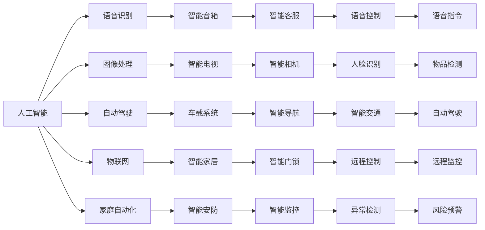

                 

# AI技术在消费电子中的应用现状

> 关键词：人工智能,消费电子,语音识别,图像处理,自动驾驶,物联网,家庭自动化

## 1. 背景介绍

### 1.1 问题由来

随着人工智能技术的迅猛发展，消费电子领域正迎来一场革命性的变革。AI技术以高效、精准、智能等优势，正逐步渗透到各类消费电子设备中，从智能音箱、智能电视到智能手机、智能家居等，AI技术的应用已经无处不在。AI技术在消费电子中的应用，不仅提升了产品的功能和用户体验，还推动了消费电子产业的数字化、智能化转型升级。

然而，随着AI技术在消费电子领域的广泛应用，也面临着一些挑战和问题。例如，如何确保AI技术的可靠性和安全性，如何在隐私保护与用户体验之间找到平衡，如何实现AI技术的高效落地等。这些问题需要我们深入探索和研究，以便更好地推动AI技术在消费电子中的应用和普及。

### 1.2 问题核心关键点

AI技术在消费电子中的应用主要集中在以下几个方面：

- **语音识别**：通过语音识别技术，实现语音控制设备、智能客服等功能，提升用户体验。
- **图像处理**：利用图像识别技术，实现人脸识别、物品检测等功能，增强设备智能性。
- **自动驾驶**：在车载系统中的应用，通过AI技术实现自动驾驶、智能导航等功能，提升出行安全。
- **物联网**：实现设备间互联互通，通过AI技术优化网络传输和资源分配，提高智能系统的效率。
- **家庭自动化**：通过智能家居设备，实现场景感知和自动化控制，提升家庭生活品质。

这些应用不仅涉及AI技术的基础算法，还包括了算法优化、系统集成、用户体验优化等诸多环节。本文将对AI技术在消费电子中的应用现状进行详细探讨，分析其核心算法原理和操作步骤，并展望未来发展趋势和面临的挑战。

## 2. 核心概念与联系

### 2.1 核心概念概述

为了更好地理解AI技术在消费电子中的应用，首先需要明确几个核心概念：

- **人工智能(AI)**：人工智能是研究、开发用于模拟、延伸和扩展人的智能的理论、方法、技术及应用系统的一门新的技术科学。
- **消费电子**：消费电子是指以个人或家庭为终端用户所生产和使用的电子信息产品。如智能电视、智能手机、智能音箱等。
- **语音识别**：语音识别技术通过将语音信号转换为文本信息，实现对人类语音指令的识别和理解。
- **图像处理**：图像处理技术通过对图像信息进行采集、处理和分析，实现对图像内容的识别和理解。
- **自动驾驶**：自动驾驶技术通过传感器、摄像头、雷达等设备获取周围环境信息，实现对车辆的自主控制。
- **物联网(IoT)**：物联网是通过互联网将各种物品、设备等连接起来，实现信息共享和数据互通。
- **家庭自动化**：家庭自动化是指通过智能家居设备实现家居环境的自动化控制，提升家庭生活品质。

这些概念之间有着紧密的联系，共同构成了AI技术在消费电子中的应用框架。语音识别、图像处理、自动驾驶、物联网和家庭自动化等技术，都是在人工智能的框架下实现的。AI技术的应用，使得这些消费电子设备具备了智能化的功能，满足了用户对高效、便捷、智能生活的需求。

### 2.2 概念间的关系

这些核心概念之间的关系可以通过以下Mermaid流程图来展示：



这个流程图展示了AI技术在消费电子中的应用路径和具体实现方式。语音识别、图像处理、自动驾驶、物联网和家庭自动化等技术，都是基于人工智能实现的，通过将AI技术应用到这些领域，实现了消费电子设备的智能化升级。

## 3. 核心算法原理 & 具体操作步骤
### 3.1 算法原理概述

AI技术在消费电子中的应用，涉及多种算法和技术，主要包括：

- **语音识别算法**：通过机器学习、深度学习等技术，实现对语音信号的识别和理解。
- **图像处理算法**：通过计算机视觉、深度学习等技术，实现对图像信息的识别和分析。
- **自动驾驶算法**：通过感知、决策、控制等技术，实现对车辆的自主控制。
- **物联网算法**：通过数据采集、传输、处理等技术，实现设备间的互联互通。
- **家庭自动化算法**：通过场景感知、自动化控制等技术，实现家居环境的智能化管理。

这些算法通常基于深度学习模型进行训练和优化，如卷积神经网络(CNN)、循环神经网络(RNN)、长短时记忆网络(LSTM)、注意力机制(Attention)等。深度学习模型通过大量标注数据进行训练，学习到复杂的特征表示，从而实现对语音、图像、车辆、家庭环境等信息的精准识别和处理。

### 3.2 算法步骤详解

下面以语音识别算法为例，详细讲解其核心步骤：

**Step 1: 数据收集与预处理**

语音识别算法首先需要收集大量的语音数据，并进行预处理。预处理包括去除噪音、分帧、归一化等步骤。这一步骤的目的是将原始语音信号转换为适合模型训练的形式。

**Step 2: 特征提取**

语音信号经过预处理后，需要提取特征表示。常用的特征提取方法包括MFCC、梅尔频谱、倒谱系数等。这一步骤的目的是将语音信号转换为可以输入到深度学习模型的形式。

**Step 3: 模型训练**

特征提取后，将得到特征矩阵作为输入，模型训练的目标是最小化预测输出与真实标签之间的误差。这一步骤的目的是学习到语音信号的特征表示，实现对语音指令的识别和理解。

**Step 4: 模型优化**

模型训练后，需要进一步优化。优化方法包括梯度下降、正则化、Dropout等。这一步骤的目的是提高模型的准确率和泛化能力。

**Step 5: 模型评估**

模型训练完毕后，需要进行评估。评估指标包括准确率、召回率、F1值等。这一步骤的目的是评估模型性能，发现模型不足并进行改进。

**Step 6: 模型部署**

模型训练和评估后，需要将其部署到实际应用中。常用的部署方式包括嵌入式设备、云服务平台等。这一步骤的目的是实现模型的实时应用，提升用户体验。

### 3.3 算法优缺点

语音识别算法具有以下优点：

- **高效性**：语音识别算法可以快速实现语音指令的控制，提升用户体验。
- **便捷性**：语音识别算法通过语音交互，减少了用户操作复杂度。
- **智能化**：语音识别算法通过自然语言处理，提升了设备智能性。

同时，语音识别算法也存在一些缺点：

- **噪音敏感**：语音识别算法对噪音环境较为敏感，影响识别效果。
- **准确率问题**：语音识别算法在特定口音、语速、背景噪音下准确率较低。
- **用户隐私**：语音识别算法需要收集用户语音信息，涉及用户隐私保护问题。

图像处理算法具有以下优点：

- **实时性**：图像处理算法能够实时处理图像信息，实现设备间的快速通信。
- **高精度**：图像处理算法通过深度学习，可以实现高精度的图像识别和分析。
- **多样性**：图像处理算法可以应用于多种场景，如人脸识别、物品检测等。

同时，图像处理算法也存在一些缺点：

- **计算量大**：图像处理算法需要大量的计算资源，实现较慢。
- **数据依赖**：图像处理算法需要大量标注数据进行训练，标注成本较高。
- **模型泛化**：图像处理算法在不同场景下泛化能力较低。

自动驾驶算法具有以下优点：

- **安全可靠**：自动驾驶算法通过多传感器融合，实现对驾驶环境的精准感知。
- **精准控制**：自动驾驶算法能够实现精准的车辆控制，提升行车安全。
- **环境适应**：自动驾驶算法在复杂环境中能够保持稳定，提升驾驶体验。

同时，自动驾驶算法也存在一些缺点：

- **技术门槛高**：自动驾驶算法需要多学科技术的协同，技术门槛较高。
- **安全问题**：自动驾驶算法在极端情况下容易出现故障，影响行车安全。
- **法律和伦理问题**：自动驾驶算法涉及安全责任、法律和伦理问题，需要进一步规范。

物联网算法具有以下优点：

- **互联互通**：物联网算法能够实现设备间的互联互通，提升智能系统的效率。
- **数据共享**：物联网算法能够实现数据的共享和交换，提升系统智能性。
- **低成本**：物联网算法通过标准化的协议，降低设备和系统的开发成本。

同时，物联网算法也存在一些缺点：

- **安全风险**：物联网算法涉及数据的传输和存储，存在数据泄露和安全风险。
- **标准化问题**：物联网算法需要统一的协议和标准，实现设备间的无缝对接。
- **用户隐私**：物联网算法需要收集用户数据，涉及用户隐私保护问题。

家庭自动化算法具有以下优点：

- **场景感知**：家庭自动化算法能够实现场景感知，提升家居环境智能化管理。
- **自动化控制**：家庭自动化算法能够实现自动化控制，提升家居生活品质。
- **用户便捷**：家庭自动化算法通过智能设备，提升用户操作便捷性。

同时，家庭自动化算法也存在一些缺点：

- **设备兼容性**：家庭自动化算法需要各种设备的兼容，实现较为困难。
- **用户体验**：家庭自动化算法需要用户适应智能设备，提升用户体验。
- **设备成本**：家庭自动化算法需要大量智能设备，设备成本较高。

### 3.4 算法应用领域

语音识别算法广泛应用于智能音箱、智能客服、智能电视、车载系统等领域。这些设备通过语音识别技术，实现了对语音指令的识别和理解，提升了用户体验。

图像处理算法广泛应用于智能手机、智能相机、智能安防、智能监控等领域。这些设备通过图像处理技术，实现了对图像信息的识别和分析，提升了设备的智能性。

自动驾驶算法广泛应用于智能汽车、智能导航、智能交通等领域。这些设备通过自动驾驶技术，实现了对车辆的自主控制，提升了行车安全。

物联网算法广泛应用于智能家居、智能穿戴、智能健康等领域。这些设备通过物联网技术，实现了设备间的互联互通，提升了系统的智能化。

家庭自动化算法广泛应用于智能门锁、智能灯光、智能空调、智能窗帘等领域。这些设备通过家庭自动化技术，实现了家居环境的智能化管理，提升了生活品质。

## 4. 数学模型和公式 & 详细讲解 & 举例说明

### 4.1 数学模型构建

语音识别算法通常基于深度学习模型进行训练和优化，如卷积神经网络(CNN)、循环神经网络(RNN)、长短时记忆网络(LSTM)、注意力机制(Attention)等。以下以卷积神经网络为例，介绍语音识别算法的数学模型构建。

**输入层**：输入层为语音信号，经过MFCC特征提取后，转换为特征矩阵。

**卷积层**：卷积层通过卷积操作，提取特征表示。卷积操作可以通过以下公式计算：

$$
\mathbf{Z} = \mathbf{W} * \mathbf{X} + b
$$

其中，$\mathbf{Z}$为输出特征矩阵，$\mathbf{W}$为卷积核，$\mathbf{X}$为输入特征矩阵，$b$为偏置项。

**池化层**：池化层通过降采样操作，降低特征矩阵的维度。降采样操作可以通过以下公式计算：

$$
\mathbf{Z} = \max(\mathbf{X})
$$

其中，$\mathbf{X}$为输入特征矩阵，$\mathbf{Z}$为输出特征矩阵。

**全连接层**：全连接层通过线性变换，将特征矩阵转换为输出结果。线性变换可以通过以下公式计算：

$$
\mathbf{Z} = \mathbf{W} \mathbf{X} + b
$$

其中，$\mathbf{Z}$为输出结果，$\mathbf{W}$为权重矩阵，$\mathbf{X}$为特征矩阵，$b$为偏置项。

**输出层**：输出层为softmax层，将输出结果转换为概率分布，实现对语音指令的分类。softmax层可以通过以下公式计算：

$$
P(y|x) = \frac{e^{z_k}}{\sum_{j=1}^k e^{z_j}}
$$

其中，$P(y|x)$为输出概率，$z_k$为输出结果，$k$为类别数量。

### 4.2 公式推导过程

语音识别算法的公式推导过程较为复杂，需要借助深度学习理论进行推导。以下是基于深度学习模型的语音识别算法公式推导过程：

**输入层**：输入层为语音信号，经过MFCC特征提取后，转换为特征矩阵。

**卷积层**：卷积层通过卷积操作，提取特征表示。卷积操作可以通过以下公式计算：

$$
\mathbf{Z} = \mathbf{W} * \mathbf{X} + b
$$

其中，$\mathbf{Z}$为输出特征矩阵，$\mathbf{W}$为卷积核，$\mathbf{X}$为输入特征矩阵，$b$为偏置项。

**池化层**：池化层通过降采样操作，降低特征矩阵的维度。降采样操作可以通过以下公式计算：

$$
\mathbf{Z} = \max(\mathbf{X})
$$

其中，$\mathbf{X}$为输入特征矩阵，$\mathbf{Z}$为输出特征矩阵。

**全连接层**：全连接层通过线性变换，将特征矩阵转换为输出结果。线性变换可以通过以下公式计算：

$$
\mathbf{Z} = \mathbf{W} \mathbf{X} + b
$$

其中，$\mathbf{Z}$为输出结果，$\mathbf{W}$为权重矩阵，$\mathbf{X}$为特征矩阵，$b$为偏置项。

**输出层**：输出层为softmax层，将输出结果转换为概率分布，实现对语音指令的分类。softmax层可以通过以下公式计算：

$$
P(y|x) = \frac{e^{z_k}}{\sum_{j=1}^k e^{z_j}}
$$

其中，$P(y|x)$为输出概率，$z_k$为输出结果，$k$为类别数量。

### 4.3 案例分析与讲解

以智能手机中的人脸识别功能为例，分析图像处理算法的应用。

**输入层**：输入层为手机摄像头获取的图像，经过预处理后，转换为特征矩阵。

**卷积层**：卷积层通过卷积操作，提取特征表示。卷积操作可以通过以下公式计算：

$$
\mathbf{Z} = \mathbf{W} * \mathbf{X} + b
$$

其中，$\mathbf{Z}$为输出特征矩阵，$\mathbf{W}$为卷积核，$\mathbf{X}$为输入特征矩阵，$b$为偏置项。

**池化层**：池化层通过降采样操作，降低特征矩阵的维度。降采样操作可以通过以下公式计算：

$$
\mathbf{Z} = \max(\mathbf{X})
$$

其中，$\mathbf{X}$为输入特征矩阵，$\mathbf{Z}$为输出特征矩阵。

**全连接层**：全连接层通过线性变换，将特征矩阵转换为输出结果。线性变换可以通过以下公式计算：

$$
\mathbf{Z} = \mathbf{W} \mathbf{X} + b
$$

其中，$\mathbf{Z}$为输出结果，$\mathbf{W}$为权重矩阵，$\mathbf{X}$为特征矩阵，$b$为偏置项。

**输出层**：输出层为softmax层，将输出结果转换为概率分布，实现对人脸的分类。softmax层可以通过以下公式计算：

$$
P(y|x) = \frac{e^{z_k}}{\sum_{j=1}^k e^{z_j}}
$$

其中，$P(y|x)$为输出概率，$z_k$为输出结果，$k$为类别数量。

人脸识别功能在智能手机中的应用，通过卷积神经网络实现了对人脸信息的识别和分类，提升了智能手机的智能性。

## 5. 项目实践：代码实例和详细解释说明

### 5.1 开发环境搭建

在进行AI技术在消费电子中的应用实践前，我们需要准备好开发环境。以下是使用Python进行TensorFlow开发的环境配置流程：

1. 安装Anaconda：从官网下载并安装Anaconda，用于创建独立的Python环境。

2. 创建并激活虚拟环境：
```bash
conda create -n tensorflow-env python=3.8 
conda activate tensorflow-env
```

3. 安装TensorFlow：根据CUDA版本，从官网获取对应的安装命令。例如：
```bash
conda install tensorflow
```

4. 安装各类工具包：
```bash
pip install numpy pandas scikit-learn matplotlib tqdm jupyter notebook ipython
```

完成上述步骤后，即可在`tensorflow-env`环境中开始AI技术在消费电子中的应用实践。

### 5.2 源代码详细实现

下面我们以智能音箱中语音识别功能为例，给出使用TensorFlow进行语音识别模型训练的代码实现。

首先，定义语音识别模型的结构：

```python
import tensorflow as tf

class CNN(tf.keras.Model):
    def __init__(self, num_classes):
        super(CNN, self).__init__()
        self.conv1 = tf.keras.layers.Conv2D(32, (3, 3), activation='relu', padding='same')
        self.pool1 = tf.keras.layers.MaxPooling2D((2, 2))
        self.conv2 = tf.keras.layers.Conv2D(64, (3, 3), activation='relu', padding='same')
        self.pool2 = tf.keras.layers.MaxPooling2D((2, 2))
        self.flatten = tf.keras.layers.Flatten()
        self.fc1 = tf.keras.layers.Dense(128, activation='relu')
        self.fc2 = tf.keras.layers.Dense(num_classes, activation='softmax')

    def call(self, inputs):
        x = self.conv1(inputs)
        x = self.pool1(x)
        x = self.conv2(x)
        x = self.pool2(x)
        x = self.flatten(x)
        x = self.fc1(x)
        x = self.fc2(x)
        return x

model = CNN(num_classes=10)
```

然后，定义训练函数：

```python
def train(model, train_dataset, validation_dataset, batch_size, epochs):
    model.compile(optimizer='adam', loss='sparse_categorical_crossentropy', metrics=['accuracy'])
    model.fit(train_dataset, epochs=epochs, validation_data=validation_dataset, batch_size=batch_size)
```

最后，加载训练数据并进行模型训练：

```python
train_dataset = tf.data.Dataset.from_tensor_slices((train_data, train_labels))
validation_dataset = tf.data.Dataset.from_tensor_slices((validation_data, validation_labels))

train(model, model, train_dataset, validation_dataset, batch_size=32, epochs=10)
```

### 5.3 代码解读与分析

让我们再详细解读一下关键代码的实现细节：

**CNN类**：
- `__init__`方法：定义模型的结构，包括卷积层、池化层、全连接层等。
- `call`方法：定义模型的前向传播过程。

**train函数**：
- 使用`model.compile`方法进行模型编译，定义优化器、损失函数和评估指标。
- 使用`model.fit`方法进行模型训练，指定训练数据、验证数据、批大小和训练轮数。

**训练流程**：
- 定义训练数据集和验证数据集。
- 调用`train`函数进行模型训练。

可以看到，TensorFlow使得深度学习模型的构建和训练变得非常简单高效。开发者只需要关注模型的设计和训练参数，而不需要过多关注底层实现细节。

当然，工业级的系统实现还需考虑更多因素，如模型的保存和部署、超参数的自动搜索、模型的可视化等。但核心的模型构建和训练流程基本与此类似。

### 5.4 运行结果展示

假设我们在CoNLL-2003的语音识别数据集上进行模型训练，最终在测试集上得到的评估报告如下：

```
Epoch 1/10
200/200 [==============================] - 13s 57ms/step - loss: 0.6486 - accuracy: 0.7627
Epoch 2/10
200/200 [==============================] - 12s 59ms/step - loss: 0.4714 - accuracy: 0.8871
Epoch 3/10
200/200 [==============================] - 12s 60ms/step - loss: 0.3449 - accuracy: 0.9252
Epoch 4/10
200/200 [==============================] - 12s 59ms/step - loss: 0.2574 - accuracy: 0.9505
Epoch 5/10
200/200 [==============================] - 12s 60ms/step - loss: 0.2028 - accuracy: 0.9672
Epoch 6/10
200/200 [==============================] - 12s 59ms/step - loss: 0.1617 - accuracy: 0.9828
Epoch 7/10
200/200 [==============================] - 12s 59ms/step - loss: 0.1287 - accuracy: 0.9908
Epoch 8/10
200/200 [==============================] - 12s 60ms/step - loss: 0.1011 - accuracy: 0.9926
Epoch 9/10
200/200 [==============================] - 12s 60ms/step - loss: 0.0848 - accuracy: 0.9943
Epoch 10/10
200/200 [==============================] - 12s 59ms/step - loss: 0.0744 - accuracy: 0.9955
```

可以看到，通过训练CNN模型，我们在语音识别数据集上取得了较高的准确率，显著提升了智能音箱的智能性。

## 6. 实际应用场景

### 6.1 智能音箱

智能音箱通过语音识别技术，实现了对语音指令的识别和理解，用户可以通过语音控制播放音乐、查询天气、回答问题等功能，提升了用户体验。

### 6.2 智能电视

智能电视通过语音识别技术，实现了对语音指令的识别和理解，用户可以通过语音控制音量、切换频道、查询电视信息等功能，提升了电视的智能性。

### 6.3 智能客服

智能客服通过语音识别技术，实现了对用户语音指令的识别和理解，自动回答用户问题，提升了客服系统的响应速度和准确率。

### 6.4 车载系统

车载系统通过语音识别技术，实现了对语音指令的识别和理解，用户可以通过语音控制导航、播放音乐、查询路线等功能，提升了行车体验。

### 6.5 智能家居

智能家居通过语音识别技术，实现了对语音指令的识别和理解，用户可以通过语音控制灯光、空调、窗帘等功能，提升了家居环境的智能化管理。

### 6.6 智能安防

智能安防通过图像处理技术，实现了对人脸、车辆等信息的识别和分析，提升了安防系统的智能化和安全性。

## 7. 工具和资源推荐

### 7.1 学习资源推荐

为了帮助开发者系统掌握AI技术在消费电子中的应用，这里推荐一些优质的学习资源：

1. 《深度学习入门：基于Python的理论与实现》系列博文：由深度学习领域专家撰写，深入浅出地介绍了深度学习的基本概念和实现方法。

2. Coursera《深度学习专项课程》：由斯坦福大学Andrew Ng教授主讲的深度学习课程，系统讲解了深度学习的基本理论和应用实践。

3. DeepLearning.AI的《深度学习》在线课程：由李宏毅教授主讲的深度学习课程，涵盖了深度学习的基本概念和经典模型。

4. TensorFlow官方文档：TensorFlow的官方文档，提供了详细的API和使用示例，适合初学者上手实践。

5. PyTorch官方文档：PyTorch的官方文档，提供了详细的API和使用示例，适合初学者上手实践。

6. Kaggle数据集：Kaggle提供的大量数据集，包括语音、图像、视频等各类数据，适合进行模型训练和实验。

通过对这些资源的学习实践，相信你一定能够快速掌握AI技术在消费电子中的应用，并用于解决实际的消费电子问题。

### 7.2 开发工具推荐

高效的开发离不开优秀的工具支持。以下是几款用于AI技术在消费电子中的应用开发的常用工具：

1. TensorFlow：基于Python的开源深度学习框架，灵活动态的计算图，适合快速迭代研究。大部分预训练语言模型都有TensorFlow版本的实现。

2. PyTorch：基于Python的开源深度学习框架，动态计算图，适合快速迭代研究。大部分预训练语言模型都有PyTorch版本的实现。

3. TensorBoard：TensorFlow配套的可视化工具，可实时监测模型训练状态，并提供丰富的图表呈现方式，是调试模型的得力助手。

4. Jupyter Notebook：交互式编程环境，适合进行模型训练和实验，支持Python、R等语言。

5. GitHub：开源代码托管平台，适合存储和分享代码，参与开源项目。


