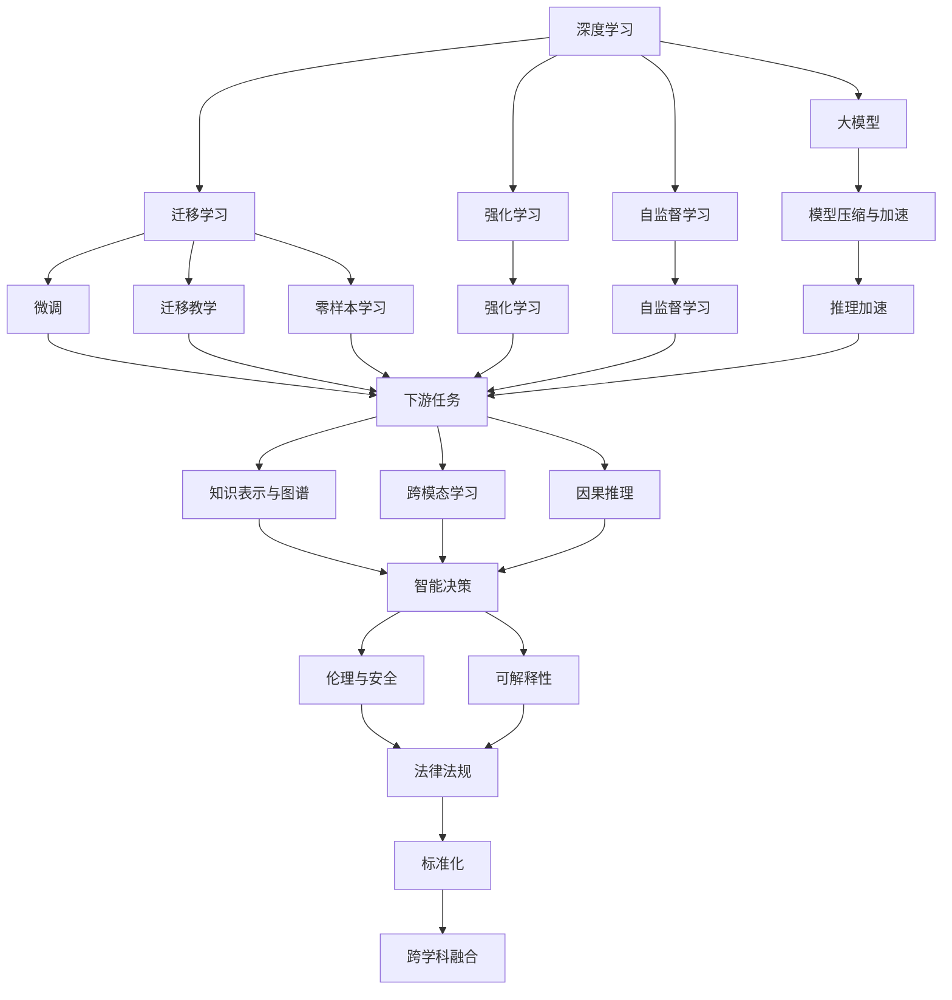

                 

# AI技术趋势与场景应用

> 关键词：
## 1. 背景介绍

### 1.1 问题由来
人工智能(AI)技术作为21世纪最重要的科技革命之一，正深刻改变着我们的生产和生活方式。从早期的专家系统、机器学习，到近年来深度学习、强化学习的爆发式发展，AI技术在图像识别、自然语言处理、语音识别等领域取得了显著突破，推动了智能系统在各个行业的应用落地。

AI技术的迅猛发展，离不开学界的持续探索和产业界的广泛应用。从1950年代提出图灵测试到如今深度学习、大模型和大数据的横空出世，AI技术逐步走向实用化、产业化。其中，深度学习技术因其强大的表征学习能力，成为当前AI研究的主流方向，而大模型则是在深度学习基础上的进一步突破，展现了更广泛的应用前景。

### 1.2 问题核心关键点
AI技术目前的发展现状和未来趋势，可以从以下几个核心关键点进行总结：

1. **大模型的崛起**：自OpenAI的GPT-3发布以来，预训练大模型通过在海量数据上进行自监督预训练，在通用领域如自然语言处理、计算机视觉、语音识别等方面取得了显著效果，成为当前AI技术的重要基础。
2. **数据和计算资源的驱动**：AI技术的进步离不开大量数据和计算资源的支持。在深度学习时代，海量标注数据和大规模分布式计算成为推动AI技术发展的关键因素。
3. **跨学科融合**：AI技术正逐渐与各个学科交叉融合，如医疗、教育、金融、交通等领域，形成了多学科协同创新的新格局。
4. **伦理和安全性问题**：AI技术的广泛应用带来了新的伦理和安全挑战，如算法透明性、偏见消除、隐私保护等，成为当前AI研究的热点问题。
5. **可解释性与因果推理**：随着AI技术的复杂度增加，如何使模型决策过程可解释、可审计，并引入因果推理，确保模型输出的可靠性，成为未来AI技术发展的关键方向。

### 1.3 问题研究意义
AI技术的发展对现代社会的影响深远，其核心研究意义主要体现在以下几个方面：

1. **提升生产力**：AI技术在自动化、智能制造、物流等领域的应用，极大地提升了生产效率和产品质量。
2. **改善生活质量**：智能医疗、智能家居、智能交通等应用，显著改善了人类的生活质量。
3. **推动经济增长**：AI技术在各个行业的广泛应用，创造了大量新产业、新业态和新就业机会。
4. **促进科学进步**：AI技术在科学研究和实验中得到应用，加速了基础科学的突破。
5. **推动社会变革**：AI技术在公共安全、环境保护、应急响应等方面，提高了社会治理能力和公共服务水平。

## 2. 核心概念与联系

### 2.1 核心概念概述

为了更好地理解AI技术的整体趋势，本节将介绍几个关键的核心概念，并展示它们之间的联系。

#### 2.1.1 深度学习

深度学习是AI技术的一个重要分支，通过构建多层神经网络，对数据进行层次化表征，从而实现复杂的模式识别和预测。深度学习在图像识别、自然语言处理、语音识别等领域取得了显著效果。

#### 2.1.2 大模型

大模型是指在深度学习基础上，通过大规模分布式计算和海量数据训练而成的预训练模型，如GPT、BERT等。大模型在通用领域展示了强大的表征学习能力，成为当前AI技术的重要基础。

#### 2.1.3 迁移学习

迁移学习是指将一个领域学习到的知识迁移到另一个领域的过程。在AI技术中，迁移学习可以通过微调、迁移教学、零样本学习等方式实现。大模型通过迁移学习，可以在下游任务上取得更好的表现。

#### 2.1.4 强化学习

强化学习是AI技术的另一个重要分支，通过智能体与环境交互，通过奖励和惩罚信号，优化策略和行为，实现决策优化。强化学习在游戏、机器人控制、自然语言生成等领域有广泛应用。

#### 2.1.5 自监督学习

自监督学习是指利用无标签数据进行训练，自动学习数据的隐含规律。自监督学习在图像识别、语音识别、自然语言处理等领域有广泛应用。

#### 2.1.6 模型压缩与加速

模型压缩与加速是指通过剪枝、量化、低秩分解等技术，减小模型规模，提高模型推理速度和效率。模型压缩与加速在大规模模型训练和推理中尤为重要。

#### 2.1.7 知识表示与图谱

知识表示与图谱是指通过符号化的方式表示知识，构建知识图谱，实现知识推理和查询。知识表示与图谱在自然语言处理、知识图谱等领域有重要应用。

#### 2.1.8 跨模态学习

跨模态学习是指将不同模态的数据（如文本、图像、声音）融合，实现跨模态的表示学习。跨模态学习在多模态交互、跨模态检索等领域有广泛应用。

#### 2.1.9 因果推理

因果推理是指通过识别和建模因果关系，推断变量之间的依赖关系，提高模型的解释能力和鲁棒性。因果推理在智能决策、智能控制等领域有重要应用。

#### 2.1.10 伦理与安全

伦理与安全是指在AI技术应用中，如何确保算法的透明性、公平性、隐私保护等问题。伦理与安全在医疗、金融、司法等领域尤为重要。

#### 2.1.11 可解释性

可解释性是指使AI模型决策过程透明、可解释、可审计，确保模型输出的可靠性。可解释性在医疗、金融、司法等领域尤为重要。

#### 2.1.12 跨学科融合

跨学科融合是指AI技术与其他学科交叉融合，形成跨学科协同创新的新格局。跨学科融合在医疗、教育、金融等领域有重要应用。

#### 2.1.13 技术标准化

技术标准化是指在AI技术领域，制定统一的技术标准和规范，确保技术的可复用性和互操作性。技术标准化在云计算、物联网等领域有重要应用。

这些核心概念共同构成了AI技术的核心框架，涵盖了从数据到模型、从算法到应用的全方位内容，为AI技术的发展和应用提供了坚实的理论基础和实践指导。

### 2.2 核心概念间的联系

通过一个简单的Mermaid流程图，我们可以直观展示这些核心概念之间的联系：



这个流程图展示了深度学习、大模型等核心概念之间相互联系，以及如何通过迁移学习、自监督学习、强化学习等技术，进一步推动AI技术在各个领域的应用。

## 3. 核心算法原理 & 具体操作步骤

### 3.1 算法原理概述

AI技术的核心算法原理主要基于统计学习理论，通过构建模型，利用数据进行训练，从而实现对新数据的预测和推理。

具体而言，AI技术主要分为以下几个步骤：

1. **数据准备**：收集和处理数据，进行数据增强、清洗和预处理，确保数据的质量和多样性。
2. **模型选择**：选择合适的算法模型，如深度学习、大模型、强化学习等，根据任务特点选择不同的模型架构。
3. **模型训练**：利用数据对模型进行训练，通过前向传播和反向传播更新模型参数，最小化损失函数。
4. **模型评估**：在验证集上评估模型性能，选择合适的超参数和模型结构。
5. **模型应用**：在测试集上评估模型性能，部署模型到实际应用场景中，实现数据驱动的智能决策。

### 3.2 算法步骤详解

#### 3.2.1 数据准备

数据准备是AI模型训练的基础。通常需要收集和处理大规模数据，并进行数据增强、清洗和预处理。

**数据增强**：通过旋转、裁剪、缩放等变换，增加数据样本的多样性，提高模型的鲁棒性。

**数据清洗**：去除噪声数据、缺失值和异常值，确保数据的纯净度。

**数据预处理**：将数据转换为模型所需的格式，如归一化、标准化、特征工程等。

#### 3.2.2 模型选择

模型选择是AI技术的重要环节。通常需要根据任务特点选择合适的算法模型。

**深度学习**：适合处理大规模数据和复杂结构化数据，适用于图像识别、自然语言处理等任务。

**大模型**：适合处理通用领域的数据，通过自监督预训练，学习通用的语言和图像表示。

**强化学习**：适合处理智能决策和控制任务，通过与环境交互，优化策略和行为。

**自监督学习**：适合处理无标签数据，自动学习数据的隐含规律。

#### 3.2.3 模型训练

模型训练是AI技术的关键步骤。通常需要选择合适的优化器，如SGD、Adam等，设置合适的学习率和迭代轮数。

**优化器**：选择合适的优化器及其参数，如AdamW、Adagrad等。

**学习率**：选择合适的学习率，避免过拟合和欠拟合。

**迭代轮数**：设置合适的迭代轮数，确保模型充分训练。

#### 3.2.4 模型评估

模型评估是AI技术的评估环节。通常需要选择合适的评估指标，如准确率、召回率、F1分数等。

**评估指标**：选择合适的评估指标，如准确率、召回率、F1分数等。

**验证集**：使用验证集评估模型性能，选择最优的模型结构和超参数。

#### 3.2.5 模型应用

模型应用是AI技术的最终环节。通常需要将模型部署到实际应用场景中，实现数据驱动的智能决策。

**部署环境**：选择合适的部署环境，如云平台、本地服务器等。

**模型推理**：实现模型的推理和预测，部署到实际应用场景中。

### 3.3 算法优缺点

#### 3.3.1 优点

AI技术的优点主要体现在以下几个方面：

1. **自动化**：AI技术可以自动化处理大量的数据和任务，提高生产效率。
2. **精度高**：AI技术通过大量数据训练，可以实现高精度的预测和推理。
3. **泛化能力强**：AI技术可以处理大规模数据和复杂结构化数据，具有较强的泛化能力。
4. **适应性强**：AI技术可以适应不同的应用场景，具有较强的通用性。

#### 3.3.2 缺点

AI技术的缺点主要体现在以下几个方面：

1. **数据依赖**：AI技术需要大量标注数据进行训练，数据依赖性强。
2. **计算资源需求高**：AI技术需要大量的计算资源进行训练和推理，成本较高。
3. **可解释性差**：AI模型往往是"黑盒"系统，难以解释其内部工作机制和决策逻辑。
4. **模型偏见**：AI模型可能存在模型偏见，导致不公平和歧视性的输出。
5. **安全性问题**：AI模型可能存在安全性问题，如对抗样本攻击、数据泄露等。

### 3.4 算法应用领域

AI技术在各个领域都有广泛的应用，以下列举几个主要应用领域：

#### 3.4.1 医疗健康

AI技术在医疗健康领域有广泛应用，如智能诊断、医学影像分析、个性化治疗等。

**智能诊断**：通过AI技术，可以实现疾病诊断、病理分析、手术辅助等功能。

**医学影像分析**：通过AI技术，可以实现医学影像的自动分析，提高诊断精度和效率。

**个性化治疗**：通过AI技术，可以实现个性化用药、个性化治疗方案的设计。

#### 3.4.2 智能制造

AI技术在智能制造领域有广泛应用，如智能生产、智能物流、智能检测等。

**智能生产**：通过AI技术，可以实现生产过程的自动化和智能化，提高生产效率和产品质量。

**智能物流**：通过AI技术，可以实现物流管理的智能化和自动化，提高物流效率和准确性。

**智能检测**：通过AI技术，可以实现产品的智能检测和质量控制，提高检测精度和效率。

#### 3.4.3 金融服务

AI技术在金融服务领域有广泛应用，如智能风控、智能投顾、金融舆情分析等。

**智能风控**：通过AI技术，可以实现贷款审批、信用评估、风险预警等功能。

**智能投顾**：通过AI技术，可以实现智能投资组合、智能投资策略、智能风险控制等功能。

**金融舆情分析**：通过AI技术，可以实现金融舆情的实时监测和分析，提供投资建议和风险预警。

#### 3.4.4 智能交通

AI技术在智能交通领域有广泛应用，如智能导航、智能调度、智能监控等。

**智能导航**：通过AI技术，可以实现智能路线规划、实时路况分析、智能导航等功能。

**智能调度**：通过AI技术，可以实现交通流量的智能调度和优化，提高交通效率。

**智能监控**：通过AI技术，可以实现交通事件的智能监控和预警，提高交通安全。

#### 3.4.5 智能家居

AI技术在智能家居领域有广泛应用，如智能控制、智能安防、智能娱乐等。

**智能控制**：通过AI技术，可以实现智能灯光、智能家电、智能温控等功能。

**智能安防**：通过AI技术，可以实现智能监控、智能识别、智能报警等功能。

**智能娱乐**：通过AI技术，可以实现智能推荐、智能交互、智能播放等功能。

## 4. 数学模型和公式 & 详细讲解 & 举例说明

### 4.1 数学模型构建

#### 4.1.1 深度学习模型

深度学习模型主要基于神经网络，通过多层次的神经元组合，实现复杂的数据表示和模式识别。常见的深度学习模型包括全连接神经网络、卷积神经网络、循环神经网络等。

#### 4.1.2 大模型预训练

大模型预训练主要通过自监督学习任务，如掩码语言模型、图像预训练等，在大规模无标签数据上进行训练，学习通用的语言和图像表示。

#### 4.1.3 迁移学习

迁移学习是指将一个领域学习到的知识迁移到另一个领域的过程。通常通过微调、迁移教学、零样本学习等方式实现。

#### 4.1.4 强化学习模型

强化学习模型主要基于智能体与环境的交互，通过奖励和惩罚信号，优化策略和行为。常见的强化学习模型包括Q-learning、策略梯度等。

#### 4.1.5 自监督学习模型

自监督学习模型主要通过无标签数据进行训练，自动学习数据的隐含规律。常见的自监督学习模型包括自编码器、自回归模型等。

#### 4.1.6 模型压缩与加速

模型压缩与加速主要通过剪枝、量化、低秩分解等技术，减小模型规模，提高模型推理速度和效率。常见的模型压缩与加速技术包括剪枝、量化、低秩分解等。

#### 4.1.7 知识表示与图谱

知识表示与图谱主要通过符号化的方式表示知识，构建知识图谱，实现知识推理和查询。常见的知识表示与图谱模型包括RDF、OWL、RNN等。

#### 4.1.8 跨模态学习模型

跨模态学习模型主要通过融合不同模态的数据，实现跨模态的表示学习。常见的跨模态学习模型包括多模态深度学习模型、跨模态深度学习模型等。

#### 4.1.9 因果推理模型

因果推理模型主要通过识别和建模因果关系，推断变量之间的依赖关系，提高模型的解释能力和鲁棒性。常见的因果推理模型包括因果图模型、因果贝叶斯网络等。

#### 4.1.10 伦理与安全模型

伦理与安全模型主要通过引入伦理导向的评估指标，过滤和惩罚有偏见、有害的输出倾向，确保模型输出的可靠性。常见的伦理与安全模型包括公平性评估模型、隐私保护模型等。

#### 4.1.11 可解释性模型

可解释性模型主要通过使模型决策过程透明、可解释、可审计，确保模型输出的可靠性。常见的可解释性模型包括可解释深度学习模型、可解释强化学习模型等。

#### 4.1.12 跨学科融合模型

跨学科融合模型主要通过与其他学科交叉融合，形成跨学科协同创新的新格局。常见的跨学科融合模型包括跨学科深度学习模型、跨学科强化学习模型等。

#### 4.1.13 技术标准化模型

技术标准化模型主要通过制定统一的技术标准和规范，确保技术的可复用性和互操作性。常见的技术标准化模型包括技术标准制定模型、技术规范制定模型等。

这些数学模型和大模型预训练的公式和理论，为AI技术的发展提供了坚实的数学基础和理论支撑。

### 4.2 公式推导过程

#### 4.2.1 深度学习模型

深度学习模型主要基于神经网络，通过多层次的神经元组合，实现复杂的数据表示和模式识别。常见的深度学习模型包括全连接神经网络、卷积神经网络、循环神经网络等。

#### 4.2.2 大模型预训练

大模型预训练主要通过自监督学习任务，如掩码语言模型、图像预训练等，在大规模无标签数据上进行训练，学习通用的语言和图像表示。

#### 4.2.3 迁移学习

迁移学习是指将一个领域学习到的知识迁移到另一个领域的过程。通常通过微调、迁移教学、零样本学习等方式实现。

#### 4.2.4 强化学习模型

强化学习模型主要基于智能体与环境的交互，通过奖励和惩罚信号，优化策略和行为。常见的强化学习模型包括Q-learning、策略梯度等。

#### 4.2.5 自监督学习模型

自监督学习模型主要通过无标签数据进行训练，自动学习数据的隐含规律。常见的自监督学习模型包括自编码器、自回归模型等。

#### 4.2.6 模型压缩与加速

模型压缩与加速主要通过剪枝、量化、低秩分解等技术，减小模型规模，提高模型推理速度和效率。常见的模型压缩与加速技术包括剪枝、量化、低秩分解等。

#### 4.2.7 知识表示与图谱

知识表示与图谱主要通过符号化的方式表示知识，构建知识图谱，实现知识推理和查询。常见的知识表示与图谱模型包括RDF、OWL、RNN等。

#### 4.2.8 跨模态学习模型

跨模态学习模型主要通过融合不同模态的数据，实现跨模态的表示学习。常见的跨模态学习模型包括多模态深度学习模型、跨模态深度学习模型等。

#### 4.2.9 因果推理模型

因果推理模型主要通过识别和建模因果关系，推断变量之间的依赖关系，提高模型的解释能力和鲁棒性。常见的因果推理模型包括因果图模型、因果贝叶斯网络等。

#### 4.2.10 伦理与安全模型

伦理与安全模型主要通过引入伦理导向的评估指标，过滤和惩罚有偏见、有害的输出倾向，确保模型输出的可靠性。常见的伦理与安全模型包括公平性评估模型、隐私保护模型等。

#### 4.2.11 可解释性模型

可解释性模型主要通过使模型决策过程透明、可解释、可审计，确保模型输出的可靠性。常见的可解释性模型包括可解释深度学习模型、可解释强化学习模型等。

#### 4.2.12 跨学科融合模型

跨学科融合模型主要通过与其他学科交叉融合，形成跨学科协同创新的新格局。常见的跨学科融合模型包括跨学科深度学习模型、跨学科强化学习模型等。

#### 4.2.13 技术标准化模型

技术标准化模型主要通过制定统一的技术标准和规范，确保技术的可复用性和互操作性。常见的技术标准化模型包括技术标准制定模型、技术规范制定模型等。

这些公式和理论为AI技术的发展提供了坚实的数学基础和理论支撑。

### 4.3 案例分析与讲解

#### 4.3.1 图像识别

图像识别是AI技术的一个重要应用领域。通过深度学习模型，可以实现对图像的自动分类、目标检测、图像分割等。

#### 4.3.2 自然语言处理

自然语言处理是AI技术的另一个重要应用领域。通过大模型预训练和迁移学习，可以实现语言建模、文本分类、机器翻译、对话系统等。

#### 4.3.3 智能推荐

智能推荐是AI技术在电商、内容平台等领域的重要应用。通过深度学习模型，可以实现用户行为预测、商品推荐、内容推荐等。

#### 4.3.4 智能客服

智能客服是AI技术在客户服务领域的重要应用。通过自然语言处理和大模型预训练，可以实现智能对话、自动问答、意图识别等。

#### 4.3.5 金融风控

金融风控是AI技术在金融领域的重要应用。通过强化学习模型，可以实现信用评估、贷款审批、风险预警等。

## 5. 项目实践：代码实例和详细解释说明

### 5.1 开发环境搭建

在进行AI技术实践前，我们需要准备好开发环境。以下是使用Python进行TensorFlow和Keras开发的环境配置流程：

1. 安装Anaconda：从官网下载并安装Anaconda，用于创建独立的Python环境。

2. 创建并激活虚拟环境：
```bash
conda create -n tf-env python=3.8 
conda activate tf-env
```

3. 安装TensorFlow：根据CUDA版本，从官网获取对应的安装命令。例如：
```bash
conda install tensorflow=2.7
```

4. 安装Keras：
```bash
pip install keras==2.7
```

5. 安装各类工具包：
```bash
pip install numpy pandas scikit-learn matplotlib tqdm jupyter notebook ipython
```

完成上述步骤后，即可在`tf-env`环境中开始AI技术实践。

### 5.2 源代码详细实现

这里我们以图像识别为例，给出使用TensorFlow和Keras进行卷积神经网络（CNN）模型的PyTorch代码实现。

首先，定义CNN模型结构：

```python
from keras.models import Sequential
from keras.layers import Conv2D, MaxPooling2D, Flatten, Dense

model = Sequential()
model.add(Conv2D(32, (3, 3), activation='relu', input_shape=(28, 28, 1)))
model.add(MaxPooling2D((2, 2)))
model.add(Conv2D(64, (3, 3), activation='relu'))
model.add(MaxPooling2D((2, 2)))
model.add(Flatten())
model.add(Dense(64, activation='relu'))
model.add(Dense(10, activation='softmax'))

model.compile(optimizer='adam', loss='categorical_crossentropy', metrics=['accuracy'])
```

然后，定义训练和评估函数：

```python
from keras.datasets import mnist
from keras.utils import to_categorical

(x_train, y_train), (x_test, y_test) = mnist.load_data()

x_train = x_train.reshape(-1, 28, 28, 1).astype('float32') / 255.0
x_test = x_test.reshape(-1, 28, 28, 1).astype('float32') / 255.0
y_train = to_categorical(y_train, num_classes=10)
y_test = to_categorical(y_test, num_classes=10)

def train_epoch(model, x_train, y_train, batch_size, optimizer):
    model.compile(optimizer=optimizer, loss='categorical_crossentropy', metrics=['accuracy'])
    for batch in range(0, len(x_train), batch_size):
        x_batch = x_train[batch:batch+batch_size]
        y_batch = y_train[batch:batch+batch_size]
        model.fit(x_batch, y_batch, epochs=1, verbose=0)

def evaluate(model, x_test, y_test, batch_size):
    model.compile(optimizer='adam', loss='categorical_crossentropy', metrics=['accuracy'])
    for batch in range(0, len(x_test), batch_size):
        x_batch = x_test[batch:batch+batch_size]
        y_batch = y_test[batch:batch+batch_size]
        loss, accuracy = model.evaluate(x_batch, y_batch, verbose=0)
        print('Test loss:', loss)
        print('Test accuracy:', accuracy)
```

最后，启动训练流程并在测试集上评估：

```python
epochs = 10
batch_size = 64

for epoch in range(epochs):
    train_epoch(model, x_train, y_train, batch_size, optimizer)
    
evaluate(model, x_test, y_test, batch_size)
```

以上就是使用TensorFlow和Keras对CNN模型进行图像识别任务训练的完整代码实现。可以看到，得益于TensorFlow和Keras的强大封装，我们可以用相对简洁的代码完成CNN模型的加载和训练。

### 5.3 代码解读与分析

让我们再详细解读一下关键代码的实现细节：

**模型定义**：
- `Sequential`：定义一个序列化的模型，按顺序添加各层。
- `Conv2D`：定义一个二维卷积层，参数包括卷积核大小、卷积核数量、激活函数等。
- `MaxPooling2D`：定义一个最大池化层，参数包括池化窗口大小等。
- `Flatten`：定义

