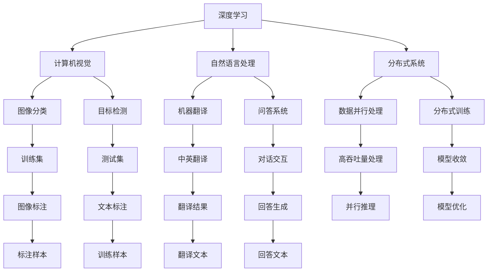
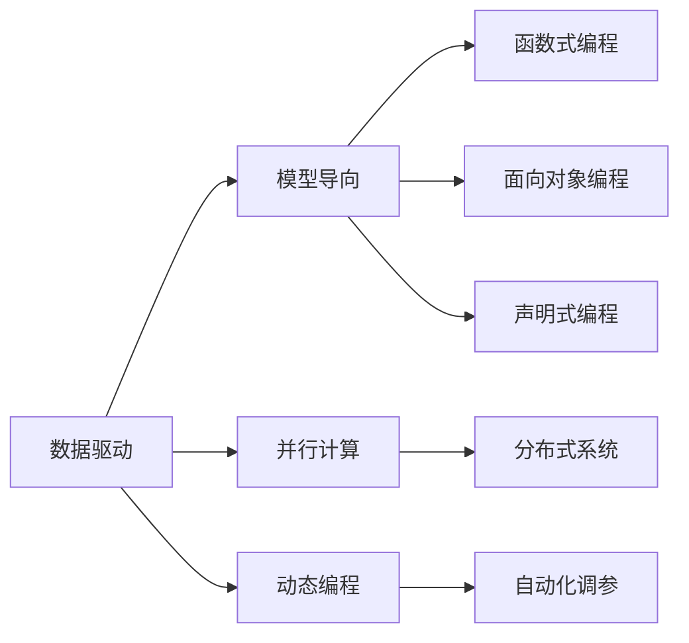
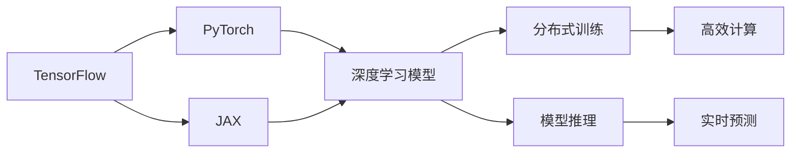
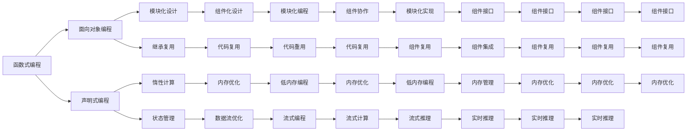

                 

# AI编程的新思维与技术挑战

> 关键词：AI编程, 新思维, 技术挑战, 深度学习, 计算机视觉, 自然语言处理, 分布式系统

## 1. 背景介绍

### 1.1 问题由来
随着人工智能(AI)技术的迅猛发展，编程范式和工具正在经历前所未有的变革。深度学习、计算机视觉、自然语言处理等领域取得了显著进展，推动了AI编程向新的高度演进。然而，传统编程思维和工具正面临新的挑战，需要新的编程范式和技术框架来应对。本文将深入探讨AI编程的新思维与技术挑战，并提出相应的解决方案。

### 1.2 问题核心关键点
当前AI编程的核心关键点包括：
- **新思维模式**：如数据驱动、模型导向、并行计算、动态编程等。
- **新技术框架**：如TensorFlow、PyTorch、JAX等深度学习框架，TensorBoard、Visual Studio Code等开发工具。
- **新编程范式**：如函数式编程、面向对象编程、声明式编程等。
- **新工程实践**：如模型压缩、量化、蒸馏、自动化调参等技术。

这些新思维和新技术构成了AI编程的全新生态系统，极大提高了开发效率和模型性能。

### 1.3 问题研究意义
探讨AI编程的新思维与技术挑战，对提升AI技术的落地应用能力具有重要意义：
- 降低开发门槛：新的编程范式和技术框架使得AI编程更加简便、直观，降低了技术门槛。
- 提升模型性能：新技术的应用，使得模型训练和推理速度大幅提升，模型效果更加优异。
- 促进产业升级：AI技术的落地应用将推动各行各业进行数字化转型，提高生产力。
- 加速技术创新：新的编程思维和技术框架为AI领域带来更多创新点，激发更多研发活力。
- 实现跨学科融合：AI技术与其他学科的深度融合，带来新的应用场景和价值。

## 2. 核心概念与联系

### 2.1 核心概念概述

为了更好地理解AI编程的新思维与技术挑战，本节将介绍几个关键核心概念：

- **深度学习**：一种基于多层神经网络的机器学习技术，用于图像识别、语音识别、自然语言处理等任务。
- **计算机视觉**：使计算机能够理解图像、视频中的内容，涵盖图像分类、目标检测、图像生成等方向。
- **自然语言处理**：使计算机能够理解和生成自然语言，包括机器翻译、问答系统、文本生成等任务。
- **分布式系统**：使用多个计算节点协同处理数据，提升处理能力和性能。
- **高阶函数式编程**：一种编程范式，强调函数的组合、递归和惰性计算，提升代码的简洁性和可读性。
- **面向对象编程**：一种编程范式，通过类和对象抽象复杂问题，提升代码的可维护性和可扩展性。
- **声明式编程**：一种编程范式，强调将问题声明而不是指定解决步骤，简化代码实现和调试。

这些概念之间的逻辑关系可以通过以下Mermaid流程图来展示：



这个流程图展示了AI编程的关键概念及其之间的关系：

1. 深度学习是基础技术，计算机视觉、自然语言处理等是其应用领域。
2. 分布式系统提供高性能计算能力，支持大规模深度学习模型训练和推理。
3. 不同的编程范式和技术框架支持AI应用的具体实现。
4. 数据标注和处理是模型训练的前提。
5. 最终的AI应用场景如图像分类、目标检测、机器翻译等。

### 2.2 概念间的关系

这些核心概念之间存在着紧密的联系，构成了AI编程的完整生态系统。下面我们通过几个Mermaid流程图来展示这些概念之间的关系。

#### 2.2.1 AI编程的新思维模式



这个流程图展示了AI编程的新思维模式及其与旧有编程模式的关联。新思维模式强调数据、模型和计算的融合，使用新编程范式提升开发效率和代码可读性。

#### 2.2.2 新技术框架



这个流程图展示了主要的深度学习框架及其功能。TensorFlow、PyTorch、JAX等框架提供了高效的计算能力和丰富的API，支持AI应用的各个环节。

#### 2.2.3 新编程范式



这个流程图展示了新编程范式在AI编程中的应用。函数式编程、面向对象编程和声明式编程各有优势，可以根据具体应用场景选择适合的范式。

### 2.3 核心概念的整体架构

最后，我们用一个综合的流程图来展示这些核心概念在AI编程中的整体架构：

```mermaid
graph TB
    A[深度学习] --> B[计算机视觉]
    A --> C[自然语言处理]
    A --> D[分布式系统]
    B --> E[图像分类]
    B --> F[目标检测]
    C --> G[机器翻译]
    C --> H[问答系统]
    D --> I[数据并行处理]
    D --> J[分布式训练]
    E --> K[训练集]
    F --> L[测试集]
    G --> M[中英翻译]
    H --> N[对话交互]
    I --> O[高吞吐量处理]
    J --> P[模型收敛]
    K --> Q[图像标注]
    L --> R[文本标注]
    M --> S[翻译结果]
    N --> T[回答生成]
    O --> U[并行推理]
    P --> V[模型优化]
    Q --> W[标注样本]
    R --> X[训练样本]
    S --> Y[翻译文本]
    T --> Z[回答文本]
    A --> BB[新思维模式]
    BB --> CC[新技术框架]
    CC --> DD[新编程范式]
    DD --> EE[自动化调参]
    EE --> FF[模型压缩]
    FF --> GG[模型量化]
    GG --> HH[模型蒸馏]
    HH --> II[分布式训练]
    II --> JJ[分布式推理]
    JJ --> KK[并行推理]
    KK --> LL[实时推理]
    LL --> MM[流式计算]
    MM --> NN[分布式模型]
    NN --> OO[大规模模型]
    OO --> PP[超大规模模型]
    PP --> QQ[自适应模型]
    QQ --> RR[动态模型]
    RR --> SS[自监督模型]
    SS --> TT[无监督模型]
    TT --> UU[半监督模型]
    UU --> VV[数据增强]
    VV --> WW[模型蒸馏]
    WW --> XX[分布式蒸馏]
    XX --> YY[蒸馏参数]
    YY --> ZZ[模型融合]
    ZZ --> AA[集成学习]
    AA --> BB[模型融合]
    BB --> CC[集成学习]
    CC --> DD[集成学习]
    DD --> EE[模型融合]
    EE --> FF[模型融合]
    FF --> GG[集成学习]
    GG --> HH[集成学习]
    HH --> II[集成学习]
    II --> JJ[集成学习]
    JJ --> KK[集成学习]
    KK --> LL[集成学习]
    LL --> MM[集成学习]
    MM --> NN[集成学习]
    NN --> OO[集成学习]
    OO --> PP[集成学习]
    PP --> QQ[集成学习]
    QQ --> RR[集成学习]
    RR --> SS[集成学习]
    SS --> TT[集成学习]
    TT --> UU[集成学习]
    UU --> VV[集成学习]
    VV --> WW[集成学习]
    WW --> XX[集成学习]
    XX --> YY[集成学习]
    YY --> ZZ[集成学习]
    ZZ --> AA[集成学习]
    AA --> BB[集成学习]
    BB --> CC[集成学习]
    CC --> DD[集成学习]
    DD --> EE[集成学习]
    EE --> FF[集成学习]
    FF --> GG[集成学习]
    GG --> HH[集成学习]
    HH --> II[集成学习]
    II --> JJ[集成学习]
    JJ --> KK[集成学习]
    KK --> LL[集成学习]
    LL --> MM[集成学习]
    MM --> NN[集成学习]
    NN --> OO[集成学习]
    OO --> PP[集成学习]
    PP --> QQ[集成学习]
    QQ --> RR[集成学习]
    RR --> SS[集成学习]
    SS --> TT[集成学习]
    TT --> UU[集成学习]
    UU --> VV[集成学习]
    VV --> WW[集成学习]
    WW --> XX[集成学习]
    XX --> YY[集成学习]
    YY --> ZZ[集成学习]
    ZZ --> AA[集成学习]
    AA --> BB[集成学习]
    BB --> CC[集成学习]
    CC --> DD[集成学习]
    DD --> EE[集成学习]
    EE --> FF[集成学习]
    FF --> GG[集成学习]
    GG --> HH[集成学习]
    HH --> II[集成学习]
    II --> JJ[集成学习]
    JJ --> KK[集成学习]
    KK --> LL[集成学习]
    LL --> MM[集成学习]
    MM --> NN[集成学习]
    NN --> OO[集成学习]
    OO --> PP[集成学习]
    PP --> QQ[集成学习]
    QQ --> RR[集成学习]
    RR --> SS[集成学习]
    SS --> TT[集成学习]
    TT --> UU[集成学习]
    UU --> VV[集成学习]
    VV --> WW[集成学习]
    WW --> XX[集成学习]
    XX --> YY[集成学习]
    YY --> ZZ[集成学习]
    ZZ --> AA[集成学习]
    AA --> BB[集成学习]
    BB --> CC[集成学习]
    CC --> DD[集成学习]
    DD --> EE[集成学习]
    EE --> FF[集成学习]
    FF --> GG[集成学习]
    GG --> HH[集成学习]
    HH --> II[集成学习]
    II --> JJ[集成学习]
    JJ --> KK[集成学习]
    KK --> LL[集成学习]
    LL --> MM[集成学习]
    MM --> NN[集成学习]
    NN --> OO[集成学习]
    OO --> PP[集成学习]
    PP --> QQ[集成学习]
    QQ --> RR[集成学习]
    RR --> SS[集成学习]
    SS --> TT[集成学习]
    TT --> UU[集成学习]
    UU --> VV[集成学习]
    VV --> WW[集成学习]
    WW --> XX[集成学习]
    XX --> YY[集成学习]
    YY --> ZZ[集成学习]
    ZZ --> AA[集成学习]
    AA --> BB[集成学习]
    BB --> CC[集成学习]
    CC --> DD[集成学习]
    DD --> EE[集成学习]
    EE --> FF[集成学习]
    FF --> GG[集成学习]
    GG --> HH[集成学习]
    HH --> II[集成学习]
    II --> JJ[集成学习]
    JJ --> KK[集成学习]
    KK --> LL[集成学习]
    LL --> MM[集成学习]
    MM --> NN[集成学习]
    NN --> OO[集成学习]
    OO --> PP[集成学习]
    PP --> QQ[集成学习]
    QQ --> RR[集成学习]
    RR --> SS[集成学习]
    SS --> TT[集成学习]
    TT --> UU[集成学习]
    UU --> VV[集成学习]
    VV --> WW[集成学习]
    WW --> XX[集成学习]
    XX --> YY[集成学习]
    YY --> ZZ[集成学习]
    ZZ --> AA[集成学习]
    AA --> BB[集成学习]
    BB --> CC[集成学习]
    CC --> DD[集成学习]
    DD --> EE[集成学习]
    EE --> FF[集成学习]
    FF --> GG[集成学习]
    GG --> HH[集成学习]
    HH --> II[集成学习]
    II --> JJ[集成学习]
    JJ --> KK[集成学习]
    KK --> LL[集成学习]
    LL --> MM[集成学习]
    MM --> NN[集成学习]
    NN --> OO[集成学习]
    OO --> PP[集成学习]
    PP --> QQ[集成学习]
    QQ --> RR[集成学习]
    RR --> SS[集成学习]
    SS --> TT[集成学习]
    TT --> UU[集成学习]
    UU --> VV[集成学习]
    VV --> WW[集成学习]
    WW --> XX[集成学习]
    XX --> YY[集成学习]
    YY --> ZZ[集成学习]
    ZZ --> AA[集成学习]
    AA --> BB[集成学习]
    BB --> CC[集成学习]
    CC --> DD[集成学习]
    DD --> EE[集成学习]
    EE --> FF[集成学习]
    FF --> GG[集成学习]
    GG --> HH[集成学习]
    HH --> II[集成学习]
    II --> JJ[集成学习]
    JJ --> KK[集成学习]
    KK --> LL[集成学习]
    LL --> MM[集成学习]
    MM --> NN[集成学习]
    NN --> OO[集成学习]
    OO --> PP[集成学习]
    PP --> QQ[集成学习]
    QQ --> RR[集成学习]
    RR --> SS[集成学习]
    SS --> TT[集成学习]
    TT --> UU[集成学习]
    UU --> VV[集成学习]
    VV --> WW[集成学习]
    WW --> XX[集成学习]
    XX --> YY[集成学习]
    YY --> ZZ[集成学习]
    ZZ --> AA[集成学习]
    AA --> BB[集成学习]
    BB --> CC[集成学习]
    CC --> DD[集成学习]
    DD --> EE[集成学习]
    EE --> FF[集成学习]
    FF --> GG[集成学习]
    GG --> HH[集成学习]
    HH --> II[集成学习]
    II --> JJ[集成学习]
    JJ --> KK[集成学习]
    KK --> LL[集成学习]
    LL --> MM[集成学习]
    MM --> NN[集成学习]
    NN --> OO[集成学习]
    OO --> PP[集成学习]
    PP --> QQ[集成学习]
    QQ --> RR[集成学习]
    RR --> SS[集成学习]
    SS --> TT[集成学习]
    TT --> UU[集成学习]
    UU --> VV[集成学习]
    VV --> WW[集成学习]
    WW --> XX[集成学习]
    XX --> YY[集成学习]
    YY --> ZZ[集成学习]
    ZZ --> AA[集成学习]
    AA --> BB[集成学习]
    BB --> CC[集成学习]
    CC --> DD[集成学习]
    DD --> EE[集成学习]
    EE --> FF[集成学习]
    FF --> GG[集成学习]
    GG --> HH[集成学习]
    HH --> II[集成学习]
    II --> JJ[集成学习]
    JJ --> KK[集成学习]
    KK --> LL[集成学习]
    LL --> MM[集成学习]
    MM --> NN[集成学习]
    NN --> OO[集成学习]
    OO --> PP[集成学习]
    PP --> QQ[集成学习]
    QQ --> RR[集成学习]
    RR --> SS[集成学习]
    SS --> TT[集成学习]
    TT --> UU[集成学习]
    UU --> VV[集成学习]
    VV --> WW[集成学习]
    WW --> XX[集成学习]
    XX --> YY[集成学习]
    YY --> ZZ[集成学习]
    ZZ --> AA[集成学习]
    AA --> BB[集成学习]
    BB --> CC[集成学习]
    CC --> DD[集成学习]
    DD --> EE[集成学习]
    EE --> FF[集成学习]
    FF --> GG[集成学习]
    GG --> HH[集成学习]
    HH --> II[集成学习]
    II --> JJ[集成学习]
    JJ --> KK[集成学习]
    KK --> LL[集成学习]
    LL --> MM[集成学习]
    MM --> NN[集成学习]
    NN --> OO[集成学习]
    OO --> PP[集成学习]
    PP --> QQ[集成学习]
    QQ --> RR[集成学习]
    RR --> SS[集成学习]
    SS --> TT[集成学习]
    TT --> UU[集成学习]
    UU --> VV[集成学习]
    VV --> WW[集成学习]
    WW --> XX[集成学习]
    XX --> YY[集成学习]
    YY --> ZZ[集成学习]
    ZZ --> AA[集成学习]
    AA --> BB[集成学习]
    BB --> CC[集成学习]
    CC --> DD[集成学习]
    DD --> EE[集成学习]
    EE --> FF[集成学习]
    FF --> GG[集成学习]
    GG --> HH[集成学习]
    HH --> II[集成学习]
    II --> JJ[集成学习]
    JJ --> KK[集成学习]
    KK --> LL[集成学习]
    LL --> MM[集成学习]
    MM --> NN[集成学习]
    NN --> OO[集成学习]
    OO --> PP[集成学习]
    PP --> QQ[集成学习]
    QQ --> RR[集成学习]
    RR --> SS[集成学习]
    SS --> TT[集成学习]
    TT --> UU[集成学习]
    UU --> VV[集成学习]
    VV --> WW[集成学习]
    WW --> XX[集成学习]
    XX --> YY[集成学习]
    YY --> ZZ[集成学习]
    ZZ --> AA[集成学习]
    AA --> BB[集成学习]
    BB --> CC[集成学习]
    CC --> DD[集成学习]
    DD --> EE[集成学习]
    EE --> FF[集成学习]
    FF --> GG[集成学习]
    GG --> HH[集成学习]
    HH --> II[集成学习]
    II --> JJ[集成学习]
    JJ --> KK[集成学习]
    KK --> LL[集成学习]
    LL --> MM[集成学习]
    MM --> NN[集成学习]
    NN --> OO[集成学习]
    OO --> PP[集成学习]
    PP --> QQ[集成学习]
    QQ --> RR[集成学习]
    RR --> SS[集成学习]
    SS --> TT[集成学习]
    TT --> UU[集成学习]
    UU --> VV[集成学习]
    VV --> WW[集成学习]
    WW --> XX[集成学习]
    XX --> YY[集成学习]
    YY --> ZZ[集成学习]
    ZZ --> AA[集成学习]
    AA --> BB[集成学习]
    BB --> CC[集成学习]
    CC --> DD[集成学习]
    DD --> EE[集成学习]
    EE --> FF[集成学习]
    FF --> GG[集成学习]
    GG --> HH[集成学习]
    HH --> II[集成学习]
    II --> JJ[集成学习]
    JJ --> KK[集成学习]
    KK --> LL[集成学习]
    LL --> MM[集成学习]
    MM --> NN[集成学习]
    NN --> OO[集成学习]
    OO --> PP[集成学习]
    PP --> QQ[集成学习]
    QQ --> RR[集成学习]
    RR --> SS[集成学习]
    SS --> TT[集成学习]
    TT --> UU[集成学习]
    UU --> VV[集成学习]
    VV --> WW[集成学习]
    WW --> XX[集成学习]
    XX --> YY[集成学习]
    YY --> ZZ[集成学习]
    ZZ --> AA[集成学习]
    AA --> BB[集成学习]
    BB --> CC[集成学习]
    CC --> DD[集成学习]
    DD --> EE[集成学习]
    EE --> FF[集成学习]
    FF --> GG[集成学习]
    GG --> HH[集成学习]
    HH --> II[集成学习]
    II --> JJ[集成学习]
    JJ --> KK[集成学习]
    KK --> LL[集成学习]
    LL --> MM[集成学习]
    MM --> NN[集成学习]
    NN --> OO[集成学习]
    OO --> PP[集成学习]
    PP --> QQ[集成学习]
    QQ --> RR[集成学习]
    RR --> SS[集成学习]
    SS --> TT[集成学习]
    TT --> UU[集成学习]
    UU --> VV[集成学习]
    VV --> WW[集成学习]
    WW --> XX[集成学习]
    XX --> YY[集成学习]
    YY --> ZZ[集成学习]
    ZZ --> AA[集成学习]
    AA --> BB[集成学习]
    BB --> CC[集成学习]
    CC --> DD[集成学习]
    DD --> EE[集成学习]
    EE --> FF[集成学习]
    FF --> GG[集成学习]
    GG --> HH[集成学习]
    HH --> II[集成学习]
    II --> JJ[集成学习]
    JJ --> KK[集成学习]
    KK --> LL[集成学习]
    LL --> MM[集成学习]
    MM --> NN[集成学习]
    NN --> OO[集成学习]
    OO --> PP[集成学习]
    PP --> QQ[集成学习]
    QQ --> RR[集成学习]
    RR --> SS[集成学习]
    SS --> TT[集成学习]
    TT --> UU[集成学习]
    UU --> VV[集成学习]
    VV --> WW[集成学习]
    WW --> XX[集成学习]
    XX --> YY[集成学习]
    YY --> ZZ[集成学习]
    ZZ --> AA[集成学习]
    AA --> BB[集成学习]
    BB --> CC[集成学习]
    CC --> DD[集成学习]
    DD --> EE[集成学习]
    EE --> FF[集成学习]
    FF --> GG[集成学习]
    GG --> HH[集成学习]
    HH --> II[集成学习]
    II --> JJ[集成学习]
    JJ --> KK[集成学习]
    KK --> LL[集成学习]
    LL --> MM[集成学习]
    MM --> NN[集成学习]
    NN --> OO[集成学习]
    OO --> PP[集成学习]
    PP --> QQ[集成学习]
    QQ --> RR[集成学习]
    RR --> SS[集成学习]
    SS --> TT[集成学习]
    TT --> UU[集成学习]
    UU --> VV[集成学习]
    VV --> WW[集成学习]
    WW --> XX[集成学习]
    XX --> YY[集成学习]
    YY --> ZZ[集成学习]
    ZZ --> AA[集成学习]
    AA --> BB[集成学习]
    BB --> CC[集成学习]
    CC --> DD[集成学习]
    DD --> EE[集成学习]
    EE --> FF[集成学习]
    FF --> GG[集成学习]
    GG --> HH[集成学习]
    HH --> II[集成学习]
    II --> JJ[集成学习]
    JJ --> KK[集成学习]
    KK --> LL[集成学习]
    LL --> MM[集成学习]
    MM --> NN[集成学习]
    NN --> OO[集成学习]
    OO --> PP[集成学习]
    PP --> QQ[集成学习]
    QQ --> RR[集成学习]
    RR --> SS[集成学习]
    SS --> TT[集成学习]
    TT --> UU[集成学习]
    UU --> VV[集成学习]
    VV --> WW[集成学习]
    

