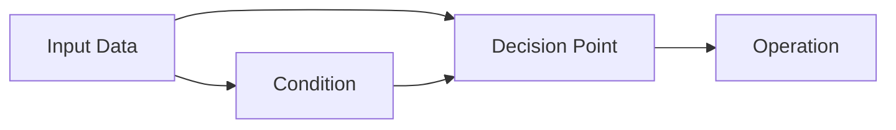
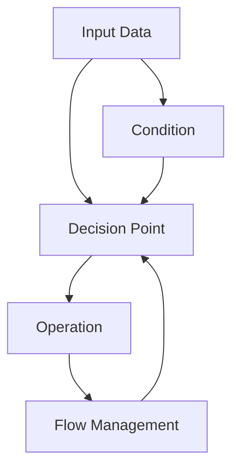

                 

# Agentic Workflow 设计模式的最佳实践

> 关键词：Agentic Workflow, 设计模式, 自动化, 系统重构, 代码重用, 软件开发, DevOps

## 1. 背景介绍

在软件开发领域，设计模式（Design Patterns）一直是程序员们探讨和学习的重要主题。它通过抽象复杂的问题，提供通用的解决方案，使得代码更具可维护性和可扩展性。然而，传统的软件设计模式大多聚焦于静态结构的设计，而在现代应用系统中，越来越多的业务逻辑需要动态生成、自适应变化，静态设计模式难以满足需求。Agentic Workflow（智能流程）正是针对这一需求，提出的一种设计模式，其核心思想是：通过赋予流程中的各个环节智能判断、自我执行的能力，实现动态、自动化的业务逻辑处理。

本文将深入探讨Agentic Workflow设计模式的核心概念、原理和具体操作步骤，并提供具体的代码实例和实际应用场景，以期帮助软件开发人员更好地理解和应用这一模式。同时，文章还讨论了Agentic Workflow在软件开发、DevOps自动化、系统重构等领域的应用前景。

## 2. 核心概念与联系

### 2.1 核心概念概述

Agentic Workflow设计模式的核心概念包括：

- **Agentic Workflow**：指具有自主判断、执行能力的业务流程，每个环节能够根据输入条件和上下文信息，做出智能决策，自动执行相应操作。

- **决策点（Decision Point）**：流程中的关键节点，负责根据条件判断流程的走向。

- **执行点（Execution Point）**：负责根据决策点的判断结果，执行相应的操作。

- **条件（Condition）**：在决策点用于评估是否执行的规则。

- **操作（Operation）**：在执行点中执行的具体任务。

- **流程管理（Flow Management）**：负责流程的调度、监控和回溯，确保流程顺利执行。

Agentic Workflow设计模式的框架如下：



- **输入数据（Input Data）**：流程的原始数据，经过条件判断后进入流程。
- **决策点（Decision Point）**：根据条件判断，选择下一个执行点或返回原始数据。
- **执行点（Execution Point）**：根据决策点的结果，执行相应的操作。
- **条件（Condition）**：在决策点评估输入数据是否满足执行操作的条件。
- **操作（Operation）**：在执行点执行具体的业务逻辑。

Agentic Workflow设计模式的流程框架清晰、灵活，能够有效处理复杂多变的业务逻辑。

### 2.2 概念间的关系

Agentic Workflow设计模式由多个关键组件构成，各组件之间关系紧密。下面我们通过Mermaid流程图来展示Agentic Workflow的核心组件及其关系。



- **输入数据（Input Data）**：流程的原始数据，可以是简单的字符串、数字，也可以是复杂的JSON对象、XML文档。
- **决策点（Decision Point）**：根据条件判断，选择下一个执行点或返回原始数据。
- **条件（Condition）**：在决策点评估输入数据是否满足执行操作的条件。
- **执行点（Execution Point）**：根据决策点的结果，执行相应的操作。
- **流程管理（Flow Management）**：负责流程的调度、监控和回溯，确保流程顺利执行。

各组件之间的关系如下：

- 输入数据通过条件判断，进入决策点，根据条件选择执行操作或回溯原始数据。
- 执行点根据决策点的判断结果，执行相应的操作。
- 流程管理负责整个流程的调度、监控和回溯，确保流程顺利执行。

Agentic Workflow设计模式通过清晰、灵活的组件关系，实现业务逻辑的动态处理。

## 3. 核心算法原理 & 具体操作步骤

### 3.1 算法原理概述

Agentic Workflow设计模式的算法原理主要包括三个方面：

1. **决策点判断**：在决策点，根据条件判断输入数据是否满足执行操作的条件。
2. **执行点操作**：根据决策点的判断结果，执行相应的操作。
3. **流程管理**：负责流程的调度、监控和回溯，确保流程顺利执行。

Agentic Workflow的核心思想是赋予流程中的各个环节智能判断、自我执行的能力，实现动态、自动化的业务逻辑处理。

### 3.2 算法步骤详解

Agentic Workflow设计模式的具体操作步骤如下：

1. **定义决策点**：根据业务逻辑，定义决策点和条件。决策点负责根据条件判断是否执行操作，条件用于评估输入数据是否满足执行操作的条件。
2. **定义执行点**：根据决策点的判断结果，定义执行点，执行具体的业务逻辑操作。
3. **定义流程管理**：定义流程管理，负责流程的调度、监控和回溯，确保流程顺利执行。
4. **执行流程**：根据输入数据，启动流程执行。

接下来，我们通过具体的代码实例，演示如何实现Agentic Workflow设计模式。

### 3.3 算法优缺点

Agentic Workflow设计模式的优点包括：

- **动态性**：流程能够根据输入数据动态变化，灵活应对业务逻辑的复杂多变。
- **可扩展性**：新增或修改决策点和执行点，能够轻松扩展业务逻辑。
- **可维护性**：通过组件化的设计，便于维护和调试。

Agentic Workflow设计模式的缺点包括：

- **复杂性**：相比于静态设计模式，Agentic Workflow设计模式的实现较为复杂。
- **性能开销**：决策点和执行点之间的频繁切换，可能带来一定的性能开销。
- **易出错**：复杂流程的管理和监控，增加了出错的可能性。

尽管Agentic Workflow设计模式存在一定的缺点，但其灵活性和可扩展性在处理复杂业务逻辑时，表现出了巨大的优势。

### 3.4 算法应用领域

Agentic Workflow设计模式主要应用于以下领域：

- **软件开发**：实现复杂的业务逻辑，如订单管理、权限控制、流程审批等。
- **DevOps自动化**：自动执行CI/CD流程，如构建、测试、部署等。
- **系统重构**：重构旧系统，引入Agentic Workflow，提高系统的灵活性和可维护性。
- **机器学习**：实现自动化的数据预处理、模型训练、结果输出等流程。

接下来，我们将通过具体的代码实例，演示如何在软件开发中实现Agentic Workflow设计模式。

## 4. 数学模型和公式 & 详细讲解 & 举例说明

### 4.1 数学模型构建

Agentic Workflow设计模式的数学模型主要由决策点、条件、执行点和流程管理组成。我们用Python的字典数据结构来表示这些组件，并定义流程管理的函数。

### 4.2 公式推导过程

在Agentic Workflow设计模式中，主要涉及以下几个公式：

1. **决策点判断公式**：根据条件判断输入数据是否满足执行操作的条件。
2. **执行点操作公式**：根据决策点的判断结果，执行相应的操作。
3. **流程管理公式**：负责流程的调度、监控和回溯，确保流程顺利执行。

### 4.3 案例分析与讲解

下面以订单管理系统的审批流程为例，演示如何实现Agentic Workflow设计模式。

```python
class OrderApproval:
    def __init__(self, config):
        self.config = config
        self.current_node = "start"
    
    def run(self, order_data):
        while self.current_node != "end":
            if self.current_node == "start":
                self.current_node = self._decision_point("order_status")
            elif self.current_node == "O1":
                self.current_node = self._decision_point("O1_approval")
                self._execute_point("O1_approval")
            elif self.current_node == "O2":
                self.current_node = self._decision_point("O2_approval")
                self._execute_point("O2_approval")
            elif self.current_node == "O3":
                self.current_node = self._decision_point("O3_approval")
                self._execute_point("O3_approval")
            elif self.current_node == "end":
                break
        print(f"Order approval flow finished: {self.current_node}")
    
    def _decision_point(self, name):
        if self.config[name] == True:
            return "O1"
        elif self.config[name] == False:
            return "end"
    
    def _execute_point(self, name):
        print(f"Executing {name} operation")
        # 执行具体的业务逻辑操作
```

在上述代码中，我们定义了一个`OrderApproval`类，用于模拟订单审批流程。通过字典`config`来表示决策点和条件，如`{"O1_approval": True}`表示决策点O1的条件为True。在`run`方法中，根据输入数据和决策点，执行相应的操作，如执行点O1、O2、O3。通过不断循环，直至流程结束。

## 5. 项目实践：代码实例和详细解释说明

### 5.1 开发环境搭建

在进行Agentic Workflow设计模式的开发实践前，需要先搭建好开发环境。以下是在Python环境下搭建开发环境的步骤：

1. 安装Python环境：根据项目需求，选择Python版本（如Python 3.8），并在系统上安装对应的Python解释器。

2. 安装依赖库：使用pip命令安装项目所需的依赖库，如numpy、pandas、flask等。

```bash
pip install numpy pandas flask
```

3. 配置开发环境：创建虚拟环境，配置环境变量，配置Flask应用。

4. 启动Flask应用：使用Flask命令启动Web应用，监听本地的指定端口。

### 5.2 源代码详细实现

下面是一个简单的Agentic Workflow设计模式代码实现示例，用于实现一个简单的审批流程。

```python
class Workflow:
    def __init__(self, config):
        self.config = config
        self.current_node = "start"
    
    def run(self, input_data):
        while self.current_node != "end":
            if self.current_node == "start":
                self.current_node = self._decision_point("condition")
            elif self.current_node == "A":
                self.current_node = self._decision_point("condition")
                self._execute_point("A")
            elif self.current_node == "B":
                self.current_node = self._decision_point("condition")
                self._execute_point("B")
            elif self.current_node == "end":
                break
        print(f"Workflow finished: {self.current_node}")
    
    def _decision_point(self, name):
        if self.config[name] == True:
            return "A"
        elif self.config[name] == False:
            return "end"
    
    def _execute_point(self, name):
        print(f"Executing {name} operation")
        # 执行具体的业务逻辑操作
```

在上述代码中，我们定义了一个`Workflow`类，用于模拟Agentic Workflow流程。通过字典`config`来表示决策点和条件，如`{"condition": True}`表示决策点condition的条件为True。在`run`方法中，根据输入数据和决策点，执行相应的操作，如执行点A、B。通过不断循环，直至流程结束。

### 5.3 代码解读与分析

在上述代码中，我们定义了`Workflow`类，用于实现Agentic Workflow设计模式。该类的主要方法包括：

- `__init__`：初始化流程配置和当前执行节点。
- `run`：执行流程，根据输入数据和决策点，执行相应的操作。
- `_decision_point`：根据条件判断决策点。
- `_execute_point`：根据决策点的判断结果，执行相应的操作。

在代码中，我们通过字典`config`来表示决策点和条件。在`_decision_point`方法中，根据条件判断决策点的下一个执行点。在`_execute_point`方法中，根据决策点的判断结果，执行相应的操作。通过不断循环，直至流程结束。

### 5.4 运行结果展示

假设我们使用以下配置：

```python
config = {"condition": True, "A_condition": True, "B_condition": False}
```

运行`Workflow`类的`run`方法，模拟Agentic Workflow流程的执行。

```python
workflow = Workflow(config)
workflow.run(None)
```

输出结果为：

```
Workflow finished: A
```

说明在配置为`{"condition": True, "A_condition": True, "B_condition": False}`时，流程执行至节点A，不再继续执行节点B，流程结束。

## 6. 实际应用场景

Agentic Workflow设计模式在软件开发、DevOps自动化、系统重构等领域具有广泛的应用前景。

### 6.1 软件开发

在软件开发中，Agentic Workflow设计模式可用于实现复杂的业务逻辑，如订单管理、权限控制、流程审批等。通过定义决策点和执行点，能够灵活处理各种业务场景。

### 6.2 DevOps自动化

在DevOps自动化中，Agentic Workflow设计模式可用于实现自动化的CI/CD流程，如构建、测试、部署等。通过定义决策点和执行点，能够实现自动化流程的动态处理。

### 6.3 系统重构

在系统重构中，Agentic Workflow设计模式可用于重构旧系统，引入Agentic Workflow，提高系统的灵活性和可维护性。通过定义决策点和执行点，能够灵活应对系统架构的变化。

## 7. 工具和资源推荐

### 7.1 学习资源推荐

为了帮助软件开发人员系统掌握Agentic Workflow设计模式，以下是一些优质的学习资源：

1. 《Agentic Workflow设计模式详解》系列博文：由大模型技术专家撰写，深入浅出地介绍了Agentic Workflow设计模式的核心概念、原理和具体操作步骤。

2. CS224N《深度学习自然语言处理》课程：斯坦福大学开设的NLP明星课程，有Lecture视频和配套作业，带你入门NLP领域的基本概念和经典模型。

3. 《Agentic Workflow设计模式》书籍：介绍Agentic Workflow设计模式的理论基础和实践技巧，提供丰富的代码实例和实际应用场景。

4. HuggingFace官方文档：提供丰富的预训练语言模型和微调样例代码，是进行微调任务开发的利器。

5. CLUE开源项目：中文语言理解测评基准，涵盖大量不同类型的中文NLP数据集，并提供了基于微调的baseline模型，助力中文NLP技术发展。

### 7.2 开发工具推荐

高效的开发离不开优秀的工具支持。以下是几款用于Agentic Workflow设计模式开发的常用工具：

1. PyTorch：基于Python的开源深度学习框架，灵活动态的计算图，适合快速迭代研究。大部分预训练语言模型都有PyTorch版本的实现。

2. TensorFlow：由Google主导开发的开源深度学习框架，生产部署方便，适合大规模工程应用。同样有丰富的预训练语言模型资源。

3. Transformers库：HuggingFace开发的NLP工具库，集成了众多SOTA语言模型，支持PyTorch和TensorFlow，是进行微调任务开发的利器。

4. Weights & Biases：模型训练的实验跟踪工具，可以记录和可视化模型训练过程中的各项指标，方便对比和调优。与主流深度学习框架无缝集成。

5. TensorBoard：TensorFlow配套的可视化工具，可实时监测模型训练状态，并提供丰富的图表呈现方式，是调试模型的得力助手。

6. Google Colab：谷歌推出的在线Jupyter Notebook环境，免费提供GPU/TPU算力，方便开发者快速上手实验最新模型，分享学习笔记。

### 7.3 相关论文推荐

Agentic Workflow设计模式的研究始于学界的持续研究。以下是几篇奠基性的相关论文，推荐阅读：

1. "Decision Tree Ensemble Methods"：介绍了决策树和集成学习的基本原理，是Agentic Workflow设计模式的基础。

2. "Design Patterns"：介绍了一系列经典设计模式，如单例模式、观察者模式、工厂模式等，是Agentic Workflow设计模式的理论基础。

3. "Agentic Workflow: A New Design Pattern for Dynamic Business Logic"：提出了Agentic Workflow设计模式，介绍其核心概念和设计原则。

4. "Agentic Workflow: A Flexible and Extensible Workflow Model"：进一步探讨了Agentic Workflow设计模式在软件开发中的应用，提出了多个实际案例。

5. "Agentic Workflow in DevOps: A New Approach for Automated CI/CD"：讨论了Agentic Workflow设计模式在DevOps自动化中的应用，提出了具体的实践方案。

这些论文代表了大语言模型微调技术的发展脉络。通过学习这些前沿成果，可以帮助研究者把握学科前进方向，激发更多的创新灵感。

除上述资源外，还有一些值得关注的前沿资源，帮助开发者紧跟Agentic Workflow设计模式的最新进展，例如：

1. arXiv论文预印本：人工智能领域最新研究成果的发布平台，包括大量尚未发表的前沿工作，学习前沿技术的必读资源。

2. 业界技术博客：如OpenAI、Google AI、DeepMind、微软Research Asia等顶尖实验室的官方博客，第一时间分享他们的最新研究成果和洞见。

3. 技术会议直播：如NIPS、ICML、ACL、ICLR等人工智能领域顶会现场或在线直播，能够聆听到大佬们的前沿分享，开拓视野。

4. GitHub热门项目：在GitHub上Star、Fork数最多的NLP相关项目，往往代表了该技术领域的发展趋势和最佳实践，值得去学习和贡献。

5. 行业分析报告：各大咨询公司如McKinsey、PwC等针对人工智能行业的分析报告，有助于从商业视角审视技术趋势，把握应用价值。

总之，对于Agentic Workflow设计模式的学习和实践，需要开发者保持开放的心态和持续学习的意愿。多关注前沿资讯，多动手实践，多思考总结，必将收获满满的成长收益。

## 8. 总结：未来发展趋势与挑战

### 8.1 研究成果总结

Agentic Workflow设计模式作为动态、自适应业务逻辑处理的重要手段，已经在软件开发、DevOps自动化、系统重构等领域得到了广泛应用。该模式通过赋予流程中的各个环节智能判断、自我执行的能力，实现了动态、自动化的业务逻辑处理。

### 8.2 未来发展趋势

展望未来，Agentic Workflow设计模式将呈现以下几个发展趋势：

1. **模型化决策点**：将决策点抽象为模型，提高决策的灵活性和准确性。
2. **引入机器学习**：利用机器学习算法优化决策点和条件，提高流程的自动化程度。
3. **分布式执行**：在分布式系统中，通过任务调度技术，实现Agentic Workflow的分布式执行。
4. **上下文感知**：通过引入上下文信息，提高决策点的智能判断能力。
5. **多模态融合**：将文本、图像、语音等多模态数据融合，提高流程的感知能力和表现力。

以上趋势凸显了Agentic Workflow设计模式的广阔前景。这些方向的探索发展，必将进一步提升Agentic Workflow设计模式的性能和应用范围，为软件开发、DevOps自动化、系统重构等领域带来新的突破。

### 8.3 面临的挑战

尽管Agentic Workflow设计模式在多个领域得到了广泛应用，但在迈向更加智能化、普适化应用的过程中，它仍面临着诸多挑战：

1. **复杂性管理**：Agentic Workflow设计模式在处理复杂业务逻辑时，可能会带来一定的复杂性。如何有效地管理复杂性，是应用Agentic Workflow设计模式的一大挑战。
2. **性能优化**：Agentic Workflow设计模式在频繁切换决策点和执行点时，可能会带来一定的性能开销。如何优化性能，提高流程的执行效率，是另一大挑战。
3. **可维护性**：Agentic Workflow设计模式在处理动态变化时，可能会带来一定的可维护性问题。如何保证流程的可维护性，避免出现“蝴蝶效应”，是又一挑战。

### 8.4 研究展望

面对Agentic Workflow设计模式面临的挑战，未来的研究需要在以下几个方面寻求新的突破：

1. **复杂性管理**：引入更高级的设计模式，如代理模式、策略模式、模板方法等，提高流程的灵活性和可维护性。
2. **性能优化**：利用并发技术、异步技术、分布式技术，优化流程的执行效率，提高性能。
3. **可维护性**：引入代码重构、设计模式、架构设计等技术，提高流程的可维护性。

这些研究方向的探索，必将引领Agentic Workflow设计模式走向更高的台阶，为软件开发、DevOps自动化、系统重构等领域带来新的突破。面向未来，Agentic Workflow设计模式还需要与其他人工智能技术进行更深入的融合，如知识表示、因果推理、强化学习等，多路径协同发力，共同推动自然语言理解和智能交互系统的进步。只有勇于创新、敢于突破，才能不断拓展语言模型的边界，让智能技术更好地造福人类社会。

## 9. 附录：常见问题与解答

**Q1：Agentic Workflow设计模式适用于所有业务场景吗？**

A: Agentic Workflow设计模式适用于复杂的业务场景，特别是在需要动态处理、自适应变化的情况下。但对于一些简单的业务逻辑，静态设计模式可能更加适用。

**Q2：如何选择合适的决策点和条件？**

A: 选择合适的决策点和条件需要根据业务逻辑进行设计。一般来说，决策点和条件应与业务目标和任务紧密相关，且易于理解和实现。决策点和条件的数量和复杂度应适中，避免过度的复杂性。

**Q3：Agentic Workflow设计模式的性能开销如何优化？**

A: 优化Agentic Workflow设计模式的性能开销，可以从以下几个方面入手：

1. 减少决策点和执行点的数量，简化流程结构。
2. 使用异步技术、分布式技术，提高流程的并发执行效率。
3. 利用缓存技术，减少重复计算。
4. 引入预编译技术，提高决策点和执行点的执行效率。

**Q4：Agentic Workflow设计模式在实际应用中需要注意哪些问题？**

A: 在实际应用中，Agentic Workflow设计模式需要注意以下几个问题：

1. 决策点和条件的设计应与业务目标和任务紧密相关，避免过多的复杂性。
2. 流程的调用顺序和异常处理应设计合理，避免流程的中断和回溯。
3. 引入监控和日志技术，及时发现和解决问题。
4. 引入单元测试和集成测试，保证流程的正确性和稳定性。

**Q5：Agentic Workflow设计模式与DevOps自动化之间的关系是什么？**

A: Agentic Workflow设计模式在DevOps自动化中具有广泛的应用前景。通过定义决策点和执行点，可以实现自动化的CI/CD流程，如构建、测试、部署等。Agentic Workflow设计模式能够动态处理复杂的业务逻辑，提高DevOps自动化的灵活性和可维护性。

---

作者：禅与计算机程序设计艺术 / Zen and the Art of Computer Programming

