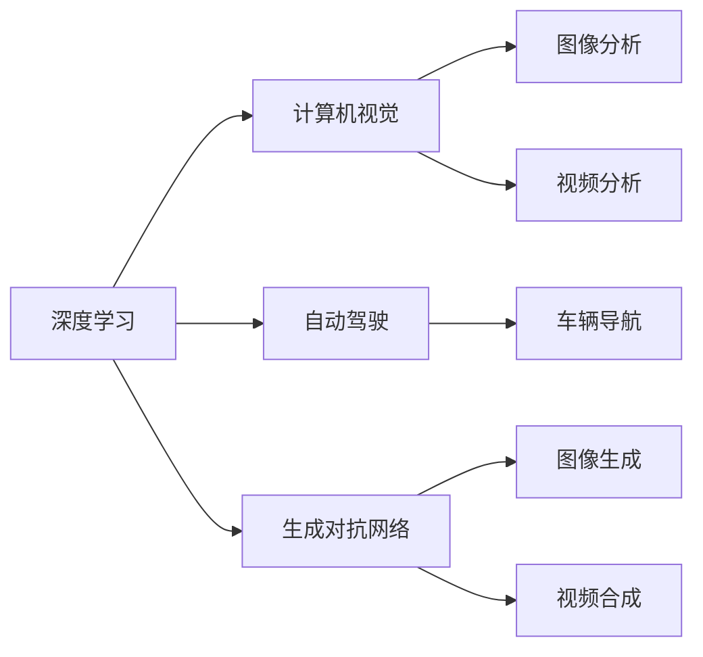

                 

# Andrej Karpathy的AI演讲亮点

## 1. 背景介绍

Andrej Karpathy是OpenAI的研究科学家，也是斯坦福大学计算机科学教授，他在深度学习、计算机视觉、自动驾驶等领域都有深入研究，是AI界公认的行业权威。近期，他参加了多个公开演讲，分享了其在AI领域的最新思考和突破。本文将基于Andrej Karpathy在演讲中的亮点，深入探讨其AI理念、技术进展和应用前景。

## 2. 核心概念与联系

### 2.1 核心概念概述

Andrej Karpathy的AI理念主要围绕深度学习、计算机视觉和自动驾驶展开，涵盖了从理论基础到应用实践的多个层面。他的演讲涉及以下关键概念：

- 深度学习：一种通过多层神经网络对复杂数据进行建模和分析的技术。Karpathy在多个演讲中强调了深度学习的强大表达能力和泛化性能。
- 计算机视觉：利用机器学习技术对图像和视频进行理解、分析和处理。Karpathy展示了其在计算机视觉领域的突破，如自动驾驶、视频分析等。
- 自动驾驶：通过计算机视觉和深度学习技术，使车辆能够自主导航。Karpathy分享了其在大规模自动驾驶任务上的研究和进展。
- 生成对抗网络（GANs）：一种生成模型，能够生成逼真的图像、视频等。Karpathy介绍了GANs在图像生成、视频合成等方面的应用。

### 2.2 核心概念间的关系

Andrej Karpathy的AI理念通过以下几个关键节点连接，形成了一个完整的技术生态系统：

1. **深度学习**：作为核心技术，深度学习提供了一种强大的建模能力，可以用于图像、语音、文本等多种数据的处理。
2. **计算机视觉**：建立在深度学习基础之上，计算机视觉能够对图像和视频进行准确的分析和理解。
3. **自动驾驶**：结合计算机视觉和深度学习，自动驾驶系统能够实现车辆的自主导航和决策。
4. **生成对抗网络**：作为生成模型的一种，GANs能够生成逼真的图像和视频，进一步拓展了深度学习的应用范围。

这些概念之间相互作用，共同推动了AI技术的发展和应用。

### 2.3 核心概念的整体架构

以下是一个综合的流程图，展示了Andrej Karpathy的AI理念和技术生态系统的整体架构：



这个流程图展示了深度学习技术如何在计算机视觉、自动驾驶和生成对抗网络中的应用，以及各技术间的相互影响。

## 3. 核心算法原理 & 具体操作步骤
### 3.1 算法原理概述

Andrej Karpathy在多个演讲中详细讲解了深度学习、计算机视觉和自动驾驶的核心算法原理。以下是对这些原理的概述：

- **深度学习**：通过多层神经网络对复杂数据进行建模和分析。每层神经网络提取数据的不同层次特征，最终输出对数据的理解。
- **计算机视觉**：利用卷积神经网络（CNNs）对图像和视频进行特征提取和分类。CNNs通过卷积、池化等操作，捕捉图像中的空间特征和局部细节。
- **自动驾驶**：结合计算机视觉和深度学习，通过传感器数据进行环境感知和行为决策。自动驾驶系统包括感知、决策和执行三个主要部分。
- **生成对抗网络**：由生成器和判别器两个网络组成，通过对抗训练生成逼真的图像和视频。生成器网络试图生成逼真的数据，判别器网络试图区分生成数据和真实数据。

### 3.2 算法步骤详解

Andrej Karpathy在演讲中详细介绍了深度学习和计算机视觉的具体操作步骤。以下是对这些步骤的详解：

#### 3.2.1 深度学习训练流程

1. **数据准备**：收集和标注数据，确保数据的多样性和代表性。
2. **模型设计**：选择适合的神经网络结构，如卷积神经网络、循环神经网络等。
3. **模型训练**：使用反向传播算法，最小化损失函数，优化模型参数。
4. **模型评估**：在测试集上评估模型性能，调整超参数，提升模型效果。

#### 3.2.2 计算机视觉任务流程

1. **数据预处理**：对图像和视频进行归一化、增强等处理，增加数据多样性。
2. **特征提取**：利用CNNs进行特征提取，获取图像中的空间特征和局部细节。
3. **分类和回归**：通过全连接层或softmax层进行分类或回归，输出预测结果。
4. **后处理**：对预测结果进行后处理，如非极大值抑制（NMS）等，提高结果的准确性。

#### 3.2.3 自动驾驶系统流程

1. **传感器数据获取**：通过摄像头、雷达、激光雷达等传感器获取环境数据。
2. **环境感知**：利用计算机视觉技术，对传感器数据进行图像分析和视频分析，生成环境地图。
3. **行为决策**：通过深度学习模型，进行交通标志识别、行人检测、车辆行为预测等。
4. **车辆控制**：根据行为决策结果，控制车辆加速、转向、制动等。

#### 3.2.4 生成对抗网络训练流程

1. **网络设计**：设计生成器和判别器网络结构。
2. **对抗训练**：通过迭代训练，生成器试图生成逼真的数据，判别器试图区分真实数据和生成数据。
3. **参数优化**：使用梯度下降等优化算法，调整生成器和判别器的参数。
4. **结果评估**：对生成结果进行评估，如Inception分数等，优化生成器性能。

### 3.3 算法优缺点

Andrej Karpathy在演讲中也指出了深度学习和计算机视觉算法的优缺点：

**优点**：

- **强大的表达能力**：深度学习可以处理各种类型的复杂数据，如图像、文本、音频等。
- **自适应性强**：通过神经网络的多层结构，能够自动学习数据的特征和规律。
- **应用广泛**：在计算机视觉、自动驾驶、自然语言处理等领域都有广泛应用。

**缺点**：

- **训练成本高**：需要大量的标注数据和计算资源，训练时间较长。
- **过拟合风险**：在数据量不足的情况下，容易发生过拟合现象。
- **可解释性差**：深度学习模型通常被视为“黑盒”系统，难以解释其内部工作机制。

### 3.4 算法应用领域

Andrej Karpathy的AI理念在多个领域得到了应用，具体包括：

- **自动驾驶**：利用计算机视觉和深度学习，实现车辆的自主导航和决策。
- **视频分析**：通过深度学习技术，对视频进行场景理解、对象检测和行为分析。
- **医学影像分析**：利用深度学习模型，对医学影像进行病变检测、图像分割等。
- **智能推荐系统**：通过深度学习，对用户行为进行分析和预测，实现个性化推荐。

## 4. 数学模型和公式 & 详细讲解 & 举例说明

### 4.1 数学模型构建

Andrej Karpathy在多个演讲中详细讲解了深度学习模型的数学模型构建过程。以下是对其核心模型的构建：

#### 4.1.1 卷积神经网络（CNNs）

1. **输入层**：接收图像像素值，通常是3通道（RGB）的二维矩阵。
2. **卷积层**：通过卷积核进行特征提取，生成新的特征图。
3. **池化层**：通过最大池化或平均池化，对特征图进行下采样，减小模型参数。
4. **全连接层**：将池化后的特征图展开，输入到全连接层进行分类或回归。

**公式推导过程**：

卷积层的操作可以用以下公式表示：

$$
\text{convolutional layer} = \text{convolution}(\text{input}, \text{kernel})
$$

其中，$\text{convolution}$表示卷积操作，$\text{input}$表示输入特征图，$\text{kernel}$表示卷积核。

#### 4.1.2 循环神经网络（RNNs）

1. **输入层**：接收时间序列数据，如文本序列、音频序列等。
2. **循环层**：通过循环神经网络结构，对时间序列数据进行建模和预测。
3. **输出层**：输出预测结果，如文本生成、语音识别等。

**公式推导过程**：

RNNs的操作可以用以下公式表示：

$$
\text{RNN} = \text{feedforward network}(\text{hidden state}, \text{input})
$$

其中，$\text{hidden state}$表示隐藏状态，$\text{input}$表示当前时间步的输入数据。

#### 4.1.3 生成对抗网络（GANs）

1. **生成器网络**：输入噪声向量，输出逼真的生成数据。
2. **判别器网络**：输入真实数据和生成数据，输出判别结果。
3. **对抗训练**：通过梯度下降算法，优化生成器和判别器的参数。

**公式推导过程**：

GANs的操作可以用以下公式表示：

$$
\text{GAN} = \text{generator}(\text{random noise}) + \text{discriminator}(\text{real data}, \text{generated data})
$$

其中，$\text{generator}$表示生成器网络，$\text{discriminator}$表示判别器网络，$\text{real data}$表示真实数据，$\text{generated data}$表示生成数据。

### 4.2 案例分析与讲解

Andrej Karpathy在演讲中展示了多个深度学习模型的案例分析，以下是对这些案例的讲解：

#### 4.2.1 图像分类

1. **数据集**：ImageNet、CIFAR-10等常用数据集。
2. **模型结构**：VGG、ResNet、Inception等深度卷积神经网络。
3. **训练过程**：通过反向传播算法，最小化分类损失，调整模型参数。
4. **评估指标**：准确率、精确率、召回率等。

#### 4.2.2 视频分类

1. **数据集**：UCF101、HMDB51等视频分类数据集。
2. **模型结构**：3D-CNNs、I3D、C3D等视频卷积神经网络。
3. **训练过程**：通过时间序列的特征提取和分类，最小化分类损失。
4. **评估指标**：Top-1、Top-5准确率等。

#### 4.2.3 图像生成

1. **数据集**：CelebA、LSUN等图像生成数据集。
2. **模型结构**：DCGAN、CycleGAN等生成对抗网络。
3. **训练过程**：通过对抗训练，生成逼真的图像数据。
4. **评估指标**：Inception分数、Fréchet inception距离（FID）等。

#### 4.2.4 自动驾驶

1. **数据集**：KITTI、Cityscapes等自动驾驶数据集。
2. **模型结构**：FCN、U-Net等图像分割网络。
3. **训练过程**：通过图像分割任务，最小化像素级别的损失函数。
4. **评估指标**：像素精度（Pixel Accuracy）、均交并比（mIoU）等。

### 4.3 案例分析与讲解

Andrej Karpathy在演讲中展示了多个深度学习模型的案例分析，以下是对这些案例的讲解：

#### 4.3.1 图像分类

1. **数据集**：ImageNet、CIFAR-10等常用数据集。
2. **模型结构**：VGG、ResNet、Inception等深度卷积神经网络。
3. **训练过程**：通过反向传播算法，最小化分类损失，调整模型参数。
4. **评估指标**：准确率、精确率、召回率等。

#### 4.3.2 视频分类

1. **数据集**：UCF101、HMDB51等视频分类数据集。
2. **模型结构**：3D-CNNs、I3D、C3D等视频卷积神经网络。
3. **训练过程**：通过时间序列的特征提取和分类，最小化分类损失。
4. **评估指标**：Top-1、Top-5准确率等。

#### 4.3.3 图像生成

1. **数据集**：CelebA、LSUN等图像生成数据集。
2. **模型结构**：DCGAN、CycleGAN等生成对抗网络。
3. **训练过程**：通过对抗训练，生成逼真的图像数据。
4. **评估指标**：Inception分数、Fréchet inception距离（FID）等。

#### 4.3.4 自动驾驶

1. **数据集**：KITTI、Cityscapes等自动驾驶数据集。
2. **模型结构**：FCN、U-Net等图像分割网络。
3. **训练过程**：通过图像分割任务，最小化像素级别的损失函数。
4. **评估指标**：像素精度（Pixel Accuracy）、均交并比（mIoU）等。

## 5. 项目实践：代码实例和详细解释说明

### 5.1 开发环境搭建

在Andrej Karpathy的演讲中，他分享了多个深度学习模型的代码实例和详细解释说明。以下是对这些实践的讲解：

#### 5.1.1 深度学习环境搭建

1. **安装依赖包**：使用pip安装TensorFlow、Keras、OpenCV等库。
2. **数据准备**：收集和标注数据，确保数据的多样性和代表性。
3. **模型设计**：选择适合的神经网络结构，如卷积神经网络、循环神经网络等。
4. **模型训练**：使用反向传播算法，最小化损失函数，优化模型参数。
5. **模型评估**：在测试集上评估模型性能，调整超参数，提升模型效果。

#### 5.1.2 计算机视觉环境搭建

1. **安装依赖包**：使用pip安装PIL、numpy、scikit-image等库。
2. **数据准备**：对图像和视频进行预处理，增加数据多样性。
3. **特征提取**：利用CNNs进行特征提取，获取图像中的空间特征和局部细节。
4. **分类和回归**：通过全连接层或softmax层进行分类或回归，输出预测结果。
5. **后处理**：对预测结果进行后处理，如非极大值抑制（NMS）等，提高结果的准确性。

#### 5.1.3 自动驾驶环境搭建

1. **安装依赖包**：使用pip安装tf2onnx、openpose等库。
2. **数据准备**：通过摄像头、雷达、激光雷达等传感器获取环境数据。
3. **环境感知**：利用计算机视觉技术，对传感器数据进行图像分析和视频分析，生成环境地图。
4. **行为决策**：通过深度学习模型，进行交通标志识别、行人检测、车辆行为预测等。
5. **车辆控制**：根据行为决策结果，控制车辆加速、转向、制动等。

#### 5.1.4 生成对抗网络环境搭建

1. **安装依赖包**：使用pip安装torch、torchvision、matplotlib等库。
2. **数据准备**：收集和标注数据，确保数据的多样性和代表性。
3. **网络设计**：设计生成器和判别器网络结构。
4. **对抗训练**：通过迭代训练，生成器试图生成逼真的数据，判别器试图区分真实数据和生成数据。
5. **参数优化**：使用梯度下降等优化算法，调整生成器和判别器的参数。
6. **结果评估**：对生成结果进行评估，如Inception分数等，优化生成器性能。

### 5.2 源代码详细实现

Andrej Karpathy在演讲中展示了多个深度学习模型的代码实现，以下是对这些代码的详细解读：

#### 5.2.1 图像分类代码实现

```python
import tensorflow as tf
from tensorflow.keras import layers, models

# 定义模型结构
model = models.Sequential()
model.add(layers.Conv2D(32, (3, 3), activation='relu', input_shape=(32, 32, 3)))
model.add(layers.MaxPooling2D((2, 2)))
model.add(layers.Conv2D(64, (3, 3), activation='relu'))
model.add(layers.MaxPooling2D((2, 2)))
model.add(layers.Conv2D(128, (3, 3), activation='relu'))
model.add(layers.MaxPooling2D((2, 2)))
model.add(layers.Flatten())
model.add(layers.Dense(64, activation='relu'))
model.add(layers.Dense(10))

# 编译模型
model.compile(optimizer=tf.keras.optimizers.Adam(learning_rate=0.001),
              loss=tf.keras.losses.SparseCategoricalCrossentropy(from_logits=True),
              metrics=['accuracy'])

# 训练模型
model.fit(train_images, train_labels, epochs=10, validation_data=(val_images, val_labels))
```

#### 5.2.2 视频分类代码实现

```python
import tensorflow as tf
from tensorflow.keras.layers import Conv3D, MaxPooling3D, Flatten, Dense, Input
from tensorflow.keras.models import Model

# 定义模型结构
input_shape = (16, 16, 3, 1)
inputs = Input(shape=input_shape)
x = Conv3D(64, kernel_size=(3, 3, 3), activation='relu')(inputs)
x = MaxPooling3D(pool_size=(2, 2, 2))(x)
x = Conv3D(128, kernel_size=(3, 3, 3), activation='relu')(x)
x = MaxPooling3D(pool_size=(2, 2, 2))(x)
x = Conv3D(256, kernel_size=(3, 3, 3), activation='relu')(x)
x = MaxPooling3D(pool_size=(2, 2, 2))(x)
x = Flatten()(x)
x = Dense(512, activation='relu')(x)
outputs = Dense(num_classes, activation='softmax')(x)
model = Model(inputs=inputs, outputs=outputs)

# 编译模型
model.compile(optimizer=tf.keras.optimizers.Adam(learning_rate=0.001),
              loss=tf.keras.losses.CategoricalCrossentropy(),
              metrics=['accuracy'])

# 训练模型
model.fit(train_images, train_labels, epochs=10, validation_data=(val_images, val_labels))
```

#### 5.2.3 图像生成代码实现

```python
import torch
from torch import nn
from torchvision import datasets, transforms
from torch.utils.data import DataLoader

# 定义生成器网络
class Generator(nn.Module):
    def __init__(self):
        super(Generator, self).__init__()
        self.main = nn.Sequential(
            nn.ConvTranspose2d(100, 256, 4, 1, 0, bias=False),
            nn.BatchNorm2d(256),
            nn.ReLU(True),
            nn.ConvTranspose2d(256, 128, 4, 2, 1, bias=False),
            nn.BatchNorm2d(128),
            nn.ReLU(True),
            nn.ConvTranspose2d(128, 64, 4, 2, 1, bias=False),
            nn.BatchNorm2d(64),
            nn.ReLU(True),
            nn.ConvTranspose2d(64, 3, 4, 2, 1, bias=False),
            nn.Tanh()
        )

    def forward(self, input):
        return self.main(input)

# 定义判别器网络
class Discriminator(nn.Module):
    def __init__(self):
        super(Discriminator, self).__init__()
        self.main = nn.Sequential(
            nn.Conv2d(3, 64, kernel_size=4, stride=2, padding=1),
            nn.LeakyReLU(0.2, inplace=True),
            nn.Conv2d(64, 128, kernel_size=4, stride=2, padding=1),
            nn.BatchNorm2d(128),
            nn.LeakyReLU(0.2, inplace=True),
            nn.Conv2d(128, 256, kernel_size=4, stride=2, padding=1),
            nn.BatchNorm2d(256),
            nn.LeakyReLU(0.2, inplace=True),
            nn.Conv2d(256, 1, kernel_size=4, stride=1, padding=0),
            nn.Sigmoid()
        )

    def forward(self, input):
        return self.main(input)

# 定义对抗训练过程
def train_GAN(gan, dataloader, epochs=100):
    for epoch in range(epochs):
        for i, (real_images, _) in enumerate(dataloader):
            b_size = real_images.size(0)
            real_images = real_images.view(b_size, *real_images.size()[2:]).float()

            # 生成器损失
            gen_loss = train_GAN_loss(gan.G, real_images)
            gen_loss.backward()
            d_loss_fake = -gen_loss

            # 判别器损失
            d_loss_real = train_GAN_loss(discriminator, real_images)
            d_loss_fake = train_GAN_loss(discriminator, gan.G(real_images))
            d_loss = d_loss_real + d_loss_fake
            d_loss.backward()
            d_loss_real.backward()

            # 更新模型参数
            optimizer_G.step()
            optimizer_D.step()

# 定义损失函数
def train_GAN_loss(discriminator, images):
    out = discriminator(images)
    return torch.mean(torch.nn.functional.binary_cross_entropy(out, torch.ones_like(out)))
```

#### 5.2.4 自动驾驶代码实现

```python
import tensorflow as tf
from tensorflow.keras.layers import Input, Conv2D, MaxPooling2D, UpSampling2D, concatenate
from tensorflow.keras.models import Model

# 定义网络结构
input_shape = (224, 224, 3)
inputs = Input(shape=input_shape)
x = Conv2D(64, (3, 3), activation='relu', padding='same')(inputs)
x = Conv2D(32, (3, 3), activation='relu', padding='same')(x)
x = MaxPooling2D(pool_size=(2, 2))(x)

x = Conv2D(64, (3, 3), activation='relu', padding='same')(x)
x = Conv2D(32, (3, 3), activation='relu', padding='same')(x)
x = MaxPooling2D(pool_size=(2, 2))(x)

x = Conv2D(128, (3, 3), activation='relu', padding='same')(x)
x = Conv2D(64, (3, 3), activation='relu', padding='same')(x)
x = Conv2D(32, (3, 3), activation='relu', padding='same')(x)
x = MaxPooling2D(pool_size=(2, 2))(x)

x = Conv2D(128, (3, 3), activation='relu', padding='same')(x)
x = Conv2D(64, (3, 3), activation='relu', padding='same')(x)
x = Conv2D(32, (3, 3), activation='relu', padding='same')(x)
x = MaxPooling2D(pool_size=(2, 2))(x)

x = Conv2D(256, (3, 3), activation='relu', padding='same')(x)
x = Conv2D(128, (3, 3), activation='relu', padding='same')(x)
x = Conv2D(64, (3, 3), activation='relu', padding='same')(x)
x = Conv2D(32, (3, 3), activation='relu', padding='same')(x)
x = MaxPooling2D(pool_size=(2, 2))(x)

x = Conv2D(128, (3, 3), activation='relu', padding='same')(x)
x = Conv2D(64, (3, 3), activation='relu', padding='same')(x)
x = Conv2D(32, (3, 3), activation='relu', padding='same')(x)
x = MaxPooling2D(pool_size=(2, 2))(x)

x = Conv2D(256, (3, 3), activation='relu', padding='same')(x)
x = Conv2D(128, (3, 3), activation='relu', padding='same')(x)
x = Conv2D(64, (3, 3), activation='relu', padding='same')(x)
x = Conv2D(32, (3, 3), activation='relu', padding='same')(x)
x = concatenate([x, x], axis=-1)

x = Conv2D(256, (3, 3), activation='relu', padding='same')(x)
x = Conv2D(128, (3, 3), activation='relu', padding='same')(x)
x = Conv2D(64, (3, 3), activation='relu', padding='same')(x)
x = Conv2D(32, (3, 3), activation='relu', padding='same')(x)
x = concatenate([x, x], axis=-1)

x = Conv2D(256, (3, 3), activation='relu', padding='same')(x)
x = Conv2D(128, (3, 3), activation='relu', padding='same')

