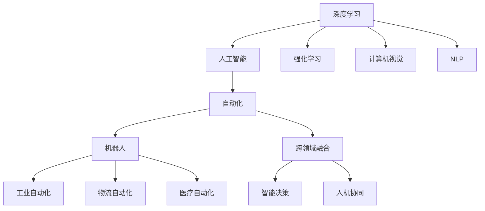

                 

# Andrej Karpathy谈自动化革命

## 1. 背景介绍

在计算机科学的发展历程中，自动化一直是推动技术进步的重要驱动力。从早期的机器学习到如今的深度学习，每一次技术突破都伴随着自动化的飞跃。本文将深入探讨Andrej Karpathy关于自动化革命的观点，分析其对未来技术发展的深远影响。

## 2. 核心概念与联系

Andrej Karpathy，作为深度学习领域的顶尖专家，其关于自动化的思考极富洞察力。自动化不仅仅局限于自动化工具的使用，更涉及人工智能与人类工作的协同与融合。这一过程，既包括技术层面的革新，也涵盖文化、经济和社会等多个维度的深刻变革。

### 2.1 核心概念概述

#### 自动化(Automation)
自动化是指通过机器或软件执行原本由人类完成的任务的过程。随着技术的不断进步，自动化逐渐从重复性工作转向需要更多创造性和决策能力的任务。

#### 深度学习(Deep Learning)
深度学习是机器学习的一个子领域，主要通过多层神经网络来模拟人类大脑的思维过程。其在图像识别、自然语言处理等领域已取得显著成果。

#### 人工智能(Artificial Intelligence)
人工智能是指通过计算机模拟人类智能行为的技术。包括学习、推理、知识表示、自然语言理解、机器视觉等多个子领域。

#### 机器人(Robotics)
机器人是指可执行特定任务的自动化装置，包括机械臂、无人车、无人机等。机器人在制造业、物流、医疗等领域有广泛应用。

#### 强化学习(Reinforcement Learning)
强化学习是一种通过奖励和惩罚机制，让机器学习如何在复杂环境中做出最优决策的技术。

#### 计算机视觉(Computer Vision)
计算机视觉是指让计算机理解并解释图像和视频数据的技术。在自动驾驶、医疗影像分析等领域有广泛应用。

#### 自然语言处理(Natural Language Processing, NLP)
自然语言处理是指让计算机理解、生成和处理人类语言的技术。包括语言模型、文本分类、情感分析、机器翻译等多个子领域。

#### 跨领域融合(Cross-Disciplinary Integration)
跨领域融合是指不同技术领域的交叉与融合，如计算机视觉与机器学习、人工智能与机器人学等。这一过程有助于解决复杂的现实问题。

### 2.2 概念间的关系

自动化革命不仅仅是技术的革新，更是深层次的文化、经济和社会变革。以下是几个关键概念之间的关系：



该图展示了自动化革命中各技术概念之间的关系：

1. 深度学习作为基础技术，推动了人工智能的发展。
2. 强化学习、计算机视觉和自然语言处理等子领域，都是人工智能的重要组成部分。
3. 通过机器人技术，人工智能得以在具体应用场景中落地。
4. 跨领域融合使得各技术领域相互协作，解决复杂现实问题。
5. 最终，这些技术共同推动了自动化革命，影响了工业、物流、医疗等多个领域。

## 3. Andrej Karpathy的核心观点

Andrej Karpathy在自动化革命方面的主要观点包括：

### 3.1 算法原理概述

Andrej Karpathy认为，自动化革命的关键在于深度学习算法的不断进步。深度学习通过多层神经网络模拟人类大脑的思维过程，具有强大的自我学习能力和泛化能力。

#### 深度学习的基本原理
深度学习模型通常由多个隐藏层构成。每个隐藏层通过前一层的输出作为输入，通过反向传播算法不断调整权重，以最小化损失函数。最终模型可以学习到复杂的特征表示，适用于各种任务。

#### 神经网络的结构
神经网络的结构通常包括输入层、隐藏层和输出层。其中，隐藏层通过激活函数进行非线性变换，使得模型能够处理更加复杂的数据结构。

#### 反向传播算法
反向传播算法是深度学习中常用的优化算法，通过链式法则计算梯度，实现参数的自动更新。这一过程使得模型能够在大量数据上进行有效的训练。

### 3.2 算法步骤详解

Andrej Karpathy认为，自动化技术的实现过程通常包括以下几个关键步骤：

#### 1. 数据准备
深度学习模型的训练需要大量的数据。通常，这些数据需要经过预处理、标注和清洗，以确保数据的质量和一致性。

#### 2. 模型构建
根据具体任务，选择合适的深度学习模型结构，如卷积神经网络(CNN)、循环神经网络(RNN)、长短期记忆网络(LSTM)等。

#### 3. 模型训练
使用训练集对模型进行迭代训练，通过反向传播算法更新模型参数，以最小化损失函数。

#### 4. 模型评估
在验证集上对模型进行评估，检查模型的泛化能力和性能表现。

#### 5. 模型部署
将训练好的模型部署到实际应用场景中，进行推理和预测。

#### 6. 持续优化
根据实际应用反馈，不断优化模型结构和参数，提高模型的性能和鲁棒性。

### 3.3 算法优缺点

Andrej Karpathy认为，深度学习算法在自动化技术中具有以下优点：

#### 优点
1. 强大的自我学习能力：深度学习模型可以通过大量数据进行自我学习，逐步提高性能。
2. 泛化能力：深度学习模型能够在未见过的数据上进行有效预测。
3. 可解释性：通过可视化技术，可以理解深度学习模型的内部决策过程。

#### 缺点
1. 训练数据需求高：深度学习模型需要大量的标注数据进行训练，数据收集和标注成本较高。
2. 计算资源需求大：深度学习模型通常需要强大的计算资源进行训练和推理。
3. 模型的黑盒性质：深度学习模型常常被视为"黑盒"，难以解释其内部工作机制。

### 3.4 算法应用领域

Andrej Karpathy认为，深度学习算法在以下领域具有广泛的应用前景：

#### 1. 自动驾驶
深度学习在自动驾驶领域具有重要应用。通过计算机视觉和强化学习技术，汽车可以感知环境、规划路径并做出决策。

#### 2. 医疗诊断
深度学习在医学影像分析和疾病预测中具有重要应用。通过卷积神经网络对医学影像进行分类和分析，提高诊断的准确性和效率。

#### 3. 自然语言处理
深度学习在自然语言处理领域具有广泛应用。通过循环神经网络和注意力机制，深度学习模型可以实现语言理解、文本生成和情感分析等任务。

#### 4. 工业自动化
深度学习在工业自动化领域具有重要应用。通过机器人技术，深度学习模型可以实现自动化生产、质量检测和故障诊断等任务。

#### 5. 金融分析
深度学习在金融分析领域具有重要应用。通过卷积神经网络和循环神经网络，深度学习模型可以实现股票预测、风险评估和信用评分等任务。

#### 6. 图像识别
深度学习在图像识别领域具有重要应用。通过卷积神经网络，深度学习模型可以实现人脸识别、物体检测和图像分类等任务。

#### 7. 推荐系统
深度学习在推荐系统领域具有重要应用。通过协同过滤和矩阵分解，深度学习模型可以实现个性化推荐和广告投放等任务。

## 4. 数学模型和公式 & 详细讲解

Andrej Karpathy认为，深度学习的数学模型和公式是其核心基础。以下是深度学习中几个关键数学模型和公式的详细讲解：

### 4.1 数学模型构建

#### 1. 线性回归模型
线性回归模型是深度学习的基础模型之一。其数学表达式为：
$$ y = w^T x + b $$
其中，$w$ 是权重向量，$x$ 是输入向量，$b$ 是偏置项，$y$ 是输出向量。

#### 2. 多层感知机模型
多层感知机模型由多个线性回归层组成。其数学表达式为：
$$ z^{[l]} = W^{[l]} x^{[l-1]} + b^{[l]} $$
$$ a^{[l]} = f(z^{[l]}) $$
其中，$W^{[l]}$ 是权重矩阵，$x^{[l-1]}$ 是前一层的输出向量，$b^{[l]}$ 是偏置向量，$f$ 是激活函数，$z^{[l]}$ 是前一层的线性输出，$a^{[l]}$ 是前一层的激活输出。

#### 3. 反向传播算法
反向传播算法是深度学习中常用的优化算法。其数学表达式为：
$$ \Delta W^{[l]} = \frac{\partial L}{\partial W^{[l]}} $$
$$ \Delta b^{[l]} = \frac{\partial L}{\partial b^{[l]}} $$
其中，$L$ 是损失函数，$\Delta W^{[l]}$ 是权重梯度，$\Delta b^{[l]}$ 是偏置梯度。

### 4.2 公式推导过程

#### 1. 线性回归模型的推导
线性回归模型是深度学习的基础模型之一。其数学表达式为：
$$ y = w^T x + b $$
其中，$w$ 是权重向量，$x$ 是输入向量，$b$ 是偏置项，$y$ 是输出向量。

#### 2. 多层感知机模型的推导
多层感知机模型由多个线性回归层组成。其数学表达式为：
$$ z^{[l]} = W^{[l]} x^{[l-1]} + b^{[l]} $$
$$ a^{[l]} = f(z^{[l]}) $$
其中，$W^{[l]}$ 是权重矩阵，$x^{[l-1]}$ 是前一层的输出向量，$b^{[l]}$ 是偏置向量，$f$ 是激活函数，$z^{[l]}$ 是前一层的线性输出，$a^{[l]}$ 是前一层的激活输出。

#### 3. 反向传播算法的推导
反向传播算法是深度学习中常用的优化算法。其数学表达式为：
$$ \Delta W^{[l]} = \frac{\partial L}{\partial W^{[l]}} $$
$$ \Delta b^{[l]} = \frac{\partial L}{\partial b^{[l]}} $$
其中，$L$ 是损失函数，$\Delta W^{[l]}$ 是权重梯度，$\Delta b^{[l]}$ 是偏置梯度。

### 4.3 案例分析与讲解

#### 案例：手写数字识别
手写数字识别是深度学习中常用的应用案例之一。通过卷积神经网络，深度学习模型可以识别手写数字。以下是对该案例的详细讲解：

##### 数据准备
首先，需要准备手写数字图像数据集。常用的数据集包括MNIST和CIFAR-10等。

##### 模型构建
使用卷积神经网络对图像进行分类。卷积神经网络包含卷积层、池化层和全连接层。卷积层和池化层用于提取图像特征，全连接层用于分类。

##### 模型训练
使用训练集对模型进行迭代训练，通过反向传播算法更新模型参数，以最小化损失函数。

##### 模型评估
在验证集上对模型进行评估，检查模型的泛化能力和性能表现。

##### 模型部署
将训练好的模型部署到实际应用场景中，进行手写数字识别。

##### 持续优化
根据实际应用反馈，不断优化模型结构和参数，提高模型的性能和鲁棒性。

## 5. 项目实践：代码实例和详细解释说明

Andrej Karpathy在深度学习项目实践中强调了以下几方面的内容：

### 5.1 开发环境搭建

#### 1. 安装Anaconda
首先，需要在本地安装Anaconda。

```bash
conda install anaconda
```

#### 2. 创建虚拟环境
创建一个虚拟环境，以避免与其他软件冲突。

```bash
conda create --name myenv
conda activate myenv
```

#### 3. 安装必要的Python包
安装必要的Python包，如NumPy、Pandas、Matplotlib等。

```bash
conda install numpy pandas matplotlib
```

### 5.2 源代码详细实现

#### 5.2.1 数据准备
使用MNIST数据集，准备手写数字图像数据集。

```python
import numpy as np
import tensorflow as tf
from tensorflow.keras.datasets import mnist

(x_train, y_train), (x_test, y_test) = mnist.load_data()
x_train = x_train.reshape(-1, 28*28).astype(np.float32) / 255.0
x_test = x_test.reshape(-1, 28*28).astype(np.float32) / 255.0
```

#### 5.2.2 模型构建
使用卷积神经网络对图像进行分类。卷积神经网络包含卷积层、池化层和全连接层。

```python
model = tf.keras.models.Sequential([
    tf.keras.layers.Conv2D(32, (3,3), activation='relu', input_shape=(28,28,1)),
    tf.keras.layers.MaxPooling2D((2,2)),
    tf.keras.layers.Flatten(),
    tf.keras.layers.Dense(10, activation='softmax')
])
```

#### 5.2.3 模型训练
使用训练集对模型进行迭代训练，通过反向传播算法更新模型参数，以最小化损失函数。

```python
model.compile(optimizer='adam', loss='sparse_categorical_crossentropy', metrics=['accuracy'])
model.fit(x_train, y_train, epochs=10, batch_size=64, validation_data=(x_test, y_test))
```

#### 5.2.4 模型评估
在验证集上对模型进行评估，检查模型的泛化能力和性能表现。

```python
model.evaluate(x_test, y_test)
```

#### 5.2.5 模型部署
将训练好的模型部署到实际应用场景中，进行手写数字识别。

```python
from tensorflow.keras.models import load_model
model = load_model('my_model.h5')
```

### 5.3 代码解读与分析

#### 5.3.1 数据准备
在数据准备阶段，需要将图像数据转换为模型所需的格式，并进行预处理。

#### 5.3.2 模型构建
在模型构建阶段，需要选择合适的深度学习模型结构，并进行适当的调整。

#### 5.3.3 模型训练
在模型训练阶段，需要使用训练集对模型进行迭代训练，不断更新模型参数。

#### 5.3.4 模型评估
在模型评估阶段，需要在验证集上对模型进行评估，检查模型的泛化能力和性能表现。

#### 5.3.5 模型部署
在模型部署阶段，需要将训练好的模型部署到实际应用场景中，进行推理和预测。

### 5.4 运行结果展示

#### 5.4.1 训练结果
在训练阶段，可以通过TensorBoard查看模型训练的过程和结果。

#### 5.4.2 评估结果
在评估阶段，可以通过精度、召回率等指标，评估模型的性能表现。

#### 5.4.3 推理结果
在推理阶段，可以通过模型进行手写数字识别，并输出识别结果。

## 6. 实际应用场景

Andrej Karpathy认为，深度学习技术在以下领域具有广泛的应用前景：

### 6.1 自动驾驶
自动驾驶是深度学习的重要应用领域之一。通过计算机视觉和强化学习技术，汽车可以感知环境、规划路径并做出决策。

### 6.2 医疗诊断
深度学习在医学影像分析和疾病预测中具有重要应用。通过卷积神经网络对医学影像进行分类和分析，提高诊断的准确性和效率。

### 6.3 自然语言处理
深度学习在自然语言处理领域具有广泛应用。通过循环神经网络和注意力机制，深度学习模型可以实现语言理解、文本生成和情感分析等任务。

### 6.4 工业自动化
深度学习在工业自动化领域具有重要应用。通过机器人技术，深度学习模型可以实现自动化生产、质量检测和故障诊断等任务。

### 6.5 金融分析
深度学习在金融分析领域具有重要应用。通过卷积神经网络和循环神经网络，深度学习模型可以实现股票预测、风险评估和信用评分等任务。

### 6.6 图像识别
深度学习在图像识别领域具有重要应用。通过卷积神经网络，深度学习模型可以实现人脸识别、物体检测和图像分类等任务。

### 6.7 推荐系统
深度学习在推荐系统领域具有重要应用。通过协同过滤和矩阵分解，深度学习模型可以实现个性化推荐和广告投放等任务。

## 7. 工具和资源推荐

Andrej Karpathy在深度学习工具和资源方面有丰富的推荐：

### 7.1 学习资源推荐

#### 1. 《深度学习》课程
斯坦福大学提供的《深度学习》课程，是学习深度学习技术的经典资源。

#### 2. TensorFlow官方文档
TensorFlow官方文档提供了深度学习模型的详细说明和示例代码。

#### 3. PyTorch官方文档
PyTorch官方文档提供了深度学习模型的详细说明和示例代码。

#### 4. Kaggle竞赛平台
Kaggle竞赛平台提供了大量数据集和比赛任务，是深度学习实践的绝佳平台。

#### 5. Google Colab
Google Colab提供了免费的GPU/TPU算力，方便开发者进行深度学习实验。

### 7.2 开发工具推荐

#### 1. TensorFlow
TensorFlow是深度学习领域的主流框架之一，提供了强大的计算图和分布式训练功能。

#### 2. PyTorch
PyTorch是深度学习领域的另一主流框架，提供了动态计算图和易于调试的API。

#### 3. Jupyter Notebook
Jupyter Notebook是一个开源的交互式笔记本平台，方便开发者进行深度学习实验和分享代码。

#### 4. TensorBoard
TensorBoard是TensorFlow配套的可视化工具，方便开发者实时监测模型训练状态。

#### 5. Weights & Biases
Weights & Biases是一个模型实验跟踪工具，方便开发者记录和可视化模型训练过程。

### 7.3 相关论文推荐

Andrej Karpathy认为，深度学习领域的经典论文是学习深度学习技术的重要参考。以下是几篇经典论文：

#### 1. 《ImageNet Classification with Deep Convolutional Neural Networks》
论文作者：Alex Krizhevsky, Ilya Sutskever, Geoffrey Hinton
介绍了使用卷积神经网络进行图像分类的算法，取得了ImageNet数据集上的优异表现。

#### 2. 《Long Short-Term Memory》
论文作者：Sutskever, V. M., Hinton, G. E., & Salakhutdinov, R. R.
介绍了长短期记忆网络，解决了循环神经网络在处理长序列数据时的梯度消失问题。

#### 3. 《Attention is All You Need》
论文作者：Vaswani, A., Shazeer, N., Parmar, N., Uszkoreit, J., Jones, L., Gomez, A. N., Kaiser, L., & Polosukhin, I.
介绍了注意力机制在深度学习中的应用，提出了Transformer模型。

#### 4. 《Image Super-Resolution Using Very Deep Convolutional Neural Networks》
论文作者：Zhang, J., Zou, W., Cao, Y., Hoiem, D., & Feichtenhofer, C.
介绍了使用卷积神经网络进行图像超分辨率的方法，取得了令人瞩目的效果。

#### 5. 《Using Convolutional Neural Networks for Large Scale Image Recognition》
论文作者：LeCun, Y., Bottou, L., Bengio, Y., & Haffner, P.
介绍了使用卷积神经网络进行大规模图像识别的算法，推动了计算机视觉领域的发展。

## 8. 总结：未来发展趋势与挑战

### 8.1 研究成果总结

Andrej Karpathy认为，深度学习技术在自动化革命中具有重要地位。通过不断优化算法和模型，深度学习技术在多个领域取得了突破性进展。

### 8.2 未来发展趋势

#### 1. 算法的不断优化
未来，深度学习算法的优化将继续推动技术进步。通过更好的优化算法和模型结构，深度学习技术将进一步提升模型的性能和鲁棒性。

#### 2. 跨领域融合的深入
未来，跨领域融合将成为深度学习技术的重要趋势。通过与其他技术领域的结合，深度学习技术将解决更多复杂的现实问题。

#### 3. 模型鲁棒性的提升
未来，模型鲁棒性的提升将是深度学习技术的重要方向。通过引入更多数据增强和对抗训练技术，深度学习模型将更加稳定和可靠。

#### 4. 模型的可解释性增强
未来，模型的可解释性将成为深度学习技术的重要课题。通过更好的可视化技术和解释方法，深度学习模型将更加透明和可理解。

#### 5. 大数据和边缘计算的结合
未来，大数据和边缘计算将深度结合，推动深度学习技术在实时性和效率上的提升。通过分布式计算和边缘计算技术，深度学习模型将更高效地进行推理和预测。

### 8.3 面临的挑战

#### 1. 数据获取和标注的困难
深度学习技术需要大量高质量的数据进行训练，数据获取和标注成本较高。未来，如何降低数据需求和提高数据质量，将是深度学习技术的重要挑战。

#### 2. 模型复杂度的增加
深度学习模型的复杂度不断增加，训练和推理的计算资源需求也相应增加。未来，如何优化模型结构并提高计算效率，将是深度学习技术的重要研究方向。

#### 3. 模型的可解释性不足
深度学习模型常常被视为"黑盒"，难以解释其内部工作机制。未来，如何增强模型的可解释性，将是深度学习技术的重要课题。

#### 4. 模型偏见和公平性问题
深度学习模型可能会学习到有偏见的信息，导致不公平的输出。未来，如何消除模型偏见并确保公平性，将是深度学习技术的重要研究方向。

#### 5. 伦理和社会责任
深度学习技术的广泛应用可能会带来伦理和社会责任问题，如隐私保护、数据安全等。未来，如何在技术应用中保证伦理和社会责任，将是深度学习技术的重要课题。

### 8.4 研究展望

#### 1. 无监督学习的研究
未来，无监督学习技术将成为深度学习技术的重要方向。通过更好的无监督学习算法，深度学习模型将更加灵活和高效。

#### 2. 模型压缩和优化
未来，模型压缩和优化技术将成为深度学习技术的重要研究方向。通过更好的模型压缩和优化技术，深度学习模型将更加轻量级和高效。

#### 3. 跨领域融合的应用
未来，跨领域融合技术将成为深度学习技术的重要方向。通过与其他技术领域的结合，深度学习技术将解决更多复杂的现实问题。

#### 4. 模型鲁棒性的提升
未来，模型鲁棒性的提升将是深度学习技术的重要方向。通过引入更多数据增强和对抗训练技术，深度学习模型将更加稳定和可靠。

#### 5. 模型可解释性的增强
未来，模型的可解释性将成为深度学习技术的重要课题。通过更好的可视化技术和解释方法，深度学习模型将更加透明和可理解。

#### 6. 大数据和边缘计算的结合
未来，大数据和边缘计算将深度结合，推动深度学习技术在实时性和效率上的提升。通过分布式计算和边缘计算技术，深度学习模型将更高效地进行推理和预测。

## 9. 附录：常见问题与解答

**Q1: 如何理解深度学习技术的优势和局限？**

A: 深度学习技术具有强大的自我学习能力、泛化能力和灵活性。其能够处理复杂的非线性关系，适用于各种任务。然而，深度学习技术也存在计算资源需求大、数据需求高、模型复杂等问题，需要不断优化和改进。

**Q2: 如何提高深度学习模型的可解释性？**

A: 提高深度学习模型的可解释性可以从多个方面入手，如可视化技术、特征重要性分析、解释方法等。通过更好的可视化技术和解释方法，深度学习模型将更加透明和可理解。

**Q3: 如何处理深度学习模型中的偏见问题？**

A: 处理深度学习模型中的偏见问题需要从数据预处理、模型设计、算法优化等多个方面入手。通过更好的数据预处理和模型设计，可以减少模型偏见。同时，引入公平性约束和伦理导向的评估指标，可以有效避免有偏见和歧视的输出。

**Q4: 如何优化深度学习算法的效率？**

A: 优化深度学习算法的效率可以从多个方面入手，如模型压缩、优化算法、分布式计算等。通过更好的模型压缩和优化算法，深度学习模型将更加轻量级和高效。同时，引入分布式计算和边缘计算技术，可以进一步提升模型的推理和预测速度。

**Q5: 深度学习技术在实际应用中面临哪些挑战？**

A: 深度学习技术在实际应用中面临的挑战包括数据获取和标注的困难、模型复杂度的增加、模型的可解释性不足、模型偏见和公平性问题、伦理和社会责任等。未来，需要从多个方面进行改进和优化，以解决这些挑战。

总结起来，Andrej Karpathy关于自动化革命的观点具有深刻的洞察力和前瞻性。通过不断优化深度学习算法和模型，自动化技术将在各个领域实现更广泛的应用，推动社会的不断进步。

