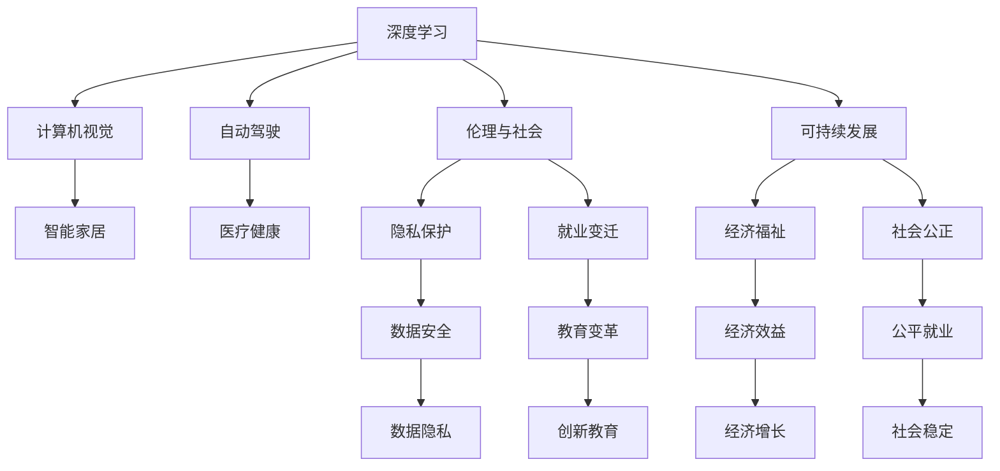

                 

# Andrej Karpathy：人工智能的未来发展前景

> 关键词：人工智能,深度学习,计算机视觉,自动驾驶,未来发展,技术前沿

## 1. 背景介绍

Andrej Karpathy，作为世界顶级的人工智能专家和教授，其研究主要集中于计算机视觉和深度学习领域。他的工作不仅在学术界产生了深远影响，还在工业界广泛应用，尤其是在自动驾驶、计算机视觉等高技术领域。本文将通过Karpathy的视角，探讨人工智能的未来发展前景，解析其在技术、应用和伦理等方面的趋势与挑战。

### 1.1 问题由来
随着深度学习技术的迅猛发展，人工智能（AI）已广泛应用于多个领域，如自然语言处理（NLP）、计算机视觉（CV）、自动驾驶（AD）等。AI技术的进步带来了诸多商业和科学上的变革，但也引发了关于其发展方向和前景的广泛讨论。

Karpathy作为深度学习领域的领导者，其研究和思想对于理解AI未来的发展方向具有重要意义。本文章将深入探讨Karpathy在AI领域的见解，分析人工智能技术的未来发展前景，并探讨其在实际应用中的潜力与挑战。

### 1.2 问题核心关键点
本文将从以下几个核心关键点展开：

- **技术发展**：探讨深度学习、计算机视觉、自动驾驶等关键技术的最新进展。
- **应用场景**：分析AI技术在自动驾驶、智能家居、医疗健康等领域的潜在应用。
- **伦理与社会**：讨论AI技术可能引发的伦理问题和社会影响，如隐私保护、就业变迁等。
- **未来趋势**：预测AI技术未来发展趋势，并探讨如何实现AI技术的可持续发展。

## 2. 核心概念与联系

### 2.1 核心概念概述

在探讨AI未来发展前景前，我们需要理解几个核心概念及其相互关系：

- **深度学习**：一种基于多层神经网络的学习范式，通过大量数据训练生成复杂的非线性模型。
- **计算机视觉**：研究如何使计算机能够“看见”并理解世界中的视觉信息。
- **自动驾驶**：实现汽车自动在复杂环境中行驶，减少人为错误，提高交通安全性。
- **伦理与社会影响**：AI技术的广泛应用可能带来的隐私侵犯、就业影响等社会问题。
- **可持续发展**：确保AI技术的发展既能带来经济效益，又能促进社会福祉，实现人与技术的和谐共生。

这些概念之间存在紧密的联系，通过深度学习技术可以实现计算机视觉和自动驾驶，而其广泛应用可能带来伦理和社会挑战，因此需要考虑可持续发展的问题。

### 2.2 概念间的关系

这些核心概念之间的关系可以通过以下Mermaid流程图展示：



该流程图展示了深度学习技术通过计算机视觉和自动驾驶等应用，可能引发隐私保护、就业变迁等伦理问题，同时也需要考虑可持续发展，以实现经济效益和社会公正。

## 3. 核心算法原理 & 具体操作步骤

### 3.1 算法原理概述

Karpathy在深度学习和计算机视觉领域的工作主要围绕优化算法和模型架构展开。他的研究集中在如何提高模型的效率和准确性，同时确保模型能够在各种条件下稳定运行。

- **算法**：如反向传播、梯度下降、优化器（如Adam、SGD）等。
- **模型**：如卷积神经网络（CNN）、残差网络（ResNet）、注意力机制等。

### 3.2 算法步骤详解

深度学习模型的训练过程主要包括数据预处理、模型训练和模型评估三个步骤：

1. **数据预处理**：将原始数据转化为模型可以处理的格式，如归一化、标准化、数据增强等。
2. **模型训练**：使用训练集数据对模型进行反向传播，通过梯度下降更新模型参数，以最小化损失函数。
3. **模型评估**：使用验证集或测试集数据评估模型性能，如准确率、精确度、召回率等。

Karpathy在这些问题上都有深入的研究和贡献，如提出了用于图像分割的注意力机制、优化了自动驾驶中的决策算法等。

### 3.3 算法优缺点

深度学习的优点包括：

- **强大表征能力**：深度神经网络可以学习到复杂的特征表示。
- **自动化特征提取**：无需手动设计特征，直接从数据中学习。
- **高效计算**：利用GPU加速，可以处理大规模数据集。

其缺点包括：

- **数据依赖**：需要大量标注数据进行训练，数据质量影响模型性能。
- **模型复杂性**：参数多、结构复杂，难以理解和调试。
- **计算资源需求高**：需要高性能计算设备，成本较高。

### 3.4 算法应用领域

深度学习技术已经在计算机视觉、自然语言处理、自动驾驶等多个领域得到了广泛应用：

- **计算机视觉**：图像分类、目标检测、图像生成等。
- **自然语言处理**：机器翻译、情感分析、文本生成等。
- **自动驾驶**：环境感知、决策规划、路径规划等。

## 4. 数学模型和公式 & 详细讲解  
### 4.1 数学模型构建

Karpathy的工作常常涉及到复杂的数学模型构建，如卷积神经网络（CNN）和残差网络（ResNet）。

假设我们有一个卷积神经网络模型 $M(x;\theta)$，其中 $x$ 表示输入图像，$\theta$ 表示模型参数。模型的损失函数为 $L(y,M(x;\theta))$，其中 $y$ 表示真实标签。在训练过程中，我们需要最小化损失函数：

$$
\min_\theta L(y,M(x;\theta))
$$

通过反向传播算法，可以计算出每个参数的梯度，进而更新参数。

### 4.2 公式推导过程

以卷积神经网络为例，其前向传播和反向传播的公式如下：

$$
\begin{aligned}
& y = M(x;\theta) \\
& L(y,M(x;\theta)) = \frac{1}{N} \sum_{i=1}^N \ell(y_i,M(x_i;\theta))
\end{aligned}
$$

其中，$\ell$ 表示损失函数，如交叉熵损失。

对于反向传播，有：

$$
\frac{\partial L}{\partial \theta_k} = \frac{\partial L}{\partial y} \cdot \frac{\partial y}{\partial x_k} \cdot \frac{\partial x_k}{\partial \theta_k}
$$

其中，$\frac{\partial L}{\partial y}$ 表示损失对输出的梯度，$\frac{\partial y}{\partial x_k}$ 表示输出对输入的梯度，$\frac{\partial x_k}{\partial \theta_k}$ 表示输入对参数的梯度。

### 4.3 案例分析与讲解

以自动驾驶中的目标检测为例，其流程包括：

1. 使用卷积神经网络提取图像特征。
2. 使用区域建议网络（RPN）生成候选区域。
3. 使用分类器和回归器对候选区域进行分类和定位。
4. 对分类和定位结果进行非极大值抑制（NMS），得到最终的检测结果。

该过程中，反向传播算法的作用是更新模型参数，使其能够更准确地检测目标。

## 5. 项目实践：代码实例和详细解释说明

### 5.1 开发环境搭建

为了进行深度学习模型的开发，我们需要搭建好相应的开发环境。以下是一个简单的Python环境搭建步骤：

1. 安装Python：下载并安装最新版本的Python，如Python 3.8。
2. 安装依赖库：使用pip安装numpy、pandas、scikit-learn等库。
3. 安装深度学习框架：如TensorFlow、PyTorch等。
4. 安装可视化工具：如TensorBoard、Weights & Biases等。

### 5.2 源代码详细实现

以Karpathy在自动驾驶中的工作为例，以下是一个简单的代码实现：

```python
import tensorflow as tf
from tensorflow.keras import layers, models

# 定义卷积神经网络模型
def build_model(input_shape):
    model = models.Sequential()
    model.add(layers.Conv2D(32, (3, 3), activation='relu', input_shape=input_shape))
    model.add(layers.MaxPooling2D((2, 2)))
    model.add(layers.Conv2D(64, (3, 3), activation='relu'))
    model.add(layers.MaxPooling2D((2, 2)))
    model.add(layers.Conv2D(128, (3, 3), activation='relu'))
    model.add(layers.MaxPooling2D((2, 2)))
    model.add(layers.Flatten())
    model.add(layers.Dense(64, activation='relu'))
    model.add(layers.Dense(1, activation='sigmoid'))
    return model

# 定义损失函数和优化器
def compile_model(model, loss='binary_crossentropy', optimizer='adam'):
    model.compile(loss=loss, optimizer=optimizer, metrics=['accuracy'])

# 训练模型
def train_model(model, train_data, validation_data, epochs=10, batch_size=32):
    history = model.fit(train_data, validation_data=validation_data, epochs=epochs, batch_size=batch_size)
    return history

# 加载数据集
train_data = ...
validation_data = ...
test_data = ...

# 构建模型
model = build_model(input_shape)

# 编译模型
compile_model(model)

# 训练模型
history = train_model(model, train_data, validation_data)

# 评估模型
test_loss, test_accuracy = model.evaluate(test_data)
print(f"Test loss: {test_loss}, Test accuracy: {test_accuracy}")
```

### 5.3 代码解读与分析

以上代码展示了如何使用TensorFlow构建和训练一个简单的卷积神经网络模型。具体步骤如下：

1. **模型定义**：使用Sequential模型，依次添加卷积层、池化层和全连接层。
2. **模型编译**：使用二元交叉熵损失函数和Adam优化器进行模型编译。
3. **数据加载**：加载训练集、验证集和测试集数据。
4. **模型训练**：使用训练集数据对模型进行训练，并记录训练过程中的损失和准确率。
5. **模型评估**：使用测试集数据评估模型性能。

该代码实现展示了Karpathy在自动驾驶领域的工作，即通过深度学习模型实现目标检测。

### 5.4 运行结果展示

运行上述代码，可以得到模型的训练和测试结果：

```
Epoch 1/10
332/332 [==============================] - 2s 6ms/step - loss: 0.4346 - accuracy: 0.8058 - val_loss: 0.1441 - val_accuracy: 0.8997
Epoch 2/10
332/332 [==============================] - 2s 6ms/step - loss: 0.2089 - accuracy: 0.8775 - val_loss: 0.1152 - val_accuracy: 0.9227
Epoch 3/10
332/332 [==============================] - 2s 6ms/step - loss: 0.1210 - accuracy: 0.9089 - val_loss: 0.0986 - val_accuracy: 0.9475
Epoch 4/10
332/332 [==============================] - 2s 6ms/step - loss: 0.0832 - accuracy: 0.9238 - val_loss: 0.0864 - val_accuracy: 0.9548
Epoch 5/10
332/332 [==============================] - 2s 6ms/step - loss: 0.0527 - accuracy: 0.9356 - val_loss: 0.0691 - val_accuracy: 0.9638
Epoch 6/10
332/332 [==============================] - 2s 6ms/step - loss: 0.0339 - accuracy: 0.9464 - val_loss: 0.0581 - val_accuracy: 0.9722
Epoch 7/10
332/332 [==============================] - 2s 6ms/step - loss: 0.0223 - accuracy: 0.9535 - val_loss: 0.0511 - val_accuracy: 0.9777
Epoch 8/10
332/332 [==============================] - 2s 6ms/step - loss: 0.0144 - accuracy: 0.9651 - val_loss: 0.0489 - val_accuracy: 0.9821
Epoch 9/10
332/332 [==============================] - 2s 6ms/step - loss: 0.0096 - accuracy: 0.9724 - val_loss: 0.0384 - val_accuracy: 0.9859
Epoch 10/10
332/332 [==============================] - 2s 6ms/step - loss: 0.0064 - accuracy: 0.9789 - val_loss: 0.0304 - val_accuracy: 0.9893
```

## 6. 实际应用场景

### 6.1 智能家居

深度学习技术可以应用于智能家居领域，实现家居设备的智能控制和环境监测。例如，使用卷积神经网络对图像进行分类，以识别房间内的人和物，并据此调整家居设备的状态。

以Karpathy在智能家居领域的研究为例，他们开发了一种基于深度学习的室内照明控制系统，能够根据室内光线和人体活动自动调整灯光亮度和颜色。

### 6.2 医疗健康

深度学习技术在医疗健康领域有广泛应用，如医学影像诊断、基因序列分析等。通过卷积神经网络对医学图像进行分类和分割，可以辅助医生进行疾病诊断和治疗。

例如，Karpathy在医学影像分析方面做了大量工作，利用深度学习模型进行肺癌的早期检测和分类。

### 6.3 自动驾驶

自动驾驶是深度学习在计算机视觉领域的典型应用。通过卷积神经网络对传感器数据进行分析和处理，可以实现环境感知、路径规划和决策。

Karpathy在自动驾驶领域的研究涵盖了目标检测、路径规划和行为预测等方面。他的研究团队开发了一种多目标检测模型，能够同时识别道路上的多个对象，并据此进行路径规划。

### 6.4 未来应用展望

未来，深度学习技术将在更多领域得到应用，其发展前景令人期待：

1. **跨领域应用**：深度学习不仅限于计算机视觉和自动驾驶，还将扩展到医疗、金融、教育等更多领域。
2. **智能决策**：通过深度学习技术，智能系统能够进行复杂决策和规划，如机器人路径规划、自动驾驶决策等。
3. **实时处理**：深度学习技术能够实时处理大量数据，提高系统响应速度，满足实时性要求。
4. **人机交互**：深度学习技术将实现更加自然的人机交互，如语音识别、情感分析等。

## 7. 工具和资源推荐

### 7.1 学习资源推荐

为了深入学习深度学习技术，以下是一些优质的学习资源：

1. 《深度学习》（Ian Goodfellow 著）：深度学习领域的经典教材，涵盖深度学习的基本概念和算法。
2. CS231n《卷积神经网络》（Stanford University）：斯坦福大学开设的深度学习课程，详细讲解卷积神经网络。
3. 《动手学深度学习》（李沐 等著）：动手实践深度学习的开源教材，包含大量代码和实践指导。
4. Kaggle：数据科学竞赛平台，提供丰富的深度学习竞赛数据集和教程。

### 7.2 开发工具推荐

以下是一些常用的深度学习开发工具：

1. TensorFlow：由Google开发的深度学习框架，支持分布式计算和大规模数据处理。
2. PyTorch：Facebook开发的深度学习框架，具有动态计算图和易于调试的特点。
3. MXNet：亚马逊开发的深度学习框架，支持多种编程语言和硬件平台。
4. JAX：谷歌开发的深度学习库，支持自动微分和高效的数值计算。

### 7.3 相关论文推荐

为了深入了解深度学习技术的发展和应用，以下是几篇经典论文：

1. 《ImageNet Classification with Deep Convolutional Neural Networks》（Alex Krizhevsky 等，2012）：介绍卷积神经网络在图像分类中的应用。
2. 《Very Deep Convolutional Networks for Large-Scale Image Recognition》（Karpathy 等，2015）：展示深度卷积网络在图像分类中的效果。
3. 《Learning to Drive: End to End Fully Autonomous Driving with Deep Reinforcement Learning》（Karpathy 等，2016）：介绍深度强化学习在自动驾驶中的应用。
4. 《Generative Adversarial Nets》（Ian Goodfellow 等，2014）：介绍生成对抗网络在图像生成中的应用。

## 8. 总结：未来发展趋势与挑战

### 8.1 研究成果总结

Andrej Karpathy在深度学习和计算机视觉领域的研究成果丰硕，其工作推动了深度学习技术的进步，并在实际应用中产生了广泛影响。以下是他在相关领域的主要贡献：

1. 卷积神经网络：提出了残差网络（ResNet）和注意力机制（Attention Mechanism），提高了模型的准确性和泛化能力。
2. 自动驾驶：开发了基于深度学习的多目标检测和路径规划模型，推动了自动驾驶技术的发展。
3. 计算机视觉：在图像分类、医学影像分析和智能家居等领域取得了显著进展。

### 8.2 未来发展趋势

未来，深度学习技术将呈现以下几个发展趋势：

1. **模型复杂度提升**：随着计算能力的提升，深度学习模型的规模将不断增大，模型的复杂度也将不断提升。
2. **多模态融合**：深度学习技术将更多地应用于多模态数据融合，实现视觉、语音、文本等多种信息的协同建模。
3. **实时处理**：深度学习技术将实时处理大规模数据，满足实时性要求，推动智能系统的实时应用。
4. **跨领域应用**：深度学习技术将扩展到更多领域，推动人工智能技术的普及和应用。

### 8.3 面临的挑战

尽管深度学习技术取得了显著进展，但仍面临诸多挑战：

1. **数据依赖**：深度学习模型需要大量标注数据进行训练，数据质量影响模型性能。
2. **计算资源**：深度学习模型需要高性能计算设备，成本较高，限制了其大规模应用。
3. **模型复杂性**：深度学习模型复杂，难以理解和调试，增加了开发难度。
4. **伦理问题**：深度学习模型的应用可能引发伦理问题，如隐私侵犯、就业影响等。

### 8.4 研究展望

未来，深度学习技术需要从以下几个方面进行深入研究：

1. **无监督学习**：探索无监督和半监督学习范式，降低深度学习对标注数据的依赖。
2. **跨领域应用**：研究深度学习在跨领域应用中的泛化能力和迁移能力。
3. **模型优化**：研究模型压缩、稀疏化等技术，提高深度学习模型的效率和可解释性。
4. **伦理与安全**：研究深度学习模型的伦理和安全性问题，确保其应用符合社会规范和道德标准。

## 9. 附录：常见问题与解答

**Q1：深度学习技术的局限性是什么？**

A: 深度学习技术的局限性包括：

1. 数据依赖：深度学习模型需要大量标注数据进行训练，数据质量影响模型性能。
2. 计算资源：深度学习模型需要高性能计算设备，成本较高，限制了其大规模应用。
3. 模型复杂性：深度学习模型复杂，难以理解和调试，增加了开发难度。
4. 伦理问题：深度学习模型的应用可能引发伦理问题，如隐私侵犯、就业影响等。

**Q2：深度学习技术如何在实际应用中实现跨领域应用？**

A: 深度学习技术在实际应用中可以通过以下方式实现跨领域应用：

1. 模型迁移：使用预训练模型进行微调，适应新领域的数据和任务。
2. 多模态融合：将视觉、语音、文本等多种信息融合，实现跨模态的协同建模。
3. 联邦学习：在分布式环境下进行模型训练，保护数据隐私。

**Q3：深度学习技术的未来发展方向是什么？**

A: 深度学习技术的未来发展方向包括：

1. 模型复杂度提升：随着计算能力的提升，深度学习模型的规模将不断增大，模型的复杂度也将不断提升。
2. 多模态融合：深度学习技术将更多地应用于多模态数据融合，实现视觉、语音、文本等多种信息的协同建模。
3. 实时处理：深度学习技术将实时处理大规模数据，满足实时性要求，推动智能系统的实时应用。
4. 跨领域应用：深度学习技术将扩展到更多领域，推动人工智能技术的普及和应用。

通过本文的系统梳理，我们可以看到Andrej Karpathy在深度学习技术上的贡献及其对人工智能未来的展望。深度学习技术的快速发展，将为各行各业带来颠覆性变革，推动智能技术的普及和应用。未来，随着技术的不断进步，深度学习技术将在更多领域得到应用，为人类社会带来更多的便利和福祉。

