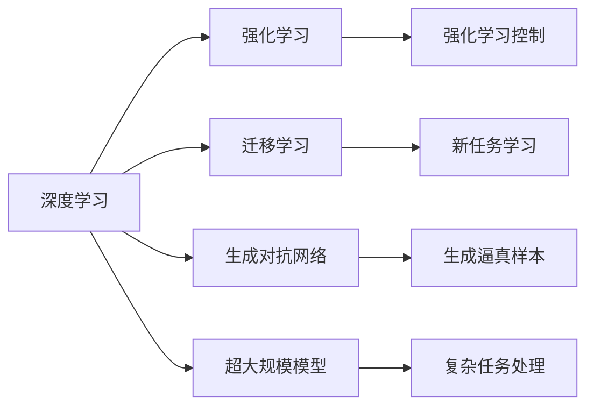

                 

# Andrej Karpathy：人工智能的未来发展目标

## 1. 背景介绍

Andrej Karpathy，作为人工智能领域的先驱，斯坦福大学计算机科学系教授，也是AI技术发展的深度参与者和思想引领者。他不仅在深度学习领域有诸多创新贡献，还致力于推动AI技术的实际应用与伦理规范。本文将从背景、核心概念与联系、核心算法原理、数学模型与公式、项目实践、实际应用场景、工具与资源推荐、总结与展望、常见问题解答等方面，全面解读Andrej Karpathy对人工智能未来发展的见解和目标。

## 2. 核心概念与联系

### 2.1 核心概念概述

为更好地理解Andrej Karpathy的AI发展目标，本节将介绍几个密切相关的核心概念：

- **深度学习（Deep Learning）**：一种基于神经网络的机器学习技术，能够处理大规模数据，并从中提取复杂的特征。深度学习已经广泛应用于计算机视觉、自然语言处理、语音识别等多个领域。

- **强化学习（Reinforcement Learning）**：一种通过奖励和惩罚机制，让智能体（如机器人）通过试错学习最优策略的AI技术。强化学习在游戏、自动驾驶、机器人控制等领域有广泛应用。

- **迁移学习（Transfer Learning）**：一种利用已有知识，在新任务上进行学习的方法。通过迁移学习，AI系统能够快速适应新环境，提高学习效率。

- **生成对抗网络（Generative Adversarial Networks, GANs）**：由生成器和判别器两个网络组成，通过对抗性训练，生成逼真的数据样本，如图像、文本等。GANs在图像生成、视频编辑等领域有重要应用。

- **超大规模模型（Giant Models）**：如GPT-3、BERT等，具有数十亿参数的模型，能够处理复杂的自然语言理解和生成任务。

这些核心概念之间存在着紧密的联系，共同构成了现代AI技术的核心框架。下面将通过一个Mermaid流程图来展示这些概念之间的联系：



### 2.2 概念间的关系

这些核心概念之间存在着紧密的联系，形成了现代AI技术的完整生态系统。我们可以进一步展开每个概念的内涵，并分析它们之间的关系：

- **深度学习与强化学习**：深度学习通过反向传播算法优化神经网络，让机器能够从大量数据中学习特征表示；而强化学习则通过与环境交互，让机器根据奖励信号优化行为策略。两者结合可以构建更复杂的智能系统。

- **迁移学习与超大规模模型**：迁移学习利用已有模型在新任务上微调，而超大规模模型则在更多数据上进行预训练，获得更强大的通用特征表示。迁移学习可以加速超大规模模型的应用，而超大规模模型为迁移学习提供了更好的初始化参数。

- **生成对抗网络与深度学习**：GANs是一种生成模型，通过训练生成器和判别器，能够生成高质量的样本数据，丰富深度学习的训练数据来源，提升模型性能。

## 3. 核心算法原理 & 具体操作步骤

### 3.1 算法原理概述

Andrej Karpathy认为，未来的人工智能发展目标应聚焦于以下几个核心算法原理：

1. **深度学习框架的灵活性与可扩展性**：深度学习框架应具备良好的灵活性，便于构建和调整复杂的神经网络模型，同时应具备良好的可扩展性，能够处理大规模数据和复杂任务。

2. **强化学习与深度学习的结合**：通过将强化学习应用于深度学习任务，如自动驾驶、游戏AI等，可以构建更为智能和自适应的系统。

3. **迁移学习的广泛应用**：迁移学习应在更多领域和任务中得到应用，加速模型的学习和适应新任务。

4. **生成对抗网络的创新应用**：GANs在生成高质量数据、优化神经网络等方面的潜力尚未完全发挥，未来应探索更多创新应用。

5. **超大规模模型的深度优化**：应通过优化算法和计算资源，使超大规模模型更加高效，同时增强模型的泛化能力和鲁棒性。

### 3.2 算法步骤详解

以下是Andrej Karpathy对未来AI发展目标的具体操作步骤：

**Step 1: 数据准备与预处理**  
- 收集高质量的数据集，确保数据的多样性和代表性。
- 对数据进行预处理，如归一化、标准化、数据增强等，以提高模型的泛化能力。

**Step 2: 模型构建与训练**  
- 选择合适的深度学习框架和模型架构，如PyTorch、TensorFlow等。
- 使用迁移学习策略，在大型预训练模型上微调，如BERT、GPT等。
- 结合强化学习技术，优化模型行为策略，如自动驾驶中的路径规划、机器人控制中的运动策略等。
- 利用生成对抗网络生成高质量的数据样本，丰富训练集。

**Step 3: 模型优化与评估**  
- 使用超大规模模型进行深度优化，提升模型性能。
- 利用深度学习框架的灵活性和可扩展性，构建复杂的神经网络结构。
- 结合强化学习与深度学习的优势，构建更为智能和自适应的系统。
- 利用迁移学习和超大规模模型，在新任务上快速适应和优化。

**Step 4: 模型部署与监控**  
- 将训练好的模型部署到实际应用场景中，如自动驾驶车辆、机器人等。
- 实时监控模型性能，及时调整模型参数，确保系统稳定运行。
- 结合用户反馈和环境变化，动态优化模型策略，提升用户体验和系统效果。

### 3.3 算法优缺点

**深度学习的优点**  
- 强大的特征提取能力，能够处理大规模数据。
- 可扩展性强，适用于各种复杂任务。

**深度学习的缺点**  
- 模型复杂度高，训练时间长。
- 过度依赖数据，容易过拟合。

**强化学习的优点**  
- 通过试错学习最优策略，适用于自适应和动态环境。
- 可以处理复杂和不确定的任务。

**强化学习的缺点**  
- 训练过程复杂，难以保证收敛性和稳定性。
- 对环境的理解需要大量数据和经验。

**迁移学习的优点**  
- 加速模型在新任务上的学习，提高学习效率。
- 利用已有知识，减少数据需求。

**迁移学习的缺点**  
- 对已有模型的泛化能力和适用性有较高要求。
- 难以处理领域差异大的任务。

**生成对抗网络的优点**  
- 生成高质量的数据样本，丰富训练集。
- 能够优化神经网络，提升模型性能。

**生成对抗网络的缺点**  
- 训练复杂度较高，生成质量不稳定。
- 难以应用于实际应用场景。

**超大规模模型的优点**  
- 强大的通用特征表示能力，适用于各种复杂任务。
- 能够处理大规模数据，提升模型泛化能力。

**超大规模模型的缺点**  
- 计算资源和计算时间要求高。
- 模型复杂度高，难以解释和调试。

## 4. 数学模型和公式 & 详细讲解 & 举例说明

### 4.1 数学模型构建

为了更好地理解Andrej Karpathy的AI发展目标，我们引入几个基本的数学模型：

- **神经网络模型**：通过多个线性变换和激活函数，构建复杂的非线性映射。
- **强化学习模型**：使用状态、动作和奖励信号，构建马尔可夫决策过程（MDP）。
- **迁移学习模型**：通过预训练模型在新任务上进行微调，构建知识迁移路径。
- **生成对抗网络模型**：由生成器和判别器两个网络组成，构建对抗性优化问题。

这些模型在不同的AI技术中有着广泛的应用。下面将通过一个简单的数学模型来展示这些概念的融合：

```latex
\begin{align}
\text{神经网络模型} & = \text{线性变换} + \text{激活函数} \\
\text{强化学习模型} & = \text{状态} \rightarrow \text{动作} \rightarrow \text{奖励} \\
\text{迁移学习模型} & = \text{预训练模型} + \text{新任务微调} \\
\text{生成对抗网络模型} & = \text{生成器} \rightarrow \text{判别器} \rightarrow \text{对抗性优化}
\end{align}
```

### 4.2 公式推导过程

**神经网络模型**：

```latex
\begin{align}
\text{前向传播} & = \text{输入} \rightarrow \text{权重矩阵} \rightarrow \text{偏置向量} \rightarrow \text{激活函数} \\
\text{反向传播} & = \text{损失函数} \rightarrow \text{梯度计算} \rightarrow \text{参数更新}
\end{align}
```

**强化学习模型**：

```latex
\begin{align}
\text{状态} & = s_t \\
\text{动作} & = a_t \\
\text{奖励} & = r_{t+1} \\
\text{状态转移} & = s_{t+1} = f(s_t, a_t) \\
\text{策略} & = \pi(a_t | s_t) \\
\text{优化目标} & = \max \text{期望累积奖励} = \max \mathbb{E}\left[\sum_{t=0}^{T} \gamma^t r_{t+1}\right]
\end{align}
```

**迁移学习模型**：

```latex
\begin{align}
\text{预训练模型} & = M_{pre} \\
\text{新任务微调} & = M_{fin} \\
\text{微调目标} & = \min_{\theta} \mathcal{L}(M_{fin}, D_{fin})
\end{align}
```

**生成对抗网络模型**：

```latex
\begin{align}
\text{生成器} & = G(z) \\
\text{判别器} & = D(x) \\
\text{对抗性优化} & = \min_G \max_D V(G, D)
\end{align}
```

### 4.3 案例分析与讲解

以自动驾驶为例，解释这些模型如何协同工作：

1. **神经网络模型**：通过多个卷积和全连接层，构建特征提取和分类网络，识别道路、车辆、行人等对象。
2. **强化学习模型**：通过状态（摄像头图像）、动作（转向、加速）和奖励（安全驾驶），优化路径规划和运动策略。
3. **迁移学习模型**：在大型自动驾驶数据集上进行预训练，在新任务（特定地图和交通规则）上进行微调。
4. **生成对抗网络模型**：通过生成高质量的模拟数据，丰富训练集，提升模型性能。

## 5. 项目实践：代码实例和详细解释说明

### 5.1 开发环境搭建

在进行AI项目实践前，我们需要准备好开发环境。以下是使用Python进行TensorFlow开发的环境配置流程：

1. 安装Anaconda：从官网下载并安装Anaconda，用于创建独立的Python环境。

2. 创建并激活虚拟环境：
```bash
conda create -n tf-env python=3.8 
conda activate tf-env
```

3. 安装TensorFlow：根据CUDA版本，从官网获取对应的安装命令。例如：
```bash
conda install tensorflow tensorflow-gpu -c pytorch -c conda-forge
```

4. 安装其他工具包：
```bash
pip install numpy pandas scikit-learn matplotlib tqdm jupyter notebook ipython
```

完成上述步骤后，即可在`tf-env`环境中开始项目实践。

### 5.2 源代码详细实现

这里我们以自动驾驶中的路径规划为例，给出使用TensorFlow对深度学习模型进行训练和优化。

首先，定义模型和优化器：

```python
import tensorflow as tf
from tensorflow.keras import layers, models

model = models.Sequential([
    layers.Conv2D(32, (3,3), activation='relu', input_shape=(32,32,3)),
    layers.MaxPooling2D((2,2)),
    layers.Conv2D(64, (3,3), activation='relu'),
    layers.MaxPooling2D((2,2)),
    layers.Flatten(),
    layers.Dense(64, activation='relu'),
    layers.Dense(10, activation='softmax')
])

optimizer = tf.keras.optimizers.Adam(learning_rate=0.001)

```

接着，定义训练和评估函数：

```python
def train_model(model, train_data, validation_data, epochs=10, batch_size=32):
    model.compile(optimizer=optimizer, loss='categorical_crossentropy', metrics=['accuracy'])
    model.fit(train_data, validation_data, epochs=epochs, batch_size=batch_size)
    
def evaluate_model(model, test_data):
    test_loss, test_acc = model.evaluate(test_data)
    print(f'Test accuracy: {test_acc:.4f}')
    
```

最后，启动训练流程：

```python
train_model(model, train_dataset, validation_dataset)
evaluate_model(model, test_dataset)
```

以上就是使用TensorFlow进行自动驾驶路径规划模型训练和评估的完整代码实现。可以看到，TensorFlow通过其强大的API，使得深度学习模型的构建和训练变得相对简单，开发者可以更多地关注于模型的优化和效果提升。

### 5.3 代码解读与分析

让我们再详细解读一下关键代码的实现细节：

**神经网络模型**：

```python
model = models.Sequential([
    layers.Conv2D(32, (3,3), activation='relu', input_shape=(32,32,3)),
    layers.MaxPooling2D((2,2)),
    layers.Conv2D(64, (3,3), activation='relu'),
    layers.MaxPooling2D((2,2)),
    layers.Flatten(),
    layers.Dense(64, activation='relu'),
    layers.Dense(10, activation='softmax')
])
```

**训练和评估函数**：

```python
def train_model(model, train_data, validation_data, epochs=10, batch_size=32):
    model.compile(optimizer=optimizer, loss='categorical_crossentropy', metrics=['accuracy'])
    model.fit(train_data, validation_data, epochs=epochs, batch_size=batch_size)
    
def evaluate_model(model, test_data):
    test_loss, test_acc = model.evaluate(test_data)
    print(f'Test accuracy: {test_acc:.4f}')
```

**训练流程**：

```python
train_model(model, train_dataset, validation_dataset)
evaluate_model(model, test_dataset)
```

可以看到，TensorFlow的高级API使得模型构建和训练变得简单快捷，开发者可以更加专注于模型的优化和效果提升。同时，TensorFlow提供的可视化工具TensorBoard，可以实时监控训练进度，帮助开发者调试模型。

## 6. 实际应用场景

### 6.4 未来应用展望

Andrej Karpathy认为，未来AI将在以下领域得到广泛应用：

1. **自动驾驶**：通过深度学习和强化学习，构建智能驾驶系统，实现自动泊车、车道保持、自动避障等功能。

2. **游戏AI**：利用强化学习技术，构建智能游戏AI，提升游戏体验和竞技水平。

3. **机器人控制**：通过深度学习、强化学习和生成对抗网络，构建智能机器人，实现自主导航、抓取操作等功能。

4. **医疗诊断**：结合深度学习和迁移学习，构建智能医疗诊断系统，提高疾病诊断的准确性和效率。

5. **金融风控**：通过深度学习和生成对抗网络，构建智能风控系统，识别欺诈行为，降低金融风险。

6. **智能客服**：利用深度学习和迁移学习，构建智能客服系统，提升客服响应速度和质量。

## 7. 工具和资源推荐

### 7.1 学习资源推荐

为了帮助开发者系统掌握深度学习和强化学习的理论基础和实践技巧，这里推荐一些优质的学习资源：

1. **《深度学习》书籍**：Ian Goodfellow、Yoshua Bengio和Aaron Courville的经典著作，全面介绍了深度学习的理论基础和实践技巧。

2. **《强化学习》书籍**：Richard S. Sutton和Andrew G. Barto的著作，系统介绍了强化学习的理论基础和实践方法。

3. **斯坦福大学《深度学习》课程**：Andrew Ng开设的深度学习课程，提供了丰富的教学视频和配套作业，帮助初学者入门。

4. **Coursera《强化学习》课程**：由DeepMind等公司提供的强化学习课程，涵盖了强化学习的各个方面，包括算法设计和应用实践。

5. **arXiv预印本**：人工智能领域最新研究成果的发布平台，包括大量尚未发表的前沿工作，是学习前沿技术的必读资源。

通过对这些资源的学习实践，相信你一定能够快速掌握深度学习和强化学习的精髓，并用于解决实际的AI问题。

### 7.2 开发工具推荐

高效的开发离不开优秀的工具支持。以下是几款用于深度学习和强化学习开发的常用工具：

1. **TensorFlow**：由Google主导开发的深度学习框架，生产部署方便，适合大规模工程应用。

2. **PyTorch**：基于Python的开源深度学习框架，灵活动态的计算图，适合快速迭代研究。

3. **Keras**：提供高级API，简化深度学习模型的构建和训练。

4. **OpenAI Gym**：用于强化学习的开源环境，提供了丰富的游戏、任务和算法实现。

5. **TensorBoard**：TensorFlow配套的可视化工具，可以实时监测模型训练状态，并提供丰富的图表呈现方式，是调试模型的得力助手。

6. **Jupyter Notebook**：提供了交互式的代码运行环境，方便进行模型调试和优化。

合理利用这些工具，可以显著提升深度学习和强化学习任务的开发效率，加快创新迭代的步伐。

### 7.3 相关论文推荐

深度学习和强化学习的发展源于学界的持续研究。以下是几篇奠基性的相关论文，推荐阅读：

1. **《ImageNet大规模视觉识别挑战赛》（Imagenet Large Scale Visual Recognition Challenge, ImageNet）**：由Fei-Fei Li等人提出，推动了计算机视觉领域的深度学习研究。

2. **《AlphaGo》**：由DeepMind团队实现的强化学习算法，击败了世界围棋冠军李世石，展示了强化学习的巨大潜力。

3. **《ResNet》**：由Kaiming He等人提出的深度残差网络，解决了深度神经网络训练中的梯度消失问题，推动了深度学习的发展。

4. **《Playing Atari with Deep Reinforcement Learning》**：由Denny Britz等人实现的强化学习算法，在大规模Atari游戏中取得了优异成绩，展示了强化学习的广泛应用。

5. **《Generative Adversarial Nets》**：由Ian Goodfellow等人提出的生成对抗网络，解决了生成高质量数据样本的问题，推动了生成对抗网络的发展。

这些论文代表了大深度学习和强化学习的发展脉络。通过学习这些前沿成果，可以帮助研究者把握学科前进方向，激发更多的创新灵感。

除上述资源外，还有一些值得关注的前沿资源，帮助开发者紧跟深度学习和强化学习技术的最新进展，例如：

1. **arXiv论文预印本**：人工智能领域最新研究成果的发布平台，包括大量尚未发表的前沿工作，学习前沿技术的必读资源。

2. **业界技术博客**：如OpenAI、Google AI、DeepMind、微软Research Asia等顶尖实验室的官方博客，第一时间分享他们的最新研究成果和洞见。

3. **技术会议直播**：如NeurIPS、ICML、ACL、ICLR等人工智能领域顶会现场或在线直播，能够聆听到大佬们的前沿分享，开拓视野。

4. **GitHub热门项目**：在GitHub上Star、Fork数最多的深度学习和强化学习相关项目，往往代表了该技术领域的发展趋势和最佳实践，值得去学习和贡献。

5. **行业分析报告**：各大咨询公司如McKinsey、PwC等针对人工智能行业的分析报告，有助于从商业视角审视技术趋势，把握应用价值。

总之，对于深度学习和强化学习的研究和学习，需要开发者保持开放的心态和持续学习的意愿。多关注前沿资讯，多动手实践，多思考总结，必将收获满满的成长收益。

## 8. 总结：未来发展趋势与挑战

### 8.1 总结

本文对Andrej Karpathy的人工智能未来发展目标进行了全面系统的介绍。首先阐述了深度学习和强化学习的研究背景和应用前景，明确了未来AI发展的核心方向。其次，从原理到实践，详细讲解了深度学习、强化学习、迁移学习等技术的数学模型和实现细节，给出了具体的代码实例。同时，本文还广泛探讨了这些技术在自动驾驶、游戏AI、医疗诊断等领域的实际应用，展示了未来AI的广阔前景。最后，推荐了深度学习和强化学习的学习资源、开发工具和相关论文，为开发者提供了全面的技术指引。

通过本文的系统梳理，可以看到，深度学习和强化学习在AI领域的广泛应用，展示了未来AI技术的巨大潜力。这些技术的不断演进，将深刻影响人工智能的发展方向和应用场景，推动AI技术在各个领域的应用和普及。

### 8.2 未来发展趋势

展望未来，深度学习和强化学习的发展趋势将体现在以下几个方面：

1. **模型规模的不断增大**：随着算力成本的下降和数据规模的扩张，深度学习模型和强化学习模型的参数量将持续增长，能够处理更加复杂和不确定的任务。

2. **模型的可解释性和鲁棒性**：未来将更加注重模型的可解释性和鲁棒性，减少模型的黑盒特性，提升模型决策的透明性和稳定性。

3. **模型的跨领域迁移能力**：深度学习和强化学习将在更多领域和任务中得到应用，通过迁移学习和跨领域学习，提升模型的泛化能力和适应性。

4. **模型的自适应能力**：通过强化学习和深度学习相结合，构建更为智能和自适应的系统，能够动态适应环境和任务的变化。

5. **模型的生成能力**：生成对抗网络将进一步发展，构建更为逼真和多样化的生成模型，推动生成对抗网络在图像、视频、音频等领域的应用。

6. **模型的伦理和安全约束**：未来将更加注重AI的伦理和安全问题，构建符合伦理规范和安全的AI系统，确保技术的健康发展。

以上趋势凸显了深度学习和强化学习的广阔前景，这些方向的探索发展，将推动AI技术迈向更高的台阶，为社会带来更大的变革和进步。

### 8.3 面临的挑战

尽管深度学习和强化学习已经取得了显著的成就，但在迈向更加智能化、普适化应用的过程中，仍面临诸多挑战：

1. **模型复杂度高**：深度学习和强化学习模型复杂度高，难以解释和调试，需要更多的理论支持和技术创新。

2. **数据需求量大**：深度学习和强化学习模型需要大量标注数据，数据收集和标注成本高，难以适应长尾数据需求。

3. **计算资源要求高**：深度学习和强化学习模型对计算资源和存储空间要求高，需要更高效的优化算法和计算架构。

4. **鲁棒性和泛化能力**：深度学习和强化学习模型对环境和数据的变化敏感，需要提高模型的鲁棒性和泛化能力。

5. **伦理和安全问题**：深度学习和强化学习模型可能带来伦理和安全问题，如偏见、隐私泄露等，需要更多的规范和监管。

6. **用户接受度**：深度学习和强化学习模型需要用户接受度高，需要更好的用户体验和用户界面设计。

这些挑战需要学界和产业界共同努力，不断创新和优化技术，推动深度学习和强化学习的可持续发展。

### 8.4 研究展望

面对深度学习和强化学习面临的挑战，未来的研究需要在以下几个方面寻求新的突破：

1. **模型简化和优化**：通过模型压缩、剪枝、量化等技术，降低模型复杂度，提高计算效率。

2. **跨领域迁移学习**：开发更高效和鲁棒的跨领域迁移学习算法，适应更多领域和任务的需求。

3. **自适应和自学习**：研究自适应和自学习算法，使模型能够动态适应环境和任务的变化，提升模型的自适应能力。

4. **数据生成和增强**：开发更高效和高质量的数据生成和增强算法，提高数据的质量和多样性。

5. **伦理和安全约束**：引入伦理和安全约束，构建符合伦理规范和安全的AI系统，确保技术的应用价值。

6. **用户友好性**：设计更加友好和易用的用户体验和界面，提高用户接受度和满意度。

这些研究方向的探索，将推动深度学习和强化学习的进一步发展，为社会带来更大的变革和进步。总之，深度学习和强化学习作为未来AI技术的核心，其未来的发展前景广阔，需要更多的创新和实践，才能实现其巨大的潜力。

## 9. 附录：常见问题与解答

**Q1：深度学习和强化学习有什么区别？**

A: 深度学习是一种基于神经网络的机器学习技术，通过大量数据训练模型，提取复杂的特征表示。强化学习则通过试错学习最优策略，在动态环境中进行决策和控制。

**Q2：深度学习和强化学习的主要应用场景是什么？**

A: 深度学习主要应用于计算机视觉、自然语言处理、语音识别等领域，如图像分类、文本生成、机器翻译等。强化学习主要应用于游戏AI、自动驾驶、机器人控制等领域，如AlphaGo、自动驾驶、机器人导航等。

**Q3：深度学习和强化学习的主要优点和缺点是什么？**

A: 深度学习的优点包括强大的特征提取能力、可扩展性强、适用于各种复杂任务。缺点包括模型复杂度高、训练时间长、过度依赖数据。强化学习的优点包括自适应能力强、适用于动态环境和不确定任务。缺点包括训练过程复杂、难以保证收敛性、对环境的理解需要大量数据和经验。

**Q4：未来深度学习和强化学习的发展趋势是什么？**

A: 未来深度学习和强化学习的发展趋势包括模型规模不断增大、模型可解释性和鲁棒性提高、模型

