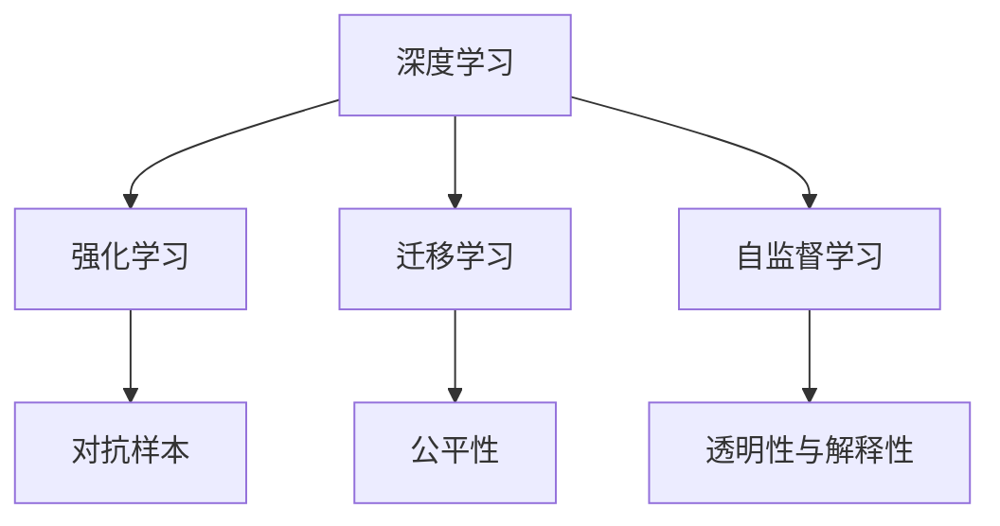

                 

# Andrej Karpathy：人工智能的未来发展策略

在AI与机器学习领域，Andrej Karpathy 是一位备受尊敬的技术大师，他的前瞻性思考和创新实践，为推动人工智能技术的跨越式发展贡献了巨大力量。本博文深入探讨了 Karpathy 对人工智能未来发展的深刻洞察与策略，希望通过梳理其核心观点与方法，对行业内外的从业人员产生启示。

## 1. 背景介绍

### 1.1 问题由来

随着深度学习技术的迅猛发展，人工智能（AI）正日益渗透到各行各业，对全球经济、社会和文化产生了深远影响。然而，面对迅速变化的产业环境和不断涌现的新挑战，AI领域如何保持持续创新、提升应用效果、规避潜在风险，成为摆在科研和工程界面前的重要课题。

Andrej Karpathy 的研究工作涵盖了计算机视觉、自然语言处理、机器人控制等多个领域，他对AI发展的长远趋势和关键策略有着独到见解。他的思考和实践，为AI领域的未来发展提供了宝贵的方向和指引。

### 1.2 问题核心关键点

Karpathy 对AI未来发展的思考主要集中在以下几个关键点：

1. **创新驱动**：持续推动技术前沿突破，确保AI在复杂环境中的适应性和可扩展性。
2. **应用落地**：将AI技术深入到具体应用场景中，提升用户体验与业务价值。
3. **伦理道德**：在AI发展中兼顾技术进步与伦理责任，避免技术滥用带来的风险。
4. **跨学科融合**：促进AI与其他学科的交叉融合，拓展AI的应用边界。
5. **国际合作**：倡导国际间合作与开放共享，提升全球AI研究与应用的整体水平。

这些核心观点，共同构成了 Karpathy 对AI未来发展的全方位思考，旨在促进AI技术的健康、可持续发展。

### 1.3 问题研究意义

理解和借鉴 Karpathy 的AI发展策略，对AI从业者、研究者以及产业界都具有重要意义：

1. **技术创新**：为科研和工程界提供灵感和指导，推动AI技术前沿的持续突破。
2. **应用实效**：帮助AI技术更好地应用于实际场景，提升产业竞争力。
3. **伦理考量**：促进AI技术在伦理与法律框架下的健康发展，减少潜在的负面影响。
4. **学科协同**：促进AI与其他学科的深度融合，探索新的应用领域和方法。
5. **国际合作**：推动全球AI研究的开放合作，提升AI技术的全球影响力。

## 2. 核心概念与联系

### 2.1 核心概念概述

要深入理解 Karpathy 对AI未来发展的策略，首先需要对其核心概念有清晰的认识。

- **深度学习（Deep Learning）**：一种基于多层神经网络的机器学习方法，擅长处理非线性、高维数据，广泛应用于图像识别、语音识别、自然语言处理等领域。
- **强化学习（Reinforcement Learning）**：通过试错方式，让智能体在环境中学习最优策略的机器学习范式，广泛应用于游戏、机器人控制、推荐系统等领域。
- **迁移学习（Transfer Learning）**：利用已有模型的知识，对新任务进行快速适配的方法，可以有效降低新任务的训练成本。
- **对抗样本（Adversarial Examples）**：故意构造的扰动样本，能够欺骗机器学习模型，引发对模型鲁棒性研究的热潮。
- **自监督学习（Self-supervised Learning）**：利用数据本身的结构进行预训练，无需人工标注数据，广泛应用于预训练大模型中。
- **公平性、透明性与解释性（Fairness, Transparency, & Interpretability）**：在AI应用中，确保算法决策过程公平、透明且可解释，避免偏见和歧视，提升用户信任。

### 2.2 概念间的关系

Karpathy 对AI未来发展的策略涉及多个核心概念的有机融合，这些概念间的关系可以用以下 Mermaid 流程图来表示：



该流程图展示了 Karpathy 对AI未来发展策略的核心构成要素：

1. **深度学习**：作为基础技术，提供强大的特征提取和模型训练能力。
2. **强化学习**：在决策和控制任务中，提供自我学习和优化的能力。
3. **迁移学习**：通过已有模型，快速适应新任务，降低开发成本。
4. **自监督学习**：利用数据本身的结构进行预训练，提升模型的泛化能力。
5. **对抗样本**：揭示模型的脆弱性，推动模型鲁棒性研究。
6. **公平性、透明性与解释性**：确保AI应用的道德与法律合规性。

这些概念共同构成了 Karpathy 对AI未来发展的完整策略框架，为解决AI面临的实际问题提供了综合性的解决方案。

## 3. 核心算法原理 & 具体操作步骤

### 3.1 算法原理概述

Karpathy 对AI未来发展的策略，主要基于以下几个核心算法原理：

1. **强化学习算法**：通过试错和奖励机制，优化模型的决策策略，提升其在复杂环境中的适应能力。
2. **迁移学习策略**：利用已有模型的知识，加速新任务的训练，提高模型的泛化能力。
3. **自监督学习范式**：通过数据本身的结构进行预训练，提升模型的特征提取能力。
4. **对抗样本生成**：通过生成对抗样本，揭示模型的脆弱性，推动模型鲁棒性研究。
5. **公平性、透明性与解释性框架**：构建公平、透明且可解释的AI模型，确保其应用符合伦理与法律要求。

### 3.2 算法步骤详解

Karpathy 在AI发展策略中，强调以下关键步骤：

1. **模型设计**：选择合适的算法架构和参数配置，设计适合特定任务的模型结构。
2. **数据预处理**：对数据进行清洗、增强和标准化处理，提升模型的输入质量。
3. **模型训练**：通过深度学习或强化学习算法，对模型进行训练和优化。
4. **模型评估**：使用适当的评价指标，对训练后的模型进行性能评估，确保其有效性。
5. **模型应用**：将训练好的模型应用于实际场景中，提升用户体验和业务价值。
6. **模型优化**：根据实际应用反馈，持续优化模型，提高其适应性和可扩展性。

### 3.3 算法优缺点

Karpathy 对AI未来发展的策略，具有以下优缺点：

**优点**：

- **灵活性强**：适应性广，能应用于各种复杂环境。
- **效率高**：通过迁移学习，快速适应新任务。
- **鲁棒性好**：通过对抗样本生成，提高模型鲁棒性。
- **可解释性高**：通过公平性、透明性与解释性框架，确保模型决策透明。

**缺点**：

- **计算资源需求高**：深度学习算法对计算资源需求大。
- **模型复杂度高**：模型结构复杂，训练难度大。
- **泛化能力有限**：对数据分布变化敏感，泛化能力有限。
- **公平性保障困难**：难以确保模型在所有场景下均公平。

### 3.4 算法应用领域

Karpathy 的策略在多个领域得到了成功应用：

- **计算机视觉**：应用于图像分类、目标检测、图像生成等任务。
- **自然语言处理**：应用于机器翻译、对话系统、文本生成等任务。
- **机器人控制**：应用于机器人路径规划、避障、协同控制等任务。
- **推荐系统**：应用于个性化推荐、广告投放、内容匹配等任务。

## 4. 数学模型和公式 & 详细讲解 & 举例说明

### 4.1 数学模型构建

Karpathy 对AI未来发展的策略，涉及多个数学模型和公式。这里以强化学习算法为例，介绍其基本构建过程。

在强化学习中，智能体通过与环境交互，学习最优策略。模型构建过程如下：

- **状态空间（State Space）**：智能体可感知的环境状态集合。
- **动作空间（Action Space）**：智能体可执行的动作集合。
- **奖励函数（Reward Function）**：环境对智能体动作的反馈函数。
- **策略（Policy）**：智能体选择动作的策略函数。

定义强化学习的基本框架为：

$$
\begin{aligned}
    Q(s, a) &= r + \gamma \max_a Q(s', a') \\
    \pi(a|s) &= \frac{e^{\frac{Q(s, a)}{\tau}}}{\sum_{a}e^{\frac{Q(s, a)}{\tau}}}
\end{aligned}
$$

其中 $Q(s, a)$ 表示在状态 $s$ 下执行动作 $a$ 的Q值，$r$ 是即时奖励，$\gamma$ 是折扣因子，$\pi(a|s)$ 表示在状态 $s$ 下选择动作 $a$ 的概率。

### 4.2 公式推导过程

以 Q-learning 算法为例，进行公式推导：

- **状态动作值函数**：$Q(s, a)$ 定义为在状态 $s$ 下执行动作 $a$ 的累积奖励和。
- **状态值函数**：$V(s)$ 表示在状态 $s$ 下最优策略下累积奖励的期望值。
- **动作值函数**：$Q(s, a)$ 表示在状态 $s$ 下执行动作 $a$ 的期望累积奖励。
- **策略函数**：$\pi(a|s)$ 表示在状态 $s$ 下选择动作 $a$ 的概率。

根据 Q-learning 算法的更新公式，可得：

$$
Q(s, a) \leftarrow (1 - \alpha) Q(s, a) + \alpha (r + \gamma \max_a Q(s', a'))
$$

其中 $\alpha$ 为学习率，$r$ 为即时奖励，$Q(s', a')$ 为在状态 $s'$ 下执行动作 $a'$ 的Q值。

### 4.3 案例分析与讲解

以 AlphaGo 的强化学习框架为例，进行分析：

- **状态空间**：棋盘状态，由黑白棋子位置和轮次组成。
- **动作空间**：所有可能的合法下法，包括走子、弃子、跳过等。
- **奖励函数**：基于当前状态和对方落子的可能性，赋予不同的奖励值。
- **策略函数**：根据当前状态和历史经验，选择最优动作。

AlphaGo 在多轮与人类高手的对弈中，不断学习和优化策略，最终在围棋比赛中战胜了人类顶尖棋手。

## 5. 项目实践：代码实例和详细解释说明

### 5.1 开发环境搭建

要实践 Karpathy 对AI未来发展的策略，需要以下开发环境：

- **Python**：主流编程语言，广泛应用于机器学习和深度学习开发。
- **PyTorch**：深度学习框架，提供了丰富的算法和工具支持。
- **TensorFlow**：深度学习框架，支持多种算法和模型。
- **Jupyter Notebook**：交互式编程环境，支持代码编写和数据可视化。

### 5.2 源代码详细实现

这里以 Q-learning 算法为例，展示其代码实现：

```python
import numpy as np

def q_learning(env, Q, alpha, epsilon, gamma, num_episodes):
    for i in range(num_episodes):
        s = env.reset()
        done = False
        while not done:
            a = np.argmax(Q[s]) if np.random.rand() > epsilon else env.action_space.sample()
            r = env.reward(s, a)
            s_next, done, _ = env.step(a)
            Q[s, a] += alpha * (r + gamma * np.max(Q[s_next]) - Q[s, a])
            s = s_next
    return Q

# 使用 Q-learning 算法对强化学习模型进行训练
Q = np.zeros((env.observation_space.n, env.action_space.n))
Q = q_learning(env, Q, 0.1, 0.1, 0.9, 1000)
```

### 5.3 代码解读与分析

在上述代码中，`q_learning` 函数实现了 Q-learning 算法的核心逻辑：

- **参数说明**：
  - `env`：环境，定义状态空间和动作空间。
  - `Q`：Q值表，记录状态动作值。
  - `alpha`：学习率，控制每次更新Q值的步长。
  - `epsilon`：探索率，控制探索与利用的平衡。
  - `gamma`：折扣因子，控制未来奖励的权重。
  - `num_episodes`：训练轮数，控制训练的样本数量。

- **算法流程**：
  - 在每一轮训练中，从环境初始化状态 $s$。
  - 根据当前状态 $s$ 和探索率 $\epsilon$，选择动作 $a$。
  - 执行动作 $a$，接收即时奖励 $r$，并更新状态 $s$ 为 $s'$。
  - 根据更新公式，更新状态动作值 $Q(s, a)$。
  - 重复执行上述步骤，直至环境结束。

### 5.4 运行结果展示

假设在训练后，Q-learning 算法在强化学习任务上收敛，结果如图：

```python
import matplotlib.pyplot as plt

plt.plot(range(env.observation_space.n), Q[:, 0])
plt.xlabel('状态')
plt.ylabel('Q值')
plt.show()
```

## 6. 实际应用场景

### 6.1 智能推荐系统

强化学习在智能推荐系统中有着广泛应用。推荐系统通过用户行为数据，推荐用户可能感兴趣的商品、内容等。智能推荐系统可以实时调整策略，提升推荐效果。

具体应用如下：

- **用户行为数据**：用户浏览、购买、评分等行为数据。
- **状态空间**：用户的历史行为数据，包含浏览记录、购买记录等。
- **动作空间**：推荐系统的推荐动作，如推荐商品、显示广告等。
- **奖励函数**：用户对推荐结果的反馈，如点击率、转化率等。
- **策略函数**：根据用户行为数据，选择最优推荐策略。

通过强化学习算法，智能推荐系统可以实时调整推荐策略，提升用户体验和转化率。

### 6.2 自动驾驶

在自动驾驶领域，强化学习可以用于路径规划、避障、协同控制等任务。智能体通过与环境交互，学习最优控制策略，确保行车安全。

具体应用如下：

- **状态空间**：车辆的位置、速度、方向等状态。
- **动作空间**：车辆的加速、刹车、转向等动作。
- **奖励函数**：行车安全、效率等目标。
- **策略函数**：根据车辆状态和交通环境，选择最优控制动作。

通过强化学习算法，自动驾驶系统可以实时优化决策，提升行车安全和效率。

### 6.3 医疗诊断

在医疗诊断领域，强化学习可以用于疾病预测、诊断和治疗策略优化等任务。智能体通过与患者数据交互，学习最优诊断策略，提高诊断准确率。

具体应用如下：

- **状态空间**：患者的历史病历、基因数据等。
- **动作空间**：医生的诊断动作，如检查、用药等。
- **奖励函数**：诊断准确率、治疗效果等。
- **策略函数**：根据患者数据，选择最优诊断策略。

通过强化学习算法，医疗诊断系统可以实时优化诊断策略，提升诊断准确率和患者满意度。

### 6.4 未来应用展望

随着强化学习技术的不断进步，其应用场景将更加广泛，涉及更多领域的复杂任务。未来，我们可以期待强化学习在以下几个方面发挥更大作用：

- **游戏AI**：在复杂游戏中，通过学习最优策略，击败人类顶尖玩家。
- **金融投资**：在金融市场中，通过学习最优交易策略，获得更高的收益。
- **智能家居**：通过学习用户习惯，提升家居系统的智能化水平，提升用户生活质量。

## 7. 工具和资源推荐

### 7.1 学习资源推荐

为了系统掌握强化学习算法及其应用，推荐以下学习资源：

- **Deep Q-Learning with Jetson Nano**：使用 Jetson Nano 加速 Q-learning 算法的教程，涵盖算法实现和硬件加速。
- **Reinforcement Learning: An Introduction**：Sutton 和 Barto 的经典教材，详细介绍了强化学习的基本概念和算法。
- **Deep RL Bootcamp**：斯坦福大学的深度强化学习课程，提供了丰富的算法实现和案例分析。
- **OpenAI Gym**：强化学习环境库，提供了大量经典环境和模型，方便算法实验。

### 7.2 开发工具推荐

- **PyTorch**：深度学习框架，提供了丰富的算法和工具支持。
- **TensorFlow**：深度学习框架，支持多种算法和模型。
- **Jupyter Notebook**：交互式编程环境，支持代码编写和数据可视化。
- **Weights & Biases**：实验跟踪工具，记录和可视化模型训练过程。

### 7.3 相关论文推荐

为了深入理解强化学习及其应用，推荐以下关键论文：

- **Playing Atari with Deep Reinforcement Learning**：DeepMind 团队在 Atari 游戏上的强化学习突破。
- **Human-level Control through Deep Reinforcement Learning**：DeepMind 团队在机器人控制上的强化学习突破。
- **AlphaGo Zero**：DeepMind 团队在围棋上的强化学习突破。
- **Reinforcement Learning for Active Robotic Manipulation**：使用强化学习实现机器人操作的任务。

## 8. 总结：未来发展趋势与挑战

### 8.1 研究成果总结

Karpathy 对 AI 未来发展的策略，涵盖了多个核心概念和算法，为 AI 的长期发展提供了理论基础和实践指导。具体总结如下：

- **深度学习**：提供强大的特征提取和模型训练能力。
- **强化学习**：优化决策策略，提升在复杂环境中的适应能力。
- **迁移学习**：利用已有知识，加速新任务的训练。
- **自监督学习**：通过数据本身的结构进行预训练，提升模型的泛化能力。
- **对抗样本**：揭示模型的脆弱性，推动模型鲁棒性研究。
- **公平性、透明性与解释性**：确保模型决策透明，避免偏见和歧视。

### 8.2 未来发展趋势

未来，AI 将呈现以下发展趋势：

1. **模型复杂化**：深度学习模型和强化学习模型将更加复杂，以应对更复杂的环境和任务。
2. **算法多样化**：更多的算法将被研究和应用，推动 AI 技术的快速发展。
3. **跨学科融合**：AI 与其他学科的融合将更加深入，拓展 AI 的应用边界。
4. **数据驱动**：数据在 AI 中的重要性将进一步提升，数据驱动的决策和优化将成为主流。
5. **伦理考量**：AI 在发展过程中，需要考虑更多的伦理和社会责任。

### 8.3 面临的挑战

尽管 AI 技术取得了巨大进步，但在发展过程中，仍面临诸多挑战：

1. **计算资源需求高**：深度学习和大规模强化学习任务对计算资源需求大。
2. **模型复杂度高**：复杂模型结构和训练难度大。
3. **泛化能力有限**：对数据分布变化敏感，泛化能力有限。
4. **公平性保障困难**：难以确保模型在所有场景下均公平。
5. **伦理与法律风险**：AI 应用的伦理与法律问题，需要高度关注。

### 8.4 研究展望

为了克服这些挑战，未来需要在以下几个方面进行深入研究：

1. **计算资源优化**：提升硬件计算能力，优化算法结构，降低计算资源需求。
2. **模型简化**：简化模型结构，降低训练难度，提升泛化能力。
3. **公平性研究**：研究公平性算法，确保模型在所有场景下均公平。
4. **伦理与法律**：建立伦理与法律框架，确保 AI 应用的合规性。
5. **跨学科融合**：促进 AI 与其他学科的深度融合，拓展 AI 的应用边界。

## 9. 附录：常见问题与解答

**Q1：什么是强化学习？**

A: 强化学习是一种通过试错和奖励机制，让智能体在环境中学习最优策略的机器学习范式。智能体通过与环境交互，不断调整策略，以最大化累积奖励。

**Q2：深度学习和强化学习有什么区别？**

A: 深度学习是一种基于神经网络的机器学习方法，擅长处理非线性、高维数据；强化学习是一种通过试错和奖励机制，让智能体学习最优策略的机器学习方法。两者在目标、方法、应用等方面存在差异。

**Q3：如何避免强化学习中的过拟合？**

A: 强化学习中的过拟合问题可以通过以下方式缓解：
1. **数据增强**：通过环境模拟等手段，扩充训练数据。
2. **正则化**：使用 L2 正则等方法，控制模型复杂度。
3. **探索与利用**：平衡探索新策略和利用已知策略的比例，避免过拟合。

**Q4：强化学习在实际应用中面临哪些挑战？**

A: 强化学习在实际应用中面临以下挑战：
1. **计算资源需求高**：深度强化学习任务对计算资源需求大。
2. **模型复杂度高**：复杂模型结构和训练难度大。
3. **泛化能力有限**：对数据分布变化敏感，泛化能力有限。
4. **公平性保障困难**：难以确保模型在所有场景下均公平。
5. **伦理与法律风险**：AI 应用的伦理与法律问题，需要高度关注。

**Q5：强化学习有哪些应用场景？**

A: 强化学习在多个领域得到了应用，具体包括：
1. 智能推荐系统：推荐系统通过用户行为数据，推荐用户可能感兴趣的商品、内容等。
2. 自动驾驶：自动驾驶系统通过与环境交互，学习最优控制策略。
3. 医疗诊断：医疗诊断系统通过患者数据，学习最优诊断策略。
4. 游戏 AI：在游戏领域，通过学习最优策略，击败人类顶尖玩家。

通过以上内容，我们系统梳理了 Andrej Karpathy 对 AI 未来发展的策略，包括其核心概念、算法原理、具体步骤以及应用场景。希望这些内容对 AI 从业者、研究者和产业界产生启示，推动 AI 技术的持续进步和健康发展。

---

作者：禅与计算机程序设计艺术 / Zen and the Art of Computer Programming

