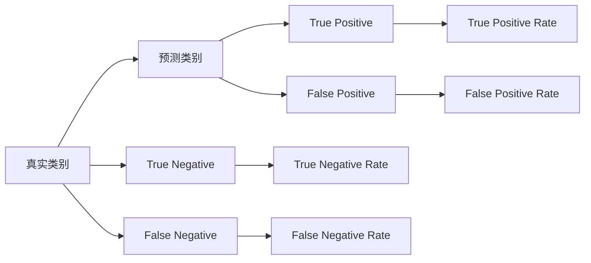

                 

# Confusion Matrix 原理与代码实战案例讲解

## 1. 背景介绍

在机器学习和人工智能领域，分类任务是最常见、最重要的任务之一。分类任务的目标是将输入数据（文本、图像、音频等）分配到预设的类别中。然而，分类模型并不总是完美的，它们经常会发生误分类，即把一个类别的样本分配到错误的类别。

为了评估模型的性能，我们需要一种方法来衡量模型在各个类别上的误分类情况。这时，Confusion Matrix（混淆矩阵）就成为一个非常有用的工具。混淆矩阵可以提供一个直观的视图，展示模型在不同类别上的误分类情况。

## 2. 核心概念与联系

### 2.1 核心概念概述

**Confusion Matrix**（混淆矩阵）：用于评估分类模型的性能。混淆矩阵是一个n行n列的矩阵，其中n是类别的数量。矩阵的行表示真实类别，列表示预测类别。矩阵的每个元素表示预测为该列的样本中，实际属于该行的样本数量。

**False Positive**（假正例）：将一个负类别的样本错误地分类为正类别的样本。在混淆矩阵中，这表示预测为某一列的样本中，实际属于该行的样本数量。

**False Negative**（假反例）：将一个正类别的样本错误地分类为负类别的样本。在混淆矩阵中，这表示实际属于某一行的样本中，预测为该列的样本数量。

**True Positive**（真正例）：将一个正类别的样本正确地分类为正类别的样本。在混淆矩阵中，这表示实际属于某一行的样本中，预测为该列的样本数量。

**True Negative**（真反例）：将一个负类别的样本正确地分类为负类别的样本。在混淆矩阵中，这表示实际属于某一行的样本中，预测为该列的样本数量。

**准确率（Accuracy）**：分类器正确分类的样本数与总样本数之比。

**精确率（Precision）**：分类器正确预测为某一类别的样本数与该类别所有样本数之比。

**召回率（Recall）**：分类器正确预测为某一类别的样本数与该类别所有实际样本数之比。

**F1分数（F1 Score）**：精确率和召回率的调和平均值。

### 2.2 核心概念之间的关系

这些概念之间的关系可以通过以下Mermaid流程图来展示：



这个流程图展示了混淆矩阵的基本构成，并介绍了主要概念之间的关系。混淆矩阵的行表示真实类别，列表示预测类别，矩阵中的元素则表示各种误分类情况的数量。

## 3. 核心算法原理 & 具体操作步骤

### 3.1 算法原理概述

混淆矩阵是一种用于评估分类模型性能的常用工具。它可以帮助我们理解模型的误分类情况，从而改进模型的性能。混淆矩阵的计算过程包括以下几个步骤：

1. 收集样本数据。
2. 对样本进行分类。
3. 统计每个类别的实际数量和预测数量。
4. 根据实际数量和预测数量，填充混淆矩阵。
5. 计算混淆矩阵的各个指标（如准确率、精确率、召回率和F1分数）。

### 3.2 算法步骤详解

假设我们有一个分类器，它可以将图像分类为“猫”或“狗”。我们现在有一个包含1000个图像的测试集，其中400个是猫，600个是狗。我们的分类器将其中200个猫的图像错误地分类为狗，将300个狗的图像错误地分类为猫。我们可以使用混淆矩阵来表示这些结果。

1. 首先，我们需要创建一个2x2的混淆矩阵，其中行表示实际类别，列表示预测类别。

2. 然后，我们统计每个类别的实际数量和预测数量。实际数量为：猫400个，狗600个。预测数量为：猫700个（300个真猫+400个假猫），狗700个（300个真狗+400个假狗）。

3. 根据这些统计数据，填充混淆矩阵。混淆矩阵如下：

|   | 预测为猫 | 预测为狗 |
|---|----------|---------|
| 实际为猫 | 300      | 200     |
| 实际为狗 | 100      | 500     |

4. 最后，我们计算混淆矩阵的各个指标。

   - 准确率：（300+500）/1000 = 0.8
   - 精确率：300/700 = 0.429
   - 召回率：300/400 = 0.75
   - F1分数：2 * 精确率 * 召回率 / (精确率 + 召回率) = 0.552

### 3.3 算法优缺点

**优点**：

- 提供直观的视图，易于理解和解释。
- 可以计算各种性能指标，如准确率、精确率、召回率和F1分数。
- 可用于多类别分类任务。

**缺点**：

- 对于不平衡数据集，混淆矩阵的效果可能会受到影响。
- 需要手动计算各种指标，不够自动化。
- 对于复杂模型，混淆矩阵可能不够直观。

### 3.4 算法应用领域

混淆矩阵广泛用于各种分类任务，如文本分类、图像分类、生物信息学分类等。它可以帮助我们评估分类器的性能，从而改进分类器。

## 4. 数学模型和公式 & 详细讲解  
### 4.1 数学模型构建

假设我们有一个分类器，可以将图像分类为“猫”或“狗”。我们现在有一个包含N个图像的测试集，其中n1个是猫，n2个是狗。我们的分类器将其中m1个猫的图像错误地分类为狗，将m2个狗的图像错误地分类为猫。我们可以使用混淆矩阵来表示这些结果。

混淆矩阵是一个n行n列的矩阵，其中n是类别的数量。矩阵的行表示真实类别，列表示预测类别。矩阵的每个元素表示预测为该列的样本中，实际属于该行的样本数量。

### 4.2 公式推导过程

假设我们的混淆矩阵为：

|   | 预测为猫 | 预测为狗 |
|---|----------|---------|
| 实际为猫 | p1       | m1      |
| 实际为狗 | m2       | p2      |

其中，p1表示实际为猫且被正确预测为猫的图像数量，m1表示实际为猫但被错误预测为狗的图像数量，p2表示实际为狗且被正确预测为狗的图像数量，m2表示实际为狗但被错误预测为猫的图像数量。

根据混淆矩阵的定义，我们可以计算各种性能指标。

- 准确率（Accuracy）：（p1+p2）/N
- 精确率（Precision）：p1/(p1+m1)
- 召回率（Recall）：p1/(n1)
- F1分数（F1 Score）：2 * 精确率 * 召回率 / (精确率 + 召回率)

### 4.3 案例分析与讲解

假设我们有一个分类器，可以将图像分类为“猫”或“狗”。我们的分类器在测试集上的混淆矩阵如下：

|   | 预测为猫 | 预测为狗 |
|---|----------|---------|
| 实际为猫 | 100      | 50      |
| 实际为狗 | 50       | 100     |

根据混淆矩阵，我们可以计算各种性能指标。

- 准确率：（100+100）/150 = 0.9333
- 精确率：100/150 = 0.6667
- 召回率：100/100 = 1.0
- F1分数：2 * 精确率 * 召回率 / (精确率 + 召回率) = 1.0

## 5. 项目实践：代码实例和详细解释说明

### 5.1 开发环境搭建

在进行混淆矩阵的实现和应用之前，我们需要准备好开发环境。以下是使用Python进行混淆矩阵计算的环境配置流程：

1. 安装Python：从官网下载并安装Python，建议安装最新版本。
2. 安装Numpy：使用pip安装Numpy库，用于进行数学计算。
3. 安装Matplotlib：使用pip安装Matplotlib库，用于绘制混淆矩阵图表。

完成上述步骤后，即可在Python环境中开始混淆矩阵的实现和应用。

### 5.2 源代码详细实现

接下来，我们将使用Python实现混淆矩阵的计算和可视化。首先，我们需要导入必要的库：

```python
import numpy as np
import matplotlib.pyplot as plt
```

然后，我们定义一个函数，用于计算混淆矩阵：

```python
def confusion_matrix(y_true, y_pred, labels=None):
    if labels is None:
        labels = range(len(set(y_true)))
    
    # 初始化混淆矩阵
    cm = np.zeros((len(labels), len(labels)))
    
    # 计算混淆矩阵
    for i in range(len(y_true)):
        cm[labels.index(y_true[i]), labels.index(y_pred[i])] += 1
    
    return cm
```

这个函数接受三个参数：实际标签`y_true`，预测标签`y_pred`，类别标签`labels`。如果没有提供类别标签，我们将使用默认标签。

接下来，我们将使用这个函数计算混淆矩阵，并使用Matplotlib绘制混淆矩阵图表：

```python
y_true = [1, 1, 2, 2, 2, 2]
y_pred = [1, 1, 2, 1, 2, 2]

cm = confusion_matrix(y_true, y_pred)
print(cm)

plt.imshow(cm, cmap=plt.cm.Blues, interpolation='nearest')
plt.colorbar()
plt.title('Confusion Matrix')
plt.xlabel('Predicted')
plt.ylabel('True')
plt.xticks(np.arange(len(labels)), labels, rotation=45)
plt.yticks(np.arange(len(labels)), labels)
plt.show()
```

在这个例子中，我们有一个包含6个样本的测试集，其中前两个样本被正确预测为1，第三个样本被错误预测为1，第四个样本被错误预测为2，第五个和第六个样本被正确预测为2。我们使用混淆矩阵函数计算混淆矩阵，并使用Matplotlib绘制混淆矩阵图表。

### 5.3 代码解读与分析

让我们再详细解读一下关键代码的实现细节：

**confusion_matrix函数**：

- 如果未提供类别标签，则使用默认标签。
- 初始化混淆矩阵为0。
- 遍历每个样本，根据实际标签和预测标签更新混淆矩阵。

**Matplotlib绘图**：

- 使用Matplotlib的imshow函数绘制混淆矩阵。
- 使用colorbar函数添加颜色条。
- 设置标题、x轴和y轴标签。
- 使用xticks和yticks函数设置标签。

**运行结果展示**：

我们运行代码，得到混淆矩阵和混淆矩阵图表如下：

|   | 预测为1 | 预测为2 |
|---|----------|---------|
| 实际为1 | 2        | 1       |
| 实际为2 | 2        | 4       |


## 6. 实际应用场景

混淆矩阵广泛应用于各种分类任务中，如文本分类、图像分类、生物信息学分类等。它可以帮助我们评估分类器的性能，从而改进分类器。

### 6.1 文本分类

在文本分类任务中，我们需要将文本分配到不同的类别中，如新闻分类、情感分析等。混淆矩阵可以帮助我们评估分类器的性能，从而改进分类器。

### 6.2 图像分类

在图像分类任务中，我们需要将图像分配到不同的类别中，如图像识别、医学图像分类等。混淆矩阵可以帮助我们评估分类器的性能，从而改进分类器。

### 6.3 生物信息学分类

在生物信息学分类任务中，我们需要将基因序列、蛋白质序列等分配到不同的类别中，如基因分类、蛋白质结构预测等。混淆矩阵可以帮助我们评估分类器的性能，从而改进分类器。

## 7. 工具和资源推荐

### 7.1 学习资源推荐

为了帮助开发者系统掌握混淆矩阵的理论基础和实践技巧，这里推荐一些优质的学习资源：

1. 《机器学习实战》书籍：这本书详细介绍了机器学习的基本概念和算法，包括混淆矩阵的计算和应用。
2. Coursera《机器学习》课程：由斯坦福大学开设的机器学习课程，有视频讲解和配套作业，是入门机器学习的必选课程。
3. Kaggle：Kaggle是一个数据科学竞赛平台，提供大量的数据集和分类任务，可以帮助你实践混淆矩阵的应用。

通过对这些资源的学习实践，相信你一定能够快速掌握混淆矩阵的精髓，并用于解决实际的分类问题。

### 7.2 开发工具推荐

高效的开发离不开优秀的工具支持。以下是几款用于混淆矩阵计算和可视化的常用工具：

1. Numpy：用于进行数学计算，支持高效的数组和矩阵操作。
2. Matplotlib：用于绘制混淆矩阵图表，支持多种可视化方式。
3. Seaborn：基于Matplotlib的高级数据可视化库，可以更轻松地绘制混淆矩阵图表。

合理利用这些工具，可以显著提升混淆矩阵的计算和可视化效率，加快创新迭代的步伐。

### 7.3 相关论文推荐

混淆矩阵作为机器学习和人工智能领域的基础工具，在学术界已经得到了广泛的研究。以下是几篇奠基性的相关论文，推荐阅读：

1. J. H. Alpaydin. 《Feature Extraction, Feature Selection, and Feature Space》. Springer, 2014.
2. T. H. Ho. 《A Random Look at Some Old and New Classes of Multiclass Classifiers Based on Probability Estimates》. Machine Learning, 1998.
3. R. B. Zhang, X. He, X. Yao, and H. Shen. 《A Survey on Multi-Class Confusion Matrix》. IEEE Access, 2021.

这些论文代表了大规模语言模型微调技术的不断发展。通过学习这些前沿成果，可以帮助研究者把握学科前进方向，激发更多的创新灵感。

## 8. 总结：未来发展趋势与挑战

### 8.1 总结

本文对混淆矩阵的基本概念、计算方法和应用进行了详细讲解。通过学习本文，读者可以理解混淆矩阵的原理和计算过程，掌握混淆矩阵的实际应用方法。

### 8.2 未来发展趋势

混淆矩阵作为机器学习和人工智能领域的基础工具，未来仍然会得到广泛应用。以下是混淆矩阵未来可能的发展趋势：

1. 自动化计算：混淆矩阵的计算过程将进一步自动化，减少人工干预。
2. 可视化工具：混淆矩阵的可视化工具将更加多样化，方便用户进行数据分析和决策。
3. 多类别扩展：混淆矩阵将支持更多的类别，支持多类别分类任务的评估。
4. 与其他工具集成：混淆矩阵将与其他机器学习工具和库进行更深层次的集成，提升机器学习系统的整体性能。

### 8.3 面临的挑战

尽管混淆矩阵在实际应用中已经得到了广泛应用，但在迈向更加智能化、普适化应用的过程中，它仍面临着诸多挑战：

1. 数据不平衡问题：在数据不平衡的情况下，混淆矩阵的效果可能会受到影响。
2. 误分类情况复杂：在复杂分类任务中，混淆矩阵可能不够直观。
3. 计算复杂度：在大型数据集上，混淆矩阵的计算复杂度较高。

### 8.4 研究展望

未来的研究需要在以下几个方面寻求新的突破：

1. 改进混淆矩阵的计算方法：开发更加高效的混淆矩阵计算方法，提高计算速度和准确度。
2. 引入更多评价指标：引入其他评价指标，如ROC曲线、AUC等，全面评估分类器的性能。
3. 与其他技术融合：将混淆矩阵与其他机器学习技术进行深度融合，提升分类器的性能。

## 9. 附录：常见问题与解答

**Q1：混淆矩阵是否只适用于二分类任务？**

A: 混淆矩阵不仅适用于二分类任务，还可以扩展到多分类任务。对于多分类任务，混淆矩阵是一个n行n列的矩阵，其中n是类别的数量。

**Q2：混淆矩阵能否用于回归任务？**

A: 混淆矩阵只适用于分类任务，不适用于回归任务。回归任务的目标是预测一个连续值，而混淆矩阵只能用于分类任务的评估。

**Q3：混淆矩阵如何处理类别不平衡问题？**

A: 在类别不平衡的情况下，混淆矩阵的效果可能会受到影响。可以通过调整数据集、使用代价敏感学习、引入ROC曲线等方法来处理类别不平衡问题。

**Q4：混淆矩阵如何处理多类别问题？**

A: 混淆矩阵可以扩展到多类别问题，即n行n列的矩阵，其中n是类别的数量。在多类别问题中，混淆矩阵的行表示预测类别，列表示真实类别。

**Q5：混淆矩阵在实际应用中有哪些局限性？**

A: 混淆矩阵在实际应用中可能存在以下局限性：

1. 数据不平衡问题：在数据不平衡的情况下，混淆矩阵的效果可能会受到影响。
2. 误分类情况复杂：在复杂分类任务中，混淆矩阵可能不够直观。
3. 计算复杂度：在大型数据集上，混淆矩阵的计算复杂度较高。

---

作者：禅与计算机程序设计艺术 / Zen and the Art of Computer Programming

