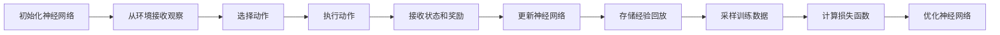
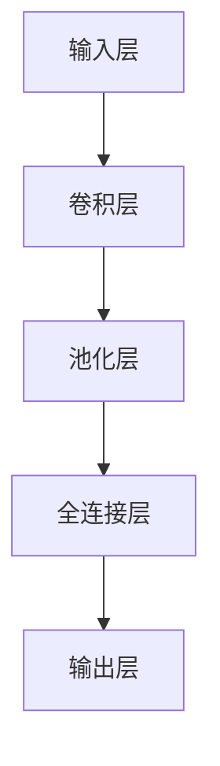

                 

# DQN(Deep Q-Network) - 原理与代码实例讲解

> 关键词：深度强化学习, Q-learning, 神经网络, 卷积神经网络, 深度Q网络, 强化学习算法, 深度学习, 深度Q网络实现, 强化学习代码, 强化学习框架, 强化学习环境构建

## 1. 背景介绍

### 1.1 问题由来

强化学习是机器学习领域的一个重要分支，旨在解决智能体如何通过与环境的交互，学习最优决策的问题。传统的强化学习方法，如Q-learning和Sarsa，具有参数稳定、容易理解等优点，但在大规模问题上表现不佳，训练时间长、收敛速度慢。

为解决这一问题，Deep Q-Network（DQN）应运而生。DQN通过引入深度神经网络，将Q值函数的计算过程与传统强化学习算法结合，大幅提升了模型的泛化能力和训练效率。这一方法在多个领域都取得了令人瞩目的成果，如机器人控制、自动驾驶、游戏AI等。

### 1.2 问题核心关键点

DQN的核心思想是：将深度神经网络与传统Q-learning算法相结合，构建一个端到端的强化学习模型，通过优化神经网络参数，最大化累积奖励，从而找到最优决策策略。

DQN的流程大致如下：
1. 从环境接收观察状态 $s$。
2. 根据观察状态 $s$，通过神经网络计算Q值。
3. 根据Q值选择最优动作 $a$。
4. 执行动作 $a$，接收下一个状态 $s'$ 和奖励 $r$。
5. 根据状态转移 $s'$ 和动作 $a$，更新神经网络参数。

### 1.3 问题研究意义

DQN方法为强化学习领域带来了一系列重要贡献：
1. 提高了大规模强化学习问题的训练效率和泛化能力。
2. 引入深度神经网络，增强了对复杂环境信息的处理能力。
3. 提供了端到端的强化学习框架，简化了模型构建和优化流程。
4. 在多个实际应用中展示了卓越的性能，推动了智能技术的普及和发展。

## 2. 核心概念与联系

### 2.1 核心概念概述

为更好地理解DQN的原理和架构，本节将介绍几个关键概念：

- Q值函数(Q-Value Function)：在强化学习中，Q值函数用于评估某个状态和动作对后续累积奖励的预期贡献。Q值函数是强化学习中的核心概念，用于指导智能体选择最优动作。
- 神经网络(Neural Network)：由大量神经元相互连接构成的非线性映射器，广泛应用于图像识别、自然语言处理等任务中。
- 深度Q网络(Deep Q-Network, DQN)：一种基于深度神经网络的强化学习算法，通过神经网络逼近Q值函数，显著提高了强化学习问题的训练效率和泛化能力。
- 卷积神经网络(Convolutional Neural Network, CNN)：一种专门处理图像数据的神经网络结构，具有卷积层、池化层、全连接层等组件，能够有效提取图像中的特征。
- 深度学习(Deep Learning)：一种基于多层神经网络的机器学习技术，通过反向传播算法优化模型参数，解决复杂数据建模问题。

这些核心概念之间的逻辑关系可以通过以下Mermaid流程图来展示：

```mermaid
graph TB
    A[状态(s)] --> B[动作(a)]
    B --> C[环境(Environment)]
    C --> D[观察(Observation)]
    D --> E[神经网络(NN)]
    E --> F[Q值(Q-value)]
    F --> G[优化(Optimization)]
    G --> H[动作选择(A)] --> I[状态(s')]
    I --> J[奖励(R)] --> K[状态(s)]
    K --> L[经验回放(Replay)] --> M[损失函数(Loss)]
    M --> N[优化(Optimization)] --> O[神经网络参数(θ)]
```

这个流程图展示了大Q网络的学习过程：

1. 从环境接收状态，选择动作。
2. 执行动作，观察结果，接收奖励。
3. 将观察结果输入神经网络，计算Q值。
4. 根据Q值选择最优动作。
5. 根据状态转移和动作，更新神经网络参数。
6. 经验回放：将训练数据存储在经验回放缓冲区中，以避免过拟合。
7. 计算损失函数，更新神经网络参数。

### 2.2 概念间的关系

这些核心概念之间存在着紧密的联系，形成了DQN算法的完整生态系统。下面我们通过几个Mermaid流程图来展示这些概念之间的关系。

#### 2.2.1 DQN算法流程



这个流程图展示了DQN算法的核心流程：

1. 初始化神经网络。
2. 从环境接收观察状态，选择动作。
3. 执行动作，接收状态和奖励。
4. 根据状态和动作，更新神经网络参数。
5. 存储经验回放缓冲区。
6. 采样训练数据，计算损失函数。
7. 优化神经网络参数。

#### 2.2.2 神经网络结构



这个流程图展示了卷积神经网络的基本结构：

1. 输入层接收原始数据。
2. 卷积层提取图像特征。
3. 池化层降低特征维度。
4. 全连接层进行特征融合。
5. 输出层输出Q值。

## 3. 核心算法原理 & 具体操作步骤

### 3.1 算法原理概述

DQN算法的核心原理是通过深度神经网络逼近Q值函数，从而实现最优动作选择。具体而言，DQN通过以下几个步骤来逼近Q值函数：

1. 初始化神经网络。
2. 从环境接收观察状态 $s$。
3. 根据观察状态 $s$，通过神经网络计算Q值 $Q(s,a)$。
4. 选择最优动作 $a$ 使得 $Q(s,a)$ 最大。
5. 执行动作 $a$，接收下一个状态 $s'$ 和奖励 $r$。
6. 根据状态转移 $s'$ 和动作 $a$，更新神经网络参数。

上述过程构成了一个闭环，不断重复直至收敛。

### 3.2 算法步骤详解

以下我们详细介绍DQN算法的详细步骤：

#### 3.2.1 神经网络初始化

首先，需要构建一个深度神经网络模型。以卷积神经网络为例，其结构如下所示：

```
Input Layer (Input layer size = 图像宽度 * 图像高度 * 图像通道数)
Convolution Layer 1 (32 filters of size 3x3, stride=1, padding=1)
Pooling Layer 1 (Max pooling of size 2x2, stride=2)
Convolution Layer 2 (64 filters of size 3x3, stride=1, padding=1)
Pooling Layer 2 (Max pooling of size 2x2, stride=2)
Flatten Layer (将特征图展开为一维向量)
Dense Layer 1 (128神经元)
Dense Layer 2 (64神经元)
Output Layer (1个神经元，输出Q值)
```

#### 3.2.2 从环境接收观察状态

在每个时间步 $t$，智能体从环境中接收一个观察状态 $s_t$。观察状态可以是像素、文本、音频等形式，具体形式取决于任务性质。

#### 3.2.3 计算Q值

根据观察状态 $s_t$，神经网络计算当前状态 $s_t$ 和动作 $a_t$ 的Q值 $Q(s_t,a_t)$。Q值函数的计算公式为：

$$
Q(s_t,a_t) = \langle \omega, \phi(s_t, a_t) \rangle
$$

其中，$\omega$ 为神经网络的权重参数，$\phi(s_t, a_t)$ 为状态 $s_t$ 和动作 $a_t$ 的表示。

#### 3.2.4 选择最优动作

根据Q值，选择使 $Q(s_t,a_t)$ 最大的动作 $a_t$，即：

$$
a_t = \mathop{\arg\max}_{a} Q(s_t,a)
$$

#### 3.2.5 执行动作和接收奖励

执行动作 $a_t$，接收下一个状态 $s_{t+1}$ 和奖励 $r_{t+1}$。奖励可以是瞬时奖励（如在一盘游戏中），也可以是累积奖励（如在机器人控制中）。

#### 3.2.6 更新神经网络参数

根据状态转移 $s_{t+1}$ 和动作 $a_t$，计算下一个状态 $s_{t+1}$ 的Q值 $Q(s_{t+1},a_{t+1})$。同时，计算经验回放缓冲区中的下一个Q值 $Q(s_{t+1},a_{t+1})$。

将当前状态 $s_t$ 的Q值 $Q(s_t,a_t)$ 更新为：

$$
Q(s_t,a_t) = r_t + \gamma \max_{a} Q(s_{t+1},a)
$$

其中，$\gamma$ 为折扣因子，通常取值为0.9。

### 3.3 算法优缺点

#### 3.3.1 算法优点

1. 端到端训练：通过神经网络逼近Q值函数，DQN实现了端到端的训练过程，简化了模型构建和优化流程。
2. 高泛化能力：深度神经网络能够处理复杂的数据特征，DQN在处理高维、非线性环境时表现出色。
3. 高效训练：神经网络的参数共享机制减少了模型复杂度，训练效率和速度显著提升。

#### 3.3.2 算法缺点

1. 训练样本数量需求大：神经网络的参数更新需要大量样本来确保收敛。
2. 数据存储和传输开销大：经验回放缓冲区的存储和传输需要占用大量内存和带宽。
3. 容易过拟合：由于深度神经网络具有较强的拟合能力，容易过拟合，需要引入正则化技术。

### 3.4 算法应用领域

DQN算法在多个领域得到了广泛应用，例如：

- 游戏AI：如AlphaGo、DQN等，通过深度学习技术实现高水平的AI游戏表现。
- 机器人控制：通过DQN优化机器人的决策策略，提高自主导航和操作能力。
- 自动驾驶：通过DQN优化车辆的控制策略，实现智能驾驶功能。
- 强化学习竞赛：如OpenAI Five等，通过DQN解决复杂的团队合作问题。
- 金融交易：通过DQN优化交易策略，提高投资回报率。

## 4. 数学模型和公式 & 详细讲解  
### 4.1 数学模型构建

DQN算法的数学模型主要由以下几个组成部分构成：

- 神经网络模型：用于逼近Q值函数，计算当前状态和动作的Q值。
- 经验回放缓冲区：用于存储训练数据，减少过拟合。
- 损失函数：用于衡量模型的预测输出与实际输出之间的差距。
- 优化算法：用于最小化损失函数，更新神经网络参数。

#### 4.1.1 神经网络模型

以卷积神经网络为例，其结构如下所示：

```
Input Layer (Input layer size = 图像宽度 * 图像高度 * 图像通道数)
Convolution Layer 1 (32 filters of size 3x3, stride=1, padding=1)
Pooling Layer 1 (Max pooling of size 2x2, stride=2)
Convolution Layer 2 (64 filters of size 3x3, stride=1, padding=1)
Pooling Layer 2 (Max pooling of size 2x2, stride=2)
Flatten Layer (将特征图展开为一维向量)
Dense Layer 1 (128神经元)
Dense Layer 2 (64神经元)
Output Layer (1个神经元，输出Q值)
```

#### 4.1.2 经验回放缓冲区

经验回放缓冲区用于存储训练数据，通过采样训练数据进行梯度更新，减少过拟合。缓冲区的大小和样本数量需要根据实际情况进行调整。

#### 4.1.3 损失函数

DQN算法使用均方误差（MSE）作为损失函数：

$$
L = \frac{1}{n} \sum_{i=1}^{n} (Q(s_{t_i}, a_{t_i}) - r_{t_i} - \gamma \max_{a} Q(s_{t+1},a))^2
$$

其中，$n$ 为样本数量。

#### 4.1.4 优化算法

DQN算法通常使用Adam优化器进行参数更新。其更新公式为：

$$
\theta = \theta - \alpha (\frac{\partial L}{\partial \theta})
$$

其中，$\theta$ 为神经网络参数，$\alpha$ 为学习率。

### 4.2 公式推导过程

以下我们详细推导DQN算法的公式：

设当前状态为 $s_t$，动作为 $a_t$，奖励为 $r_t$，下一个状态为 $s_{t+1}$，下一个动作为 $a_{t+1}$。

根据Q值函数 $Q(s_t,a_t)$ 和经验回放缓冲区的Q值 $Q(s_{t+1},a_{t+1})$，可以得到以下公式：

$$
Q(s_t,a_t) = r_t + \gamma \max_{a} Q(s_{t+1},a)
$$

其中，$\gamma$ 为折扣因子，通常取值为0.9。

神经网络模型计算Q值的过程可以表示为：

$$
Q(s_t,a_t) = \langle \omega, \phi(s_t, a_t) \rangle
$$

其中，$\omega$ 为神经网络的权重参数，$\phi(s_t, a_t)$ 为状态 $s_t$ 和动作 $a_t$ 的表示。

### 4.3 案例分析与讲解

以AlphaGo为例，介绍DQN在棋类游戏中的应用：

AlphaGo使用深度学习技术和强化学习算法，通过训练神经网络来优化决策策略。其主要流程如下：

1. 初始化神经网络模型。
2. 从环境接收观察状态 $s$。
3. 根据观察状态 $s$，计算当前状态 $s$ 和动作 $a$ 的Q值 $Q(s,a)$。
4. 选择使 $Q(s,a)$ 最大的动作 $a$。
5. 执行动作 $a$，接收下一个状态 $s'$ 和奖励 $r$。
6. 根据状态转移 $s'$ 和动作 $a$，更新神经网络参数。

通过深度学习技术，AlphaGo能够处理复杂的棋盘状态，进行高效决策。

## 5. 项目实践：代码实例和详细解释说明

### 5.1 开发环境搭建

要进行DQN算法的实现，首先需要搭建开发环境。以下是Python开发环境的搭建流程：

1. 安装Anaconda：从官网下载并安装Anaconda，用于创建独立的Python环境。

2. 创建并激活虚拟环境：
```bash
conda create -n pytorch-env python=3.8 
conda activate pytorch-env
```

3. 安装PyTorch：根据CUDA版本，从官网获取对应的安装命令。例如：
```bash
conda install pytorch torchvision torchaudio cudatoolkit=11.1 -c pytorch -c conda-forge
```

4. 安装Tensorboard：用于可视化训练过程，监控训练指标。

5. 安装TensorFlow：用于搭建训练框架。

### 5.2 源代码详细实现

以下是一个简单的DQN算法实现，以CartPole环境为例，介绍其核心代码：

```python
import gym
import numpy as np
import torch
import torch.nn as nn
import torch.optim as optim
import torch.nn.functional as F
import matplotlib.pyplot as plt

class Net(nn.Module):
    def __init__(self):
        super(Net, self).__init__()
        self.conv1 = nn.Conv2d(1, 32, 8)
        self.pool = nn.MaxPool2d(4, 4)
        self.conv2 = nn.Conv2d(32, 64, 4)
        self.fc1 = nn.Linear(7*7*64, 512)
        self.fc2 = nn.Linear(512, 2)

    def forward(self, x):
        x = F.relu(self.conv1(x))
        x = self.pool(x)
        x = F.relu(self.conv2(x))
        x = self.pool(x)
        x = x.view(-1, 7*7*64)
        x = F.relu(self.fc1(x))
        x = self.fc2(x)
        return x

env = gym.make('CartPole-v0')

# 初始化神经网络
model = Net().to(device)

# 定义损失函数和优化器
criterion = nn.MSELoss()
optimizer = optim.Adam(model.parameters(), lr=0.001)

# 定义状态和动作空间
state_dim = env.observation_space.shape[0]
action_dim = env.action_space.n

# 定义折扣因子
gamma = 0.9

# 定义经验回放缓冲区
replay_buffer = []

# 定义训练参数
batch_size = 32
steps_per_episode = 500

# 训练循环
for episode in range(5000):
    state = env.reset()
    state = np.reshape(state, [1, state_dim, state_dim, 1])
    state = torch.from_numpy(state).float().to(device)

    for step in range(steps_per_episode):
        # 根据状态选择动作
        with torch.no_grad():
            Q = model(state)
            action = np.argmax(Q.data.numpy()[0], axis=0)

        # 执行动作，接收奖励和下一个状态
        next_state, reward, done, _ = env.step(action)
        next_state = np.reshape(next_state, [1, state_dim, state_dim, 1])
        next_state = torch.from_numpy(next_state).float().to(device)
        reward = torch.from_numpy(np.array([reward])).float().to(device)

        # 存储经验回放缓冲区
        replay_buffer.append((state, action, reward, next_state, done))

        # 更新状态
        state = next_state
        if done:
            break

    # 更新神经网络参数
    if len(replay_buffer) >= batch_size:
        replay_buffer = np.random.choice(replay_buffer, size=batch_size)
        replay_buffer = replay_buffer[:, 0, :]

        states = replay_buffer[:, 0]
        actions = replay_buffer[:, 1]
        rewards = replay_buffer[:, 2]
        next_states = replay_buffer[:, 3]
        dones = replay_buffer[:, 4]

        # 计算Q值
        Q = model(states)
        Q = Q.gather(1, actions.unsqueeze(1)).squeeze()

        # 计算目标Q值
        with torch.no_grad():
            next_Q = model(next_states)
            max_next_Q = next_Q.max(1)[0]
            target_Q = rewards + gamma * max_next_Q * (1 - dones)

        # 计算损失函数
        loss = criterion(Q, target_Q)

        # 反向传播更新参数
        optimizer.zero_grad()
        loss.backward()
        optimizer.step()

    if episode % 100 == 0:
        plt.plot(reward.data.numpy())
        plt.show()

env.close()
```

### 5.3 代码解读与分析

让我们再详细解读一下关键代码的实现细节：

**Net类**：
- `__init__`方法：初始化神经网络，包含卷积层、全连接层等组件。
- `forward`方法：前向传播计算Q值，通过神经网络计算当前状态和动作的Q值。

**状态和动作空间**：
- 使用 Gym 库构建环境，获取状态和动作空间的维度。

**经验回放缓冲区**：
- 定义缓冲区，存储训练数据，确保样本数量满足批量大小的要求。

**训练循环**：
- 循环训练多次，每次从环境接收状态，选择动作，执行动作，接收奖励和下一个状态，更新神经网络参数。
- 经验回放缓冲区存储训练数据，定期采样批量大小的数据，计算目标Q值，更新损失函数，反向传播更新模型参数。
- 通过可视化训练过程，监控奖励变化情况。

**运行结果展示**：
- 在训练过程中，每100个episode记录一次奖励，绘制奖励曲线，观察训练效果。

## 6. 实际应用场景

### 6.1 智能游戏AI

DQN算法在游戏AI中取得了巨大成功。AlphaGo通过DQN优化棋局决策，在围棋和星际争霸等游戏中都取得了超越人类的表现。未来，DQN算法可以应用于更多复杂的游戏，如俄罗斯方块、星际争霸等，为游戏开发带来新的灵感和可能性。

### 6.2 机器人控制

机器人控制是DQN算法的另一个重要应用领域。DQN算法可以优化机器人的决策策略，实现自主导航、避障、抓取等复杂任务。未来，DQN算法将在工业机器人、家庭机器人等领域得到广泛应用，提升生产力和生活质量。

### 6.3 自动驾驶

DQN算法在自动驾驶领域也展示了强大的潜力。通过DQN优化车辆的控制策略，实现智能驾驶功能，提高交通安全性。未来，DQN算法可以应用于更复杂的驾驶场景，如城市道路、高速公路等，为自动驾驶技术的普及带来新的突破。

### 6.4 金融交易

DQN算法在金融交易中也得到了广泛应用。通过DQN优化交易策略，提高投资回报率，降低风险。未来，DQN算法可以应用于更复杂的交易场景，如股票、期货、外汇等，为金融市场带来新的变革。

### 6.5 虚拟助手

DQN算法在虚拟助手领域也有巨大的应用前景。通过DQN优化虚拟助手的决策策略，提高互动性和用户体验。未来，DQN算法可以应用于更多场景，如智能客服、语音助手等，提升用户满意度。

## 7. 工具和资源推荐

### 7.1 学习资源推荐

为了帮助开发者系统掌握DQN算法的理论基础和实践技巧，这里推荐一些优质的学习资源：

1. 《强化学习》书籍：斯坦福大学李航教授所著，全面介绍了强化学习的理论基础和算法实现。

2. 《深度学习》书籍：Deep Learning Book，由Goodfellow等人合著，涵盖了深度学习的前沿研究和技术实践。

3. 《深度强化学习》在线课程：由DeepMind和Stanford University等机构联合开设，提供了DQN等强化学习算法的深入讲解。

4. OpenAI博客：OpenAI官方网站上的博客，介绍了AlphaGo等DQN算法的实现细节和应用场景。

5. TensorFlow官方文档：TensorFlow的官方文档，提供了丰富的DQN算法示例代码和教程。

6. PyTorch官方文档：PyTorch的官方文档，提供了深度学习算法的实现和优化技巧。

### 7.2 开发工具推荐

DQN算法通常使用Python实现。以下是几个常用的开发工具：

1. Anaconda：用于创建独立的Python环境，方便开发和部署。

2. PyTorch：深度学习框架，支持DQN算法的实现和优化。

3. TensorFlow：深度学习框架，支持DQN算法的实现和优化。

4. TensorBoard：可视化工具，用于监控训练过程和模型性能。

5. Gym：环境库，提供了各种强化学习任务，方便开发和测试。

### 7.3 相关论文推荐

DQN算法的发展离不开学界的持续研究。以下是几篇奠基性的相关论文，推荐阅读：

1. Deep Q-Learning: A Computational View of Reinforcement Learning: 提出了DQN算法的基本框架和原理，奠定了DQN算法的基础。

2. Playing Atari with Deep Reinforcement Learning: 介绍AlphaGo等DQN算法在游戏AI中的应用，展示了DQN算法的强大潜力。

3. Human-level control through deep reinforcement learning: 展示了DQN算法在机器人控制中的应用，实现了高精度的自主导航和操作。

4. Curiosity, Continuity, and Control with Deep Recurrent Q-Networks: 介绍DQN算法在智能游戏和机器人控制中的应用，推动了DQN算法的进一步发展。

这些论文代表了大Q网络微调技术的发展脉络。通过学习这些前沿成果，可以帮助研究者把握学科前进方向，激发更多的创新灵感。

## 8. 总结：未来发展趋势与挑战

### 8.1 总结

本文对DQN算法的原理和实践进行了全面系统的介绍。首先阐述了DQN算法的背景和核心思想，明确了DQN在强化学习领域的独特价值。其次，从原理到实践，详细讲解了DQN算法的数学模型和核心步骤，给出了DQN算法的代码实现。同时，本文还广泛探讨了DQN算法在智能游戏、机器人控制、自动

