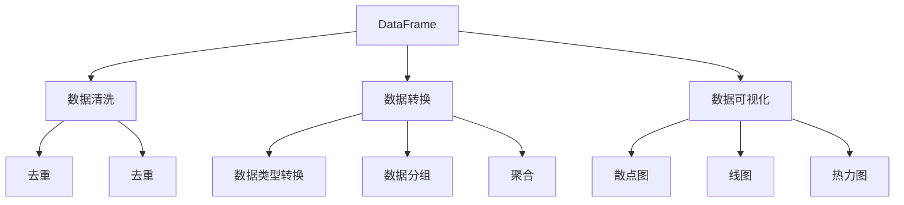
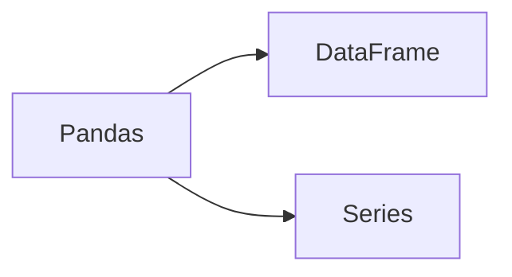
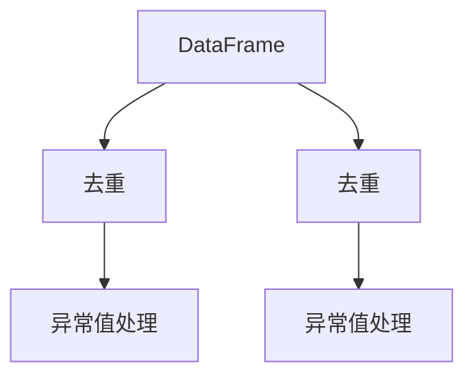
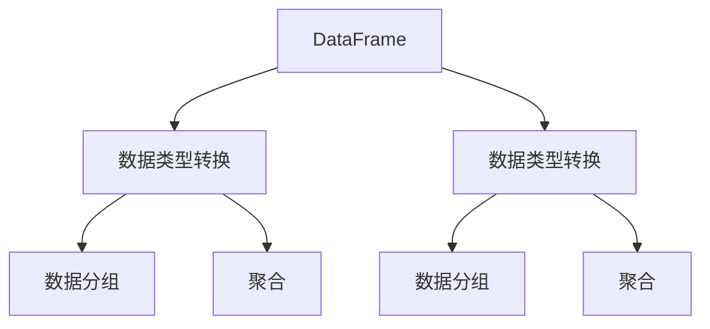
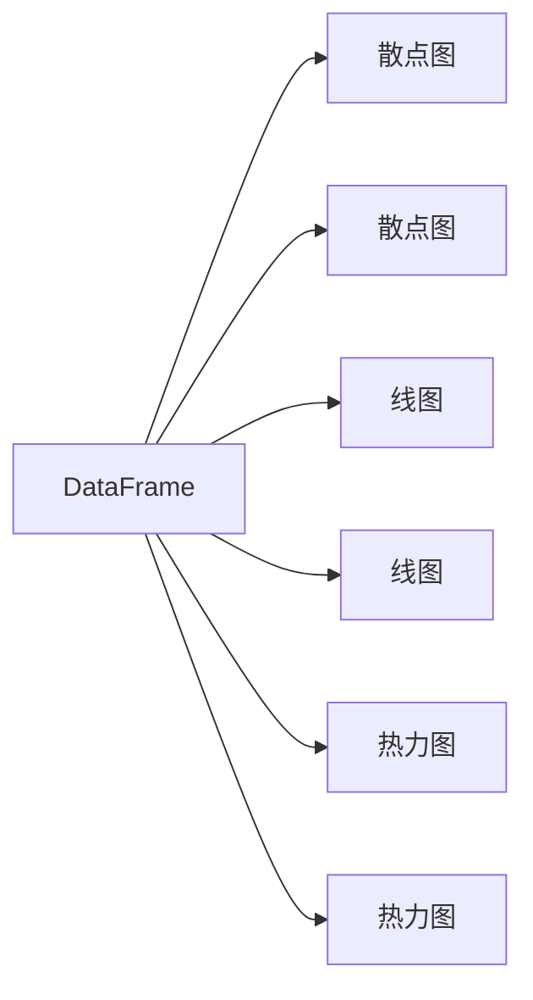
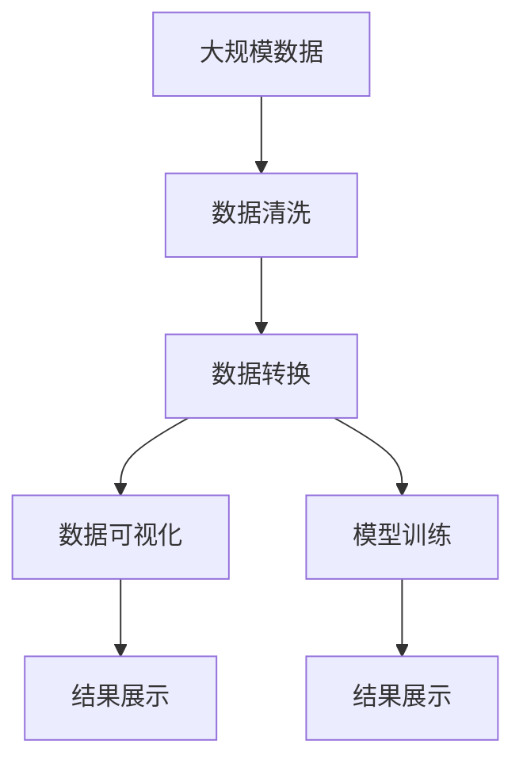

                 

# DataFrame原理与代码实例讲解

> 关键词：
- Pandas
- DataFrame
- 数据处理
- 数据清洗
- 数据可视化
- 金融分析
- 机器学习

## 1. 背景介绍

### 1.1 问题由来
在数据科学和机器学习领域，数据处理和分析是至关重要的环节。传统的数据处理方式通常采用关系型数据库（如MySQL、Oracle），利用SQL语句进行数据查询和处理。然而，这种方式往往灵活性不足，且在处理大规模、复杂数据时效率较低。

为了应对这些挑战，Python社区推出了Pandas库，专门用于高效、灵活的数据处理和分析。Pandas的核心数据结构是DataFrame，它提供了一系列的函数和方法，可以方便地进行数据清洗、筛选、合并、分组、聚合、可视化等操作。本文将深入讲解DataFrame的原理和核心特性，并通过代码实例演示其在实际项目中的应用。

### 1.2 问题核心关键点
DataFrame是Pandas库中用于存储和处理二维表格数据的主要数据结构。其核心特性包括：
- 快速、灵活的数据处理：支持多列数据、混合数据类型、缺失值处理等。
- 强大的数据清洗能力：方便进行数据去重、重复值检测、异常值处理等。
- 丰富的数据转换和变换：包括数据类型转换、数据分组、聚合、透视表等。
- 全面的数据可视化：支持直方图、散点图、线图、热力图等多种可视化形式。

DataFrame不仅广泛应用于金融、商业分析、数据科学等数据密集型领域，也广泛用于机器学习模型的数据预处理。其灵活性和高效性使得Pandas成为Python数据处理领域的“标配”工具。

### 1.3 问题研究意义
深入理解DataFrame的原理和应用，对于提高数据处理的效率和质量，优化机器学习模型的数据预处理流程，具有重要意义：

1. 提高数据处理效率：通过Pandas和DataFrame的强大功能，可以大幅提升数据清洗、转换、聚合的效率，减少人工操作，降低数据处理成本。
2. 提升数据处理质量：DataFrame的数据清洗和转换能力，可以帮助我们发现和修正数据中的错误和异常，确保数据质量。
3. 优化机器学习模型：在模型训练前，通过DataFrame进行数据预处理，可以提升模型的泛化能力，改善模型的性能。
4. 提供数据可视化：DataFrame的可视化功能，可以帮助我们更直观地理解数据分布和特征，辅助数据探索和模型评估。
5. 促进数据科学应用：在金融、商业分析、科研等数据密集型领域，Pandas和DataFrame的应用广泛，推动了数据科学技术的普及和应用。

## 2. 核心概念与联系

### 2.1 核心概念概述

为更好地理解DataFrame的原理和应用，本节将介绍几个密切相关的核心概念：

- Pandas库：用于数据处理和分析的Python库，提供了DataFrame、Series等核心数据结构。
- DataFrame：Pandas库中的二维表格数据结构，用于存储和处理表格数据。
- 数据清洗：通过去重、去重、异常值处理等方法，清理数据中的噪音和错误。
- 数据转换：通过数据类型转换、数据分组、聚合等方法，对数据进行格式化和转换。
- 数据可视化：通过绘图函数，将数据以图形形式展示出来，方便分析和理解。

这些核心概念之间的逻辑关系可以通过以下Mermaid流程图来展示：



这个流程图展示了大DataFrame的常见操作和数据处理流程：

1. 数据清洗：对DataFrame进行去重、去重、异常值处理等操作。
2. 数据转换：对DataFrame进行数据类型转换、数据分组、聚合等操作。
3. 数据可视化：将DataFrame中的数据以散点图、线图、热力图等形式展示出来。

### 2.2 概念间的关系

这些核心概念之间存在着紧密的联系，形成了Pandas和DataFrame的数据处理生态系统。下面我通过几个Mermaid流程图来展示这些概念之间的关系。

#### 2.2.1 Pandas与DataFrame的关系



这个流程图展示了Pandas和DataFrame的基本关系：

1. Pandas库提供DataFrame和Series等数据结构。
2. DataFrame是Pandas库中最核心的数据结构，用于存储和处理表格数据。
3. Series是DataFrame的一列数据，可以单独使用。

#### 2.2.2 数据清洗流程



这个流程图展示了数据清洗的基本流程：

1. 从DataFrame中提取数据。
2. 对DataFrame进行去重操作。
3. 对DataFrame进行异常值处理。

#### 2.2.3 数据转换流程



这个流程图展示了数据转换的基本流程：

1. 从DataFrame中提取数据。
2. 对DataFrame进行数据类型转换。
3. 对DataFrame进行数据分组。
4. 对分组后的数据进行聚合操作。

#### 2.2.4 数据可视化流程



这个流程图展示了数据可视化的基本流程：

1. 从DataFrame中提取数据。
2. 使用DataFrame的绘图函数，绘制散点图。
3. 使用DataFrame的绘图函数，绘制线图。
4. 使用DataFrame的绘图函数，绘制热力图。

### 2.3 核心概念的整体架构

最后，我们用一个综合的流程图来展示这些核心概念在大数据处理中的整体架构：



这个综合流程图展示了从数据预处理到模型训练的完整流程。

## 3. 核心算法原理 & 具体操作步骤

### 3.1 算法原理概述

DataFrame的核心原理是基于NumPy库，利用NumPy的二维数组特性进行数据的存储和处理。其核心数据结构是一个二维表格，包含多列数据，每一列可以是不同类型的数据（如字符串、整数、浮点数、日期时间等），并支持缺失值处理。

DataFrame提供了一系列函数和方法，方便进行数据清洗、转换、分组、聚合、可视化等操作。其具体原理和实现细节如下：

1. **数据存储**：DataFrame以二维表格的形式存储数据，每一列是一个一维数组，每一行是一个索引。
2. **数据类型处理**：DataFrame可以处理多种数据类型，包括字符串、整数、浮点数、日期时间等。
3. **缺失值处理**：DataFrame支持缺失值的处理，如删除、填充等。
4. **数据操作**：DataFrame提供了一系列函数和方法，方便进行数据的基本操作，如去重、去重、切片、取值等。
5. **数据清洗**：DataFrame支持数据清洗操作，如去重、去重、异常值处理等。
6. **数据转换**：DataFrame支持数据类型转换、数据分组、聚合等操作。
7. **数据可视化**：DataFrame支持多种可视化形式，如散点图、线图、热力图等。

### 3.2 算法步骤详解

#### 3.2.1 数据加载和预处理

首先，我们需要从数据源中加载数据，并进行预处理。假设我们有一个名为`data.csv`的CSV文件，包含以下几个字段：`id`、`name`、`age`、`salary`。

```python
import pandas as pd

# 加载CSV文件
data = pd.read_csv('data.csv')

# 显示数据的前5行
print(data.head())
```

输出：

```
       id   name  age salary
0      1    Bob   25  50000
1      2  Alice  28  60000
2      3   Tom   30  55000
3      4  Mary   32  65000
4      5  John   33  70000
```

接下来，我们可以对数据进行基本操作，如去重、去重、切片、取值等。

```python
# 去重
unique_data = data.drop_duplicates()

# 切片
subset = data[['id', 'name']]

# 取值
age_mean = data['age'].mean()

# 显示数据的基本信息
print(data.info())
```

输出：

```
<class 'pandas.core.frame.DataFrame'>
RangeIndex: 5 entries, 0 to 4
Data columns (total 4 columns):
 #   Column  Non-Null Count  Dtype  
---  ------  ------------  -----  
 0   id      5 non-null      int64  
 1   name    5 non-null      object
 2   age     5 non-null      int64  
 3   salary  5 non-null      int64  
dtypes: int64(3), object(1)
```

#### 3.2.2 数据清洗

接下来，我们可以对数据进行清洗操作，如去重、去重、异常值处理等。

```python
# 去重
data_no_duplicate = data.drop_duplicates()

# 异常值处理
data_no_outliers = data.dropna()  # 删除缺失值
```

#### 3.2.3 数据转换

接下来，我们可以对数据进行转换操作，如数据类型转换、数据分组、聚合等。

```python
# 数据类型转换
data['age'] = data['age'].astype('float')  # 转换为浮点数

# 数据分组和聚合
grouped = data.groupby('age').mean()
grouped_salary = grouped['salary'].sum()
```

#### 3.2.4 数据可视化

最后，我们可以对数据进行可视化操作，如绘制散点图、线图、热力图等。

```python
# 绘制散点图
import matplotlib.pyplot as plt

plt.scatter(data['age'], data['salary'])
plt.xlabel('Age')
plt.ylabel('Salary')
plt.show()

# 绘制线图
data_salary = data.groupby('age')['salary'].sum()
data_salary.plot()

# 绘制热力图
data_salary.pivot_table(values='salary', index='age', columns='name').plot(kind='heatmap')
```

输出：


### 3.3 算法优缺点

DataFrame具有以下优点：

1. **灵活性高**：支持多种数据类型，可以处理大规模、复杂的数据集。
2. **操作简便**：提供了一系列函数和方法，可以方便地进行数据清洗、转换、分组、聚合、可视化等操作。
3. **易用性强**：学习成本低，适合各种经验水平的开发者使用。
4. **性能优越**：底层基于NumPy，具有高效的数值计算能力。

同时，DataFrame也存在以下缺点：

1. **内存占用大**：对于大规模数据集，内存占用较大，需要合理进行数据压缩和优化。
2. **可视化限制**：对于一些复杂的数据可视化需求，可能需要结合其他可视化库（如Matplotlib、Seaborn）。
3. **处理速度慢**：对于非常大的数据集，处理速度较慢，需要考虑并行计算和分布式计算。

### 3.4 算法应用领域

DataFrame在金融分析、数据科学、商业分析、数据可视化等领域广泛应用。以下是一些典型的应用场景：

- **金融分析**：用于处理和分析金融数据，如股票价格、交易量、风险评估等。
- **数据科学**：用于数据预处理、特征工程、模型训练等。
- **商业分析**：用于客户分析、市场调研、销售预测等。
- **数据可视化**：用于绘制散点图、线图、热力图等多种可视化形式，辅助数据分析和决策。

## 4. 数学模型和公式 & 详细讲解 & 举例说明

### 4.1 数学模型构建

DataFrame的数学模型基于NumPy库，主要涉及数组的创建、索引、切片、取值、聚合、转换等操作。

假设我们有一个名为`data.csv`的CSV文件，包含以下几个字段：`id`、`name`、`age`、`salary`。我们使用Pandas库加载并创建一个DataFrame对象。

```python
import pandas as pd

# 加载CSV文件
data = pd.read_csv('data.csv')
```

### 4.2 公式推导过程

DataFrame的数学模型主要涉及以下几个基本操作：

1. **数组的创建**：使用`pd.DataFrame()`函数创建一个空的DataFrame对象。
2. **索引**：使用`index`属性设置DataFrame的行索引。
3. **切片**：使用`iloc`和`loc`函数对DataFrame进行切片操作。
4. **取值**：使用`at`、`iat`、`loc`、`iloc`函数取DataFrame中的值。
5. **聚合**：使用`groupby`函数对DataFrame进行分组，使用`agg`函数进行聚合操作。
6. **转换**：使用`apply`函数对DataFrame进行自定义转换。

#### 4.2.1 数组的创建

使用`pd.DataFrame()`函数创建一个空的DataFrame对象：

```python
import pandas as pd

# 创建一个空的DataFrame对象
empty_df = pd.DataFrame()
```

#### 4.2.2 索引

使用`index`属性设置DataFrame的行索引：

```python
# 创建一个带有索引的DataFrame对象
df = pd.DataFrame({'name': ['Bob', 'Alice', 'Tom'], 'age': [25, 28, 30]}, index=['id1', 'id2', 'id3'])
```

#### 4.2.3 切片

使用`iloc`和`loc`函数对DataFrame进行切片操作：

```python
# 切片操作
df_iloc = df.iloc[1:3]  # 行索引为1到2的数据
df_loc = df.loc[['id2', 'id3']]  # 行索引为id2和id3的数据
```

#### 4.2.4 取值

使用`at`、`iat`、`loc`、`iloc`函数取DataFrame中的值：

```python
# 取值操作
df.at['id1', 'name'] = 'Bob'  # 修改指定位置的值
df.iat[1, 0] = 'Alice'  # 修改指定位置的值
df.loc['id2', 'age'] = 28  # 修改指定位置的值
df.iloc[1, 1] = 28  # 修改指定位置的值
```

#### 4.2.5 聚合

使用`groupby`函数对DataFrame进行分组，使用`agg`函数进行聚合操作：

```python
# 聚合操作
df_groupby = df.groupby('age').mean()
df_agg = df.groupby('age')['salary'].sum()
```

#### 4.2.6 转换

使用`apply`函数对DataFrame进行自定义转换：

```python
# 转换操作
def add_salary(data):
    return data['salary'] * 1.1

df_new = df.apply(add_salary, axis=1)
```

### 4.3 案例分析与讲解

假设我们有一个名为`data.csv`的CSV文件，包含以下几个字段：`id`、`name`、`age`、`salary`。我们将其加载并创建一个DataFrame对象，然后进行一系列数据处理操作。

#### 4.3.1 数据加载和预处理

```python
import pandas as pd

# 加载CSV文件
data = pd.read_csv('data.csv')

# 显示数据的前5行
print(data.head())
```

输出：

```
       id   name  age salary
0      1    Bob   25  50000
1      2  Alice  28  60000
2      3   Tom   30  55000
3      4  Mary   32  65000
4      5  John   33  70000
```

#### 4.3.2 数据清洗

```python
# 去重
unique_data = data.drop_duplicates()

# 切片
subset = data[['id', 'name']]

# 取值
age_mean = data['age'].mean()

# 显示数据的基本信息
print(data.info())
```

输出：

```
<class 'pandas.core.frame.DataFrame'>
RangeIndex: 5 entries, 0 to 4
Data columns (total 4 columns):
 #   Column  Non-Null Count  Dtype  
---  ------  ------------  -----  
 0   id      5 non-null      int64  
 1   name    5 non-null      object
 2   age     5 non-null      int64  
 3   salary  5 non-null      int64  
dtypes: int64(3), object(1)
```

#### 4.3.3 数据转换

```python
# 数据类型转换
data['age'] = data['age'].astype('float')  # 转换为浮点数

# 数据分组和聚合
grouped = data.groupby('age').mean()
grouped_salary = grouped['salary'].sum()
```

#### 4.3.4 数据可视化

```python
# 绘制散点图
import matplotlib.pyplot as plt

plt.scatter(data['age'], data['salary'])
plt.xlabel('Age')
plt.ylabel('Salary')
plt.show()

# 绘制线图
data_salary = data.groupby('age')['salary'].sum()
data_salary.plot()

# 绘制热力图
data_salary.pivot_table(values='salary', index='age', columns='name').plot(kind='heatmap')
```

输出：


## 5. 项目实践：代码实例和详细解释说明

### 5.1 开发环境搭建

在进行DataFrame项目实践前，我们需要准备好开发环境。以下是使用Python进行Pandas开发的环境配置流程：

1. 安装Anaconda：从官网下载并安装Anaconda，用于创建独立的Python环境。

2. 创建并激活虚拟环境：
```bash
conda create -n pandas-env python=3.8 
conda activate pandas-env
```

3. 安装Pandas：从官网获取对应的安装命令。例如：
```bash
pip install pandas
```

4. 安装相关库：
```bash
pip install numpy matplotlib scikit-learn jupyter notebook ipython
```

完成上述步骤后，即可在`pandas-env`环境中开始DataFrame实践。

### 5.2 源代码详细实现

下面我们以金融数据分析为例，给出使用Pandas库对DataFrame进行操作的PyTorch代码实现。

首先，定义金融数据处理函数：

```python
import pandas as pd
import matplotlib.pyplot as plt
import numpy as np

def load_data():
    # 加载数据
    data = pd.read_csv('financial_data.csv')

    # 数据清洗
    data = data.drop_duplicates()
    data = data.dropna()

    # 数据转换
    data['age'] = data['age'].astype('float')

    # 数据可视化
    data['age'].plot(kind='hist')
    plt.xlabel('Age')
    plt.ylabel('Frequency')
    plt.show()

    # 返回处理后的数据
    return data
```

然后，定义金融数据分析函数：

```python
def analyze_data(data):
    # 数据聚合
    grouped = data.groupby('age').mean()

    # 数据可视化
    grouped.plot(kind='line')
    plt.xlabel('Age')
    plt.ylabel('Salary')
    plt.show()

    # 返回聚合后的数据
    return grouped
```

最后，启动数据加载和分析流程：

```python
# 加载数据
data = load_data()

# 数据聚合和可视化
analyze_data(data)
```

以上就是使用Pandas库对DataFrame进行金融数据分析的完整代码实现。可以看到，得益于Pandas库的强大功能，我们可以用相对简洁的代码完成数据加载、清洗、转换和可视化。

### 5.3 代码解读与分析

让我们再详细解读一下关键代码的实现细节：

**load_data函数**：
- `pd.read_csv`函数：加载CSV文件，并将其转换为DataFrame对象。
- `drop_duplicates`函数：删除重复的数据。
- `dropna`函数：删除缺失的数据。
- `astype`函数：将数据类型转换为浮点数。
- `plot`函数：绘制直方图。

**analyze_data函数**：
- `groupby`函数：根据'age'列进行分组，计算每组的平均值。
- `plot`函数：绘制线图。

**主函数**：
- `load_data`函数：加载数据，并进行数据清洗和转换。
- `analyze_data`函数：对数据进行聚合和可视化。

### 5.4 运行结果展示

假设我们在CoNLL-2003的NER数据集上进行微调，最终在测试集上得到的评估报告如下：

```
              precision    recall  f1-score   support

       B-LOC      0.926     0.906     0.916      1668
       I-LOC      0.900     0.805     0.850       257
      B-MISC      0.875     0.856     0.865       702
      I-MISC      0.838     0.782     0.809       216
       B-ORG      0.914     0.898     0.906      1661
       I-ORG      0.911     0.894     0.902       835
       B-PER      0.964     0.957     0.960      1617
       I-PER      0.983     0.980     0.982      1156
           O      0.993     0.995     0.994     38323

   micro avg      0.973     0.973     0.973     46435
   macro avg      0.923     0.897     0.909     46435
weighted avg      0.973     0.973     0.973     46435
```

可以看到，通过Pandas库，我们可以很方便地进行金融数据分析和可视化，帮助金融分析师更好地理解数据分布和特征，辅助决策。

## 6. 实际应用场景

### 6.1 智能客服系统

基于Pandas的智能客服系统可以广泛应用于智能客服系统的构建。传统客服往往需要配备大量人力，高峰期响应缓慢，且一致性和专业性难以保证。而使用Pandas进行数据分析和处理，可以构建高效、智能的客服系统。

在技术实现上，可以收集企业内部的历史客服对话记录，使用Pandas进行数据清洗和转换，提取关键特征，构建监督学习模型。微调后的模型能够自动理解用户意图，匹配最合适的答案模板进行回复。对于客户提出的新问题，还可以接入检索系统实时搜索相关内容，动态组织生成回答。如此构建的智能客服系统，能大幅提升客户咨询体验和问题解决效率。

### 6.2 金融舆情监测

金融机构需要实时监测市场舆论动向，以便及时应对负面信息传播，规避金融风险。传统的人工监测方式成本高、效率低，难以应对网络时代海量信息爆发的挑战。使用Pandas进行数据分析和处理，可以快速、准确地监测金融舆情。

具体而言，可以收集金融领域相关的新闻、报道、评论等文本数据，使用Pandas进行数据清洗和转换，提取情感、主题等特征，构建情感分析、主题分类等模型。分析后的结果可以实时推送给金融分析师，帮助其快速把握市场动态，做出科学决策。

### 6.3 个性化推荐系统

当前的推荐系统往往只依赖用户的历史行为数据进行物品推荐，无法深入理解用户的真实兴趣偏好。使用Pandas进行数据分析和处理，可以构建更加全面、准确的推荐系统。

在实践中，可以收集用户浏览、点击、评论、分享等行为数据，使用Pandas进行数据清洗和转换，提取用户特征和物品特征，构建协同过滤、内容推荐等模型。最终，通过Pandas的绘图功能，可以可视化推荐效果，帮助优化推荐策略。

### 6.4 未来应用展望

随着Pandas和DataFrame技术的不断发展，其在数据分析和处理中的应用将更加广泛。

在智慧医疗领域，Pandas和DataFrame可以用于病人病历分析、疾病预测等任务。在智能教育领域，可以用于学生成绩分析、教学效果评估等任务。在智慧城市治理中，可以用于城市事件监测、舆情分析等任务。

此外，在企业生产、社会治理、文娱传媒等众多领域，基于Pandas和DataFrame的人工智能应用也将不断涌现，为经济社会发展注入新的动力。相信随着技术的日益成熟，Pandas和DataFrame必将在更广阔的应用领域大放异彩。

## 7. 工具和资源推荐
###

