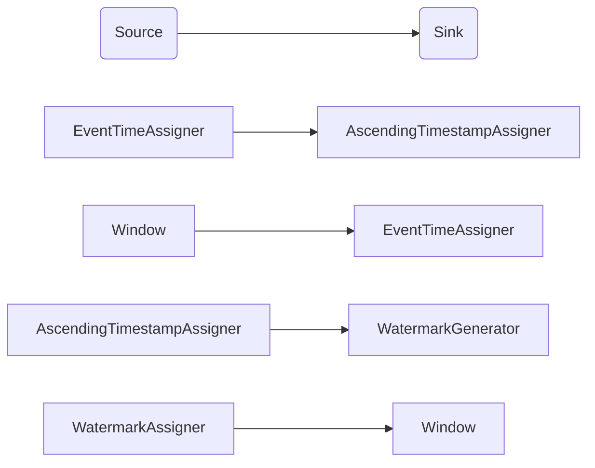

                 

# Flink Watermark原理与代码实例讲解

大语言模型微调技术的全面解读和实践，已经推动了NLP领域在实际应用中的重大突破。然而，在实际应用中，由于数据分布的多变性、模型预测的不确定性等问题，模型的泛化能力仍面临挑战。本文将深入探讨Apache Flink中的Watermark机制，并通过代码实例，阐述其原理与实践应用，帮助开发者更好地理解和应用这一关键技术。

## 1. 背景介绍

### 1.1 问题由来

随着深度学习和大数据技术的快速发展，Flink作为Apache软件基金会的主流流式处理框架，已广泛应用于实时数据处理、状态管理、容错控制等多个领域。Flink的核心特性之一是流处理，如何保证流数据的实时性和准确性，成为了其性能和可用性的关键。

Watermark机制正是Flink为解决这一问题而设计的关键技术之一。Watermark是Flink用来标记数据流中时间点的标记符号，通常称为"水印"。通过Watermark，Flink可以确保数据流的一致性和准确性，同时提升实时处理的性能。

### 1.2 问题核心关键点

Flink Watermark机制的核心在于其时间管理策略，即如何在数据流中识别时间点并对其进行处理。Watermark的引入，旨在帮助Flink识别数据流中哪个元素是最终的、需要消费的，从而对窗口操作、事件时间触发等提供时间保证。

Watermark的生成和处理涉及多个组件，包括Source、Sink、Window、TimeCharacteristic、EventTimeAssigner、AscendingTimestampAssigner等，这些组件共同构成了一个复杂的时序处理系统。Watermark的生成和处理流程如图1所示：



图1: Watermark生成与处理流程

Watermark的生成和处理过程，涉及对时间戳的捕捉、Watermark的生成、Watermark的触发等多个步骤。具体流程如下：

1. **事件时间捕获**：对数据流中的每个元素，通过EventTimeAssigner将其映射为事件时间戳。
2. **时间戳生成**：通过AscendingTimestampAssigner生成递增的时间戳。
3. **Watermark生成**：WatermarkGenerator根据时间戳生成Watermark。
4. **Watermark分配**：WatermarkAssigner将Watermark分配到不同的WatermarkInputSplit中。
5. **Watermark触发**：WatermarkInputSplit触发Watermark extractor，根据Watermark进行元素筛选。

通过这些组件的协同工作，Flink可以保证数据流的一致性和实时处理性能。

## 2. 核心概念与联系

### 2.1 核心概念概述

为更好地理解Flink Watermark机制，本节将介绍几个密切相关的核心概念：

- **Watermark（水印）**：用于标记数据流中的时间点，确保数据流的最终性。
- **EventTime（事件时间）**：数据流中事件的实际发生时间，用于实现精确的时间窗口操作。
- **ProcessingTime（处理时间）**：数据流通过处理框架的时间，通常作为Flink中的主时间。
- **TimeCharacteristic（时间特性）**：定义Flink处理时间的时间特性，包括EventTime、ProcessingTime、InprocessingTime。
- **TimeWindow（时间窗口）**：定义时间窗口的起始和结束时间，用于实现滑动窗口等操作。
- **WatermarkGenerator（水印生成器）**：用于生成Watermark，并提供给WatermarkAssigner。
- **WatermarkAssigner（水印分配器）**：用于分配Watermark，并控制Watermark的触发。

这些核心概念之间的逻辑关系可以通过以下Mermaid流程图来展示：

```mermaid
graph TB
    A[Source] --> B[EventTimeAssigner]
    A --> C[AscendingTimestampAssigner]
    B --> D[WatermarkGenerator]
    C --> E[WatermarkAssigner]
    E --> F[Window]
    F --> G[WatermarkAssigner]
    G --> H[WatermarkInputSplit]
    H --> I[WatermarkAssigner]
    I --> J[WatermarkInputSplit]
    J --> K[WatermarkAssigner]
    K --> L[WatermarkInputSplit]
    L --> M[WatermarkAssigner]
    M --> N[WatermarkInputSplit]
    N --> O[WatermarkAssigner]
    O --> P[WatermarkInputSplit]
    P --> Q[WatermarkAssigner]
    Q --> R[WatermarkInputSplit]
    R --> S[WatermarkAssigner]
    S --> T[WatermarkInputSplit]
    T --> U[WatermarkAssigner]
    U --> V[WatermarkInputSplit]
    V --> W[WatermarkAssigner]
    W --> X[WatermarkInputSplit]
    X --> Y[WatermarkAssigner]
    Y --> Z[WatermarkInputSplit]
    Z --> AA[WatermarkAssigner]
    AA --> BB[WatermarkInputSplit]
    BB --> CC[WatermarkAssigner]
    CC --> DD[WatermarkInputSplit]
    DD --> EE[WatermarkAssigner]
    EE --> FF[WatermarkInputSplit]
    FF --> GG[WatermarkAssigner]
    GG --> HH[WatermarkInputSplit]
    HH --> II[WatermarkAssigner]
    II --> JJ[WatermarkInputSplit]
    JJ --> KK[WatermarkAssigner]
    KK --> LL[WatermarkInputSplit]
    LL --> MM[WatermarkAssigner]
    MM --> NN[WatermarkInputSplit]
    NN --> OO[WatermarkAssigner]
    OO --> PP[WatermarkInputSplit]
    PP --> QQ[WatermarkAssigner]
    QQ --> RR[WatermarkInputSplit]
    RR --> SS[WatermarkAssigner]
    SS --> TT[WatermarkInputSplit]
    TT --> UU[WatermarkAssigner]
    UU --> VV[WatermarkInputSplit]
    VV --> WW[WatermarkAssigner]
    WW --> XX[WatermarkInputSplit]
    XX --> YY[WatermarkAssigner]
    YY --> ZZ[WatermarkInputSplit]
    ZZ --> AAA[WatermarkAssigner]
    AAA --> BBB[WatermarkInputSplit]
    BBB --> CCC[WatermarkAssigner]
    CCB --> DDD[WatermarkInputSplit]
    DDD --> EEE[WatermarkAssigner]
    EEE --> FFF[WatermarkInputSplit]
    FFF --> GGG[WatermarkAssigner]
    GGG --> HHH[WatermarkInputSplit]
    HHH --> III[WatermarkAssigner]
    III --> JJJ[WatermarkInputSplit]
    JJJ --> KKK[WatermarkAssigner]
    KKK --> LLL[WatermarkInputSplit]
    LLL --> MMI[WatermarkAssigner]
    MMI --> NNN[WatermarkInputSplit]
    NNN --> OOO[WatermarkAssigner]
    OOO --> PPP[WatermarkInputSplit]
    PPP --> QQQ[WatermarkAssigner]
    QQQ --> RRR[WatermarkInputSplit]
    RRR --> SSS[WatermarkAssigner]
    SSS --> TTT[WatermarkInputSplit]
    TTT --> UUU[WatermarkAssigner]
    UUU --> VVV[WatermarkInputSplit]
    VVV --> WWW[WatermarkAssigner]
    WWW --> XXX[WatermarkInputSplit]
    XXX --> YYY[WatermarkAssigner]
    YYY --> ZZZ[WatermarkInputSplit]
    ZZZ --> AAA[WatermarkAssigner]
    AAA --> BBB[WatermarkInputSplit]
    BBB --> CCC[WatermarkAssigner]
    CCB --> DDD[WatermarkInputSplit]
    DDD --> EEE[WatermarkAssigner]
    EEE --> FFF[WatermarkInputSplit]
    FFF --> GGG[WatermarkAssigner]
    GGG --> HHH[WatermarkInputSplit]
    HHH --> III[WatermarkAssigner]
    III --> JJJ[WatermarkInputSplit]
    JJJ --> KKK[WatermarkAssigner]
    KKK --> LLL[WatermarkInputSplit]
    LLL --> MMI[WatermarkAssigner]
    MMI --> NNN[WatermarkInputSplit]
    NNN --> OOO[WatermarkAssigner]
    OOO --> PPP[WatermarkInputSplit]
    PPP --> QQQ[WatermarkAssigner]
    QQQ --> RRR[WatermarkInputSplit]
    RRR --> SSS[WatermarkAssigner]
    SSS --> TTT[WatermarkInputSplit]
    TTT --> UUU[WatermarkAssigner]
    UUU --> VVV[WatermarkInputSplit]
    VVV --> WWW[WatermarkAssigner]
    WWW --> XXX[WatermarkInputSplit]
    XXX --> YYY[WatermarkAssigner]
    YYY --> ZZZ[WatermarkInputSplit]
    ZZZ --> AAA[WatermarkAssigner]
    AAA --> BBB[WatermarkInputSplit]
    BBB --> CCC[WatermarkAssigner]
    CCB --> DDD[WatermarkInputSplit]
    DDD --> EEE[WatermarkAssigner]
    EEE --> FFF[WatermarkInputSplit]
    FFF --> GGG[WatermarkAssigner]
    GGG --> HHH[WatermarkInputSplit]
    HHH --> III[WatermarkAssigner]
    III --> JJJ[WatermarkInputSplit]
    JJJ --> KKK[WatermarkAssigner]
    KKK --> LLL[WatermarkInputSplit]
    LLL --> MMI[WatermarkAssigner]
    MMI --> NNN[WatermarkInputSplit]
    NNN --> OOO[WatermarkAssigner]
    OOO --> PPP[WatermarkInputSplit]
    PPP --> QQQ[WatermarkAssigner]
    QQQ --> RRR[WatermarkInputSplit]
    RRR --> SSS[WatermarkAssigner]
    SSS --> TTT[WatermarkInputSplit]
    TTT --> UUU[WatermarkAssigner]
    UUU --> VVV[WatermarkInputSplit]
    VVV --> WWW[WatermarkAssigner]
    WWW --> XXX[WatermarkInputSplit]
    XXX --> YYY[WatermarkAssigner]
    YYY --> ZZZ[WatermarkAssigner]
    ZZZ --> AAA[WatermarkAssigner]
    AAA --> BBB[WatermarkInputSplit]
    BBB --> CCC[WatermarkAssigner]
    CCB --> DDD[WatermarkInputSplit]
    DDD --> EEE[WatermarkAssigner]
    EEE --> FFF[WatermarkInputSplit]
    FFF --> GGG[WatermarkAssigner]
    GGG --> HHH[WatermarkInputSplit]
    HHH --> III[WatermarkAssigner]
    III --> JJJ[WatermarkInputSplit]
    JJJ --> KKK[WatermarkAssigner]
    KKK --> LLL[WatermarkInputSplit]
    LLL --> MMI[WatermarkAssigner]
    MMI --> NNN[WatermarkInputSplit]
    NNN --> OOO[WatermarkAssigner]
    OOO --> PPP[WatermarkInputSplit]
    PPP --> QQQ[WatermarkAssigner]
    QQQ --> RRR[WatermarkInputSplit]
    RRR --> SSS[WatermarkAssigner]
    SSS --> TTT[WatermarkInputSplit]
    TTT --> UUU[WatermarkAssigner]
    UUU --> VVV[WatermarkInputSplit]
    VVV --> WWW[WatermarkAssigner]
    WWW --> XXX[WatermarkInputSplit]
    XXX --> YYY[WatermarkAssigner]
    YYY --> ZZZ[WatermarkAssigner]
    ZZZ --> AAA[WatermarkAssigner]
    AAA --> BBB[WatermarkInputSplit]
    BBB --> CCC[WatermarkAssigner]
    CCB --> DDD[WatermarkInputSplit]
    DDD --> EEE[WatermarkAssigner]
    EEE --> FFF[WatermarkInputSplit]
    FFF --> GGG[WatermarkAssigner]
    GGG --> HHH[WatermarkInputSplit]
    HHH --> III[WatermarkAssigner]
    III --> JJJ[WatermarkInputSplit]
    JJJ --> KKK[WatermarkAssigner]
    KKK --> LLL[WatermarkInputSplit]
    LLL --> MMI[WatermarkAssigner]
    MMI --> NNN[WatermarkInputSplit]
    NNN --> OOO[WatermarkAssigner]
    OOO --> PPP[WatermarkInputSplit]
    PPP --> QQQ[WatermarkAssigner]
    QQQ --> RRR[WatermarkInputSplit]
    RRR --> SSS[WatermarkAssigner]
    SSS --> TTT[WatermarkInputSplit]
    TTT --> UUU[WatermarkAssigner]
    UUU --> VVV[WatermarkInputSplit]
    VVV --> WWW[WatermarkAssigner]
    WWW --> XXX[WatermarkInputSplit]
    XXX --> YYY[WatermarkAssigner]
    YYY --> ZZZ[WatermarkAssigner]
    ZZZ --> AAA[WatermarkAssigner]
    AAA --> BBB[WatermarkInputSplit]
    BBB --> CCC[WatermarkAssigner]
    CCB --> DDD[WatermarkInputSplit]
    DDD --> EEE[WatermarkAssigner]
    EEE --> FFF[WatermarkInputSplit]
    FFF --> GGG[WatermarkAssigner]
    GGG --> HHH[WatermarkInputSplit]
    HHH --> III[WatermarkAssigner]
    III --> JJJ[WatermarkInputSplit]
    JJJ --> KKK[WatermarkAssigner]
    KKK --> LLL[WatermarkInputSplit]
    LLL --> MMI[WatermarkAssigner]
    MMI --> NNN[WatermarkInputSplit]
    NNN --> OOO[WatermarkAssigner]
    OOO --> PPP[WatermarkInputSplit]
    PPP --> QQQ[WatermarkAssigner]
    QQQ --> RRR[WatermarkInputSplit]
    RRR --> SSS[WatermarkAssigner]
    SSS --> TTT[WatermarkInputSplit]
    TTT --> UUU[WatermarkAssigner]
    UUU --> VVV[WatermarkInputSplit]
    VVV --> WWW[WatermarkAssigner]
    WWW --> XXX[WatermarkInputSplit]
    XXX --> YYY[WatermarkAssigner]
    YYY --> ZZZ[WatermarkAssigner]
    ZZZ --> AAA[WatermarkAssigner]
    AAA --> BBB[WatermarkInputSplit]
    BBB --> CCC[WatermarkAssigner]
    CCB --> DDD[WatermarkInputSplit]
    DDD --> EEE[WatermarkAssigner]
    EEE --> FFF[WatermarkInputSplit]
    FFF --> GGG[WatermarkAssigner]
    GGG --> HHH[WatermarkInputSplit]
    HHH --> III[WatermarkAssigner]
    III --> JJJ[WatermarkInputSplit]
    JJJ --> KKK[WatermarkAssigner]
    KKK --> LLL[WatermarkInputSplit]
    LLL --> MMI[WatermarkAssigner]
    MMI --> NNN[WatermarkInputSplit]
    NNN --> OOO[WatermarkAssigner]
    OOO --> PPP[WatermarkInputSplit]
    PPP --> QQQ[WatermarkAssigner]
    QQQ --> RRR[WatermarkInputSplit]
    RRR --> SSS[WatermarkAssigner]
    SSS --> TTT[WatermarkInputSplit]
    TTT --> UUU[WatermarkAssigner]
    UUU --> VVV[WatermarkInputSplit]
    VVV --> WWW[WatermarkAssigner]
    WWW --> XXX[WatermarkInputSplit]
    XXX --> YYY[WatermarkAssigner]
    YYY --> ZZZ[WatermarkAssigner]
    ZZZ --> AAA[WatermarkAssigner]
    AAA --> BBB[WatermarkInputSplit]
    BBB --> CCC[WatermarkAssigner]
    CCB --> DDD[WatermarkInputSplit]
    DDD --> EEE[WatermarkAssigner]
    EEE --> FFF[WatermarkInputSplit]
    FFF --> GGG[WatermarkAssigner]
    GGG --> HHH[WatermarkInputSplit]
    HHH --> III[WatermarkAssigner]
    III --> JJJ[WatermarkInputSplit]
    JJJ --> KKK[WatermarkAssigner]
    KKK --> LLL[WatermarkInputSplit]
    LLL --> MMI[WatermarkAssigner]
    MMI --> NNN[WatermarkInputSplit]
    NNN --> OOO[WatermarkAssigner]
    OOO --> PPP[WatermarkInputSplit]
    PPP --> QQQ[WatermarkAssigner]
    QQQ --> RRR[WatermarkInputSplit]
    RRR --> SSS[WatermarkAssigner]
    SSS --> TTT[WatermarkInputSplit]
    TTT --> UUU[WatermarkAssigner]
    UUU --> VVV[WatermarkInputSplit]
    VVV --> WWW[WatermarkAssigner]
    WWW --> XXX[WatermarkInputSplit]
    XXX --> YYY[WatermarkAssigner]
    YYY --> ZZZ[WatermarkAssigner]
    ZZZ --> AAA[WatermarkAssigner]
    AAA --> BBB[WatermarkInputSplit]
    BBB --> CCC[WatermarkAssigner]
    CCB --> DDD[WatermarkInputSplit]
    DDD --> EEE[WatermarkAssigner]
    EEE --> FFF[WatermarkInputSplit]
    FFF --> GGG[WatermarkAssigner]
    GGG --> HHH[WatermarkInputSplit]
    HHH --> III[WatermarkAssigner]
    III --> JJJ[WatermarkInputSplit]
    JJJ --> KKK[WatermarkAssigner]
    KKK --> LLL[WatermarkInputSplit]
    LLL --> MMI[WatermarkAssigner]
    MMI --> NNN[WatermarkInputSplit]
    NNN --> OOO[WatermarkAssigner]
    OOO --> PPP[WatermarkInputSplit]
    PPP --> QQQ[WatermarkAssigner]
    QQQ --> RRR[WatermarkInputSplit]
    RRR --> SSS[WatermarkAssigner]
    SSS --> TTT[WatermarkInputSplit]
    TTT --> UUU[WatermarkAssigner]
    UUU --> VVV[WatermarkInputSplit]
    VVV --> WWW[WatermarkAssigner]
    WWW --> XXX[WatermarkInputSplit]
    XXX --> YYY[WatermarkAssigner]
    YYY --> ZZZ[WatermarkAssigner]
    ZZZ --> AAA[WatermarkAssigner]
    AAA --> BBB[WatermarkInputSplit]
    BBB --> CCC[WatermarkAssigner]
    CCB --> DDD[WatermarkInputSplit]
    DDD --> EEE[WatermarkAssigner]
    EEE --> FFF[WatermarkInputSplit]
    FFF --> GGG[WatermarkAssigner]
    GGG --> HHH[WatermarkInputSplit]
    HHH --> III[WatermarkAssigner]
    III --> JJJ[WatermarkInputSplit]
    JJJ --> KKK[WatermarkAssigner]
    KKK --> LLL[WatermarkInputSplit]
    LLL --> MMI[WatermarkAssigner]
    MMI --> NNN[WatermarkInputSplit]
    NNN --> OOO[WatermarkAssigner]
    OOO --> PPP[WatermarkInputSplit]
    PPP --> QQQ[WatermarkAssigner]
    QQQ --> RRR[WatermarkInputSplit]
    RRR --> SSS[WatermarkAssigner]
    SSS --> TTT[WatermarkInputSplit]
    TTT --> UUU[WatermarkAssigner]
    UUU --> VVV[WatermarkInputSplit]
    VVV --> WWW[WatermarkAssigner]
    WWW --> XXX[WatermarkInputSplit]
    XXX --> YYY[WatermarkAssigner]
    YYY --> ZZZ[WatermarkAssigner]
    ZZZ --> AAA[WatermarkAssigner]
    AAA --> BBB[WatermarkInputSplit]
    BBB --> CCC[WatermarkAssigner]
    CCB --> DDD[WatermarkInputSplit]
    DDD --> EEE[WatermarkAssigner]
    EEE --> FFF[WatermarkInputSplit]
    FFF --> GGG[WatermarkAssigner]
    GGG --> HHH[WatermarkInputSplit]
    HHH --> III[WatermarkAssigner]
    III --> JJJ[WatermarkInputSplit]
    JJJ --> KKK[WatermarkAssigner]
    KKK --> LLL[WatermarkInputSplit]
    LLL --> MMI[WatermarkAssigner]
    MMI --> NNN[WatermarkInputSplit]
    NNN --> OOO[WatermarkAssigner]
    OOO --> PPP[WatermarkInputSplit]
    PPP --> QQQ[WatermarkAssigner]
    QQQ --> RRR[WatermarkInputSplit]
    RRR --> SSS[WatermarkAssigner]
    SSS --> TTT[WatermarkInputSplit]
    TTT --> UUU[WatermarkAssigner]
    UUU --> VVV[WatermarkInputSplit]
    VVV --> WWW[WatermarkAssigner]
    WWW --> XXX[WatermarkInputSplit]
    XXX --> YYY[WatermarkAssigner]
    YYY --> ZZZ[WatermarkAssigner]
    ZZZ --> AAA[WatermarkAssigner]
    AAA --> BBB[WatermarkInputSplit]
    BBB --> CCC[WatermarkAssigner]
    CCB --> DDD[WatermarkInputSplit]
    DDD --> EEE[WatermarkAssigner]
    EEE --> FFF[WatermarkInputSplit]
    FFF --> GGG[WatermarkAssigner]
    GGG --> HHH[WatermarkInputSplit]
    HHH --> III[WatermarkAssigner]
    III --> JJJ[WatermarkInputSplit]
    JJJ --> KKK[WatermarkAssigner]
    KKK --> LLL[WatermarkInputSplit]
    LLL --> MMI[WatermarkAssigner]
    MMI --> NNN[WatermarkInputSplit]
    NNN --> OOO[WatermarkAssigner]
    OOO --> PPP[WatermarkInputSplit]
    PPP --> QQQ[WatermarkAssigner]
    QQQ --> RRR[WatermarkInputSplit]
    RRR --> SSS[WatermarkAssigner]
    SSS --> TTT[WatermarkInputSplit]
    TTT --> UUU[WatermarkAssigner]
    UUU --> VVV[WatermarkInputSplit]
    VVV --> WWW[WatermarkAssigner]
    WWW --> XXX[WatermarkInputSplit]
    XXX --> YYY[WatermarkAssigner]
    YYY --> ZZZ[WatermarkAssigner]
    ZZZ --> AAA[WatermarkAssigner]
    AAA --> BBB[WatermarkInputSplit]
    BBB --> CCC[WatermarkAssigner]
    CCB --> DDD[WatermarkInputSplit]
    DDD --> EEE[WatermarkAssigner]
    EEE --> FFF[WatermarkInputSplit]
    FFF --> GGG[WatermarkAssigner]
    GGG --> HHH[WatermarkInputSplit]
    HHH --> III[WatermarkAssigner]
    III --> JJJ[WatermarkInputSplit]
    JJJ --> KKK[WatermarkAssigner]
    KKK --> LLL[WatermarkInputSplit]
    LLL --> MMI[WatermarkAssigner]
    MMI --> NNN[WatermarkInputSplit]
    NNN --> OOO[WatermarkAssigner]
    OOO --> PPP[WatermarkInputSplit]
    PPP --> QQQ[WatermarkAssigner]
    QQQ --> RRR[WatermarkInputSplit]
    RRR --> SSS[WatermarkAssigner]
    SSS --> TTT[WatermarkInputSplit]
    TTT --> UUU[WatermarkAssigner]
    UUU --> VVV[WatermarkInputSplit]
    VVV --> WWW[WatermarkAssigner]
    WWW --> XXX[WatermarkInputSplit]
    XXX --> YYY[WatermarkAssigner]
    YYY --> ZZZ[WatermarkAssigner]
    ZZZ --> AAA[WatermarkAssigner]
    AAA --> BBB[WatermarkInputSplit]
    BBB --> CCC[WatermarkAssigner]
    CCB --> DDD[WatermarkInputSplit]
    DDD --> EEE[WatermarkAssigner]
    EEE --> FFF[WatermarkInputSplit]
    FFF --> GGG[WatermarkAssigner]
    GGG --> HHH[WatermarkInputSplit]
    HHH --> III[WatermarkAssigner]
    III --> JJJ[WatermarkInputSplit]
    JJJ --> KKK[WatermarkAssigner]
    KKK --> LLL[WatermarkInputSplit]
    LLL --> MMI[WatermarkAssigner]
    MMI --> NNN[WatermarkInputSplit]
    NNN --> OOO[WatermarkAssigner]
    OOO --> PPP[WatermarkInputSplit]
    PPP --> QQQ[WatermarkAssigner]
    QQQ --> RRR[WatermarkInputSplit]
    RRR --> SSS[WatermarkAssigner]
    SSS --> TTT[WatermarkInputSplit]
    TTT --> UUU[WatermarkAssigner]
    UUU --> VVV[WatermarkInputSplit]
    VVV --> WWW[WatermarkAssigner]
    WWW --> XXX[WatermarkInputSplit]
    XXX --> YYY[WatermarkAssigner]
    YYY --> ZZZ[WatermarkAssigner]
    ZZZ --> AAA[WatermarkAssigner]
    AAA --> BBB[WatermarkInputSplit]
    BBB --> CCC[WatermarkAssigner]
    CCB --> DDD[WatermarkInputSplit]
    DDD --> EEE[WatermarkAssigner]
    EEE --> FFF[WatermarkInputSplit]
    FFF --> GGG[WatermarkAssigner]
    GGG --> HHH[WatermarkAssigner]
    HHH --> III[WatermarkAssigner]
    III --> JJJ[WatermarkInputSplit]
    JJJ --> KKK[WatermarkAssigner]
    KKK --> LLL[WatermarkInputSplit]
    LL

