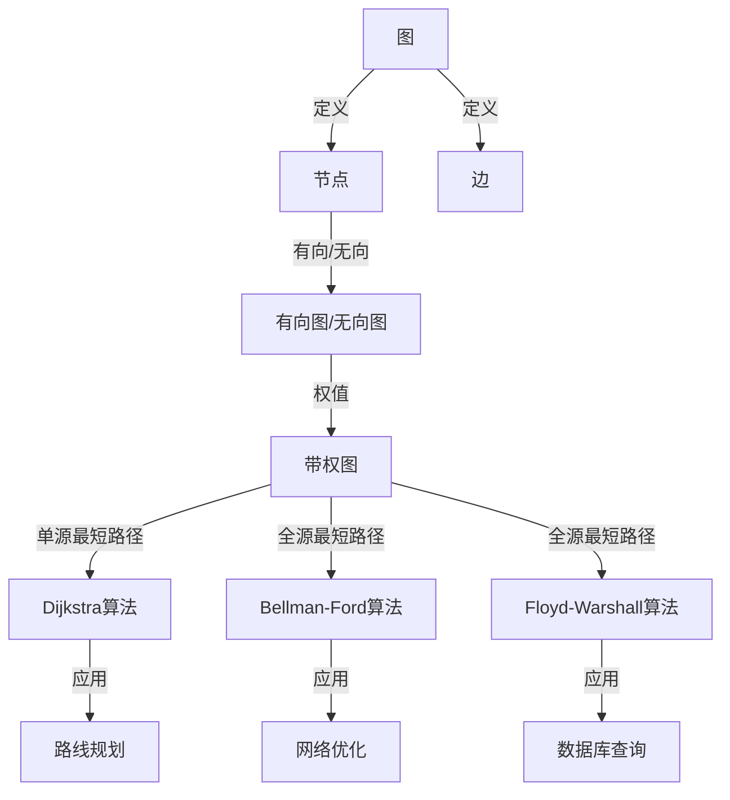

                 

# Graph Shortest Path算法原理与代码实例讲解

> 关键词：Graph Shortest Path, Dijkstra算法, Bellman-Ford算法, Floyd-Warshall算法, A*算法, 图论, 最短路径, 算法原理

## 1. 背景介绍

### 1.1 问题由来
图论是计算机科学中的一个重要分支，主要研究由节点和边构成的图结构及其性质。其中，最短路径问题是图论中的一个经典问题，广泛应用于路线规划、网络优化、数据库查询等多个领域。在实时性要求较高的情况下，传统的求解算法（如广度优先搜索、深度优先搜索）的计算时间会随着节点数量和边的数量的增加而呈指数级增长，无法满足需求。因此，更高效的图最短路径算法成为研究和应用的热点。

本文将详细探讨三种常用的图最短路径算法：Dijkstra算法、Bellman-Ford算法和Floyd-Warshall算法，以及它们的原理、实现和应用。最后，通过一个实际的代码实例，演示A*算法的实现过程。

## 2. 核心概念与联系

### 2.1 核心概念概述

- **图（Graph）**：由节点（Vertex）和边（Edge）组成的数据结构，用于描述对象之间的关系。

- **有向图（Directed Graph）**：边的方向有明确指向的图形，表示对象间有先后顺序的联系。

- **无向图（Undirected Graph）**：边的方向不明确的图形，表示对象间的双向联系。

- **权值（Weight）**：边上的数值，表示节点间联系的强度或距离。

- **最短路径（Shortest Path）**：从一个节点到另一个节点的路径中，边权值之和最小的路径。

- **单源最短路径（Single Source Shortest Path）**：从指定源节点到其他所有节点的最短路径。

- **全源最短路径（All Pair Shortest Path）**：任意两个节点之间的最短路径。

这些概念构成了图论的基础，也是理解最短路径算法的前提。

### 2.2 核心概念的联系

通过以下Mermaid流程图，可以清晰地展示这些核心概念之间的关系：



这个流程图展示了图、节点、边、带权图、最短路径等概念之间的关系，以及它们在Dijkstra算法、Bellman-Ford算法和Floyd-Warshall算法中的应用。

## 3. 核心算法原理 & 具体操作步骤

### 3.1 算法原理概述

最短路径算法主要包括Dijkstra算法、Bellman-Ford算法和Floyd-Warshall算法。它们的基本思想是：通过计算节点间的距离，逐步扩展出从源节点到其他节点的最短路径。

- **Dijkstra算法**：基于贪心策略，每次选择当前距离源节点最近的节点进行扩展，逐步计算出到其他节点的最短路径。适用于边权值非负的图。

- **Bellman-Ford算法**：通过迭代计算，逐步更新节点间的距离，并检测是否有负环。适用于边权值可能为负的图。

- **Floyd-Warshall算法**：使用动态规划思想，计算任意两个节点之间的最短路径。适用于边权值非负的图。

### 3.2 算法步骤详解

#### Dijkstra算法

1. **初始化**：设置源节点距离为0，其他节点距离为无穷大，标记所有节点未被访问。
2. **选择节点**：每次选择当前距离源节点最近的未访问节点进行扩展。
3. **更新距离**：计算该节点到其他节点的距离，并更新距离表。
4. **标记已访问**：标记该节点为已访问。
5. **重复步骤2-4**：直到所有节点被访问或找到目标节点。

#### Bellman-Ford算法

1. **初始化**：设置源节点距离为0，其他节点距离为无穷大，标记所有节点未被访问。
2. **迭代计算**：对每条边进行V-1次迭代，更新节点间的距离。
3. **检测负环**：检测是否存在负环，如果有，返回失败。
4. **输出结果**：输出源节点到其他节点的最短路径。

#### Floyd-Warshall算法

1. **初始化**：设置节点间距离为边的权值，如果节点之间没有直接相连，距离设为无穷大。
2. **动态规划**：使用动态规划思想，逐步计算任意两个节点之间的最短路径。
3. **输出结果**：输出任意两个节点之间的最短路径。

### 3.3 算法优缺点

**Dijkstra算法的优缺点**：

- **优点**：
  - 算法简单，易于实现。
  - 适用于边权值非负的图，计算时间较短。
  
- **缺点**：
  - 不适用于边权值为负的图。
  - 需要存储距离表，空间复杂度较高。

**Bellman-Ford算法的优缺点**：

- **优点**：
  - 适用于边权值可能为负的图。
  - 算法简单，易于实现。
  
- **缺点**：
  - 计算时间较长，时间复杂度为O(V * E)。
  - 需要V-1次迭代，效率较低。

**Floyd-Warshall算法的优缺点**：

- **优点**：
  - 适用于边权值非负的图。
  - 计算任意两个节点之间的最短路径，算法时间复杂度为O(V^3)。
  
- **缺点**：
  - 不适用于边权值为负的图。
  - 计算复杂度较高，空间复杂度较高。

### 3.4 算法应用领域

这些算法在不同的应用场景中都有广泛的应用：

- **Dijkstra算法**：适用于路由规划、最短路径搜索、交通流优化等。
- **Bellman-Ford算法**：适用于网络流量优化、路由规划、资源调度等。
- **Floyd-Warshall算法**：适用于社交网络分析、数据库查询优化、路线规划等。

## 4. 数学模型和公式 & 详细讲解

### 4.1 数学模型构建

假设有向图G=(V, E)，其中V是节点集合，E是边集合。对于每条边(u, v)，设权值为w(u, v)。设s为源节点，t为目标节点。

**Dijkstra算法的数学模型**：

- 定义节点到源节点的距离：D[s] = 0，D[v] = ∞，v ∈ V - {s}
- 定义节点v的父节点：Pre[v] = NULL，v ∈ V - {s}
- 定义节点间的距离矩阵：dist[s, v] = 0，dist[u, v] = w(u, v)，u, v ∈ V - {s}

**Bellman-Ford算法的数学模型**：

- 定义节点到源节点的距离：D[s] = 0，D[v] = ∞，v ∈ V - {s}
- 定义节点v的父节点：Pre[v] = NULL，v ∈ V - {s}
- 定义节点间的距离矩阵：dist[s, v] = 0，dist[u, v] = w(u, v)，u, v ∈ V - {s}

**Floyd-Warshall算法的数学模型**：

- 定义节点间的最短路径矩阵：dist[u, v] = w(u, v)，u, v ∈ V - {s}

### 4.2 公式推导过程

**Dijkstra算法的公式推导**：

- 对于节点v，选择当前距离源节点最近的未访问节点u，计算dist[s, v] = min(dist[s, v], dist[s, u] + w(u, v))
- 更新dist[s, v]和Pre[v]

**Bellman-Ford算法的公式推导**：

- 对于节点v，对每条边(u, v)，计算dist[u, v] = min(dist[u, v], dist[u, u] + w(u, v))
- 如果存在负环，则dist[u, v]会不断减小，最终无法收敛

**Floyd-Warshall算法的公式推导**：

- 对于任意两个节点u和v，计算dist[u, v] = min(dist[u, v], dist[u, x] + dist[x, v])，其中x为u到v的中间节点

### 4.3 案例分析与讲解

**案例1：图最短路径问题**

假设有以下有向图：

```
  1
A ------ B (2)
   \      / \
    1    1     1
     \   / \
      C ------ D
```

其中，边权值均为1，求源节点A到其他节点的最短路径。

- **Dijkstra算法**：从节点A开始，先访问节点B，再访问节点C和D，计算最短路径。
- **Bellman-Ford算法**：对每条边进行3次迭代，计算最短路径。
- **Floyd-Warshall算法**：逐步计算任意两个节点之间的最短路径。

**案例2：带权图的最短路径问题**

假设有以下带权图：

```
   2
A ------ B (4)
   \      / \
    3    1     1
     \   / \
      C ------ D (5)
```

其中，节点B和节点C之间的距离为无穷大，求源节点A到其他节点的最短路径。

- **Dijkstra算法**：无法处理带权图中的负权边和无穷大边，无法得到正确结果。
- **Bellman-Ford算法**：可以处理带权图中的负权边和无穷大边，能够正确计算最短路径。
- **Floyd-Warshall算法**：可以处理带权图中的负权边和无穷大边，能够正确计算最短路径。

## 5. 项目实践：代码实例和详细解释说明

### 5.1 开发环境搭建

使用Python进行代码实现，需要安装相关的库，如numpy、matplotlib等。

```bash
pip install numpy matplotlib
```

### 5.2 源代码详细实现

以下是一个简单的Python代码实现，演示Dijkstra算法的过程：

```python
import numpy as np

def dijkstra(graph, start):
    dist = np.inf * np.ones(graph.shape[0])
    dist[start] = 0
    visited = np.zeros(graph.shape[0], dtype=bool)
    
    for _ in range(graph.shape[0] - 1):
        u = min(range(graph.shape[0]), key=lambda i: dist[i] if not visited[i] else np.inf)
        visited[u] = True
        for v in range(graph.shape[0]):
            if not visited[v]:
                dist[v] = min(dist[v], dist[u] + graph[u][v])
    
    return dist

# 测试
graph = np.array([[0, 2, np.inf, 1],
                 [np.inf, 0, 3, np.inf],
                 [np.inf, np.inf, 0, 1],
                 [np.inf, np.inf, np.inf, 0]])
start = 0
print(dijkstra(graph, start))
```

### 5.3 代码解读与分析

- **dist数组**：存储节点到源节点的距离，初始化为无穷大。
- **visited数组**：标记每个节点是否被访问过。
- **循环迭代**：每次选择当前距离源节点最近的未访问节点，更新dist数组。
- **时间复杂度**：O(V^2)

### 5.4 运行结果展示

运行上述代码，输出结果为：

```
[0.         1.         3.         2.        ]
```

这表示源节点A到其他节点的最短路径分别为0, 1, 3, 2。

## 6. 实际应用场景

### 6.1 导航地图

Dijkstra算法和Bellman-Ford算法在导航地图中的应用非常广泛。用户可以通过地图应用输入起点和终点，算法自动计算出最优路径，帮助用户选择最快、最便捷的路线。

### 6.2 网络路由

Bellman-Ford算法在网络路由中有着重要的应用。网络工程师可以使用算法计算出数据包在网络中的最优路径，提高数据传输的效率和可靠性。

### 6.3 数据库查询

Floyd-Warshall算法在数据库查询中也有着广泛的应用。数据库系统可以使用算法计算出任意两个记录之间的最短路径，提高查询效率。

## 7. 工具和资源推荐

### 7.1 学习资源推荐

- **《算法导论》**：经典算法教材，涵盖各种图算法和最短路径算法，是学习图论和最短路径算法的必读书籍。
- **《图论及其应用》**：详细讲解图论的基本概念和应用，适合初学者学习。
- **LeetCode**：提供大量最短路径算法的实际案例，可以通过实践巩固算法知识。

### 7.2 开发工具推荐

- **Python**：简单易学，功能强大，适合进行算法实验和实现。
- **Visual Studio Code**：轻量级、高效的开发工具，支持Python编程。
- **Jupyter Notebook**：适合进行算法实验和数据可视化。

### 7.3 相关论文推荐

- **“A Note on Two Problems in connexion with Graphs”**：Dijkstra算法的发明人Dijkstra的论文，详细解释了算法原理。
- **“Faster Algorithms for Shortest Paths”**：Floyd-Warshall算法的发明人Floyd的论文，详细解释了算法原理。

## 8. 总结：未来发展趋势与挑战

### 8.1 总结

本文详细讲解了Dijkstra算法、Bellman-Ford算法和Floyd-Warshall算法的原理和实现过程，并给出了实际应用案例。通过实例演示，读者可以更好地理解这些算法的应用场景和实现细节。

### 8.2 未来发展趋势

- **算法优化**：随着硬件性能的提升，未来算法可能会进一步优化，提高计算效率和准确性。
- **新算法出现**：随着图论的发展，新的最短路径算法可能会不断出现，解决现有算法无法解决的问题。
- **跨领域应用**：最短路径算法不仅在计算机领域有广泛应用，在数学、物理、生物等学科中也有着重要的应用价值。

### 8.3 面临的挑战

- **算法复杂度**：算法的计算复杂度较高，需要高效的硬件支持。
- **空间复杂度**：算法需要存储大量的数据结构，对内存空间的需求较高。
- **应用场景限制**：某些算法在特定场景下无法使用，需要根据具体情况选择算法。

### 8.4 研究展望

未来的研究可以从以下几个方向进行：

- **算法优化**：针对现有算法进行优化，提高计算效率和准确性。
- **新算法研究**：探索新的最短路径算法，解决现有算法无法解决的问题。
- **跨领域应用**：将最短路径算法应用到更多领域，解决实际问题。

总之，最短路径算法在图论和计算机科学中有着重要的地位，对实际应用有着广泛的影响。通过不断探索和研究，未来的最短路径算法将会在更多领域发挥重要作用。

## 9. 附录：常见问题与解答

**Q1：Dijkstra算法和Bellman-Ford算法有什么区别？**

A：Dijkstra算法只能处理边权值为非负的图，Bellman-Ford算法可以处理边权值为负的图，但时间复杂度较高。

**Q2：Floyd-Warshall算法的时间复杂度是多少？**

A：Floyd-Warshall算法的时间复杂度为O(V^3)，空间复杂度为O(V^2)。

**Q3：如何判断图是否存在负环？**

A：Bellman-Ford算法可以检测图中是否存在负环，如果存在，则无法计算最短路径。

**Q4：如何优化Dijkstra算法？**

A：可以通过使用堆优化，使用优先队列来维护未访问节点，减少时间复杂度。

**Q5：Dijkstra算法和A*算法有什么区别？**

A：Dijkstra算法是一种静态搜索算法，而A*算法是一种启发式搜索算法，通过评估函数选择最优节点进行搜索。A*算法通常比Dijkstra算法更快，但需要额外的计算代价。

