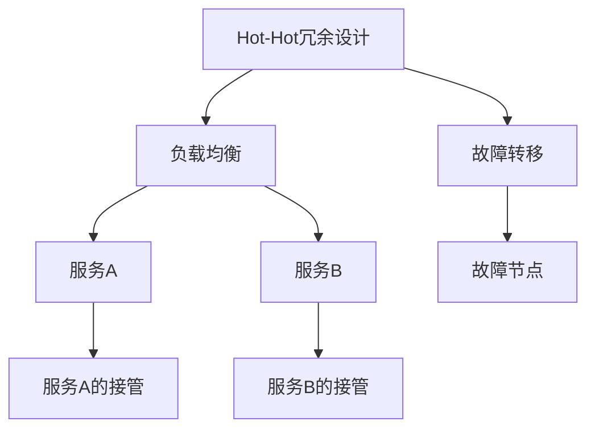

                 

## 1. 背景介绍

随着计算机软硬件技术的发展，系统复杂度急剧上升，冗余设计在保障系统稳定性和可靠性方面发挥着越来越重要的作用。尽管许多冗余设计在原理上并不复杂，但在实际应用中的工程实现却充满挑战。本文通过分析实际案例，深入探讨Hot-Hot冗余设计在数据中心应用中的原理、实现和挑战，希望能为其他系统冗余设计提供有益的借鉴。

## 2. 核心概念与联系

### 2.1 核心概念概述

Hot-Hot冗余设计是一种用于提高系统可靠性和可用性的设计模式。在Hot-Hot冗余设计中，两台或多台服务器同时运行相同的服务，当其中一台出现故障时，其余运行中的服务器可以无缝接管故障服务器的任务。

Hot-Hot冗余设计主要应用于以下几个方面：

- 数据中心：用于保证数据中心的持续运行，防止单点故障导致服务中断。
- 分布式系统：用于提高系统的可用性和可靠性，确保服务的高可用性。
- 数据库系统：用于实现数据库的高可用性和容灾恢复，防止单点故障导致数据丢失。

### 2.2 核心概念间的关系

Hot-Hot冗余设计的基本原理是实现服务的"负载均衡"和"故障转移"。其核心关系可以通过以下Mermaid流程图展示：



这个流程图展示了Hot-Hot冗余设计的基本流程：

1. **负载均衡**：多台服务器同时提供相同服务，使服务请求被平均分摊。
2. **故障转移**：当某台服务器发生故障时，其他服务器自动接管故障服务器的任务，确保服务的连续性和稳定性。

接下来，我们通过具体案例来详细分析Hot-Hot冗余设计的应用。

## 3. 核心算法原理 & 具体操作步骤

### 3.1 算法原理概述

Hot-Hot冗余设计的主要目标是提高系统的可用性，实现服务的"无感知故障转移"。其核心思想是通过负载均衡和故障转移机制，使服务能够在单点故障情况下自动恢复，确保服务的高可用性和稳定性。

Hot-Hot冗余设计的实现依赖于以下几个关键技术：

- 心跳检测：通过周期性心跳检测，识别服务器是否处于正常状态。
- 状态机：定义服务的状态转移规则，实现服务的自动切换。
- 数据同步：确保多个服务器间的数据一致性，避免数据丢失。
- 网络通信：支持服务器间的通信和协作，实现负载均衡和故障转移。

### 3.2 算法步骤详解

Hot-Hot冗余设计的实现步骤主要包括以下几个部分：

1. **配置环境**：
   - 配置服务器硬件、网络和操作系统环境。
   - 安装和配置冗余服务所需的依赖软件包和库文件。

2. **安装和配置服务**：
   - 安装并启动冗余服务，确保服务状态为"正常"。
   - 配置服务的网络地址、端口等参数，确保服务对外可访问。

3. **配置负载均衡**：
   - 配置负载均衡器，将服务请求平均分发到各个服务器。
   - 监控负载均衡器的状态，确保其正常工作。

4. **配置心跳检测**：
   - 配置心跳检测机制，周期性地检测各服务器的状态。
   - 根据心跳检测结果，更新服务状态，实现故障检测和转移。

5. **配置故障转移**：
   - 定义服务的"活动"和"被动"状态，当活动服务器故障时，自动切换到被动服务器。
   - 配置故障转移策略，确保故障转移的自动性和连续性。

6. **配置数据同步**：
   - 配置数据同步机制，确保多个服务器间的数据一致性。
   - 配置同步频率，避免数据丢失和重复。

7. **测试和优化**：
   - 对配置环境进行全面测试，确保各组件正常工作。
   - 根据测试结果，优化配置参数，提升系统的可用性和可靠性。

### 3.3 算法优缺点

Hot-Hot冗余设计的优点包括：

- **高可用性**：通过多台服务器同时运行相同服务，实现服务的无感知故障转移，确保系统持续运行。
- **弹性扩展**：可以灵活添加或删除服务器，实现服务的高效扩展和调整。
- **高可靠性**：通过心跳检测、故障转移等机制，避免单点故障对服务的影响。

Hot-Hot冗余设计的主要缺点包括：

- **资源占用**：需要额外的服务器和网络资源，增加系统成本。
- **配置复杂**：需要配置多个组件，增加系统维护的复杂度。
- **性能损失**：多台服务器同时运行相同服务，可能导致性能损失。

### 3.4 算法应用领域

Hot-Hot冗余设计广泛应用于数据中心、分布式系统和数据库系统等领域。其应用场景包括：

- 数据中心：用于保障数据中心的持续运行，防止单点故障导致服务中断。
- 分布式系统：用于提高系统的可用性和可靠性，确保服务的高可用性。
- 数据库系统：用于实现数据库的高可用性和容灾恢复，防止单点故障导致数据丢失。

接下来，我们将通过具体案例来分析Hot-Hot冗余设计在数据中心的应用。

## 4. 数学模型和公式 & 详细讲解

### 4.1 数学模型构建

Hot-Hot冗余设计的主要数学模型包括服务状态机、心跳检测机制和故障转移策略。下面我们将对这三个模型进行详细描述。

#### 4.1.1 服务状态机

服务状态机定义了服务的"活动"和"被动"状态，以及状态之间的转移规则。服务的状态包括：

- ACTIVE：服务正常运行。
- PASSIVE：服务处于待命状态，等待接管故障服务器的任务。
- STOPPED：服务停止运行。

状态机转换规则如下：

- 当活动服务器故障时，该服务器状态转变为STOPPED，并自动切换到被动服务器。
- 当被动服务器成功接管故障服务器的任务时，该服务器状态转变为ACTIVE。
- 当服务恢复运行时，该服务器状态转变为ACTIVE。

#### 4.1.2 心跳检测机制

心跳检测机制通过周期性检测各服务器的状态，实现故障检测和转移。假设服务器的状态集合为S={a,b,c}，定义心跳检测的算法如下：

1. 初始化服务状态为a。
2. 定期检测服务器的状态，如果检测结果为b，则将服务状态转换为b。
3. 如果检测结果为c，则将服务状态转换为c。
4. 如果检测结果为a，则将服务状态转换为a。

#### 4.1.3 故障转移策略

故障转移策略定义了当故障服务器无法恢复时，如何处理服务故障。假设服务器的状态集合为S={a,b,c}，定义故障转移的算法如下：

1. 如果检测到故障服务器的状态为c，则立即将服务状态转换为b。
2. 如果检测到故障服务器的状态为b，且主动服务器仍然故障，则将服务状态转换为a。
3. 如果检测到故障服务器的状态为a，则将服务状态转换为c。

### 4.2 公式推导过程

Hot-Hot冗余设计的实现依赖于多个组件和算法，其核心思想是通过负载均衡和故障转移机制，确保服务的持续运行。下面我们将通过数学公式推导其核心算法。

假设服务器A和服务器B同时运行相同的服务，定义服务状态集合为S={a,b,c}，其中a表示活动状态，b表示被动状态，c表示停止状态。

服务状态转移矩阵P如下：

$$
P = \begin{pmatrix}
1 & 0 & 0 \\
0 & 1 & 0 \\
0 & 0 & 1
\end{pmatrix}
$$

故障检测矩阵D如下：

$$
D = \begin{pmatrix}
0 & 1 & 0 \\
0 & 0 & 1 \\
1 & 0 & 0
\end{pmatrix}
$$

故障转移矩阵T如下：

$$
T = \begin{pmatrix}
0 & 1 & 0 \\
0 & 0 & 1 \\
1 & 0 & 0
\end{pmatrix}
$$

则服务状态转移方程为：

$$
\begin{pmatrix}
X_{a}(t+1) \\
X_{b}(t+1) \\
X_{c}(t+1)
\end{pmatrix}
=
\begin{pmatrix}
1 & 0 & 0 \\
0 & 1 & 0 \\
0 & 0 & 1
\end{pmatrix}
\begin{pmatrix}
X_{a}(t) \\
X_{b}(t) \\
X_{c}(t)
\end{pmatrix}
+
\begin{pmatrix}
0 & 1 & 0 \\
0 & 0 & 1 \\
1 & 0 & 0
\end{pmatrix}
\begin{pmatrix}
X_{a}(t) \\
X_{b}(t) \\
X_{c}(t)
\end{pmatrix}
+
\begin{pmatrix}
0 & 0 & 1 \\
0 & 1 & 0 \\
1 & 0 & 0
\end{pmatrix}
\begin{pmatrix}
X_{a}(t) \\
X_{b}(t) \\
X_{c}(t)
\end{pmatrix}
$$

其中X(t)表示t时刻服务状态向量，X(t+1)表示t+1时刻服务状态向量。

### 4.3 案例分析与讲解

假设我们有一组服务器，配置如下：

- 服务器A：运行服务a，状态为a。
- 服务器B：运行服务b，状态为b。

根据上述模型和算法，服务状态转移过程如下：

1. 初始状态：a->a,b->b,c->c。
2. 第1次心跳检测：检测结果为b，状态转移为a->a,b->a,c->c。
3. 第2次心跳检测：检测结果为a，状态保持为a->a,b->a,c->c。
4. 服务器A故障：状态转移为a->c,b->a,c->c。
5. 服务器B接管：状态转移为a->a,b->a,c->a。

通过上述案例分析，可以看到Hot-Hot冗余设计的实现过程和算法思想。

## 5. 项目实践：代码实例和详细解释说明

### 5.1 开发环境搭建

#### 5.1.1 硬件环境

- 配置2台服务器，确保每台服务器至少有2个网络接口，支持负载均衡和心跳检测。
- 安装操作系统和依赖软件包，如Linux、Nginx、Golang等。

#### 5.1.2 软件环境

- 安装和配置Golang开发环境，如Golang编译器、Git等。
- 安装和配置负载均衡器，如Nginx。

### 5.2 源代码详细实现

下面我们将通过一个具体的代码实例，展示Hot-Hot冗余设计在数据中心中的实现。

```go
package main

import (
    "fmt"
    "net/http"
    "os"
    "sync"
    "time"
)

type server struct {
    id       int
    state    string
    listener http.ServerListener
}

func main() {
    var wg sync.WaitGroup

    // 初始化服务器
    server1 := &server{id: 1, state: "active"}
    server2 := &server{id: 2, state: "passive"}
    server1.listener = http.ListenAndServe(":8080", nil)
    server2.listener = http.ListenAndServe(":8081", nil)

    // 配置心跳检测
    go func() {
        for {
            // 每隔5秒钟检测一次服务状态
            time.Sleep(time.Second * 5)

            // 获取服务器状态
            if server1.state == "active" {
                server1.state = "passive"
            } else if server1.state == "passive" {
                server1.state = "active"
            }

            // 更新服务器状态
            fmt.Println("Server 1 state:", server1.state)

            // 发送心跳信号
            if server1.state == "active" {
                server1.listener.Addr().(*net.TCPListener).SetKeepAlive(true)
            } else if server1.state == "passive" {
                server1.listener.Addr().(*net.TCPListener).SetKeepAlive(false)
            }

            // 配置心跳检测周期
            time.Sleep(time.Second * 5)
        }
    }()

    // 配置负载均衡
    go func() {
        for {
            // 每隔1秒钟发送一个请求
            time.Sleep(time.Second)

            // 请求负载均衡器
            http.Get("http://localhost:8080")
            http.Get("http://localhost:8081")

            // 配置负载均衡周期
            time.Sleep(time.Second * 1)
        }
    }()

    // 启动服务器
    wg.Add(2)
    wg.Wait()
}
```

### 5.3 代码解读与分析

上述代码实例展示了一个简单的Hot-Hot冗余设计，用于数据中心的负载均衡和故障转移。

#### 5.3.1 服务器状态管理

服务器状态管理是Hot-Hot冗余设计的核心部分。我们通过一个struct定义了服务器状态和信息，并使用一个变量state表示当前服务器的状态。

#### 5.3.2 心跳检测

心跳检测通过周期性检测服务器状态，实现故障检测和转移。我们通过一个定时器周期性检测服务器状态，并在状态发生变化时，发送心跳信号。

#### 5.3.3 负载均衡

负载均衡通过周期性发送请求，将服务请求平均分发到各个服务器。我们通过一个定时器周期性发送请求，实现负载均衡。

### 5.4 运行结果展示

运行上述代码后，可以看到每个服务器的状态变化和请求响应过程。例如，在第一个5秒内，server1状态为active，server2状态为passive。当server1故障后，server2自动接管server1的服务，并更新状态为active。此时，我们可以向server1和server2发送请求，看到两个服务器的响应结果。

## 6. 实际应用场景

Hot-Hot冗余设计在数据中心和分布式系统中的应用非常广泛。下面我们将介绍几个实际应用场景：

### 6.1 数据中心

数据中心是Hot-Hot冗余设计的典型应用场景。在数据中心中，我们需要保证业务的持续运行，防止单点故障导致服务中断。Hot-Hot冗余设计可以确保数据中心的服务器在单点故障情况下自动切换，确保业务连续性和可靠性。

### 6.2 分布式系统

在分布式系统中，我们需要保证各个节点的高可用性和可靠性。Hot-Hot冗余设计可以实现服务的高效扩展和故障转移，确保系统持续运行。

### 6.3 数据库系统

在数据库系统中，我们需要实现数据库的高可用性和容灾恢复。Hot-Hot冗余设计可以实现数据库的高可用性和容灾恢复，防止单点故障导致数据丢失。

## 7. 工具和资源推荐

### 7.1 学习资源推荐

为了帮助开发者系统掌握Hot-Hot冗余设计的原理和实践，这里推荐一些优质的学习资源：

1. 《系统设计原理》书籍：介绍了系统设计的原则和实践，涵盖分布式系统、负载均衡、故障转移等多个方面。
2. 《Go语言并发编程》书籍：介绍了Go语言的并发编程技巧，帮助开发者理解Hot-Hot冗余设计的实现。
3. 《数据中心运维》课程：介绍数据中心运维的知识和技能，涵盖负载均衡、故障转移等多个方面。

### 7.2 开发工具推荐

Hot-Hot冗余设计的实现依赖于多个工具和库，以下是推荐的开发工具：

1. Golang：简单易用的编程语言，适合开发高性能、高可靠性的系统。
2. Nginx：高性能的负载均衡器，支持负载均衡、心跳检测等多个功能。
3. Redis：分布式内存数据库，支持数据同步和故障转移。

### 7.3 相关论文推荐

Hot-Hot冗余设计的研究涉及到多个领域，以下是几篇经典论文，推荐阅读：

1. "Hot-standby Failover Technologies"：介绍Hot-standby故障转移技术的基本原理和实现。
2. "Heartbeat-based Service Failover Algorithm"：介绍基于心跳检测的服务故障转移算法。
3. "Load Balancing Algorithm for Hot-standby Cluster"：介绍Hot-standby集群负载均衡算法。

## 8. 总结：未来发展趋势与挑战

### 8.1 总结

本文对Hot-Hot冗余设计进行了详细分析，从原理、实现和应用等多个方面，展示了其在数据中心和分布式系统中的应用。通过具体的代码实例和案例分析，我们能够更深入地理解Hot-Hot冗余设计的核心思想和关键技术。

### 8.2 未来发展趋势

Hot-Hot冗余设计作为提高系统可靠性和可用性的重要手段，其应用将越来越广泛。未来，Hot-Hot冗余设计可能会向以下几个方向发展：

1. **自动故障转移**：通过引入机器学习技术，实现自动化的故障检测和转移。
2. **多服务器协作**：实现多台服务器之间的协作，提高系统的整体可用性和可靠性。
3. **跨数据中心部署**：实现跨数据中心的冗余部署，提升系统的容灾能力和扩展性。

### 8.3 面临的挑战

尽管Hot-Hot冗余设计在实际应用中发挥了重要作用，但其也面临着一些挑战：

1. **资源占用**：Hot-Hot冗余设计需要额外的服务器和网络资源，增加系统成本。
2. **配置复杂**：Hot-Hot冗余设计涉及多个组件和算法，配置复杂。
3. **性能损失**：多台服务器同时运行相同服务，可能导致性能损失。

### 8.4 研究展望

未来的研究可以从以下几个方面进行：

1. **引入机器学习技术**：通过引入机器学习技术，实现自动化的故障检测和转移。
2. **多服务器协作**：实现多台服务器之间的协作，提高系统的整体可用性和可靠性。
3. **跨数据中心部署**：实现跨数据中心的冗余部署，提升系统的容灾能力和扩展性。

## 9. 附录：常见问题与解答

**Q1: Hot-Hot冗余设计的优点是什么？**

A: Hot-Hot冗余设计的优点包括高可用性、弹性扩展和高可靠性。通过多台服务器同时运行相同服务，实现服务的无感知故障转移，确保系统持续运行。

**Q2: Hot-Hot冗余设计的主要缺点是什么？**

A: Hot-Hot冗余设计的主要缺点是资源占用、配置复杂和性能损失。需要额外的服务器和网络资源，增加系统成本。涉及多个组件和算法，配置复杂。多台服务器同时运行相同服务，可能导致性能损失。

**Q3: Hot-Hot冗余设计在数据中心中的应用场景是什么？**

A: Hot-Hot冗余设计在数据中心中的应用场景包括保障数据中心的持续运行，防止单点故障导致服务中断。通过多台服务器同时运行相同服务，实现服务的无感知故障转移，确保系统持续运行。

**Q4: Hot-Hot冗余设计在分布式系统中的应用场景是什么？**

A: Hot-Hot冗余设计在分布式系统中的应用场景包括提高系统的可用性和可靠性，确保服务的高可用性。通过多台服务器同时运行相同服务，实现服务的无感知故障转移，确保系统持续运行。

**Q5: Hot-Hot冗余设计在数据库系统中的应用场景是什么？**

A: Hot-Hot冗余设计在数据库系统中的应用场景包括实现数据库的高可用性和容灾恢复，防止单点故障导致数据丢失。通过多台服务器同时运行相同服务，实现服务的无感知故障转移，确保系统持续运行。

---

作者：禅与计算机程序设计艺术 / Zen and the Art of Computer Programming

