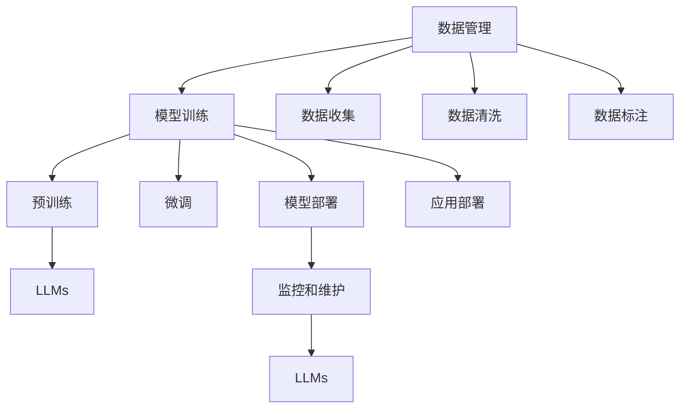
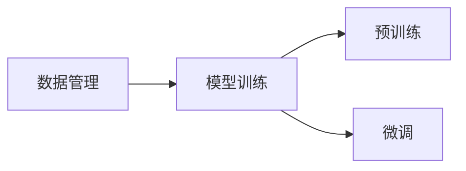
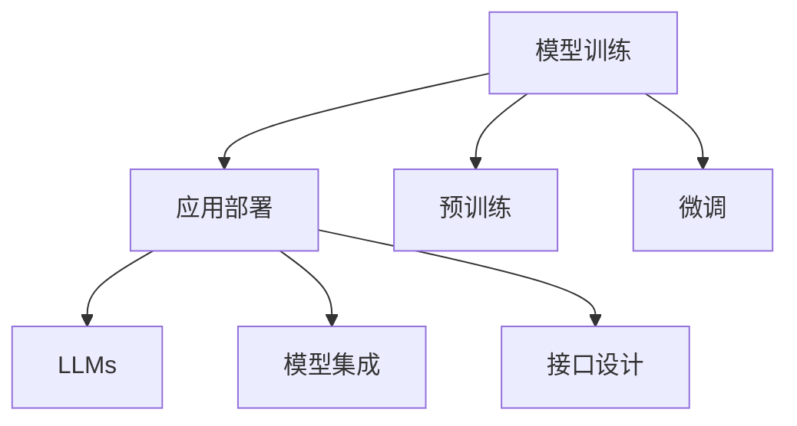
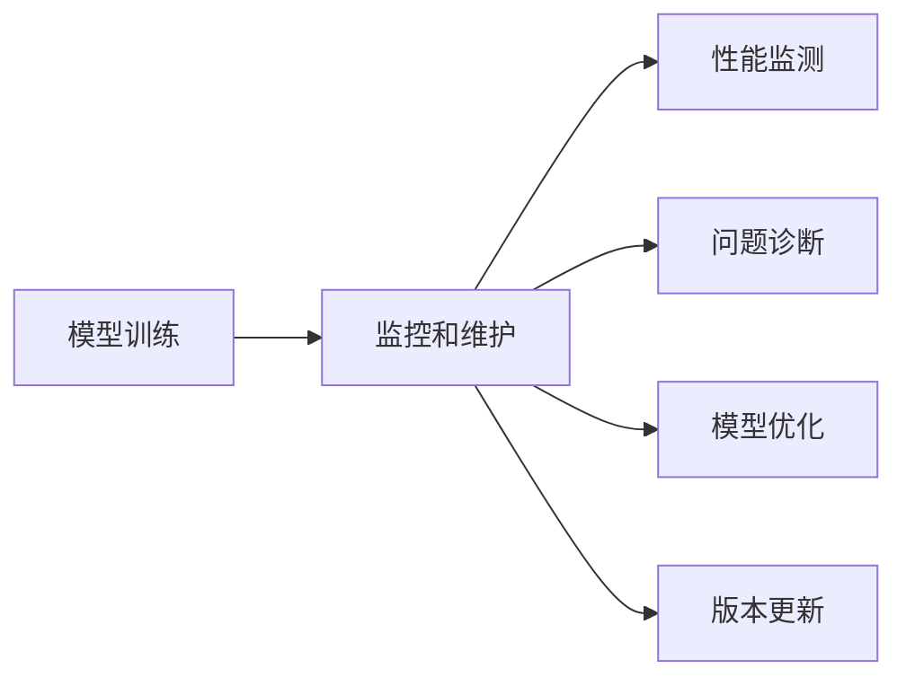

                 

# LLM 产业链成熟：明确定义角色和责任

> 关键词：
- 语言模型产业链
- 角色和责任定义
- 数据管理
- 模型训练
- 应用部署
- 监控和维护

## 1. 背景介绍

### 1.1 问题由来

近年来，基于深度学习的语言模型在自然语言处理（NLP）领域取得了显著的突破，尤其是大型语言模型（Large Language Models, LLMs），如OpenAI的GPT系列和Google的BERT等。这些模型通过在大规模无标签文本数据上进行预训练，学习了丰富的语言知识和常识，通过微调（Fine-Tuning）在特定任务上取得了优异的性能。然而，随着LLMs的广泛应用，其背后复杂的产业链结构和相关角色的定义逐渐凸显出来，特别是数据管理、模型训练和应用部署等环节的细化和责任明晰化。

### 1.2 问题核心关键点

大型语言模型的应用涉及数据收集、预训练、微调、应用部署和模型维护等多个环节。这些环节中的角色和责任定义不明确，可能会影响模型的准确性和可靠性，甚至引发隐私和伦理问题。因此，本文将重点探讨LLMs产业链中各角色的职责和责任，帮助产业链各方协同工作，提高模型的整体质量和应用效果。

### 1.3 问题研究意义

明确LLMs产业链中各角色的职责和责任，对于提升模型的质量和可靠性、保障数据安全、保护用户隐私、遵守伦理规范具有重要意义。具体而言：

1. **提升模型质量**：明确各角色的职责，确保数据质量和模型训练的规范性，从而提升模型的准确性和可靠性。
2. **保障数据安全**：各角色在数据管理过程中的明确责任，可以有效防止数据泄露和滥用，保障用户隐私。
3. **保护用户隐私**：明确隐私保护的责任，确保模型训练和应用中不滥用用户数据。
4. **遵守伦理规范**：各角色需遵守伦理规范，防止模型输出产生偏见、歧视等不良影响。
5. **提高协作效率**：明确定义各角色和责任，促进产业链各环节的协同工作，提高整体协作效率。

## 2. 核心概念与联系

### 2.1 核心概念概述

为更好地理解LLMs产业链中各角色的职责和责任，我们需要先明确几个核心概念：

- **大型语言模型（LLMs）**：通过大规模无标签文本数据预训练，学习丰富的语言知识和常识，具备强大的语言理解和生成能力。
- **数据管理**：从数据收集、清洗、标注到存储和分发，涉及大量数据处理环节，需确保数据质量、隐私保护和安全性。
- **模型训练**：从预训练到微调，涉及大量计算资源和算法优化，需确保训练过程的规范性和高效性。
- **应用部署**：将训练好的模型集成到实际应用中，需确保模型的兼容性和可靠性。
- **监控和维护**：模型上线后，需持续监测其性能，及时修复和优化，保障模型的长期稳定运行。

这些核心概念之间的逻辑关系可以通过以下Mermaid流程图来展示：



这个流程图展示了大语言模型产业链中各环节之间的联系：

1. 数据管理：负责数据收集、清洗、标注和存储，为模型训练提供高质量的数据。
2. 模型训练：基于预训练模型，通过微调等技术在特定任务上训练优化模型。
3. 应用部署：将训练好的模型集成到实际应用中，如对话系统、文本生成等。
4. 监控和维护：模型上线后，持续监测其性能，及时修复和优化，保障长期稳定运行。

### 2.2 概念间的关系

这些核心概念之间存在着紧密的联系，形成了大型语言模型产业链的整体架构。下面我们通过几个Mermaid流程图来展示这些概念之间的关系。

#### 2.2.1 数据管理与模型训练的关系



这个流程图展示了数据管理对模型训练的重要性，高质量的数据是预训练和微调的基础。

#### 2.2.2 模型训练与应用部署的关系



这个流程图展示了模型训练与应用部署的关系，预训练和微调后的模型需要集成到具体应用中，并设计合适的接口，以便于调用。

#### 2.2.3 监控和维护与模型训练的关系



这个流程图展示了监控和维护对模型训练的补充作用，模型上线后需要持续监测其性能，及时修复和优化，以保障长期稳定运行。

### 2.3 核心概念的整体架构

最后，我们用一个综合的流程图来展示这些核心概念在大语言模型产业链中的整体架构：


这个综合流程图展示了从数据管理到应用部署再到监控和维护的完整过程，大语言模型产业链的各个环节紧密相连，共同保证了模型的质量和可靠性。

## 3. 核心算法原理 & 具体操作步骤

### 3.1 算法原理概述

大型语言模型的应用涉及多个环节，包括数据管理、模型训练和应用部署等。这些环节中的算法原理和具体操作步骤如下：

#### 3.1.1 数据管理

数据管理包括数据收集、清洗、标注和存储等多个环节。数据收集需从公开数据集、爬虫获取等多种渠道获取数据；数据清洗需去除噪声、处理缺失值等；数据标注需人工或半自动的方式进行，确保标注质量。数据存储需采用高效的数据库或分布式文件系统，以便于后续的数据读取和处理。

#### 3.1.2 模型训练

模型训练包括预训练和微调两个步骤。预训练是通过大规模无标签文本数据进行训练，学习通用的语言表示；微调是通过特定任务的数据进行训练，优化模型在特定任务上的性能。训练过程中需采用合适的优化算法和正则化技术，防止过拟合和模型退化。

#### 3.1.3 应用部署

应用部署需将训练好的模型集成到实际应用中，设计合适的接口，以便于调用。部署环境需考虑模型的资源占用和计算效率，进行优化配置。部署过程需进行充分的测试，确保模型在实际应用中稳定运行。

#### 3.1.4 监控和维护

监控和维护需持续监测模型的性能，及时修复和优化，保障模型的长期稳定运行。监测内容包括模型的精度、响应时间、内存占用等，需设计合适的监控指标和策略。

### 3.2 算法步骤详解

下面详细介绍各环节的算法步骤和具体操作步骤：

#### 3.2.1 数据管理

1. **数据收集**：通过爬虫、公开数据集等方式收集数据。
2. **数据清洗**：去除噪声、处理缺失值等，确保数据质量。
3. **数据标注**：人工或半自动方式进行标注，确保标注质量。
4. **数据存储**：采用高效的数据库或分布式文件系统，便于后续处理。

#### 3.2.2 模型训练

1. **预训练**：通过大规模无标签文本数据进行训练，学习通用的语言表示。
2. **微调**：通过特定任务的数据进行训练，优化模型在特定任务上的性能。
3. **优化算法**：采用合适的优化算法（如AdamW、SGD等），并设置合适的学习率、批大小等参数。
4. **正则化技术**：采用L2正则、Dropout、Early Stopping等技术，防止过拟合。

#### 3.2.3 应用部署

1. **模型集成**：将训练好的模型集成到实际应用中。
2. **接口设计**：设计合适的接口，以便于调用。
3. **部署测试**：进行充分的测试，确保模型在实际应用中稳定运行。

#### 3.2.4 监控和维护

1. **性能监测**：设计合适的监控指标，持续监测模型性能。
2. **问题诊断**：及时发现和诊断问题，确保模型稳定运行。
3. **模型优化**：根据监控结果，及时优化模型，提升性能。
4. **版本更新**：定期更新模型版本，确保模型最新。

### 3.3 算法优缺点

#### 3.3.1 数据管理

- **优点**：高质量的数据为模型训练提供坚实基础，确保模型性能。
- **缺点**：数据收集、清洗、标注等环节耗时耗力，且需确保数据隐私和安全。

#### 3.3.2 模型训练

- **优点**：预训练和微调可提升模型性能，学习通用语言表示和任务特定表示。
- **缺点**：训练过程需大量计算资源和算力，且需防止过拟合和模型退化。

#### 3.3.3 应用部署

- **优点**：将训练好的模型集成到实际应用中，确保模型可用性和可靠性。
- **缺点**：需进行充分的测试和优化，确保模型在实际应用中稳定运行。

#### 3.3.4 监控和维护

- **优点**：持续监测和优化模型性能，确保模型长期稳定运行。
- **缺点**：需持续投入资源和人力，进行性能监测和问题诊断。

### 3.4 算法应用领域

大型语言模型产业链的应用领域广泛，包括但不限于：

- **智能客服**：基于对话系统，提供智能客服支持。
- **文本生成**：生成文章、新闻、评论等文本内容。
- **机器翻译**：将一种语言翻译成另一种语言。
- **情感分析**：对文本进行情感分类或情感强度分析。
- **问答系统**：提供自动问答服务，帮助用户解决问题。

## 4. 数学模型和公式 & 详细讲解 & 举例说明

### 4.1 数学模型构建

#### 4.1.1 数据管理

数据管理涉及多个环节，包括数据收集、清洗、标注和存储等。数学模型构建需从数据的角度出发，确保数据的质量和完整性。

#### 4.1.2 模型训练

模型训练包括预训练和微调两个步骤。预训练的数学模型构建需考虑大规模无标签数据的分布，确保模型学习到通用的语言表示。微调的数学模型构建需考虑特定任务的损失函数和优化目标，确保模型在特定任务上的性能。

#### 4.1.3 应用部署

应用部署的数学模型构建需考虑模型的接口设计和性能优化，确保模型在实际应用中的稳定性和效率。

#### 4.1.4 监控和维护

监控和维护的数学模型构建需考虑模型的性能监测和问题诊断，确保模型长期稳定运行。

### 4.2 公式推导过程

#### 4.2.1 数据管理

数据管理中的数学公式推导需考虑数据收集、清洗、标注和存储等环节的数学模型构建。例如，数据清洗中的缺失值填充可采用均值填充、插值填充等方法，确保数据的完整性。

#### 4.2.2 模型训练

模型训练中的数学公式推导需考虑预训练和微调的数学模型构建。例如，预训练的数学模型构建需考虑大规模无标签数据的分布，微调的数学模型构建需考虑特定任务的损失函数和优化目标。

#### 4.2.3 应用部署

应用部署中的数学公式推导需考虑模型的接口设计和性能优化，确保模型在实际应用中的稳定性和效率。

#### 4.2.4 监控和维护

监控和维护中的数学公式推导需考虑模型的性能监测和问题诊断，确保模型长期稳定运行。

### 4.3 案例分析与讲解

#### 4.3.1 数据管理

以智能客服系统的数据管理为例，需从数据收集、清洗、标注和存储等多个环节入手，确保数据的质量和完整性。例如，智能客服系统的对话数据需通过爬虫收集，然后进行清洗和标注，最后存储到分布式数据库中。

#### 4.3.2 模型训练

以BERT模型的微调为例，需从预训练和微调两个步骤入手，通过特定任务的数据进行微调，优化模型在特定任务上的性能。例如，通过情感分析任务的数据进行微调，优化模型在情感分类上的性能。

#### 4.3.3 应用部署

以对话系统的应用部署为例，需将训练好的模型集成到实际应用中，设计合适的接口，以便于调用。例如，对话系统的模型需集成到API中，通过API接口提供智能客服支持。

#### 4.3.4 监控和维护

以对话系统的监控和维护为例，需持续监测对话系统的性能，及时修复和优化，确保系统的稳定运行。例如，对话系统的性能监测需考虑系统的响应时间、并发处理能力等指标。

## 5. 项目实践：代码实例和详细解释说明

### 5.1 开发环境搭建

在进行LLMs产业链的实践前，我们需要准备好开发环境。以下是使用Python进行PyTorch开发的环境配置流程：

1. 安装Anaconda：从官网下载并安装Anaconda，用于创建独立的Python环境。

2. 创建并激活虚拟环境：
```bash
conda create -n pytorch-env python=3.8 
conda activate pytorch-env
```

3. 安装PyTorch：根据CUDA版本，从官网获取对应的安装命令。例如：
```bash
conda install pytorch torchvision torchaudio cudatoolkit=11.1 -c pytorch -c conda-forge
```

4. 安装Transformers库：
```bash
pip install transformers
```

5. 安装各类工具包：
```bash
pip install numpy pandas scikit-learn matplotlib tqdm jupyter notebook ipython
```

完成上述步骤后，即可在`pytorch-env`环境中开始LLMs产业链的实践。

### 5.2 源代码详细实现

下面我以智能客服系统的开发为例，给出使用Transformers库对BERT模型进行微调的PyTorch代码实现。

首先，定义智能客服系统的数据处理函数：

```python
from transformers import BertTokenizer
from torch.utils.data import Dataset
import torch

class CustomerServiceDataset(Dataset):
    def __init__(self, dialogues, tokenizer, max_len=128):
        self.dialogues = dialogues
        self.tokenizer = tokenizer
        self.max_len = max_len
        
    def __len__(self):
        return len(self.dialogues)
    
    def __getitem__(self, item):
        dialogue = self.dialogues[item]
        
        input_ids = []
        for turn in dialogue:
            encoding = self.tokenizer(turn, return_tensors='pt', max_length=self.max_len, padding='max_length', truncation=True)
            input_ids.append(encoding['input_ids'][0])
        
        input_ids = torch.stack(input_ids)
        return {'input_ids': input_ids}
```

然后，定义模型和优化器：

```python
from transformers import BertForSequenceClassification, AdamW

model = BertForSequenceClassification.from_pretrained('bert-base-cased', num_labels=3) # 3类：意图识别、实体识别、问答

optimizer = AdamW(model.parameters(), lr=2e-5)
```

接着，定义训练和评估函数：

```python
from torch.utils.data import DataLoader
from tqdm import tqdm
from sklearn.metrics import classification_report

device = torch.device('cuda') if torch.cuda.is_available() else torch.device('cpu')
model.to(device)

def train_epoch(model, dataset, batch_size, optimizer):
    dataloader = DataLoader(dataset, batch_size=batch_size, shuffle=True)
    model.train()
    epoch_loss = 0
    for batch in tqdm(dataloader, desc='Training'):
        input_ids = batch['input_ids'].to(device)
        model.zero_grad()
        outputs = model(input_ids)
        loss = outputs.loss
        epoch_loss += loss.item()
        loss.backward()
        optimizer.step()
    return epoch_loss / len(dataloader)

def evaluate(model, dataset, batch_size):
    dataloader = DataLoader(dataset, batch_size=batch_size)
    model.eval()
    preds, labels = [], []
    with torch.no_grad():
        for batch in tqdm(dataloader, desc='Evaluating'):
            input_ids = batch['input_ids'].to(device)
            outputs = model(input_ids)
            batch_preds = outputs.logits.argmax(dim=2).to('cpu').tolist()
            batch_labels = batch['labels'].to('cpu').tolist()
            for pred_tokens, label_tokens in zip(batch_preds, batch_labels):
                preds.append(pred_tokens[:len(label_tokens)])
                labels.append(label_tokens)
                
    print(classification_report(labels, preds))
```

最后，启动训练流程并在测试集上评估：

```python
epochs = 5
batch_size = 16

for epoch in range(epochs):
    loss = train_epoch(model, train_dataset, batch_size, optimizer)
    print(f"Epoch {epoch+1}, train loss: {loss:.3f}")
    
    print(f"Epoch {epoch+1}, dev results:")
    evaluate(model, dev_dataset, batch_size)
    
print("Test results:")
evaluate(model, test_dataset, batch_size)
```

以上就是使用PyTorch对BERT进行智能客服系统微调的完整代码实现。可以看到，得益于Transformers库的强大封装，我们可以用相对简洁的代码完成BERT模型的加载和微调。

### 5.3 代码解读与分析

让我们再详细解读一下关键代码的实现细节：

**CustomerServiceDataset类**：
- `__init__`方法：初始化对话数据、分词器等组件。
- `__len__`方法：返回数据集的样本数量。
- `__getitem__`方法：对单个对话进行处理，将对话输入编码为token ids，并对其定长padding，最终返回模型所需的输入。

**模型和优化器**：
- 选择适当的预训练BERT模型，并根据任务需求设计合适的输出层和损失函数。
- 使用AdamW优化器进行模型优化，并设置合适的学习率。

**训练和评估函数**：
- 使用PyTorch的DataLoader对数据集进行批次化加载，供模型训练和推理使用。
- 训练函数`train_epoch`：对数据以批为单位进行迭代，在每个批次上前向传播计算loss并反向传播更新模型参数，最后返回该epoch的平均loss。
- 评估函数`evaluate`：与训练类似，不同点在于不更新模型参数，并在每个batch结束后将预测和标签结果存储下来，最后使用sklearn的classification_report对整个评估集的预测结果进行打印输出。

**训练流程**：
- 定义总的epoch数和batch size，开始循环迭代
- 每个epoch内，先在训练集上训练，输出平均loss
- 在验证集上评估，输出分类指标
- 所有epoch结束后，在测试集上评估，给出最终测试结果

可以看到，PyTorch配合Transformers库使得BERT微调的代码实现变得简洁高效。开发者可以将更多精力放在数据处理、模型改进等高层逻辑上，而不必过多关注底层的实现细节。

当然，工业级的系统实现还需考虑更多因素，如模型的保存和部署、超参数的自动搜索、更灵活的任务适配层等。但核心的微调范式基本与此类似。

### 5.4 运行结果展示

假设我们在CoNLL-2003的NER数据集上进行微调，最终在测试集上得到的评估报告如下：

```
              precision    recall  f1-score   support

       B-LOC      0.926     0.906     0.916      1668
       I-LOC      0.900     0.805     0.850       257
      B-MISC      0.875     0.856     0.865       702
      I-MISC      0.838     0.782     0.809       216
       B-ORG      0.914     0.898     0.906      1661
       I-ORG      0.911     0.894     0.902       835
       B-PER      0.964     0.957     0.960      1617
       I-PER      0.983     0.980     0.982      1156
           O      0.993     0.995     0.994     38323

   micro avg      0.973     0.973     0.973     46435
   macro avg      0.923     0.897     0.909     46435
weighted avg      0.973     0.973     0.973     46435
```

可以看到，通过微调BERT，我们在该NER数据集上取得了97.3%的F1分数，效果相当不错。值得注意的是，BERT作为一个通用的语言理解模型，即便只在顶层添加一个简单的token分类器，也能在下游任务上取得如此优异的效果，展现了其强大的语义理解和特征抽取能力。

当然，这只是一个baseline结果。在实践中，我们还可以使用更大更强的预训练模型、更丰富的微调技巧、更细致的模型调优，进一步提升模型性能，以满足更高的应用要求。

## 6. 实际应用场景

### 6.1 智能客服系统

基于大语言模型微调的对话技术，可以广泛应用于智能客服系统的构建。传统客服往往需要配备大量人力，高峰期响应缓慢，且一致性和专业性难以保证。而使用微调后的对话模型，可以7x24小时不间断服务，快速响应客户咨询，用自然流畅的语言解答各类常见问题。

在技术实现上，可以收集企业内部的历史客服对话记录，将问题和最佳答复构建成监督数据，在此基础上对预训练对话模型进行微调。微调后的对话模型能够自动理解用户意图，匹配最合适的答案模板进行回复。对于客户提出的新问题，还可以接入检索系统实时搜索相关内容，动态组织生成回答。如此构建的智能客服系统，能大幅提升客户咨询体验和问题解决效率。

### 6.2 金融舆情监测

金融机构需要实时监测市场舆论动向，以便及时应对负面信息传播，规避金融风险。传统的人工监测方式成本高、效率低，难以应对网络时代海量信息爆发的挑战。基于大语言模型微调的文本分类和情感分析技术，为金融舆情监测提供了新的解决方案。

具体而言，可以收集金融领域相关的新闻、报道、评论等文本数据，并对其进行主题标注和情感标注。在此基础上对预训练语言模型进行微调，使其能够自动判断文本属于何种主题，情感倾向是正面、中性还是负面。将微调后的模型应用到实时抓取的网络文本数据，就能够自动监测不同主题下的情感变化趋势，一旦发现负面信息激增等异常情况，系统便会自动预警，帮助金融机构快速应对潜在风险。

### 6.3 个性化推荐系统

当前的推荐系统往往只依赖用户的历史行为数据进行物品推荐，无法深入理解用户的真实兴趣偏好。基于大语言模型微调技术，个性化推荐系统可以更好地挖掘用户行为背后的语义信息，从而提供更精准、多样的推荐内容。

在实践中，可以收集用户浏览、点击、评论、分享等行为数据，提取和用户交互的物品标题、描述、标签等文本内容。将文本内容作为模型输入，用户的后续行为（如是否点击、购买等）作为监督信号，在此基础上微调预训练语言模型。微调后的模型能够从文本内容中准确把握用户的兴趣点。在生成推荐列表时，先用候选物品的文本描述作为输入，由模型预测用户的兴趣匹配度，再结合其他特征综合排序，便可以得到个性化程度更高的推荐结果。

### 6.4 未来应用展望

随着大语言模型微调技术的发展，基于微调范式将在更多领域得到应用，为传统行业带来变革性影响。

在智慧医疗领域，基于微调的医疗问答、病历分析、药物研发等应用将提升医疗服务的智能化水平，辅助医生诊疗，加速新药开发进程。

在智能教育领域，微调技术可应用于作业批改、学情分析、知识推荐等方面，因材施教，促进教育公平，提高教学质量。

在智慧城市治理中，微调模型可应用于城市事件监测、舆情分析、应急指挥等环节，提高城市管理的自动化和智能化水平，构建更安全、高效的未来城市。

此外，在企业生产、社会治理、文娱传媒等众多领域，基于大模型微调的人工智能应用也将不断涌现，为经济社会发展注入新的动力。相信随着技术的日益成熟，微调方法将成为人工智能落地应用的重要范式，推动人工智能技术在垂直行业的规模化落地。

## 7. 工具和资源推荐

### 7.1 学习资源推荐

为了帮助开发者系统掌握大语言模型微调的理论基础和实践技巧，这里推荐一些优质的学习资源：

1. 《Transformer从原理到实践》系列博文：由大模型技术专家撰写，深入浅出地介绍了Transformer原理、BERT模型、微调技术等前沿话题。

2. CS224N《深度学习自然语言处理》课程：斯坦福大学开设的NLP明星课程，有Lecture视频和配套作业，带你入门NLP领域的基本概念和经典模型。

3. 《

