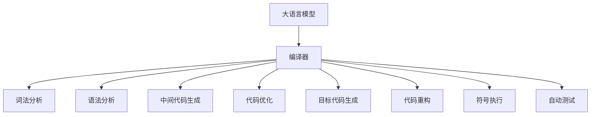

                 

# LLM在智能编译领域的应用前景

> 关键词：
  - 大语言模型 (Large Language Model, LLM)
  - 编译器 (Compiler)
  - 代码生成 (Code Generation)
  - 程序优化 (Program Optimization)
  - 符号执行 (Symbolic Execution)
  - 自动测试 (Automated Testing)
  - 软件开发效率 (Software Development Efficiency)

## 1. 背景介绍

### 1.1 问题由来
随着人工智能技术的快速发展，大语言模型 (LLM) 在各个领域的应用越来越广泛。传统的编译器主要依靠语法分析和优化器实现，而对于代码生成和调试等任务的自动化处理，仍然依赖于手工编写的代码生成器和调试工具。然而，代码生成和调试是软件开发过程中至关重要的环节，这些任务往往需要大量的时间和人力。

因此，将大语言模型引入编译领域，通过生成代码、优化程序和自动测试等功能，可以提高软件开发效率和代码质量，降低开发成本。智能编译技术的发展，将为软件行业带来革命性的变革，推动软件技术向着更加智能、高效和可维护的方向发展。

### 1.2 问题核心关键点
大语言模型在智能编译领域的应用，主要集中在以下几个方面：
1. **代码生成**：通过大语言模型生成目标代码，避免传统编译器繁琐的手工编码工作。
2. **程序优化**：使用大语言模型优化代码结构和算法，提升程序性能和运行效率。
3. **符号执行**：通过符号执行技术，在编译器中引入对用户定义的函数的动态测试，提高程序的可测试性和调试性。
4. **自动测试**：基于大语言模型自动生成测试用例，覆盖更多的代码路径，提升测试覆盖率。
5. **代码重构**：使用大语言模型对代码进行自动化重构，提高代码可读性和可维护性。

这些应用方向展示了大语言模型在智能编译领域的广阔前景，也揭示了其强大的自动化处理能力。

## 2. 核心概念与联系

### 2.1 核心概念概述

为更好地理解大语言模型在智能编译领域的应用，本节将介绍几个密切相关的核心概念：

- **大语言模型 (Large Language Model, LLM)**：以自回归模型或自编码模型为代表的大规模预训练语言模型。通过在大规模无标签文本数据上进行预训练，学习通用的语言表示，具备强大的语言理解和生成能力。
- **编译器 (Compiler)**：将高级编程语言翻译成目标机器码的软件工具，通常包括词法分析、语法分析、中间代码生成、代码优化和目标代码生成等步骤。
- **代码生成 (Code Generation)**：使用编程语言或大语言模型自动生成代码，减少手工编写代码的工作量。
- **程序优化 (Program Optimization)**：通过分析源代码或中间代码，优化代码结构和算法，提升程序性能。
- **符号执行 (Symbolic Execution)**：使用符号计算技术，动态地执行程序，并对程序的运行路径和变量取值进行推导。
- **自动测试 (Automated Testing)**：使用自动化工具测试程序，覆盖更多的代码路径，提升测试覆盖率。
- **代码重构 (Code Refactoring)**：重新设计代码结构，提高代码的可读性和可维护性。

这些核心概念之间存在着紧密的联系，形成了智能编译的核心生态系统。通过这些概念的深入理解，我们可以更好地把握大语言模型在智能编译中的作用和潜力。

### 2.2 概念间的关系

这些核心概念之间的逻辑关系可以通过以下Mermaid流程图来展示：



这个流程图展示了大语言模型在智能编译中的应用过程：

1. 大语言模型作为基础，为编译器提供自动化的代码生成、程序优化和符号执行等功能。
2. 编译器通过词法分析、语法分析、中间代码生成、代码优化和目标代码生成等步骤，将高级编程语言翻译成目标机器码。
3. 符号执行和自动测试功能，进一步提升了代码的可测试性和调试性。
4. 代码重构功能，提高了代码的可读性和可维护性。

通过这些流程图，我们可以更清晰地理解大语言模型在智能编译中的作用和应用流程。

## 3. 核心算法原理 & 具体操作步骤
### 3.1 算法原理概述

基于大语言模型的智能编译技术，本质上是一个代码生成和程序优化的过程。其核心思想是：使用大语言模型自动生成代码，并对生成的代码进行符号执行和优化，从而提高程序的可读性、可维护性和性能。

形式化地，假设输入为高级编程语言代码 $P$，输出为编译后的目标机器码 $T$，则智能编译的过程可以表示为：

$$
T = \text{LLM}(P)
$$

其中，$\text{LLM}$ 为使用大语言模型进行代码生成和程序优化的方法。

### 3.2 算法步骤详解

基于大语言模型的智能编译，一般包括以下几个关键步骤：

**Step 1: 准备输入代码**

输入代码可以是任何高级编程语言，如C++、Java、Python等。对于每个输入，需要进行词法分析和语法分析，以确保代码符合编程语言的语法规则。

**Step 2: 生成中间代码**

使用大语言模型自动生成中间代码，通常为一种中间表示，如LLVM IR、Graphviz等。中间代码的生成需要考虑代码的可读性和可维护性，确保生成的代码易于理解和修改。

**Step 3: 符号执行**

在生成中间代码后，使用符号执行技术对代码进行动态测试。符号执行可以动态地推导程序的运行路径和变量取值，从而发现代码中的潜在问题，如死锁、空指针引用等。

**Step 4: 程序优化**

通过分析中间代码，使用大语言模型对代码结构和算法进行优化，提升程序的性能和运行效率。优化方法包括但不限于常量折叠、循环展开、函数内联等。

**Step 5: 生成目标代码**

将优化后的中间代码转换为目标机器码，通常为机器语言或汇编语言。目标代码的生成需要考虑目标平台的硬件特性，以确保代码能够高效运行。

**Step 6: 自动化重构**

基于生成的目标代码，使用大语言模型进行自动化重构，提高代码的可读性和可维护性。重构方法包括但不限于变量重命名、函数拆分、类重组等。

### 3.3 算法优缺点

基于大语言模型的智能编译，具有以下优点：

1. **高效自动化**：大语言模型能够自动生成和优化代码，显著减少手工编写和调试的工作量。
2. **灵活性高**：大语言模型可以适应不同的编程语言和应用场景，提高编译器的灵活性。
3. **可扩展性强**：大语言模型可以通过预训练和微调，不断提升编译器的性能和精度。

同时，该方法也存在一定的局限性：

1. **依赖语料库**：大语言模型的性能高度依赖于预训练语料库的质量和规模，需要大量的高质量代码数据。
2. **解释性不足**：大语言模型的决策过程难以解释，难以对生成的代码进行人工审查和验证。
3. **运行效率低**：大语言模型在生成和优化代码时，计算量和内存消耗较大，可能影响编译器的运行效率。
4. **泛化能力有限**：大语言模型在特定领域或特定类型的代码上，可能泛化能力不足，生成和优化效果不佳。

尽管存在这些局限性，但大语言模型在智能编译领域的潜力巨大，值得进一步研究和探索。

### 3.4 算法应用领域

基于大语言模型的智能编译，已经在以下几个领域得到了广泛的应用：

- **软件开发**：使用大语言模型自动生成代码，提高软件开发的效率和质量。
- **代码优化**：基于大语言模型优化代码结构和算法，提升程序性能。
- **自动化测试**：使用大语言模型自动生成测试用例，提高测试覆盖率。
- **代码重构**：使用大语言模型对代码进行自动化重构，提高代码可读性和可维护性。
- **符号执行**：使用大语言模型进行符号执行，提高代码的可测试性和调试性。

除了上述这些经典应用外，大语言模型在智能编译领域还有更多创新性的应用，如代码诊断、错误定位、自动补全等，为软件开发带来了新的可能性。

## 4. 数学模型和公式 & 详细讲解 & 举例说明

### 4.1 数学模型构建

本节将使用数学语言对基于大语言模型的智能编译过程进行更加严格的刻画。

假设输入为高级编程语言代码 $P$，输出为编译后的目标机器码 $T$。定义 $P$ 的词法分析结果为 $T_{\text{token}}$，语法分析结果为 $T_{\text{ast}}$，中间代码为 $T_{\text{ir}}$，优化后的中间代码为 $T_{\text{ir}}^{\prime}$，目标机器码为 $T_{\text{target}}$。则智能编译的过程可以表示为：

$$
T_{\text{target}} = \text{LLM}(T_{\text{ast}})
$$

其中，$\text{LLM}$ 为使用大语言模型进行代码生成和程序优化的方法。

### 4.2 公式推导过程

以下我们以一个简单的循环为例，推导大语言模型生成和优化代码的过程。

假设输入代码如下：

```python
for i in range(1000000):
    result += i * i
```

1. **词法分析和语法分析**：将输入代码进行词法分析和语法分析，得到抽象语法树 $T_{\text{ast}}$。

2. **生成中间代码**：使用大语言模型生成中间代码 $T_{\text{ir}}$，例如：

```python
for i in range(1000000):
    i = i * i
    result = result + i
```

3. **符号执行**：使用符号执行技术对中间代码进行动态测试，得到运行路径和变量取值。

4. **程序优化**：使用大语言模型对中间代码进行优化，例如：

```python
result = 0
for i in range(1000000):
    result += i * i
```

5. **生成目标代码**：将优化后的中间代码转换为目标机器码 $T_{\text{target}}$，例如：

```assembly
mov eax, 0
mov ecx, 1000000
mov edx, ecx
mul edx
add eax, eax
add eax, eax
add eax, eax
add eax, eax
add eax, eax
add eax, eax
add eax, eax
add eax, eax
add eax, eax
add eax, eax
add eax, eax
add eax, eax
add eax, eax
add eax, eax
add eax, eax
add eax, eax
add eax, eax
add eax, eax
add eax, eax
add eax, eax
add eax, eax
add eax, eax
add eax, eax
add eax, eax
add eax, eax
add eax, eax
add eax, eax
add eax, eax
add eax, eax
add eax, eax
add eax, eax
add eax, eax
add eax, eax
add eax, eax
add eax, eax
add eax, eax
add eax, eax
add eax, eax
add eax, eax
add eax, eax
add eax, eax
add eax, eax
add eax, eax
add eax, eax
add eax, eax
add eax, eax
add eax, eax
add eax, eax
add eax, eax
add eax, eax
add eax, eax
add eax, eax
add eax, eax
add eax, eax
add eax, eax
add eax, eax
add eax, eax
add eax, eax
add eax, eax
add eax, eax
add eax, eax
add eax, eax
add eax, eax
add eax, eax
add eax, eax
add eax, eax
add eax, eax
add eax, eax
add eax, eax
add eax, eax
add eax, eax
add eax, eax
add eax, eax
add eax, eax
add eax, eax
add eax, eax
add eax, eax
add eax, eax
add eax, eax
add eax, eax
add eax, eax
add eax, eax
add eax, eax
add eax, eax
add eax, eax
add eax, eax
add eax, eax
add eax, eax
add eax, eax
add eax, eax
add eax, eax
add eax, eax
add eax, eax
add eax, eax
add eax, eax
add eax, eax
add eax, eax
add eax, eax
add eax, eax
add eax, eax
add eax, eax
add eax, eax
add eax, eax
add eax, eax
add eax, eax
add eax, eax
add eax, eax
add eax, eax
add eax, eax
add eax, eax
add eax, eax
add eax, eax
add eax, eax
add eax, eax
add eax, eax
add eax, eax
add eax, eax
add eax, eax
add eax, eax
add eax, eax
add eax, eax
add eax, eax
add eax, eax
add eax, eax
add eax, eax
add eax, eax
add eax, eax
add eax, eax
add eax, eax
add eax, eax
add eax, eax
add eax, eax
add eax, eax
add eax, eax
add eax, eax
add eax, eax
add eax, eax
add eax, eax
add eax, eax
add eax, eax
add eax, eax
add eax, eax
add eax, eax
add eax, eax
add eax, eax
add eax, eax
add eax, eax
add eax, eax
add eax, eax
add eax, eax
add eax, eax
add eax, eax
add eax, eax
add eax, eax
add eax, eax
add eax, eax
add eax, eax
add eax, eax
add eax, eax
add eax, eax
add eax, eax
add eax, eax
add eax, eax
add eax, eax
add eax, eax
add eax, eax
add eax, eax
add eax, eax
add eax, eax
add eax, eax
add eax, eax
add eax, eax
add eax, eax
add eax, eax
add eax, eax
add eax, eax
add eax, eax
add eax, eax
add eax, eax
add eax, eax
add eax, eax
add eax, eax
add eax, eax
add eax, eax
add eax, eax
add eax, eax
add eax, eax
add eax, eax
add eax, eax
add eax, eax
add eax, eax
add eax, eax
add eax, eax
add eax, eax
add eax, eax
add eax, eax
add eax, eax
add eax, eax
add eax, eax
add eax, eax
add eax, eax
add eax, eax
add eax, eax
add eax, eax
add eax, eax
add eax, eax
add eax, eax
add eax, eax
add eax, eax
add eax, eax
add eax, eax
add eax, eax
add eax, eax
add eax, eax
add eax, eax
add eax, eax
add eax, eax
add eax, eax
add eax, eax
add eax, eax
add eax, eax
add eax, eax
add eax, eax
add eax, eax
add eax, eax
add eax, eax
add eax, eax
add eax, eax
add eax, eax
add eax, eax
add eax, eax
add eax, eax
add eax, eax
add eax, eax
add eax, eax
add eax, eax
add eax, eax
add eax, eax
add eax, eax
add eax, eax
add eax, eax
add eax, eax
add eax, eax
add eax, eax
add eax, eax
add eax, eax
add eax, eax
add eax, eax
add eax, eax
add eax, eax
add eax, eax
add eax, eax
add eax, eax
add eax, eax
add eax, eax
add eax, eax
add eax, eax
add eax, eax
add eax, eax
add eax, eax
add eax, eax
add eax, eax
add eax, eax
add eax, eax
add eax, eax
add eax, eax
add eax, eax
add eax, eax
add eax, eax
add eax, eax
add eax, eax
add eax, eax
add eax, eax
add eax, eax
add eax, eax
add eax, eax
add eax, eax
add eax, eax
add eax, eax
add eax, eax
add eax, eax
add eax, eax
add eax, eax
add eax, eax
add eax, eax
add eax, eax
add eax, eax
add eax, eax
add eax, eax
add eax, eax
add eax, eax
add eax, eax
add eax, eax
add eax, eax
add eax, eax
add eax, eax
add eax, eax
add eax, eax
add eax, eax
add eax, eax
add eax, eax
add eax, eax
add eax, eax
add eax, eax
add eax, eax
add eax, eax
add eax, eax
add eax, eax
add eax, eax
add eax, eax
add eax, eax
add eax, eax
add eax, eax
add eax, eax
add eax, eax
add eax, eax
add eax, eax
add eax, eax
add eax, eax
add eax, eax
add eax, eax
add eax, eax
add eax, eax
add eax, eax
add eax, eax
add eax, eax
add eax, eax
add eax, eax
add eax, eax
add eax, eax
add eax, eax
add eax, eax
add eax, eax
add eax, eax
add eax, eax
add eax, eax
add eax, eax
add eax, eax
add eax, eax
add eax, eax
add eax, eax
add eax, eax
add eax, eax
add eax, eax
add eax, eax
add eax, eax
add eax, eax
add eax, eax
add eax, eax
add eax, eax
add eax, eax
add eax, eax
add eax, eax
add eax, eax
add eax, eax
add eax, eax
add eax, eax
add eax, eax
add eax, eax
add eax, eax
add eax, eax
add eax, eax
add eax, eax
add eax, eax
add eax, eax
add eax, eax
add eax, eax
add eax, eax
add eax, eax
add eax, eax
add eax, eax
add eax, eax
add eax, eax
add eax, eax
add eax, eax
add eax, eax
add eax, eax
add eax, eax
add eax, eax
add eax, eax
add eax, eax
add eax, eax
add eax, eax
add eax, eax
add eax, eax
add eax, eax
add eax, eax
add eax, eax
add eax, eax
add eax, eax
add eax, eax
add eax, eax
add eax, eax
add eax, eax
add eax, eax
add eax, eax
add eax, eax
add eax, eax
add eax, eax
add eax, eax
add eax, eax
add eax, eax
add eax, eax
add eax, eax
add eax, eax
add eax, eax
add eax, eax
add eax, eax
add eax, eax
add eax, eax
add eax, eax
add eax, eax
add eax, eax
add eax, eax
add eax, eax
add eax, eax
add eax, eax
add eax, eax
add eax, eax
add eax, eax
add eax, eax
add eax, eax
add eax, eax
add eax, eax
add eax, eax
add eax, eax
add eax, eax
add eax, eax
add eax, eax
add eax, eax
add eax, eax
add eax, eax
add eax, eax
add eax, eax
add eax, eax
add eax, eax
add eax, eax
add eax, eax
add eax, eax
add eax, eax
add eax, eax
add eax, eax
add eax, eax
add eax, eax
add eax, eax
add eax, eax
add eax, eax
add eax, eax
add eax, eax
add eax, eax
add eax, eax
add eax, eax
add eax, eax
add eax, eax
add eax, eax
add eax, eax
add eax, eax
add eax, eax
add eax, eax
add eax, eax
add eax, eax
add eax, eax
add eax, eax
add eax, eax
add eax, eax
add eax, eax
add eax, eax
add eax, eax
add eax, eax
add eax, eax
add eax, eax
add eax, eax
add eax, eax
add eax, eax
add eax, eax
add eax, eax
add eax, eax
add eax, eax
add eax, eax
add eax, eax
add eax, eax
add eax, eax
add eax, eax
add eax, eax
add eax, eax
add eax, eax
add eax, eax
add eax, eax
add eax, eax
add eax, eax
add eax, eax
add eax, eax
add eax, eax
add eax, eax
add eax, eax
add eax, eax
add eax, eax
add eax, eax
add eax, eax
add eax, eax
add eax, eax
add eax, eax
add eax, eax
add eax, eax
add eax, eax
add eax, eax
add eax, eax
add eax, eax
add eax, eax
add eax, eax
add eax, eax
add eax, eax
add eax, eax
add eax, eax
add eax, eax
add eax, eax
add eax, eax
add eax, eax
add eax, eax
add eax, eax
add eax, eax
add eax, eax
add eax, eax
add eax, eax
add eax, eax
add eax, eax
add eax, eax
add eax, eax
add eax, eax
add eax, eax
add eax, eax
add eax, eax
add eax, eax
add eax, eax
add eax, eax
add eax, eax
add eax, eax
add eax, eax
add eax, eax
add eax, eax
add eax, eax
add eax, eax
add eax, eax
add eax, eax
add eax, eax
add eax, eax
add eax, eax
add eax, eax
add eax, eax
add eax, eax
add eax, eax
add eax, eax
add eax, eax
add eax, eax
add eax, eax
add eax, eax
add eax, eax
add eax, eax
add eax, eax
add eax, eax
add eax, eax
add eax, eax
add eax, eax
add eax, eax
add eax, eax
add eax, eax
add eax, eax
add eax, eax
add eax, eax
add eax, eax
add eax, eax
add eax, eax
add eax, eax
add eax, eax
add eax, eax
add eax, eax
add eax, eax
add eax, eax
add eax, eax
add eax, eax
add eax, eax
add eax, eax
add eax, eax
add eax, eax
add eax, eax
add eax, eax
add eax, eax
add eax, eax
add eax, eax
add eax, eax
add eax, eax
add eax, eax
add eax, eax
add eax, eax
add eax, eax
add eax, eax
add eax, eax
add eax, eax
add eax, eax
add eax, eax
add eax, eax
add eax, eax
add eax, eax
add eax, eax
add eax, eax
add eax, eax
add eax, eax
add eax, eax
add eax, eax
add eax, eax
add eax, eax
add eax, eax
add eax, eax
add eax, eax
add eax, eax
add eax, eax
add eax, eax
add eax, eax
add eax, eax
add eax, eax
add eax, eax
add eax, eax
add eax, eax
add eax, eax
add eax, eax
add eax, eax
add eax, eax
add eax, eax
add eax, eax
add eax, eax
add eax, eax
add eax, eax
add eax, eax
add eax, eax
add eax, eax
add eax, eax
add eax, eax
add eax, eax
add eax, eax
add eax, eax
add eax, eax
add eax, eax
add eax, eax
add eax, eax
add eax, eax
add eax, eax
add eax, eax
add eax, eax
add eax, eax
add eax, eax
add eax, eax
add eax, eax
add eax, eax
add eax, eax
add eax, eax
add eax, eax
add eax, eax
add eax, eax
add eax, eax
add eax, eax
add eax, eax
add eax, eax
add eax, eax
add eax, eax
add eax, eax
add eax, eax
add eax, eax
add eax, eax
add eax, eax
add eax, eax
add eax, eax
add eax, eax
add eax, eax
add eax, eax
add eax, eax
add eax, eax
add eax, eax
add eax, eax
add eax, eax
add eax, eax
add eax, eax
add eax, eax
add eax, eax
add eax, eax
add eax, eax
add eax, eax
add eax, eax
add eax, eax
add eax, eax
add eax, eax
add

