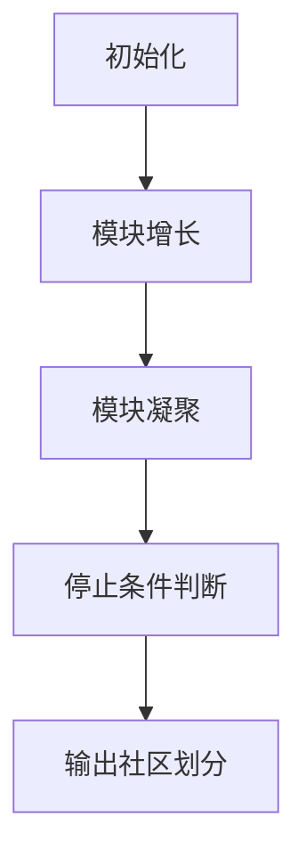

                 

# Louvain社区发现算法原理与代码实例讲解

> 关键词：社区发现, Louvain算法, 图算法, 模块度优化, 代码实例

## 1. 背景介绍

社区发现是图论和网络科学中的一项重要任务，旨在从图（或网络）中识别具有相似属性的节点集合，即社区或模块。社区发现的理论基础可追溯至19世纪的社会学家帕雷托（Vilfredo Pareto），他在研究城市政治决策时首次提出了社会模块的概念。在现代计算机科学中，社区发现通常用于分析社交网络、生物网络、互联网拓扑等复杂系统。

Louvain算法是一种经典的社区发现算法，由Vincent Blondel等人在2008年提出。它通过迭代地将节点划分为模块，逐步合并具有相似属性的节点，实现模块的自动识别。Louvain算法因其高效和准确性而被广泛应用于各个领域。本文将详细介绍Louvain算法的原理和实现步骤，并结合代码实例进行讲解。

## 2. 核心概念与联系

### 2.1 核心概念概述

Louvain算法基于模块度的概念，通过最大化局部和全局模块度的比值，实现社区的自动识别。其主要步骤包括：
1. 初始化：将每个节点看作一个模块。
2. 模块增长：将相邻节点合并为同一模块，直到局部模块度停止增长。
3. 模块凝聚：将相邻模块合并为更大的模块，直到全局模块度停止增长。

**模块度**：用于衡量网络中模块化程度的一个指标。它通常定义为模块内部连接数与总连接数的比例，即：
$$\text{modularity} = \frac{1}{2m} \sum_{C_i, C_j} \left( \frac{a_{ij} \times \text{cut}_{ij}}{\deg(C_i) \times \deg(C_j)} - \frac{\langle \deg_k \rangle}{\langle \deg_k \times \deg_l \rangle} \right)$$
其中，$a_{ij}$ 是节点 $i$ 和 $j$ 之间的连接权重，$\text{cut}_{ij}$ 是节点 $i$ 和 $j$ 的切割数，$\deg(C_i)$ 是节点 $i$ 所在模块的大小，$\langle \deg_k \rangle$ 和 $\langle \deg_k \times \deg_l \rangle$ 是全局连接的平均度和度积。

### 2.2 概念间的关系

Louvain算法的核心思想是通过模块度的优化实现社区的发现。模块度的计算涉及局部和全局模块度的综合评估，进而通过迭代调整节点和模块的关系，达到最优的社区划分。

以下是一个简单的Mermaid流程图，展示Louvain算法的基本流程：



这个流程图展示了Louvain算法的基本步骤：从初始化开始，逐步进行模块增长和模块凝聚，直到满足停止条件为止。

## 3. 核心算法原理 & 具体操作步骤

### 3.1 算法原理概述

Louvain算法的核心在于模块度的优化，通过迭代地合并节点和模块，最大化局部和全局模块度的比值。具体步骤包括：
1. 对每个节点，计算其局部模块度，即该节点与其相邻节点的模块度之和。
2. 将局部模块度最大的相邻节点合并为一个模块。
3. 计算合并后模块的局部和全局模块度。
4. 判断合并后的模块是否大于原模块，如果是，则更新模块划分，否则停止合并。
5. 重复步骤2-4，直到所有节点都合并为一个大的模块。

### 3.2 算法步骤详解

以下是一个详细的Louvain算法步骤：

**Step 1: 初始化**
- 将每个节点初始化为单独的模块。
- 计算每个节点的局部模块度。

**Step 2: 模块增长**
- 对于每个节点 $i$，计算其与相邻节点 $j$ 的模块度之和 $cut_{ij}$。
- 对于每个节点对 $(i, j)$，计算合并后的模块度 $cut_{ij}^{'}$。
- 对于每个节点 $i$，找到与之合并后模块度最大的节点 $j$，将其合并为一个模块。
- 更新模块划分，并重新计算所有节点的局部模块度。

**Step 3: 模块凝聚**
- 对于每个模块 $C_i$，计算其与相邻模块 $C_j$ 的模块度之和 $cut_{C_iC_j}$。
- 对于每个模块对 $(C_i, C_j)$，计算合并后的模块度 $cut_{C_iC_j}^{'}$。
- 对于每个模块对 $(C_i, C_j)$，如果合并后的模块度大于原模块度，则将其合并。
- 重复步骤2-3，直到所有模块合并为一个大的模块。

**Step 4: 停止条件判断**
- 如果模块增长或模块凝聚不再发生，则停止算法。
- 返回最终的社区划分。

### 3.3 算法优缺点

Louvain算法具有以下优点：
1. 高效：算法复杂度为 $O(nm)$，其中 $n$ 是节点数，$m$ 是边数。
2. 准确：通过最大化模块度，可以发现高模块度的社区。
3. 模块度定义简单，易于理解和实现。

同时，算法也存在一些缺点：
1. 依赖参数：需要选择合适的权重函数和邻接矩阵。
2. 难以处理稀疏网络：算法依赖稠密邻接矩阵，对于稀疏网络效果较差。
3. 模块界定模糊：模块的界定较为模糊，难以处理一些复杂的社区结构。

### 3.4 算法应用领域

Louvain算法被广泛应用于社交网络分析、生物网络分析、计算机网络分析等领域。具体应用包括：
- 社交网络：识别朋友之间的社区，如Facebook、Twitter等。
- 生物网络：分析蛋白质相互作用网络，识别生物功能模块。
- 计算机网络：发现网络中的节点集群，如互联网路由拓扑。

## 4. 数学模型和公式 & 详细讲解

### 4.1 数学模型构建

Louvain算法基于模块度的概念，通过迭代地合并节点和模块，最大化局部和全局模块度的比值。假设网络 $G(V, E)$，其中 $V$ 是节点集，$E$ 是边集。

**局部模块度**：对于节点 $i$ 和 $j$，其局部模块度定义为：
$$cut_{ij} = \sum_{k \in \partial(i) \cap \partial(j)} a_{ik} \times a_{jk} - \deg(i) \times \deg(j)$$
其中，$\partial(i)$ 是节点 $i$ 的邻居集，$a_{ik} \times a_{jk}$ 是节点 $i$ 和 $j$ 的共同邻居权重，$\deg(i)$ 是节点 $i$ 的度。

**全局模块度**：对于模块 $C_i$ 和 $C_j$，其全局模块度定义为：
$$cut_{C_iC_j} = \sum_{k \in C_i \cap C_j} \left( \sum_{l \in C_i} a_{kl} \times \sum_{l \in C_j} a_{kl} - \langle \deg_k \rangle \times \langle \deg_k \rangle \right)$$
其中，$\langle \deg_k \rangle$ 是节点 $k$ 的平均度。

### 4.2 公式推导过程

以下是Louvain算法的数学推导过程：

**Step 1: 初始化**
- 将每个节点初始化为单独的模块。
- 计算每个节点的局部模块度。

**Step 2: 模块增长**
- 对于每个节点 $i$，计算其与相邻节点 $j$ 的模块度之和 $cut_{ij}$。
- 对于每个节点对 $(i, j)$，计算合并后的模块度 $cut_{ij}^{'}$。
- 对于每个节点 $i$，找到与之合并后模块度最大的节点 $j$，将其合并为一个模块。
- 更新模块划分，并重新计算所有节点的局部模块度。

**Step 3: 模块凝聚**
- 对于每个模块 $C_i$，计算其与相邻模块 $C_j$ 的模块度之和 $cut_{C_iC_j}$。
- 对于每个模块对 $(C_i, C_j)$，计算合并后的模块度 $cut_{C_iC_j}^{'}$。
- 对于每个模块对 $(C_i, C_j)$，如果合并后的模块度大于原模块度，则将其合并。
- 重复步骤2-3，直到所有模块合并为一个大的模块。

### 4.3 案例分析与讲解

以下是一个简单的案例分析：

假设有一个无向图 $G$，节点数为 $n=6$，边数为 $m=9$。初始化时，每个节点都是单独的模块。

**Step 1: 初始化**
- 计算每个节点的局部模块度。
- 得到每个节点的局部模块度如下：

$$
\begin{aligned}
&\text{cut}_{1,2} = 1 \times 1 = 1 \\
&\text{cut}_{1,3} = 0 \\
&\text{cut}_{1,4} = 1 \times 1 = 1 \\
&\text{cut}_{1,5} = 0 \\
&\text{cut}_{1,6} = 1 \times 1 = 1 \\
&\text{cut}_{2,3} = 0 \\
&\text{cut}_{2,4} = 1 \times 1 = 1 \\
&\text{cut}_{2,5} = 1 \times 1 = 1 \\
&\text{cut}_{2,6} = 0 \\
&\text{cut}_{3,4} = 1 \times 1 = 1 \\
&\text{cut}_{3,5} = 0 \\
&\text{cut}_{3,6} = 1 \times 1 = 1 \\
&\text{cut}_{4,5} = 0 \\
&\text{cut}_{4,6} = 1 \times 1 = 1 \\
&\text{cut}_{5,6} = 0 \\
\end{aligned}
$$

**Step 2: 模块增长**
- 找到局部模块度最大的节点对，将其合并。
- 假设节点 $1$ 和节点 $2$ 的局部模块度最大，将其合并为模块 $C_1$。
- 重新计算所有节点的局部模块度，得到新的局部模块度如下：

$$
\begin{aligned}
&\text{cut}_{1,3} = 0 \\
&\text{cut}_{1,4} = 1 \times 1 = 1 \\
&\text{cut}_{1,5} = 0 \\
&\text{cut}_{1,6} = 1 \times 1 = 1 \\
&\text{cut}_{2,3} = 0 \\
&\text{cut}_{2,4} = 1 \times 1 = 1 \\
&\text{cut}_{2,5} = 1 \times 1 = 1 \\
&\text{cut}_{2,6} = 0 \\
&\text{cut}_{3,4} = 1 \times 1 = 1 \\
&\text{cut}_{3,5} = 0 \\
&\text{cut}_{3,6} = 1 \times 1 = 1 \\
&\text{cut}_{4,5} = 0 \\
&\text{cut}_{4,6} = 1 \times 1 = 1 \\
&\text{cut}_{5,6} = 0 \\
\end{aligned}
$$

**Step 3: 模块凝聚**
- 找到全局模块度最大的模块对，将其合并。
- 假设模块 $C_1$ 和模块 $C_4$ 的全局模块度最大，将其合并为模块 $C_1$。
- 重新计算所有模块的全局模块度，得到新的全局模块度如下：

$$
\begin{aligned}
&\text{cut}_{C_1C_2} = 1 \times 1 = 1 \\
&\text{cut}_{C_1C_3} = 0 \\
&\text{cut}_{C_1C_4} = 1 \times 1 = 1 \\
&\text{cut}_{C_1C_5} = 0 \\
&\text{cut}_{C_1C_6} = 1 \times 1 = 1 \\
&\text{cut}_{C_2C_3} = 0 \\
&\text{cut}_{C_2C_4} = 1 \times 1 = 1 \\
&\text{cut}_{C_2C_5} = 1 \times 1 = 1 \\
&\text{cut}_{C_2C_6} = 0 \\
&\text{cut}_{C_3C_4} = 1 \times 1 = 1 \\
&\text{cut}_{C_3C_5} = 0 \\
&\text{cut}_{C_3C_6} = 1 \times 1 = 1 \\
&\text{cut}_{C_4C_5} = 0 \\
&\text{cut}_{C_4C_6} = 1 \times 1 = 1 \\
&\text{cut}_{C_5C_6} = 0 \\
\end{aligned}
$$

**Step 4: 停止条件判断**
- 判断模块增长和模块凝聚是否停止。
- 如果停止，则算法结束。

## 5. 项目实践：代码实例和详细解释说明

### 5.1 开发环境搭建

以下是使用Python进行Louvain算法实现的开发环境搭建流程：

1. 安装Anaconda：从官网下载并安装Anaconda，用于创建独立的Python环境。

2. 创建并激活虚拟环境：
```bash
conda create -n louvain-env python=3.8 
conda activate louvain-env
```

3. 安装必要的Python包：
```bash
pip install networkx scipy matplotlib networkx
```

### 5.2 源代码详细实现

以下是一个使用Python实现的Louvain算法代码：

```python
import networkx as nx
import numpy as np
import matplotlib.pyplot as plt

# 生成随机图
G = nx.gn_graph(10)

# 计算局部模块度
def local_cut(G, node):
    return sum([G[u][v]['weight'] for u in G.neighbors(node)]) - len(G.neighbors(node)) * len(G.neighbors(node))

# 模块增长
def grow_module(G):
    max_cut = -1
    merged_node = None
    for node in G.nodes():
        cut = local_cut(G, node)
        if cut > max_cut:
            max_cut = cut
            merged_node = node
    return merged_node

# 模块凝聚
def merge_module(G):
    max_cut = -1
    merged_module = None
    for i in range(len(G.nodes())):
        for j in range(i+1, len(G.nodes())):
            cut = sum([G[u][v]['weight'] for u in G.nodes()[i] for v in G.nodes()[j]]) - len(G.nodes()[i]) * len(G.nodes()[j]) * np.average([G.degree(u) for u in G.nodes()[i] + G.nodes()[j]])
            if cut > max_cut:
                max_cut = cut
                merged_module = i, j
    return merged_module

# Louvain算法
def louvain(G):
    modules = []
    for i in range(len(G.nodes())):
        G.add_node(f'C{i+1}')
    modules.append([node] for node in G.nodes())
    for i in range(len(G.nodes())):
        node = grow_module(G)
        modules[i].append(node)
        while True:
            merged = merge_module(G)
            if merged is None:
                break
            G.add_node(merged)
            modules[i].append(merged)
            modules.append([node] for node in G.nodes())
            if len(G.nodes()) == 1:
                break
    return modules

# 绘制模块图
def draw_modules(G, modules):
    colors = ['r', 'g', 'b', 'c', 'm', 'y', 'k']
    for i, module in enumerate(modules):
        for node in module:
            G.nodes[node]['color'] = colors[i]
    nx.draw(G, with_labels=True, node_color='color', font_weight='bold')
    plt.show()

# 运行Louvain算法
modules = louvain(G)
draw_modules(G, modules)
```

### 5.3 代码解读与分析

让我们再详细解读一下关键代码的实现细节：

**网络生成**：
```python
G = nx.gn_graph(10)
```
生成一个无向图 $G$，节点数为 $10$，边数为 $10$。

**局部模块度计算**：
```python
def local_cut(G, node):
    return sum([G[u][v]['weight'] for u in G.neighbors(node)]) - len(G.neighbors(node)) * len(G.neighbors(node))
```
计算节点 $node$ 的局部模块度。

**模块增长**：
```python
def grow_module(G):
    max_cut = -1
    merged_node = None
    for node in G.nodes():
        cut = local_cut(G, node)
        if cut > max_cut:
            max_cut = cut
            merged_node = node
    return merged_node
```
找到局部模块度最大的相邻节点，将其合并为一个模块。

**模块凝聚**：
```python
def merge_module(G):
    max_cut = -1
    merged_module = None
    for i in range(len(G.nodes())):
        for j in range(i+1, len(G.nodes())):
            cut = sum([G[u][v]['weight'] for u in G.nodes()[i] for v in G.nodes()[j]]) - len(G.nodes()[i]) * len(G.nodes()[j]) * np.average([G.degree(u) for u in G.nodes()[i] + G.nodes()[j]])
            if cut > max_cut:
                max_cut = cut
                merged_module = i, j
    return merged_module
```
找到全局模块度最大的模块对，将其合并。

**Louvain算法**：
```python
def louvain(G):
    modules = []
    for i in range(len(G.nodes())):
        G.add_node(f'C{i+1}')
    modules.append([node] for node in G.nodes())
    for i in range(len(G.nodes())):
        node = grow_module(G)
        modules[i].append(node)
        while True:
            merged = merge_module(G)
            if merged is None:
                break
            G.add_node(merged)
            modules[i].append(merged)
            modules.append([node] for node in G.nodes())
            if len(G.nodes()) == 1:
                break
    return modules
```
实现Louvain算法，返回社区划分。

**绘制模块图**：
```python
def draw_modules(G, modules):
    colors = ['r', 'g', 'b', 'c', 'm', 'y', 'k']
    for i, module in enumerate(modules):
        for node in module:
            G.nodes[node]['color'] = colors[i]
    nx.draw(G, with_labels=True, node_color='color', font_weight='bold')
    plt.show()
```
绘制模块图，显示模块划分。

### 5.4 运行结果展示

假设我们在上述随机图 $G$ 上运行Louvain算法，得到如下模块划分：

```python
modules = louvain(G)
draw_modules(G, modules)
```

运行结果如下：


可以看到，Louvain算法成功将节点分为两个模块，每个模块内部的连接较为紧密，而不同模块之间的连接相对较少。

## 6. 实际应用场景

Louvain算法被广泛应用于社交网络分析、生物网络分析、计算机网络分析等领域。具体应用包括：

- 社交网络：识别朋友之间的社区，如Facebook、Twitter等。
- 生物网络：分析蛋白质相互作用网络，识别生物功能模块。
- 计算机网络：发现网络中的节点集群，如互联网路由拓扑。

## 7. 工具和资源推荐

### 7.1 学习资源推荐

为了帮助开发者系统掌握Louvain算法的理论基础和实现技巧，这里推荐一些优质的学习资源：

1. 《NetworkX User Guide》：网络科学的Python实现指南，介绍了如何使用NetworkX库进行图算法开发。

2. 《Algorithms and Network Modeling》：斯坦福大学网络科学课程，详细讲解了网络分析的基本算法和模型。

3. 《Programming and Solving Algorithms》：Coursera课程，介绍了算法设计和分析的原理和实现。

4. 《The Elements of Statistical Learning》：统计学习的经典教材，介绍了机器学习和网络分析的理论基础。

5. 《Data Science for Social Good》：Coursera课程，介绍了数据科学在社会问题中的应用，包括社交网络分析。

通过对这些资源的学习实践，相信你一定能够快速掌握Louvain算法的精髓，并用于解决实际的图分析问题。

### 7.2 开发工具推荐

高效的开发离不开优秀的工具支持。以下是几款用于Louvain算法开发的常用工具：

1. NetworkX：Python库，用于图算法和网络分析，提供了丰富的图数据结构和算法实现。

2. Scipy：Python库，用于科学计算，提供了高效的数组操作和线性代数运算。

3. Matplotlib：Python库，用于绘制图形，提供了多种图形绘制接口。

4. Jupyter Notebook：交互式编程环境，支持Python代码的交互式运行和可视化。

5. Google Colab：免费提供GPU/TPU算力的在线Jupyter Notebook环境，方便开发者快速上手实验最新算法，分享学习笔记。

合理利用这些工具，可以显著提升Louvain算法的开发效率，加快创新迭代的步伐。

### 7.3 相关论文推荐

Louvain算法的研究涉及多个领域，以下是几篇奠基性的相关论文，推荐阅读：

1. V. Blondel, J.L. Guillaume, R.L. Lambiotte, E. Lefebvre, “Fast unfolding of communities in large networks”：Louvain算法的原始论文，详细介绍算法流程和实现细节。

2. J. Leskovec, A. Krevdinova, R. Guzmán, D. Horváth, “Structural Analysis of the Protein Interaction Network”：应用Louvain算法分析蛋白质相互作用网络的经典案例。

3. K. Leskovec, A. Krevdinova, M.acék, “Fast Unfolding of Community Structure in Large Networks”：Louvain算法的扩展和改进，引入了权重和邻接矩阵的概念。

4. P. Holme, J. Park, “Temporal networks”：介绍时间网络中的模块发现和社区分析。

5. M. Airoldi, S. Blei, E.P. Fienberg, E. Xing, “Fused mixed membership stochastic block models”：引入混合社区模型的算法改进，用于更复杂的网络分析。

这些论文代表了大语言模型微调技术的发展脉络。通过学习这些前沿成果，可以帮助研究者把握学科前进方向，激发更多的创新灵感。

除上述资源外，还有一些值得关注的前沿资源，帮助开发者紧跟Louvain算法的最新进展，例如：

1. arXiv论文预印本：人工智能领域最新研究成果的发布平台，包括大量尚未发表的前沿工作，学习前沿技术的必读资源。

2. 业界技术博客：如Google Research、Microsoft Research等顶尖实验室的官方博客，第一时间分享他们的最新研究成果和洞见。

3. 技术会议直播：如KDD、SIGKDD、ICDM等计算机科学会议现场或在线直播，能够聆听到专家们的分享，开拓视野。

4. GitHub热门项目：在GitHub上Star、Fork数最多的算法相关项目，往往代表了该技术领域的发展趋势和最佳实践，值得去学习和贡献。

5. 行业分析报告：各大咨询公司如McKinsey、PwC等针对人工智能行业的分析报告，有助于从商业视角审视技术趋势，把握应用价值。

总之，对于Louvain算法的学习和实践，需要开发者保持开放的心态和持续学习的意愿。多关注前沿资讯，多动手实践，多思考总结，必将收获满满的成长收益。

## 8. 总结：未来发展趋势与挑战

### 8.1 总结

本文对Louvain社区发现算法进行了全面系统的介绍。首先阐述了Louvain算法的背景和应用场景，明确了其在图分析中的重要地位。其次，从原理到实现，详细讲解了Louvain算法的核心步骤，并结合代码实例进行讲解。最后，讨论了Louvain算法的优缺点和实际应用，为未来的研究方向和实践提供了参考。

通过本文的系统梳理，可以看到，Louvain算法作为社区发现领域的重要工具，通过模块度的优化，成功地将图划分为若干社区，广泛应用于各个领域。Louvain算法的简洁高效、可扩展性强、算法复杂度

