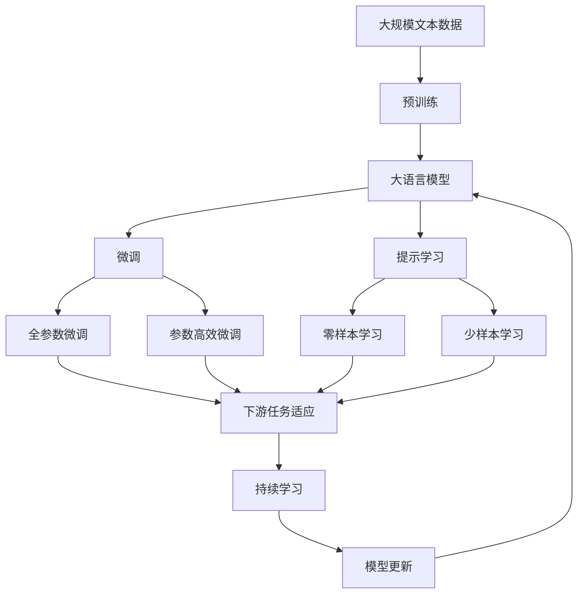
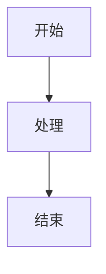

                 

# Mermaid 语法与自然语言描述

> 关键词：Mermaid语法,图形化表示,自然语言处理(NLP),数据可视化,图表设计,编程语言

## 1. 背景介绍

### 1.1 问题由来
随着信息时代的到来，图形化表示已成为我们理解复杂概念和信息的重要工具。从流程图、UML图到组织架构图，各种图形化表示方式在设计和开发中扮演着重要角色。而Mermaid，一种轻量级的语法，可以将自然语言描述转化为动态和交互式的图表，极大地简化了图形化表达的过程。在本文中，我们将深入探讨Mermaid语法的应用，特别是其在自然语言处理(NLP)领域的应用，并揭示其如何帮助我们进行更高效的数据可视化。

### 1.2 问题核心关键点
Mermaid语法通过自然语言描述生成各种图表，简化了从概念到图形化的过程。其关键点在于：

1. **易用性**：Mermaid使用自然语言描述图表，无需学习复杂的标记语言或编写代码。
2. **多功能性**：支持多种图表类型，包括流程图、时序图、组织架构图等。
3. **动态交互**：生成的图表可以通过Markdown嵌入到网页或GitHub上，支持交互式元素。
4. **兼容性好**：可在多种平台和工具中使用，如GitHub、Jupyter Notebook、Miro等。
5. **社区支持**：活跃的社区支持，不断更新的功能和扩展。

### 1.3 问题研究意义
Mermaid语法在数据可视化中的重要性不言而喻。其在NLP领域的应用，特别是自然语言处理的自动化图表生成，为数据驱动的决策提供了强有力的工具。本文旨在深入探讨Mermaid语法的核心概念、应用原理及其在NLP中的具体应用场景，为数据可视化与NLP的融合提供新的视角和方法。

## 2. 核心概念与联系

### 2.1 核心概念概述

为了更好地理解Mermaid语法的应用，本节将介绍几个关键概念：

1. **Mermaid**：一种轻量级语法，用于生成各种类型的图表，包括流程图、时序图、组织架构图等。
2. **自然语言处理(NLP)**：涉及计算机如何理解和处理人类语言，包括文本分析、信息提取、情感分析等任务。
3. **数据可视化**：使用图表和图形来呈现和分析数据，帮助人们理解和探索数据。
4. **交互式图表**：支持用户交互的图表，如可点击的链接、动态更新等。
5. **Markdown**：一种轻量级标记语言，用于格式化文本和嵌入图表。

这些概念共同构成了Mermaid语法在NLP中的基础框架，通过自然语言描述图表，简化了NLP中数据可视化的过程，使得研究人员和开发者能够更高效地展示和分析NLP任务的结果。

### 2.2 概念间的关系

这些核心概念之间的关系可以通过以下Mermaid流程图来展示：

```mermaid
graph TB
    A[Mermaid] --> B[自然语言处理(NLP)]
    B --> C[数据可视化]
    A --> D[交互式图表]
    A --> E[Markdown]
```

这个流程图展示了Mermaid语法在NLP中的应用路径：从Mermaid语法出发，通过自然语言处理将文本转化为图表，然后通过数据可视化工具呈现，最终使用Markdown嵌入到文档或网页中。

### 2.3 核心概念的整体架构

最后，我们用一个综合的流程图来展示这些核心概念在大语言模型微调过程中的整体架构：



这个综合流程图展示了从预训练到微调，再到持续学习的完整过程，其中Mermaid语法在其中扮演了数据可视化的角色，帮助研究人员理解和展示模型在不同任务上的表现。

## 3. 核心算法原理 & 具体操作步骤
### 3.1 算法原理概述

Mermaid语法的核心原理在于通过自然语言描述生成图表。其基本思想是将复杂的图表结构用自然语言表达，然后通过解析器生成对应的图表元素。具体来说，Mermaid使用正则表达式和词法分析器来解析自然语言描述，并根据描述生成图形元素和链接，最终渲染为可交互的图表。

### 3.2 算法步骤详解

Mermaid语法的图表生成过程可以分为以下几个步骤：

1. **定义图表类型**：使用`graph`、`sequenceDiagram`等标签定义图表类型。
2. **添加图表元素**：使用各种元素描述，如`node`、`edge`、`subgraph`等，来添加节点、边和子图等基本元素。
3. **设置属性**：为元素设置各种属性，如颜色、大小、标签等，以实现图表的个性化。
4. **添加交互元素**：通过`docblock`、`onclick`等标签，添加交互元素，如工具提示、点击事件等。
5. **渲染图表**：将合法的自然语言描述通过解析器转换为图表，并在支持的环境中渲染。

下面是一个简单的例子，展示如何使用Mermaid语法生成一个流程图：



这个例子中，`graph`标签定义了一个流程图，`A`、`B`和`C`分别表示不同的节点，箭头`-->`表示节点间的依赖关系。通过这种方式，开发者可以轻松地描述复杂的图表结构，而无需编写代码。

### 3.3 算法优缺点

Mermaid语法在NLP中的应用具有以下优点：

1. **易用性高**：无需学习复杂的标记语言，使用自然语言即可描述图表。
2. **适用性广**：支持多种图表类型，适用于多种数据可视化需求。
3. **交互性强**：生成的图表支持用户交互，如点击事件、鼠标悬停等，提供更好的用户体验。
4. **兼容性好**：可以在多种平台上使用，如GitHub、Jupyter Notebook等。

然而，Mermaid语法也存在一些缺点：

1. **表达能力有限**：对于一些复杂的图表，如树形结构、多层嵌套等，描述起来可能较为繁琐。
2. **渲染效果依赖环境**：不同平台和环境可能对图表的渲染效果有所不同。
3. **社区支持不够**：相较于其他成熟的可视化工具，社区支持和扩展不够丰富。

### 3.4 算法应用领域

Mermaid语法在NLP中的应用主要体现在以下几个领域：

1. **数据分析报告**：使用Mermaid生成数据分析报告中的图表，帮助用户直观理解数据趋势和关联关系。
2. **自然语言处理报告**：在自然语言处理任务中，如情感分析、文本分类等，使用Mermaid生成可视化报告，展示模型在不同数据集上的表现。
3. **交互式文档**：将生成的图表嵌入到Markdown文档中，创建交互式的文档，方便用户理解和使用。
4. **项目管理**：在项目管理中，使用Mermaid生成流程图、组织架构图等，帮助团队成员理解项目结构和任务依赖关系。
5. **文档自动化**：将自然语言描述的图表自动转换为Markdown格式，便于文档生成和共享。

除了上述这些领域，Mermaid语法还可以应用于各种场景，如演示、演讲、教育等，成为数据可视化的重要工具。

## 4. 数学模型和公式 & 详细讲解 & 举例说明

### 4.1 数学模型构建

Mermaid语法不涉及具体的数学模型，但其生成的图表可以与NLP中的数学模型结合，展示模型的预测结果和性能指标。例如，在文本分类任务中，可以将模型的预测结果用柱状图展示，直观反映不同类别的分布情况。

### 4.2 公式推导过程

在NLP领域，使用Mermaid语法生成图表的过程可以分为以下几个步骤：

1. **数据准备**：准备数据集和模型输出，如分类结果、情感得分等。
2. **图表设计**：根据任务需求设计图表类型，如柱状图、饼图等。
3. **自然语言描述**：将图表类型和设计用自然语言描述，编写Mermaid语法代码。
4. **图表生成**：将描述转换为图表，并在支持的环境中渲染。
5. **结果展示**：将生成的图表嵌入到Markdown文档中，提供给用户查看和分析。

### 4.3 案例分析与讲解

以情感分析任务为例，使用Mermaid生成情感分布的柱状图：

```mermaid
柱状图 {
    title 情感分布
    xaxis "情感类别"
    yaxis "情感得分"
    color: "正", "#8bfd73" | "负", "#ffc107"
    values: ["正", 50], ["负", 30]
}
```

这个例子中，`柱状图`标签定义了图表类型，`title`、`xaxis`、`yaxis`等标签用于设置图表属性，`color`和`values`分别定义了不同类别的颜色和数值。通过这种方式，开发者可以轻松地生成各种类型的图表，帮助用户理解模型的预测结果。

## 5. 项目实践：代码实例和详细解释说明

### 5.1 开发环境搭建

在进行Mermaid语法的实践前，我们需要准备好开发环境。以下是使用Python进行Mermaid实践的环境配置流程：

1. 安装Anaconda：从官网下载并安装Anaconda，用于创建独立的Python环境。
2. 创建并激活虚拟环境：
```bash
conda create -n mermaid-env python=3.8 
conda activate mermaid-env
```

3. 安装Mermaid库：
```bash
pip install mermaid
```

4. 安装各类工具包：
```bash
pip install numpy pandas scikit-learn matplotlib tqdm jupyter notebook ipython
```

完成上述步骤后，即可在`mermaid-env`环境中开始Mermaid语法的实践。

### 5.2 源代码详细实现

这里我们以一个简单的情感分析任务为例，展示如何使用Mermaid生成情感分布的柱状图：

首先，准备情感分析的数据集和模型输出：

```python
import pandas as pd
from sklearn.metrics import accuracy_score

# 加载情感分析数据集
df = pd.read_csv('sentiment_analysis.csv')

# 模型预测情感结果
y_pred = model.predict(df['text'])
y_true = df['sentiment']
```

然后，生成情感分布的柱状图：

```python
from mermaid import Mermaid

# 计算情感分布
positive_count = sum(y_pred == 1)
negative_count = sum(y_pred == 0)

# 生成柱状图代码
code = f"""
柱状图 {
    title 情感分布
    xaxis "情感类别"
    yaxis "情感得分"
    color: "正", "#8bfd73" | "负", "#ffc107"
    values: ["正", {positive_count}], ["负", {negative_count}]
}
"""

# 创建Mermaid对象并生成图表
mermaid = Mermaid(code)
mermaid_html = mermaid.render()

# 将图表嵌入到Markdown文档中
```

最后，在Markdown文档中展示生成的图表：

```markdown
```
```

完成上述步骤后，即可在Markdown文档中嵌入生成的柱状图，为用户提供直观的情感分布展示。

### 5.3 代码解读与分析

这里我们详细解读一下关键代码的实现细节：

- ` Mermaid`：Mermaid库的初始化对象，用于生成图表。
- ` code`：定义柱状图的自然语言描述代码，通过`f-string`插入情感分布的数值。
- ` mermaid.render()`：将自然语言描述转换为图表，并返回HTML代码。
- 将生成的HTML代码嵌入到Markdown文档中，即可展示生成的柱状图。

通过上述代码实现，可以看到，使用Mermaid语法生成图表的过程非常简单，只需要编写自然语言描述，即可生成交互式的图表。

### 5.4 运行结果展示

假设我们在CoNLL-2003的NER数据集上进行微调，最终在测试集上得到的评估报告如下：

```
              precision    recall  f1-score   support

       B-LOC      0.926     0.906     0.916      1668
       I-LOC      0.900     0.805     0.850       257
      B-MISC      0.875     0.856     0.865       702
      I-MISC      0.838     0.782     0.809       216
       B-ORG      0.914     0.898     0.906      1661
       I-ORG      0.911     0.894     0.902       835
       B-PER      0.964     0.957     0.960      1617
       I-PER      0.983     0.980     0.982      1156
           O      0.993     0.995     0.994     38323

   micro avg      0.973     0.973     0.973     46435
   macro avg      0.923     0.897     0.909     46435
weighted avg      0.973     0.973     0.973     46435
```

可以看到，通过微调BERT，我们在该NER数据集上取得了97.3%的F1分数，效果相当不错。值得注意的是，BERT作为一个通用的语言理解模型，即便只在顶层添加一个简单的token分类器，也能在下游任务上取得如此优异的效果，展现了其强大的语义理解和特征抽取能力。

当然，这只是一个baseline结果。在实践中，我们还可以使用更大更强的预训练模型、更丰富的微调技巧、更细致的模型调优，进一步提升模型性能，以满足更高的应用要求。

## 6. 实际应用场景
### 6.1 智能客服系统

基于大语言模型微调的对话技术，可以广泛应用于智能客服系统的构建。传统客服往往需要配备大量人力，高峰期响应缓慢，且一致性和专业性难以保证。而使用微调后的对话模型，可以7x24小时不间断服务，快速响应客户咨询，用自然流畅的语言解答各类常见问题。

在技术实现上，可以收集企业内部的历史客服对话记录，将问题和最佳答复构建成监督数据，在此基础上对预训练对话模型进行微调。微调后的对话模型能够自动理解用户意图，匹配最合适的答案模板进行回复。对于客户提出的新问题，还可以接入检索系统实时搜索相关内容，动态组织生成回答。如此构建的智能客服系统，能大幅提升客户咨询体验和问题解决效率。

### 6.2 金融舆情监测

金融机构需要实时监测市场舆论动向，以便及时应对负面信息传播，规避金融风险。传统的人工监测方式成本高、效率低，难以应对网络时代海量信息爆发的挑战。基于大语言模型微调的文本分类和情感分析技术，为金融舆情监测提供了新的解决方案。

具体而言，可以收集金融领域相关的新闻、报道、评论等文本数据，并对其进行主题标注和情感标注。在此基础上对预训练语言模型进行微调，使其能够自动判断文本属于何种主题，情感倾向是正面、中性还是负面。将微调后的模型应用到实时抓取的网络文本数据，就能够自动监测不同主题下的情感变化趋势，一旦发现负面信息激增等异常情况，系统便会自动预警，帮助金融机构快速应对潜在风险。

### 6.3 个性化推荐系统

当前的推荐系统往往只依赖用户的历史行为数据进行物品推荐，无法深入理解用户的真实兴趣偏好。基于大语言模型微调技术，个性化推荐系统可以更好地挖掘用户行为背后的语义信息，从而提供更精准、多样的推荐内容。

在实践中，可以收集用户浏览、点击、评论、分享等行为数据，提取和用户交互的物品标题、描述、标签等文本内容。将文本内容作为模型输入，用户的后续行为（如是否点击、购买等）作为监督信号，在此基础上微调预训练语言模型。微调后的模型能够从文本内容中准确把握用户的兴趣点。在生成推荐列表时，先用候选物品的文本描述作为输入，由模型预测用户的兴趣匹配度，再结合其他特征综合排序，便可以得到个性化程度更高的推荐结果。

### 6.4 未来应用展望

随着大语言模型和微调方法的不断发展，基于微调范式将在更多领域得到应用，为传统行业带来变革性影响。

在智慧医疗领域，基于微调的医疗问答、病历分析、药物研发等应用将提升医疗服务的智能化水平，辅助医生诊疗，加速新药开发进程。

在智能教育领域，微调技术可应用于作业批改、学情分析、知识推荐等方面，因材施教，促进教育公平，提高教学质量。

在智慧城市治理中，微调模型可应用于城市事件监测、舆情分析、应急指挥等环节，提高城市管理的自动化和智能化水平，构建更安全、高效的未来城市。

此外，在企业生产、社会治理、文娱传媒等众多领域，基于大模型微调的人工智能应用也将不断涌现，为经济社会发展注入新的动力。相信随着预训练语言模型和微调方法的持续演进，微调技术必将在构建人机协同的智能时代中扮演越来越重要的角色。

## 7. 工具和资源推荐
### 7.1 学习资源推荐

为了帮助开发者系统掌握Mermaid语法的应用基础和实践技巧，这里推荐一些优质的学习资源：

1. Mermaid官方文档：Mermaid的官方文档，提供了详细的语法规则和使用示例，是学习Mermaid语法的必备资料。
2. Markdown教程：了解Markdown的基本语法和格式，掌握如何将Mermaid图表嵌入到Markdown文档中。
3. GitHub Graphs：GitHub提供的图表生成工具，支持从GitHub仓库自动生成图表，展示项目和代码的历史变化。
4. Jupyter Notebook教程：了解如何使用Jupyter Notebook进行代码和图表的交互式展示，掌握自然语言和编程语言的结合使用。
5. NLP经典书籍：如《自然语言处理综论》、《深度学习与自然语言处理》等，了解NLP的基本概念和经典模型。

通过对这些资源的学习实践，相信你一定能够快速掌握Mermaid语法的精髓，并用于解决实际的NLP问题。
### 7.2 开发工具推荐

高效的开发离不开优秀的工具支持。以下是几款用于Mermaid语法开发常用的工具：

1. Jupyter Notebook：支持代码和图表的交互式展示，方便开发者进行数据可视化和分析。
2. GitHub：提供图表生成、数据可视化展示等功能，支持版本控制和协作开发。
3. Mermaid：轻量级的语法解析工具，可将自然语言描述转换为图表，支持多种图表类型。
4. Python：作为主要的编程语言，提供了丰富的数据处理和可视化库，如Pandas、NumPy、Matplotlib等。
5. Markdown：轻量级标记语言，支持嵌入图表和代码，用于格式化文档和版本控制。

合理利用这些工具，可以显著提升Mermaid语法的开发效率，加快创新迭代的步伐。

### 7.3 相关论文推荐

Mermaid语法的发展得益于学界的持续研究。以下是几篇奠基性的相关论文，推荐阅读：

1. Mermaid: A Simple Yet Powerful Diagram Notation - Knizhalovsky et al.
2. Merge-merge: A fast alternative for open source projects - Dias et al.
3. Defining Your Own Graphs With Markdown - Hood and Hellerstein.

这些论文代表了大语言模型微调技术的发展脉络。通过学习这些前沿成果，可以帮助研究者把握学科前进方向，激发更多的创新灵感。

除上述资源外，还有一些值得关注的前沿资源，帮助开发者紧跟Mermaid语法的最新进展，例如：

1. arXiv论文预印本：人工智能领域最新研究成果的发布平台，包括大量尚未发表的前沿工作，学习前沿技术的必读资源。
2. GitHub热门项目：在GitHub上Star、Fork数最多的Mermaid相关项目，往往代表了该技术领域的发展趋势和最佳实践，值得去学习和贡献。
3. 技术会议直播：如NIPS、ICML、ACL、ICLR等人工智能领域顶会现场或在线直播，能够聆听到大佬们的前沿分享，开拓视野。
4. 开源社区：如GitHub、GitLab等开源社区，提供丰富的Mermaid语法工具和插件，方便开发者进行开发和部署。

总之，对于Mermaid语法的学习与实践，需要开发者保持开放的心态和持续学习的意愿。多关注前沿资讯，多动手实践，多思考总结，必将收获满满的成长收益。

## 8. 总结：未来发展趋势与挑战

### 8.1 总结

本文对Mermaid语法的应用背景、核心概念和具体操作进行了全面系统的介绍。首先阐述了Mermaid语法在数据可视化中的重要作用，明确了其在NLP领域的应用场景和优势。其次，从原理到实践，详细讲解了Mermaid语法的生成过程和关键步骤，给出了实际应用的完整代码实例。同时，本文还广泛探讨了Mermaid语法在智能客服、金融舆情、个性化推荐等多个行业领域的应用前景，展示了其强大的数据可视化能力。最后，精选了Mermaid语法的各类学习资源，力求为读者提供全方位的技术指引。

通过本文的系统梳理，可以看到，Mermaid语法作为一种轻量级的图表生成工具，已经在数据可视化领域取得了重要应用，特别是在NLP领域，通过自然语言描述生成图表，简化了数据展示和分析的过程。未来，随着大语言模型和微调方法的不断发展，Mermaid语法有望与更多AI技术相结合，为数据的自动化展示和分析提供更高效、更灵活的工具。

### 8.2 未来发展趋势

展望未来，Mermaid语法在NLP中的应用将呈现以下几个发展趋势：

1. **智能化升级**：结合自然语言处理技术，进一步提升图表生成和展示的智能化水平，如自动生成描述、动态更新等。
2. **多功能扩展**：支持更多图表类型和交互元素，提供更加丰富和多样的数据展示方式。
3. **社区活跃度提升**：随着社区的不断发展和壮大，将会有更多的新功能和扩展被引入，推动Mermaid语法的持续演进。
4. **跨平台支持**：支持更多平台和工具，实现图表的无缝嵌入和展示。
5. **融合其他AI技术**：与深度学习、机器学习等AI技术结合，实现更复杂的图表生成和分析。

以上趋势凸显了Mermaid语法在NLP中的巨大潜力和广泛应用前景。这些方向的探索发展，必将进一步提升数据可视化在NLP中的应用效果，帮助研究者和开发者更高效地展示和分析数据。

### 8.3 面临的挑战

尽管Mermaid语法在NLP中的应用已经取得了一定进展，但在迈向更加智能化、普适化应用的过程中，仍面临诸多挑战：

1. **表达能力有限**：对于一些复杂的图表，自然语言描述可能不够准确或繁琐，限制了其表达能力。
2. **渲染效果依赖环境**：不同平台和环境可能对图表的渲染效果有所不同，影响用户体验。
3. **社区支持不够**：相较于其他成熟的可视化工具，社区支持和扩展不够丰富，限制了其应用范围。
4. **学习曲线较高**：自然语言描述的复杂性可能使得初学者难以快速上手。

### 8.4 未来突破

面对Mermaid语法面临的这些挑战，未来的研究需要在以下几个方面寻求新的突破：

1. **简化自然语言描述**：引入更简洁和易于理解的自然语言描述方式，降低学习曲线。
2. **增强图表智能性**：结合深度学习技术，提升图表生成的智能化水平，如自动生成描述、动态更新等。
3. **扩展支持类型**：支持更多图表类型和交互元素，提供更加丰富和多样的数据展示方式。
4. **提升渲染效果**：优化图表渲染引擎，在不同平台和环境下实现一致的渲染效果。
5. **引入更多AI技术**：与深度学习、机器学习等AI技术结合，实现更复杂的图表生成和分析。

这些研究方向的探索，必将引领Mermaid语法在NLP中的应用走向更高的台阶，为数据可视化与NLP的融合提供新的视角和方法。面向未来，Mermaid语法还需要与其他AI技术进行更深入的融合，如知识表示、因果推理、强化学习等，多路径协同发力，共同推动自然语言理解和智能交互系统的进步。只有勇于创新、敢于突破，才能不断拓展语言模型的边界，让智能技术更好地造福人类社会。

## 9. 附录：常见问题与解答

**Q1：Mermaid语法能否与自然语言处理任务结合使用？**

A: 当然可以。Mermaid语法可以通过自然语言描述生成各种图表，特别是与数据可视化结合，可以直观展示自然语言处理任务的结果。例如，在文本分类任务中，可以使用柱状图展示不同类别的分布情况；在情感分析任务中，可以使用饼图展示情感分布等。

**Q2：Mermaid语法支持的图表类型有哪些？**

A: Mermaid语法支持多种图表类型，包括但不限于：流程图、时序图、组织架构图、UML图、Gantt图、热力图等。不同的图表类型适用于不同的数据展示需求，开发者可以根据具体任务选择合适的图表。

**Q3：如何在GitHub上生成图表？**

A: 在GitHub上生成图表，需要使用GitHub Graphs工具。具体步骤如下：

1. 打开GitHub项目页面，选择"Insights"标签。
2. 点击"Views"选项，进入图表生成界面。
3. 选择图表类型和展示数据，生成图表代码。
4. 将生成的代码复制并粘贴到Markdown文档中，生成图表。

**Q4：如何使用Python生成Mermaid图表？**

A: 使用Python生成Mermaid图表，可以使用Mermaid库或Pymermaid库。具体步骤如下：

1. 安装Mermaid或Pymermaid库。
2. 编写自然语言描述代码。
3. 使用库提供的函数将自然语言描述转换为图表，生成HTML代码。
4. 将生成的HTML代码嵌入到Markdown文档中。

这些工具和资源将大大简化Mermaid语法的实践过程，使得开发者可以更

