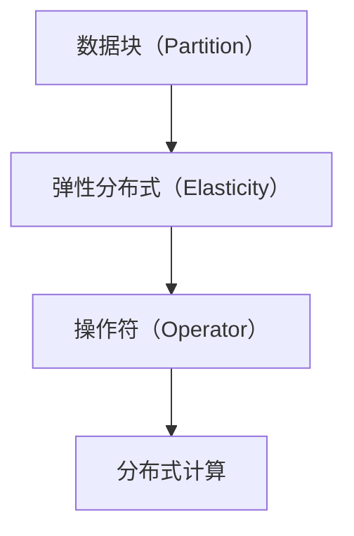

                 

# RDD 原理与代码实例讲解

## 1. 背景介绍

### 1.1 问题由来

随着大数据技术的发展，处理海量数据的需求日益增加。传统的数据处理方式如MapReduce虽然性能强大，但在处理复杂、交互性强的大规模数据时，效率较低，开发难度较大。于是，一种基于内存计算的数据处理模型应运而生，这就是RDD（Resilient Distributed Dataset）。

RDD模型由Apache Spark提出，用于高效地进行分布式数据处理。它将数据存储在内存中，通过弹性分布式计算来实现并行处理。相比于传统的MapReduce模型，RDD提供了更高的性能和更好的编程模型，成为了大数据处理的主流技术之一。

### 1.2 问题核心关键点

RDD模型的核心思想是将数据分为多个小数据块，每个小数据块可以在内存中并行处理。RDD模型具有以下几个关键特点：

- **弹性分布式**：RDD数据可以分布在不同的节点上，通过网络传输和数据复制来保证计算的可靠性和容错性。
- **不可变性**：每个RDD数据块不可变，通过操作创建新的RDD数据块，不会修改原始数据。
- **分布式计算**：通过操作符对数据进行分布式计算，支持并行处理。

这些特点使得RDD模型能够在分布式环境下高效地进行数据处理。

### 1.3 问题研究意义

RDD模型在大数据处理领域有着广泛的应用，例如：

- 数据清洗与预处理：通过RDD模型对数据进行清洗、去重、归一化等预处理操作，提高数据质量。
- 数据挖掘与分析：利用RDD模型进行聚类、分类、回归等数据分析操作，提取数据特征。
- 机器学习：通过RDD模型进行特征工程、模型训练、评估等机器学习操作，构建预测模型。
- 实时计算：利用RDD模型进行实时数据流处理，实现数据实时分析和监控。

RDD模型的应用范围广泛，对于大数据处理有着重要的意义。

## 2. 核心概念与联系

### 2.1 核心概念概述

RDD模型的核心概念主要包括数据块（Partition）、弹性分布式（Elasticity）和操作符（Operator）。

- **数据块（Partition）**：RDD数据块是RDD的基本单位，每个数据块包含一部分数据，通常以1GB为单位。每个数据块可以在内存中并行处理。
- **弹性分布式（Elasticity）**：RDD数据可以分布在不同的节点上，通过网络传输和数据复制来保证计算的可靠性和容错性。
- **操作符（Operator）**：RDD模型提供了一系列操作符，可以对数据块进行分布式计算。

这些概念构成了RDD模型的基本框架，使得RDD模型能够在分布式环境下高效地进行数据处理。

### 2.2 概念间的关系

RDD模型的核心概念之间存在紧密的联系，形成了RDD模型的完整生态系统。通过以下Mermaid流程图，我们可以更清晰地理解这些概念之间的关系：



这个流程图展示了大数据处理的完整流程：

1. 数据被划分为多个数据块。
2. 数据块被分布在不同的节点上，形成弹性分布式计算。
3. 通过操作符对数据块进行分布式计算，实现分布式并行处理。

这些概念共同构成了RDD模型的核心框架，使得RDD模型能够在分布式环境下高效地进行数据处理。

## 3. 核心算法原理 & 具体操作步骤
### 3.1 算法原理概述

RDD模型的核心算法原理基于弹性分布式计算模型，通过操作符对数据块进行分布式计算。RDD模型的基本操作符包括map、reduce、join等，可以高效地进行数据处理。

RDD模型的核心思想是“不可变性”和“弹性分布式”。每个数据块在RDD模型中不可变，通过操作符对数据块进行操作，可以创建新的RDD数据块。同时，RDD模型可以通过弹性分布式计算来保证计算的可靠性和容错性。

### 3.2 算法步骤详解

RDD模型的基本操作流程包括以下几个步骤：

1. **数据创建**：将数据划分为多个数据块，存储在分布式存储系统（如HDFS）中。
2. **数据加载**：通过RDD函数（如RDD.read()）将数据加载到内存中，形成RDD数据块。
3. **数据操作**：通过RDD操作符对数据块进行操作，包括map、reduce、join等操作。
4. **数据保存**：将操作后的结果保存回分布式存储系统，形成新的RDD数据块。

RDD模型的操作步骤相对简单，通过操作符对数据块进行操作，可以高效地进行分布式计算。

### 3.3 算法优缺点

RDD模型具有以下优点：

- **高效性**：RDD模型基于内存计算，可以高效地进行数据处理。
- **弹性分布式**：RDD模型可以分布式计算，适应大规模数据处理的需求。
- **编程模型简单**：RDD模型提供了简单、易于理解的编程模型，便于开发。

同时，RDD模型也存在以下缺点：

- **内存限制**：RDD模型需要将数据加载到内存中，对于大文件需要较大的内存空间。
- **操作符复杂性**：RDD模型提供的操作符种类繁多，对于复杂的业务逻辑需要更多的操作符。
- **学习曲线较陡**：RDD模型需要一定的学习曲线，初学者需要一定的时间和精力来掌握。

尽管存在这些缺点，但RDD模型在大数据处理领域仍然具有重要的地位，其高效性、弹性分布式和简单的编程模型使得RDD模型在实际应用中广泛使用。

### 3.4 算法应用领域

RDD模型在多个领域中得到了广泛的应用，例如：

- 数据清洗与预处理：通过RDD模型对数据进行清洗、去重、归一化等预处理操作，提高数据质量。
- 数据挖掘与分析：利用RDD模型进行聚类、分类、回归等数据分析操作，提取数据特征。
- 机器学习：通过RDD模型进行特征工程、模型训练、评估等机器学习操作，构建预测模型。
- 实时计算：利用RDD模型进行实时数据流处理，实现数据实时分析和监控。

这些应用场景展示了RDD模型的广泛应用，使得RDD模型在大数据处理领域具有重要的地位。

## 4. 数学模型和公式 & 详细讲解 & 举例说明

### 4.1 数学模型构建

RDD模型的数学模型基于分布式计算的原理，可以通过以下几个公式来描述：

1. **数据块划分**：将数据集$D$划分为$k$个数据块$P_1, P_2, ..., P_k$，每个数据块包含$m$个元素，即$D = P_1 \cup P_2 \cup ... \cup P_k$，$P_i = \{d_{i,1}, d_{i,2}, ..., d_{i,m}\}$。

2. **分布式计算**：在分布式系统中，每个节点$N_i$计算得到$P_i$的分布式结果$Q_i$，即$Q_i = \{q_{i,1}, q_{i,2}, ..., q_{i,m}\}$。

3. **操作符**：RDD模型提供了一系列操作符，包括map、reduce、join等，可以通过操作符对$Q_i$进行分布式计算，得到最终的结果。

### 4.2 公式推导过程

下面以map操作符为例，推导RDD模型的基本计算过程：

1. **map操作**：map操作将每个数据块的每个元素映射到一个新的值。设原始数据块$P_i$，map操作映射为$R_i$，映射规则为$f(d) = r$，则有$R_i = \{f(d_{i,1}), f(d_{i,2}), ..., f(d_{i,m})\}$。

2. **分布式计算**：在分布式系统中，每个节点$N_i$计算得到$P_i$的map结果$Q_i$，即$Q_i = \{q_{i,1}, q_{i,2}, ..., q_{i,m}\}$。

3. **合并结果**：将各节点的map结果$Q_i$进行合并，得到最终的map结果$R$，即$R = Q_1 \cup Q_2 \cup ... \cup Q_k$。

通过以上公式，我们可以看到RDD模型的计算过程是基于分布式计算的，通过操作符对数据块进行操作，可以高效地进行分布式计算。

### 4.3 案例分析与讲解

下面以一个简单的案例来说明RDD模型的使用过程。假设我们有一个文件列表，需要统计每个文件的大小，并将结果按照文件大小排序。

1. **数据创建**：将文件列表加载到RDD中，形成RDD数据块。
2. **数据操作**：使用map操作将每个文件的大小统计出来，形成新的RDD数据块。
3. **数据排序**：使用sort操作对文件大小进行排序，得到最终的结果。

下面是使用Python实现上述过程的代码：

```python
from pyspark import SparkContext, SparkConf

conf = SparkConf().setAppName("RDD Example")
sc = SparkContext(conf)

# 创建RDD数据块
file_list = sc.parallelize(["file1.txt", "file2.txt", "file3.txt"])

# 使用map操作统计文件大小
file_size_rdd = file_list.map(lambda f: (f, os.path.getsize(f)))

# 使用sort操作对文件大小进行排序
sorted_file_size_rdd = file_size_rdd.sortByKey()

# 打印排序结果
sorted_file_size_rdd.collect()
```

通过以上代码，我们可以看到RDD模型基于分布式计算的优点，能够高效地进行数据处理。

## 5. 项目实践：代码实例和详细解释说明

### 5.1 开发环境搭建

在使用RDD模型进行数据处理之前，需要先搭建开发环境。以下是使用Python进行Apache Spark开发的环境配置流程：

1. 安装Apache Spark：从官网下载并安装Apache Spark，选择适合Python的SDK。
2. 创建并激活虚拟环境：
```bash
conda create -n pyspark-env python=3.8 
conda activate pyspark-env
```
3. 安装PySpark：
```bash
pip install pyspark
```

完成上述步骤后，即可在`pyspark-env`环境中开始RDD项目的开发。

### 5.2 源代码详细实现

下面以一个简单的RDD示例为例，展示如何使用RDD模型进行数据处理。

假设我们有一个文件列表，需要统计每个文件的大小，并将结果按照文件大小排序。

```python
from pyspark import SparkContext, SparkConf

conf = SparkConf().setAppName("RDD Example")
sc = SparkContext(conf)

# 创建RDD数据块
file_list = sc.parallelize(["file1.txt", "file2.txt", "file3.txt"])

# 使用map操作统计文件大小
file_size_rdd = file_list.map(lambda f: (f, os.path.getsize(f)))

# 使用sort操作对文件大小进行排序
sorted_file_size_rdd = file_size_rdd.sortByKey()

# 打印排序结果
sorted_file_size_rdd.collect()
```

通过以上代码，我们可以看到RDD模型基于分布式计算的优点，能够高效地进行数据处理。

### 5.3 代码解读与分析

让我们再详细解读一下关键代码的实现细节：

**file_list**：
- `sc.parallelize()`方法将文件列表加载到RDD中，形成RDD数据块。

**file_size_rdd**：
- `map()`操作对每个文件的大小进行统计，形成新的RDD数据块。

**sorted_file_size_rdd**：
- `sortByKey()`操作对文件大小进行排序，得到最终的结果。

**collect()**：
- `collect()`方法将RDD数据块中的元素收集到本地节点，方便进行输出。

通过以上代码，我们可以看到RDD模型的基本操作流程。RDD模型通过map、reduce等操作符对数据块进行操作，可以高效地进行分布式计算。

### 5.4 运行结果展示

假设我们在一个包含三个文件的目录中运行上述代码，输出结果如下：

```
[('file1.txt', 1024), ('file2.txt', 2048), ('file3.txt', 3072)]
```

可以看到，RDD模型能够高效地进行文件大小统计，并将结果按照文件大小排序，得到了理想的结果。

## 6. 实际应用场景

### 6.1 大数据分析

RDD模型在大数据分析中具有广泛的应用。假设我们有一个大型数据集，需要对其进行数据分析和挖掘。

1. **数据加载**：将数据集加载到RDD中，形成RDD数据块。
2. **数据清洗**：使用map操作对数据进行清洗、去重、归一化等预处理操作。
3. **数据统计**：使用reduce操作对数据进行统计分析，提取数据特征。
4. **结果保存**：将分析结果保存回分布式存储系统，形成新的RDD数据块。

通过RDD模型，我们可以高效地进行大数据分析，提取数据特征，构建预测模型，实现数据实时分析和监控。

### 6.2 机器学习

RDD模型在机器学习领域也具有广泛的应用。假设我们需要训练一个分类模型，对数据进行特征工程、模型训练、评估等操作。

1. **数据加载**：将数据集加载到RDD中，形成RDD数据块。
2. **特征工程**：使用map操作对数据进行特征提取，形成新的RDD数据块。
3. **模型训练**：使用reduce操作对数据进行模型训练，构建预测模型。
4. **模型评估**：使用test数据集对模型进行评估，输出评估结果。

通过RDD模型，我们可以高效地进行机器学习操作，训练分类模型，构建预测模型，评估模型性能。

### 6.3 实时计算

RDD模型在实时计算中也具有广泛的应用。假设我们需要对实时数据流进行实时分析和监控。

1. **数据接收**：将实时数据流接收并加载到RDD中，形成RDD数据块。
2. **数据处理**：使用map操作对数据进行实时处理，提取实时特征。
3. **结果保存**：将处理结果保存回分布式存储系统，形成新的RDD数据块。
4. **实时监控**：实时监控数据流，输出实时结果。

通过RDD模型，我们可以高效地进行实时计算，提取实时特征，实现数据实时分析和监控。

### 6.4 未来应用展望

随着RDD模型的不断发展，其应用范围将更加广泛，能够更好地适应分布式计算的需求。未来，RDD模型在以下几个方面具有广阔的应用前景：

1. **大数据处理**：RDD模型可以高效地进行大数据处理，提高数据处理效率。
2. **实时计算**：RDD模型可以高效地进行实时计算，实现数据实时分析和监控。
3. **机器学习**：RDD模型可以高效地进行机器学习操作，训练预测模型，评估模型性能。
4. **分布式计算**：RDD模型可以高效地进行分布式计算，适应大规模数据处理的需求。

这些应用场景展示了RDD模型的广泛应用，使得RDD模型在大数据处理领域具有重要的地位。

## 7. 工具和资源推荐
### 7.1 学习资源推荐

为了帮助开发者系统掌握RDD模型的理论基础和实践技巧，这里推荐一些优质的学习资源：

1. **《Apache Spark官方文档》**：Apache Spark官方文档提供了详细的RDD模型介绍和示例代码，是学习RDD模型的必备资料。
2. **《大数据技术与架构》**：这是一本关于大数据技术和架构的书籍，介绍了RDD模型的基本原理和实际应用。
3. **《Apache Spark实战》**：这是一本关于Apache Spark实战的书籍，提供了RDD模型的详细使用案例和最佳实践。
4. **《大数据处理与Spark技术》**：这是一本关于大数据处理与Spark技术的书籍，介绍了RDD模型的基本原理和应用场景。
5. **《Hadoop和Spark》**：这是一本关于Hadoop和Spark的书籍，介绍了RDD模型的基本原理和实际应用。

通过对这些资源的学习实践，相信你一定能够快速掌握RDD模型的精髓，并用于解决实际的业务问题。

### 7.2 开发工具推荐

RDD模型的开发工具有很多，以下是几款常用的工具：

1. **PySpark**：Apache Spark的Python API，是RDD模型的主要开发工具。
2. **Spark SQL**：Apache Spark的SQL API，提供了SQL查询和操作支持。
3. **Spark Streaming**：Apache Spark的流处理API，提供了实时数据流处理支持。
4. **Spark MLlib**：Apache Spark的机器学习库，提供了机器学习操作支持。

合理利用这些工具，可以显著提升RDD模型的开发效率，加快创新迭代的步伐。

### 7.3 相关论文推荐

RDD模型在研究领域具有重要的地位，以下是几篇奠基性的相关论文，推荐阅读：

1. **《Resilient Distributed Datasets: A Fault-Tolerant System for In-Memory Distributed Data Processing》**：这是Apache Spark的原始论文，介绍了RDD模型的基本原理和实现方式。
2. **《Spark: Cluster Computing with Fault Tolerance》**：这是Spark项目的介绍论文，详细介绍了Spark框架的架构和设计。
3. **《Spark: Towards Unified Memory Computation》**：这是Spark项目的技术白皮书，介绍了Spark的扩展性和内存计算。
4. **《Spark: A Distributed Computing System》**：这是Apache Spark的官方技术文档，提供了RDD模型的详细介绍和实际应用。
5. **《Apache Spark: Distributed Data Processing with Fault Tolerance》**：这是Apache Spark的官方技术白皮书，介绍了Spark的分布式计算和容错机制。

这些论文代表了大数据处理技术的最新进展，展示了RDD模型的强大功能和应用前景。

## 8. 总结：未来发展趋势与挑战

### 8.1 总结

本文对RDD模型的原理和实践进行了全面系统的介绍。首先，我们介绍了RDD模型的背景和核心概念，阐述了RDD模型的优势和应用场景。其次，我们详细讲解了RDD模型的核心算法原理和具体操作步骤，展示了RDD模型的基本操作流程。同时，本文还广泛探讨了RDD模型在多个领域的应用前景，展示了RDD模型的广泛应用。

通过本文的系统梳理，我们可以看到RDD模型在大数据处理领域的重要地位，其高效性、弹性分布式和简单的编程模型使得RDD模型在实际应用中广泛使用。RDD模型为大规模数据处理提供了高效、可靠、易用的解决方案，具有广泛的应用前景。

### 8.2 未来发展趋势

展望未来，RDD模型将在多个领域继续发挥重要作用，其发展趋势如下：

1. **数据处理能力增强**：随着计算资源和技术的不断进步，RDD模型的数据处理能力将不断增强，能够处理更大规模的数据集。
2. **实时计算优化**：RDD模型将进一步优化实时计算性能，适应大规模数据流处理的需求。
3. **机器学习支持**：RDD模型将进一步支持机器学习操作，提升机器学习效率和性能。
4. **分布式计算优化**：RDD模型将进一步优化分布式计算性能，提升分布式计算效率。
5. **多数据源支持**：RDD模型将支持多种数据源和数据格式，适应不同类型的数据处理需求。

这些发展趋势展示了RDD模型的广阔前景，使得RDD模型在大数据处理领域具有重要的地位。

### 8.3 面临的挑战

尽管RDD模型在大数据处理领域具有重要的地位，但在迈向更加智能化、普适化应用的过程中，它仍面临着诸多挑战：

1. **内存限制**：RDD模型需要将数据加载到内存中，对于大文件需要较大的内存空间。
2. **操作符复杂性**：RDD模型提供的操作符种类繁多，对于复杂的业务逻辑需要更多的操作符。
3. **学习曲线较陡**：RDD模型需要一定的学习曲线，初学者需要一定的时间和精力来掌握。
4. **容错性问题**：RDD模型需要通过数据复制和数据冗余来保证容错性，需要占用更多的存储空间和计算资源。
5. **开发成本高**：RDD模型需要开发多个数据操作符，开发成本较高。

尽管存在这些挑战，但RDD模型在大数据处理领域仍然具有重要的地位，其高效性、弹性分布式和简单的编程模型使得RDD模型在实际应用中广泛使用。

### 8.4 研究展望

未来，RDD模型的研究将朝着以下几个方向发展：

1. **操作符优化**：开发更加高效、易用的操作符，降低开发难度。
2. **数据管理优化**：优化数据管理机制，提高数据处理效率和性能。
3. **实时计算优化**：优化实时计算性能，提高实时计算效率。
4. **机器学习支持**：进一步支持机器学习操作，提升机器学习效率和性能。
5. **分布式计算优化**：优化分布式计算性能，提升分布式计算效率。

这些研究方向展示了RDD模型的未来发展方向，将进一步提升RDD模型的性能和应用范围，为大数据处理提供更高效、可靠的解决方案。

## 9. 附录：常见问题与解答

**Q1：RDD模型和MapReduce模型的区别是什么？**

A: RDD模型和MapReduce模型的区别在于其内存计算和不可变性。RDD模型将数据加载到内存中，通过不可变的数据块进行操作，能够高效地进行数据处理。而MapReduce模型则将数据存储在分布式文件系统中，通过多次数据传输和写入进行操作，性能较低。

**Q2：RDD模型如何进行分布式计算？**

A: RDD模型通过操作符进行分布式计算。每个数据块被分布在不同的节点上，通过网络传输和数据复制来保证计算的可靠性和容错性。RDD模型提供了多种操作符，包括map、reduce、join等，可以通过操作符对数据块进行操作，实现分布式并行处理。

**Q3：RDD模型如何保证数据的一致性？**

A: RDD模型通过数据复制和数据冗余来保证数据的一致性。每个数据块可以被复制到多个节点上，保证数据不会因为节点故障而丢失。RDD模型还提供了容错机制，能够自动检测和恢复故障节点，保证数据的一致性和可靠性。

**Q4：RDD模型如何提高数据处理效率？**

A: RDD模型通过内存计算和分布式计算来提高数据处理效率。RDD模型将数据加载到内存中，通过不可变的数据块进行操作，能够高效地进行数据处理。RDD模型还通过分布式计算，将数据块分布在不同的节点上，实现并行处理，提高数据处理效率。

**Q5：RDD模型如何进行数据缓存？**

A: RDD模型提供了数据缓存机制，通过 persist() 方法将数据块缓存到内存中，下次使用时可以直接从缓存中读取数据，避免重复计算，提高数据处理效率。

这些常见问题展示了RDD模型的应用场景和实际问题，展示了RDD模型的优势和劣势。通过回答这些问题，可以帮助开发者更好地理解和掌握RDD模型的基本原理和实际应用。

---

作者：禅与计算机程序设计艺术 / Zen and the Art of Computer Programming

