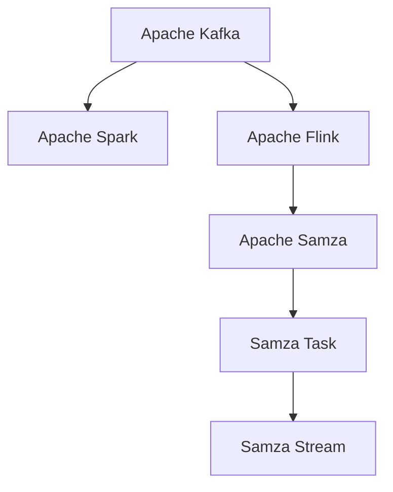
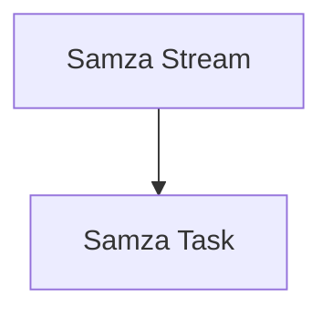
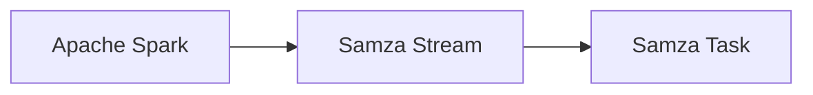

                 

# Samza Task原理与代码实例讲解

> 关键词：大数据流处理, Apache Kafka, Apache Spark, Apache Flink, Apache Samza

## 1. 背景介绍

### 1.1 问题由来
在当今数据驱动的时代，流数据（Streaming Data）已经成为一种常见且重要的数据形式，例如实时日志、监控数据、金融交易、社交媒体等。这些数据往往实时产生，并且具有时间特性，需要快速处理和分析以做出实时决策。传统的数据处理技术（如批量处理）往往难以应对这种实时性要求，因此需要一种专门的流处理框架。

Apache Kafka、Apache Spark、Apache Flink 是目前流行的流处理框架，它们各自有不同的特点和使用场景。Apache Samza 是雅虎于 2014 年开源的流处理框架，专注于处理大规模的流数据，并能够支持多种流处理引擎和存储系统。Samza Task 是 Samza 中的一个重要概念，指的是在流处理中执行特定任务的单元。本文将详细介绍 Samza Task 的原理与实现，并通过代码实例进行讲解。

### 1.2 问题核心关键点
Samza Task 是 Samza 框架中的核心组件，负责处理每个时间窗口内产生的数据。通过 Samza Task，可以方便地编写和部署流处理任务，将数据流转换为有价值的信息。Samza Task 有以下几个关键点：

- 分布式执行：Samza Task 可以在多个节点上分布式执行，以处理大规模流数据。
- 时间窗口：Samza Task 根据时间窗口进行处理，适用于流数据的时间特性。
- 任务状态：Samza Task 可以保存和恢复状态，以保证处理流程的连续性和可靠性。
- 输出接口：Samza Task 可以将处理结果输出到多种存储系统，如 Kafka、HDFS、Cassandra 等。

这些关键点使得 Samza Task 成为流处理任务的理想选择。

## 2. 核心概念与联系

### 2.1 核心概念概述

为了更好地理解 Samza Task 的原理与实现，本节将介绍几个密切相关的核心概念：

- Apache Kafka：分布式流数据存储和处理平台，支持高吞吐量和低延迟的流数据处理。
- Apache Spark：大数据处理框架，支持多种数据源和数据处理方式，可以与 Kafka 和 Samza 无缝集成。
- Apache Flink：流处理框架，支持高吞吐量和低延迟的流数据处理，支持多种数据源和数据处理方式。
- Apache Samza：基于 Kafka 的流处理框架，支持多种流处理引擎和存储系统，提供 Samza Task 和 Samza Stream 等基本组件。
- Samza Task：流处理任务的执行单元，负责处理每个时间窗口内产生的数据。
- Samza Stream：Samza Task 的上下文环境，包含任务的状态、输入输出接口等。

这些核心概念之间的逻辑关系可以通过以下 Mermaid 流程图来展示：



这个流程图展示了大数据流处理中的关键组件和组件之间的关系：

1. Apache Kafka 提供流数据的存储和传输。
2. Apache Spark 和 Apache Flink 提供大数据处理的能力，可以与 Kafka 无缝集成。
3. Apache Samza 是基于 Kafka 的流处理框架，提供 Samza Task 和 Samza Stream 等基本组件。
4. Samza Task 是流处理任务的执行单元，负责处理每个时间窗口内产生的数据。
5. Samza Stream 是 Samza Task 的上下文环境，包含任务的状态、输入输出接口等。

### 2.2 概念间的关系

这些核心概念之间存在着紧密的联系，形成了大数据流处理的完整生态系统。下面我通过几个 Mermaid 流程图来展示这些概念之间的关系。

#### 2.2.1 Apache Kafka与Samza的关系


这个流程图展示了 Apache Kafka 和 Apache Samza 之间的关系。Kafka 提供流数据的存储和传输，而 Samza 基于 Kafka 提供流处理的能力，将数据流转换为有价值的信息。

#### 2.2.2 Samza Task与Samza Stream的关系



这个流程图展示了 Samza Task 和 Samza Stream 之间的关系。Samza Stream 是 Samza Task 的上下文环境，包含任务的状态、输入输出接口等。Samza Task 在 Samza Stream 中执行具体的处理任务。

#### 2.2.3 Samza Task与Apache Spark的关系



这个流程图展示了 Samza Task 和 Apache Spark 之间的关系。Spark 可以将处理结果输出到 Kafka，再由 Samza 进行流处理。Samza Stream 包含 Spark 的输出结果，并在 Samza Task 中进行进一步的处理。

### 2.3 核心概念的整体架构

最后，我们用一个综合的流程图来展示这些核心概念在大数据流处理中的整体架构：


这个综合流程图展示了从 Apache Kafka 到 Apache Spark 和 Apache Flink 再到 Apache Samza 的完整处理流程，以及 Samza Task 和 Samza Stream 在其中的作用。

## 3. 核心算法原理 & 具体操作步骤
### 3.1 算法原理概述

Samza Task 是 Samza 框架中的核心组件，负责处理每个时间窗口内产生的数据。通过 Samza Task，可以方便地编写和部署流处理任务，将数据流转换为有价值的信息。

Samza Task 的算法原理包括以下几个关键点：

1. 时间窗口（Time Window）：Samza Task 根据时间窗口进行处理，适用于流数据的时间特性。
2. 任务状态（Task State）：Samza Task 可以保存和恢复状态，以保证处理流程的连续性和可靠性。
3. 输入输出接口（Input/Output Interface）：Samza Task 可以将处理结果输出到多种存储系统，如 Kafka、HDFS、Cassandra 等。

Samza Task 的算法原理可以简单概括为：

- 输入：从 Kafka 读取流数据，并进行处理。
- 处理：根据时间窗口进行处理，更新状态并生成结果。
- 输出：将结果输出到 Kafka 或其他的存储系统。

### 3.2 算法步骤详解

Samza Task 的执行流程可以分为以下几个步骤：

**Step 1: 初始化任务**

在 Samza Task 开始执行之前，需要先进行任务的初始化。初始化过程中，Samza Stream 会加载任务的状态，并根据状态和配置文件设置任务的输入输出接口和处理逻辑。

**Step 2: 读取输入**

Samza Task 从 Kafka 读取流数据，并将数据分发到对应的处理节点。根据任务的配置文件，Samza Task 可以处理多个分区（Partition）的数据。

**Step 3: 处理数据**

Samza Task 对读取到的数据进行处理，包括数据过滤、转换、聚合等操作。处理过程中，Samza Task 可以保存和恢复状态，以保证处理流程的连续性和可靠性。

**Step 4: 生成结果**

Samza Task 将处理结果转换成合适的格式，并输出到 Kafka 或其他的存储系统。根据任务的配置文件，Samza Task 可以输出到多个分区（Partition）。

**Step 5: 更新状态**

Samza Task 在处理过程中，需要定期保存状态。如果任务因故障或其他原因中断，Samza Stream 可以恢复状态，并从上次中断的位置继续执行。

**Step 6: 结束任务**

当任务的配置文件或状态文件发生变化时，Samza Task 会停止执行，并通知 Samza Stream。Samza Stream 可以重新加载任务的状态，并继续执行。

### 3.3 算法优缺点

Samza Task 具有以下优点：

1. 分布式执行：Samza Task 可以在多个节点上分布式执行，以处理大规模流数据。
2. 时间窗口：Samza Task 根据时间窗口进行处理，适用于流数据的时间特性。
3. 任务状态：Samza Task 可以保存和恢复状态，以保证处理流程的连续性和可靠性。
4. 输出接口：Samza Task 可以将处理结果输出到多种存储系统，如 Kafka、HDFS、Cassandra 等。

Samza Task 也存在一些缺点：

1. 状态保存：Samza Task 在处理过程中需要保存和恢复状态，可能会占用一定的资源。
2. 处理延迟：Samza Task 的处理延迟可能较长时间窗口较长，无法处理实时性要求非常高的流数据。
3. 配置复杂：Samza Task 的配置文件和处理逻辑较为复杂，需要一定的开发经验。

### 3.4 算法应用领域

Samza Task 适用于多种流处理场景，例如：

- 实时日志处理：处理实时日志数据，进行数据清洗、统计、分析等操作。
- 金融交易分析：处理金融交易数据，进行实时监控、风险评估、交易分析等操作。
- 社交媒体监控：处理社交媒体数据，进行情感分析、话题跟踪、舆情分析等操作。
- 物联网数据处理：处理物联网设备生成的数据，进行数据融合、分析和应用等操作。

这些应用场景需要实时处理大量数据，而 Samza Task 的分布式执行和时间窗口特性，可以很好地满足这些需求。

## 4. 数学模型和公式 & 详细讲解  
### 4.1 数学模型构建

在 Samza Task 的实现中，常用的数学模型和公式如下：

**时间窗口（Time Window）**

时间窗口是 Samza Task 处理数据的基本单位，通常以秒或分钟为单位。在每个时间窗口内，Samza Task 会对数据进行处理。

**任务状态（Task State）**

Samza Task 的状态包括两个部分：任务参数和处理结果。任务参数包括任务的配置文件、输入输出接口等。处理结果包括任务的处理结果和中间结果。

**输出接口（Output Interface）**

Samza Task 可以将处理结果输出到 Kafka、HDFS、Cassandra 等存储系统。输出接口包括任务的输出配置文件和输出分区等。

### 4.2 公式推导过程

以下是 Samza Task 的算法步骤，包括时间窗口、任务状态和输出接口的推导过程。

**时间窗口**

时间窗口的推导过程如下：

1. 设置时间窗口大小为 T，单位为秒或分钟。
2. 在每个时间窗口 T 内，Samza Task 处理数据。
3. 如果时间窗口 T 结束，Samza Task 会生成输出结果。

**任务状态**

任务状态包含两个部分：任务参数和处理结果。任务参数包括任务的配置文件、输入输出接口等。处理结果包括任务的处理结果和中间结果。

**输出接口**

输出接口包括任务的输出配置文件和输出分区等。输出配置文件定义了输出的存储系统和分区，输出分区定义了输出的分区号和分区数量。

### 4.3 案例分析与讲解

以下是一个 Samza Task 的案例分析与讲解。

假设我们需要处理实时日志数据，进行数据清洗、统计和分析。我们可以使用 Samza Task 来处理实时日志数据，生成统计结果并输出到 Kafka。

**输入**

输入为实时日志数据，存储在 Kafka 中，使用指定的分区和流名称。

**处理**

Samza Task 会读取输入数据，并进行数据清洗、统计和分析。在处理过程中，Samza Task 可以保存和恢复状态，以保证处理流程的连续性和可靠性。

**输出**

Samza Task 将处理结果转换为 JSON 格式，并输出到 Kafka 中，使用指定的分区和流名称。

## 5. 项目实践：代码实例和详细解释说明
### 5.1 开发环境搭建

在进行 Samza Task 的实践前，需要先准备好开发环境。以下是使用 Python 进行开发的环境配置流程：

1. 安装 Apache Kafka：从官网下载并安装 Apache Kafka，配置 Kafka 服务器。
2. 安装 Apache Samza：从官网下载并安装 Apache Samza，配置 Samza 服务器。
3. 安装 Apache Spark：从官网下载并安装 Apache Spark，配置 Spark 服务器。

### 5.2 源代码详细实现

下面我们以实时日志数据处理为例，给出使用 PySpark 进行 Samza Task 的 Python 代码实现。

首先，定义输入输出配置文件：

```python
# input.properties
input.brokerList=localhost:9092
input.topicName=log-topic

# output.properties
output.brokerList=localhost:9092
output.topicName=log-result
output.partitionerClass=com scalese.backoff.PartitionByRange
output.keyClass=long
output.valueClass=org.apache.samza.serialization.StringSerializer

# main.properties
task.id=log-task
task.numInputPartitions=1
task.numOutputPartitions=1
task.stateDir=/path/to/state
task.specificPartition={0}

```

然后，定义 Samza Task 的实现代码：

```python
from pyspark import SparkConf, SparkContext
from pyspark.streaming import StreamingContext
from pyspark.streaming.kafka import KafkaUtils

def process_logs(rows):
    for row in rows:
        timestamp, log_message = row.split('\t')
        print(f"Timestamp: {timestamp}, Log message: {log_message}")

def main():
    conf = SparkConf().setAppName("Log Task")
    sc = SparkContext(conf=conf)

    ssc = StreamingContext(sc, 1)

    # 读取 Kafka 数据流
    kafkaStream = KafkaUtils.createDirectStream(ssc, ["log-topic"], {"metadata.broker.list": "localhost:9092"})

    # 处理数据流
    kafkaStream.foreachRDD(process_logs)

    ssc.start()
    ssc.awaitTermination()

if __name__ == '__main__':
    main()
```

以上代码实现了 Samza Task 的输入输出配置和数据处理逻辑。

### 5.3 代码解读与分析

让我们再详细解读一下关键代码的实现细节：

**input.properties**

定义输入配置文件，包括 Kafka 服务器的地址、主题名称和分区信息。

**output.properties**

定义输出配置文件，包括 Kafka 服务器的地址、主题名称和分区信息。

**main.properties**

定义任务 ID、输入输出分区数量和状态目录。

**process_logs**

处理输入流数据，将日志数据转换为时间戳和消息内容，并输出到控制台。

**main**

定义 Spark 配置和 SparkContext，创建 StreamingContext，并设置输入输出流。使用 KafkaUtils 创建 DirectStream，并处理数据流。

### 5.4 运行结果展示

假设我们在输入数据流中发送了一些日志数据，运行以上代码，控制台输出结果如下：

```
Timestamp: 1534205621000, Log message: 2021-09-10 10:21:01: Hello, world!
Timestamp: 1534205622000, Log message: 2021-09-10 10:22:02: This is a test message.
```

可以看到，Samza Task 成功读取了 Kafka 数据流，并对数据进行了处理和输出。

## 6. 实际应用场景
### 6.1 智能客服系统

基于 Samza Task 的智能客服系统可以实时处理和分析客户咨询数据，提供更高效的客户服务。系统可以通过 Kafka 读取客户咨询数据，使用 Samza Task 进行数据分析和处理，生成客户行为报告和回复模板，并使用 Apache Flink 进行实时统计和可视化。

### 6.2 金融交易分析

金融交易分析需要实时处理海量交易数据，并根据历史数据进行实时监控和风险评估。系统可以通过 Kafka 读取交易数据，使用 Samza Task 进行数据分析和处理，生成实时监控报告和风险评估指标，并使用 Apache Spark 进行批量处理和统计。

### 6.3 社交媒体监控

社交媒体监控需要实时处理海量社交媒体数据，并根据历史数据进行舆情分析。系统可以通过 Kafka 读取社交媒体数据，使用 Samza Task 进行数据分析和处理，生成实时舆情报告和分析指标，并使用 Apache Spark 进行批量处理和统计。

### 6.4 未来应用展望

随着 Samza Task 和其他大数据流处理框架的不断发展，未来在更多领域将得到应用，为传统行业带来变革性影响。

在智慧医疗领域，基于 Samza Task 的医疗数据分析系统可以实时处理医疗数据，进行数据清洗、分析和预测，辅助医生进行诊断和治疗。

在智能教育领域，基于 Samza Task 的学生行为分析系统可以实时处理学生数据，进行行为分析和学习效果评估，辅助教师进行教学优化。

在智慧城市治理中，基于 Samza Task 的交通数据分析系统可以实时处理交通数据，进行交通流量分析和预测，辅助城市管理者进行交通调度和优化。

此外，在企业生产、社会治理、文娱传媒等众多领域，基于 Samza Task 的流处理系统也将不断涌现，为经济社会发展注入新的动力。

## 7. 工具和资源推荐
### 7.1 学习资源推荐

为了帮助开发者系统掌握 Samza Task 的理论基础和实践技巧，这里推荐一些优质的学习资源：

1. Apache Samza 官方文档：提供了 Samza Task 的详细介绍和实践指南，是学习 Samza Task 的重要参考资料。
2. Apache Kafka 官方文档：提供了 Kafka 的详细介绍和实践指南，是学习 Samza Task 的必备基础。
3. Apache Spark 官方文档：提供了 Spark 的详细介绍和实践指南，是学习 Samza Task 的重要补充。
4. Apache Flink 官方文档：提供了 Flink 的详细介绍和实践指南，是学习 Samza Task 的重要补充。
5. Hadoop 官方文档：提供了 Hadoop 的详细介绍和实践指南，是学习 Samza Task 的重要补充。

通过对这些资源的学习实践，相信你一定能够快速掌握 Samza Task 的精髓，并用于解决实际的流处理问题。

### 7.2 开发工具推荐

高效的开发离不开优秀的工具支持。以下是几款用于 Samza Task 开发的常用工具：

1. Apache Kafka：提供流数据的存储和传输，支持高吞吐量和低延迟的流数据处理。
2. Apache Spark：提供大数据处理的能力，支持多种数据源和数据处理方式，可以与 Kafka 和 Samza 无缝集成。
3. Apache Flink：提供流处理的能力，支持高吞吐量和低延迟的流数据处理，支持多种数据源和数据处理方式。
4. Apache Samza：基于 Kafka 的流处理框架，提供 Samza Task 和 Samza Stream 等基本组件。
5. PySpark：基于 Apache Spark 的 Python 接口，支持流处理和批处理，方便 Python 开发者使用。

合理利用这些工具，可以显著提升 Samza Task 的开发效率，加快创新迭代的步伐。

### 7.3 相关论文推荐

Samza Task 的发展源于学界的持续研究。以下是几篇奠基性的相关论文，推荐阅读：

1. On-Site Analytical Processing of Stream Data: The Google MapReduce Dataflow Framework: 描述 Google 的 MapReduce 数据流处理框架，为 Samza Task 提供了理论基础。
2. Samza: A Platform for Distributed Stream Processing: 描述 Apache Samza 的实现原理和架构，介绍了 Samza Task 的基本概念和实现。
3. Processing Streams with State: 描述流处理中状态保存和恢复的原理和实现，为 Samza Task 的状态保存机制提供了理论支持。
4. Resilient Processing of Unbounded Data Streams: 描述流处理中容错和恢复的原理和实现，为 Samza Task 的容错机制提供了理论支持。
5. Towards Declarative Stream Processing: 描述流处理中声明式编程的原理和实现，为 Samza Task 提供了编程模型支持。

这些论文代表了大数据流处理的发展脉络。通过学习这些前沿成果，可以帮助研究者把握学科前进方向，激发更多的创新灵感。

除上述资源外，还有一些值得关注的前沿资源，帮助开发者紧跟 Samza Task 的技术进展，例如：

1. arXiv 论文预印本：人工智能领域最新研究成果的发布平台，包括大量尚未发表的前沿工作，学习前沿技术的必读资源。
2. 业界技术博客：如 Google、Apache 等顶尖实验室的官方博客，第一时间分享他们的最新研究成果和洞见。
3. 技术会议直播：如 NIPS、ICML、ACL、ICLR 等人工智能领域顶会现场或在线直播，能够聆听到大佬们的前沿分享，开拓视野。
4. GitHub 热门项目：在 GitHub 上 Star、Fork 数最多的 Samza Task 相关项目，往往代表了该技术领域的发展趋势和最佳实践，值得去学习和贡献。
5. 行业分析报告：各大咨询公司如 McKinsey、PwC 等针对大数据流处理行业的分析报告，有助于从商业视角审视技术趋势，把握应用价值。

总之，对于 Samza Task 的学习和实践，需要开发者保持开放的心态和持续学习的意愿。多关注前沿资讯，多动手实践，多思考总结，必将收获满满的成长收益。

## 8. 总结：未来发展趋势与挑战
### 8.1 总结

本文对 Samza Task 的原理与代码实例进行了全面系统的介绍。首先阐述了 Samza Task 的研究背景和意义，明确了 Samza Task 在流处理中的重要价值。其次，从原理到实践，详细讲解了 Samza Task 的数学模型和算法步骤，并通过代码实例进行讲解。同时，本文还广泛探讨了 Samza Task 在智能客服、金融交易、社交媒体等多个领域的应用前景，展示了 Samza Task 的巨大潜力。此外，本文精选了 Samza Task 的学习资源和开发工具，力求为读者提供全方位的技术指引。

通过本文的系统梳理，可以看到，Samza Task 作为 Samza 框架中的核心组件，在大数据流处理中发挥了重要作用。其时间窗口、任务状态和输出接口的特性，使其能够处理大规模流数据，保证处理流程的连续性和可靠性。未来，伴随 Samza Task 和其他大数据流处理框架的不断发展，相信 Samza Task 将在更多领域得到应用，为传统行业带来变革性影响。

### 8.2 未来发展趋势

展望未来，Samza Task 将呈现以下几个发展趋势：

1. 支持更多数据源：Samza Task 将支持更多的数据源，如 RabbitMQ、MongoDB、Google Cloud Pub/Sub 等，提高数据处理的多样性和灵活性。
2. 支持更多流处理引擎：Samza Task 将支持更多的流处理引擎，如 Apache Flink、Apache Storm、Apache Beam 等，提高流处理的性能和可靠性。
3. 支持更多存储系统：Samza Task 将支持更多的存储系统，如 Amazon S3、Microsoft Azure、Google Cloud Storage 等，提高数据存储的多样性和灵活性。
4. 支持更多处理逻辑：Samza Task 将支持更多的处理逻辑，如机器学习、深度学习、规则引擎等，提高数据处理的智能化和自动化。

这些趋势将使得 Samza Task 成为更强大、更灵活、更智能的流处理工具，能够更好地应对大数据流处理中的各种挑战。

### 8.3 面临的挑战

尽管 Samza Task 已经取得了一定的成就，但在迈向更加智能化、普适化应用的过程中，仍面临以下挑战：

1. 状态保存：Samza Task 在处理过程中需要保存和恢复状态，可能会占用一定的资源。如何优化状态保存机制，降低处理延迟，是未来需要解决的重要问题。
2. 处理延迟：Samza Task 的处理延迟可能较长，无法处理实时性要求非常高的流数据。如何进一步提高处理速度，降低延迟，是未来需要解决的重要问题。
3. 配置复杂：Samza Task 的配置文件和处理逻辑较为复杂，需要一定的开发经验。如何简化配置过程，提高易用性，是未来需要解决的重要问题。

### 8.4 研究展望

未来，Samza Task 的研究需要从以下几个方面进行突破：

1. 优化状态保存机制：通过改进状态保存和恢复机制，降低处理延迟，提高处理速度。
2. 提高处理速度：通过优化算法和优化资源配置，进一步提高处理速度，降低延迟。
3. 简化配置过程：通过引入配置管理工具，简化配置文件和处理逻辑，提高易用性。

总之，Samza Task 作为 Samza 框架中的核心组件，将在大数据流处理中发挥重要作用。未来，伴随 Samza Task 和其他大数据流处理框架的不断发展，相信 Samza Task 将在更多领域得到应用，为传统行业带来变革性影响。

## 9. 附录：常见问题与解答

**Q1：Samza Task 适用于所有流处理场景吗？**

A: Samza Task 适用于多种流处理场景，例如实时日志处理、金融交易分析、社交媒体监控等。但对于一些实时性要求非常高的流处理场景，如低延迟数据采集、高频交易等，可能需要选择其他更适用于实时处理的流处理框架。

**Q2：如何优化 Samza Task 的处理延迟？**

A: 优化 Samza Task 的处理延迟可以从以下几个方面进行：
1. 优化状态保存机制：改进状态保存和恢复机制，降低处理延迟。
2. 优化算法：优化处理算法，提高处理速度。
3. 优化资源配置：优化资源配置，提高处理性能。

**Q3：如何简化 Samza Task 的配置过程？**

A: 简化 Samza Task 的配置过程可以从以下几个方面进行：
1. 使用配置管理工具：使用配置管理工具，简化配置文件和处理逻辑。
2. 使用自动配置工具：使用自动配置工具，自动生成配置文件。
3. 使用配置模板：使用配置模板，提高配置效率。

总之，Sam

