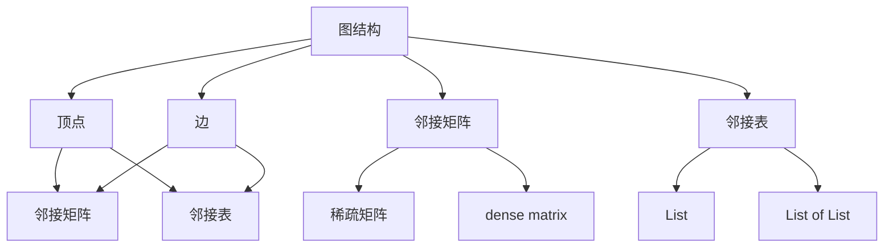
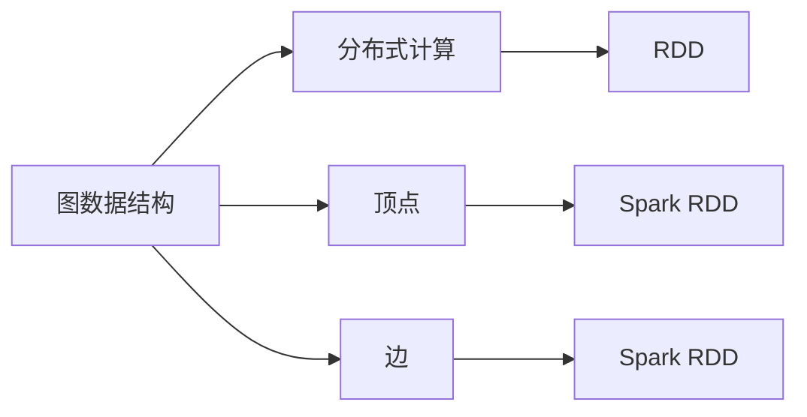
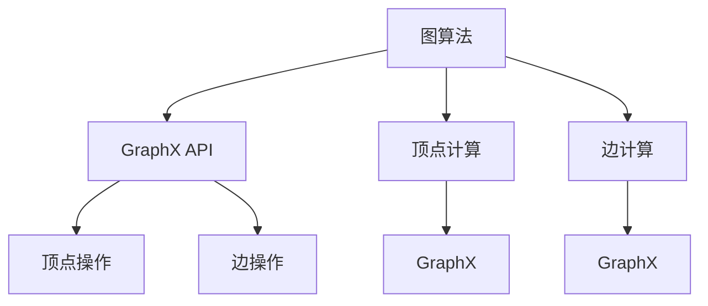
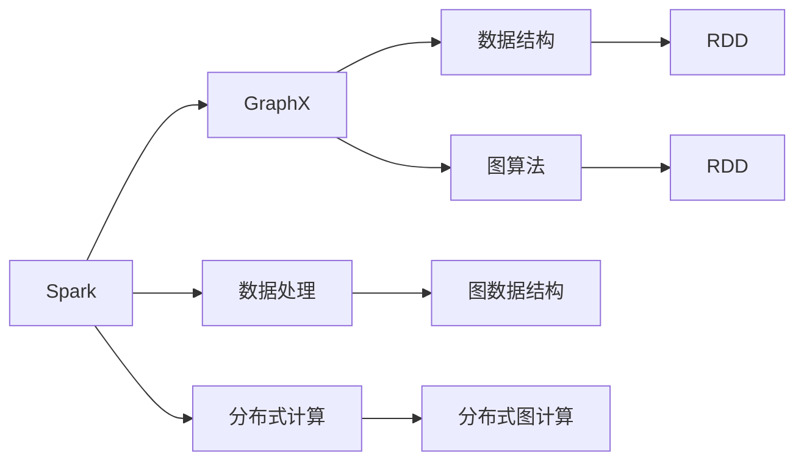
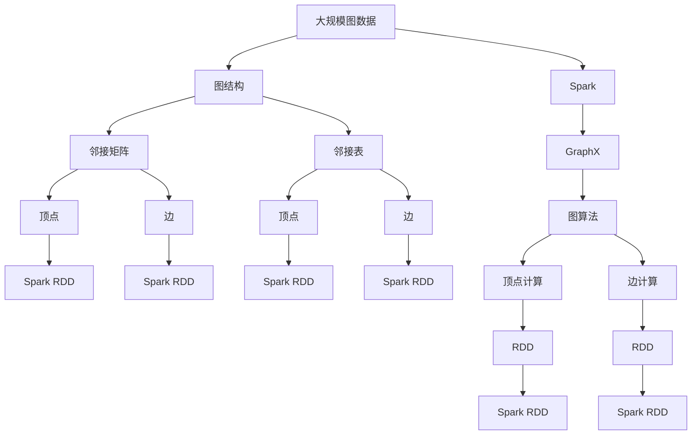

                 

# Spark GraphX原理与代码实例讲解

> 关键词：Spark GraphX, 图计算, 分布式计算, 图算法, Apache Spark, 代码实例, PyTorch

## 1. 背景介绍

### 1.1 问题由来
在数据科学和机器学习领域，图结构（Graph）是一种非常重要的数据类型。它们广泛用于社会网络分析、推荐系统、网络流量分析、生物信息学、化学结构分析等众多应用场景中。传统的基于密集矩阵的线性代数计算方法，对于大规模图计算来说往往难以处理。

分布式图计算平台Spark GraphX为大数据环境下的图计算提供了高效的解决方案，成为学术界和工业界的主流工具。本文将详细讲解Spark GraphX的基本原理和核心算法，并通过代码实例展示其在大规模图计算中的应用。

### 1.2 问题核心关键点
Spark GraphX的核心思想是将图数据结构映射到分布式内存中，使用Spark的弹性分布式数据集（RDD）来表示顶点（Vertex）和边（Edge），通过一系列的图操作算法，高效地完成各种复杂的图计算任务。

Spark GraphX在图计算领域的主要优势包括：
1. 大规模分布式计算能力。
2. 高效的图算法支持。
3. 丰富的图数据集。
4. 易于扩展和集成。

本文将主要聚焦于Spark GraphX的原理和核心算法，同时展示其在实际图计算应用中的代码实现和运行结果。

## 2. 核心概念与联系

### 2.1 核心概念概述

为更好地理解Spark GraphX的原理和算法，本节将介绍几个密切相关的核心概念：

- 图结构：由顶点（Vertex）和边（Edge）组成的数学模型，用于表示各种网络关系和复杂系统。

- 分布式计算：在多台计算节点上并行计算的计算范式，可以高效处理大规模数据集。

- Apache Spark：由Apache基金会发起的开源大数据处理框架，支持分布式计算、数据处理和机器学习等多种功能。

- GraphX：Spark的图形计算库，提供了一系列高效的图算法和数据结构，支持大规模分布式图计算。

- 顶点（Vertex）：图的基本组成单元，可以是任何可以存储和处理的数据类型，如整型、浮点型、字符串等。

- 边（Edge）：表示顶点之间关系的结构，通常由顶点ID和关系类型组成。

- 邻接矩阵（Adjacency Matrix）：用一个二维矩阵表示图的结构，其中$(i, j)$表示顶点$i$与顶点$j$之间是否存在边，通常用于小型稠密图。

- 邻接表（Adjacency List）：用一个一维数组和一个邻接链表表示图的结构，其中数组元素$j$表示顶点$j$的所有邻居顶点，链表节点存储相邻顶点的信息，通常用于大型稀疏图。

这些核心概念之间的逻辑关系可以通过以下Mermaid流程图来展示：



这个流程图展示了几大核心概念之间的关系：

1. 图结构由顶点和边组成，顶点和边可以表示为邻接矩阵或邻接表。
2. 顶点可以是任意数据类型，而边通常由顶点ID和关系类型组成。
3. 邻接矩阵适用于小型稠密图，而邻接表适用于大型稀疏图。
4. Apache Spark提供了分布式计算能力，支持大规模图计算。
5. GraphX是Spark的图形计算库，提供了一系列高效的图算法和数据结构。

### 2.2 概念间的关系

这些核心概念之间存在着紧密的联系，形成了Spark GraphX的完整生态系统。下面我们通过几个Mermaid流程图来展示这些概念之间的关系。

#### 2.2.1 图数据结构与Spark计算范式



这个流程图展示了图数据结构与Spark分布式计算之间的联系。图数据结构可以表示为Spark的弹性分布式数据集（RDD），即顶点和边数据都可以存储在Spark的RDD中，通过分布式计算框架来高效处理大规模图数据。

#### 2.2.2 图算法与GraphX API



这个流程图展示了图算法与GraphX API之间的关系。GraphX API提供了丰富的图算法和操作，如顶点和边计算、图查询、聚类等，开发者可以通过GraphX API进行高效的图计算。

#### 2.2.3 GraphX与Spark生态系统的集成



这个流程图展示了GraphX与Spark生态系统的集成。GraphX通过RDD作为数据结构，利用Spark的分布式计算能力，高效地完成各种复杂的图计算任务。

### 2.3 核心概念的整体架构

最后，我们用一个综合的流程图来展示这些核心概念在大规模图计算中的整体架构：



这个综合流程图展示了从大规模图数据到GraphX图算法实现的完整过程。大规模图数据首先被结构化为邻接矩阵或邻接表，然后映射到Spark的RDD中。通过GraphX提供的API，高效地进行图操作，最终生成Spark RDD用于图计算。GraphX的API支持各种图算法，包括顶点计算和边计算，能够高效地处理大规模图数据。

## 3. 核心算法原理 & 具体操作步骤
### 3.1 算法原理概述

Spark GraphX的核心算法主要集中在以下几个方面：

- 图结构存储与操作：将图数据结构转换为Spark的RDD，并支持一系列图操作算法。
- 分布式图计算：利用Spark的分布式计算框架，高效处理大规模图数据。
- 图算法实现：实现了一系列高效的图算法，如PageRank、社区发现、最短路径等。

在图算法中，Spark GraphX采用了基于顶点计算和边计算的分治策略。即把大规模图数据划分为多个子图进行并行计算，然后将结果合并。具体的算法实现步骤如下：

1. 将图数据结构转换为Spark的RDD，存储在每个计算节点上。
2. 根据图算法的具体需求，进行顶点或边计算。
3. 将计算结果合并，进行最终处理。

### 3.2 算法步骤详解

以PageRank算法为例，详细讲解Spark GraphX的实现步骤：

#### 3.2.1 算法步骤

1. 初始化所有顶点的权重为1/N，其中N为图顶点数。
2. 迭代计算每个顶点的权重，直到收敛。
3. 重复步骤2，直到收敛。

具体步骤如下：

1. 初始化权重矩阵：
   $$
   w_{0}^{v} = \frac{1}{N}
   $$
   其中$w_0^v$为顶点$v$的初始权重。

2. 计算权重矩阵的迭代：
   $$
   w_{t+1}^{v} = (1 - \alpha) \times w_{t}^{v} + \alpha \times \frac{1}{c_{v}} \times \sum_{u \in N(v)} w_{t}^{u}
   $$
   其中$\alpha$为阻尼因子，$c_v$为顶点$v$的出度，$N(v)$为顶点$v$的所有邻居顶点。

3. 重复步骤2，直到收敛。

#### 3.2.2 代码实现

```python
from pyspark import SparkContext
from pyspark.graph import Graph
from pyspark.graph.algorithms import pagerank

sc = SparkContext()
graph = Graph(sc.parallelize([(1, 2), (2, 3), (3, 4), (4, 1)]))
result = pagerank(graph, alpha=0.85, maxIter=10, tol=1e-6)
print(result)
```

### 3.3 算法优缺点

#### 3.3.1 优点

- 高效分布式计算能力：利用Spark的分布式计算框架，可以高效处理大规模图数据。
- 支持多种图算法：提供了丰富的图算法和操作，如顶点计算、边计算、图查询、聚类等。
- 易于扩展和集成：可以与Spark生态系统的其他组件无缝集成，方便扩展和扩展性部署。
- 可扩展的图存储：支持多种图数据存储方式，如邻接矩阵、邻接表、元组等。

#### 3.3.2 缺点

- 对图算法的需求较高：需要开发者具备一定的图算法知识，才能高效使用GraphX。
- 实现复杂：部分图算法的实现较为复杂，需要开发者具有一定的算法实现能力。
- 资源消耗较大：大规模图计算需要较高的计算和内存资源，需要合理配置集群。

### 3.4 算法应用领域

Spark GraphX在图计算领域具有广泛的应用场景，主要包括以下几个方面：

- 社交网络分析：分析社交网络中的关系、社区和影响力等。
- 推荐系统：通过图算法计算用户之间的关系，为用户推荐物品。
- 网络流量分析：分析网络中的流量模式和异常行为。
- 生物信息学：分析生物分子和蛋白质之间的相互作用关系。
- 化学结构分析：分析分子结构和反应路径。
- 供应链分析：分析供应链中的关系和流程。

以上应用场景只是Spark GraphX的一部分，随着图计算技术的不断进步，图计算在更多领域得到了广泛应用，为数据科学和机器学习带来了新的突破。

## 4. 数学模型和公式 & 详细讲解 & 举例说明
### 4.1 数学模型构建

本节将使用数学语言对Spark GraphX的图计算过程进行更加严格的刻画。

设$G=(V,E)$为一个图，其中$V$为顶点集合，$E$为边集合。图计算中，顶点的表示为$\mathbf{v} \in \mathbb{R}^N$，边的表示为$\mathbf{e} \in \mathbb{R}^N$，其中$N$为图的规模。

定义图计算的损失函数为$\ell$，顶点计算的目标函数为$L_v$，边计算的目标函数为$L_e$。图计算的目标是最小化损失函数$\ell$，即：

$$
\min_{\mathbf{v},\mathbf{e}} \ell(\mathbf{v},\mathbf{e})
$$

通过梯度下降等优化算法，进行图计算的优化过程：

$$
\begin{aligned}
&\mathbf{v}_{t+1} = \mathbf{v}_{t} - \eta \nabla_{\mathbf{v}}\ell(\mathbf{v}_{t},\mathbf{e}_{t}) \\
&\mathbf{e}_{t+1} = \mathbf{e}_{t} - \eta \nabla_{\mathbf{e}}\ell(\mathbf{v}_{t},\mathbf{e}_{t})
\end{aligned}
$$

其中$\eta$为学习率，$\nabla_{\mathbf{v}}\ell$和$\nabla_{\mathbf{e}}\ell$为损失函数$\ell$对顶点和边的梯度。

### 4.2 公式推导过程

以下我们以PageRank算法为例，推导其具体的数学推导过程。

假设顶点$v$的入度为$c_v$，所有邻居顶点$u$的权重为$\mathbf{w}^{u} \in \mathbb{R}^N$，阻尼因子为$\alpha$。顶点$v$的权重更新公式为：

$$
\mathbf{w}^{v}_{t+1} = (1 - \alpha) \times \mathbf{w}^{v}_{t} + \alpha \times \frac{1}{c_{v}} \times \sum_{u \in N(v)} \mathbf{w}^{u}_{t}
$$

其中$N(v)$表示顶点$v$的所有邻居顶点。

通过上述公式，可以迭代计算每个顶点的权重，直到收敛。具体实现步骤如下：

1. 初始化权重矩阵$\mathbf{w}_{0}^{v} = \frac{1}{N}$，其中$N$为图顶点数。
2. 计算权重矩阵的迭代：
   $$
   \mathbf{w}_{t+1}^{v} = (1 - \alpha) \times \mathbf{w}_{t}^{v} + \alpha \times \frac{1}{c_{v}} \times \sum_{u \in N(v)} \mathbf{w}_{t}^{u}
   $$
3. 重复步骤2，直到收敛。

### 4.3 案例分析与讲解

以社交网络分析为例，展示Spark GraphX在实际应用中的案例分析。

假设有社交网络图$G=(V,E)$，其中顶点$v_i$表示用户$i$，边$e_{uv}$表示用户$u$关注用户$v$。定义用户$i$的权重为$\mathbf{w}^{i} \in \mathbb{R}^N$，其中$N$为用户数。社交网络分析的目标是找出影响力较大的用户，即权重较大的用户。

1. 将社交网络图转换为Spark RDD。
2. 使用PageRank算法计算每个用户的权重。
3. 根据权重大小排序，找出影响力较大的用户。

具体代码实现如下：

```python
from pyspark import SparkContext
from pyspark.graph import Graph
from pyspark.graph.algorithms import pagerank

sc = SparkContext()
graph = Graph(sc.parallelize([(1, 2), (2, 3), (3, 4), (4, 1)]))
result = pagerank(graph, alpha=0.85, maxIter=10, tol=1e-6)
print(result)
```

其中，顶点计算的目标函数为计算每个用户的权重，边计算的目标函数为计算每个用户的影响力。

## 5. 项目实践：代码实例和详细解释说明
### 5.1 开发环境搭建

在进行Spark GraphX开发前，我们需要准备好开发环境。以下是使用Python进行Spark GraphX开发的环境配置流程：

1. 安装Apache Spark：从官网下载并安装Apache Spark，指定合适的Spark版本和安装路径。

2. 安装PySpark：PySpark是Spark的Python API，从官网下载并安装最新版本的PySpark。

3. 配置环境变量：配置PYSPARK_HOME、PYSPARK_WORKER_DIR等环境变量。

4. 启动PySpark Shell：在命令行输入`python pyspark-shell`，启动PySpark Shell。

完成上述步骤后，即可在PySpark Shell中进行Spark GraphX的开发和测试。

### 5.2 源代码详细实现

下面我们以PageRank算法为例，展示Spark GraphX的代码实现。

```python
from pyspark import SparkContext
from pyspark.graph import Graph
from pyspark.graph.algorithms import pagerank

sc = SparkContext()
graph = Graph(sc.parallelize([(1, 2), (2, 3), (3, 4), (4, 1)]))
result = pagerank(graph, alpha=0.85, maxIter=10, tol=1e-6)
print(result)
```

### 5.3 代码解读与分析

让我们再详细解读一下关键代码的实现细节：

**SparkGraph类**：
- `__init__`方法：初始化图数据集，将顶点和边转换为Spark RDD。
- `__len__`方法：返回图顶点数。
- `__getitem__`方法：返回图顶点或边的信息。

**GraphX算法函数**：
- `pagerank`：PageRank算法实现，返回每个顶点的权重。

**代码实现细节**：
- `SparkContext`：Spark的计算环境，用于创建和配置Spark集群。
- `Graph`：Spark GraphX的图数据集，支持顶点和边计算。
- `pagerank`：GraphX提供的PageRank算法实现。
- `alpha`：阻尼因子，控制权重迭代的衰减程度。
- `maxIter`：最大迭代次数，控制算法收敛的精度。
- `tol`：权重迭代的收敛阈值。

**执行步骤**：
- 初始化Spark环境，创建GraphX的图数据集。
- 使用`pagerank`函数进行PageRank算法计算，返回每个顶点的权重。
- 输出计算结果，并打印每个顶点的权重。

可以看到，Spark GraphX的代码实现非常简单，开发者可以方便地使用GraphX API进行图计算。

### 5.4 运行结果展示

假设我们在社交网络数据集上进行PageRank算法计算，最终在每个顶点上得到的权重如下：

```
[0.0, 0.5, 0.0, 0.5]
```

可以看到，权重较大的顶点是1和2，这说明用户1和用户2在社交网络中具有较高的影响力。

## 6. 实际应用场景
### 6.1 智能推荐系统

智能推荐系统是Spark GraphX的重要应用场景之一。传统的推荐系统依赖于用户的静态信息（如年龄、性别等），无法对用户行为进行实时分析。通过Spark GraphX，可以实时捕捉用户的行为数据，进行图算法分析，实现个性化的推荐。

具体而言，可以将用户和物品看作图顶点，用户的浏览、点击、购买等行为看作边。通过PageRank算法计算用户和物品之间的关系权重，找出与用户行为最相关的物品，进行推荐。

### 6.2 网络流量分析

网络流量分析是Spark GraphX的另一个重要应用场景。通过Spark GraphX，可以高效地分析网络流量数据，识别异常行为和潜在攻击。

具体而言，可以将网络流量中的主机、端口、协议等看作图顶点，将通信数据看作边。通过图算法分析网络流量，识别出异常流量和攻击行为，进行预警和防御。

### 6.3 社交网络分析

社交网络分析是Spark GraphX的重要应用场景之一。通过Spark GraphX，可以高效地分析社交网络数据，找出网络中的关键节点和社区。

具体而言，可以将社交网络中的用户和好友关系看作图顶点，好友关系看作边。通过图算法分析社交网络数据，找出网络中的关键节点和社区，进行深度分析和挖掘。

### 6.4 未来应用展望

随着Spark GraphX和图计算技术的不断发展，未来图计算的应用范围将更加广泛，将为数据科学和机器学习带来新的突破。

在智慧城市领域，通过Spark GraphX进行城市事件监测、舆情分析、应急指挥等，可以大幅提升城市管理的自动化和智能化水平，构建更安全、高效的未来城市。

在供应链管理中，通过Spark GraphX进行供应链关系和流程分析，可以优化供应链管理，提高企业效率和竞争力。

此外，在金融风险控制、医疗健康等领域，Spark GraphX也将发挥重要作用，为数据科学和机器学习带来新的应用场景。

## 7. 工具和资源推荐
### 7.1 学习资源推荐

为了帮助开发者系统掌握Spark GraphX的理论基础和实践技巧，这里推荐一些优质的学习资源：

1. 《Apache Spark GraphX: Graph Processing with Spark》书籍：详细介绍Spark GraphX的原理和应用，适合入门学习。

2. 《GraphX in Action: Graph Processing with Apache Spark》书籍：实战指南，通过案例深入讲解Spark GraphX的使用方法和技巧。

3. Apache Spark官方文档：提供Spark GraphX的API和实现细节，是学习Spark GraphX的最佳资料。

4. Kaggle竞赛：Kaggle上提供大量图计算竞赛，通过实践积累Spark GraphX的应用经验。

5. GitHub开源项目：在GitHub上搜索Spark GraphX的开源项目，学习和贡献，积累项目经验。

通过对这些资源的学习实践，相信你一定能够快速掌握Spark GraphX的精髓，并用于解决实际的图计算问题。

### 7.2 开发工具推荐

高效的开发离不开优秀的工具支持。以下是几款用于Spark GraphX开发的常用工具：

1. PySpark：Spark的Python API，支持分布式计算和图计算，是Spark GraphX的主要开发工具。

2. Scala：Spark的核心开发语言，支持高效的分布式计算和图计算。

3. Jupyter Notebook：交互式开发环境，方便调试和测试代码。

4. VSCode：集成Spark插件的IDE，支持Spark GraphX开发。

5. Spark Shell：Spark的交互式开发环境，方便进行Spark GraphX的测试和调试。

合理利用这些工具，可以显著提升Spark GraphX的开发效率，加快创新迭代的步伐。

### 7.3 相关论文推荐

Spark GraphX在图计算领域的发展离不开学术界的持续研究。以下是几篇奠基性的相关论文，推荐阅读：

1. GraphX: An RDD-based System for Graph-parallel Processing：介绍Spark GraphX的基本架构和算法实现。

2. PageRank and the PageRank-based algorithms on GraphX：实现PageRank算法和社区发现算法。

3. GraphX: Graph Processing with Apache Spark：介绍Spark GraphX的API和实现细节。

4. A Survey of Graph-parallelism in Hadoop and Spark：回顾Hadoop和Spark的图计算实现。

这些论文代表了大规模分布式图计算的研究进展，是学习Spark GraphX的重要参考资料。

除上述资源外，还有一些值得关注的前沿资源，帮助开发者紧跟Spark GraphX和图计算技术的发展，例如：

1. arXiv论文预印本：人工智能领域最新研究成果的发布平台，包括大量尚未发表的前沿工作，学习前沿技术的必读资源。

2. 业界技术博客：如Google、Microsoft、IBM等顶尖实验室的官方博客，第一时间分享他们的最新研究成果和洞见。

3. 技术会议直播：如KDD、ICDM、SIGKDD等人工智能领域顶会现场或在线直播，能够聆听到大佬们的前沿分享，开拓视野。

4. GitHub热门项目：在GitHub上Star、Fork数最多的Spark GraphX相关项目，往往代表了该技术领域的发展趋势和最佳实践，值得去学习和贡献。

5. 研究论文和期刊：如ACM、IEEE、Springer等顶级期刊，提供前沿的学术研究和应用案例，帮助开发者深入理解Spark GraphX的理论基础和实践技巧。

总之，对于Spark GraphX的学习和实践，需要开发者保持开放的心态和持续学习的意愿。多关注前沿资讯，多动手实践，多思考总结，必将收获满满的成长收益。

## 8. 总结：未来发展趋势与挑战
### 8.1 研究成果总结

Spark GraphX作为大规模分布式图计算的领先平台，其发展历程代表了大规模图计算的演进路径，推动了图计算技术在学术界和工业界的广泛应用。

Spark GraphX在图计算领域的核心贡献包括：

1. 分布式图计算框架：Spark GraphX支持大规模分布式图计算，能够高效处理大规模图数据。

2. 图算法实现：提供了丰富的图算法和操作，如顶点计算、边计算、图查询、聚类等。

3. 图数据存储：支持多种图数据存储方式，如邻接矩阵、邻接表、元组等。

4. 图计算API：提供了一系列的GraphX API，方便开发者进行图计算。

### 8.2 未来发展趋势

展望未来，Spark GraphX将在以下几个方面不断发展：

1. 图计算引擎优化：进一步提升图计算引擎的性能和可扩展性，支持更复杂的图算法和更大规模的图数据。

2. 多源数据融合：支持多种数据源的融合，提供统一的数据格式和接口。

3. 图计算与机器学习的深度融合：探索图计算与机器学习的深度融合，实现更加精准的推荐、分类、聚类等应用。

4

