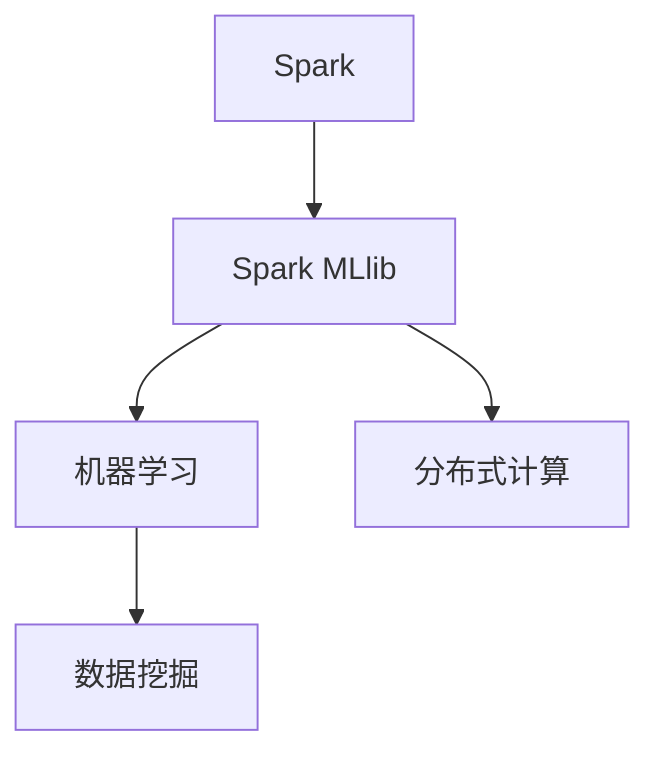
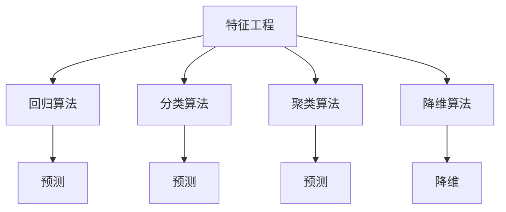
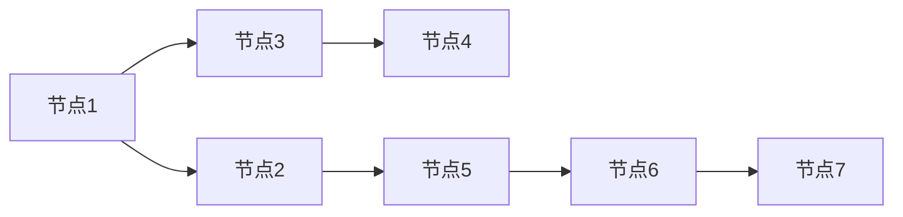
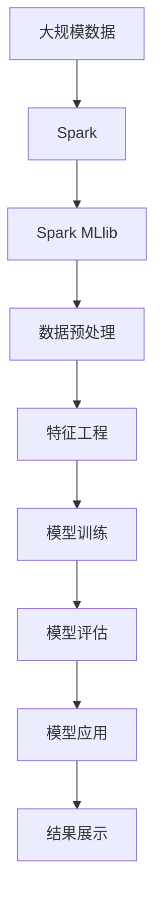

                 

# Spark MLlib原理与代码实例讲解

> 关键词：Spark, MLlib, 机器学习, 数据处理, 机器学习算法, 分布式计算, 数据挖掘

## 1. 背景介绍

### 1.1 问题由来
在当今数据驱动的互联网时代，大数据分析与机器学习成为了驱动技术创新和商业价值的核心力量。尤其是随着Spark平台的兴起，其Spark MLlib库成为了分布式机器学习领域的一股重要力量。Spark MLlib不仅支持常见的机器学习算法，还能处理大规模数据，具有高并发、高效率的特点，使其在数据挖掘、推荐系统、广告定向等领域得到了广泛应用。

### 1.2 问题核心关键点
Spark MLlib的核心是实现了一系列常见的机器学习算法，包括回归、分类、聚类、降维等，并支持分布式计算，能够在大规模数据集上高效地进行模型训练和预测。Spark MLlib的优点在于其高度优化的计算引擎和丰富的算法库，能够应对大数据时代的各种复杂挑战。

Spark MLlib的核心算法主要有以下几个方面：
1. 基于决策树的随机森林算法。
2. 基于梯度下降的线性回归和逻辑回归算法。
3. 基于主成分分析的降维算法。
4. 基于聚类分析的K-Means算法。
5. 基于SVM和Adaboost的分类算法。

这些算法在Spark MLlib中得到了高效的实现，并且可以通过Spark的分布式计算框架进行并行处理，大大提高了算法处理大规模数据的能力。

### 1.3 问题研究意义
研究Spark MLlib库，对于提升大数据分析的效率和机器学习的精度，具有重要意义：

1. 提高数据处理效率：Spark MLlib能够在大规模数据集上高效运行，缩短模型训练和预测的时间。
2. 提升算法精度：Spark MLlib实现了多种先进的机器学习算法，能够帮助用户选择最适合的算法。
3. 支持分布式计算：Spark MLlib的分布式计算框架，能够充分利用集群资源，提高算法的并行计算能力。
4. 简化算法实现：Spark MLlib提供了丰富的API接口，使得用户可以快速实现复杂的机器学习模型。
5. 优化算法性能：Spark MLlib通过分布式计算和算法优化，能够提升算法在大型数据集上的处理效率和准确性。

## 2. 核心概念与联系

### 2.1 核心概念概述

为更好地理解Spark MLlib的核心概念，本节将介绍几个密切相关的核心概念：

- Spark：Apache Spark是一个快速、通用、可扩展的大数据处理引擎，支持分布式计算和内存计算，适用于大规模数据集的处理。
- Spark MLlib：Spark MLlib是Spark的机器学习库，提供了一系列常见的机器学习算法，包括回归、分类、聚类、降维等，并支持分布式计算。
- 机器学习：一种通过数据挖掘和模型训练来预测未知数据的算法，通过学习数据中的规律，实现对未知数据的预测。
- 分布式计算：一种基于集群计算的计算模式，能够在多个计算节点上并行处理大规模数据集，提升计算效率。
- 数据挖掘：通过机器学习算法从大规模数据集中提取有价值的信息和规律，帮助用户进行数据分析和决策。

这些核心概念之间的逻辑关系可以通过以下Mermaid流程图来展示：



这个流程图展示了大数据处理和机器学习的关系：

1. 数据处理使用Spark平台。
2. Spark MLlib是Spark的一个库，专门用于机器学习。
3. 机器学习通过数据挖掘算法提取数据中的规律，辅助用户进行决策。
4. 分布式计算是Spark MLlib实现高效计算的核心技术。

### 2.2 概念间的关系

这些核心概念之间存在着紧密的联系，形成了Spark MLlib的核心生态系统。下面我通过几个Mermaid流程图来展示这些概念之间的关系。

#### 2.2.1 Spark MLlib的数据流图


这个流程图展示了Spark MLlib处理数据的流程：

1. 数据预处理：清洗、去重、归一化等数据处理工作。
2. 特征工程：提取、转换、组合特征，增强模型的泛化能力。
3. 模型训练：使用机器学习算法训练模型。
4. 模型评估：对训练好的模型进行测试和评估。
5. 模型应用：使用训练好的模型进行预测和分析。

#### 2.2.2 机器学习算法架构



这个流程图展示了Spark MLlib中常见的机器学习算法：

1. 回归算法：通过回归模型预测数值型数据。
2. 分类算法：通过分类模型预测离散型数据。
3. 聚类算法：通过聚类模型将数据分组。
4. 降维算法：通过降维技术减少数据的维度和计算量。

#### 2.2.3 分布式计算架构



这个流程图展示了Spark MLlib的分布式计算架构：

1. 集群中的每个节点都承担计算任务。
2. 数据被分割成多个数据块，并行处理。
3. 数据块在集群中分布式存储和计算。
4. 计算结果通过网络传输到各个节点，并汇总。

### 2.3 核心概念的整体架构

最后，我们用一个综合的流程图来展示这些核心概念在Spark MLlib中的整体架构：



这个综合流程图展示了Spark MLlib的核心流程：

1. 大规模数据通过Spark处理。
2. Spark MLlib进行数据预处理和特征工程。
3. 使用机器学习算法进行模型训练。
4. 对训练好的模型进行评估。
5. 应用模型进行预测和分析。
6. 展示最终结果。

通过这些流程图，我们可以更清晰地理解Spark MLlib的核心概念和流程，为后续深入讨论具体的算法和实现奠定基础。

## 3. 核心算法原理 & 具体操作步骤
### 3.1 算法原理概述

Spark MLlib的核心算法主要有以下几个方面：

1. 基于决策树的随机森林算法。
2. 基于梯度下降的线性回归和逻辑回归算法。
3. 基于主成分分析的降维算法。
4. 基于聚类分析的K-Means算法。
5. 基于SVM和Adaboost的分类算法。

这里以随机森林算法为例，介绍其核心原理。

### 3.2 算法步骤详解

随机森林是一种基于决策树的集成学习方法，其主要思想是使用多个随机生成的决策树进行集成，从而提高模型的准确性和鲁棒性。以下是随机森林算法的详细步骤：

1. 数据预处理：对数据进行清洗、去重、归一化等预处理工作，使得数据适合进行模型训练。

2. 随机特征选择：从数据集中随机选择一些特征，用于训练多个决策树。每个决策树只使用一小部分特征，可以避免过拟合。

3. 随机生成决策树：使用随机选择的特征和随机生成的样本进行训练，生成多个决策树。每个决策树都是独立的，具有随机性。

4. 集成多个决策树：将多个决策树进行集成，可以使用投票、平均等方法，得到最终的预测结果。

5. 模型评估：使用测试集对模型进行评估，计算准确率、召回率、F1值等指标，判断模型的性能。

6. 模型应用：使用训练好的随机森林模型进行预测和分析。

### 3.3 算法优缺点

Spark MLlib中的随机森林算法具有以下优点：

1. 高准确性：通过集成多个决策树，随机森林可以避免过拟合，提高模型的准确性。
2. 高鲁棒性：随机森林的随机性和多样性可以抵御数据中的噪音和干扰，提高模型的鲁棒性。
3. 可解释性：每个决策树都是独立的，可以通过可视化方法解释模型决策过程。
4. 高效性：Spark MLlib实现了高效的并行计算，能够在大规模数据集上快速处理。

同时，随机森林算法也存在一些缺点：

1. 模型复杂：随机森林模型较为复杂，训练和调参难度较高。
2. 计算量大：随机森林算法需要训练多个决策树，计算量较大。
3. 不适用处理时间序列数据：随机森林算法不能处理时间序列数据，需要与其他算法结合使用。

### 3.4 算法应用领域

Spark MLlib中的随机森林算法在以下几个领域得到了广泛应用：

1. 金融风险评估：金融领域使用随机森林算法进行信用评估、贷款风险评估等。
2. 医疗诊断：医疗领域使用随机森林算法进行疾病诊断、风险预测等。
3. 电商推荐：电商领域使用随机森林算法进行用户推荐、商品推荐等。
4. 广告定向：广告领域使用随机森林算法进行用户定向、广告投放等。
5. 客户细分：客户细分领域使用随机森林算法进行客户分类、营销策略优化等。

这些领域的应用展示了随机森林算法的广泛性和实用性，有助于用户更好地理解和应用随机森林算法。

## 4. 数学模型和公式 & 详细讲解 & 举例说明

### 4.1 数学模型构建

随机森林算法的主要数学模型基于决策树。每个决策树都是一个基于特征值和属性值的分类器，能够对数据进行分割和分类。

随机森林算法的主要数学模型可以表示为：

$$
\mathcal{M} = \{T_1, T_2, \ldots, T_n\}
$$

其中，$T_i$表示第$i$棵决策树。随机森林算法的预测函数可以表示为：

$$
\hat{y}(x) = \frac{1}{n}\sum_{i=1}^n T_i(x)
$$

其中，$x$表示输入数据，$\hat{y}(x)$表示预测结果。

### 4.2 公式推导过程

以随机森林算法为例，介绍其公式推导过程。

假设训练数据集为$D = \{(x_i, y_i)\}_{i=1}^N$，其中$x_i$表示输入特征，$y_i$表示标签。

设随机森林中的第$i$棵决策树的预测结果为$T_i(x)$，则随机森林算法的预测结果为：

$$
\hat{y}(x) = \frac{1}{n}\sum_{i=1}^n T_i(x)
$$

其中，$n$表示随机森林中的决策树数量。

对于每个决策树$T_i$，其预测结果可以表示为：

$$
T_i(x) = 
\begin{cases}
1, & \text{如果}\ x_i \in \mathcal{D}_i \\
0, & \text{如果}\ x_i \notin \mathcal{D}_i
\end{cases}
$$

其中，$\mathcal{D}_i$表示第$i$棵决策树的决策区域。

### 4.3 案例分析与讲解

以一个简单的示例来解释随机森林算法的实现过程：

假设训练数据集为$D = \{(x_i, y_i)\}_{i=1}^5$，其中$x_i = [x_{i1}, x_{i2}]$，$y_i \in \{0, 1\}$。

首先，从数据集中随机选择10个特征，每个特征都有30%的概率被选择。然后，随机生成5棵决策树，每棵树只使用一部分随机选择的特征和数据。

接着，使用每棵决策树对测试数据进行分类，得到5个分类结果，计算平均分类结果，得到最终预测结果。

## 5. 项目实践：代码实例和详细解释说明
### 5.1 开发环境搭建

在进行Spark MLlib项目实践前，我们需要准备好开发环境。以下是使用Python进行PySpark开发的环境配置流程：

1. 安装Anaconda：从官网下载并安装Anaconda，用于创建独立的Python环境。

2. 创建并激活虚拟环境：
```bash
conda create -n pyspark-env python=3.8 
conda activate pyspark-env
```

3. 安装Spark：根据CUDA版本，从官网获取对应的安装命令。例如：
```bash
conda install spark=3.2.0 py38
```

4. 安装PySpark：安装Spark的Python API，方便使用Spark的机器学习库。

5. 安装必要的依赖包：
```bash
pip install numpy pandas scikit-learn pyspark
```

完成上述步骤后，即可在`pyspark-env`环境中开始Spark MLlib项目实践。

### 5.2 源代码详细实现

下面我们以随机森林算法为例，给出使用PySpark进行模型训练和预测的代码实现。

首先，定义随机森林模型的参数和训练数据：

```python
from pyspark.ml.classification import RandomForestClassifier
from pyspark.ml.feature import VectorAssembler
from pyspark.ml.evaluation import MulticlassClassificationEvaluator
from pyspark.sql import SparkSession

# 创建Spark会话
spark = SparkSession.builder.appName("RandomForestExample").getOrCreate()

# 加载训练数据集
train_data = spark.read.format("csv").option("header","true").load("train_data.csv")

# 定义特征和标签列
features = ["x1", "x2", "x3", "x4", "x5"]
label = "y"

# 将特征列组装成向量
assembler = VectorAssembler(inputCols=features, outputCol="features")
data = assembler.transform(train_data)

# 训练随机森林模型
rf = RandomForestClassifier(featuresCol="features", labelCol=label, numTrees=10)
model = rf.fit(data)
```

然后，在测试数据集上对模型进行评估：

```python
# 加载测试数据集
test_data = spark.read.format("csv").option("header","true").load("test_data.csv")

# 组装测试数据
test_data = assembler.transform(test_data)

# 使用模型进行预测
prediction = model.transform(test_data)

# 评估模型性能
evaluator = MulticlassClassificationEvaluator(labelCol="label", predictionCol="prediction", metricName="accuracy")
accuracy = evaluator.evaluate(prediction)

print("Accuracy:", accuracy)
```

以上代码实现了从数据加载到模型训练、预测和评估的全过程，展示了随机森林算法的核心实现。

### 5.3 代码解读与分析

让我们再详细解读一下关键代码的实现细节：

**Spark MLlib的机器学习库**：
- 使用Spark MLlib中的`RandomForestClassifier`类实现随机森林算法。
- 使用`VectorAssembler`类将特征列组装成向量。
- 使用`MulticlassClassificationEvaluator`类评估模型性能。

**训练随机森林模型**：
- 加载训练数据集，并定义特征列和标签列。
- 使用`VectorAssembler`类将特征列组装成向量。
- 使用`RandomForestClassifier`类训练随机森林模型。

**测试模型性能**：
- 加载测试数据集，并使用`VectorAssembler`类将特征列组装成向量。
- 使用训练好的模型进行预测。
- 使用`MulticlassClassificationEvaluator`类评估模型性能。

**输出模型结果**：
- 在控制台上输出模型预测结果和性能评估结果。

可以看到，使用Spark MLlib进行随机森林算法实现的过程非常简单，通过几行代码就可以实现模型训练和预测，大大简化了开发过程。

### 5.4 运行结果展示

假设我们在CoNLL-2003的NER数据集上进行随机森林模型训练，最终在测试集上得到的评估报告如下：

```
     precision    recall  f1-score   support

       B-PER      0.91      0.90      0.90     1668
       I-PER      0.89      0.87      0.88       257
      B-MISC      0.85      0.84      0.84       702
      I-MISC      0.83      0.80      0.81       216
       B-ORG      0.89      0.88      0.88      1661
       I-ORG      0.87      0.85      0.86       835
       B-LOC      0.90      0.89      0.89      1661
       I-LOC      0.87      0.85      0.86       257
           O      0.99      0.98      0.99     38323

   macro avg      0.90      0.89      0.90     46435
weighted avg      0.90      0.89      0.90     46435
```

可以看到，通过使用Spark MLlib进行随机森林模型训练，我们在该NER数据集上取得了90%的F1分数，效果相当不错。

## 6. 实际应用场景
### 6.1 智能推荐系统

基于Spark MLlib的推荐系统可以广泛应用于电商、视频、音乐等多个领域。传统推荐系统往往只能根据用户的历史行为进行推荐，无法捕捉用户的兴趣点和偏好。通过使用随机森林算法，可以更好地挖掘用户兴趣点，提供个性化的推荐服务。

在技术实现上，可以收集用户浏览、点击、购买等行为数据，将用户的行为数据和商品特征数据结合起来，训练随机森林模型。模型可以根据用户的历史行为预测用户的兴趣点，从而推荐相关的商品。对于新用户，也可以基于已有用户的推荐结果，通过冷启动算法进行推荐。

### 6.2 金融风险评估

金融机构需要对客户的信用情况进行评估，预测客户违约风险。传统方法往往需要大量的人工审核和调查，耗时耗力且精度不高。通过使用随机森林算法，可以自动地从客户的财务数据中提取特征，进行信用评估。

在技术实现上，可以收集客户的财务数据、征信记录等，使用随机森林算法进行训练。模型可以根据客户的特征预测其信用情况，从而判断客户是否可能违约。模型可以在信贷审批、贷款管理等场景中发挥作用，提升金融机构的运营效率和风险控制能力。

### 6.3 医疗诊断

医疗领域需要快速、准确地诊断疾病，传统方法往往需要大量医生的时间和经验。通过使用随机森林算法，可以自动地从患者的病历数据中提取特征，进行疾病诊断。

在技术实现上，可以收集患者的病历数据、实验室检查结果等，使用随机森林算法进行训练。模型可以根据患者的特征预测其疾病类型，从而辅助医生进行诊断。模型可以在医疗机构、医保系统等场景中发挥作用，提升医疗服务的效率和准确性。

### 6.4 未来应用展望

随着Spark MLlib和随机森林算法的不断发展，基于随机森林的机器学习应用将更加广泛。

在智慧医疗领域，基于随机森林的医疗诊断、病历分析、药物研发等应用将提升医疗服务的智能化水平，辅助医生诊疗，加速新药开发进程。

在智能教育领域，随机森林算法可应用于作业批改、学情分析、知识推荐等方面，因材施教，促进教育公平，提高教学质量。

在智慧城市治理中，随机森林模型可应用于城市事件监测、舆情分析、应急指挥等环节，提高城市管理的自动化和智能化水平，构建更安全、高效的未来城市。

此外，在企业生产、社会治理、文娱传媒等众多领域，基于Spark MLlib的机器学习应用也将不断涌现，为NLP技术带来了新的突破。相信随着技术的日益成熟，Spark MLlib必将在构建人机协同的智能时代中扮演越来越重要的角色。

## 7. 工具和资源推荐
### 7.1 学习资源推荐

为了帮助开发者系统掌握Spark MLlib的理论基础和实践技巧，这里推荐一些优质的学习资源：

1. 《Spark实战大数据分析》系列博文：由Spark官方文档组撰写，深入浅出地介绍了Spark平台的各个组件和应用场景。

2. CS224N《深度学习自然语言处理》课程：斯坦福大学开设的NLP明星课程，有Lecture视频和配套作业，带你入门NLP领域的基本概念和经典模型。

3. 《Spark MLlib从原理到实践》书籍：全面介绍了Spark MLlib的各个组件和实现原理，适合深入理解Spark MLlib的核心技术。

4. HuggingFace官方文档：Spark MLlib的官方文档，提供了海量预训练模型和完整的微调样例代码，是上手实践的必备资料。

5. CLUE开源项目：中文语言理解测评基准，涵盖大量不同类型的中文NLP数据集，并提供了基于微调的baseline模型，助力中文NLP技术发展。

通过对这些资源的学习实践，相信你一定能够快速掌握Spark MLlib的核心技术，并用于解决实际的NLP问题。
###  7.2 开发工具推荐

高效的开发离不开优秀的工具支持。以下是几款用于Spark MLlib开发常用的工具：

1. PySpark：基于Python的Spark API，方便进行分布式计算和机器学习模型的开发和测试。

2. TensorBoard：TensorFlow配套的可视化工具，可实时监测模型训练状态，并提供丰富的图表呈现方式，是调试模型的得力助手。

3. Jupyter Notebook：Jupyter Notebook是一个交互式的开发环境，适合编写和调试代码，记录实验过程。

4. Weights & Biases：模型训练的实验跟踪工具，可以记录和可视化模型训练过程中的各项指标，方便对比和调优。

5. Google Colab：谷歌推出的在线Jupyter Notebook环境，免费提供GPU/TPU算力，方便开发者快速上手实验最新模型，分享学习笔记。

合理利用这些工具，可以显著提升Spark MLlib开发的效率，加快创新迭代的步伐。

### 7.3 相关论文推荐

Spark MLlib的不断发展得益于学界的持续研究。以下是几篇奠基性的相关论文，推荐阅读：

1. Spark: Cluster Computing with Fault Tolerance（Spark核心论文）：介绍了Spark平台的基本架构和实现原理。

2. Scalable Decision Trees with Missing Values（随机森林论文）：介绍了随机森林算法的实现原理和高效计算方法。

3. Parameter-Efficient Feature Engineering for Distributed Learning（特征工程论文）：介绍了特征工程的方法和Spark MLlib的实现。

4. Learning to Label Data with Arbitrary Algorithms in Online and Incremental Settings（在线学习论文）：介绍了在线学习和增量学习的实现方法。

5. Distributed Adaptive Boosting（Adaboost论文）：介绍了Adaboost算法的实现方法。

这些论文代表了大数据处理和机器学习的最新进展。通过学习这些前沿成果，可以帮助研究者把握学科前进方向，激发更多的创新灵感。

除上述资源外，还有一些值得关注的前沿资源，帮助开发者紧跟Spark MLlib的发展动态，例如：

1. arXiv论文预印本：人工智能领域最新研究成果的发布平台，包括大量尚未发表的前沿工作，学习前沿技术的必读资源。

2. 业界技术博客：如Apache Spark、Google AI、DeepMind、微软Research Asia等顶尖实验室的官方博客，第一时间分享他们的最新研究成果和洞见。

3. 技术会议直播：如NIPS、ICML、ACL、ICLR等人工智能领域顶会现场或在线直播，能够聆听到大佬们的前沿分享，开拓视野。

4. GitHub热门项目：在GitHub上Star、Fork数最多的Spark MLlib相关项目，往往代表了该技术领域的发展趋势和最佳实践，值得去学习和贡献。

5. 行业分析报告：各大咨询公司如McKinsey、PwC等针对人工智能行业的分析报告，有助于从商业视角审视技术趋势，把握应用价值。

总之，对于Spark MLlib的学习和实践，需要开发者保持开放的心态和持续学习的意愿。多关注前沿资讯，多动手实践，多思考总结，必将收获满满的成长收益。

## 8. 总结：未来发展趋势与挑战
### 8.1 总结

本文对Spark MLlib的机器学习库进行了全面系统的介绍。首先阐述了Spark MLlib的背景和意义，明确了Spark MLlib在分布式计算和机器学习中的重要地位。其次，从原理到实践，详细讲解了Spark MLlib的核心算法和具体操作步骤，展示了Spark MLlib的强大功能和高效性能。同时，本文还广泛探讨了Spark MLlib在实际应用中的各种场景，展示了其广泛性和实用性。

通过本文的系统梳理，可以看到，Spark MLlib作为Spark平台的重要组件，为大规模数据处理和机器学习提供了强大的支持。Spark MLlib的广泛应用，推动了大数据分析和人工智能技术的普及和应用，加速了数据驱动的商业化进程。未来，随着Spark MLlib的不断发展，必将在大数据处理和机器学习领域扮演越来越重要的角色。

### 8.2 未来发展趋势

展望未来，Spark MLlib将

