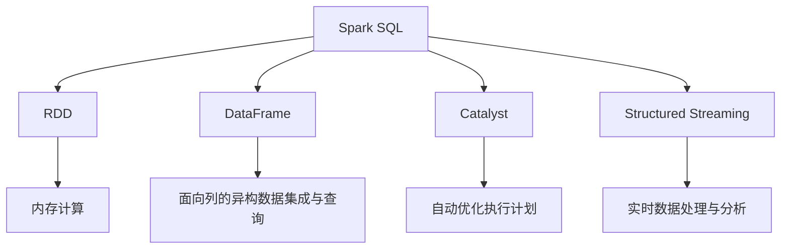

                 

# Spark SQL原理与代码实例讲解

> 关键词：Spark SQL, 数据处理, 数据仓库, 大数据技术, 数据管道, 架构设计与优化

## 1. 背景介绍

### 1.1 问题由来
在大数据时代，企业面临着海量数据的存储和分析需求。传统的关系型数据库（RDBMS）在处理大规模数据时性能瓶颈明显，无法满足实时分析的需求。分布式计算框架如Apache Hadoop虽然能够处理大规模数据，但其生态系统复杂，学习成本高。与此同时，内存计算技术如Apache Spark在数据处理性能上表现出色，且易于扩展和部署。Spark SQL作为Spark生态中的核心组件，进一步将内存计算的优势应用于关系型数据处理中，大幅提升了数据处理效率和灵活性。

### 1.2 问题核心关键点
Spark SQL通过构建内存中的分布式关系型数据库（Distributed SQL Database），将数据的存储、查询、计算、优化等功能集成于一体，从而实现了高效、灵活、可扩展的数据处理能力。Spark SQL的核心优势包括：

1. **内存计算**：将数据存储在内存中，提高数据处理速度。
2. **分布式处理**：利用集群并行处理能力，加速大数据处理。
3. **优化器**：内置优化器自动优化查询计划，提升执行效率。
4. **兼容性和易用性**：兼容标准的SQL语法，易于上手。
5. **实时性**：支持流式数据处理，实现实时数据洞察。

Spark SQL的应用领域广泛，包括数据仓库、数据管道、ETL（Extract, Transform, Load）流程、机器学习特征工程等。在企业数据架构中，Spark SQL通常与Spark Streaming和Spark MLlib等组件协同工作，形成一个完整的数据处理和分析生态系统。

### 1.3 问题研究意义
Spark SQL通过内存计算技术，显著提升了数据处理的效率和灵活性，为大数据时代的企业数据处理提供了强有力的工具。其兼容SQL语法的特性，使得传统SQL开发者能够快速上手，降低了学习成本，同时也使得Spark SQL能够与现有的大数据生态系统无缝集成，极大地促进了大数据技术在企业中的应用。此外，Spark SQL支持实时数据处理和流式计算，为企业提供了及时的数据洞察能力，有助于企业在数据驱动决策中抢占先机。

## 2. 核心概念与联系

### 2.1 核心概念概述
Spark SQL的核心概念包括：

- **Spark SQL**：基于内存计算的分布式关系型数据库，提供SQL语义查询和数据处理能力。
- **RDD（Resilient Distributed Dataset）**：Spark的基础数据结构，支持分布式并行计算。
- **DataFrame**：Spark SQL的核心抽象，提供面向列的异构数据源集成与查询。
- **Catalyst**：Spark SQL的优化器，自动生成高效的执行计划。
- **Structured Streaming**：Spark SQL的流式计算模块，支持实时数据处理和分析。

### 2.2 概念间的关系

下图展示了Spark SQL的核心概念及其之间的关系：



这个图表展示了Spark SQL各个核心概念的连接关系：

1. **Spark SQL** 通过 **RDD** 实现分布式并行计算，利用内存计算提高处理速度。
2. **DataFrame** 是 **Spark SQL** 的核心抽象，提供面向列的异构数据集成与查询能力。
3. **Catalyst** 是 **Spark SQL** 的优化器，自动生成高效的执行计划。
4. **Structured Streaming** 提供实时数据处理和分析功能，支持流式计算。

### 2.3 核心概念的整体架构

下图展示了Spark SQL的整体架构，以及与Spark生态其他组件的集成关系：

```mermaid
graph LR
    A[Spark SQL] --> B[Spark Streaming]
    A --> C[Spark MLlib]
    A --> D[Structured Streaming]
    A --> E[Memory Store]
    B --> F[批处理]
    C --> G[机器学习]
    D --> H[实时数据处理]
    E --> I[内存数据存储]
    F --> J[批处理任务]
    G --> K[机器学习模型]
    H --> L[实时计算任务]
    I --> M[内存数据管理]
    J --> N[批处理任务提交]
    K --> O[机器学习模型训练]
    L --> P[实时计算任务执行]
    M --> Q[内存数据管理]
    N --> R[批处理任务提交]
    O --> S[机器学习模型训练]
    P --> T[实时计算任务执行]
    Q --> U[内存数据管理]
    R --> V[批处理任务提交]
    S --> W[机器学习模型训练]
    T --> X[实时计算任务执行]
    U --> Y[内存数据管理]
    V --> Z[批处理任务提交]
    W --> BA[机器学习模型训练]
    X --> BB[实时计算任务执行]
    Y --> BC[内存数据管理]
    Z --> BD[批处理任务提交]
    BA --> BE[机器学习模型训练]
    BB --> BF[实时计算任务执行]
    BC --> BG[内存数据管理]
    BD --> BH[批处理任务提交]
    BE --> BI[机器学习模型训练]
    BF --> BJ[实时计算任务执行]
    BG --> BK[内存数据管理]
    BH --> BL[批处理任务提交]
    BI --> BM[机器学习模型训练]
    BJ --> BN[实时计算任务执行]
    BK --> BM[内存数据管理]
    BL --> BM[批处理任务提交]
    BM --> BN[机器学习模型训练]
    BN --> BQ[实时计算任务执行]
    BM --> BR[内存数据管理]
    BQ --> BS[机器学习模型训练]
    BR --> BT[实时计算任务执行]
    BS --> BU[内存数据管理]
    BT --> BV[机器学习模型训练]
    BU --> BW[内存数据管理]
    BV --> BX[机器学习模型训练]
    BW --> BY[内存数据管理]
    BX --> BZ[机器学习模型训练]
    BY --> BA[内存数据管理]
    BZ --> BC[机器学习模型训练]
    BA --> BD[机器学习模型训练]
    BC --> BA[内存数据管理]
    BD --> BA[机器学习模型训练]
    BA --> BD[机器学习模型训练]
    BD --> BA[内存数据管理]
    BA --> BD[机器学习模型训练]
    BD --> BA[内存数据管理]
    BA --> BD[机器学习模型训练]
    BD --> BA[内存数据管理]
    BA --> BD[机器学习模型训练]
    BD --> BA[内存数据管理]
    BA --> BD[机器学习模型训练]
    BD --> BA[内存数据管理]
    BA --> BD[机器学习模型训练]
    BD --> BA[内存数据管理]
    BA --> BD[机器学习模型训练]
    BD --> BA[内存数据管理]
    BA --> BD[机器学习模型训练]
    BD --> BA[内存数据管理]
    BA --> BD[机器学习模型训练]
    BD --> BA[内存数据管理]
    BA --> BD[机器学习模型训练]
    BD --> BA[内存数据管理]
    BA --> BD[机器学习模型训练]
    BD --> BA[内存数据管理]
    BA --> BD[机器学习模型训练]
    BD --> BA[内存数据管理]
    BA --> BD[机器学习模型训练]
    BD --> BA[内存数据管理]
    BA --> BD[机器学习模型训练]
    BD --> BA[内存数据管理]
    BA --> BD[机器学习模型训练]
    BD --> BA[内存数据管理]
    BA --> BD[机器学习模型训练]
    BD --> BA[内存数据管理]
    BA --> BD[机器学习模型训练]
    BD --> BA[内存数据管理]
    BA --> BD[机器学习模型训练]
    BD --> BA[内存数据管理]
    BA --> BD[机器学习模型训练]
    BD --> BA[内存数据管理]
    BA --> BD[机器学习模型训练]
    BD --> BA[内存数据管理]
    BA --> BD[机器学习模型训练]
    BD --> BA[内存数据管理]
    BA --> BD[机器学习模型训练]
    BD --> BA[内存数据管理]
    BA --> BD[机器学习模型训练]
    BD --> BA[内存数据管理]
    BA --> BD[机器学习模型训练]
    BD --> BA[内存数据管理]
    BA --> BD[机器学习模型训练]
    BD --> BA[内存数据管理]
    BA --> BD[机器学习模型训练]
    BD --> BA[内存数据管理]
    BA --> BD[机器学习模型训练]
    BD --> BA[内存数据管理]
    BA --> BD[机器学习模型训练]
    BD --> BA[内存数据管理]
    BA --> BD[机器学习模型训练]
    BD --> BA[内存数据管理]
    BA --> BD[机器学习模型训练]
    BD --> BA[内存数据管理]
    BA --> BD[机器学习模型训练]
    BD --> BA[内存数据管理]
    BA --> BD[机器学习模型训练]
    BD --> BA[内存数据管理]
    BA --> BD[机器学习模型训练]
    BD --> BA[内存数据管理]
    BA --> BD[机器学习模型训练]
    BD --> BA[内存数据管理]
    BA --> BD[机器学习模型训练]
    BD --> BA[内存数据管理]
    BA --> BD[机器学习模型训练]
    BD --> BA[内存数据管理]
    BA --> BD[机器学习模型训练]
    BD --> BA[内存数据管理]
    BA --> BD[机器学习模型训练]
    BD --> BA[内存数据管理]
    BA --> BD[机器学习模型训练]
    BD --> BA[内存数据管理]
    BA --> BD[机器学习模型训练]
    BD --> BA[内存数据管理]
    BA --> BD[机器学习模型训练]
    BD --> BA[内存数据管理]
    BA --> BD[机器学习模型训练]
    BD --> BA[内存数据管理]
    BA --> BD[机器学习模型训练]
    BD --> BA[内存数据管理]
    BA --> BD[机器学习模型训练]
    BD --> BA[内存数据管理]
    BA --> BD[机器学习模型训练]
    BD --> BA[内存数据管理]
    BA --> BD[机器学习模型训练]
    BD --> BA[内存数据管理]
    BA --> BD[机器学习模型训练]
    BD --> BA[内存数据管理]
    BA --> BD[机器学习模型训练]
    BD --> BA[内存数据管理]
    BA --> BD[机器学习模型训练]
    BD --> BA[内存数据管理]
    BA --> BD[机器学习模型训练]
    BD --> BA[内存数据管理]
    BA --> BD[机器学习模型训练]
    BD --> BA[内存数据管理]
    BA --> BD[机器学习模型训练]
    BD --> BA[内存数据管理]
    BA --> BD[机器学习模型训练]
    BD --> BA[内存数据管理]
    BA --> BD[机器学习模型训练]
    BD --> BA[内存数据管理]
    BA --> BD[机器学习模型训练]
    BD --> BA[内存数据管理]
    BA --> BD[机器学习模型训练]
    BD --> BA[内存数据管理]
    BA --> BD[机器学习模型训练]
    BD --> BA[内存数据管理]
    BA --> BD[机器学习模型训练]
    BD --> BA[内存数据管理]
    BA --> BD[机器学习模型训练]
    BD --> BA[内存数据管理]
    BA --> BD[机器学习模型训练]
    BD --> BA[内存数据管理]
    BA --> BD[机器学习模型训练]
    BD --> BA[内存数据管理]
    BA --> BD[机器学习模型训练]
    BD --> BA[内存数据管理]
    BA --> BD[机器学习模型训练]
    BD --> BA[内存数据管理]
    BA --> BD[机器学习模型训练]
    BD --> BA[内存数据管理]
    BA --> BD[机器学习模型训练]
    BD --> BA[内存数据管理]
    BA --> BD[机器学习模型训练]
    BD --> BA[内存数据管理]
    BA --> BD[机器学习模型训练]
    BD --> BA[内存数据管理]
    BA --> BD[机器学习模型训练]
    BD --> BA[内存数据管理]
    BA --> BD[机器学习模型训练]
    BD --> BA[内存数据管理]
    BA --> BD[机器学习模型训练]
    BD --> BA[内存数据管理]
    BA --> BD[机器学习模型训练]
    BD --> BA[内存数据管理]
    BA --> BD[机器学习模型训练]
    BD --> BA[内存数据管理]
    BA --> BD[机器学习模型训练]
    BD --> BA[内存数据管理]
    BA --> BD[机器学习模型训练]
    BD --> BA[内存数据管理]
    BA --> BD[机器学习模型训练]
    BD --> BA[内存数据管理]
    BA --> BD[机器学习模型训练]
    BD --> BA[内存数据管理]
    BA --> BD[机器学习模型训练]
    BD --> BA[内存数据管理]
    BA --> BD[机器学习模型训练]
    BD --> BA[内存数据管理]
    BA --> BD[机器学习模型训练]
    BD --> BA[内存数据管理]
    BA --> BD[机器学习模型训练]
    BD --> BA[内存数据管理]
    BA --> BD[机器学习模型训练]
    BD --> BA[内存数据管理]
    BA --> BD[机器学习模型训练]
    BD --> BA[内存数据管理]
    BA --> BD[机器学习模型训练]
    BD --> BA[内存数据管理]
    BA --> BD[机器学习模型训练]
    BD --> BA[内存数据管理]
    BA --> BD[机器学习模型训练]
    BD --> BA[内存数据管理]
    BA --> BD[机器学习模型训练]
    BD --> BA[内存数据管理]
    BA --> BD[机器学习模型训练]
    BD --> BA[内存数据管理]
    BA --> BD[机器学习模型训练]
    BD --> BA[内存数据管理]
    BA --> BD[机器学习模型训练]
    BD --> BA[内存数据管理]
    BA --> BD[机器学习模型训练]
    BD --> BA[内存数据管理]
    BA --> BD[机器学习模型训练]
    BD --> BA[内存数据管理]
    BA --> BD[机器学习模型训练]
    BD --> BA[内存数据管理]
    BA --> BD[机器学习模型训练]
    BD --> BA[内存数据管理]
    BA --> BD[机器学习模型训练]
    BD --> BA[内存数据管理]
    BA --> BD[机器学习模型训练]
    BD --> BA[内存数据管理]
    BA --> BD[机器学习模型训练]
    BD --> BA[内存数据管理]
    BA --> BD[机器学习模型训练]
    BD --> BA[内存数据管理]
    BA --> BD[机器学习模型训练]
    BD --> BA[内存数据管理]
    BA --> BD[机器学习模型训练]
    BD --> BA[内存数据管理]
    BA --> BD[机器学习模型训练]
    BD --> BA[内存数据管理]
    BA --> BD[机器学习模型训练]
    BD --> BA[内存数据管理]
    BA --> BD[机器学习模型训练]
    BD --> BA[内存数据管理]
    BA --> BD[机器学习模型训练]
    BD --> BA[内存数据管理]
    BA --> BD[机器学习模型训练]
    BD --> BA[内存数据管理]
    BA --> BD[机器学习模型训练]
    BD --> BA[内存数据管理]
    BA --> BD[机器学习模型训练]
    BD --> BA[内存数据管理]
    BA --> BD[机器学习模型训练]
    BD --> BA[内存数据管理]
    BA --> BD[机器学习模型训练]
    BD --> BA[内存数据管理]
    BA --> BD[机器学习模型训练]
    BD --> BA[内存数据管理]
    BA --> BD[机器学习模型训练]
    BD --> BA[内存数据管理]
    BA --> BD[机器学习模型训练]
    BD --> BA[内存数据管理]
    BA --> BD[机器学习模型训练]
    BD --> BA[内存数据管理]
    BA --> BD[机器学习模型训练]
    BD --> BA[内存数据管理]
    BA --> BD[机器学习模型训练]
    BD --> BA[内存数据管理]
    BA --> BD[机器学习模型训练]
    BD --> BA[内存数据管理]
    BA --> BD[机器学习模型训练]
    BD --> BA[内存数据管理]
    BA --> BD[机器学习模型训练]
    BD --> BA[内存数据管理]
    BA --> BD[机器学习模型训练]
    BD --> BA[内存数据管理]
    BA --> BD[机器学习模型训练]
    BD --> BA[内存数据管理]
    BA --> BD[机器学习模型训练]
    BD --> BA[内存数据管理]
    BA --> BD[机器学习模型训练]
    BD --> BA[内存数据管理]
    BA --> BD[机器学习模型训练]
    BD --> BA[内存数据管理]
    BA --> BD[机器学习模型训练]
    BD --> BA[内存数据管理]
    BA --> BD[机器学习模型训练]
    BD --> BA[内存数据管理]
    BA --> BD[机器学习模型训练]
    BD --> BA[内存数据管理]
    BA --> BD[机器学习模型训练]
    BD --> BA[内存数据管理]
    BA --> BD[机器学习模型训练]
    BD --> BA[内存数据管理]
    BA --> BD[机器学习模型训练]
    BD --> BA[内存数据管理]
    BA --> BD[机器学习模型训练]
    BD --> BA[内存数据管理]
    BA --> BD[机器学习模型训练]
    BD --> BA[内存数据管理]
    BA --> BD[机器学习模型训练]
    BD --> BA[内存数据管理]
    BA --> BD[机器学习模型训练]
    BD --> BA[内存数据管理]
    BA --> BD[机器学习模型训练]
    BD --> BA[内存数据管理]
    BA --> BD[机器学习模型训练]
    BD --> BA[内存数据管理]
    BA --> BD[机器学习模型训练]
    BD --> BA[内存数据管理]
    BA --> BD[机器学习模型训练]
    BD --> BA[内存数据管理]
    BA --> BD[机器学习模型训练]
    BD --> BA[内存数据管理]
    BA --> BD[机器学习模型训练]
    BD --> BA[内存数据管理]
    BA --> BD[机器学习模型训练]
    BD --> BA[内存数据管理]
    BA --> BD[机器学习模型训练]
    BD --> BA[内存数据管理]
    BA --> BD[机器学习模型训练]
    BD --> BA[内存数据管理]
    BA --> BD[机器学习模型训练]
    BD --> BA[内存数据管理]
    BA --> BD[机器学习模型训练]
    BD --> BA[内存数据管理]
    BA --> BD[机器学习模型训练]
    BD --> BA[内存数据管理]
    BA --> BD[机器学习模型训练]
    BD --> BA[内存数据管理]
    BA --> BD[机器学习模型训练]
    BD --> BA[内存数据管理]
    BA --> BD[机器学习模型训练]
    BD --> BA[内存数据管理]
    BA --> BD[机器学习模型训练]
    BD --> BA[内存数据管理]
    BA --> BD[机器学习模型训练]
    BD --> BA[内存数据管理]
    BA --> BD[机器学习模型训练]
    BD --> BA[内存数据管理]
    BA --> BD[机器学习模型训练]
    BD --> BA[内存数据管理]
    BA --> BD[机器学习模型训练]
    BD --> BA[内存数据管理]
    BA --> BD[机器学习模型训练]
    BD --> BA[内存数据管理]
    BA --> BD[机器学习模型训练]
    BD --> BA[内存数据管理]
    BA --> BD[机器学习模型训练]
    BD --> BA[内存数据管理]
    BA --> BD[机器学习模型训练]
    BD --> BA[内存数据管理]
    BA --> BD[机器学习模型训练]
    BD --> BA[内存数据管理]
    BA --> BD[机器学习模型训练]
    BD --> BA[内存数据管理]
    BA --> BD[机器学习模型训练]
    BD --> BA[内存数据管理]
    BA --> BD[机器学习模型训练]
    BD --> BA[内存数据管理]
    BA --> BD[机器学习模型训练]
    BD --> BA[内存数据管理]
    BA --> BD[机器学习模型训练]
    BD --> BA[内存数据管理]
    BA --> BD[机器学习模型训练]
    BD --> BA[内存数据管理]
    BA --> BD[机器学习模型训练]
    BD --> BA[内存数据管理]
    BA --> BD[机器学习模型训练]
    BD --> BA[内存数据管理]
    BA --> BD[机器学习模型训练]
    BD --> BA[内存数据管理]
    BA --> BD[机器学习模型训练]
    BD --> BA[内存数据管理]
    BA --> BD[机器学习模型训练]
    BD --> BA[内存数据管理]
    BA --> BD[机器学习模型训练]
    BD --> BA[内存数据管理]
    BA --> BD[机器学习模型训练]
    BD --> BA[内存数据管理]
    BA --> BD[机器学习模型训练]
    BD --> BA[内存数据管理]
    BA --> BD[机器学习模型训练]
    BD --> BA[内存数据管理]
    BA --> BD[机器学习模型训练]
    BD --> BA[内存数据管理]
    BA --> BD[机器学习模型训练]
    BD --> BA[内存数据管理]
    BA --> BD[机器学习模型训练]
    BD --> BA[内存数据管理]
    BA --> BD[机器学习模型训练]
    BD --> BA[内存数据管理]
    BA --> BD[机器学习模型训练]
    BD --> BA[内存数据管理]
    BA --> BD[机器学习模型训练]
    BD --> BA[内存数据管理]
    BA --> BD[机器学习模型训练]
    BD --> BA[内存数据管理]
    BA --> BD[机器学习模型训练]
    BD --> BA[内存数据管理]
    BA --> BD[机器学习模型训练]
    BD --> BA[内存数据管理]
    BA --> BD[机器学习模型训练]
    BD --> BA[内存数据管理]
    BA --> BD[机器学习模型训练]
    BD --> BA[内存数据管理]
    BA --> BD[机器学习模型训练]
    BD --> BA[内存数据管理]
    BA --> BD[机器学习模型训练]
    BD --> BA[内存数据管理]
    BA --> BD[机器学习模型训练]
    BD --> BA[内存数据管理]
    BA --> BD[机器学习模型训练]
    BD --> BA[内存数据管理]
    BA --> BD[机器学习模型训练]
    BD --> BA[内存数据管理]
    BA --> BD[机器学习模型训练]
    BD --> BA[内存数据管理]
    BA --> BD[机器学习模型训练]
    BD --> BA[内存数据管理]
    BA --> BD[机器学习模型训练]
    BD --> BA[内存数据管理]
    BA --> BD[机器学习模型训练]
    BD --> BA[内存数据管理]
    BA --> BD[机器学习模型训练]
    BD --> BA[内存数据管理]
    BA --> BD[机器学习模型训练]
    BD --> BA[内存数据管理]
    BA --> BD[机器学习模型训练]
    BD --> BA[内存数据管理]
    BA --> BD[机器学习模型训练]
    BD --> BA[内存数据管理]
    BA --> BD[机器学习模型训练]
    BD --> BA[内存数据管理]
    BA --> BD[机器学习模型训练]
    BD --> BA[内存数据管理]
    BA --> BD[机器学习模型训练]
    BD --> BA[内存数据管理]
    BA --> BD[机器学习模型训练]
    BD --> BA[内存数据管理]
    BA --> BD[机器学习模型训练]
    BD --> BA[内存数据管理]
    BA --> BD[机器学习模型训练]
    BD --> BA[内存数据管理]
    BA --> BD[机器学习模型训练]
    BD --> BA[内存数据管理]
    BA --> BD[机器学习模型训练]
    BD --> BA[内存数据管理]
    BA --> BD[机器学习模型训练]
    BD --> BA[内存数据管理]
    BA --> BD[机器学习模型训练]
    BD --> BA[内存数据管理]
    BA --> BD[机器学习模型训练]
    BD --> BA[内存数据管理]
    BA --> BD[机器学习模型训练]
    BD --> BA[内存数据管理]
    BA --> BD[机器学习模型训练]
    BD --> BA[内存数据管理]
    BA --> BD[机器学习模型训练]
    BD --> BA[内存数据管理]
    BA --> BD[机器学习模型训练]
    BD --> BA[内存数据管理]
    BA --> BD[机器学习模型训练]
    BD --> BA[内存数据管理]
    BA --> BD[机器学习模型训练]
    BD --> BA[内存数据管理]
    BA --> BD[机器学习模型训练]
    BD --> BA[内存数据管理]
    BA --> BD[机器学习模型训练]
    BD --> BA[内存数据管理]
    BA --> BD[机器学习模型训练]
    BD --> BA[内存数据管理]
    BA --> BD[机器学习模型训练]
    BD --> BA[内存数据管理]
    BA --> BD[机器学习模型训练]
    BD --> BA[内存数据管理]
    BA --> BD[机器学习模型训练]
    BD --> BA[内存数据管理]
    BA --> BD[机器学习模型训练]
    BD --> BA[内存数据管理]
    BA --> BD[机器学习模型训练]
    BD --> BA[内存数据管理]
    BA --> BD[机器学习模型训练]
    BD --> BA[内存数据管理]
    BA --> BD[机器学习模型训练]
    BD --> BA[内存数据管理]
    BA --> BD[机器学习模型训练]
    BD --> BA[内存数据管理]
    BA --> BD[机器学习模型训练]
    BD --> BA[内存数据管理]
    BA --> BD[机器学习模型训练]
    BD --> BA[内存数据管理]
    BA --> BD[机器学习模型训练]
    BD --> BA[内存数据管理]
    BA --> BD[机器学习模型训练]
    BD --> BA[内存数据管理]
    BA --> BD[机器学习模型训练]
    BD --> BA[内存数据管理]
    BA --> BD[机器学习模型训练]
    BD -->

