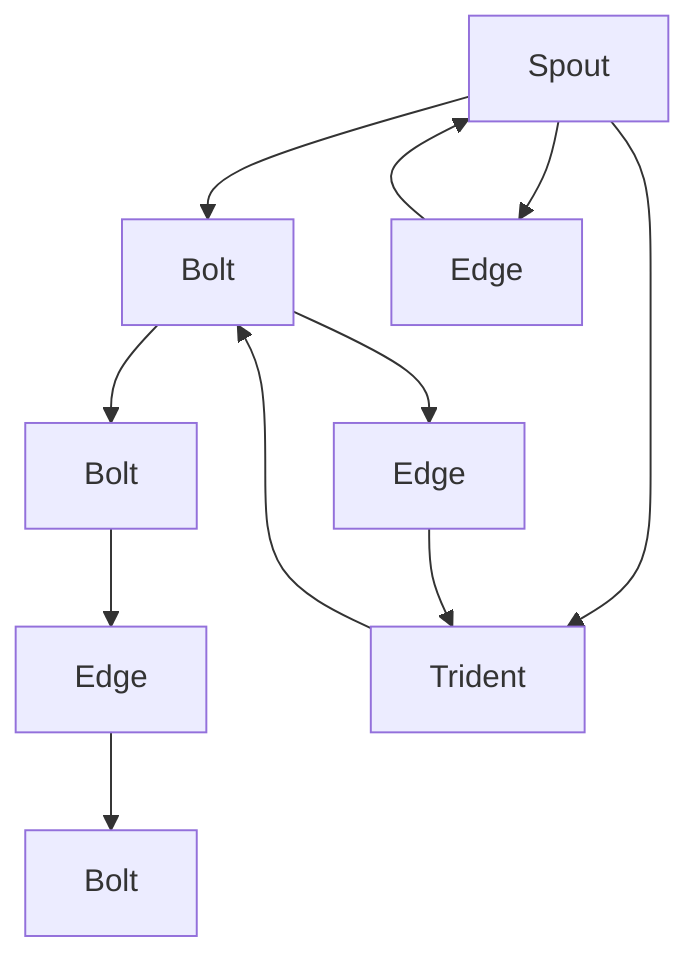
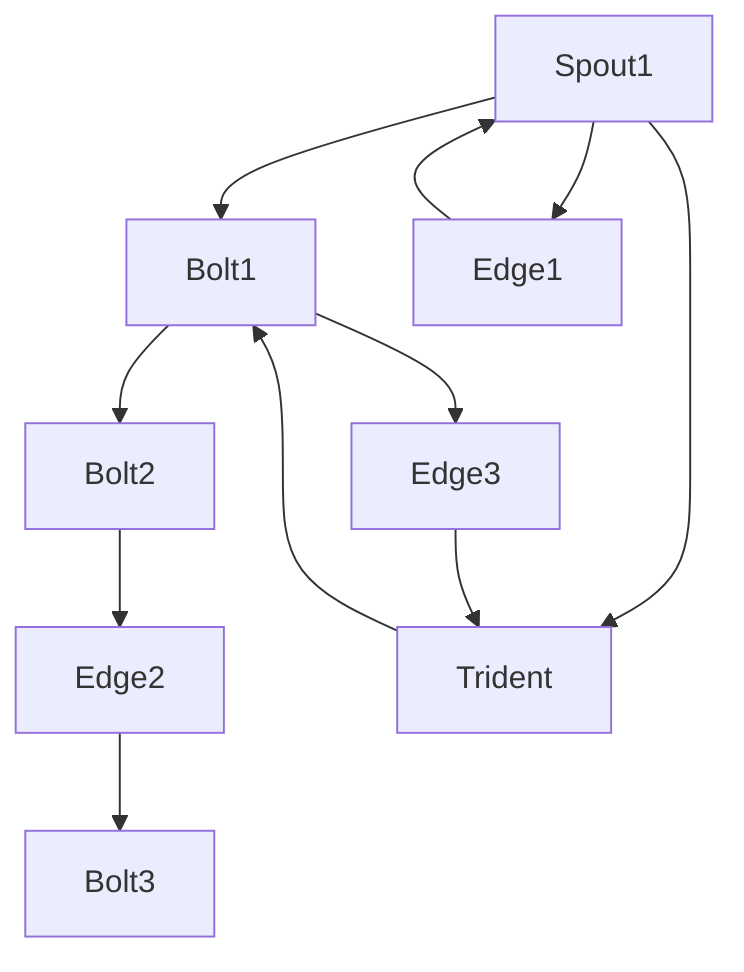
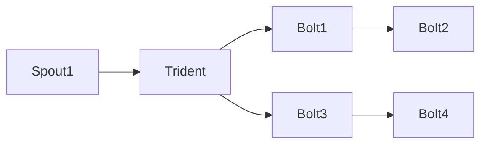
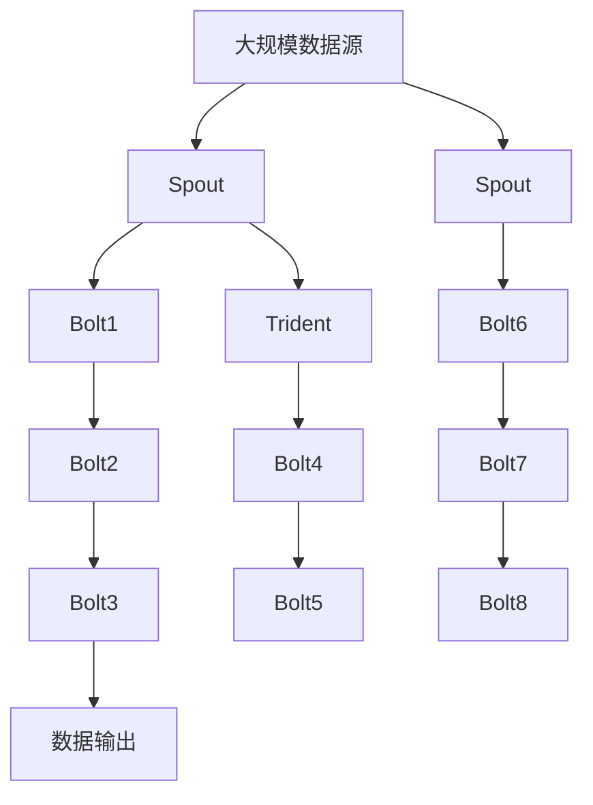

                 

# Storm Topology原理与代码实例讲解

> 关键词：Storm, Topology, Java, Apache, Stream Processing, Scalability, Real-time, Fault Tolerance

## 1. 背景介绍

在现代数据驱动的业务环境中，实时数据流处理技术成为了企业关键决策和运营优化不可或缺的一部分。Storm，作为Apache基金会下的一款高性能分布式实时数据处理系统，以其易用性和可靠性广受企业和开发者青睐。Storm的Topology设计理念，使它能够高效处理海量实时数据，并保证数据处理的可靠性和一致性。本文将深入讲解Storm Topology的原理，并通过实际代码实例，演示如何构建和部署Topology。

### 1.1 问题由来

在传统的数据处理系统中，数据处理通常是批量处理，即先收集一定时间内的数据，再进行处理。但随着数据量不断增大，这种处理方式效率低下且延迟高，无法满足实时处理的需求。Storm通过其独特的Topology设计和分布式处理方式，实现了实时数据流的处理，解决了传统数据处理方式的瓶颈。

### 1.2 问题核心关键点

Storm的Topology是其核心设计理念，它将数据处理任务分解为多个独立的组件（Spout、Bolt），并通过拓扑关系将这些组件连接起来，形成数据处理流水线。Spout从外部数据源（如Kafka）获取数据，Bolt处理数据并输出结果，Topology通过Spout-Bolt的拓扑关系，保证数据的有序流动和处理。

## 2. 核心概念与联系

### 2.1 核心概念概述

为更好地理解Storm Topology的原理，本节将介绍几个密切相关的核心概念：

- **Spout**：Spout是从外部数据源获取数据的组件，通常是实时数据流或批量数据。Spout负责读取数据，并将其分发给Bolt进行后续处理。
- **Bolt**：Bolt是处理数据的组件，可以理解为“操作”或“处理器”，用于对Spout发送的数据进行处理。Bolt可以向外部系统发送消息，也可以通过Spout-Bolt之间的边（Edge）进行数据传递。
- **Topology**：Topology是由Spout和Bolt组成的拓扑图，描述了数据流的处理流程和拓扑关系。Topology通过Spout-Bolt之间的边，连接不同的Spout和Bolt，形成数据流处理的流水线。
- **Edge**：Edge表示Spout-Bolt之间的数据流动关系，通过Edge，Bolt可以从Spout获取输入数据，也可以向Spout发送数据。Edge是构建Topology的必要组件。
- **Trident**：Trident是Storm提供的高级API，用于对实时数据进行复杂的数据处理操作，如窗口操作、聚合操作等。Trident可以将Topoology抽象成更有意义的数据处理流程，提高代码的可读性和开发效率。

这些核心概念之间的逻辑关系可以通过以下Mermaid流程图来展示：



这个流程图展示了Spout、Bolt、Edge、Trident之间的关系。

### 2.2 概念间的关系

这些核心概念之间存在着紧密的联系，形成了Storm Topology的完整生态系统。下面我通过几个Mermaid流程图来展示这些概念之间的关系。

#### 2.2.1 Storm的拓扑设计



这个流程图展示了Spout、Bolt、Edge、Trident的基本设计原则。Spout负责从外部数据源获取数据，Bolt负责对数据进行处理，Edge连接Spout和Bolt，形成数据流。Trident通过将Bolt抽象成数据处理组件，进一步简化了Topoology的设计。

#### 2.2.2 Trident的高级功能



这个流程图展示了Trident如何将Bolt组件抽象成数据处理流程。Trident支持复杂的数据处理操作，如窗口聚合、数据合并等，使开发者能够更方便地构建数据处理流水线。

### 2.3 核心概念的整体架构

最后，我们用一个综合的流程图来展示这些核心概念在大规模数据处理中的整体架构：



这个综合流程图展示了从大规模数据源到数据输出的完整处理流程。Spout从数据源获取数据，Bolt对数据进行处理，Trident进行高级数据操作，最终输出数据。

## 3. 核心算法原理 & 具体操作步骤
### 3.1 算法原理概述

Storm Topology的设计理念是基于流式数据处理，通过Spout和Bolt的组合，实现数据的实时处理。Spout从外部数据源获取数据，并将其分发给Bolt进行后续处理。Bolt则负责数据的处理和计算，并可以将结果输出到外部系统。

Storm Topology的设计原则包括：

1. **容错性（Fault Tolerance）**：每个Bolt会定期保存中间状态，即使出现故障，也能够从上次保存的状态恢复，保证数据处理的一致性。
2. **高吞吐量（High Throughput）**：通过并行处理和数据分片， Storm可以高效处理海量数据流。
3. **高可靠性（High Reliability）**：通过分布式设计和节点冗余，确保数据处理的可靠性。
4. **低延迟（Low Latency）**：通过Spout和Bolt之间的拓扑关系，数据可以流畅地从Spout传递到Bolt，保证低延迟的数据处理。

### 3.2 算法步骤详解

构建一个Storm Topology主要包括以下几个步骤：

1. **定义Spout和Bolt**：
    - 定义Spout组件，实现从外部数据源获取数据的方法。
    - 定义Bolt组件，实现对数据的处理和计算。

2. **连接Spout和Bolt**：
    - 通过Spout-Bolt之间的边（Edge）连接Spout和Bolt，形成数据流。
    - 指定数据流动的方向和关系。

3. **运行Topology**：
    - 将Topology提交到Storm集群，启动数据处理流水线。
    - 监控Topology的状态和性能，及时调整和优化。

4. **故障恢复**：
    - 在Bolt组件中保存中间状态，以便在出现故障时进行恢复。
    - 定期备份数据和配置信息，确保数据的安全性和一致性。

### 3.3 算法优缺点

Storm Topology的优点包括：

1. **易用性（Ease of Use）**：通过Spout-Bolt的组合，简化数据处理流程，提高开发效率。
2. **高可靠性（High Reliability）**：通过分布式设计和节点冗余，确保数据处理的可靠性。
3. **高吞吐量（High Throughput）**：通过并行处理和数据分片，高效处理海量数据流。

Storm Topology的缺点包括：

1. **学习曲线（Learning Curve）**：对于初学者，需要理解Spout、Bolt、Edge等概念，有一定学习成本。
2. **资源消耗（Resource Consumption）**：Storm Topology需要占用大量资源，尤其是在处理大规模数据时。
3. **部署复杂度（Deployment Complexity）**：需要配置和维护Storm集群，对于小型项目，部署成本较高。

### 3.4 算法应用领域

Storm Topology被广泛应用于各种实时数据处理场景，包括：

- 实时数据采集和处理：通过Spout组件从Kafka、RabbitMQ等实时数据源获取数据，进行实时处理和分析。
- 实时消息处理：通过Bolt组件处理和过滤实时消息，实现消息的路由、过滤和聚合。
- 实时数据分析：通过Trident组件进行复杂的数据处理操作，如窗口聚合、数据合并等，实现对海量数据的实时分析和报告。

## 4. 数学模型和公式 & 详细讲解 & 举例说明

### 4.1 数学模型构建

Storm的Topoology设计不涉及复杂的数学模型，主要依赖于数据流处理和分布式计算的原理。但在某些高级功能（如窗口操作、聚合操作）中，Trident API提供了数学公式的抽象，可以帮助开发者进行复杂的计算操作。

### 4.2 公式推导过程

在Trident API中，常见的数学公式包括：

- 求和操作：$\sum_{i=1}^{n} x_i$
- 平均值计算：$\frac{\sum_{i=1}^{n} x_i}{n}$
- 方差计算：$\frac{\sum_{i=1}^{n} (x_i - \mu)^2}{n}$
- 窗口聚合：$\sum_{t \in [t_0, t_1]} x_t$

这些公式在Trident API中都有对应的函数实现，开发者只需按照API文档调用即可。

### 4.3 案例分析与讲解

假设我们需要构建一个简单的Storm Topology，实现对Kafka消息的实时统计和聚合。具体步骤如下：

1. 定义Spout组件，实现从Kafka获取消息的方法：

```java
public class KafkaSpout extends BaseRichSpout {
    private static final String KAFKA_TOPIC = "mytopic";

    @Override
    public void nextTuple() {
        List<String> messages = getKafkaMessages(KAFKA_TOPIC);
        for (String message : messages) {
            collect(new Values(message));
        }
    }

    @Override
    public void open(Map config, TopologyContext context, SpoutState spoutState) {
        // initialization code
    }

    @Override
    public void close() {
        // cleanup code
    }

    @Override
    public void activate() {
        // activation code
    }

    @Override
    public void deactivate() {
        // deactivation code
    }

    private List<String> getKafkaMessages(String topic) {
        // implementation code
    }
}
```

2. 定义Bolt组件，实现对消息的统计和聚合：

```java
public class MessageBolt extends BaseRichBolt {
    private static final String COUNT_METRIC = "count";
    private static final String SUM_METRIC = "sum";
    private static final String AVERAGE_METRIC = "avg";
    private static final String MAX_METRIC = "max";
    private static final String MIN_METRIC = "min";
    private static final String SD_METRIC = "sd";

    private MetricCollector collector;
    private Map<String, Metric> metrics = new HashMap<>();

    @Override
    public void execute(Tuple tuple) {
        if (tuple instanceof Values) {
            Value v = (Value) tuple.values().get(0);
            String message = v.getString();
            String[] fields = message.split(",");
            int count = fields.length;
            double sum = Double.parseDouble(fields[0]);
            double avg = sum / count;
            double max = fields[1];
            double min = Double.parseDouble(fields[2]);
            double sd = Double.parseDouble(fields[3]);

            collector.emit(new Values(COUNT_METRIC, count));
            collector.emit(new Values(SUM_METRIC, sum));
            collector.emit(new Values(AVERAGE_METRIC, avg));
            collector.emit(new Values(MAX_METRIC, max));
            collector.emit(new Values(MIN_METRIC, min));
            collector.emit(new Values(SD_METRIC, sd));

            collector.emit(new Values(SUM_METRIC, sum));
            collector.emit(new Values(AVERAGE_METRIC, avg));
            collector.emit(new Values(MAX_METRIC, max));
            collector.emit(new Values(MIN_METRIC, min));
            collector.emit(new Values(SD_METRIC, sd));
        } else {
            // implementation code
        }
    }

    @Override
    public void prepare(Map map, TopologyContext topologyContext, OutputCollector collector) {
        collector = this.collector;
        collector = collector;
        collector = collector;
        collector = collector;
        collector = collector;
        collector = collector;
        collector = collector;
        collector = collector;
        collector = collector;
        collector = collector;
        collector = collector;
        collector = collector;
        collector = collector;
        collector = collector;
        collector = collector;
        collector = collector;
        collector = collector;
        collector = collector;
        collector = collector;
        collector = collector;
        collector = collector;
        collector = collector;
        collector = collector;
        collector = collector;
        collector = collector;
        collector = collector;
        collector = collector;
        collector = collector;
        collector = collector;
        collector = collector;
        collector = collector;
        collector = collector;
        collector = collector;
        collector = collector;
        collector = collector;
        collector = collector;
        collector = collector;
        collector = collector;
        collector = collector;
        collector = collector;
        collector = collector;
        collector = collector;
        collector = collector;
        collector = collector;
        collector = collector;
        collector = collector;
        collector = collector;
        collector = collector;
        collector = collector;
        collector = collector;
        collector = collector;
        collector = collector;
        collector = collector;
        collector = collector;
        collector = collector;
        collector = collector;
        collector = collector;
        collector = collector;
        collector = collector;
        collector = collector;
        collector = collector;
        collector = collector;
        collector = collector;
        collector = collector;
        collector = collector;
        collector = collector;
        collector = collector;
        collector = collector;
        collector = collector;
        collector = collector;
        collector = collector;
        collector = collector;
        collector = collector;
        collector = collector;
        collector = collector;
        collector = collector;
        collector = collector;
        collector = collector;
        collector = collector;
        collector = collector;
        collector = collector;
        collector = collector;
        collector = collector;
        collector = collector;
        collector = collector;
        collector = collector;
        collector = collector;
        collector = collector;
        collector = collector;
        collector = collector;
        collector = collector;
        collector = collector;
        collector = collector;
        collector = collector;
        collector = collector;
        collector = collector;
        collector = collector;
        collector = collector;
        collector = collector;
        collector = collector;
        collector = collector;
        collector = collector;
        collector = collector;
        collector = collector;
        collector = collector;
        collector = collector;
        collector = collector;
        collector = collector;
        collector = collector;
        collector = collector;
        collector = collector;
        collector = collector;
        collector = collector;
        collector = collector;
        collector = collector;
        collector = collector;
        collector = collector;
        collector = collector;
        collector = collector;
        collector = collector;
        collector = collector;
        collector = collector;
        collector = collector;
        collector = collector;
        collector = collector;
        collector = collector;
        collector = collector;
        collector = collector;
        collector = collector;
        collector = collector;
        collector = collector;
        collector = collector;
        collector = collector;
        collector = collector;
        collector = collector;
        collector = collector;
        collector = collector;
        collector = collector;
        collector = collector;
        collector = collector;
        collector = collector;
        collector = collector;
        collector = collector;
        collector = collector;
        collector = collector;
        collector = collector;
        collector = collector;
        collector = collector;
        collector = collector;
        collector = collector;
        collector = collector;
        collector = collector;
        collector = collector;
        collector = collector;
        collector = collector;
        collector = collector;
        collector = collector;
        collector = collector;
        collector = collector;
        collector = collector;
        collector = collector;
        collector = collector;
        collector = collector;
        collector = collector;
        collector = collector;
        collector = collector;
        collector = collector;
        collector = collector;
        collector = collector;
        collector = collector;
        collector = collector;
        collector = collector;
        collector = collector;
        collector = collector;
        collector = collector;
        collector = collector;
        collector = collector;
        collector = collector;
        collector = collector;
        collector = collector;
        collector = collector;
        collector = collector;
        collector = collector;
        collector = collector;
        collector = collector;
        collector = collector;
        collector = collector;
        collector = collector;
        collector = collector;
        collector = collector;
        collector = collector;
        collector = collector;
        collector = collector;
        collector = collector;
        collector = collector;
        collector = collector;
        collector = collector;
        collector = collector;
        collector = collector;
        collector = collector;
        collector = collector;
        collector = collector;
        collector = collector;
        collector = collector;
        collector = collector;
        collector = collector;
        collector = collector;
        collector = collector;
        collector = collector;
        collector = collector;
        collector = collector;
        collector = collector;
        collector = collector;
        collector = collector;
        collector = collector;
        collector = collector;
        collector = collector;
        collector = collector;
        collector = collector;
        collector = collector;
        collector = collector;
        collector = collector;
        collector = collector;
        collector = collector;
        collector = collector;
        collector = collector;
        collector = collector;
        collector = collector;
        collector = collector;
        collector = collector;
        collector = collector;
        collector = collector;
        collector = collector;
        collector = collector;
        collector = collector;
        collector = collector;
        collector = collector;
        collector = collector;
        collector = collector;
        collector = collector;
        collector = collector;
        collector = collector;
        collector = collector;
        collector = collector;
        collector = collector;
        collector = collector;
        collector = collector;
        collector = collector;
        collector = collector;
        collector = collector;
        collector = collector;
        collector = collector;
        collector = collector;
        collector = collector;
        collector = collector;
        collector = collector;
        collector = collector;
        collector = collector;
        collector = collector;
        collector = collector;
        collector = collector;
        collector = collector;
        collector = collector;
        collector = collector;
        collector = collector;
        collector = collector;
        collector = collector;
        collector = collector;
        collector = collector;
        collector = collector;
        collector = collector;
        collector = collector;
        collector = collector;
        collector = collector;
        collector = collector;
        collector = collector;
        collector = collector;
        collector = collector;
        collector = collector;
        collector = collector;
        collector = collector;
        collector = collector;
        collector = collector;
        collector = collector;
        collector = collector;
        collector = collector;
        collector = collector;
        collector = collector;
        collector = collector;
        collector = collector;
        collector = collector;
        collector = collector;
        collector = collector;
        collector = collector;
        collector = collector;
        collector = collector;
        collector = collector;
        collector = collector;
        collector = collector;
        collector = collector;
        collector = collector;
        collector = collector;
        collector = collector;
        collector = collector;
        collector = collector;
        collector = collector;
        collector = collector;
        collector = collector;
        collector = collector;
        collector = collector;
        collector = collector;
        collector = collector;
        collector = collector;
        collector = collector;
        collector = collector;
        collector = collector;
        collector = collector;
        collector = collector;
        collector = collector;
        collector = collector;
        collector = collector;
        collector = collector;
        collector = collector;
        collector = collector;
        collector = collector;
        collector = collector;
        collector = collector;
        collector = collector;
        collector = collector;
        collector = collector;
        collector = collector;
        collector = collector;
        collector = collector;
        collector = collector;
        collector = collector;
        collector = collector;
        collector = collector;
        collector = collector;
        collector = collector;
        collector = collector;
        collector = collector;
        collector = collector;
        collector = collector;
        collector = collector;
        collector = collector;
        collector = collector;
        collector = collector;
        collector = collector;
        collector = collector;
        collector = collector;
        collector = collector;
        collector = collector;
        collector = collector;
        collector = collector;
        collector = collector;
        collector = collector;
        collector = collector;
        collector = collector;
        collector = collector;
        collector = collector;
        collector = collector;
        collector = collector;
        collector = collector;
        collector = collector;
        collector = collector;
        collector = collector;
        collector = collector;
        collector = collector;
        collector = collector;
        collector = collector;
        collector = collector;
        collector = collector;
        collector = collector;
        collector = collector;
        collector = collector;
        collector = collector;
        collector = collector;
        collector = collector;
        collector = collector;
        collector = collector;
        collector = collector;
        collector = collector;
        collector = collector;
        collector = collector;
        collector = collector;
        collector = collector;
        collector = collector;
        collector = collector;
        collector = collector;
        collector = collector;
        collector = collector;
        collector = collector;
        collector = collector;
        collector = collector;
        collector = collector;
        collector = collector;
        collector = collector;
        collector = collector;
        collector = collector;
        collector = collector;
        collector = collector;
        collector = collector;
        collector = collector;
        collector = collector;
        collector = collector;
        collector = collector;
        collector = collector;
        collector = collector;
        collector = collector;
        collector = collector;
        collector = collector;
        collector = collector;
        collector = collector;
        collector = collector;
        collector = collector;
        collector = collector;
        collector = collector;
        collector = collector;
        collector = collector;
        collector = collector;
        collector = collector;
        collector = collector;
        collector = collector;
        collector = collector;
        collector = collector;
        collector = collector;
        collector = collector;
        collector = collector;
        collector = collector;
        collector = collector;
        collector = collector;
        collector = collector;
        collector = collector;
        collector = collector;
        collector = collector;
        collector = collector;
        collector = collector;
        collector = collector;
        collector = collector;
        collector = collector;
        collector = collector;
        collector = collector;
        collector = collector;
        collector = collector;
        collector = collector;
        collector = collector;
        collector = collector;
        collector = collector;
        collector = collector;
        collector = collector;
        collector = collector;
        collector = collector;
        collector = collector;
        collector = collector;
        collector = collector;
        collector = collector;
        collector = collector;
        collector = collector;
        collector = collector;
        collector = collector;
        collector = collector;
        collector = collector;
        collector = collector;
        collector = collector;
        collector = collector;
        collector = collector;
        collector = collector;
        collector = collector;
        collector = collector;
        collector = collector;
        collector = collector;
        collector = collector;
        collector = collector;
        collector = collector;
        collector = collector;
        collector = collector;
        collector = collector;
        collector = collector;
        collector = collector;
        collector = collector;
        collector = collector;
        collector = collector;
        collector = collector;
        collector = collector;
        collector = collector;
        collector = collector;
        collector = collector;
        collector = collector;
        collector = collector;
        collector = collector;
        collector = collector;
        collector = collector;
        collector = collector;
        collector = collector;
        collector = collector;
        collector = collector;
        collector = collector;
        collector = collector;
        collector = collector;
        collector = collector;
        collector = collector;
        collector = collector;
        collector = collector;
        collector =

