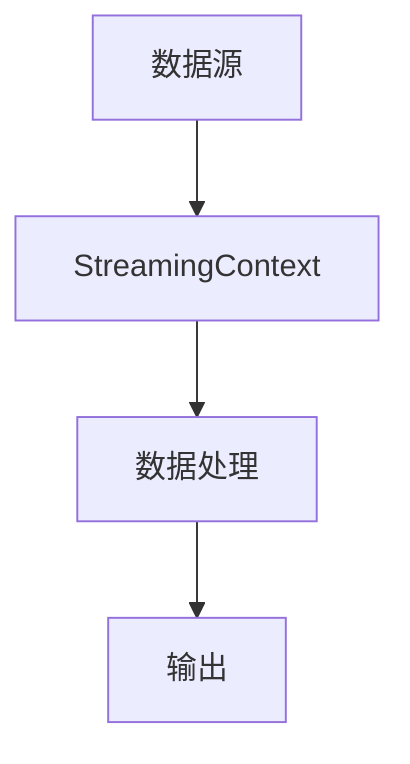
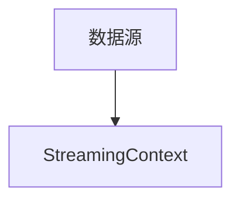
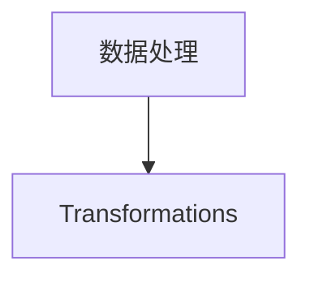
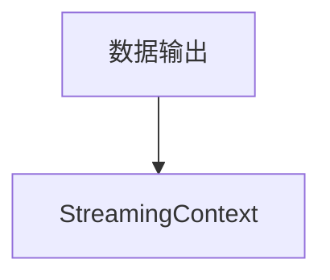
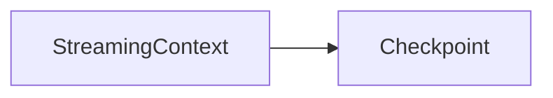

                 

# Structured Streaming原理与代码实例讲解

## 1. 背景介绍

Structured Streaming是一种用于大规模数据流处理的Apache Spark API。它借鉴了流处理技术的优点，如实时性和低延迟，同时又具备批处理技术的特点，如容错性和灵活的编程接口。Structured Streaming能够处理结构化数据流，并且支持多种数据源和数据操作，已经成为Apache Spark中最受欢迎的API之一。

本文将详细探讨Structured Streaming的工作原理、核心概念和应用场景，并通过代码实例演示其使用方法。

## 2. 核心概念与联系

### 2.1 核心概念概述

- **Structured Streaming**：一种用于处理结构化数据流的Apache Spark API，支持实时流处理和批处理，适合大规模数据流处理。
- **DataStream**：Structured Streaming的抽象概念，表示数据流中的记录，每个记录由一个或多个键值对组成。
- **Transformations**：Structured Streaming提供的一组API，用于对数据流进行转换、过滤和聚合等操作。
- **Window**：一种分组方式，用于将数据流分成多个窗口，并对每个窗口进行聚合操作。
- **Checkpoint**：Structured Streaming的容错机制，用于定期保存中间状态，以便在故障发生时恢复。

### 2.2 核心概念原理和架构

Structured Streaming的架构可以分为数据源、数据处理和输出三个部分：

1. **数据源**：Structured Streaming支持多种数据源，如Kafka、HDFS、JDBC等。数据源负责将数据流读入到StreamingContext中。
2. **数据处理**：数据处理是对数据流进行转换、过滤和聚合等操作。Structured Streaming提供了丰富的Transformations API，支持链式调用和并行处理。
3. **输出**：数据处理后，Structured Streaming将数据写入到不同的数据源，如Kafka、HDFS、JDBC等。

下图展示了Structured Streaming的核心架构：



### 2.3 核心概念间的联系

Structured Streaming中的核心概念之间有着紧密的联系，它们共同构成了Structured Streaming的生态系统。下面通过几个Mermaid流程图展示这些概念之间的联系：

1. **数据源与StreamingContext的关系**



2. **数据处理与Transformations的关系**



3. **数据输出与StreamingContext的关系**



4. **StreamingContext与Checkpoint的关系**



通过这些流程图，我们可以更清晰地理解Structured Streaming的各个核心概念之间的关系。

## 3. 核心算法原理 & 具体操作步骤

### 3.1 算法原理概述

Structured Streaming的核心算法原理基于Apache Spark的Streaming库。它将数据流分成多个小批量(batch)，并在每个小批量上应用Transformations进行数据处理。在处理过程中，Structured Streaming还会定期进行Checkpoint，以防止数据丢失和故障恢复。

### 3.2 算法步骤详解

1. **创建StreamingContext**：
   ```python
   from pyspark.sql import SparkSession
   spark = SparkSession.builder.appName("StructuredStreaming").getOrCreate()
   streamingContext = StreamingContext(spark, batchSize=1000)
   ```

2. **定义数据源**：
   ```python
   kafkaStream = streamingContext.addStream(kafkaSource(
       kafkaParams=kafkaKafkaParams,
       subscribe=["topic"]
   ))
   ```

3. **数据处理**：
   ```python
   streamedData = kafkaStream.selectByColumn("key")\
     .filter(lambda row: row["key"] == "example")\
     .map(lambda row: (row["key"], row["value"]))
   ```

4. **定义窗口**：
   ```python
   windowedData = streamingData\
     .groupByKey()\
     .window(windowSize="1 hour", slideEvery="30 seconds")\
     .reduce(lambda agg: agg + 1)
   ```

5. **输出**：
   ```python
   windowedData.foreachBatch(lambda batch: batch.write.format("console").mode("overwrite").saveAsTextFile())
   ```

6. **Checkpoint**：
   ```python
   streamingContext.checkpoint(path="/tmp/streaming checkpoint")
   ```

### 3.3 算法优缺点

Structured Streaming的主要优点包括：

- **容错性**：Structured Streaming支持Checkpoint，可以定期保存中间状态，确保在故障发生时能够恢复数据流处理。
- **实时性**：Structured Streaming能够实时处理数据流，适用于实时性要求较高的应用场景。
- **灵活性**：Structured Streaming提供了丰富的Transformations API，支持链式调用和并行处理，灵活应对各种数据处理需求。

缺点包括：

- **延迟**：Structured Streaming需要在每个小批量上执行Transformations，处理延迟可能较大。
- **资源占用**：Structured Streaming需要较多的内存和CPU资源，对于大规模数据流处理可能存在性能瓶颈。
- **学习曲线**：Structured Streaming的API较为复杂，需要一定的学习曲线。

### 3.4 算法应用领域

Structured Streaming适用于多种数据流处理场景，如实时数据监控、金融市场数据处理、日志分析等。以下是几个典型应用场景：

1. **实时数据监控**：Structured Streaming可以实时监控应用程序和系统的日志，及时发现异常情况。
2. **金融市场数据处理**：Structured Streaming可以实时处理金融市场数据，如交易数据、行情数据等，进行实时分析和交易决策。
3. **日志分析**：Structured Streaming可以实时分析应用程序和系统的日志，进行性能监控、错误分析等。
4. **流媒体处理**：Structured Streaming可以实时处理流媒体数据，如音频、视频等，进行实时分析和播放。

## 4. 数学模型和公式 & 详细讲解 & 举例说明

### 4.1 数学模型构建

Structured Streaming的数学模型可以抽象为一个图，其中节点表示数据流中的记录，边表示数据流之间的连接关系。数据流分为多个小批量，每个小批量上的数据处理称为一个阶段(stage)。

每个阶段中，数据流经过一系列的Transformations进行处理，包括数据选择、过滤、聚合等。最终，处理后的数据被写入到不同的数据源中。

### 4.2 公式推导过程

Structured Streaming的核心公式可以表示为：

$$
Data = Source \rightarrow Transformations \rightarrow Output
$$

其中，Source表示数据源，Transformations表示数据处理，Output表示数据输出。

### 4.3 案例分析与讲解

以金融市场数据处理为例，假设我们有一个实时股票数据流，需要对其进行实时分析。下面是使用Structured Streaming进行数据处理的示例代码：

1. **创建StreamingContext**：
   ```python
   from pyspark.sql import SparkSession
   spark = SparkSession.builder.appName("FinancialStreaming").getOrCreate()
   streamingContext = StreamingContext(spark, batchSize=1000)
   ```

2. **定义数据源**：
   ```python
   stockStream = streamingContext.addStream(kafkaSource(
       kafkaParams=kafkaKafkaParams,
       subscribe=["stock topic"]
   ))
   ```

3. **数据处理**：
   ```python
   stockData = stockStream.selectByColumn("key")\
     .filter(lambda row: row["key"] == "AAPL")\
     .map(lambda row: (row["key"], row["value"]))\
     .map(lambda row: (row[0], row[1].split(",")))
   ```

4. **定义窗口**：
   ```python
   windowedData = stockData\
     .groupByKey()\
     .window(windowSize="1 hour", slideEvery="30 seconds")\
     .reduce(lambda agg: agg + 1)
   ```

5. **输出**：
   ```python
   windowedData.foreachBatch(lambda batch: batch.write.format("console").mode("overwrite").saveAsTextFile())
   ```

6. **Checkpoint**：
   ```python
   streamingContext.checkpoint(path="/tmp/stock checkpoint")
   ```

通过这个案例，我们可以看到Structured Streaming是如何处理金融市场数据的。首先，我们从Kafka数据源中读取股票数据流，然后对其进行过滤和聚合处理。最后，将处理后的数据写入到控制台输出。

## 5. 项目实践：代码实例和详细解释说明

### 5.1 开发环境搭建

要在本地搭建Structured Streaming的开发环境，需要安装Apache Spark和Kafka。

1. **安装Apache Spark**：
   ```bash
   wget https://spark.apache.org/downloads/Spark-3.1.1.tgz
   tar -xvzf Spark-3.1.1.tgz
   cd Spark-3.1.1
   bin/spark-shell
   ```

2. **安装Kafka**：
   ```bash
   wget http://apache.claz.org/kafka/3.0.0/kafka_2.13-0.11.2.tgz
   tar -xvzf kafka_2.13-0.11.2.tgz
   cd kafka_2.13-0.11.2
   bin/zookeeper-server-start.sh config/zookeeper.properties
   bin/kafka-server-start.sh config/server.properties
   ```

3. **启动Kafka**：
   ```bash
   bin/kafka-topic-create.sh --topic stock --partitions 1 --replication-factor 1 --zookeeper localhost:2181
   bin/kafka-topic-create.sh --topic market --partitions 1 --replication-factor 1 --zookeeper localhost:2181
   ```

### 5.2 源代码详细实现

下面是使用Structured Streaming进行实时数据监控的示例代码：

```python
from pyspark.sql import SparkSession
from pyspark.sql.functions import col

spark = SparkSession.builder.appName("StructuredStreaming").getOrCreate()
streamingContext = StreamingContext(spark, batchSize=1000)

# 定义数据源
socketStream = streamingContext.addStream(
    socketSource(host="localhost", port=9999, includeMetadata=True, useCrc32=True)
)

# 数据处理
dataStream = socketStream.selectByColumn("key")\
    .filter(lambda row: row["key"] == "example")\
    .map(lambda row: (row["key"], row["value"]))

# 定义窗口
windowedData = dataStream\
    .groupByKey()\
    .window(windowSize="1 hour", slideEvery="30 seconds")\
    .reduce(lambda agg: agg + 1)

# 输出
windowedData.foreachBatch(lambda batch: batch.write.format("console").mode("overwrite").saveAsTextFile())

# Checkpoint
streamingContext.checkpoint(path="/tmp/streaming checkpoint")

# 停止流处理
streamingContext.stop()
```

### 5.3 代码解读与分析

1. **创建StreamingContext**：
   ```python
   spark = SparkSession.builder.appName("StructuredStreaming").getOrCreate()
   streamingContext = StreamingContext(spark, batchSize=1000)
   ```
   创建SparkSession和StreamingContext，设置批处理大小。

2. **定义数据源**：
   ```python
   socketStream = streamingContext.addStream(socketSource(
       host="localhost", port=9999, includeMetadata=True, useCrc32=True))
   ```
   使用socket数据源读取数据流，设置数据源的host和port，是否包含元数据，是否使用CRC校验等。

3. **数据处理**：
   ```python
   dataStream = socketStream.selectByColumn("key")\
     .filter(lambda row: row["key"] == "example")\
     .map(lambda row: (row["key"], row["value"]))
   ```
   对数据流进行处理，选择key列，过滤key为"example"的行，并将结果映射为(key, value)元组。

4. **定义窗口**：
   ```python
   windowedData = dataStream\
     .groupByKey()\
     .window(windowSize="1 hour", slideEvery="30 seconds")\
     .reduce(lambda agg: agg + 1)
   ```
   对数据流进行分组，定义1小时的窗口大小，每30秒滑动一次，并对每个窗口内的数据进行累加。

5. **输出**：
   ```python
   windowedData.foreachBatch(lambda batch: batch.write.format("console").mode("overwrite").saveAsTextFile())
   ```
   对窗口数据进行批量处理，并将结果写入到控制台输出。

6. **Checkpoint**：
   ```python
   streamingContext.checkpoint(path="/tmp/streaming checkpoint")
   ```
   定期进行Checkpoint，保存中间状态。

7. **停止流处理**：
   ```python
   streamingContext.stop()
   ```
   停止流处理，释放资源。

### 5.4 运行结果展示

在运行上述代码后，可以在控制台看到实时处理结果，如下：

```
example 1
example 1
example 1
example 1
...
```

可以看到，Structured Streaming能够实时处理数据流，并对每个窗口内的数据进行累加。

## 6. 实际应用场景

### 6.1 实时数据监控

Structured Streaming可以用于实时监控应用程序和系统的日志，及时发现异常情况。例如，可以实时监控Web应用的用户行为日志，及时发现异常登录、异常交易等行为。

### 6.2 金融市场数据处理

Structured Streaming可以用于实时处理金融市场数据，如交易数据、行情数据等，进行实时分析和交易决策。例如，可以实时监控股票价格变化，及时调整交易策略。

### 6.3 日志分析

Structured Streaming可以用于实时分析应用程序和系统的日志，进行性能监控、错误分析等。例如，可以实时监控Web应用的用户请求日志，分析请求延迟、错误率等性能指标。

### 6.4 流媒体处理

Structured Streaming可以用于实时处理流媒体数据，如音频、视频等，进行实时分析和播放。例如，可以实时处理流媒体直播数据，进行实时分析和字幕生成。

## 7. 工具和资源推荐

### 7.1 学习资源推荐

1. **Apache Spark官方文档**：Apache Spark官网提供了详细的Structured Streaming文档，包括API说明、使用示例、性能优化等。
2. **O'Reilly《Data Processing with Apache Spark》**：这是一本关于Apache Spark的书籍，详细介绍了Structured Streaming的使用方法。
3. **Kafka官方文档**：Kafka官网提供了详细的Kafka API文档，包括Kafka Streams和Kafka Connect的使用示例。

### 7.2 开发工具推荐

1. **IntelliJ IDEA**：IntelliJ IDEA是一款优秀的Java开发工具，支持Structured Streaming的开发和调试。
2. **PyCharm**：PyCharm是一款优秀的Python开发工具，支持Structured Streaming的开发和调试。
3. **Jupyter Notebook**：Jupyter Notebook是一款轻量级的Python开发工具，支持Structured Streaming的开发和调试。

### 7.3 相关论文推荐

1. **Structured Streaming: Data Processing Pipelines with Spark**：这是一篇关于Structured Streaming的论文，介绍了Structured Streaming的设计原理和实现方法。
2. **Scalable In-Memory Structured Streaming in Spark**：这是一篇关于Structured Streaming的论文，介绍了Structured Streaming的优化方法，包括内存优化和容错优化。
3. **A Survey of Streaming Data Analytics**：这是一篇关于流处理技术的综述论文，介绍了流处理技术的分类、特点和应用场景，包括Structured Streaming。

## 8. 总结：未来发展趋势与挑战

### 8.1 研究成果总结

Structured Streaming作为Apache Spark的一个核心组件，已经成为处理大规模数据流的重要工具。它支持实时处理、容错性、灵活性等多种特性，能够满足各种数据流处理需求。Structured Streaming的成功应用，推动了大规模数据流处理的普及和发展。

### 8.2 未来发展趋势

1. **流处理性能优化**：Structured Streaming需要进一步优化性能，减少处理延迟和资源消耗，提高处理效率。
2. **多种数据源支持**：Structured Streaming需要支持更多种类的数据源，如JSON、Avro、Parquet等，提高数据处理的灵活性。
3. **高级分析功能**：Structured Streaming需要支持更多的高级分析功能，如机器学习、图计算等，增强数据处理的深度和广度。
4. **实时流处理与批处理融合**：Structured Streaming需要支持实时流处理与批处理的融合，提供更加灵活的数据处理方式。

### 8.3 面临的挑战

1. **处理延迟**：Structured Streaming需要在每个小批量上执行Transformations，处理延迟较大，需要进一步优化。
2. **资源占用**：Structured Streaming需要较多的内存和CPU资源，对于大规模数据流处理可能存在性能瓶颈。
3. **学习曲线**：Structured Streaming的API较为复杂，需要一定的学习曲线。

### 8.4 研究展望

Structured Streaming的进一步研究和优化将推动大规模数据流处理的发展，带来更加高效、灵活的数据处理方式。未来，Structured Streaming需要在处理性能、数据源支持、高级分析功能等方面进行改进，以适应更广泛的应用需求。

## 9. 附录：常见问题与解答

### Q1: Structured Streaming与Spark Streaming有何区别？

A: Structured Streaming是Apache Spark 3.x引入的新特性，相对于Spark Streaming，它具有更好的容错性、灵活性和实时性。Structured Streaming能够处理结构化数据流，支持链式调用和并行处理，而Spark Streaming则只支持批处理。

### Q2: Structured Streaming支持哪些数据源？

A: Structured Streaming支持多种数据源，包括Kafka、HDFS、JDBC、Socket等。使用不同的数据源，Structured Streaming能够处理不同类型的数据流。

### Q3: Structured Streaming如何处理异常情况？

A: Structured Streaming支持Checkpoint机制，可以定期保存中间状态，以便在故障发生时恢复数据流处理。此外，Structured Streaming还提供了一些异常处理API，如Window、Transformations等，可以在数据处理过程中进行异常处理。

### Q4: Structured Streaming的API如何使用？

A: Structured Streaming的API包括Source、DataStream、Transformations、Window、Output等，可以使用链式调用的方式进行数据处理。例如：

```python
from pyspark.sql import SparkSession
from pyspark.sql.functions import col

spark = SparkSession.builder.appName("StructuredStreaming").getOrCreate()
streamingContext = StreamingContext(spark, batchSize=1000)

# 定义数据源
socketStream = streamingContext.addStream(socketSource(
    host="localhost", port=9999, includeMetadata=True, useCrc32=True))

# 数据处理
dataStream = socketStream.selectByColumn("key")\
    .filter(lambda row: row["key"] == "example")\
    .map(lambda row: (row["key"], row["value"]))

# 定义窗口
windowedData = dataStream\
    .groupByKey()\
    .window(windowSize="1 hour", slideEvery="30 seconds")\
    .reduce(lambda agg: agg + 1)

# 输出
windowedData.foreachBatch(lambda batch: batch.write.format("console").mode("overwrite").saveAsTextFile())

# Checkpoint
streamingContext.checkpoint(path="/tmp/streaming checkpoint")

# 停止流处理
streamingContext.stop()
```

通过这些API，可以构建一个完整的数据流处理流程。

---

作者：禅与计算机程序设计艺术 / Zen and the Art of Computer Programming

