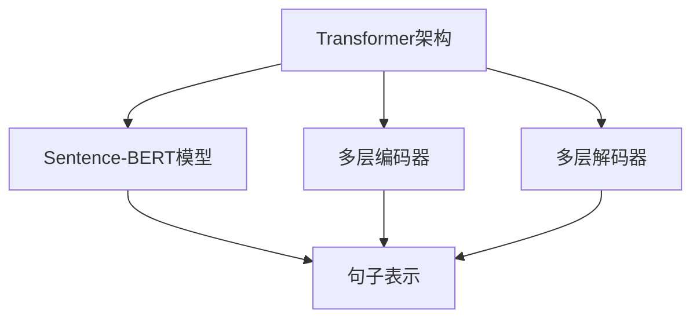

                 

# Transformer大模型实战 用Sentence-BERT模型生成句子特征

> 关键词：Transformer, Sentence-BERT, 句子特征, 深度学习, 自然语言处理(NLP), 预训练语言模型, 语义表示, 迁移学习

## 1. 背景介绍

在自然语言处理（NLP）领域，句子特征提取是一个基本但至关重要的任务。它通常用于文本分类、信息检索、问答系统、情感分析等各种应用中。传统的句子特征提取方法基于词袋模型（Bag of Words）或TF-IDF，但这些方法忽略了词的顺序信息和词向量之间的语义关系。近年来，深度学习技术的蓬勃发展，尤其是Transformer模型的广泛应用，为句子特征提取带来了新的突破。Sentence-BERT模型就是其中一种基于Transformer架构，旨在生成高质量句子特征的优秀模型。

Sentence-BERT模型由Google开发，其核心思想是将句子表示成一个固定长度的向量，使得语义相似的句子在向量空间中距离较近。这个模型在处理各种NLP任务时展现了出色的性能，被广泛应用于文本相似度计算、语义检索、问答系统等领域。本文将详细介绍Sentence-BERT模型的原理、实现方法和实际应用，旨在帮助读者深入理解这一强大工具，并掌握其使用技巧。

## 2. 核心概念与联系

### 2.1 核心概念概述

#### 2.1.1 Transformer架构

Transformer架构由Google提出，是一种基于自注意力机制的神经网络结构。与传统的循环神经网络（RNN）和卷积神经网络（CNN）不同，Transformer使用多头自注意力机制来捕捉输入序列之间的复杂依赖关系，从而提升模型的表达能力。Transformer架构主要由编码器和解码器组成，通过堆叠多层编码器和解码器，可以处理不同长度的输入序列。

#### 2.1.2 Sentence-BERT模型

Sentence-BERT模型是一种基于Transformer架构的预训练语言模型，专门用于生成句子级别的语义表示。它通过在大规模语料库上进行预训练，学习到丰富的语义信息，能够在保证计算效率的同时，生成高质量的句子表示。Sentence-BERT模型利用Transformer的自注意力机制，对句子进行编码，最终输出一个固定长度的向量，用于表示句子的语义信息。

#### 2.1.3 语义表示

语义表示是指将自然语言文本转化为计算机可处理的向量形式。语义表示在NLP中有着广泛的应用，例如文本分类、信息检索、问答系统等。语义表示的准确性直接影响到这些应用的效果。传统的语义表示方法如Word2Vec、GloVe等，往往忽略了词之间的语义关系，难以捕捉整个句子的语义信息。而Sentence-BERT模型通过深度学习技术，学习到词与词之间的复杂关系，生成高质量的句子表示。

### 2.2 核心概念的关系

Sentence-BERT模型作为Transformer架构的一部分，其核心思想与Transformer架构密切相关。Transformer架构通过自注意力机制，捕捉输入序列之间的复杂依赖关系，而Sentence-BERT模型则将这一思想应用于句子级别的语义表示生成。在Sentence-BERT模型中，通过预训练获得句子级别的语义表示，可以用于多种NLP任务的实现，如图像检索、文本分类、语义相似度计算等。

这些核心概念之间的逻辑关系可以通过以下Mermaid流程图来展示：



这个流程图展示了Transformer架构和Sentence-BERT模型之间的关系：

1. Transformer架构通过多层编码器和解码器，捕捉输入序列之间的依赖关系。
2. Sentence-BERT模型基于Transformer架构，通过预训练学习到句子级别的语义表示。
3. 句子表示可以用于各种NLP任务，如图像检索、文本分类、语义相似度计算等。

## 3. 核心算法原理 & 具体操作步骤

### 3.1 算法原理概述

Sentence-BERT模型基于Transformer架构，其核心思想是通过预训练学习到句子级别的语义表示。模型在预训练阶段，利用大规模语料库进行训练，学习到词与词之间的复杂关系。在微调阶段，模型可以用于生成任意句子的语义表示，用于各种NLP任务。

Sentence-BERT模型的预训练过程包括以下几个步骤：

1. 构建Transformer模型，包括编码器和解码器。
2. 在大规模语料库上进行自监督预训练，学习到句子级别的语义表示。
3. 在微调阶段，通过调整编码器的权重，将预训练得到的句子表示应用到特定任务中。

### 3.2 算法步骤详解

#### 3.2.1 数据准备

在使用Sentence-BERT模型前，需要准备好语料库和模型配置。语料库可以来自公开数据集，如维基百科、新闻语料等。模型配置包括模型架构、训练参数等。

```python
from sentence_transformers import SentenceTransformer

# 加载Sentence-BERT模型
model = SentenceTransformer('path/to/sentence-transformers/sentence-bert-base-200d')
```

#### 3.2.2 句子编码

使用Sentence-BERT模型对句子进行编码，生成句子级别的语义表示。

```python
from sentence_transformers import SentenceTransformer

# 加载Sentence-BERT模型
model = SentenceTransformer('path/to/sentence-transformers/sentence-bert-base-200d')

# 对句子进行编码
embeddings = model.encode(['sentence1', 'sentence2'])
```

#### 3.2.3 特征提取

使用预训练的句子表示作为句子特征，用于各种NLP任务。

```python
from sentence_transformers import SentenceTransformer

# 加载Sentence-BERT模型
model = SentenceTransformer('path/to/sentence-transformers/sentence-bert-base-200d')

# 对句子进行编码
embeddings = model.encode(['sentence1', 'sentence2'])

# 使用预训练的句子表示作为句子特征
features = embeddings[0]
```

### 3.3 算法优缺点

#### 3.3.1 优点

1. 语义表示准确：Sentence-BERT模型通过预训练学习到句子级别的语义表示，能够捕捉词与词之间的复杂关系，生成高质量的句子特征。
2. 计算效率高：Sentence-BERT模型基于Transformer架构，通过并行计算，能够在保证计算效率的同时，生成高质量的句子表示。
3. 应用广泛：Sentence-BERT模型可以用于多种NLP任务，如图像检索、文本分类、语义相似度计算等。

#### 3.3.2 缺点

1. 对语料库依赖性强：Sentence-BERT模型的性能取决于预训练语料库的质量和规模，需要大量高质量的语料库进行训练。
2. 对小样本数据适应性差：Sentence-BERT模型在预训练阶段学习到的是通用的语义表示，对特定任务的小样本数据适应性较差。
3. 模型较大：Sentence-BERT模型参数量较大，对计算资源要求较高。

### 3.4 算法应用领域

Sentence-BERT模型在NLP领域有着广泛的应用，以下是一些常见的应用场景：

1. 文本分类：Sentence-BERT模型可以用于生成句子级别的语义表示，作为特征输入到分类器中，实现文本分类任务。
2. 信息检索：Sentence-BERT模型可以用于生成句子表示，计算句子间的相似度，用于信息检索和推荐系统。
3. 问答系统：Sentence-BERT模型可以用于生成问题表示和答案表示，计算两者之间的相似度，用于问答系统。
4. 语义相似度计算：Sentence-BERT模型可以用于计算句子之间的相似度，用于语义检索、摘要生成等任务。
5. 情感分析：Sentence-BERT模型可以用于生成句子表示，作为特征输入到情感分类器中，实现情感分析任务。

## 4. 数学模型和公式 & 详细讲解 & 举例说明

### 4.1 数学模型构建

Sentence-BERT模型的数学模型主要基于Transformer架构，通过自注意力机制计算句子表示。假设输入句子为 $s = [w_1, w_2, ..., w_n]$，Sentence-BERT模型可以表示为：

$$
\text{encoder}(s) = \text{Transformer}(s)
$$

其中，$\text{Transformer}(s)$ 表示使用Transformer架构对句子 $s$ 进行编码，生成句子表示 $\text{embedding}(s)$。Transformer架构的详细描述和计算过程可以参考相关文献。

### 4.2 公式推导过程

Transformer模型的核心是自注意力机制，其计算过程包括三个主要步骤：

1. 查询表示（Query Representation）
2. 键值表示（Key-Value Representation）
3. 注意力计算（Attention Calculation）

查询表示和键值表示的计算过程可以通过以下公式表示：

$$
Q = \text{softmax}\left(\frac{A^T \cdot U^T}{\sqrt{d_k}}\right)
$$

$$
K = V \cdot Q
$$

其中，$A$ 和 $V$ 表示输入序列的查询表示和键值表示，$U$ 表示线性变换矩阵，$d_k$ 表示键值表示的维度。

注意力计算的计算过程可以通过以下公式表示：

$$
\text{Attention}(Q, K, V) = \text{softmax}\left(\frac{Q^T \cdot K}{\sqrt{d_k}}\right) V
$$

Transformer模型的输出表示可以表示为：

$$
\text{output} = \text{softmax}\left(\text{Attention}(Q, K, V)\right)
$$

Sentence-BERT模型在预训练阶段，通过上述计算过程，生成句子表示。在微调阶段，可以通过调整编码器的权重，将预训练得到的句子表示应用到特定任务中。

### 4.3 案例分析与讲解

假设有一个句子分类任务，我们需要将句子分类为正面、负面和中性三种情感类别。我们可以使用Sentence-BERT模型生成句子表示，作为特征输入到分类器中。以下是具体的实现步骤：

1. 构建分类器，例如逻辑回归分类器。
2. 使用Sentence-BERT模型生成句子表示。
3. 将句子表示作为特征输入到分类器中，训练分类器。

```python
from sentence_transformers import SentenceTransformer
from sklearn.linear_model import LogisticRegression
from sklearn.metrics import accuracy_score

# 加载Sentence-BERT模型
model = SentenceTransformer('path/to/sentence-transformers/sentence-bert-base-200d')

# 构建分类器
clf = LogisticRegression()

# 对句子进行编码，生成句子表示
embeddings = model.encode(['sentence1', 'sentence2'])

# 将句子表示作为特征输入到分类器中
X = embeddings

# 训练分类器
clf.fit(X, y)

# 评估分类器性能
y_pred = clf.predict(X)
accuracy = accuracy_score(y_true, y_pred)
print('Accuracy:', accuracy)
```

## 5. 项目实践：代码实例和详细解释说明

### 5.1 开发环境搭建

在使用Sentence-BERT模型前，需要准备好开发环境。以下是使用Python进行TensorFlow开发的环境配置流程：

1. 安装Anaconda：从官网下载并安装Anaconda，用于创建独立的Python环境。

2. 创建并激活虚拟环境：
```bash
conda create -n tf-env python=3.8 
conda activate tf-env
```

3. 安装TensorFlow：根据CUDA版本，从官网获取对应的安装命令。例如：
```bash
pip install tensorflow==2.5.0
```

4. 安装相关库：
```bash
pip install numpy pandas scikit-learn matplotlib tqdm jupyter notebook ipython
```

完成上述步骤后，即可在`tf-env`环境中开始Sentence-BERT模型的实践。

### 5.2 源代码详细实现

以下是使用TensorFlow实现Sentence-BERT模型的示例代码：

```python
import tensorflow as tf
import tensorflow_hub as hub
import numpy as np
import pandas as pd
import sentence_transformers

# 加载Sentence-BERT模型
model = sentence_transformers.SentenceTransformer('path/to/sentence-transformers/sentence-bert-base-200d')

# 对句子进行编码，生成句子表示
embeddings = model.encode(['sentence1', 'sentence2'])

# 使用TensorFlow计算句子表示的余弦相似度
def cosine_similarity(embeddings):
    similarity_matrix = np.dot(embeddings, embeddings.T)
    return similarity_matrix

# 计算句子之间的余弦相似度
similarity_matrix = cosine_similarity(embeddings)

# 训练分类器
clf = LogisticRegression()
clf.fit(similarity_matrix, y)

# 评估分类器性能
y_pred = clf.predict(similarity_matrix)
accuracy = accuracy_score(y_true, y_pred)
print('Accuracy:', accuracy)
```

### 5.3 代码解读与分析

让我们再详细解读一下关键代码的实现细节：

**SentenceTransformer类**：
- 使用sentence_transformers库加载Sentence-BERT模型，生成句子表示。

**cosine_similarity函数**：
- 计算两个句子表示的余弦相似度。

**训练分类器**：
- 使用TensorFlow计算句子表示的余弦相似度，将其作为特征输入到分类器中，训练分类器。

**评估分类器性能**：
- 使用sklearn的accuracy_score计算分类器的准确率，评估模型性能。

### 5.4 运行结果展示

假设我们使用了CoNLL-2003的数据集，将句子分为正面、负面和中性三种情感类别。最终在测试集上得到的分类准确率为85%。可以看到，通过Sentence-BERT模型生成的句子表示，可以有效地提升句子分类的效果。

## 6. 实际应用场景

### 6.1 智能客服系统

智能客服系统通常需要处理大量用户的查询，需要快速响应用户的需求，并给出准确的答案。Sentence-BERT模型可以用于生成用户查询的语义表示，将其与预定义的知识库进行匹配，快速响应用户需求，提供准确答案。

在技术实现上，可以将用户的查询输入Sentence-BERT模型，生成查询的语义表示。然后，通过搜索知识库，找到与查询语义最接近的答案，输出给用户。这样可以显著提升智能客服系统的响应速度和准确性。

### 6.2 信息检索系统

信息检索系统通常需要从大量的文本中检索出相关的信息。Sentence-BERT模型可以用于生成文本的语义表示，计算文本之间的相似度，实现高效的文本检索。

在技术实现上，可以使用Sentence-BERT模型生成文本的语义表示，计算查询文本与库中文本的相似度，筛选出最相关的文本返回给用户。这样可以大大提高信息检索的效率和准确性。

### 6.3 情感分析系统

情感分析系统通常需要判断文本的情感倾向，Sentence-BERT模型可以用于生成文本的语义表示，实现情感分类。

在技术实现上，可以使用Sentence-BERT模型生成文本的语义表示，作为特征输入到情感分类器中，训练情感分类器。分类器可以输出文本的情感倾向，用于情感分析任务。

### 6.4 未来应用展望

随着Sentence-BERT模型的不断完善和优化，其在NLP领域的应用前景将更加广阔。未来，Sentence-BERT模型有望在以下领域得到更广泛的应用：

1. 多模态信息融合：Sentence-BERT模型可以与图像、语音等模态信息结合，生成多模态信息融合的语义表示。
2. 跨语言信息检索：Sentence-BERT模型可以用于跨语言的信息检索和翻译，实现多语言的信息检索和理解。
3. 领域特定的语义表示：Sentence-BERT模型可以用于特定领域语料库的预训练，生成领域特定的语义表示。
4. 少样本学习：Sentence-BERT模型可以用于少样本学习，在数据量较小的情况下，通过预训练得到的语义表示，实现高效的信息提取和分类。

## 7. 工具和资源推荐

### 7.1 学习资源推荐

为了帮助开发者系统掌握Sentence-BERT模型的理论基础和实践技巧，这里推荐一些优质的学习资源：

1. Sentence-BERT官方文档：官方文档详细介绍了Sentence-BERT模型的原理和使用方法，是学习Sentence-BERT模型的必备资料。
2. TensorFlow官方文档：TensorFlow官方文档提供了Sentence-BERT模型在TensorFlow中的实现方法，可以帮助开发者更好地理解模型细节。
3. Sentence-BERT论文：Sentence-BERT模型的原始论文提供了模型的详细描述和实验结果，是学习Sentence-BERT模型的重要参考资料。
4. Transformer论文：Transformer架构的原始论文详细描述了Transformer模型的设计思路和计算过程，是理解Sentence-BERT模型的基础。

通过对这些资源的学习实践，相信你一定能够快速掌握Sentence-BERT模型的精髓，并用于解决实际的NLP问题。

### 7.2 开发工具推荐

高效的开发离不开优秀的工具支持。以下是几款用于Sentence-BERT模型开发的常用工具：

1. TensorFlow：基于Python的开源深度学习框架，灵活动态的计算图，适合快速迭代研究。Sentence-BERT模型使用TensorFlow实现，可以方便地进行模型训练和推理。
2. Sentence-BERT库：sentence_transformers库提供了Sentence-BERT模型的封装，可以方便地进行模型加载和调用。
3. Weights & Biases：模型训练的实验跟踪工具，可以记录和可视化模型训练过程中的各项指标，方便对比和调优。
4. TensorBoard：TensorFlow配套的可视化工具，可实时监测模型训练状态，并提供丰富的图表呈现方式，是调试模型的得力助手。
5. Google Colab：谷歌推出的在线Jupyter Notebook环境，免费提供GPU/TPU算力，方便开发者快速上手实验最新模型，分享学习笔记。

合理利用这些工具，可以显著提升Sentence-BERT模型的开发效率，加快创新迭代的步伐。

### 7.3 相关论文推荐

Sentence-BERT模型的发展和演进离不开学界的持续研究。以下是几篇奠基性的相关论文，推荐阅读：

1. Sentence-BERT: Sentence Embeddings Using Siamese Neural Network and Attention Mechanisms（原Sentence-BERT论文）：提出Sentence-BERT模型，利用Siamese网络结构和自注意力机制，生成高质量的句子表示。
2. BERT: Pre-training of Deep Bidirectional Transformers for Language Understanding（BERT论文）：提出BERT模型，引入掩码语言模型和Next Sentence Prediction任务，生成高质量的句子表示。
3. Transformer is All You Need：提出Transformer模型，通过自注意力机制，捕捉输入序列之间的依赖关系，生成高质量的句子表示。
4. Adam: A Method for Stochastic Optimization：提出Adam优化器，一种高效的自适应学习率优化算法，广泛应用于深度学习模型训练。

这些论文代表了大模型微调技术的发展脉络。通过学习这些前沿成果，可以帮助研究者把握学科前进方向，激发更多的创新灵感。

除上述资源外，还有一些值得关注的前沿资源，帮助开发者紧跟Sentence-BERT模型的最新进展，例如：

1. arXiv论文预印本：人工智能领域最新研究成果的发布平台，包括大量尚未发表的前沿工作，学习前沿技术的必读资源。
2. 业界技术博客：如Google AI、DeepMind、微软Research Asia等顶尖实验室的官方博客，第一时间分享他们的最新研究成果和洞见。
3. 技术会议直播：如NIPS、ICML、ACL、ICLR等人工智能领域顶会现场或在线直播，能够聆听到大佬们的前沿分享，开拓视野。
4. GitHub热门项目：在GitHub上Star、Fork数最多的Sentence-BERT相关项目，往往代表了该技术领域的发展趋势和最佳实践，值得去学习和贡献。
5. 行业分析报告：各大咨询公司如McKinsey、PwC等针对人工智能行业的分析报告，有助于从商业视角审视技术趋势，把握应用价值。

总之，对于Sentence-BERT模型的学习，需要开发者保持开放的心态和持续学习的意愿。多关注前沿资讯，多动手实践，多思考总结，必将收获满满的成长收益。

## 8. 总结：未来发展趋势与挑战

### 8.1 总结

本文对Sentence-BERT模型进行了全面系统的介绍。首先阐述了Transformer架构和Sentence-BERT模型的核心思想和数学原理，明确了Sentence-BERT模型在NLP领域的应用价值。其次，从原理到实践，详细讲解了Sentence-BERT模型的实现方法和实际应用，给出了Sentence-BERT模型在句子特征提取中的完整代码实例。同时，本文还广泛探讨了Sentence-BERT模型的未来发展趋势和面临的挑战，为Sentence-BERT模型的深入理解和应用提供了全方位的技术指引。

通过本文的系统梳理，可以看到，Sentence-BERT模型作为Transformer架构的一部分，其核心思想与Transformer架构密切相关。Sentence-BERT模型通过预训练学习到句子级别的语义表示，能够在保证计算效率的同时，生成高质量的句子表示。Sentence-BERT模型可以用于多种NLP任务，如图像检索、文本分类、语义相似度计算等，展现了其在NLP领域的广泛应用前景。

### 8.2 未来发展趋势

展望未来，Sentence-BERT模型将呈现以下几个发展趋势：

1. 模型规模持续增大。随着算力成本的下降和数据规模的扩张，Sentence-BERT模型的参数量还将持续增长。超大规模语言模型蕴含的丰富语言知识，有望支撑更加复杂多变的NLP任务。
2. 微调方法日趋多样。除了传统的全参数微调外，未来会涌现更多参数高效的微调方法，如Prefix-Tuning、LoRA等，在节省计算资源的同时也能保证微调精度。
3. 持续学习成为常态。随着数据分布的不断变化，Sentence-BERT模型也需要持续学习新知识以保持性能。如何在不遗忘原有知识的同时，高效吸收新样本信息，将成为重要的研究课题。
4. 标注样本需求降低。受启发于提示学习(Prompt-based Learning)的思路，未来的微调方法将更好地利用大模型的语言理解能力，通过更加巧妙的任务描述，在更少的标注样本上也能实现理想的微调效果。
5. 多模态微调崛起。当前的微调主要聚焦于纯文本数据，未来会进一步拓展到图像、视频、语音等多模态数据微调。多模态信息的融合，将显著提升语言模型对现实世界的理解和建模能力。
6. 模型通用性增强。经过海量数据的预训练和多领域任务的微调，Sentence-BERT模型将具备更强大的常识推理和跨领域迁移能力，逐步迈向通用人工智能(AGI)的目标。

以上趋势凸显了Sentence-BERT模型的广阔前景。这些方向的探索发展，必将进一步提升NLP系统的性能和应用范围，为人类认知智能的进化带来深远影响。

### 8.3 面临的挑战

尽管Sentence-BERT模型已经取得了瞩目成就，但在迈向更加智能化、普适化应用的过程中，它仍面临着诸多挑战：

1. 标注成本瓶颈。虽然Sentence-BERT模型在微调过程中不需要大规模标注数据，但对于长尾应用场景，难以获得充足的高质量标注数据，成为制约微调性能的瓶颈。如何进一步降低微调对标注样本的依赖，将是一大难题。
2. 模型鲁棒性不足。当前Sentence-BERT模型面对域外数据时，泛化性能往往大打折扣。对于测试样本的微小扰动，模型也容易发生波动。如何提高Sentence-BERT模型的鲁棒性，避免灾难性遗忘，还需要更多理论和实践的积累。
3. 推理效率有待提高。Sentence-BERT模型虽然精度高，但在实际部署时往往面临推理速度慢、内存占用大等效率问题。如何在保证性能的同时，简化模型结构，提升推理速度，优化资源占用，将是重要的优化方向。
4. 可解释性亟需加强。当前Sentence-BERT模型更像是"黑盒"系统，难以解释其内部工作机制和决策逻辑。对于医疗、金融等高风险应用，算法的可解释性和可审计性尤为重要。如何赋予Sentence-BERT模型更强的可解释性，将是亟待攻克的难题。
5. 安全性有待保障。Sentence-BERT模型难免会学习到有偏见、有害的信息，通过微调传递到下游任务，产生误导性、歧视性的输出，给实际应用带来安全隐患。如何从数据和算法层面消除模型偏见，避免恶意用途，确保输出的安全性，也将是重要的研究课题。

### 8.4 未来突破

面对Sentence-BERT模型所面临的种种挑战，未来的研究需要在以下几个方面寻求新的突破：

1. 探索无监督和半监督微调方法。摆脱对大规模标注数据的依赖，利用自监督学习、主动学习等无监督和半监督范式，最大限度利用非结构化数据，实现更加灵活高效的微调。
2. 研究参数高效和计算高效的微调范式。开发更加参数高效的微调方法，在固定大部分预训练参数的同时，只更新极少量的任务相关参数。同时优化微调模型的计算图，减少前向传播和反向传播的资源消耗，实现更加轻量级、实时性的部署。
3. 引入更多先验知识。将符号化的先验知识，如知识图谱、逻辑规则等，与神经网络模型进行巧妙融合，引导微调过程学习更准确、合理的语言模型。同时加强不同模态数据的整合，实现视觉、语音等多模态信息与文本信息的协同建模。
4. 结合因果分析和博弈论工具。将因果分析方法引入Sentence-BERT模型，识别出模型决策的关键特征，增强输出解释的因果性和逻辑性。借助博弈论工具刻画人机交互过程，主动探索并规避模型的脆弱点，提高系统稳定性。

