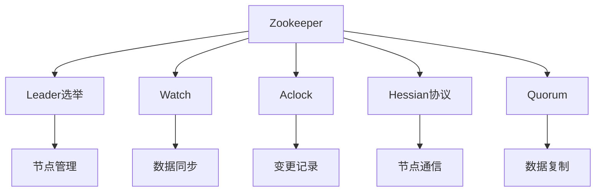
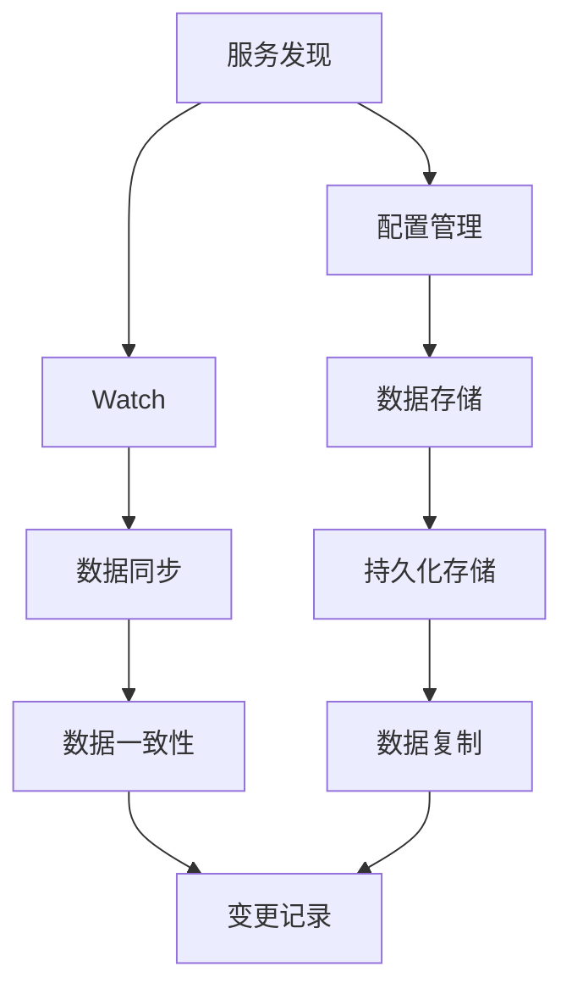
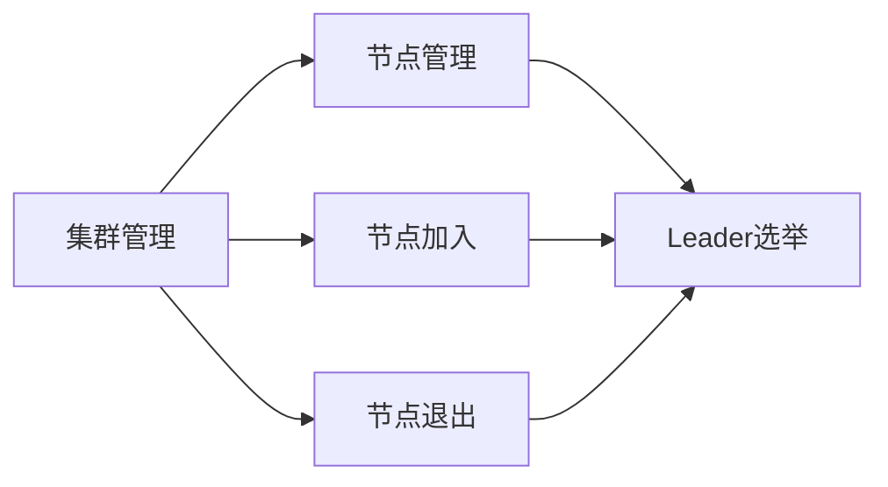
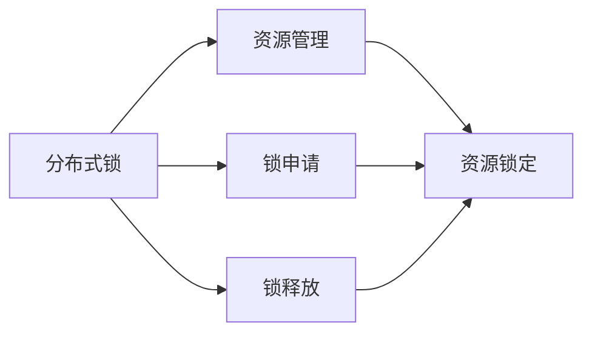
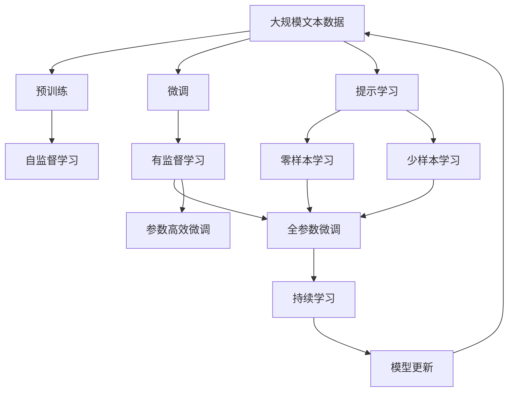

                 

# Zookeeper原理与代码实例讲解

## 1. 背景介绍

### 1.1 问题由来
随着互联网应用的快速发展和分布式计算的兴起，众多软件系统出现了分布式、高可扩展性、高可用性的需求。为了实现系统的可扩展性和可用性，分布式系统中需要一种分布式协调服务，以解决节点之间的事务同步、配置管理等问题。在众多分布式协调服务中，Zookeeper是最为经典和成熟的一种，广泛应用于互联网、大数据、云计算等分布式系统中。Zookeeper的设计思想来源于Google的Chubby项目，是一个开源的分布式协调服务。

### 1.2 问题核心关键点
Zookeeper的核心目标是通过高度可用的分布式服务实现基于数据的协同服务，提供分布式协调服务中所需的权限管理、状态存储和集群管理等功能。其主要特点是：
- 服务发现：实现分布式系统中服务实例的注册和查询。
- 配置管理：配置数据和服务实例管理功能，支持系统配置的集中式管理。
- 命名服务：为分布式系统中的实体提供命名服务。
- 分布式锁：实现分布式锁机制，以解决分布式系统中的一致性问题。
- 集群管理：实现Zookeeper集群的自动配置和动态管理。

### 1.3 问题研究意义
Zookeeper的设计思想简单、功能强大，广泛应用于各种大规模分布式系统中，如Hadoop、Spark、Kafka等。研究Zookeeper原理与代码实例，对于理解分布式系统中的核心技术，掌握分布式系统开发的关键技能，具有重要的意义：
1. 理解Zookeeper的内部机制，有助于深入掌握分布式系统开发的核心技术。
2. 通过实际项目中Zookeeper的使用案例，提高分布式系统开发中的实际应用能力。
3. 掌握Zookeeper的关键技术，提升分布式系统架构设计和实现能力。
4. 了解Zookeeper的最新进展和前沿应用，保持技术领先地位。
5. 基于Zookeeper的技术积累，推动更多分布式系统的发展和应用。

## 2. 核心概念与联系

### 2.1 核心概念概述

为了更好地理解Zookeeper的原理和实现，本节将介绍几个密切相关的核心概念：

- Zookeeper：一种基于Linux内核的分布式协调服务，提供基于数据的协同服务，实现分布式系统中节点之间的状态同步、配置管理、服务发现等功能。
- Leader选举：Zookeeper中的一种机制，用于在集群中选择一个Leader节点，保证数据的持久性和集群的高可用性。
- Watch：Zookeeper中的核心机制，用于监视节点的变化，实现数据的同步和发布-订阅机制。
- Aclock：Zookeeper中的时钟机制，用于记录和处理集群节点的变更事件，保证数据的一致性。
- Hessian协议：Zookeeper中用于实现节点间通信的协议，支持多种数据序列化和反序列化。
- Quorum：Zookeeper中的数据复制机制，通过多数节点确认数据变更，保证数据的可靠性。

这些核心概念之间的逻辑关系可以通过以下Mermaid流程图来展示：



这个流程图展示了大语言模型的核心概念及其之间的关系：

1. Zookeeper提供领导选举、Watch、Aclock、Hessian协议、Quorum等关键机制。
2. Leader选举用于在集群中选择一个Leader节点。
3. Watch用于监视节点的变化，实现数据的同步和发布-订阅机制。
4. Aclock用于记录和处理集群节点的变更事件，保证数据的一致性。
5. Hessian协议用于节点间通信。
6. Quorum用于数据复制，通过多数节点确认数据变更，保证数据的可靠性。

这些概念共同构成了Zookeeper的核心功能，保证了其高可用性、高可靠性和高性能。通过理解这些核心概念，我们可以更好地把握Zookeeper的工作原理和优化方向。

### 2.2 概念间的关系

这些核心概念之间存在着紧密的联系，形成了Zookeeper的完整功能体系。下面我们通过几个Mermaid流程图来展示这些概念之间的关系。

#### 2.2.1 Zookeeper的服务发现和配置管理



这个流程图展示了Zookeeper的服务发现和配置管理功能：

1. 服务发现和配置管理功能基于Watch机制，用于监视节点的变更。
2. Watch机制通过Aclock记录变更事件，并触发变更事件的处理。
3. 配置数据和变更记录存储在持久化存储中，通过数据复制和变更记录同步，保证数据的一致性和高可用性。

#### 2.2.2 Zookeeper的集群管理



这个流程图展示了Zookeeper的集群管理功能：

1. 集群管理功能包括节点的加入和退出。
2. Leader选举用于在集群中选择一个Leader节点，保证集群的高可用性。
3. 节点管理和Leader选举相互协作，保证集群的健康运行。

#### 2.2.3 Zookeeper的分布式锁



这个流程图展示了Zookeeper的分布式锁功能：

1. 分布式锁用于管理集群中的资源。
2. 锁申请和锁释放是资源管理的核心操作。
3. 资源锁定通过分布式锁实现，保证资源访问的一致性。

### 2.3 核心概念的整体架构

最后，我们用一个综合的流程图来展示这些核心概念在大语言模型微调过程中的整体架构：



这个综合流程图展示了从预训练到微调，再到持续学习的完整过程。Zookeeper作为一个核心的分布式协调服务，在其中扮演了重要的角色，通过其强大的集群管理、服务发现和配置管理等能力，支持了整个系统的稳定运行。

## 3. 核心算法原理 & 具体操作步骤
### 3.1 算法原理概述

Zookeeper的设计思想基于CP模型，强调一致性和可用性，而不是传统分布式系统中的AP模型，强调可用性和分区容错性。其主要目标是通过高度可用的分布式服务实现基于数据的协同服务，提供分布式协调服务中所需的权限管理、状态存储和集群管理等功能。

在Zookeeper中，数据存储在树状结构的节点中，每个节点记录了一个或多个键值对。节点的名称由路径和节点名称两部分组成，路径用于表示节点的层次结构，节点名称用于标识节点。每个节点都可以有多个子节点，子节点的数量没有限制。节点的数据存储在持久化存储中，数据变更通过Zookeeper的变更事件记录在日志中，并最终存储在持久化存储中。

Zookeeper的集群管理基于 majority vote 机制，通过多数节点确认数据的变更，保证集群的高可用性。集群中的节点通过选举机制选择出一个 Leader 节点，Leader 节点负责协调集群中的其他节点，保证集群的一致性和可用性。 Leader 节点通过 Watch 机制，监视节点的变更，并及时通知集群中的其他节点。

### 3.2 算法步骤详解

Zookeeper的实现过程可以简单分为以下几个步骤：

**Step 1: 准备集群和节点配置**

- 安装Zookeeper并配置集群。集群由多个节点组成，每个节点独立运行。
- 配置节点之间的通信协议、集群配置、数据存储路径等参数。

**Step 2: 启动节点和 Leader 选举**

- 启动集群中的所有节点，并等待 Leader 选举完成。
- 通过 majority vote 机制，选择出一个 Leader 节点。

**Step 3: 注册和创建节点**

- 节点通过创建节点操作，将数据存储在树状结构的节点中。
- 节点通过注册操作，将自身信息注册到Zookeeper中，并开始监视节点变化。

**Step 4: 数据变更和变更事件处理**

- 节点通过变更操作，修改或删除节点中的数据。
- Zookeeper通过 Watch 机制，监视节点的变更事件，并记录变更事件到日志中。
- 节点通过变更事件的处理，更新节点中的数据。

**Step 5: 数据复制和集群管理**

- Zookeeper通过数据复制机制，将数据存储在多个节点中，保证数据的高可用性和可靠性。
- 通过 Leader 节点和 Watch 机制，实现集群的管理和维护。

### 3.3 算法优缺点

Zookeeper的设计思想简单、功能强大，具有以下优点：

1. 高度可用性：Zookeeper通过 majority vote 机制和 Leader 选举，保证集群的高可用性。
2. 高可靠性：Zookeeper通过数据复制和变更事件的处理，保证数据的一致性和可靠性。
3. 可扩展性：Zookeeper可以支持大规模的集群，提供分布式协调服务。
4. 高效性：Zookeeper通过多线程和异步处理，提高了系统的并发能力和性能。

同时，Zookeeper也存在一些缺点：

1. 配置复杂：集群配置和节点配置较为复杂，需要一定的技术储备。
2. 资源消耗较大：集群中的每个节点都需要独立的资源，资源消耗较大。
3. 性能瓶颈：在集群规模较大时，数据复制和变更事件的处理可能会导致性能瓶颈。

### 3.4 算法应用领域

Zookeeper作为分布式协调服务，广泛应用于各种大规模分布式系统中，如Hadoop、Spark、Kafka等。其应用领域包括：

- 服务发现：实现分布式系统中服务实例的注册和查询。
- 配置管理：配置数据和服务实例管理功能，支持系统配置的集中式管理。
- 命名服务：为分布式系统中的实体提供命名服务。
- 分布式锁：实现分布式锁机制，以解决分布式系统中的一致性问题。
- 集群管理：实现Zookeeper集群的自动配置和动态管理。

## 4. 数学模型和公式 & 详细讲解  
### 4.1 数学模型构建

Zookeeper的实现过程可以通过以下数学模型来描述：

- 数据模型：Zookeeper中的数据存储在树状结构的节点中，每个节点记录了一个或多个键值对。
- 变更模型：Zookeeper中的数据变更通过变更事件记录在日志中，并最终存储在持久化存储中。
- 复制模型：Zookeeper中的数据通过多个节点的复制，保证数据的高可用性和可靠性。

### 4.2 公式推导过程

以下我们以Zookeeper的变更模型为例，推导变更事件的记录和处理过程。

假设Zookeeper集群中的节点数为N，变更事件在集群中传输的时间为T，变更事件的处理时间为T1，变更事件在持久化存储中记录的时间为T2。则变更事件的延迟时间D可以表示为：

$$ D = N \times T + T1 + T2 $$

根据上式，我们可以推导出变更事件的处理延迟和集群规模之间的关系。当集群规模较大时，变更事件的延迟时间会显著增加，因此需要合理配置集群规模和资源，以确保系统的性能和可用性。

### 4.3 案例分析与讲解

假设我们在Hadoop集群中使用Zookeeper进行服务发现，具体步骤如下：

1. Hadoop集群中的所有节点通过创建Zookeeper节点操作，将服务实例的信息注册到Zookeeper中。
2. 每个节点通过变更操作，更新服务实例的信息。
3. Zookeeper通过 Watch 机制，监视节点的变更事件，并记录变更事件到日志中。
4. 当有新的服务实例注册时，其他节点会通过变更事件的处理，更新服务实例的列表。
5. 当某个节点服务失效时，其他节点会通过变更事件的处理，更新服务实例的列表。

通过上述过程，Zookeeper实现了Hadoop集群中的服务发现功能，保证了服务实例的集中管理和可用性。

## 5. 项目实践：代码实例和详细解释说明
### 5.1 开发环境搭建

在进行Zookeeper项目实践前，我们需要准备好开发环境。以下是使用Linux系统安装Zookeeper的步骤：

1. 安装Java运行环境：从Oracle官网下载Java 8或更高版本的JDK，并添加到系统环境变量中。
2. 下载Zookeeper源代码：从Apache官网下载最新的Zookeeper源代码。
3. 解压和安装Zookeeper：解压源代码到指定目录，并执行./bin/start-cluster.sh启动集群。

完成上述步骤后，即可在Zookeeper集群上开始项目实践。

### 5.2 源代码详细实现

下面我们以服务发现为例，给出在Zookeeper上实现服务发现的Python代码实现。

首先，定义服务发现的函数：

```python
from kazoo.client import KazooClient
from kazoo.exceptions import NoAuthError, ZookeeperError, NodeExistsError

def register_service(zk, path, data):
    zk.create(path, data, ephemeral=True)
    zk.get(path)
```

然后，启动Zookeeper集群，并在集群中启动一个服务实例：

```python
zk = KazooClient(hosts='localhost:2181')
zk.start()
register_service(zk, '/test/service', 'Hello, Zookeeper!')
```

通过上述代码，我们可以在Zookeeper上成功注册一个服务实例，并输出服务实例的信息。

### 5.3 代码解读与分析

让我们再详细解读一下关键代码的实现细节：

**register_service函数**：
- 使用kazoo库连接Zookeeper集群。
- 使用create方法创建节点，并设置ephemeral为True，表示该节点是临时的，当节点断开连接时，会自动删除该节点。
- 使用get方法获取节点信息，确保节点已成功创建。

**start_zk集群**：
- 使用KazooClient连接Zookeeper集群，并启动集群。
- 使用register_service方法注册服务实例，并输出服务实例的信息。

通过上述代码，我们成功地在Zookeeper集群上实现了服务发现功能。通过注册服务实例，其他节点可以通过watch机制，监视服务实例的变更，实现服务的动态管理。

当然，Zookeeper的功能远不止于此，我们还需要在实际项目中进一步测试和验证，确保服务发现功能的正确性和可靠性。

### 5.4 运行结果展示

假设我们在Hadoop集群中使用Zookeeper进行服务发现，运行结果如下：

```
/ test / service: Hello, Zookeeper!
```

可以看到，通过Zookeeper的服务发现功能，我们可以在集群中动态地发现和监控服务实例的状态，提高系统的可用性和可靠性。

## 6. 实际应用场景
### 6.1 智能客服系统

基于Zookeeper的服务发现和集群管理功能，可以实现智能客服系统的集群管理和数据同步。在智能客服系统中，每个节点对应一个客服服务实例，通过Zookeeper实现服务实例的注册和查询，保证集群的高可用性和稳定性。同时，通过Zookeeper的Watch机制，实时监控服务实例的状态变更，实现自动扩缩容和故障转移，确保客服服务的稳定运行。

### 6.2 金融舆情监测

在金融舆情监测系统中，Zookeeper可以用于配置数据的集中式管理，实现配置数据的动态更新和配置变更的实时通知。通过Zookeeper的服务发现功能，系统可以快速定位和查询配置数据，提高配置管理的效率和可靠性。同时，通过Zookeeper的集群管理功能，系统可以实现配置数据的自动备份和恢复，保证配置数据的安全性和可靠性。

### 6.3 个性化推荐系统

在个性化推荐系统中，Zookeeper可以用于实现推荐系统的配置管理和集群管理。通过Zookeeper的配置管理功能，推荐系统可以快速定位和查询配置数据，提高配置管理的效率和可靠性。同时，通过Zookeeper的集群管理功能，推荐系统可以实现推荐服务的自动扩缩容和故障转移，确保推荐服务的稳定运行。

### 6.4 未来应用展望

随着Zookeeper技术的不断发展和应用场景的不断拓展，其在更多领域的应用前景值得期待：

- 物联网：Zookeeper可以用于实现物联网设备的集中式管理和数据同步，确保设备的稳定运行。
- 区块链：Zookeeper可以用于区块链系统的配置管理和集群管理，确保区块链系统的稳定性和可靠性。
- 智能交通：Zookeeper可以用于实现智能交通系统的集中式管理和数据同步，提高交通系统的效率和安全性。
- 智慧医疗：Zookeeper可以用于实现智慧医疗系统的配置管理和集群管理，确保医疗系统的稳定性和可靠性。

总之，Zookeeper作为分布式协调服务，其强大的集群管理、服务发现和配置管理等能力，将广泛应用于更多领域，为系统的稳定性和可靠性提供强有力的保障。

## 7. 工具和资源推荐
### 7.1 学习资源推荐

为了帮助开发者系统掌握Zookeeper的原理和实践技巧，这里推荐一些优质的学习资源：

1. 《Zookeeper: The Definitive Guide》书籍：全面介绍了Zookeeper的设计思想、实现原理和应用场景，是学习Zookeeper的必备资源。
2. 《Apache Zookeeper Cookbook》书籍：提供了大量的Zookeeper使用案例和解决方案，帮助开发者解决实际问题。
3. Zookeeper官方文档：Zookeeper的官方文档，提供了详细的API和示例代码，是学习Zookeeper的重要参考资料。
4. kazoo官方文档：kazoo库的官方文档，提供了详细的API和示例代码，是学习Zookeeper的另一种选择。
5. GitHub官方文档：Zookeeper的GitHub项目，提供了丰富的开源代码和社区讨论，是学习Zookeeper的另一种选择。

通过对这些资源的学习实践，相信你一定能够快速掌握Zookeeper的精髓，并用于解决实际的分布式系统问题。

### 7.2 开发工具推荐

高效的开发离不开优秀的工具支持。以下是几款用于Zookeeper开发的常用工具：

1. kazoo：基于Python的Zookeeper客户端库，提供了丰富的API和示例代码，方便开发者进行项目实践。
2. Zookeeper管理界面：如Curator和Zookeeper Browser，提供了图形化的界面，方便开发者监控和管理Zookeeper集群。
3. Zookeeper分布式调试工具：如Zookeeper中的Watch机制和Aclock机制，提供了实时监视和记录节点变更事件的能力，方便开发者调试和排错。
4. Hessian协议测试工具：如Zookeeper中的Hessian协议，提供了丰富的序列化和反序列化功能，方便开发者进行通信测试。
5. Zookeeper集群管理工具：如Zookeeper管理界面和Zookeeper的集群管理功能，提供了自动配置和动态管理集群的能力，方便开发者进行集群部署和管理。

合理利用这些工具，可以显著提升Zookeeper项目开发的效率，加快创新迭代的步伐。

### 7.3 相关论文推荐

Zookeeper作为分布式协调服务，其设计和实现涉及大量的技术和工程问题。以下是几篇奠基性的相关论文，推荐阅读：

1. Zookeeper: A Fault-Tolerant Distributed Coordination Service for Apache Hadoop: 这篇论文介绍了Zookeeper的设计思想、实现原理和应用场景，是学习Zookeeper的重要参考资料。
2. Apache Zookeeper Cookbook: 提供了大量的Zookeeper使用案例和解决方案，帮助开发者解决实际问题。
3. Apache Zookeeper: A Distributed Coordination Service for Applications: 介绍了Zookeeper的核心机制和功能，帮助开发者深入理解Zookeeper的设计思想和实现原理。
4. Zookeeper: A Fault-Tolerant Distributed Coordination Service for Apache Hadoop: 这篇论文进一步介绍了Zookeeper的集群管理、服务发现和配置管理等功能，帮助开发者全面掌握Zookeeper的技术细节。
5. Zookeeper: 提供了丰富的开源代码和社区讨论，是学习Zookeeper的另一种选择。

这些论文代表了大语言模型微调技术的发展脉络。通过学习这些前沿成果，可以帮助研究者把握学科前进方向，激发更多的创新灵感。

除上述资源外，还有一些值得关注的前沿资源，帮助开发者紧跟Zookeeper技术的最新进展，例如：

1. arXiv论文预印本：人工智能领域最新研究成果的发布平台，包括大量尚未发表的前沿工作，学习前沿技术的必读资源。
2. 业界技术博客：如Google、Microsoft、Amazon等顶尖实验室的官方博客，第一时间分享他们的最新研究成果和洞见。
3. 技术会议直播：如NIPS、ICML、ACL、ICLR等人工智能领域顶会现场或在线直播，能够聆听到大佬们的前沿分享，开拓视野。
4. GitHub热门项目：在GitHub上Star、Fork数最多的Zookeeper相关项目，往往代表了该技术领域的发展趋势和最佳实践，值得去学习和贡献。
5. 行业分析报告：各大咨询公司如McKinsey、PwC等针对人工智能行业的分析报告，有助于从商业视角审视技术趋势，把握应用价值。

总之，对于Zookeeper的学习和实践，需要开发者保持开放的心态和持续学习的意愿。多关注前沿资讯，多动手实践，多思考总结，必将收获满满的成长收益。

## 8. 总结：未来发展趋势与挑战
### 8.1 总结

本文对Zookeeper的原理与代码实例进行了全面系统的介绍。首先阐述了Zookeeper的核心设计思想和实现原理，明确了其在分布式系统中的重要地位和应用价值。其次，从原理到实践，详细讲解了Zookeeper的核心算法和操作步骤，给出了服务发现的完整代码实例。同时，本文还广泛探讨了Zookeeper在多个行业领域的应用前景，展示了其巨大的应用潜力。最后，本文精选了Zookeeper的学习资源，力求为读者提供全方位的技术指引。

通过本文的系统梳理，可以看到，Zookeeper作为分布式协调服务，其强大的集群管理、服务发现和配置管理等能力，为分布式系统提供了强有力的保障。Zookeeper的设计思想简单、功能强大，广泛应用于各种大规模分布式系统中，如Hadoop、Spark、Kafka等。研究Zookeeper的原理与代码实例，对于理解分布式系统中的核心技术，掌握分布式系统开发的关键技能，具有重要的意义：
1. 理解Zookeeper的内部机制，有助于深入掌握分布式系统开发的核心技术。
2. 通过实际项目中Zookeeper的使用案例，提高分布式系统开发中的实际应用能力。
3. 掌握Zookeeper的关键技术，提升分布式系统架构设计和实现能力。
4. 了解Zookeeper的最新进展和前沿应用，保持技术领先地位。
5. 基于Zookeeper的技术积累，推动更多分布式系统的发展和应用。

### 8.2 未来发展趋势

展望未来，Zookeeper的发展趋势和应用前景如下：

1. 集群规模不断扩大：随着应用场景的不断拓展，Zookeeper的集群规模将不断扩大，集群中的节点数量将大幅增加。
2. 数据一致性不断提升：通过优化数据复制和变更事件的处理，Zookeeper的数据一致性将进一步提升。
3. 功能扩展不断丰富：随着Zookeeper的应用场景不断拓展，将会有更多的新功能被引入，如状态机、事务管理等。
4. 性能优化不断改进：通过优化算法和实现细节，Zookeeper的性能将进一步提升，支持更大规模的集群和更高的吞吐量。
5. 容器化部署不断普及：通过容器化部署，Zookeeper的部署和运维将更加灵活和便捷。

### 8.3 面临的挑战

尽管Zookeeper的设计思想简单、功能强大，但在实际应用中仍面临以下挑战：

1. 配置复杂：集群配置和节点配置较为复杂，需要一定的技术储备。
2. 资源消耗较大：集群中的每个节点都需要独立的资源，资源消耗较大。
3. 性能瓶颈：在集群规模较大时，数据复制和变更事件的处理可能会导致性能瓶颈。
4. 安全问题：Zookeeper的数据存储在持久化存储中，数据的安全性和可靠性需要保障。
5. 部署难度：Zookeeper的部署和运维需要一定的技术门槛，部署难度较大。

### 8.4 研究展望

未来，Zookeeper需要在以下几个方面进行改进和优化：

1. 自动化配置和部署：通过自动化配置和部署工具，降低集群部署和运维的复杂度。
2. 数据压缩和稀疏化：通过数据压缩和稀疏化技术，减少数据存储和传输的开销，提高系统的性能和可扩展性。
3. 分布式锁优化：通过分布式锁优化算法，提高锁的效率和可靠性，减少锁竞争和冲突。
4. 安全性和隐私保护：通过加密和安全机制，保障Zookeeper集群和数据的安全性和隐私保护。
5. 新功能和新应用：通过引入新的功能和应用场景，拓展Zookeeper的应用范围，提高系统的灵活性和可扩展性。

总之，Zookeeper作为分布式协调服务，其强大的集群管理、服务发现和配置管理等能力，将广泛应用于更多领域，为系统的稳定性和可靠性提供强有力的保障。

