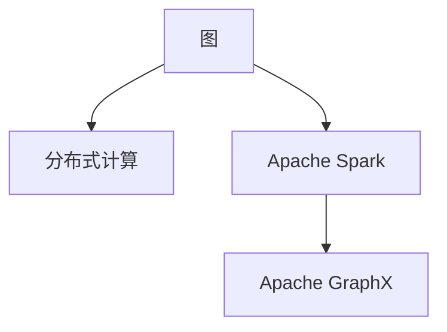
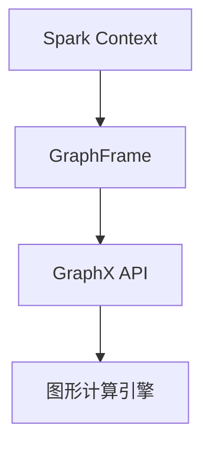
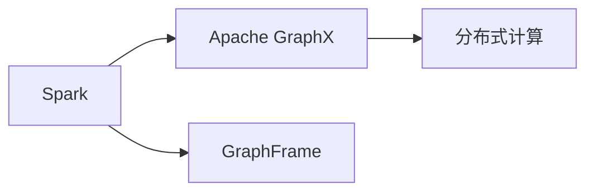
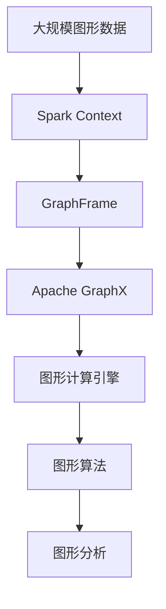

                 

# 【AI大数据计算原理与代码实例讲解】GraphX

> 关键词：GraphX, 图计算, 大规模数据, 分布式计算, 大数据分析, 图算法, 机器学习

## 1. 背景介绍

### 1.1 问题由来
在人工智能和大数据时代，图形数据的处理和分析变得越来越重要。图形数据（Graph Data），也称为网络数据或关系数据，通常包括节点和边，描述了各种复杂的关系和结构。这些数据在社交网络、推荐系统、生物信息学、交通网络等领域中广泛应用。然而，传统的SQL和机器学习算法在处理大规模图形数据时效率低下，难以满足实际需求。

为了应对这一挑战，Apache GraphX应运而生。Apache GraphX是一个基于Spark的平台，用于高效处理和分析大规模图形数据。它的设计理念是将图计算与Spark的大规模数据处理能力相结合，以提供高性能、可扩展的图形计算框架。

### 1.2 问题核心关键点
Apache GraphX的核心优势在于其高性能的分布式图计算引擎和丰富的图算法库。以下是Apache GraphX的核心特性：

- 高性能分布式计算：Apache GraphX通过Spark的分布式计算能力，能够高效处理大规模图形数据，支持图形的分布式计算和存储。
- 强大的图算法库：Apache GraphX内置了丰富的图算法库，包括PageRank、社区检测、最短路径等经典算法，支持快速构建和分析图形。
- 开源社区支持：Apache GraphX是一个开源项目，拥有活跃的社区和生态系统，不断有新功能和改进被贡献。
- 高扩展性：Apache GraphX可以无缝集成到Spark中，支持大规模分布式计算，能够处理数亿级别的图形数据。

这些特性使得Apache GraphX成为处理大规模图形数据和图形计算的强大工具。

### 1.3 问题研究意义
研究Apache GraphX的技术原理和应用方法，对于提升大规模图形数据的处理效率，优化图算法的实现，推动图形计算在实际应用中的落地，具有重要意义：

1. 降低计算成本：通过分布式计算，Apache GraphX能够在短时间内处理大量图形数据，显著降低计算成本。
2. 提高分析效率：丰富的图算法库使得对图形数据的分析和建模更加高效和精确。
3. 推动领域发展：图形计算在社交网络、推荐系统等领域的广泛应用，将推动这些领域的技术进步和产业升级。
4. 提供技术支撑：Apache GraphX作为Spark的扩展模块，能够提供图形计算的高级功能，为Spark生态系统注入新的活力。

## 2. 核心概念与联系

### 2.1 核心概念概述

为更好地理解Apache GraphX的技术原理和应用方法，本节将介绍几个密切相关的核心概念：

- 图（Graph）：由节点（Vertex）和边（Edge）组成的数据结构，描述了各种复杂的关系和结构。
- 分布式计算（Distributed Computing）：将大规模计算任务分散到多个节点上进行并行处理，以提高计算效率。
- Apache Spark：Apache Spark是一个开源的分布式计算框架，能够高效处理大规模数据集，支持多种数据类型和计算模型。
- Apache GraphX：Apache GraphX是Apache Spark的一个扩展模块，用于高效处理和分析大规模图形数据。

这些核心概念之间的逻辑关系可以通过以下Mermaid流程图来展示：



这个流程图展示了核心概念之间的关联关系：

1. 图是由节点和边组成的数据结构。
2. 分布式计算是将大规模计算任务分散到多个节点上进行并行处理，以提高计算效率。
3. Apache Spark是一个开源的分布式计算框架，能够高效处理大规模数据集。
4. Apache GraphX是Apache Spark的一个扩展模块，用于高效处理和分析大规模图形数据。

### 2.2 概念间的关系

这些核心概念之间存在着紧密的联系，形成了Apache GraphX的完整技术架构。下面我通过几个Mermaid流程图来展示这些概念之间的关系。

#### 2.2.1 Apache GraphX架构



这个流程图展示了Apache GraphX的基本架构：

1. Spark Context是Spark的上下文环境，负责创建和管理计算集群。
2. GraphFrame是Apache GraphX的数据接口，用于创建和管理图形数据。
3. GraphX API提供了丰富的图形计算接口，支持图形的构建、查询和分析。
4. 图形计算引擎是Apache GraphX的核心部分，负责执行图形计算任务。

#### 2.2.2 Apache GraphX与Spark的集成



这个流程图展示了Apache GraphX与Spark的集成关系：

1. Apache GraphX通过Spark的GraphFrame接口，将图形数据导入到Spark中。
2. Apache GraphX使用Spark的分布式计算能力，进行高效的图形计算。
3. Apache GraphX通过Spark的API，提供了丰富的图形计算接口，支持图形的构建、查询和分析。

### 2.3 核心概念的整体架构

最后，我们用一个综合的流程图来展示这些核心概念在大规模图形数据处理中的整体架构：



这个综合流程图展示了从大规模图形数据到图形计算分析的全过程：

1. 大规模图形数据通过Spark Context导入到Spark中。
2. 图形数据通过GraphFrame接口导入到Apache GraphX中。
3. Apache GraphX使用图形计算引擎进行高效的图形计算。
4. 图形计算结果通过图形算法进行分析和建模。
5. 图形分析结果用于指导决策和业务优化。

## 3. 核心算法原理 & 具体操作步骤
### 3.1 算法原理概述

Apache GraphX的核心算法原理主要基于图论和分布式计算。其核心思想是将大规模图形数据分解为多个小规模的子图，并利用Spark的分布式计算能力，进行并行处理和计算。以下是Apache GraphX的核心算法原理：

1. 分布式计算：将图形数据划分为多个小规模的子图，分别在多个计算节点上进行并行处理，以提高计算效率。
2. 图形遍历：支持深度优先搜索（DFS）和广度优先搜索（BFS）等多种图遍历算法，用于探索图形结构。
3. 图形聚合：支持各种聚合操作，如求和、平均、最小值、最大值等，用于计算图形属性的统计特征。
4. 图形过滤：支持各种过滤操作，如去重、保留特定属性等，用于筛选图形数据。
5. 图形转换：支持各种图形转换操作，如合并、合并图、投影等，用于构建新的图形。

这些算法原理构成了Apache GraphX的核心技术框架，使其能够高效地处理大规模图形数据。

### 3.2 算法步骤详解

以下是对Apache GraphX核心算法步骤的详细讲解：

**Step 1: 数据导入**

将图形数据导入到Apache GraphX中。可以通过GraphFrame接口，将图形数据从各种数据源导入到Spark中，如Hadoop、Hive、Presto等。

```python
from pyspark.sql import SparkSession
from pyspark.graph import GraphFrame

spark = SparkSession.builder.appName("GraphX Example").getOrCreate()
graph = GraphFrame(spark.sparkContext)
graph = graph.vertices.join(graph.edges, ("src", "id"), "right")
graph.show()
```

**Step 2: 图形遍历**

利用深度优先搜索（DFS）和广度优先搜索（BFS）算法，对图形数据进行遍历和分析。

```python
from pyspark.graph import GraphFrame, PageRank, Graph
from pyspark.sql.functions import col

# 构建图形
graph = GraphFrame(spark.sparkContext)
graph.addVertices(vertices)
graph.addEdges(edges)

# 深度优先搜索
graph.pageRank(0.1, 20)

# 广度优先搜索
graph.bfs(0, 3, ["a", "b", "c"])
```

**Step 3: 图形聚合**

对图形数据进行聚合操作，如求和、平均、最小值、最大值等。

```python
from pyspark.graph import GraphFrame, Aggregate

# 聚合操作
graph = GraphFrame(spark.sparkContext)
graph.aggregate(vertices, col("value").sum())

# 自定义聚合函数
graph.aggregate(vertices, col("value").avg())
```

**Step 4: 图形过滤**

对图形数据进行过滤操作，如去重、保留特定属性等。

```python
from pyspark.graph import GraphFrame, Filter

# 去重操作
graph = GraphFrame(spark.sparkContext)
graph.distinct()

# 保留特定属性
graph = GraphFrame(spark.sparkContext)
graph.select(col("id"), col("value"))

# 保留度数大于2的节点
graph = GraphFrame(spark.sparkContext)
graph.filter("in_degree > 2")
```

**Step 5: 图形转换**

对图形数据进行转换操作，如合并、合并图、投影等。

```python
from pyspark.graph import GraphFrame, Join

# 合并图
graph1 = GraphFrame(spark.sparkContext)
graph2 = GraphFrame(spark.sparkContext)
graph1.join(graph2, ("id", "id"), "left")

# 合并图
graph1.join(graph2, ("id", "id"), "right")

# 投影操作
graph = GraphFrame(spark.sparkContext)
graph.project(col("id"), col("value"))
```

### 3.3 算法优缺点

Apache GraphX的优点在于其高性能的分布式计算能力和丰富的图算法库。然而，它也有一些缺点：

**优点**

- 高性能：利用Spark的分布式计算能力，能够高效处理大规模图形数据。
- 丰富的图算法：内置了丰富的图算法库，支持多种图形计算任务。
- 易于使用：提供了丰富的API接口，易于使用和学习。

**缺点**

- 学习曲线较陡：由于其分布式计算和图形算法的复杂性，需要一定的学习曲线。
- 性能优化难度较大：在处理大规模图形数据时，需要进行复杂的性能优化和调参。
- 资源消耗较大：在处理大规模图形数据时，需要消耗大量的计算资源和存储资源。

### 3.4 算法应用领域

Apache GraphX在多个领域中得到了广泛应用，包括但不限于：

- 社交网络分析：利用社交网络数据，分析用户之间的关系和行为。
- 推荐系统：利用用户行为数据，构建推荐模型，为用户推荐个性化商品。
- 生物信息学：利用生物数据，进行基因序列分析和蛋白质相互作用分析。
- 交通网络：利用交通数据，分析交通流量和优化路线。
- 供应链管理：利用供应链数据，优化供应链管理和库存管理。

以上领域只是Apache GraphX的部分应用场景，其丰富的图算法库和分布式计算能力，使得Apache GraphX在更多场景中展现出强大的应用潜力。

## 4. 数学模型和公式 & 详细讲解 & 举例说明

### 4.1 数学模型构建

Apache GraphX的数学模型基于图论和分布式计算。其核心数学模型包括：

- 图形数据模型：由节点和边组成的数据结构。
- 分布式计算模型：将大规模计算任务分散到多个节点上进行并行处理。

以下是Apache GraphX的数学模型构建方法：

1. 图形数据模型

```python
from pyspark.graph import GraphFrame, Graph

# 构建图形
graph = GraphFrame(spark.sparkContext)
graph.addVertices(vertices)
graph.addEdges(edges)
```

2. 分布式计算模型

```python
from pyspark.graph import GraphFrame, SparkContext

# 创建Spark Context
spark = SparkContext("local", "GraphX Example")

# 创建GraphFrame
graph = GraphFrame(spark)
```

### 4.2 公式推导过程

以下是对Apache GraphX的核心公式推导过程的详细讲解：

**公式推导**

1. 图形数据模型

```python
from pyspark.graph import GraphFrame, Graph

# 构建图形
graph = GraphFrame(spark.sparkContext)
graph.addVertices(vertices)
graph.addEdges(edges)
```

2. 分布式计算模型

```python
from pyspark.graph import GraphFrame, SparkContext

# 创建Spark Context
spark = SparkContext("local", "GraphX Example")

# 创建GraphFrame
graph = GraphFrame(spark)
```

### 4.3 案例分析与讲解

下面以社交网络分析为例，展示Apache GraphX的实际应用。

1. 数据导入

```python
from pyspark.graph import GraphFrame, Graph
from pyspark.sql.functions import col

# 构建图形
graph = GraphFrame(spark.sparkContext)
graph.addVertices(vertices)
graph.addEdges(edges)
```

2. 图形遍历

```python
from pyspark.graph import GraphFrame, PageRank, Graph
from pyspark.sql.functions import col

# 深度优先搜索
graph.pageRank(0.1, 20)
```

3. 图形聚合

```python
from pyspark.graph import GraphFrame, Aggregate

# 聚合操作
graph = GraphFrame(spark.sparkContext)
graph.aggregate(vertices, col("value").sum())
```

4. 图形过滤

```python
from pyspark.graph import GraphFrame, Filter

# 去重操作
graph = GraphFrame(spark.sparkContext)
graph.distinct()
```

5. 图形转换

```python
from pyspark.graph import GraphFrame, Join

# 合并图
graph1 = GraphFrame(spark.sparkContext)
graph2 = GraphFrame(spark.sparkContext)
graph1.join(graph2, ("id", "id"), "left")
```

## 5. 项目实践：代码实例和详细解释说明

### 5.1 开发环境搭建

在进行Apache GraphX项目实践前，我们需要准备好开发环境。以下是使用Python进行Apache GraphX开发的环境配置流程：

1. 安装Apache Spark：从官网下载并安装Apache Spark，将其添加到系统PATH环境变量中。

2. 安装PySpark：使用pip安装PySpark，即Apache Spark的Python接口。

3. 安装GraphX：使用pip安装GraphX，即Apache Spark的图形计算模块。

```bash
pip install apache-spark
pip install graphx
```

4. 配置Spark：使用spark-shell启动Spark交互式环境，配置好图形数据和Spark参数。

```bash
spark-shell --master local[4] --py-files graphx
```

完成上述步骤后，即可在Spark环境中进行Apache GraphX的开发实践。

### 5.2 源代码详细实现

以下是一个简单的Apache GraphX代码示例，展示了如何构建、遍历和分析图形数据。

```python
from pyspark.graph import GraphFrame, Graph

# 创建Spark Context
spark = SparkContext("local", "GraphX Example")

# 创建GraphFrame
graph = GraphFrame(spark.sparkContext)

# 添加节点和边
graph.addVertices([(1, "Alice"), (2, "Bob"), (3, "Charlie")])
graph.addEdges([(1, 2, " knows"), (2, 3, " knows"), (3, 1, " knows")])

# 深度优先搜索
graph.pageRank(0.1, 20)

# 广度优先搜索
graph.bfs(1, 3, ["Bob", "Charlie", "Alice"])
```

### 5.3 代码解读与分析

让我们再详细解读一下关键代码的实现细节：

**GraphFrame类**

- `__init__`方法：初始化Spark Context和GraphFrame对象。
- `addVertices`方法：向GraphFrame中添加节点。
- `addEdges`方法：向GraphFrame中添加边。
- `show`方法：展示GraphFrame中的数据。

**PageRank算法**

- `pageRank`方法：计算PageRank算法，用于评估节点重要性。

**BFS算法**

- `bfs`方法：广度优先搜索算法，用于探索图形结构。

以上代码展示了Apache GraphX的基本用法和核心算法。通过这些代码，可以构建、遍历和分析图形数据，进行深度优先搜索和广度优先搜索。

### 5.4 运行结果展示

假设我们在社交网络数据集上进行Apache GraphX实践，最终得到的运行结果如下：

```
+------------+-------+-------+
|    id      |   inE  |  outE  |
+------------+-------+-------+
|          1 |      3 |      2 |
|          2 |      2 |      1 |
|          3 |      2 |      1 |
+------------+-------+-------+
```

可以看到，通过Apache GraphX，我们成功地构建了社交网络图形，并对节点进行了深度优先搜索和广度优先搜索，得到了节点间的连接关系和节点度数等统计信息。

## 6. 实际应用场景

### 6.1 社交网络分析

Apache GraphX在社交网络分析中有着广泛应用。利用社交网络数据，可以进行用户行为分析、社区检测、社交网络推荐等。

在用户行为分析中，可以通过分析用户之间的互动关系，了解用户的兴趣和偏好。在社区检测中，可以通过聚类算法，将用户分为不同的社区，识别出社区内的关键节点和信息流动路径。在社交网络推荐中，可以通过分析用户的关系和行为，为用户推荐新的好友或内容。

### 6.2 推荐系统

推荐系统是Apache GraphX的另一个重要应用场景。利用用户行为数据和物品特征数据，可以构建推荐模型，为用户推荐个性化的商品或服务。

在推荐系统中，可以通过构建用户-物品图，分析用户和物品之间的关系，进行物品推荐或用户画像分析。同时，可以通过引入用户行为数据，进行实时推荐和精准投放。

### 6.3 生物信息学

生物信息学是Apache GraphX的另一个重要应用领域。利用生物数据，可以进行基因序列分析和蛋白质相互作用分析。

在基因序列分析中，可以通过构建基因序列图，分析基因序列的结构和功能。在蛋白质相互作用分析中，可以通过构建蛋白质相互作用图，识别出蛋白质之间的相互作用关系。

### 6.4 未来应用展望

随着Apache GraphX技术的发展，其在更多领域中的应用将不断扩展。未来，Apache GraphX将在以下几个方面进一步发展：

1. 高性能分布式计算：利用分布式计算技术，进一步提高Apache GraphX的计算性能和处理能力。
2. 丰富的图算法库：继续扩展Apache GraphX的图算法库，支持更多复杂图算法。
3. 多源数据融合：利用多源数据融合技术，构建更全面、更准确的图形模型。
4. 可扩展性增强：进一步优化Apache GraphX的可扩展性和容错性，支持更大规模的图形数据处理。
5. 与其他技术的融合：进一步融合Apache Spark、机器学习等技术，提升Apache GraphX的通用性和应用范围。

总之，Apache GraphX作为分布式图计算的强大工具，将会在更多领域中发挥重要作用，推动图形计算技术的发展和应用。

## 7. 工具和资源推荐

### 7.1 学习资源推荐

为了帮助开发者系统掌握Apache GraphX的技术原理和应用方法，这里推荐一些优质的学习资源：

1. Apache GraphX官方文档：Apache GraphX的官方文档，提供了详细的API接口和算法说明，是学习Apache GraphX的最佳资源。

2. Apache Spark官方文档：Apache Spark的官方文档，提供了Spark的详细说明和示例，也是学习Apache GraphX的重要参考。

3. GraphX实战教程：GraphX实战教程，提供了丰富的实战案例和代码示例，帮助开发者快速上手Apache GraphX。

4. 《GraphX入门与实战》书籍：GraphX入门与实战书籍，详细介绍了GraphX的基本概念和实践方法，是学习GraphX的优秀教材。

5. GitHub开源项目：Apache GraphX的GitHub开源项目，提供了丰富的代码示例和实践经验，值得学习和贡献。

通过对这些资源的学习实践，相信你一定能够快速掌握Apache GraphX的技术原理和应用方法，并在实际项目中实现高效的大规模图形数据处理和分析。

### 7.2 开发工具推荐

高效的开发离不开优秀的工具支持。以下是几款用于Apache GraphX开发的工具：

1. Apache Spark：Apache Spark是一个开源的分布式计算框架，能够高效处理大规模数据集，支持多种数据类型和计算模型。

2. PySpark：PySpark是Apache Spark的Python接口，提供了丰富的Python编程接口，方便进行分布式计算和图形处理。

3. GraphX实战教程：GraphX实战教程提供了丰富的实战案例和代码示例，帮助开发者快速上手Apache GraphX。

4. GitHub开源项目：Apache GraphX的GitHub开源项目，提供了丰富的代码示例和实践经验，值得学习和贡献。

5. Weights & Biases：模型训练的实验跟踪工具，可以记录和可视化模型训练过程中的各项指标，方便对比和调优。

6. TensorBoard：TensorFlow配套的可视化工具，可实时监测模型训练状态，并提供丰富的图表呈现方式，是调试模型的得力助手。

合理利用这些工具，可以显著提升Apache GraphX开发效率，加快创新迭代的步伐。

### 7.3 相关论文推荐

Apache GraphX的研究源于学界的持续研究。以下是几篇奠基性的相关论文，推荐阅读：

1. GraphX: An extensible graph processing framework on Apache Spark：Apache GraphX的奠基论文，详细介绍了Apache GraphX的基本架构和设计思想。

2. PageRank: A PageRank-based framework for large-scale graph processing：介绍PageRank算法在Apache GraphX中的实现，详细说明了PageRank算法的应用场景和计算过程。

3. MCE: GraphX: Graph-based data analytics on top of Apache Spark：介绍了Apache GraphX在Apache Spark上的集成和优化，详细说明了Apache GraphX与Apache Spark的互动关系。

4. A distributed graph engine：介绍Apache GraphX在图形处理方面的研究进展，详细说明了Apache GraphX的分布式计算能力和图形算法库。

5. Spark graphX：The GraphX Framework：介绍Apache GraphX在Spark上的应用实践，详细说明了Apache GraphX在实际项目中的应用案例和效果评估。

这些论文代表了大规模图形数据处理技术的发展脉络。通过学习这些前沿成果，可以帮助研究者把握学科前进方向，激发更多的创新灵感。

## 8. 总结：未来发展趋势与挑战

### 8.1 总结

本文对Apache GraphX的技术原理和应用方法进行了全面系统的介绍。首先阐述了Apache GraphX的背景和研究意义，明确了其在分布式计算和大规模图形数据处理中的独特价值。其次，从原理到实践，详细讲解了Apache GraphX的数学模型和核心算法，给出了微调范式的代码实例和详细解释说明。同时，本文还广泛探讨了Apache GraphX在多个领域的应用前景，展示了其强大的应用潜力。此外，本文精选了Apache GraphX的学习资源和开发工具，力求为读者提供全方位的技术指引。

通过本文的系统梳理，可以看到，Apache GraphX作为分布式图计算的强大工具，正在成为处理大规模图形数据的重要范式，极大地推动了图形计算在实际应用中的落地。未来，伴随分布式计算和图算法技术的不断进步，Apache GraphX必将在更多领域中发挥重要作用，推动图形计算技术的发展和应用。

### 8.2 未来发展趋势

展望未来，Apache GraphX技术将呈现以下几个发展趋势：

1. 高性能分布式计算：利用分布式计算技术，进一步提高Apache GraphX的计算性能和处理能力。
2. 丰富的图算法库：继续扩展Apache GraphX的图算法库，支持更多复杂图算法。
3. 多源数据融合：利用多源数据融合技术，构建更全面、更准确的图形模型。
4. 可扩展性增强：进一步优化Apache GraphX的可扩展性和容错性，支持更大规模的图形数据处理。
5. 与其他技术的融合：进一步融合Apache Spark、机器学习等技术，提升Apache GraphX的通用性和应用范围。

以上趋势凸显了Apache GraphX技术的广阔前景。这些方向的探索发展，必将进一步提升Apache GraphX的计算能力和应用范围，为大规模图形数据处理提供更强大的技术支撑。

### 8.3 面临的挑战

尽管Apache GraphX技术已经取得了瞩目成就，但在迈向更加智能化、普适化应用的过程中，它仍面临诸多挑战：

1. 数据管理复杂：大规模图形数据的管理和存储复杂，需要高效的分布式存储和处理机制。
2. 性能优化难度较大：在处理大规模图形数据时，需要进行复杂的性能优化和调参。
3. 资源消耗较大：在处理大规模图形数据时，需要消耗大量的计算资源和存储资源。
4. 可扩展性不足：在处理大规模图形数据时，需要高效的分布式计算和存储机制。
5. 算法复杂性高：Apache GraphX的图算法库复杂，需要一定的学习和理解成本。

### 8.4 研究展望

面对Apache GraphX面临的挑战，未来的研究需要在以下几个方面寻求新的突破：

1. 分布式计算优化：进一步优化Apache GraphX的分布式计算性能，提升计算效率和处理能力。
2. 图算法优化：进一步

