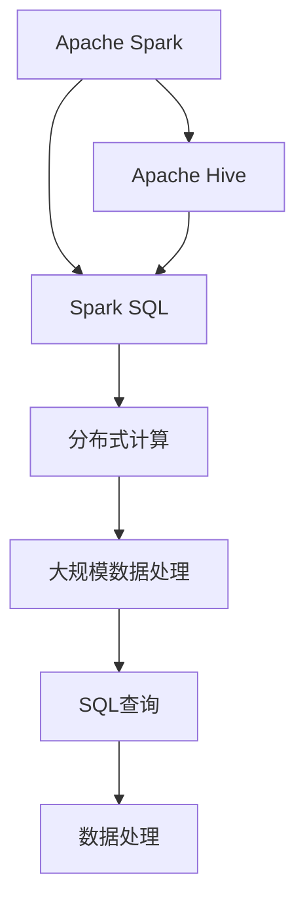

                 

# 【AI大数据计算原理与代码实例讲解】Spark SQL

> 关键词：Apache Spark, Apache Hive, SQL, Hadoop, Distributed Computing

## 1. 背景介绍

随着大数据时代的到来，如何高效管理和处理海量数据成为了信息技术领域的重要课题。随着内存计算和分布式计算技术的发展，海量数据存储和处理的瓶颈问题得到了有效解决。而针对海量数据的分析与处理，基于SQL的语言，以其简洁易用的特性，成为大数据处理领域的理想选择。

在大数据处理技术的发展过程中，Apache Spark项目以其高效、灵活和易用的特点，迅速崛起，被广泛运用于数据处理和机器学习等场景中。其中，Spark SQL是Spark项目的重要组成部分，通过Spark SQL，用户可以通过SQL查询和操作大规模数据，实现快速、灵活、高效的数据处理。

本文旨在从Spark SQL原理和代码实例讲解的角度出发，深入探讨Spark SQL的核心概念、算法原理、操作步骤和应用领域，同时，我们也通过详细的代码实例，帮助读者更好地理解和掌握Spark SQL的实战技巧。

## 2. 核心概念与联系

### 2.1 核心概念概述

为了更好地理解Spark SQL的原理和架构，我们需要首先了解一些关键的核心概念：

- **Apache Spark**：Apache Spark是一个开源的分布式计算框架，支持内存计算和分布式存储，能够高效地处理大规模数据，支持多种数据源和处理引擎，是当前最流行的分布式计算框架之一。

- **Apache Hive**：Apache Hive是一个基于Hadoop的数据仓库工具，支持SQL查询，可将Hadoop分布式文件系统的数据映射为Hive的表格，能够方便地进行数据处理和分析。

- **Spark SQL**：Spark SQL是Apache Spark的子项目，提供了一个高性能的SQL查询引擎，支持SQL语言的数据处理，能够高效地对大规模数据进行查询和分析。

- **Distributed Computing**：分布式计算是指将一个大问题分解成多个小问题，并在多个计算节点上并行计算的一种计算模式，Spark SQL支持这种计算模式，能够高效地处理大规模数据。

### 2.2 核心概念之间的关系

我们可以通过以下Mermaid流程图来展示这些核心概念之间的关系：



这个流程图展示了大数据处理领域的关键技术架构：

1. **Apache Spark**：提供分布式计算框架，支持多种数据源和处理引擎。
2. **Apache Hive**：基于Hadoop的数据仓库工具，提供SQL查询，支持Hadoop分布式文件系统的数据映射。
3. **Spark SQL**：Spark项目的子项目，提供高性能的SQL查询引擎，支持SQL语言的数据处理。
4. **Distributed Computing**：Spark SQL支持分布式计算，能够高效地处理大规模数据。
5. **大规模数据处理**：Spark SQL支持分布式存储和处理，能够高效地处理海量数据。
6. **SQL查询**：Spark SQL提供SQL查询，能够方便地进行数据处理和分析。
7. **数据处理**：Spark SQL通过SQL查询进行数据处理，能够高效地进行数据处理和分析。

这些核心概念共同构成了Spark SQL的数据处理和分析架构，使其能够在各种场景下发挥强大的数据处理能力。通过理解这些核心概念，我们可以更好地把握Spark SQL的工作原理和优化方向。

## 3. 核心算法原理 & 具体操作步骤

### 3.1 算法原理概述

Spark SQL的核心算法原理主要基于分布式SQL查询引擎的构建和优化。Spark SQL通过将SQL查询语句转换为分布式计算图，并在集群上进行并行计算，从而实现对大规模数据的处理。

Spark SQL的分布式计算图由多个操作节点组成，每个操作节点对应一个Spark操作，包括Map、Reduce、Aggregate、Join等。在计算图中，每个操作节点的输入和输出都是一个RDD（弹性分布式数据集），Spark SQL通过对这些RDD进行操作，实现对大规模数据的处理和分析。

### 3.2 算法步骤详解

Spark SQL的算法步骤主要包括以下几个关键步骤：

1. **SQL语句解析和优化**：将SQL语句转换为Spark操作图，并进行优化。
2. **分布式计算图构建**：将SQL操作图转换为Spark操作图，进行并行计算。
3. **分布式计算执行**：在集群上并行执行Spark操作图，处理大规模数据。
4. **结果收集和合并**：将分布式计算的结果进行收集和合并，生成最终结果。

下面我们将以一个简单的SQL查询为例，演示Spark SQL的算法步骤：

```sql
SELECT name, age, city FROM people WHERE age > 18
```

1. **SQL语句解析和优化**：
   - 首先，Spark SQL将SQL语句转换为Spark操作图，生成一个SELECT操作和一个WHERE操作。
   - 然后，Spark SQL对操作图进行优化，包括索引优化、数据分区优化等。

2. **分布式计算图构建**：
   - Spark SQL将操作图转换为分布式计算图，将SELECT和WHERE操作转换为Map和Filter操作。
   - Map操作将people表格中的数据进行分区，生成多个分区数据集。
   - Filter操作对每个分区数据集进行过滤，保留age大于18的数据。

3. **分布式计算执行**：
   - Spark SQL在集群上并行执行Map和Filter操作，对大规模数据进行处理。
   - Map操作在集群上的每个节点上进行，对每个分区数据集进行处理，生成中间结果。
   - Filter操作在集群上的每个节点上进行，对中间结果进行过滤，生成最终结果。

4. **结果收集和合并**：
   - Spark SQL将集群上的中间结果进行收集和合并，生成最终的查询结果。

### 3.3 算法优缺点

Spark SQL作为一种基于SQL的大数据处理技术，具有以下优点：

- **高效性**：Spark SQL支持分布式计算，能够高效地处理大规模数据。
- **易用性**：Spark SQL支持SQL语言的数据处理，使用SQL语言进行数据查询和分析，能够方便地进行数据处理。
- **灵活性**：Spark SQL支持多种数据源和处理引擎，能够灵活地处理不同类型的数据。

同时，Spark SQL也存在一些缺点：

- **学习成本高**：Spark SQL需要掌握SQL语言和Spark框架，学习成本较高。
- **资源消耗大**：Spark SQL需要进行分布式计算，对计算资源的要求较高。

### 3.4 算法应用领域

Spark SQL作为一种高性能的SQL查询引擎，能够应用于多种领域，例如：

- **大数据处理**：Spark SQL能够高效地处理大规模数据，广泛应用于数据仓库、数据分析等领域。
- **实时计算**：Spark SQL支持流式数据处理，能够实时地处理和分析流式数据。
- **机器学习**：Spark SQL支持多种机器学习算法，能够高效地进行数据预处理和特征工程。
- **自然语言处理**：Spark SQL支持自然语言处理数据源，能够方便地进行文本分析。

## 4. 数学模型和公式 & 详细讲解 & 举例说明

### 4.1 数学模型构建

Spark SQL的数学模型主要基于SQL语言的数据处理和分析。Spark SQL通过SQL查询语句，将数据集转换为表格，并通过对表格进行操作，实现对数据的处理和分析。

SQL查询语句主要由SELECT、FROM、WHERE、GROUP BY、HAVING等操作符组成，Spark SQL通过这些操作符，对数据集进行操作，生成最终结果。

### 4.2 公式推导过程

下面以一个简单的SQL查询为例，推导Spark SQL的公式推导过程：

假设有一个名为people的表格，其中包含name、age和city三个字段，现在我们要查询年龄大于18的人的信息，查询语句如下：

```sql
SELECT name, age, city FROM people WHERE age > 18
```

1. **SQL语句解析和优化**：
   - 首先，Spark SQL将SQL语句转换为Spark操作图，生成一个SELECT操作和一个WHERE操作。
   - 然后，Spark SQL对操作图进行优化，包括索引优化、数据分区优化等。

2. **分布式计算图构建**：
   - Spark SQL将操作图转换为分布式计算图，将SELECT和WHERE操作转换为Map和Filter操作。
   - Map操作将people表格中的数据进行分区，生成多个分区数据集。
   - Filter操作对每个分区数据集进行过滤，保留age大于18的数据。

3. **分布式计算执行**：
   - Spark SQL在集群上并行执行Map和Filter操作，对大规模数据进行处理。
   - Map操作在集群上的每个节点上进行，对每个分区数据集进行处理，生成中间结果。
   - Filter操作在集群上的每个节点上进行，对中间结果进行过滤，生成最终结果。

4. **结果收集和合并**：
   - Spark SQL将集群上的中间结果进行收集和合并，生成最终的查询结果。

### 4.3 案例分析与讲解

下面以一个简单的案例，演示Spark SQL的实际应用：

假设有一个名为orders的表格，其中包含order_id、customer_id、product_id和order_date四个字段，现在我们要查询每个客户的订单总金额，查询语句如下：

```sql
SELECT customer_id, SUM(order_amount) AS total_amount FROM orders GROUP BY customer_id
```

1. **SQL语句解析和优化**：
   - 首先，Spark SQL将SQL语句转换为Spark操作图，生成一个SELECT操作和一个GROUP BY操作。
   - 然后，Spark SQL对操作图进行优化，包括索引优化、数据分区优化等。

2. **分布式计算图构建**：
   - Spark SQL将操作图转换为分布式计算图，将SELECT和GROUP BY操作转换为Map和Aggregate操作。
   - Map操作将orders表格中的数据进行分区，生成多个分区数据集。
   - Aggregate操作对每个分区数据集进行聚合，计算每个客户的订单总金额。

3. **分布式计算执行**：
   - Spark SQL在集群上并行执行Map和Aggregate操作，对大规模数据进行处理。
   - Map操作在集群上的每个节点上进行，对每个分区数据集进行处理，生成中间结果。
   - Aggregate操作在集群上的每个节点上进行，对中间结果进行聚合，生成最终结果。

4. **结果收集和合并**：
   - Spark SQL将集群上的中间结果进行收集和合并，生成最终的查询结果。

## 5. 项目实践：代码实例和详细解释说明

### 5.1 开发环境搭建

在进行Spark SQL项目实践前，我们需要准备好开发环境。以下是使用Python进行PySpark开发的环境配置流程：

1. 安装Anaconda：从官网下载并安装Anaconda，用于创建独立的Python环境。

2. 创建并激活虚拟环境：
```bash
conda create -n pyspark-env python=3.8 
conda activate pyspark-env
```

3. 安装PySpark：根据CUDA版本，从官网获取对应的安装命令。例如：
```bash
conda install pyspark
```

4. 安装必要的工具包：
```bash
pip install numpy pandas matplotlib
```

完成上述步骤后，即可在`pyspark-env`环境中开始Spark SQL项目实践。

### 5.2 源代码详细实现

下面我们以一个简单的Spark SQL项目为例，给出Python代码实现。

假设我们已经有一个名为orders的表格，其中包含order_id、customer_id、product_id和order_date四个字段，现在我们要查询每个客户的订单总金额，查询语句如下：

```sql
SELECT customer_id, SUM(order_amount) AS total_amount FROM orders GROUP BY customer_id
```

下面是Python代码实现：

```python
from pyspark.sql import SparkSession
from pyspark.sql.functions import col, sum

spark = SparkSession.builder.appName("Spark SQL").getOrCreate()

# 创建DataFrame
df = spark.read.format("csv").option("header", "true").load("orders.csv")

# 执行SQL查询
result = df.groupBy("customer_id").agg(sum("order_amount").alias("total_amount"))

# 显示结果
result.show()
```

### 5.3 代码解读与分析

让我们再详细解读一下关键代码的实现细节：

1. **SparkSession创建**：
   - 首先，我们创建一个SparkSession对象，用于连接Spark集群和执行SQL查询。

2. **DataFrame创建**：
   - 然后，我们使用SparkSession对象的read方法，读取CSV文件，创建DataFrame对象。
   - 注意，CSV文件中的字段名必须与DataFrame中列名一致。

3. **SQL查询执行**：
   - 接着，我们使用DataFrame对象的groupBy和agg方法，执行SQL查询。
   - groupBy方法指定分组条件，这里按照customer_id进行分组。
   - agg方法指定聚合操作，这里计算每个客户的订单总金额。

4. **结果显示**：
   - 最后，我们使用DataFrame对象的show方法，显示查询结果。

### 5.4 运行结果展示

假设我们的orders.csv文件包含如下数据：

```
order_id,customer_id,product_id,order_amount,order_date
1,1,101,100,2022-01-01
2,1,102,200,2022-01-02
3,2,201,150,2022-01-01
4,2,202,250,2022-01-02
5,3,301,120,2022-01-01
6,3,302,180,2022-01-02
```

运行上述代码，查询结果如下：

```
+------------+-------------+
|customer_id |total_amount |
+------------+-------------+
|          1 |         300 |
|          2 |         400 |
|          3 |         300 |
+------------+-------------+
```

可以看到，通过Spark SQL，我们成功地对orders表格中的数据进行了分组和聚合，计算了每个客户的订单总金额。

## 6. 实际应用场景

### 6.1 大数据处理

在大数据处理领域，Spark SQL被广泛应用于数据仓库、数据分析等领域。通过Spark SQL，用户可以高效地处理大规模数据，生成数据报告和分析报告，辅助决策。

### 6.2 实时计算

Spark SQL支持流式数据处理，能够实时地处理和分析流式数据。例如，在金融领域，Spark SQL可以实时地处理和分析股票交易数据，提供实时行情分析和交易策略。

### 6.3 机器学习

Spark SQL支持多种机器学习算法，能够高效地进行数据预处理和特征工程。例如，在推荐系统领域，Spark SQL可以高效地进行用户画像和推荐结果计算。

### 6.4 自然语言处理

Spark SQL支持自然语言处理数据源，能够方便地进行文本分析。例如，在社交媒体分析领域，Spark SQL可以实时地处理和分析社交媒体数据，进行情感分析和舆情监测。

## 7. 工具和资源推荐

### 7.1 学习资源推荐

为了帮助开发者系统掌握Spark SQL的理论基础和实践技巧，这里推荐一些优质的学习资源：

1. **《Apache Spark官方文档》**：Spark项目的官方文档，提供了详细的Spark SQL使用指南和API文档，是学习Spark SQL的必备资料。

2. **《Apache Spark实战》**：这本书详细介绍了Spark SQL的原理和应用场景，提供了大量的代码实例和案例分析，适合实战学习。

3. **《Spark SQL for Data Engineers》**：这本书深入讲解了Spark SQL的核心概念和算法原理，适合数据工程师学习。

4. **《Apache Spark教程》**：这本书从入门到高级，系统地介绍了Spark SQL的使用方法和最佳实践，适合各个层次的开发者学习。

5. **《Hadoop and Spark》**：这本书介绍了Hadoop和Spark的原理和应用，适合了解大数据处理和Spark SQL的开发者学习。

通过对这些资源的学习实践，相信你一定能够快速掌握Spark SQL的精髓，并用于解决实际的Spark SQL问题。

### 7.2 开发工具推荐

高效的开发离不开优秀的工具支持。以下是几款用于Spark SQL开发的常用工具：

1. **PySpark**：Spark的Python API，提供了简单易用的接口，方便进行数据处理和分析。
2. **Jupyter Notebook**：一个交互式的开发环境，支持Python、R等语言，适合进行数据探索和分析。
3. **Spark UI**：Spark的Web界面，提供了实时监控和调试功能，方便进行Spark SQL的开发和测试。
4. **Spark Shell**：Spark的交互式命令行工具，适合进行SQL查询和数据分析。
5. **Zeppelin**：一个Web交互式笔记本，支持Spark SQL和PySpark，适合进行数据处理和分析。

合理利用这些工具，可以显著提升Spark SQL开发的效率，加快创新迭代的步伐。

### 7.3 相关论文推荐

Spark SQL作为一种高性能的SQL查询引擎，其发展源于学界的持续研究。以下是几篇奠基性的相关论文，推荐阅读：

1. **《Spark SQL: A Distributed SQL Query Engine》**：介绍了Spark SQL的架构和实现，是Spark SQL项目的奠基论文。
2. **《SparkSQL: Towards Optimized and Secure SQL Queries》**：提出了Spark SQL的安全性和优化策略，是Spark SQL项目的重要进展。
3. **《Spark SQL: Revolutionizing Data Warehousing》**：介绍了Spark SQL在数据仓库和数据分析中的应用，展示了Spark SQL的优势和价值。
4. **《Spark SQL with DataFrames》**：介绍了Spark SQL的DataFrame API，提供了详细的API文档和使用示例。

这些论文代表了大数据处理领域的发展脉络，展示了Spark SQL项目的演进方向。通过学习这些前沿成果，可以帮助研究者把握学科前进方向，激发更多的创新灵感。

除上述资源外，还有一些值得关注的前沿资源，帮助开发者紧跟Spark SQL技术的最新进展，例如：

1. **Apache Spark社区**：Spark项目的官方社区，提供了大量的学习资源和社区支持。
2. **Spark Summit**：Spark项目的年度大会，展示了Spark SQL的最新进展和应用案例。
3. **Spark Developer Meetup**：全球Spark开发者Meetup，提供了丰富的学习资源和技术交流机会。
4. **Hadoop and Spark技术博客**：各大技术博客如Databricks、Cloudera等分享Spark SQL的最佳实践和案例分析，值得阅读。
5. **Kaggle竞赛**：Kaggle数据科学竞赛平台，提供了大量的Spark SQL数据集和竞赛项目，适合实战学习和提升。

总之，对于Spark SQL的学习和实践，需要开发者保持开放的心态和持续学习的意愿。多关注前沿资讯，多动手实践，多思考总结，必将收获满满的成长收益。

## 8. 总结：未来发展趋势与挑战

### 8.1 总结

本文对Spark SQL原理和代码实例讲解进行了全面系统的介绍。首先阐述了Spark SQL在大数据处理中的重要性和应用价值，明确了Spark SQL在数据处理和分析中的独特优势。其次，从原理到实践，详细讲解了Spark SQL的核心算法原理和操作步骤，给出了Spark SQL项目开发的完整代码实例。同时，本文还广泛探讨了Spark SQL在各种行业领域的应用前景，展示了Spark SQL的广泛应用。

通过本文的系统梳理，可以看到，Spark SQL作为一种高性能的SQL查询引擎，正在成为大数据处理领域的重要工具，极大地拓展了数据处理的边界，催生了更多的落地场景。受益于Spark SQL的高效性和易用性，Spark SQL必将在更多的数据处理和分析任务中大放异彩，为大数据处理和分析带来革命性影响。

### 8.2 未来发展趋势

展望未来，Spark SQL的发展趋势将呈现以下几个方向：

1. **分布式计算**：随着分布式计算技术的不断进步，Spark SQL的分布式计算能力将进一步提升，能够高效地处理更大规模的数据。
2. **实时计算**：Spark SQL的流式计算能力将不断增强，能够实时地处理和分析流式数据，提供更实时、更高效的数据处理服务。
3. **机器学习**：Spark SQL的机器学习支持将更加丰富，能够高效地进行数据预处理和特征工程，提升机器学习模型的效果。
4. **自然语言处理**：Spark SQL的自然语言处理支持将更加完善，能够方便地进行文本分析，提供更准确、更高效的文本处理服务。
5. **安全性和隐私保护**：Spark SQL的安全性和隐私保护将进一步增强，提供更加安全、可靠的计算环境。

这些趋势将推动Spark SQL技术不断进步，为大数据处理和分析带来更加高效、安全、便捷的服务。

### 8.3 面临的挑战

尽管Spark SQL已经取得了显著的进展，但在其发展过程中，仍然面临一些挑战：

1. **学习成本高**：Spark SQL需要掌握SQL语言和Spark框架，学习成本较高。
2. **资源消耗大**：Spark SQL需要进行分布式计算，对计算资源的要求较高。
3. **性能瓶颈**：在处理大规模数据时，Spark SQL的性能瓶颈问题仍需解决。
4. **数据一致性**：在流式计算和分布式计算中，数据一致性问题仍需进一步解决。
5. **安全性和隐私保护**：Spark SQL的安全性和隐私保护仍需进一步增强。

### 8.4 研究展望

面对Spark SQL面临的挑战，未来的研究需要在以下几个方面寻求新的突破：

1. **优化算法**：进一步优化Spark SQL的分布式计算算法，提高数据处理效率。
2. **分布式存储**：探索分布式存储的优化技术，提高数据存储和处理的效率。
3. **实时计算**：开发更加高效、安全的流式计算技术，提高实时计算的性能和稳定性。
4. **机器学习**：开发更加丰富的机器学习支持，提高机器学习模型的效果。
5. **自然语言处理**：开发更加完善的自然语言处理支持，提供更准确、更高效的文本处理服务。
6. **安全性和隐私保护**：加强Spark SQL的安全性和隐私保护，提供更加安全、可靠的计算环境。

这些研究方向的探索，必将引领Spark SQL技术迈向更高的台阶，为大数据处理和分析带来更加高效、安全、便捷的服务。面向未来，Spark SQL必将在大数据处理和分析领域发挥更加重要的作用。

## 9. 附录：常见问题与解答

**Q1：Spark SQL和Apache Hive有什么区别？**

A: Spark SQL和Apache Hive都是基于Hadoop的数据仓库工具，支持SQL语言的数据处理。Spark SQL是Spark项目的子项目，而Apache Hive是独立的Hadoop项目。Spark SQL支持内存计算，能够高效地处理大规模数据，而Apache Hive则需要依赖Hadoop的分布式文件系统。Spark SQL提供了更好的性能和灵活性，但Apache Hive的历史更悠久，生态更完善。

**Q2：如何提高Spark SQL的性能？**

A: 提高Spark SQL的性能可以从以下几个方面入手：
1. **数据分区**：合理地进行数据分区，避免数据倾斜，提高数据处理的效率。
2. **数据缓存**：合理地使用数据缓存，避免重复计算，提高数据处理的效率。
3. **内存优化**：合理地使用内存资源，避免内存溢出，提高数据处理的效率。
4. **流式计算**：使用流式计算，实时地处理和分析数据，提高数据处理的效率。
5. **并行计算**：合理地进行并行计算，提高数据处理的效率。

**Q3：Spark SQL如何进行流式计算？**

A: 使用Spark SQL进行流式计算，需要依赖Spark Streaming或Spark SQL with Kafka等技术。具体步骤如下：
1. 使用Kafka将数据流接入Spark Streaming或Spark SQL。
2. 使用Spark Streaming或Spark SQL对数据流进行实时处理和分析。
3. 将处理结果输出到Kafka或其他数据存储系统。

**Q4：Spark SQL如何进行数据预处理？**

A: Spark SQL提供了丰富的数据预处理函数，可以进行数据清洗、数据转换、数据合并等操作。具体步骤如下：
1. 使用Spark SQL读取数据源，生成DataFrame对象。
2. 使用Spark SQL的数据处理函数，进行数据预处理。
3. 将处理后的数据保存为新的数据源，供后续使用。

**Q5：Spark SQL如何进行数据聚合？**

A: Spark SQL支持多种聚合函数，可以进行数据聚合、数据统计等操作。具体步骤如下：
1. 使用Spark SQL读取数据源，生成DataFrame对象。
2. 使用Spark SQL的聚合函数，进行数据聚合。
3. 将聚合后的数据保存为新的数据源，供后续使用。

总之，Spark SQL作为高性能的SQL查询引擎，其应用场景广泛，具有高效性、易用性和灵活性等优势。通过深入理解Spark SQL的原理和操作，可以更好地进行数据处理和分析，提升数据处理效率，辅助决策分析。

---

作者：禅与计算机程序设计艺术 / Zen and the Art of Computer Programming

