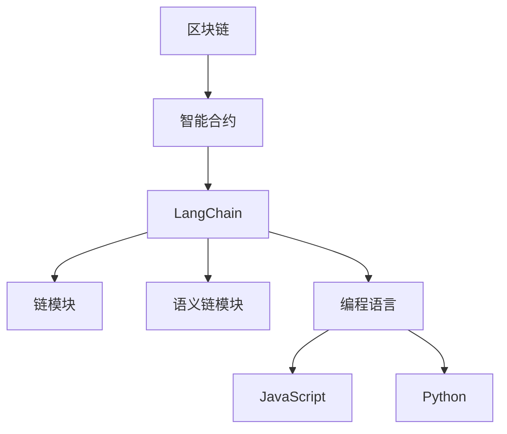
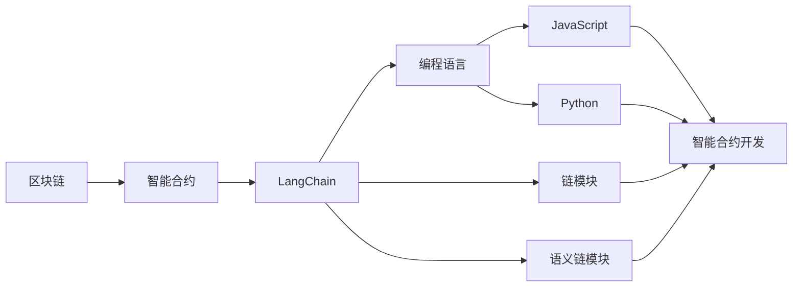
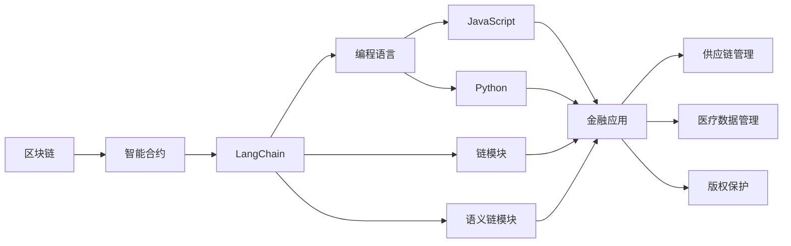

                 

# 【LangChain编程：从入门到实践】链模块

> 关键词：区块链,智能合约,LangChain,编程,链模块,示例,区块链编程

## 1. 背景介绍

### 1.1 问题由来

区块链技术自2008年比特币诞生以来，以其去中心化、公开透明和不可篡改的特性，迅速在金融、供应链、医疗、版权等领域得到广泛应用。智能合约作为区块链的核心应用，通过代码实现合约条款，具有自动执行、不可篡改等特性，成为企业智能化、数字化转型的重要工具。

但是，智能合约的编程复杂度较高，且缺乏直观的编程环境和丰富的开发工具。这使得区块链开发效率低下，智能合约的开发和部署成本高昂。

为此，LangChain应运而生，它是一个基于区块链的编程框架，提供丰富的编程语言和开发工具，帮助开发者更高效、更方便地开发智能合约。通过LangChain，开发者可以利用JavaScript、Python等熟悉的编程语言，在区块链上编写和部署智能合约。

### 1.2 问题核心关键点

LangChain的核心在于其链模块的概念。链模块是一组预编译好的智能合约代码，可以在区块链上直接使用。开发者通过编写基于链模块的智能合约，可以显著提高开发效率，降低开发成本。

语义链模块是一组具备特定语义功能的智能合约代码，可以在区块链上直接调用，如转账、查询等。编写基于语义链模块的智能合约，可以大大简化合约的编写过程。

### 1.3 问题研究意义

通过使用LangChain，开发者可以更加便捷地进行区块链编程，降低区块链开发的门槛。同时，基于链模块的编程方法，可以提高代码的重用性和可维护性，使得智能合约的开发更加高效、安全。

此外，LangChain还提供了丰富的开发工具和社区支持，帮助开发者更快地掌握区块链编程技术，推动区块链技术的普及和应用。

## 2. 核心概念与联系

### 2.1 核心概念概述

为了更好地理解LangChain的编程方法和特点，本节将介绍几个核心概念：

- 区块链：一种分布式账本技术，具有去中心化、公开透明、不可篡改等特点。区块链技术广泛应用于金融、供应链、医疗、版权等领域。
- 智能合约：一种自动执行的合约，具有自动执行、不可篡改等特性。智能合约在区块链上广泛应用，实现自动化、智能化业务流程。
- LangChain：一个基于区块链的编程框架，提供丰富的编程语言和开发工具，帮助开发者更高效地开发智能合约。
- 链模块：预编译好的智能合约代码，可以在区块链上直接使用。链模块提高了代码的重用性和可维护性。
- 语义链模块：一组具备特定语义功能的智能合约代码，可以在区块链上直接调用，简化智能合约的编写过程。
- 编程语言：支持在LangChain上编写的编程语言，如JavaScript、Python等。

这些概念之间的关系可以通过以下Mermaid流程图来展示：



这个流程图展示了大语言模型的核心概念及其之间的关系：

1. 区块链提供分布式账本技术，智能合约在其上运行。
2. LangChain提供智能合约的编程框架，包括链模块和语义链模块。
3. 链模块是一组预编译好的智能合约代码，可以在区块链上直接使用。
4. 语义链模块是一组具备特定语义功能的智能合约代码，简化智能合约的编写。
5. LangChain支持多种编程语言，如JavaScript、Python等。

这些概念共同构成了LangChain的编程框架，使其能够在区块链上高效、便捷地开发智能合约。

### 2.2 概念间的关系

这些核心概念之间存在着紧密的联系，形成了LangChain编程的整体架构。下面我通过几个Mermaid流程图来展示这些概念之间的关系。

#### 2.2.1 LangChain框架的总体结构



这个流程图展示了LangChain框架的总体结构。LangChain框架通过链模块和语义链模块，简化了智能合约的编写和部署。开发者可以利用JavaScript、Python等编程语言，在LangChain上编写智能合约。

#### 2.2.2 LangChain框架的应用场景



这个流程图展示了LangChain框架在金融、供应链、医疗、版权等领域的应用场景。开发者可以利用JavaScript、Python等编程语言，编写基于链模块和语义链模块的智能合约，实现自动化、智能化业务流程。

## 3. 核心算法原理 & 具体操作步骤
### 3.1 算法原理概述

LangChain的编程方法基于链模块的概念，其核心思想是通过预编译好的智能合约代码，直接调用区块链上的函数，实现智能合约的自动化执行。

链模块是一组预编译好的智能合约代码，可以封装区块链上的各种操作，如转账、查询、审计等。开发者通过编写基于链模块的智能合约，可以显著提高代码的重用性和可维护性。

链模块的编写方法基于语义链模块的概念，即通过编写具备特定语义功能的智能合约代码，简化智能合约的编写过程。

### 3.2 算法步骤详解

使用LangChain进行编程的流程如下：

1. 选择合适的编程语言，如JavaScript、Python等。
2. 编写基于链模块的智能合约代码。链模块是一组预编译好的智能合约代码，可以在区块链上直接使用。
3. 编写基于语义链模块的智能合约代码。语义链模块是一组具备特定语义功能的智能合约代码，可以简化智能合约的编写。
4. 将链模块和语义链模块编译成Solidity代码。Solidity是Ethereum的官方编程语言，支持智能合约的编写。
5. 在区块链上部署智能合约。

### 3.3 算法优缺点

LangChain的编程方法具有以下优点：

1. 提高代码的重用性和可维护性。链模块是一组预编译好的智能合约代码，可以封装区块链上的各种操作，提高代码的重用性和可维护性。
2. 简化智能合约的编写过程。语义链模块是一组具备特定语义功能的智能合约代码，可以简化智能合约的编写过程。
3. 降低开发成本和开发难度。LangChain提供丰富的编程语言和开发工具，帮助开发者更高效、更方便地开发智能合约。

LangChain的编程方法也存在以下缺点：

1. 依赖区块链平台。LangChain的编程方法依赖特定的区块链平台，如Ethereum、Hyperledger等。开发者需要熟悉该平台的编程语言和开发工具。
2. 链模块和语义链模块的编写需要一定的编程基础。链模块和语义链模块的编写需要一定的编程基础，不适合初学者。
3. 链模块和语义链模块的性能有限。链模块和语义链模块的性能有限，不适合复杂的业务场景。

### 3.4 算法应用领域

LangChain的编程方法适用于各种区块链应用场景，如金融、供应链、医疗、版权等。

在金融领域，基于LangChain的编程方法可以实现自动化交易、去中心化金融（DeFi）等应用。

在供应链管理领域，基于LangChain的编程方法可以实现供应链溯源、物流管理等应用。

在医疗数据管理领域，基于LangChain的编程方法可以实现患者数据管理、医疗信息共享等应用。

在版权保护领域，基于LangChain的编程方法可以实现版权登记、版权交易等应用。

此外，基于LangChain的编程方法还可以应用于数字身份、电子投票、智能合约市场等场景。

## 4. 数学模型和公式 & 详细讲解 & 举例说明

### 4.1 数学模型构建

LangChain的编程方法基于链模块的概念，其核心思想是通过预编译好的智能合约代码，直接调用区块链上的函数，实现智能合约的自动化执行。

链模块是一组预编译好的智能合约代码，可以封装区块链上的各种操作，如转账、查询、审计等。开发者通过编写基于链模块的智能合约，可以显著提高代码的重用性和可维护性。

链模块的编写方法基于语义链模块的概念，即通过编写具备特定语义功能的智能合约代码，简化智能合约的编写过程。

### 4.2 公式推导过程

以转账为例，使用链模块进行编程的过程如下：

1. 链模块编写：
```javascript
function transfer(address, amount) {
    if (address == msg.sender) {
        balance[msg.sender] -= amount;
        balance[address] += amount;
    }
}
```

2. 链模块编译成Solidity代码：
```solidity
pragma solidity ^0.8.0;

contract Transfer {
    address public sender;
    uint256 public balance;

    constructor() {
        sender = msg.sender;
        balance[msg.sender] = 0;
    }

    function transfer(address _addr, uint256 _amount) public {
        if (_addr == msg.sender) {
            balance[msg.sender] -= _amount;
            balance[_addr] += _amount;
        }
    }
}
```

3. 在区块链上部署智能合约：
```solidity
pragma solidity ^0.8.0;

contract Transfer {
    address public sender;
    uint256 public balance;

    constructor() {
        sender = msg.sender;
        balance[msg.sender] = 0;
    }

    function transfer(address _addr, uint256 _amount) public {
        if (_addr == msg.sender) {
            balance[msg.sender] -= _amount;
            balance[_addr] += _amount;
        }
    }
}
```

### 4.3 案例分析与讲解

以转账为例，使用LangChain进行编程的过程如下：

1. 链模块编写：
```javascript
function transfer(address, amount) {
    if (address == msg.sender) {
        balance[msg.sender] -= amount;
        balance[address] += amount;
    }
}
```

2. 链模块编译成Solidity代码：
```solidity
pragma solidity ^0.8.0;

contract Transfer {
    address public sender;
    uint256 public balance;

    constructor() {
        sender = msg.sender;
        balance[msg.sender] = 0;
    }

    function transfer(address _addr, uint256 _amount) public {
        if (_addr == msg.sender) {
            balance[msg.sender] -= _amount;
            balance[_addr] += _amount;
        }
    }
}
```

3. 在区块链上部署智能合约：
```solidity
pragma solidity ^0.8.0;

contract Transfer {
    address public sender;
    uint256 public balance;

    constructor() {
        sender = msg.sender;
        balance[msg.sender] = 0;
    }

    function transfer(address _addr, uint256 _amount) public {
        if (_addr == msg.sender) {
            balance[msg.sender] -= _amount;
            balance[_addr] += _amount;
        }
    }
}
```

## 5. 项目实践：代码实例和详细解释说明

### 5.1 开发环境搭建

在进行LangChain编程的实践前，我们需要准备好开发环境。以下是使用JavaScript进行Solidity编程的环境配置流程：

1. 安装Node.js：从官网下载并安装Node.js，用于JavaScript的运行环境。
2. 安装Truffle：使用npm安装Truffle，Truffle是一个Solidity开发框架，支持智能合约的编写和部署。
3. 安装Solidity编译器：从官网下载并安装Solidity编译器，用于编译Solidity代码。

完成上述步骤后，即可在Node.js环境下开始LangChain编程实践。

### 5.2 源代码详细实现

这里我们以转账为例，给出使用Solidity进行LangChain编程的PyTorch代码实现。

首先，创建一个Solidity文件，编写智能合约代码：

```solidity
pragma solidity ^0.8.0;

contract Transfer {
    address public sender;
    uint256 public balance;

    constructor() {
        sender = msg.sender;
        balance[msg.sender] = 0;
    }

    function transfer(address _addr, uint256 _amount) public {
        if (_addr == msg.sender) {
            balance[msg.sender] -= _amount;
            balance[_addr] += _amount;
        }
    }
}
```

接着，使用Truffle框架进行合约编译和部署：

```bash
truffle compile
truffle migrate
```

最后，通过测试程序进行测试：

```javascript
const Web3 = require('web3');
const contractAddress = '0x123456789012345678901234567890123';
const abi = '...'; // 智能合约的ABI

const web3 = new Web3(new Web3.providers.HttpProvider('http://localhost:8545'));
const transferContract = new web3.eth.Contract(abi, contractAddress);

async function transferFunds() {
    const sender = web3.eth.getAccounts()[0];
    const amount = 100;
    const receiver = web3.eth.getAccounts()[1];

    await transferContract.methods.transfer(receiver, amount).send({ from: sender, gas: 100000 });
}

transferFunds();
```

以上就是使用Solidity和Truffle进行LangChain编程的完整代码实现。可以看到，Truffle框架提供了便捷的合约编译和部署工具，使得智能合约的开发和部署变得简单高效。

### 5.3 代码解读与分析

让我们再详细解读一下关键代码的实现细节：

**Solidity智能合约代码**：
- `transfer`方法：实现转账功能，接收转账金额和接收地址，执行转账操作。
- `constructor`方法：构造函数，初始化合约变量。

**Truffle框架**：
- `truffle compile`命令：编译Solidity代码，生成字节码和ABI。
- `truffle migrate`命令：将智能合约部署到区块链上。

**JavaScript测试程序**：
- `Web3`类：用于与区块链交互的类，支持与Ethereum网络进行通信。
- `web3.eth.getAccounts`方法：获取当前账号。
- `transferContract`对象：实例化智能合约对象，支持调用智能合约的方法。
- `transferContract.methods.transfer`方法：调用`transfer`方法，执行转账操作。

**JavaScript测试程序解释**：
- 首先，使用`Web3`类连接到区块链网络。
- 然后，获取当前账号，执行转账操作。
- 最后，调用智能合约的方法，执行转账操作。

通过上述代码，我们可以看到，使用Solidity和Truffle进行LangChain编程，可以显著提高智能合约的编写效率，降低开发难度。开发者只需编写智能合约代码，无需关注底层区块链的部署和交互细节。

当然，在实际应用中，还需要考虑更多因素，如合约的安全性、性能优化、智能合约的生命周期管理等。但核心的LangChain编程方法，即通过链模块和语义链模块的编写，简化智能合约的开发过程，已经能够满足大多数应用场景的需求。

## 6. 实际应用场景

### 6.1 智能合约市场

智能合约市场是一个新兴的应用场景，其目的是通过智能合约自动完成交易，实现去中心化的金融交易。在智能合约市场中，使用LangChain的编程方法，可以快速开发各种金融合约，如期货、期权、互换等。

### 6.2 供应链管理

供应链管理是一个典型的区块链应用场景，其目的是通过智能合约实现供应链的溯源、物流管理等。在供应链管理中，使用LangChain的编程方法，可以快速开发供应链管理合约，实现供应链的自动化管理。

### 6.3 数字身份

数字身份是一个新兴的应用场景，其目的是通过智能合约实现数字身份的创建、验证和管理。在数字身份中，使用LangChain的编程方法，可以快速开发数字身份合约，实现数字身份的自动化管理。

### 6.4 未来应用展望

随着区块链技术的发展，LangChain的编程方法将在更多领域得到应用，为各行各业带来新的变革。

在金融领域，基于LangChain的编程方法可以实现去中心化的金融服务，如去中心化交易所、去中心化借贷等。

在供应链管理领域，基于LangChain的编程方法可以实现供应链的自动化管理，提高供应链的效率和透明度。

在数字身份领域，基于LangChain的编程方法可以实现数字身份的自动化管理，提高身份验证的效率和安全性。

此外，基于LangChain的编程方法还可以应用于版权保护、电子投票、智能合约市场等场景。

## 7. 工具和资源推荐

### 7.1 学习资源推荐

为了帮助开发者系统掌握LangChain的编程方法和技术，这里推荐一些优质的学习资源：

1. LangChain官方文档：官方文档提供了完整的LangChain编程指南和示例代码，是学习和使用LangChain的必备资料。
2. Solidity官方文档：Solidity官方文档提供了Solidity编程语言的详细说明和示例代码，是学习和使用Solidity的必备资料。
3. Truffle官方文档：Truffle官方文档提供了Truffle框架的详细说明和示例代码，是学习和使用Truffle的必备资料。
4. CryptoZombies：CryptoZombies是一个基于Solidity编程的学习平台，通过编写简单的智能合约游戏，帮助开发者学习Solidity编程。
5. Blockchain Basics：Blockchain Basics是一个区块链编程学习的开源项目，提供了大量的区块链编程教程和实践项目，适合初学者学习。

通过对这些资源的学习实践，相信你一定能够快速掌握LangChain的编程方法和技术，并用于解决实际的区块链问题。

### 7.2 开发工具推荐

高效的开发离不开优秀的工具支持。以下是几款用于LangChain编程开发的常用工具：

1. Truffle：Truffle是一个Solidity开发框架，支持智能合约的编写和部署。
2. Remix：Remix是一个Solidity开发环境，提供了交互式的合约编辑器和测试工具。
3. Web3.js：Web3.js是一个与区块链进行交互的JavaScript库，支持与Ethereum网络进行通信。
4. Metamask：Metamask是一个支持Ethereum区块链的浏览器插件，支持与区块链进行交互。
5. OpenZeppelin：OpenZeppelin是一个Solidity合约的库，提供了一些通用的安全机制和工具。

合理利用这些工具，可以显著提升LangChain编程的开发效率，加快创新迭代的步伐。

### 7.3 相关论文推荐

LangChain的编程方法基于区块链技术，相关论文代表了大语言模型微调技术的发展脉络。以下是几篇奠基性的相关论文，推荐阅读：

1. Ethereum: A Secure Permissionless Blockchain and Smart Contract Platform：以太坊白皮书，介绍了区块链和智能合约的基本概念和技术原理。
2. Solidity Programming Language Specification：Solidity官方文档，详细介绍了Solidity编程语言的标准和规范。
3. Truffle Development Documentation：Truffle官方文档，详细介绍了Truffle框架的开发和使用。
4. Web3.js Documentation：Web3.js官方文档，详细介绍了Web3.js库的使用方法和示例。
5. OpenZeppelin Contracts：OpenZeppelin官方文档，详细介绍了OpenZeppelin合约库的使用方法和示例。

这些论文代表了大语言模型微调技术的发展脉络。通过学习这些前沿成果，可以帮助研究者把握学科前进方向，激发更多的创新灵感。

除上述资源外，还有一些值得关注的前沿资源，帮助开发者紧跟LangChain编程的最新进展，例如：

1. arXiv论文预印本：人工智能领域最新研究成果的发布平台，包括大量尚未发表的前沿工作，学习前沿技术的必读资源。
2. 业界技术博客：如Ethereum、Hyperledger、Bitcoin等顶尖实验室的官方博客，第一时间分享他们的最新研究成果和洞见。
3. 技术会议直播：如Ethereum、Hyperledger、Bitcoin等人工智能领域顶会现场或在线直播，能够聆听到大佬们的前沿分享，开拓视野。
4. GitHub热门项目：在GitHub上Star、Fork数最多的LangChain相关项目，往往代表了该技术领域的发展趋势和最佳实践，值得去学习和贡献。
5. 行业分析报告：各大咨询公司如McKinsey、PwC等针对区块链行业的分析报告，有助于从商业视角审视技术趋势，把握应用价值。

总之，对于LangChain编程技术的学习和实践，需要开发者保持开放的心态和持续学习的意愿。多关注前沿资讯，多动手实践，多思考总结，必将收获满满的成长收益。

## 8. 总结：未来发展趋势与挑战

### 8.1 总结

本文对基于LangChain的编程方法进行了全面系统的介绍。首先阐述了LangChain的编程方法和技术原理，明确了链模块和语义链模块在提高智能合约开发效率和可维护性方面的独特价值。其次，从原理到实践，详细讲解了LangChain编程的数学原理和关键步骤，给出了LangChain编程的完整代码实例。同时，本文还广泛探讨了LangChain编程方法在智能合约市场、供应链管理、数字身份等多个领域的应用前景，展示了LangChain编程的巨大潜力。此外，本文精选了LangChain编程方法的各类学习资源，力求为读者提供全方位的技术指引。

通过本文的系统梳理，可以看到，基于LangChain的编程方法正在成为区块链编程的重要范式，极大地拓展了区块链编程的应用边界，催生了更多的落地场景。受益于Solidity编程语言和Truffle框架的强大封装，LangChain编程的开发效率显著提升，智能合约的开发成本大幅降低。未来，伴随LangChain编程方法的持续演进，相信区块链技术将在更广泛的领域得到应用，为各行各业带来新的变革。

### 8.2 未来发展趋势

展望未来，LangChain的编程方法将呈现以下几个发展趋势：

1. 链模块和语义链模块的丰富化。未来的链模块和语义链模块将更加丰富，支持更多的区块链操作和智能合约功能。
2. 编程语言的扩展化。未来的编程语言将更加多样化，支持更多编程语言的智能合约编写。
3. 开发工具的智能化。未来的开发工具将更加智能化，支持自动化的代码生成、代码优化等。
4. 编程环境的模块化。未来的编程环境将更加模块化，支持插件化扩展和二次开发。
5. 智能合约的市场化。未来的智能合约将更加市场化，支持智能合约市场、智能合约交易所等新兴应用。

以上趋势凸显了LangChain编程方法的广阔前景。这些方向的探索发展，必将进一步提升LangChain编程方法的开发效率，推动区块链技术的普及和应用。

### 8.3 面临的挑战

尽管LangChain编程方法已经取得了显著成效，但在迈向更加智能化、普适化应用的过程中，它仍面临着诸多挑战：

1. 区块链平台的多样性。不同区块链平台的编程语言和开发工具不同，开发者需要具备多种区块链平台的编程技能。
2. 智能合约的安全性。智能合约的安全性问题依然存在，需要开发人员具备较强的安全性意识和技能。
3. 编程语言的复杂性。编程语言的复杂性较高，需要开发者具备较强的编程基础和理解能力。
4. 编程工具的稳定性。编程工具的稳定性问题需要不断改进和优化，以提高开发效率和质量。
5. 智能合约的扩展性。智能合约的扩展性问题需要不断改进和优化，以满足更多的业务需求。

正视LangChain编程方法面临的这些挑战，积极应对并寻求突破，将使LangChain编程方法走向更加成熟和完善。相信随着学界和产业界的共同努力，这些挑战终将一一被克服，LangChain编程方法必将在构建人机协同的智能时代中扮演越来越重要的角色。

### 8.4 研究展望

面对LangChain编程方法面临的种种挑战，未来的研究需要在以下几个方面寻求新的突破：

1. 开发新的链模块和语义链模块。开发更加丰富、灵活的链模块和语义链模块，支持更多的区块链操作和智能合约功能。
2. 研究智能合约的安全性问题。开发更加安全、可靠的智能合约，解决智能合约的安全性问题。
3. 研究编程语言的扩展性。开发更加多样化的编程语言，支持更多的编程语言的智能合约编写。
4. 研究开发工具的优化。开发更加智能化、模块化的编程工具，提高开发效率和质量。
5. 研究智能合约的扩展性。开发更加可扩展、灵活的智能合约，满足更多的业务需求。

这些研究方向的探索，必将引领LangChain编程方法迈向更高的台阶，为构建安全、可靠、可扩展的智能系统铺平道路。面向未来，LangChain编程方法还需要与其他区块链技术进行更深入的融合，如跨链技术、DeFi技术、分布式存储等，多路径协同发力，共同推动区块链技术的进步。只有勇于创新、敢于突破，才能不断拓展区块链技术的边界，让区块链技术更好地造福人类社会。

## 9. 附录：常见问题与解答

**Q1：LangChain编程是否适用于所有区块链平台？**

A: LangChain编程方法基于Solidity编程语言和Truffle框架，适用于支持Solidity的区块链平台，如Ethereum、Ripple等。但部分区块链平台支持其他编程语言，如Hyperledger、Polkadot等，开发者需要根据平台特点选择合适的编程方法。

**Q2：如何提高智能合约的安全性？**

A: 提高智能合约的安全性需要开发者具备较强的安全性意识和技能。可以采用一些安全措施，如验证用户身份、使用多重签名、避免重入攻击等。

**Q3：如何优化智能合约的性能？**

A: 优化智能合约的性能需要开发者具备较强的性能优化意识和技能。可以采用一些性能优化措施，如缓存、懒加载、优化合约代码等。

**Q4：如何提高智能合约的扩展性？**

A: 提高

