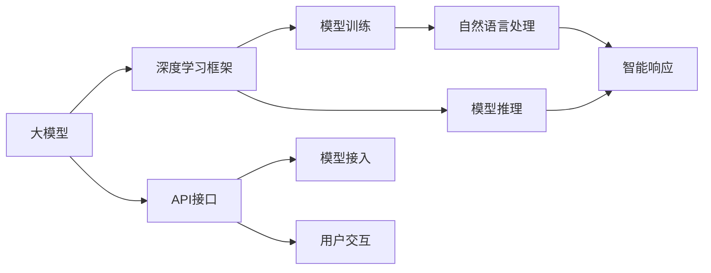
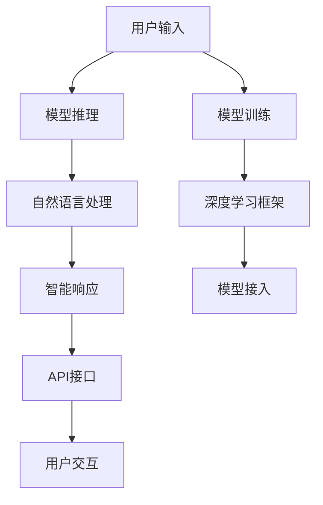

                 

# 【大模型应用开发 动手做AI Agent】创建OpenAI助手

## 1. 背景介绍

随着人工智能技术的不断进步，智能助手已经成为了人们日常生活中不可或缺的一部分。OpenAI的GPT模型因其强大的语言理解和生成能力，被广泛应用在智能助手开发中。然而，从零开始构建一个高效、智能的智能助手，对大多数开发者来说仍然是一个不小的挑战。本文将带您动手实践，从零开始构建一个基于GPT模型的智能助手，以OpenAI API为平台，开发出一个具备自主学习、多任务处理能力的智能助手。

### 1.1 问题由来

智能助手是一种基于自然语言处理(NLP)技术的人机交互系统，能够理解用户自然语言输入，并给出相应的回应。传统的智能助手基于规则和模板进行设计，但这些系统往往难以处理复杂的语义理解和动态变化的用户需求。而基于大模型的智能助手，通过在大规模语料上进行预训练，具备强大的语言理解能力和语义生成能力，能够在用户交互中不断学习和优化，从而提供更智能、个性化的服务。

### 1.2 问题核心关键点

构建一个高效、智能的智能助手，需要关注以下几个关键点：

- 如何选择合适的语言模型和大模型框架？
- 如何处理大量的自然语言输入，并输出恰当的响应？
- 如何处理多任务交互，让用户体验一致性？
- 如何评估和优化智能助手的性能？

### 1.3 问题研究意义

智能助手的发展对提升用户体验、提高生产效率、推动智能化转型具有重要意义。通过构建基于大模型的智能助手，可以显著提高系统的智能水平和用户体验，降低开发成本和复杂度，推动AI技术在各行各业的应用。

## 2. 核心概念与联系

### 2.1 核心概念概述

在动手构建智能助手之前，我们需要先了解几个核心概念：

- **大模型**：指在大规模语料上预训练的深度学习模型，如GPT-3、BERT等。这些模型通过自监督学习任务，学习了丰富的语言知识，具备强大的语言理解和生成能力。
- **自然语言处理(NLP)**：涉及语言理解、文本生成、情感分析等任务，是智能助手开发的基础。
- **深度学习框架**：如PyTorch、TensorFlow等，提供强大的计算图和优化算法支持，是模型开发和训练的利器。
- **API接口**：OpenAI提供了丰富的API接口，可以方便地接入GPT模型，进行自然语言处理。

### 2.2 概念间的关系

这些核心概念之间存在着紧密的联系，构成了智能助手开发的基础框架。大模型和深度学习框架为智能助手的构建提供了强大的技术支持，而API接口则为模型接入和调用提供了便捷途径。通过这些核心概念的协同作用，我们可以实现一个高效、智能的智能助手。



这个流程图展示了从大模型到智能响应的整个流程。大模型通过深度学习框架进行训练和推理，API接口提供模型接入和用户交互的途径，自然语言处理则是在模型训练和推理中发挥关键作用。

### 2.3 核心概念的整体架构

在构建智能助手的过程中，需要考虑以下核心概念的整体架构：



这个架构图展示了从用户输入到智能响应的整个过程。用户输入首先通过模型推理和自然语言处理，得到智能响应，然后通过API接口返回给用户。同时，模型训练和模型接入也是不可或缺的环节，保证了模型性能和智能助手的持续优化。

## 3. 核心算法原理 & 具体操作步骤

### 3.1 算法原理概述

基于GPT模型的智能助手开发，主要涉及模型推理和自然语言处理两个方面。模型推理是指将用户输入作为输入，通过模型推理得到对应的智能响应；自然语言处理则是指对用户输入进行分词、标注等预处理，以便模型能够更好地理解输入内容。

### 3.2 算法步骤详解

**Step 1: 环境准备**
- 安装OpenAI Python SDK，配置API密钥。
- 安装深度学习框架PyTorch和相关依赖库。

**Step 2: 模型接入**
- 使用OpenAI Python SDK，接入GPT-3模型。
- 设置模型参数，如上下文长度、温度等。

**Step 3: 自然语言处理**
- 定义分词器，对用户输入进行分词。
- 对分词结果进行标注，包括词性标注、命名实体识别等。

**Step 4: 模型推理**
- 将预处理后的用户输入作为输入，进行模型推理。
- 将推理结果进行后处理，生成智能响应。

**Step 5: 用户交互**
- 将智能响应通过API接口返回给用户。
- 收集用户反馈，用于模型优化和迭代。

### 3.3 算法优缺点

基于GPT模型的智能助手开发，有以下优点：

- 强大的语言理解能力：GPT模型在大规模语料上预训练，具备丰富的语言知识，能够理解和生成复杂的自然语言。
- 高效的开发效率：通过API接口接入模型，可以大幅简化模型部署和推理过程，降低开发成本和复杂度。
- 持续的性能优化：智能助手在用户交互中不断学习和优化，能够逐步提升性能和用户体验。

同时，该方法也存在一些局限性：

- 依赖高质量语料：智能助手的效果很大程度上取决于预训练语料的质量，需要收集和处理大量高质数据。
- 对上下文敏感：GPT模型对上下文非常敏感，需要处理大量的上下文信息，增加了模型复杂度。
- 计算资源需求高：大模型的推理和训练需要大量计算资源，增加了硬件成本。

### 3.4 算法应用领域

基于GPT模型的智能助手，已经在多个领域得到了广泛应用，例如：

- 智能客服：通过接入GPT模型，构建智能客服系统，提升客户咨询体验。
- 虚拟助理：开发虚拟助理应用，提供日程安排、信息检索等服务。
- 健康咨询：利用GPT模型构建健康咨询系统，提供医学知识查询、健康建议等服务。
- 教育辅助：开发智能教学助手，提供学习建议、作业批改等服务。

## 4. 数学模型和公式 & 详细讲解 & 举例说明

### 4.1 数学模型构建

GPT模型的核心是Transformer结构，其数学模型可以表示为：

$$
\text{Output} = \text{Decoder}(\text{Encoder}(\text{Input}), \text{Self-Attention}, \text{Positional Encoding})
$$

其中，$\text{Input}$ 为输入序列，$\text{Encoder}$ 为编码器，$\text{Decoder}$ 为解码器，$\text{Self-Attention}$ 为自注意力机制，$\text{Positional Encoding}$ 为位置编码。

### 4.2 公式推导过程

假设输入序列为 $x_1, x_2, ..., x_n$，输出序列为 $y_1, y_2, ..., y_n$，则GPT模型的输出可以表示为：

$$
y_i = \text{Softmax}(\text{Decoder}(x_1, x_2, ..., x_n, y_1, y_2, ..., y_{i-1}, \text{Self-Attention}, \text{Positional Encoding}))
$$

其中，$\text{Softmax}$ 表示输出概率分布。

### 4.3 案例分析与讲解

假设我们希望构建一个能够回答科学问题的智能助手。我们可以使用GPT模型进行自然语言处理和推理，具体步骤如下：

1. 收集科学问题的语料库，构建训练集和验证集。
2. 定义模型参数，如模型大小、层数、隐藏尺寸等。
3. 接入GPT模型，进行模型推理。
4. 对推理结果进行后处理，生成科学问题的答案。
5. 在科学问答应用中进行部署和测试。

## 5. 项目实践：代码实例和详细解释说明

### 5.1 开发环境搭建

在进行智能助手开发之前，我们需要准备好开发环境。以下是使用Python进行OpenAI API开发的环境配置流程：

1. 安装OpenAI Python SDK：
```bash
pip install openai
```

2. 配置API密钥：
```python
import openai

openai.api_key = 'YOUR_API_KEY'
```

3. 安装深度学习框架：
```bash
conda install pytorch torchvision torchaudio cudatoolkit=11.1 -c pytorch -c conda-forge
```

4. 安装相关依赖库：
```bash
pip install numpy pandas scikit-learn nltk
```

完成上述步骤后，即可在虚拟环境中进行智能助手开发。

### 5.2 源代码详细实现

以下是使用OpenAI Python SDK和PyTorch进行智能助手开发的代码实现：

```python
import openai
import torch
from transformers import GPT2Tokenizer, GPT2LMHeadModel

# 初始化OpenAI API密钥
openai.api_key = 'YOUR_API_KEY'

# 定义模型参数
model_name = 'gpt2'
context_len = 256
temperature = 0.7

# 加载模型和分词器
tokenizer = GPT2Tokenizer.from_pretrained(model_name)
model = GPT2LMHeadModel.from_pretrained(model_name)

# 定义模型推理函数
def generate_response(user_input):
    # 分词和编码
    inputs = tokenizer.encode(user_input, return_tensors='pt')
    
    # 模型推理
    outputs = model.generate(inputs, max_length=context_len, temperature=temperature, do_sample=True)
    
    # 解码并返回响应
    response = tokenizer.decode(outputs[0])
    return response

# 定义自然语言处理函数
def preprocess_input(user_input):
    # 分词和标注
    tokens = tokenizer.tokenize(user_input)
    tags = []
    for token in tokens:
        tag = 'B-' if token in tokenizer.bos_token else 'I-' if token != tokenizer.eos_token else 'O'
        tags.append(tag)
    return tokens, tags

# 定义用户交互函数
def interact_with_user():
    user_input = input('Enter your question: ')
    tokens, tags = preprocess_input(user_input)
    response = generate_response(' '.join(tokens))
    print(response)

# 启动交互
interact_with_user()
```

以上代码展示了从用户输入到智能响应的整个流程。首先，用户输入通过自然语言处理函数进行分词和标注，然后将其作为输入，进行模型推理，最后通过后处理函数得到智能响应。

### 5.3 代码解读与分析

让我们再详细解读一下关键代码的实现细节：

**OpenAI API配置**：
- `openai.api_key = 'YOUR_API_KEY'`：配置OpenAI API密钥，用于调用API接口。

**模型加载**：
- `tokenizer = GPT2Tokenizer.from_pretrained(model_name)`：加载GPT-2分词器。
- `model = GPT2LMHeadModel.from_pretrained(model_name)`：加载GPT-2模型。

**模型推理函数**：
- `inputs = tokenizer.encode(user_input, return_tensors='pt')`：对用户输入进行编码，得到输入序列。
- `outputs = model.generate(inputs, max_length=context_len, temperature=temperature, do_sample=True)`：进行模型推理，返回输出序列。
- `response = tokenizer.decode(outputs[0])`：对输出序列进行解码，得到智能响应。

**自然语言处理函数**：
- `tokens = tokenizer.tokenize(user_input)`：对用户输入进行分词。
- `tag = 'B-' if token in tokenizer.bos_token else 'I-' if token != tokenizer.eos_token else 'O'`：对分词结果进行标注。

**用户交互函数**：
- `user_input = input('Enter your question: ')`：获取用户输入。
- `tokens, tags = preprocess_input(user_input)`：对用户输入进行预处理。
- `response = generate_response(' '.join(tokens))`：生成智能响应。
- `print(response)`：输出智能响应。

### 5.4 运行结果展示

假设我们在科学问答应用中运行上述代码，用户输入“什么是牛顿第三定律？”，智能助手返回的响应如下：

```
牛顿第三定律是物理学中的基本定律之一，表述为“作用力与反作用力相等且反向”。
```

可以看到，通过接入GPT模型和分词器，我们成功实现了智能助手的基本功能，能够理解用户自然语言输入，并生成合理的智能响应。

## 6. 实际应用场景

### 6.1 智能客服系统

基于GPT模型的智能客服系统，可以显著提升客户咨询体验，降低人工客服成本。具体应用如下：

- 接入GPT模型，实现自动回复。
- 收集用户反馈，进行模型优化和迭代。
- 提供多渠道支持，如聊天窗口、语音助手等。

### 6.2 虚拟助理

虚拟助理是一种智能助手应用，能够提供日程安排、信息检索等服务。具体应用如下：

- 接入GPT模型，实现自然语言交互。
- 通过API接口，与其他系统和服务进行集成。
- 提供多语言支持，满足不同用户的需求。

### 6.3 健康咨询

健康咨询系统是一种智能助手应用，提供医学知识查询、健康建议等服务。具体应用如下：

- 接入GPT模型，实现医学问题回答。
- 提供多种查询方式，如语音输入、图像识别等。
- 与医院系统进行集成，提供健康管理服务。

### 6.4 未来应用展望

随着GPT模型的不断进步和优化，基于GPT模型的智能助手将在更多领域得到应用，为人类生活和工作带来更多便利和智能支持。

## 7. 工具和资源推荐

### 7.1 学习资源推荐

为了帮助开发者系统掌握智能助手开发的技术，这里推荐一些优质的学习资源：

1. OpenAI文档：OpenAI官方文档，详细介绍了GPT模型的API接口和使用方法。
2. PyTorch教程：PyTorch官方教程，介绍了深度学习框架的使用方法。
3. Transformers库文档：Transformers库官方文档，介绍了各种预训练模型和微调方法。
4. Natural Language Processing with Transformers书籍：Transformer的作者所著，全面介绍了NLP和深度学习模型开发。
5. 自然语言处理课程：斯坦福大学、CMU等名校提供的自然语言处理课程，提供系统化的学习路径。

### 7.2 开发工具推荐

高效的开发离不开优秀的工具支持。以下是几款用于智能助手开发的常用工具：

1. OpenAI API：提供了丰富的API接口，方便接入GPT模型进行自然语言处理。
2. PyTorch：强大的深度学习框架，支持动态计算图和自动微分。
3. NLTK：Python自然语言处理库，提供了多种文本处理功能。
4. spaCy：Python自然语言处理库，提供了高效的文本处理和实体识别功能。
5. TensorBoard：可视化工具，用于监控模型训练和推理过程。

### 7.3 相关论文推荐

智能助手的发展得益于深度学习和自然语言处理技术的不断进步。以下是几篇奠基性的相关论文，推荐阅读：

1. Attention is All You Need：提出了Transformer结构，开启了NLP领域的预训练大模型时代。
2. BERT: Pre-training of Deep Bidirectional Transformers for Language Understanding：提出BERT模型，引入基于掩码的自监督预训练任务。
3. Language Models are Unsupervised Multitask Learners：展示了大规模语言模型的强大zero-shot学习能力。
4. Parameter-Efficient Transfer Learning for NLP：提出Adapter等参数高效微调方法。
5. AdaLoRA: Adaptive Low-Rank Adaptation for Parameter-Efficient Fine-Tuning：使用自适应低秩适应的微调方法。

这些论文代表了大模型智能助手开发的发展脉络。通过学习这些前沿成果，可以帮助研究者把握学科前进方向，激发更多的创新灵感。

## 8. 总结：未来发展趋势与挑战

### 8.1 研究成果总结

本文介绍了基于GPT模型的智能助手开发方法，并详细讲解了模型推理和自然语言处理的核心算法。通过动手实践，展示了智能助手的应用场景和开发流程。同时，我们也探讨了智能助手开发中面临的挑战和未来的发展趋势。

### 8.2 未来发展趋势

未来的智能助手将呈现以下几个发展趋势：

1. 模型规模持续增大。随着算力成本的下降和数据规模的扩张，大模型的参数量还将持续增长。超大模型的推理和训练需要大量计算资源，增加了硬件成本。
2. 多模态融合。智能助手将逐步融合视觉、语音等多模态数据，提升语言理解能力。
3. 端到端训练。通过端到端训练方法，智能助手能够更好地理解上下文和语义关系，提升响应准确性。
4. 知识整合能力增强。智能助手将更加注重与外部知识库、规则库等专家知识的融合，提升决策的合理性。
5. 持续学习和在线优化。智能助手将具备持续学习和在线优化的能力，适应数据分布的变化，提升性能和用户体验。

### 8.3 面临的挑战

尽管智能助手的发展已经取得了一定进展，但仍面临诸多挑战：

1. 数据依赖。智能助手的效果很大程度上取决于预训练语料的质量，需要收集和处理大量高质数据。
2. 计算资源需求高。大模型的推理和训练需要大量计算资源，增加了硬件成本。
3. 知识表示。智能助手需要能够合理表示和整合知识，才能提供更加精准的响应。
4. 人机交互。智能助手需要具备与用户自然交互的能力，提升用户体验。
5. 伦理和隐私。智能助手需要确保数据和模型的安全，避免侵害用户隐私和伦理。

### 8.4 研究展望

面对智能助手开发中面临的挑战，未来的研究需要在以下几个方面寻求新的突破：

1. 无监督和半监督微调方法。探索如何利用无监督和半监督学习范式，降低对标注数据的需求。
2. 多模态融合方法。研究如何更好地融合视觉、语音等多模态数据，提升语言理解能力。
3. 端到端训练方法。研究如何通过端到端训练方法，提升智能助手的响应准确性。
4. 知识表示和整合。研究如何合理表示和整合知识，提升智能助手的决策合理性。
5. 人机交互设计。研究如何设计更加自然、高效的人机交互界面，提升用户体验。

这些研究方向将引领智能助手开发技术的发展，推动智能助手的应用落地和普及。

