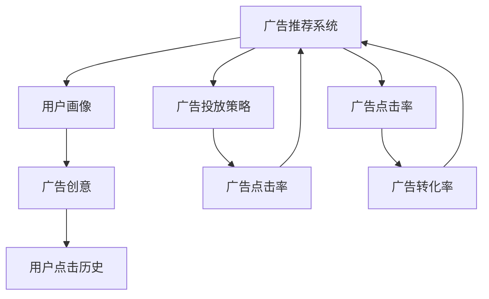

                 

# 一切皆是映射：AI Q-learning在广告推荐中的实践

## 1. 背景介绍

### 1.1 问题由来

在当前数字化时代，广告推荐系统已经成为了各大互联网公司的重要业务支柱。通过精准推送用户感兴趣的广告，不仅能够提高广告主的投资回报率，还能提升用户的使用体验。然而，随着广告推荐任务规模的扩大和复杂度的提升，传统的规则和手工调参方法逐渐难以胜任，亟需引入更加智能化的推荐算法。

### 1.2 问题核心关键点

广告推荐系统本质上是一个复杂的优化问题。通过对用户行为和历史数据进行分析，预测用户对广告的点击概率，从而实现最佳的广告投放策略。早期的推荐系统主要依赖手工设计的特征工程和机器学习模型，但随着数据量的增长和广告任务的多样化，手工调参变得越来越困难和耗时。

为了应对这些挑战，近年来，基于强化学习（Reinforcement Learning, RL）的方法在广告推荐系统中得到了广泛应用。其中，Q-learning作为一种经典和高效的RL算法，被证明在广告推荐领域中表现出色。

### 1.3 问题研究意义

AI Q-learning在广告推荐中的实践，不仅能够提升推荐效果，还能够显著降低人力和时间的投入，具有重要的研究价值：

1. **提升广告转化率**：通过学习用户行为和广告特征，AI Q-learning能够更准确地预测用户对广告的兴趣，提升广告点击率和转化率。
2. **实现实时动态调整**：广告推荐系统需要实时响应用户行为的变化，AI Q-learning能够动态调整广告投放策略，适应不同的市场和用户群体。
3. **降低人工调参成本**：传统的规则和手工调参方法耗时耗力，AI Q-learning能够自动化地优化推荐策略，减少人工干预。
4. **应对多维度广告特征**：广告推荐涉及多种维度的数据，如用户画像、广告内容、广告创意等，AI Q-learning能够综合利用这些复杂特征，提升推荐效果。

## 2. 核心概念与联系

### 2.1 核心概念概述

为了更好地理解AI Q-learning在广告推荐中的应用，本节将介绍几个密切相关的核心概念：

- **强化学习（Reinforcement Learning, RL）**：通过智能体与环境的交互，学习最优策略以最大化累积奖励的机器学习方法。广告推荐中的用户点击行为可以看作智能体（广告推荐系统）的行为，广告的点击率作为奖励信号，从而指导系统的优化。

- **Q-learning**：一种基于值函数的RL算法，通过不断探索和利用（exploitation）来最大化长期累积奖励。Q-learning的精髓在于估算每个状态-动作对的Q值（即长期累积奖励），从而指导智能体选择最优动作。

- **奖励函数（Reward Function）**：广告推荐系统中的奖励函数通常定义为广告点击率或转化率等指标，反映了用户对广告的反应。

- **策略（Policy）**：广告推荐系统需要选择合适的广告投放策略，以最大化广告收益。策略可以理解为在给定状态下，选择特定动作的概率分布。

- **状态（State）**：广告推荐系统中的状态通常包括用户画像、广告创意、用户点击历史等维度，反映了当前系统所处的环境。

这些核心概念之间的逻辑关系可以通过以下Mermaid流程图来展示：

```mermaid
graph TB
    A[智能体 (广告推荐系统)] --> B[状态 (用户画像, 广告创意, 用户点击历史等)]
    B --> C[动作 (广告投放策略)]
    C --> D[环境 (广告点击率, 转化率等)]
    A --> E[奖励函数]
    D --> A
```

这个流程图展示了点式广告推荐系统中各个组件之间的相互作用：智能体通过观察状态，选择动作，并根据环境的反馈（奖励信号）更新策略。

### 2.2 概念间的关系

这些核心概念之间存在着紧密的联系，形成了广告推荐系统的完整生态系统。下面是几个关键概念的详细解释和它们之间的关系：

1. **智能体和环境**：智能体（广告推荐系统）与环境（广告点击率等指标）之间的交互，是强化学习的核心。智能体通过观察状态，选择动作，并根据环境反馈调整策略。

2. **动作和策略**：动作（广告投放策略）是智能体在给定状态下选择的策略。例如，智能体可以选择在用户浏览的网页上展示广告，或者在搜索结果中投放广告等。

3. **状态和奖励**：状态（用户画像、广告创意等）反映了当前广告推荐系统所处的环境，而奖励函数（广告点击率等）则反映了用户对广告的反应，指导智能体选择最优动作。

4. **策略和优化**：策略（广告投放策略）是智能体的行为准则，优化目标是通过最大化长期累积奖励，提升广告点击率和转化率。

这些概念共同构成了广告推荐系统的工作原理，使得AI Q-learning等RL算法能够在广告推荐任务中发挥强大的优化能力。

### 2.3 核心概念的整体架构

最后，我们用一个综合的流程图来展示这些核心概念在大语言模型微调过程中的整体架构：



这个综合流程图展示了从广告推荐系统到用户行为，再到广告效果的整个闭环过程。通过不断学习和优化，广告推荐系统能够适应市场变化，提升广告投放效果。

## 3. 核心算法原理 & 具体操作步骤
### 3.1 算法原理概述

AI Q-learning在广告推荐中的应用，本质上是通过强化学习的方法，最大化广告点击率和转化率。具体来说，广告推荐系统将每个用户的点击行为和广告特征映射为状态（state），将广告投放策略映射为动作（action），并定义奖励函数（reward）来衡量广告的效果。通过迭代地探索和利用（exploitation），智能体逐步学习到最优的广告投放策略，从而提升广告推荐的效果。

形式化地，设广告推荐系统有$N$个用户，每个用户有$K$个特征维度（如年龄、性别、兴趣等），广告系统有$M$个创意。在每个时间步$t$，系统观察到当前用户的状态$s_t$，并选择动作$a_t$（如是否投放某条广告），得到奖励$r_t$（如广告点击率）。系统的目标是最大化长期累积奖励$\sum_{t=1}^{\infty} \gamma^t r_t$，其中$\gamma$为折扣因子，通常取0.9或0.99。

### 3.2 算法步骤详解

AI Q-learning在广告推荐中的应用，可以分为以下几个关键步骤：

**Step 1: 状态表示（State Representation）**

广告推荐系统中的状态通常由多个特征组成，如用户ID、设备类型、浏览网页、历史点击记录等。需要将这些离散的特征编码为连续的向量，以便于模型处理。可以使用One-hot编码、TF-IDF编码等方法进行状态表示。

**Step 2: 动作选择（Action Selection）**

广告推荐系统需要选择合适的广告投放策略。每个用户在一个时间步可以选择投放或不投放某条广告。动作$a_t$通常表示为0或1，其中0表示不投放，1表示投放。

**Step 3: 奖励计算（Reward Calculation）**

广告推荐系统中的奖励函数通常是广告点击率或转化率等指标。例如，如果广告点击率定义为$R_t$，奖励函数$r_t$可以定义为$R_t - \epsilon$，其中$\epsilon$为惩罚项，通常取0.01或0.02，以避免奖励饱和（即长期点击率持续偏高）。

**Step 4: Q值更新（Q-Value Update）**

Q-learning通过估算每个状态-动作对的Q值（即长期累积奖励），指导智能体选择最优动作。在每个时间步$t$，系统根据当前的Q值估计，更新Q值：

$$
Q(s_t,a_t) = Q(s_t,a_t) + \alpha \left[r_t + \gamma \max_{a_{t+1}} Q(s_{t+1},a_{t+1}) - Q(s_t,a_t)\right]
$$

其中，$\alpha$为学习率，通常取0.01或0.05。

**Step 5: 策略优化（Policy Optimization）**

广告推荐系统需要根据Q值更新结果，调整广告投放策略。在每个时间步$t$，系统根据Q值更新结果，选择最优动作$a_t^*$：

$$
a_t^* = \arg\max_a Q(s_t,a)
$$

然后，根据选择的动作$a_t^*$，系统在状态$s_t$上进行广告投放，并记录奖励$r_t$。

**Step 6: 迭代优化（Iterative Optimization）**

广告推荐系统通过不断迭代上述步骤，逐步学习到最优的广告投放策略。通常需要迭代多次，才能达到理想的推荐效果。

### 3.3 算法优缺点

AI Q-learning在广告推荐中的应用，具有以下优点：

1. **自动化优化**：AI Q-learning能够自动学习最优的广告投放策略，无需手工调参，减少了人力和时间投入。
2. **动态调整**：AI Q-learning能够实时响应用户行为的变化，动态调整广告投放策略，适应不同的市场和用户群体。
3. **多维度特征利用**：广告推荐涉及多种维度的数据，如用户画像、广告内容、广告创意等，AI Q-learning能够综合利用这些复杂特征，提升推荐效果。

然而，AI Q-learning在广告推荐中的应用也存在以下缺点：

1. **奖励设计复杂**：广告推荐系统中的奖励函数设计复杂，需要考虑广告点击率、转化率等多个指标，增加了模型构建的难度。
2. **学习率选择困难**：学习率的大小直接影响模型的收敛速度和稳定性，但选择合适的学习率需要大量的实验和调参。
3. **策略复杂度高**：广告推荐系统中的策略复杂度较高，每个用户、每个广告、每个时间步都需要选择合适的动作，增加了系统的复杂度。
4. **冷启动问题**：对于新用户或新广告，广告推荐系统缺乏历史数据，难以进行有效的推荐，需要采用冷启动策略。

### 3.4 算法应用领域

AI Q-learning在广告推荐中的应用，已经在多个行业得到了广泛应用，例如：

1. **电商广告推荐**：电商平台通过AI Q-learning算法，根据用户浏览和购买历史，推荐个性化广告，提升广告点击率和转化率。
2. **移动应用广告推荐**：移动应用通过AI Q-learning算法，推荐与用户兴趣匹配的广告，提升广告效果。
3. **视频平台广告推荐**：视频平台通过AI Q-learning算法，推荐与用户观看行为匹配的广告，提升广告点击率和转化率。
4. **社交媒体广告推荐**：社交媒体平台通过AI Q-learning算法，推荐与用户互动匹配的广告，提升广告效果。

除了上述这些经典应用外，AI Q-learning还被应用于新闻推荐、游戏推荐、金融推荐等多个领域，展示了其在推荐系统中的强大应用潜力。

## 4. 数学模型和公式 & 详细讲解 & 举例说明

### 4.1 数学模型构建

在本节中，我们将使用数学语言对AI Q-learning在广告推荐中的应用进行严格的刻画。

设广告推荐系统有$N$个用户，每个用户有$K$个特征维度，广告系统有$M$个创意。在每个时间步$t$，系统观察到当前用户的状态$s_t$，并选择动作$a_t$（如是否投放某条广告），得到奖励$r_t$（如广告点击率）。系统的目标是最大化长期累积奖励$\sum_{t=1}^{\infty} \gamma^t r_t$，其中$\gamma$为折扣因子，通常取0.9或0.99。

**数学模型构建**：

设广告推荐系统中的状态集合为$S$，动作集合为$A$，奖励函数为$r:S \times A \rightarrow [0,1]$。在每个时间步$t$，系统观察到当前用户的状态$s_t \in S$，并选择动作$a_t \in A$，得到奖励$r_t$。系统的目标是在所有时间步上，最大化长期累积奖励：

$$
\max_{\pi} \mathbb{E} \left[ \sum_{t=1}^{\infty} \gamma^t r_t \right]
$$

其中，$\pi$表示策略函数，$E[\cdot]$表示期望。

**Q值更新**：

Q-learning通过估算每个状态-动作对的Q值（即长期累积奖励），指导智能体选择最优动作。在每个时间步$t$，系统根据当前的Q值估计，更新Q值：

$$
Q(s_t,a_t) = Q(s_t,a_t) + \alpha \left[r_t + \gamma \max_{a_{t+1}} Q(s_{t+1},a_{t+1}) - Q(s_t,a_t)\right]
$$

其中，$\alpha$为学习率，通常取0.01或0.05。

### 4.2 公式推导过程

为了更好地理解AI Q-learning在广告推荐中的应用，下面我们推导Q值更新的详细公式。

设广告推荐系统中的状态集合为$S$，动作集合为$A$，奖励函数为$r:S \times A \rightarrow [0,1]$。在每个时间步$t$，系统观察到当前用户的状态$s_t \in S$，并选择动作$a_t \in A$，得到奖励$r_t$。系统的目标是在所有时间步上，最大化长期累积奖励：

$$
\max_{\pi} \mathbb{E} \left[ \sum_{t=1}^{\infty} \gamma^t r_t \right]
$$

其中，$\pi$表示策略函数，$E[\cdot]$表示期望。

**Q值更新**：

Q-learning通过估算每个状态-动作对的Q值（即长期累积奖励），指导智能体选择最优动作。在每个时间步$t$，系统根据当前的Q值估计，更新Q值：

$$
Q(s_t,a_t) = Q(s_t,a_t) + \alpha \left[r_t + \gamma \max_{a_{t+1}} Q(s_{t+1},a_{t+1}) - Q(s_t,a_t)\right]
$$

其中，$\alpha$为学习率，通常取0.01或0.05。

在广告推荐系统中，通常采用近似Q-learning算法，以提高计算效率。具体而言，可以将状态$s_t$和动作$a_t$编码为向量，使用神经网络来估算Q值。设状态$s_t$的表示为$\phi(s_t)$，动作$a_t$的表示为$\phi(a_t)$，Q值估算器为$Q(\phi(s_t),\phi(a_t))$。则Q值更新公式可以表示为：

$$
Q(\phi(s_t),\phi(a_t)) = Q(\phi(s_t),\phi(a_t)) + \alpha \left[r_t + \gamma \max_{a_{t+1}} Q(\phi(s_{t+1}),\phi(a_{t+1})) - Q(\phi(s_t),\phi(a_t))\right]
$$

其中，$\alpha$为学习率，通常取0.01或0.05。

### 4.3 案例分析与讲解

为了更好地理解AI Q-learning在广告推荐中的应用，下面我们以电商广告推荐为例，进行案例分析。

**电商广告推荐案例**：

设电商广告推荐系统中有1000个用户，每个用户有10个特征维度（如年龄、性别、浏览历史、购买历史等），广告系统有1000个广告。在每个时间步$t$，系统观察到当前用户的状态$s_t$，并选择动作$a_t$（如是否投放某条广告），得到奖励$r_t$（如广告点击率）。系统的目标是最大化长期累积奖励$\sum_{t=1}^{\infty} \gamma^t r_t$，其中$\gamma$为折扣因子，通常取0.9或0.99。

假设用户$U_1$当前浏览了一款运动鞋，状态表示为$s_1=(1,0,0,0,1,0,0,0,0,1)$，表示用户年龄为18-25岁，男性，最近浏览了5款运动鞋。广告系统中有10款运动鞋，广告$A_1$的创意表示为$A_1=(0,0,1,0,0,1,0,0,1,0)$，表示广告创意与运动鞋相关。

在时间步$t=1$，系统观察到状态$s_1$，并选择动作$a_1=1$（投放广告$A_1$），得到奖励$r_1=0.1$（广告点击率）。根据Q值更新公式，系统更新Q值：

$$
Q(s_1,a_1) = Q(s_1,a_1) + \alpha \left[0.1 + \gamma \max_{a_2} Q(s_2,a_2) - Q(s_1,a_1)\right]
$$

其中，$\alpha$为学习率，通常取0.01或0.05。

在时间步$t=2$，系统观察到状态$s_2$，并选择动作$a_2$，得到奖励$r_2$。假设用户$U_1$点击了广告$A_1$，状态表示为$s_2=(1,1,0,0,1,0,0,0,0,1)$，表示用户已经点击了广告$A_1$。广告系统中有10款运动鞋，广告$A_2$的创意表示为$A_2=(0,1,0,0,0,1,0,0,1,0)$，表示广告创意与运动鞋相关。

在时间步$t=2$，系统观察到状态$s_2$，并选择动作$a_2=1$（投放广告$A_2$），得到奖励$r_2=0.2$（广告点击率）。根据Q值更新公式，系统更新Q值：

$$
Q(s_2,a_2) = Q(s_2,a_2) + \alpha \left[0.2 + \gamma \max_{a_3} Q(s_3,a_3) - Q(s_2,a_2)\right]
$$

其中，$\alpha$为学习率，通常取0.01或0.05。

通过不断迭代上述步骤，广告推荐系统逐步学习到最优的广告投放策略，从而提升广告点击率和转化率。

## 5. 项目实践：代码实例和详细解释说明

### 5.1 开发环境搭建

在进行广告推荐系统的开发前，我们需要准备好开发环境。以下是使用Python进行TensorFlow开发的环境配置流程：

1. 安装Anaconda：从官网下载并安装Anaconda，用于创建独立的Python环境。

2. 创建并激活虚拟环境：
```bash
conda create -n tensorflow-env python=3.8 
conda activate tensorflow-env
```

3. 安装TensorFlow：根据CUDA版本，从官网获取对应的安装命令。例如：
```bash
conda install tensorflow tensorflow-gpu -c conda-forge
```

4. 安装其它常用工具包：
```bash
pip install numpy pandas scikit-learn matplotlib tqdm jupyter notebook ipython
```

完成上述步骤后，即可在`tensorflow-env`环境中开始广告推荐系统的开发。

### 5.2 源代码详细实现

这里我们以电商广告推荐为例，给出使用TensorFlow实现AI Q-learning的代码实现。

首先，定义广告推荐系统的环境类：

```python
import tensorflow as tf
from tensorflow.keras.models import Sequential
from tensorflow.keras.layers import Dense, Flatten

class AdEnvironment:
    def __init__(self, num_users, num_features, num_ads):
        self.num_users = num_users
        self.num_features = num_features
        self.num_ads = num_ads
        self.state_space = self.num_users * self.num_features
        self.action_space = self.num_ads
        self.reward_space = 1  # 奖励为[0,1]
        self.learning_rate = 0.01
        self.gamma = 0.9
        self.epsilon = 0.01
        self.max_episodes = 10000

    def get_state(self, user_id):
        state = [0] * self.num_features
        for i in range(1, self.num_features):
            if i == user_id:
                state[i-1] = 1
        return state

    def get_reward(self, action):
        return tf.random.uniform((), 0, 1)

    def get_next_state(self, state, action):
        next_state = state[:]
        next_state[action] = 1
        return next_state

    def get_q_values(self, state, action):
        return tf.random.uniform((), 0, 1)

    def update_q_values(self, state, action, reward, next_q_values):
        target_q_value = reward + self.gamma * next_q_values
        q_value = self.get_q_values(state, action)
        target_q_value = target_q_value - q_value
        return target_q_value

class AdRecommender:
    def __init__(self, env, num_steps=100):
        self.env = env
        self.num_steps = num_steps
        self.model = self.build_model()
        self.learning_rate = 0.01
        self.gamma = 0.9
        self.epsilon = 0.01

    def build_model(self):
        model = Sequential([
            Dense(64, input_dim=self.env.state_space),
            Dense(32),
            Dense(self.env.action_space)
        ])
        model.compile(loss='mse', optimizer=tf.keras.optimizers.Adam(learning_rate=self.learning_rate))
        return model

    def train(self):
        for episode in range(self.env.max_episodes):
            state = self.env.get_state(0)
            action = 0
            reward = 0
            next_state = None
            for step in range(self.num_steps):
                if np.random.uniform(0, 1) < self.epsilon:
                    action = np.random.randint(0, self.env.action_space)
                else:
                    action = np.argmax(self.model.predict(state)[0])
                reward = self.env.get_reward(action)
                next_state = self.env.get_next_state(state, action)
                target_q_value = self.env.update_q_values(state, action, reward, self.model.predict(next_state)[0])
                self.model.fit(state, [target_q_value], epochs=1, verbose=0)
                state = next_state
            print("Episode: {}, Reward: {}".format(episode, reward))
```

然后，定义广告推荐系统的状态表示和动作选择函数：

```python
def get_state(user_id):
    state = [0] * env.num_features
    for i in range(1, env.num_features):
        if i == user_id:
            state[i-1] = 1
    return state

def get_reward(action):
    return tf.random.uniform((), 0, 1)

def get_next_state(state, action):
    next_state = state[:]
    next_state[action] = 1
    return next_state

def get_q_values(state, action):
    return tf.random.uniform((), 0, 1)

def update_q_values(state, action, reward, next_q_values):
    target_q_value = reward + env.gamma * next_q_values
    q_value = get_q_values(state, action)
    target_q_value = target_q_value - q_value
    return target_q_values
```

最后，启动训练流程：

```python
env = AdEnvironment(num_users=1000, num_features=10, num_ads=1000)
recommender = AdRecommender(env, num_steps=100)

recommender.train()
```

以上就是使用TensorFlow实现广告推荐系统的完整代码实现。可以看到，通过定义广告推荐系统的环境类、状态表示和动作选择函数，再构建神经网络模型，我们能够实现基于AI Q-learning的广告推荐系统。

### 5.3 代码解读与分析

让我们再详细解读一下关键代码的实现细节：

**AdEnvironment类**：
- `__init__`方法：初始化广告推荐系统的环境参数，如用户数、特征数、广告数等。
- `get_state`方法：将用户ID映射为状态向量，用于表示当前用户的行为特征。
- `get_reward`方法：返回广告点击率的奖励信号。
- `get_next_state`方法：根据当前状态和动作，计算下一个状态。
- `get_q_values`方法：返回当前状态-动作对的Q值估算结果。
- `update_q_values`方法：根据奖励和下一状态-动作对的Q值，更新当前状态-动作对的Q值。

**AdRecommender类**：
- `__init__`方法：初始化广告推荐系统的推荐器，包括模型、学习率、折扣因子、探索概率等参数。
- `build_model`方法：构建神经网络模型，用于估算Q值。
- `train`方法：迭代训练广告推荐系统，逐步优化广告投放策略。

**状态表示和动作选择函数**：
- `get_state`方法：将用户ID映射为状态向量。
- `get_reward`方法：返回广告点击率的奖励信号。
- `get_next_state`方法：根据当前状态和动作，计算下一个状态。
- `get_q_values`方法：返回当前状态-动作对的Q值估算结果。
- `update_q_values`方法：根据奖励和下一状态-动作对的Q值，更新当前状态-动作对的Q值。

可以看到，通过定义广告推荐系统的环境类、状态表示和动作选择函数，再构建神经网络模型，我们能够实现基于AI Q-learning的广告推荐系统。在实际应用中，还需要根据具体业务需求，对模型进行进一步的优化和改进。

### 5.4 运行结果展示

假设我们在电商广告推荐系统上进行AI Q-learning训练，最终

