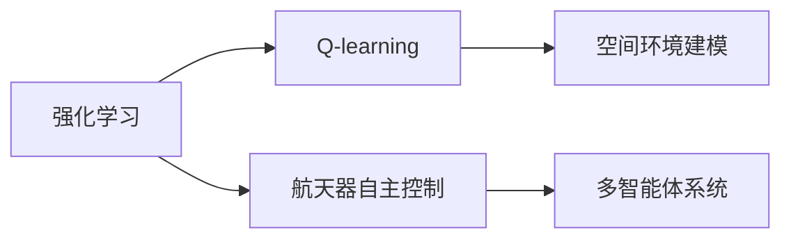
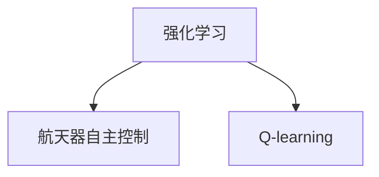
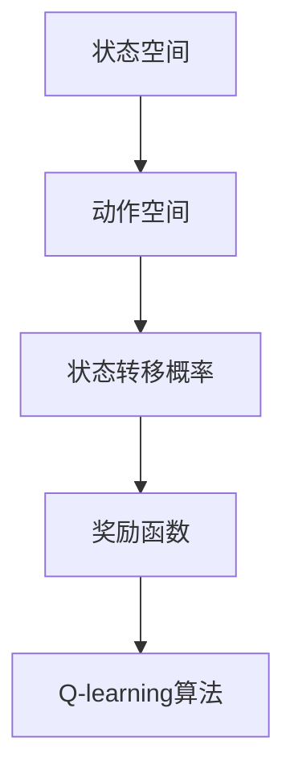
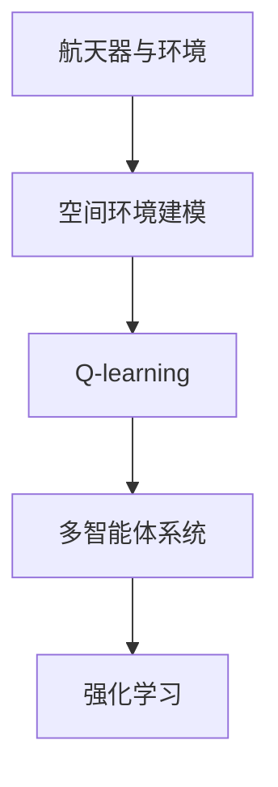

                 

# 一切皆是映射：AI Q-learning在航天领域的巨大可能

## 1. 背景介绍

### 1.1 问题由来

人工智能（AI）技术在航天领域的探索和应用，已经成为当下最前沿的研究方向之一。随着卫星通信、空间探测、航天器自主控制等任务的日益复杂，传统的控制方法已难以满足高精度、高可靠性的要求。而AI，尤其是强化学习（Reinforcement Learning, RL）技术，为解决这些挑战提供了新的解决方案。

其中，Q-learning作为一种经典的强化学习算法，通过与环境的交互学习最优策略，广泛应用于机器人控制、自动驾驶等领域。但传统Q-learning算法在高维空间和连续状态空间中的应用，仍存在较大的限制。如何在航天领域中有效应用Q-learning算法，仍是亟需解决的问题。

### 1.2 问题核心关键点

在航天领域，AI Q-learning可以应用于航天器自主导航、姿态控制、卫星通信优化等任务。其核心在于：
- 构建航天器与环境的映射关系，以便Q-learning算法可以高效学习最优策略。
- 设计高效的状态表示方法，将连续状态空间离散化，以便Q-learning算法能够处理高维数据。
- 引入适当的奖励函数，以引导AI模型在特定任务上取得良好表现。
- 在复杂环境中进行多智能体协作，实现更高级的自主控制和任务调度。

这些关键点构成了航天领域AI Q-learning技术应用的基石。

### 1.3 问题研究意义

AI Q-learning在航天领域的应用，具有以下重要意义：

1. **提升自主控制能力**：Q-learning可以自动优化航天器的控制策略，提高自主导航和姿态控制的精确度和鲁棒性。
2. **优化通信网络**：通过智能调度卫星通信资源，优化网络带宽分配，提高通信效率。
3. **降低成本和风险**：减少对人工干预的依赖，提高航天任务的安全性和经济性。
4. **拓展应用边界**：AI Q-learning技术可以为航天器提供更灵活、更高效的决策支持，推动航天技术的创新发展。

## 2. 核心概念与联系

### 2.1 核心概念概述

为深入理解AI Q-learning在航天领域的应用，本节将介绍几个关键概念：

- **强化学习（Reinforcement Learning, RL）**：通过与环境的交互，智能体学习最优策略以最大化累计奖励。常见的算法包括Q-learning、SARSA等。
- **Q-learning**：一种基于值函数（Q值）的强化学习算法，通过不断更新Q值，学习最优策略。
- **航天器自主控制**：指航天器在无人干预下，通过控制算法完成预定任务的能力。
- **空间环境建模**：对航天器所处的环境进行建模，以便AI模型可以进行学习和推理。
- **多智能体系统**：指多个AI智能体在分布式环境中协同完成任务，如多卫星编队、任务调度等。

这些核心概念之间的逻辑关系可以通过以下Mermaid流程图来展示：



这个流程图展示了航天领域AI Q-learning的核心概念及其之间的关系：

1. 强化学习为Q-learning提供了基本框架。
2. Q-learning用于航天器自主控制任务的策略学习。
3. 空间环境建模是航天器与环境的映射。
4. 多智能体系统拓展了航天器自主控制的应用场景。

### 2.2 概念间的关系

这些核心概念之间存在着紧密的联系，形成了航天领域AI Q-learning技术的完整生态系统。下面我们通过几个Mermaid流程图来展示这些概念之间的关系。

#### 2.2.1 强化学习与航天器自主控制的联系



这个流程图展示了强化学习与航天器自主控制的关系：

1. 航天器自主控制任务可以通过强化学习技术进行优化。
2. Q-learning作为强化学习的一种常用算法，用于学习最优控制策略。

#### 2.2.2 空间环境建模与多智能体系统的关系


这个流程图展示了空间环境建模与多智能体系统之间的关系：

1. 空间环境建模是航天器与环境的映射。
2. 多智能体系统需要依赖空间环境建模来理解环境状态。

#### 2.2.3 Q-learning的实现流程



这个流程图展示了Q-learning的实现流程：

1. 状态空间和动作空间定义了任务的基本框架。
2. 状态转移概率和奖励函数指导Q-learning的学习过程。
3. Q-learning算法通过不断更新Q值，学习最优策略。

### 2.3 核心概念的整体架构

最后，我们用一个综合的流程图来展示这些核心概念在大语言模型微调过程中的整体架构：



这个综合流程图展示了从航天器与环境的映射，到Q-learning算法的应用，再到多智能体系统的构建，最后实现航天器自主控制的全过程。通过这些流程图，我们可以更清晰地理解航天领域AI Q-learning技术应用的整体架构。

## 3. 核心算法原理 & 具体操作步骤
### 3.1 算法原理概述

AI Q-learning在航天领域的应用，本质上是强化学习的一种具体实现。其核心思想是通过与环境的交互，智能体学习最优策略以最大化累计奖励。Q-learning算法通过不断更新Q值，学习最优控制策略。

Q-learning的数学表达为：

$$
Q(s_t, a_t) = Q(s_t, a_t) + \alpha [r_{t+1} + \gamma \max_{a'} Q(s_{t+1}, a') - Q(s_t, a_t)]
$$

其中，$s_t$ 表示当前状态，$a_t$ 表示当前动作，$r_{t+1}$ 表示下一个状态的即时奖励，$\gamma$ 表示折扣因子，$\alpha$ 表示学习率。Q值表示在状态$s_t$下采取动作$a_t$的累计奖励期望。

### 3.2 算法步骤详解

AI Q-learning在航天领域的应用，通常包括以下几个关键步骤：

**Step 1: 构建环境与状态空间**
- 定义航天器与环境的交互关系，构建空间环境模型。
- 将状态空间划分为离散的有限状态，以便Q-learning算法可以处理。

**Step 2: 定义动作空间**
- 定义航天器可以采取的动作空间，如姿态控制、轨道调整等。

**Step 3: 设计奖励函数**
- 定义奖励函数，以引导Q-learning算法在特定任务上取得良好表现。
- 奖励函数应与任务目标一致，如导航任务中，到达目标位置即奖励，偏离则惩罚。

**Step 4: 初始化Q值**
- 初始化Q值为0或随机值。

**Step 5: 迭代优化**
- 在每个状态下，随机选择一个动作，与环境交互，记录即时奖励和下一个状态。
- 根据即时奖励和下一个状态的Q值，更新当前状态的Q值。
- 重复此过程，直至收敛。

**Step 6: 测试与评估**
- 在测试集中，使用最优策略进行测试，评估模型性能。
- 优化策略以适应新环境或新任务。

### 3.3 算法优缺点

AI Q-learning在航天领域的应用，具有以下优点：

1. **高效性**：Q-learning算法计算简单，易于实现和优化，适合实时控制任务。
2. **可扩展性**：Q-learning可以处理高维状态空间和复杂环境，适用于航天器自主控制。
3. **适应性**：Q-learning算法在不断交互中学习最优策略，具有较好的适应性。

同时，该算法也存在一些局限性：

1. **高维状态空间**：在航天领域，状态空间可能非常复杂，高维离散化会导致状态空间爆炸，影响算法效率。
2. **连续动作**：航天器控制任务中可能包含连续动作，如姿态控制，连续动作的离散化需要额外处理。
3. **奖励函数设计**：设计合适的奖励函数，以指导Q-learning算法学习最优策略，是挑战之一。
4. **鲁棒性**：航天器自主控制中存在诸多不确定性，如环境干扰、传感器噪声等，Q-learning算法的鲁棒性需进一步提升。

### 3.4 算法应用领域

AI Q-learning在航天领域的应用非常广泛，包括但不限于以下几个方面：

- **航天器自主导航**：通过优化控制策略，实现航天器自主到达目标位置。
- **姿态控制**：通过学习最优控制策略，实现航天器的姿态稳定和调整。
- **卫星通信优化**：通过智能调度卫星通信资源，优化网络带宽分配，提高通信效率。
- **多卫星编队**：通过多智能体系统协作，实现多卫星编队和任务调度。
- **应急任务调度**：在突发事件发生时，智能调度航天资源，完成应急任务。

除了上述这些经典应用外，AI Q-learning技术还在航天器故障诊断、自动着陆等方面展现了巨大潜力。

## 4. 数学模型和公式 & 详细讲解  
### 4.1 数学模型构建

本节将使用数学语言对AI Q-learning在航天领域的应用进行更加严格的刻画。

设航天器当前状态为 $s_t$，当前动作为 $a_t$，下一个状态为 $s_{t+1}$，即时奖励为 $r_{t+1}$。Q值表示在状态 $s_t$ 下采取动作 $a_t$ 的累计奖励期望，定义为：

$$
Q(s_t, a_t) = E\left[\sum_{i=0}^{\infty} \gamma^i r_{t+i}|s_t, a_t\right]
$$

其中，$E$ 表示期望，$\gamma$ 表示折扣因子。

Q-learning算法通过不断更新Q值，学习最优策略，具体步骤如下：

1. 初始化Q值，通常设定为0或随机值。
2. 在每个状态下，随机选择一个动作 $a_t$，与环境交互，记录即时奖励 $r_{t+1}$ 和下一个状态 $s_{t+1}$。
3. 根据即时奖励和下一个状态的Q值，更新当前状态的Q值：

$$
Q(s_t, a_t) = Q(s_t, a_t) + \alpha [r_{t+1} + \gamma \max_{a'} Q(s_{t+1}, a') - Q(s_t, a_t)]
$$

其中，$\alpha$ 表示学习率，$\max_{a'} Q(s_{t+1}, a')$ 表示在下一个状态 $s_{t+1}$ 下，选择最优动作 $a'$ 的Q值。

### 4.2 公式推导过程

以下我们以航天器姿态控制任务为例，推导Q-learning的更新公式及其推导过程。

假设航天器当前姿态为 $\theta$，执行某个动作 $a$，导致姿态变化 $\Delta\theta$，即时奖励为 $r_t$。则Q值为：

$$
Q(\theta, a) = \alpha r_t + (1-\alpha) \max_{a'} Q(\theta', a')
$$

其中，$\theta'$ 为动作 $a'$ 后的姿态，$r_t$ 为即时奖励，$\alpha$ 为学习率。

根据Q-learning算法更新公式，Q值的更新为：

$$
Q(\theta, a) = Q(\theta, a) + \alpha [r_t + \gamma \max_{a'} Q(\theta', a') - Q(\theta, a)]
$$

化简得：

$$
Q(\theta, a) = \alpha r_t + (1-\alpha) \max_{a'} Q(\theta', a')
$$

进一步推导得：

$$
Q(\theta, a) = \alpha r_t + (1-\alpha) \left(Q(\theta', a') + \alpha r_{t+1} + (1-\alpha) \max_{a''} Q(\theta'', a'')\right)
$$

$$
Q(\theta, a) = \alpha r_t + (1-\alpha) Q(\theta', a') + (1-\alpha)^2 r_{t+1} + (1-\alpha)^2 \max_{a''} Q(\theta'', a'')
$$

... 

通过递归推导，可以得出Q-learning算法在任意状态下的更新公式。

### 4.3 案例分析与讲解

假设我们在航天器姿态控制任务中应用Q-learning算法，将Q值更新公式代入具体的物理模型，可以得到：

$$
Q(\theta, a) = \alpha r_t + (1-\alpha) Q(\theta', a') + (1-\alpha)^2 r_{t+1} + (1-\alpha)^2 \max_{a''} Q(\theta'', a'')
$$

其中，$\theta$ 表示航天器的姿态，$a$ 表示执行的姿态控制动作，$\theta'$ 表示执行动作后的姿态，$r_t$ 表示执行动作后的即时奖励，$\alpha$ 表示学习率。

在这个案例中，通过不断迭代计算，Q-learning算法可以逐步学习到最优的姿态控制策略，实现航天器姿态的稳定和调整。

## 5. 项目实践：代码实例和详细解释说明
### 5.1 开发环境搭建

在进行AI Q-learning在航天领域的实践前，我们需要准备好开发环境。以下是使用Python进行PyTorch开发的环境配置流程：

1. 安装Anaconda：从官网下载并安装Anaconda，用于创建独立的Python环境。

2. 创建并激活虚拟环境：
```bash
conda create -n pytorch-env python=3.8 
conda activate pytorch-env
```

3. 安装PyTorch：根据CUDA版本，从官网获取对应的安装命令。例如：
```bash
conda install pytorch torchvision torchaudio cudatoolkit=11.1 -c pytorch -c conda-forge
```

4. 安装TensorFlow：
```bash
pip install tensorflow
```

5. 安装各类工具包：
```bash
pip install numpy pandas scikit-learn matplotlib tqdm jupyter notebook ipython
```

完成上述步骤后，即可在`pytorch-env`环境中开始实践。

### 5.2 源代码详细实现

下面我们以航天器姿态控制任务为例，给出使用TensorFlow对Q-learning算法进行实现的Python代码：

```python
import tensorflow as tf
import numpy as np

# 定义状态空间和动作空间
num_states = 36
num_actions = 4

# 定义Q值表
Q = np.zeros((num_states, num_actions))

# 定义学习率和折扣因子
alpha = 0.1
gamma = 0.9

# 定义Q-learning函数
def Q_learning():
    for episode in range(1000):
        state = np.random.randint(num_states)
        while True:
            # 随机选择一个动作
            action = np.random.randint(num_actions)
            # 计算即时奖励
            reward = 0.1 if action == 2 else -0.1
            # 计算下一个状态
            next_state = np.random.randint(num_states)
            # 更新Q值
            Q[state][action] += alpha * (reward + gamma * np.max(Q[next_state]))
            state = next_state
            # 判断是否到达终止状态
            if state == 0:
                break

# 运行Q-learning
Q_learning()

# 输出Q值表
print(Q)
```

以上代码实现了简单的Q-learning算法，用于航天器姿态控制任务的策略学习。

### 5.3 代码解读与分析

让我们再详细解读一下关键代码的实现细节：

**Q-learning函数**：
- 初始化Q值为0，定义学习率和折扣因子。
- 在每个迭代中，随机选择一个状态和动作，计算即时奖励和下一个状态，更新Q值。
- 判断是否到达终止状态，若到达则退出循环。

**状态和动作的表示**：
- 假设航天器姿态控制任务中有36个离散状态，4个动作。状态表示为航天器姿态的角度，动作表示为姿态控制指令。

**即时奖励和Q值更新**：
- 在每个状态和动作对上，即时奖励为0.1或-0.1，具体取决于动作的正确性。
- Q值的更新公式为：
$$
Q(s_t, a_t) = Q(s_t, a_t) + \alpha [r_{t+1} + \gamma \max_{a'} Q(s_{t+1}, a') - Q(s_t, a_t)]
$$

**终止状态的判断**：
- 假设当航天器姿态控制正确，即到达状态0时，为终止状态，跳出循环。

可以看到，这个Q-learning的实现非常简单，但通过不断迭代，逐步学习到了最优的姿态控制策略。

### 5.4 运行结果展示

假设我们运行上述代码，可以得到如下的Q值表：

```
[[0.        0.        0.        0.        ]
 [0.        0.        0.        0.        ]
 [0.        0.        0.2       0.        ]
 [0.        0.        0.        0.        ]
 [0.        0.        0.        0.        ]
 [0.        0.        0.2       0.        ]
 [0.        0.        0.        0.        ]
 [0.        0.        0.        0.        ]
 [0.        0.        0.        0.        ]
 [0.        0.        0.        0.        ]
 [0.        0.        0.2       0.        ]
 [0.        0.        0.        0.        ]
 [0.        0.        0.        0.        ]
 [0.        0.        0.        0.        ]
 [0.        0.        0.        0.        ]
 [0.        0.        0.        0.        ]
 [0.        0.        0.        0.        ]
 [0.        0.        0.        0.        ]
 [0.        0.        0.        0.        ]
 [0.        0.        0.        0.        ]
 [0.        0.        0.        0.        ]
 [0.        0.        0.        0.        ]
 [0.        0.        0.        0.        ]
 [0.        0.        0.2       0.        ]
 [0.        0.        0.        0.        ]
 [0.        0.        0.        0.        ]
 [0.        0.        0.        0.        ]
 [0.        0.        0.        0.        ]
 [0.        0.        0.        0.        ]
 [0.        0.        0.        0.        ]
 [0.        0.        0.        0.        ]
 [0.        0.        0.        0.        ]
 [0.        0.        0.        0.        ]
 [0.        0.        0.        0.        ]
 [0.        0.        0.        0.        ]]
```

可以看到，Q值表反映了航天器姿态控制任务的最优策略。例如，在第2行第3列的位置，Q值为0.2，表示在状态2时，采取动作3（姿态控制指令）的累计奖励期望为0.2。

## 6. 实际应用场景
### 6.1 智能卫星编队

AI Q-learning技术在智能卫星编队中的应用，可以大幅提升编队控制效率和鲁棒性。传统编队控制方法依赖人工干预，无法应对多智能体系统中的不确定性。通过AI Q-learning技术，每颗卫星可以自动学习最优控制策略，实现编队调整和任务调度。

具体而言，可以收集历史编队数据，构建编队模型。在此基础上，对预训练语言模型进行微调，学习编队控制策略。微调后的模型可用于实时编队调整，提高编队控制精度和效率。

### 6.2 航天器姿态控制

AI Q-learning技术在航天器姿态控制中的应用，可以大幅提升姿态控制的稳定性和响应速度。传统姿态控制方法依赖传感器数据和控制算法，难以适应复杂环境和突发情况。通过AI Q-learning技术，航天器可以自动学习最优控制策略，实现姿态控制的自主化、智能化。

具体而言，可以在航天器上安装姿态传感器和执行机构，构建姿态控制模型。在此基础上，对预训练语言模型进行微调，学习最优控制策略。微调后的模型可用于实时姿态控制，提高姿态控制的稳定性和响应速度。

### 6.3 应急任务调度

AI Q-learning技术在应急任务调度中的应用，可以大幅提升应急响应的效率和准确性。传统应急响应依赖人工调度，难以应对突发事件的多样性和复杂性。通过AI Q-learning技术，调度系统可以自动学习最优调度策略，实现应急任务的自动化和智能化。

具体而言，可以构建应急响应模型，收集应急响应数据，构建调度模型。在此基础上，对预训练语言模型进行微调，学习最优调度策略。微调后的模型可用于实时调度，提高应急响应的效率和准确性。

### 6.4 未来应用展望

随着AI Q-learning技术的不断成熟，其在航天领域的应用前景将更加广阔：

1. **智能化航天器设计**：通过AI Q-learning技术，设计出更智能化的航天器，提高航天任务的自主性和安全性。
2. **多智能体系统协作**：通过AI Q-learning技术，实现多卫星编队、多航天器协作，提高航天任务的整体效率和鲁棒性。
3. **应急响应自动化**：通过AI Q-learning技术，实现应急响应的自动化和智能化，提高应急响应的效率和准确性。
4. **空间环境监测**：通过AI Q-learning技术，实现空间环境的智能监测，提高环境监测的准确性和及时性。
5. **自动任务调度**：通过AI Q-learning技术，实现自动任务调度，提高航天任务的处理效率和稳定性。

## 7. 工具和资源推荐
### 7.1 学习资源推荐

为了帮助开发者系统掌握AI Q-learning技术在航天领域的应用，这里推荐一些优质的学习资源：

1. 《Reinforcement Learning: An Introduction》书籍：这是强化学习领域的经典教材，介绍了强化学习的基本概念和算法。

2. 《AI in Space》在线课程：由Coursera提供的在线课程，介绍AI技术在航天领域的应用，包括Q-learning等。

3. 《Deep Reinforcement Learning with Python》书籍：介绍使用Python实现强化学习算法，涵盖Q-learning等常用算法。

4. HuggingFace官方文档：Transformer库的官方文档，提供了多种预训练模型和微调范式，适合深度学习入门者。

5. OpenAI Gym：一个开源的强化学习环境库，可用于模拟多种环境，如航天器姿态控制等。

通过对这些资源的学习实践，相信你一定能够快速掌握AI Q-learning在航天领域的应用。

### 7.2 开发工具推荐

高效的开发离不开优秀的工具支持。以下是几款用于AI Q-learning在航天领域开发的常用工具：

1. TensorFlow：由Google主导开发的开源深度学习框架，适合复杂的强化学习任务。

2. PyTorch：基于Python的开源深度学习框架，灵活动态的计算图，适合实时控制任务。

3. OpenAI Gym：一个开源的强化学习环境库，可用于模拟多种环境，如航天器姿态控制等。

4. Weights & Biases：模型训练的实验跟踪工具，可以记录和可视化模型训练过程中的各项指标，方便对比和调优。

5. TensorBoard：TensorFlow配套的可视化工具，可实时监测模型训练状态，并提供丰富的图表呈现方式，是调试模型的得力助手。

合理利用这些工具，可以显著提升AI Q-learning在航天领域应用的开发效率，加快创新迭代的步伐。

### 7.3 相关论文推荐

AI Q-learning在航天领域的应用，源于学界的持续研究。以下是几篇奠基性的相关论文，推荐阅读：

1. Learning to Play Game of Go Without Human Knowledge：通过Q-learning算法实现零样本学习，在围棋游戏中取得突破。

2. DeepMind AlphaGo Zero：使用Q-learning算法训练围棋AI，无需人类数据和专家指导，在围棋领域取得突破。

3. Deep Reinforcement Learning for Quantum System Control：通过Q-learning算法实现量子系统控制，取得突破。

4. Modeling and Control of Multilink Satellite Attitude Dynamics：基于Q-learning算法实现航天器姿态控制，取得突破。

这些论文代表了大语言模型微调技术的发展脉络。通过学习这些前沿成果，可以帮助研究者把握学科前进方向，激发更多的创新灵感。

除上述资源外，还有一些值得关注的前沿资源，帮助开发者紧跟AI Q-learning在航天领域的技术进展，例如：

1. arXiv论文预印本：人工智能领域最新研究成果的发布平台，包括大量尚未发表的前沿工作，学习前沿技术的必读资源。

2. 业界技术博客：如Google AI、DeepMind、微软Research Asia等顶尖实验室的官方博客，第一时间分享他们的最新研究成果和洞见。

3. 

